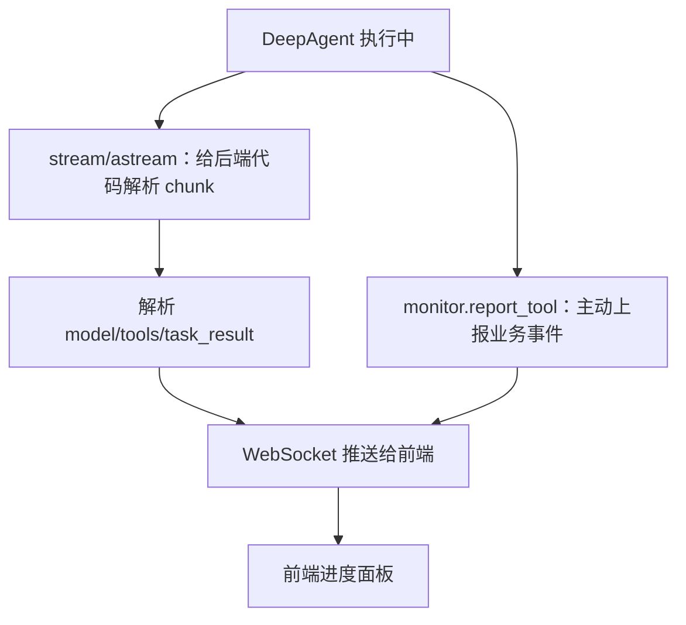
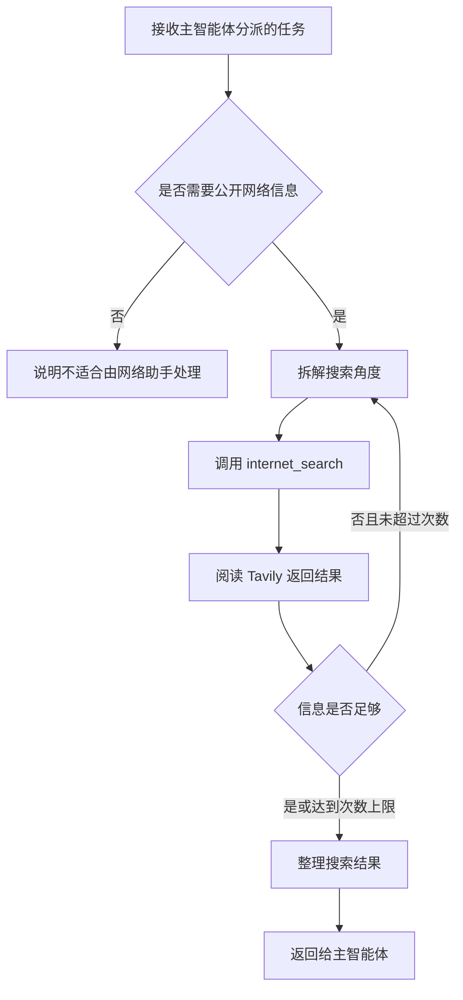

# 10 - 深度研搜：网络搜索子智能体与 Tavily 工具

<!-- TS-TRACK-BANNER -->
> **TS 生态对照（本仓库）**：深度研搜原项目偏 Python DeepAgents；TypeScript 对照请看 `examples/12-langgraph-multi-agent`、`examples/11-langgraph-tool-agent`、`examples/14-mcp`。

> **TypeScript 轨道说明**：中文讲解保留原教程；**代码块使用仓库内真实 TypeScript**（`examples/` / 精校案例 / `apps/shop-query-agent`），不再使用机翻 Python。
> 精校清单：[POLISHED-CASES](POLISHED-CASES.md)


## TypeScript 可运行示例（推荐）

本章优先对照仓库真实文件：`examples/12-langgraph-multi-agent/index.ts`

```typescript
// examples/12-langgraph-multi-agent/index.ts
/**
 * Maps to: 案例与源码-3-LangGraph框架/08-multi_agent
 * Python refs: SupervisorV0.3/V1.0.py, SupervisorHandoff.py
 *
 * Teaching version of supervisor + specialist workers (with step guard).
 */
import {
  AIMessage,
  HumanMessage,
  SystemMessage,
  type BaseMessage,
} from "@langchain/core/messages";
import {
  Annotation,
  END,
  START,
  StateGraph,
  messagesStateReducer,
} from "@langchain/langgraph";
import { z } from "zod";
import { createChatModel } from "../../src/shared/llm.js";
import { getWeatherTool, searchPolicyTool } from "../../src/shared/tools.js";
import { printRunHeader } from "../../src/shared/env.js";

const RouteSchema = z.object({
  next: z.enum(["weather", "policy", "FINISH"]),
  reason: z.string(),
});

const MultiAgentState = Annotation.Root({
  messages: Annotation<BaseMessage[]>({
    reducer: messagesStateReducer,
    default: () => [],
  }),
  next: Annotation<string>({
    reducer: (_prev, next) => next,
    default: () => "supervisor",
  }),
  steps: Annotation<number>({
    reducer: (_prev, next) => next,
    default: () => 0,
  }),
  visited: Annotation<string[]>({
    reducer: (prev, next) => Array.from(new Set([...prev, ...next])),
    default: () => [],
  }),
});

async function supervisorNode(state: typeof MultiAgentState.State) {
  // Safety: prevent infinite supervisor loops in demos.
  if (state.steps >= 4 || state.visited.length >= 2) {
    return {
      next: "FINISH",
      steps: state.steps + 1,
      messages: [new AIMessage("主管：信息已足够，结束本轮调度。")],
    };
  }

  const model = createChatModel(0).withStructuredOutput(RouteSchema);
  const decision = await model.invoke([
    new SystemMessage(
      [
        "你是主管 Agent，只负责路由。",
        "weather: 天气相关",
        "policy: 公司制度/报销/请假",
        "FINISH: 已有足够答案",
        `已访问专家: ${state.visited.join(", ") || "无"}`,
        "不要重复已访问专家。",
      ].join("\n"),
    ),
    ...state.messages,
  ]);

  // Avoid re-entering the same worker.
  let next = decision.next;
  if (next !== "FINISH" && state.visited.includes(next)) {
    next = "FINISH";
  }

  console.log("[supervisor]", { ...decision, next });
  return {
    next,
    steps: state.steps + 1,
    messages: [new AIMessage(`主管路由到：${next}（${decision.reason}）`)],
  };
}

async function weatherNode(state: typeof MultiAgentState.State) {
  const lastHuman = [...state.messages]
    .reverse()
    .find((m) => m.getType() === "human");
  const text = String(lastHuman?.content ?? "");
  const cityMatch = text.match(/北京|上海|深圳|杭州|广州/)?.[0] ?? "北京";
  const weather = await getWeatherTool.invoke({ city: cityMatch });
  return {
    next: "supervisor",
    visited: ["weather"],
    messages: [new AIMessage(`天气专员：${cityMatch} => ${weather}`)],
  };
}

async function policyNode(state: typeof MultiAgentState.State) {
  const lastHuman = [...state.messages]
    .reverse()
    .find((m) => m.getType() === "human");
  const text = String(lastHuman?.content ?? "报销");
  const keyword = /请假|加班|报销|设备/.exec(text)?.[0] ?? "报销";
  const policy = await searchPolicyTool.invoke({ keyword });

  const model = createChatModel(0);
  const polished = await model.invoke([
    new SystemMessage("你是制度专员，把检索结果整理成员工可执行答复。"),
    new HumanMessage(`用户问题：${text}\n检索结果：${policy}`),
  ]);

  return {
    next: "supervisor",
    visited: ["policy"],
    messages: [new AIMessage(`制度专员：${polished.content}`)],
  };
}

function routeFromSupervisor(state: typeof MultiAgentState.State) {
  if (state.next === "weather") return "weather";
  if (state.next === "policy") return "policy";
  return END;
}

function buildGraph() {
  return new StateGraph(MultiAgentState)
    .addNode("supervisor", supervisorNode)
    .addNode("weather", weatherNode)
    .addNode("policy", policyNode)
    .addEdge(START, "supervisor")
    .addConditionalEdges("supervisor", routeFromSupervisor, {
      weather: "weather",
      policy: "policy",
      [END]: END,
    })
    .addEdge("weather", "supervisor")
    .addEdge("policy", "supervisor")
    .compile();
}

async function main() {
  printRunHeader("12-langgraph-multi-agent | supervisor pattern");

  const app = buildGraph();
  const result = await app.invoke({
    messages: [
      new HumanMessage("我想了解差旅报销规则，另外顺便说下北京今天天气。"),
    ],
    next: "supervisor",
    steps: 0,
    visited: [],
  });

  console.log("\n===== transcript =====");
  for (const msg of result.messages) {
    console.log(`\n[${msg.getType()}] ${msg.content}`);
  }
}

main().catch((err) => {
  console.error(err);
  process.exit(1);
});
```

```bash
npx tsx examples/12-langgraph-multi-agent/index.ts
```


---

**本章课程目标：**

- 理解 DeepAgents 子智能体的三个核心组成：描述、提示词、工具。
- 完成 `internet_search` 工具封装，并接入 Tavily 搜索能力。
- 理解两种向前端推送进度的方式：流式解析和工具内部埋点。
- 组装 `network_search_agent`，让它成为主智能体后续可以调度的专家助手。

**学习建议：** 网络搜索助手是最适合入门的子智能体，因为它不涉及数据库结构，也不涉及 RAGFlow 的平台层级。读本章时重点看一个子智能体字典里到底放了什么：名称、职责描述、提示词、工具。能把 Tavily 换成别的搜索工具并说清要改哪里，就说明这章吃透了。

**对应代码分支：** `10-deepsearch-network-subagent`

---

从本章开始，我们正式进入子智能体实现阶段。整个「深度研搜」项目会陆续实现 3 个专家助手：

| 子智能体       | 负责内容                       | 本章是否实现 |
| -------------- | ------------------------------ | ------------ |
| 网络搜索助手   | 查询互联网公开资料和最新信息   | 是           |
| 数据库查询助手 | 查询企业内部结构化业务数据     | 否，下一章   |
| RAGFlow 助手   | 查询企业内部非结构化知识库文档 | 否，后续章节 |

网络搜索助手是第一个要写的子智能体。它的底层工具很简单：调用 Tavily，根据关键词搜索公开网页资料。

本章的重点是掌握子智能体的固定写法：

```text
子智能体 = 描述 description + 系统提示词 system_prompt + 工具 tools
```

这个套路学会以后，后面写数据库助手、RAGFlow 助手，思路就顺了：先写清职责边界，再给它能用的工具，最后组装成主智能体可以调度的配置。

---

## 1、网络搜索子智能体要写哪三件事

第 9 章已经讲过 `name`、`description`、`system_prompt` 的区别。本章不再重复定义概念，直接看它们落到网络搜索助手时应该怎么写。

### 1.1 description：写清“什么时候找我”

网络搜索助手的 `description` 要解决的是路由问题：主智能体看到用户任务后，能不能判断该不该把任务交给它。

比如用户问：

```text
查询 2025 年某医药政策的最新公开信息。
```

这类问题需要外部公开资料，应该交给网络搜索助手。

但如果用户问：

```text
查询公司数据库里布洛芬的库存。
```

这类问题属于内部业务数据，不应该交给网络搜索助手，而应该交给数据库查询助手。

所以这里的描述重点不是“我会搜索”，而是写清边界：**只处理互联网公开信息，不处理数据库数据，也不处理 RAGFlow 私有知识库内容。**

### 1.2 system_prompt：写清“怎么搜索”

`system_prompt` 要约束网络搜索助手自己的执行方式。对这个助手来说，最重要的是两件事：搜索要有覆盖面，搜索次数要有上限。

| 约束                | 作用                       |
| ------------------- | -------------------------- |
| 至少从 3 个角度检索 | 避免只搜一个关键词就结束   |
| 最多搜索 5 次       | 避免无限调用工具造成死循环 |

这两个限制放在提示词里，比只写“请认真搜索”更可靠。前者能提醒模型换关键词、换角度查资料，后者能避免它在结果不理想时反复调用工具。

### 1.3 tools：接入真正的搜索能力

`description` 和 `system_prompt` 只负责告诉模型“该不该做”和“怎么做”，真正访问互联网还要靠工具。

本章给网络搜索助手配置一个工具：

| 工具名            | 作用                                               |
| ----------------- | -------------------------------------------------- |
| `internet_search` | 使用 Tavily 查询互联网公开信息，返回结构化搜索结果 |

后面主智能体调用网络搜索助手时，网络搜索助手会再调用 `internet_search`，由 Tavily 完成真实网页检索。

---

## 2、完善 prompts.yml 中的网络助手配置

项目对应文件路径：`deepsearch-agents/app/prompt/prompts.yml`

在第 9 章，我们已经把提示词放进 YAML 文件统一管理。现在先补全网络搜索助手的配置。

```yaml
# DeepAgents 提示词配置：集中管理主智能体和各子智能体的名称、路由描述与系统提示词
# 主智能体读取 description 做任务分派，子智能体读取 system_prompt 约束自己的执行方式

# 子智能体配置：description 给主智能体判断是否调用，system_prompt 给子智能体约束执行方式
sub_agents:
  # 网络搜索助手只处理互联网公开信息；数据库和 RAGFlow 私有知识库由其他助手负责
  tavily:
    name: "网络搜索助手"
    description: |
      负责进行网络知识搜索的智能体助手，当需要从网络中查询数据的时候，可以执行数据检索，在检索后会返回一段检索结果。
      注意：在需要进行非内部信息，不是数据库数据和 RAGFlow 知识库数据的公开信息查询时，务必使用此助手进行查询。
    system_prompt: |
      你是一个专业的网络信息查询助手，你可以根据用户的问题，从互联网中检索相关信息。
      你掌握的工具包括 internet_search 工具，此工具可以根据用户的问题，从互联网中检索非内部的公开信息。
      在检索网络知识的时候，至少检索 3 个角度的该问题，一共最多进行 5 次检索，如果超过 5 次，则不允许继续检索。
```

读这段配置时，先抓住一个边界：**网络搜索助手只负责外部公开信息。** 用户问数据库里的药品销量，应该交给数据库助手；用户问企业内部手册、制度、文档，应该交给 RAGFlow 助手。边界写清楚，后面主智能体调度才会稳定。

---

## 3、准备 Tavily 配置

### 3.1 .env 中加入 Tavily Key

项目对应文件路径：`deepsearch-agents/.env`

添加 Tavily 配置：

```dotenv
TAVILY_API_KEY=your-tavily-api-key
```

这里的 Key 需要先到 Tavily 控制台注册并创建。浏览器打开：https://app.tavily.com/home

注册或登录后，在控制台中创建 API Key，再把生成的 Key 填到 `.env` 的 `TAVILY_API_KEY` 后面。

### 3.2 为什么使用 Tavily

Tavily 是面向大模型使用的搜索 API，它返回的结果通常已经整理成结构化字段，比较适合 Agent 继续阅读和总结。

在这个项目里，网络搜索助手主要用它处理这些任务：

- 查询公开资料；
- 查询最新新闻或政策；
- 查询外部背景信息；
- 给主智能体补充企业内部资料之外的上下文。

---

## 4、实现并验证 internet_search 工具

项目对应文件路径：`deepsearch-agents/app/tools/tavily_tool.ts`

完整工具可以先按五段理解：

1. 导入依赖和加载 `.env`。
2. 创建 `TavilyClient`。
3. 用 `@tool` 把普通函数注册成 Agent 可以调用的工具。
4. 在工具内部调用 `monitor.report_tool(...)`，把搜索参数推给前端。
5. 提供 `__main__` 本地调试入口，方便先验证 Key 和 Tavily API 是否可用。

核心代码如下：

```typescript
// Real TypeScript from repo: examples/12-langgraph-multi-agent/index.ts
/**
 * Maps to: 案例与源码-3-LangGraph框架/08-multi_agent
 * Python refs: SupervisorV0.3/V1.0.py, SupervisorHandoff.py
 *
 * Teaching version of supervisor + specialist workers (with step guard).
 */
import {
  AIMessage,
  HumanMessage,
  SystemMessage,
  type BaseMessage,
} from "@langchain/core/messages";
import {
  Annotation,
  END,
  START,
  StateGraph,
  messagesStateReducer,
} from "@langchain/langgraph";
import { z } from "zod";
import { createChatModel } from "../../src/shared/llm.js";
import { getWeatherTool, searchPolicyTool } from "../../src/shared/tools.js";
import { printRunHeader } from "../../src/shared/env.js";

const RouteSchema = z.object({
  next: z.enum(["weather", "policy", "FINISH"]),
  reason: z.string(),
});

const MultiAgentState = Annotation.Root({
  messages: Annotation<BaseMessage[]>({
    reducer: messagesStateReducer,
    default: () => [],
  }),
  next: Annotation<string>({
    reducer: (_prev, next) => next,
    default: () => "supervisor",
  }),
  steps: Annotation<number>({
    reducer: (_prev, next) => next,
    default: () => 0,
  }),
  visited: Annotation<string[]>({
    reducer: (prev, next) => Array.from(new Set([...prev, ...next])),
    default: () => [],
  }),
});

async function supervisorNode(state: typeof MultiAgentState.State) {
  // Safety: prevent infinite supervisor loops in demos.
  if (state.steps >= 4 || state.visited.length >= 2) {
    return {
      next: "FINISH",
      steps: state.steps + 1,
      messages: [new AIMessage("主管：信息已足够，结束本轮调度。")],
    };
  }

  const model = createChatModel(0).withStructuredOutput(RouteSchema);
  const decision = await model.invoke([
    new SystemMessage(
      [
        "你是主管 Agent，只负责路由。",
        "weather: 天气相关",
        "policy: 公司制度/报销/请假",
        "FINISH: 已有足够答案",
        `已访问专家: ${state.visited.join(", ") || "无"}`,
        "不要重复已访问专家。",
      ].join("\n"),
    ),
    ...state.messages,
  ]);

  // Avoid re-entering the same worker.
  let next = decision.next;
  if (next !== "FINISH" && state.visited.includes(next)) {
    next = "FINISH";
  }

  console.log("[supervisor]", { ...decision, next });
  return {
    next,
    steps: state.steps + 1,
    messages: [new AIMessage(`主管路由到：${next}（${decision.reason}）`)],
  };
}

async function weatherNode(state: typeof MultiAgentState.State) {
  const lastHuman = [...state.messages]
    .reverse()
    .find((m) => m.getType() === "human");
  const text = String(lastHuman?.content ?? "");
  const cityMatch = text.match(/北京|上海|深圳|杭州|广州/)?.[0] ?? "北京";
  const weather = await getWeatherTool.invoke({ city: cityMatch });
  return {
    next: "supervisor",
    visited: ["weather"],
    messages: [new AIMessage(`天气专员：${cityMatch} => ${weather}`)],
  };
}

async function policyNode(state: typeof MultiAgentState.State) {
  const lastHuman = [...state.messages]
    .reverse()
    .find((m) => m.getType() === "human");
  const text = String(lastHuman?.content ?? "报销");
  const keyword = /请假|加班|报销|设备/.exec(text)?.[0] ?? "报销";
  const policy = await searchPolicyTool.invoke({ keyword });

  const model = createChatModel(0);
  const polished = await model.invoke([
    new SystemMessage("你是制度专员，把检索结果整理成员工可执行答复。"),
    new HumanMessage(`用户问题：${text}\n检索结果：${policy}`),
  ]);

  return {
    next: "supervisor",
    visited: ["policy"],
    messages: [new AIMessage(`制度专员：${polished.content}`)],
  };
}

function routeFromSupervisor(state: typeof MultiAgentState.State) {
  if (state.next === "weather") return "weather";
  if (state.next === "policy") return "policy";
  return END;
}

function buildGraph() {
  return new StateGraph(MultiAgentState)
    .addNode("supervisor", supervisorNode)
    .addNode("weather", weatherNode)
    .addNode("policy", policyNode)
    .addEdge(START, "supervisor")
    .addConditionalEdges("supervisor", routeFromSupervisor, {
      weather: "weather",
      policy: "policy",
      [END]: END,
    })
    .addEdge("weather", "supervisor")
    .addEdge("policy", "supervisor")
    .compile();
}

async function main() {
  printRunHeader("12-langgraph-multi-agent | supervisor pattern");

  const app = buildGraph();
  const result = await app.invoke({
    messages: [
      new HumanMessage("我想了解差旅报销规则，另外顺便说下北京今天天气。"),
    ],
    next: "supervisor",
    steps: 0,
    visited: [],
  });

  console.log("\n===== transcript =====");
  for (const msg of result.messages) {
    console.log(`\n[${msg.getType()}] ${msg.content}`);
  }
}

main().catch((err) => {
  console.error(err);
  process.exit(1);
});
```

### 4.1 参数说明

| 参数                  | 说明                                         |
| --------------------- | -------------------------------------------- |
| `query`               | 搜索关键词或搜索问题                         |
| `topic`               | 搜索主题，可选 `general`、`news`、`finance`  |
| `max_results`         | 最多返回多少条结果，本项目默认 5 条          |
| `include_raw_content` | 是否返回更完整的原始内容，默认只返回精简内容 |

对 Agent 来说，函数参数和函数说明都很重要。`@tool` 会把这些信息暴露给模型，模型会根据说明决定怎么填参数。

### 4.2 Tavily 返回结果长什么样

`internet_search` 返回的不是一句自然语言，而是 Tavily API 的结构化结果。

可以先把它理解成下面这种结构：

```json
{
  "query": "2026 年 AI 行业政策",
  "results": [
    {
      "title": "网页标题",
      "url": "https://example.com/article",
      "content": "搜索结果摘要或正文片段",
      "score": 0.91,
      "raw_content": "更完整的网页原文内容"
    }
  ]
}
```

其中最常用的是：

| 字段          | 作用                                                    |
| ------------- | ------------------------------------------------------- |
| `query`       | 本次真实提交给 Tavily 的搜索问题                        |
| `results`     | 搜索结果列表                                            |
| `title`       | 网页标题，帮助模型快速判断来源主题                      |
| `url`         | 原始网页地址，方便后续追溯来源                          |
| `content`     | Tavily 提取出的摘要内容，是模型主要阅读的信息           |
| `score`       | 搜索结果相关性分数，可用于判断结果是否贴近问题          |
| `raw_content` | 原始正文内容，只有打开 `include_raw_content` 时才更完整 |

这就是为什么本项目使用 Tavily，而不是让模型直接“想象网页内容”。工具返回的是可追溯的数据：模型可以阅读 `content`，必要时保留 `url`，主智能体后面整理报告时也能知道信息来自哪里。

学习阶段建议 `max_results` 保持 5，`include_raw_content` 先保持 `False`。等你发现摘要信息不够，再打开原文内容，否则返回文本太长，会增加子智能体阅读成本。

### 4.3 实际运行输出怎么读

在项目根目录运行：`npx tsx npx tsx app.tools.tavily_tool`

一次真实输出会先看到工具监控事件：

```text
[Monitor:tool_start] 开始执行工具: 网络搜索工具
```

这说明 `internet_search` 里的 `monitor.report_tool(...)` 已经生效：工具真正请求 Tavily 之前，先把“网络搜索工具开始执行”这件事汇报给监控模块。后面接着才是 Tavily 返回的搜索结果。

下面是把实际输出压缩后的结构，重点看字段，不需要把很长的网页正文都放进教程或报告里：

```typescript
// Real TypeScript from repo: examples/11-langgraph-tool-agent/index.ts
/**
 * Maps to LangGraph tool-calling agent pattern
 * (course chapters 21-24: agent loop as a graph)
 */
import {
  AIMessage,
  HumanMessage,
  SystemMessage,
  ToolMessage,
  type BaseMessage,
} from "@langchain/core/messages";
import { tool } from "@langchain/core/tools";
import { Annotation, END, START, StateGraph, messagesStateReducer } from "@langchain/langgraph";
import { z } from "zod";
import { createChatModel } from "../../src/shared/llm.js";
import { addNumberTool, getWeatherTool } from "../../src/shared/tools.js";
import { printRunHeader } from "../../src/shared/env.js";

const tools = [addNumberTool, getWeatherTool];
const toolsByName = Object.fromEntries(tools.map((t) => [t.name, t]));
void toolsByName;

const AgentState = Annotation.Root({
  messages: Annotation<BaseMessage[]>({
    reducer: messagesStateReducer,
    default: () => [],
  }),
});

async function agentNode(state: typeof AgentState.State) {
  const model = createChatModel(0).bindTools(tools);
  const response = await model.invoke([
    new SystemMessage(
      "你是工具增强助手。需要计算或查天气时必须调用工具，不要编造。",
    ),
    ...state.messages,
  ]);
  return { messages: [response] };
}

async function toolNode(state: typeof AgentState.State) {
  const last = state.messages[state.messages.length - 1];
  if (!(last instanceof AIMessage) || !last.tool_calls?.length) {
    return { messages: [] };
  }

  const outputs: ToolMessage[] = [];
  for (const call of last.tool_calls) {
    let observation: string;
    if (call.name === "add_number") {
      observation = String(
        await addNumberTool.invoke(call.args as { a: number; b: number }),
      );
    } else if (call.name === "get_weather") {
      observation = String(
        await getWeatherTool.invoke(call.args as { city: string }),
      );
    } else {
      observation = `Unknown tool: ${call.name}`;
    }
    outputs.push(
      new ToolMessage({
        content: observation,
        tool_call_id: call.id ?? call.name,
      }),
    );
  }
  return { messages: outputs };
}

function shouldContinue(state: typeof AgentState.State) {
  const last = state.messages[state.messages.length - 1];
  if (last instanceof AIMessage && last.tool_calls?.length) {
    return "tools";
  }
  return END;
}

function buildGraph() {
  return new StateGraph(AgentState)
    .addNode("agent", agentNode)
    .addNode("tools", toolNode)
    .addEdge(START, "agent")
    .addConditionalEdges("agent", shouldContinue, {
      tools: "tools",
      [END]: END,
    })
    .addEdge("tools", "agent")
    .compile();
}

async function main() {
  printRunHeader("11-langgraph-tool-agent | manual ReAct graph");

  // tiny local tool to show schema flexibility
  const echo = tool(async ({ text }) => `echo:${text}`, {
    name: "echo",
    description: "Echo text",
    schema: z.object({ text: z.string() }),
  });
  void echo;

  const app = buildGraph();
  const result = await app.invoke({
    messages: [
      new HumanMessage("请计算 8+15，并告诉我北京天气，最后中文总结。"),
    ],
  });

  for (const msg of result.messages) {
    console.log(`\n[${msg.getType()}]`, msg.content);
    if (msg instanceof AIMessage && msg.tool_calls?.length) {
      console.log(" tool_calls:", JSON.stringify(msg.tool_calls, null, 2));
    }
  }
}

main().catch((err) => {
  console.error(err);
  process.exit(1);
});
```

这段输出里有几个很值得注意的点：

| 现象                                               | 说明                                                              |
| -------------------------------------------------- | ----------------------------------------------------------------- |
| `answer` 是 `None`                                 | 当前调用主要拿搜索结果列表，不依赖 Tavily 直接生成最终答案        |
| `follow_up_questions` 是 `None`、`images` 是空列表 | 本次搜索没有返回追问建议和图片，这不是报错                        |
| `request_id` 有值                                  | 每次 Tavily 请求的追踪 ID，排查接口问题时有用                     |
| `response_time` 是 `0.75`                          | 本次请求大约 0.75 秒返回，可以粗略观察搜索耗时                    |
| `results` 返回 5 条                                | 对应工具默认的 `max_results=5`                                    |
| `raw_content` 是 `None`                            | 因为默认 `include_raw_content=False`，所以主要阅读 `content` 摘要 |
| `score` 从高到低变化                               | 可以辅助判断相关性，但不能替代来源判断                            |

还要特别注意：搜索结果不等于最终答案。上面这次搜索中，前两条是政府相关来源，后面也混入了旅游网站、便民查询站等页面。网络搜索助手在总结时，应该优先阅读标题、URL 和相关性分数都更可靠的结果；对于明显广告化、聚合站或主题偏离的结果，要降低权重，必要时换关键词继续搜索。

---

## 5、进度上报：monitor 与 stream

### 5.1 为什么工具里要调用 monitor

第 9 章已经写过 `monitor.ts`。它的作用是把工具调用、子智能体调用和任务结果推给前端。

这里把埋点写在工具内部：

```typescript
// Real TypeScript from repo: examples/09-agent/index.ts
/**
 * Maps to: 案例与源码-2-LangChain框架/12-agent
 * Python refs: AgentSmartSelectV1.0.py, AgentReact.py
 *
 * Modern LangChain JS path: createReactAgent (tool-calling ReAct loop).
 */
import { HumanMessage } from "@langchain/core/messages";
import { tool } from "@langchain/core/tools";
import { createReactAgent } from "@langchain/langgraph/prebuilt";
import { z } from "zod";
import { createChatModel } from "../../src/shared/llm.js";
import { basicTools } from "../../src/shared/tools.js";
import { printRunHeader } from "../../src/shared/env.js";

const PRODUCT_DATABASE: Record<
  string,
  Array<{ id: string; name: string; popularity: number; price: number }>
> = {
  无线耳机: [
    { id: "WH-1000XM5", name: "索尼 WH-1000XM5", popularity: 95, price: 299 },
    { id: "QC45", name: "Bose QuietComfort 45", popularity: 88, price: 329 },
  ],
  游戏鼠标: [
    { id: "GPW", name: "罗技 G Pro 无线", popularity: 90, price: 129 },
    { id: "VIPER", name: "雷蛇 Viper V2 Pro", popularity: 87, price: 149 },
  ],
};

const INVENTORY: Record<string, { stock: number; location: string }> = {
  "WH-1000XM5": { stock: 10, location: "仓库-A" },
  QC45: { stock: 0, location: "仓库-B" },
  GPW: { stock: 8, location: "仓库-C" },
  VIPER: { stock: 12, location: "仓库-A" },
};

const searchProductsTool = tool(
  async ({ query }) => {
    const category = Object.keys(PRODUCT_DATABASE).find((c) => query.includes(c));
    if (!category) return `未找到与「${query}」匹配的产品类别`;
    const items = [...PRODUCT_DATABASE[category]].sort(
      (a, b) => b.popularity - a.popularity,
    );
    return items
      .map(
        (p, i) =>
          `${i + 1}. ${p.name} (ID:${p.id}) 热度${p.popularity} ￥${p.price}`,
      )
      .join("\n");
  },
  {
    name: "search_products",
    description: "按类别搜索产品，如无线耳机、游戏鼠标",
    schema: z.object({ query: z.string() }),
  },
);

const checkInventoryTool = tool(
  async ({ productId }) => {
    const info = INVENTORY[productId];
    if (!info) return `未找到产品ID: ${productId}`;
    const status = info.stock > 0 ? "有库存" : "缺货";
    return `${productId}: ${status} (${info.stock}) @ ${info.location}`;
  },
  {
    name: "check_inventory",
    description: "根据产品 ID 查询库存",
    schema: z.object({ productId: z.string() }),
  },
);

async function runMathWeatherAgent() {
  printRunHeader("09-agent | tool agent (math + weather)");
  const agent = createReactAgent({
    llm: createChatModel(0),
    tools: basicTools,
  });

  const result = await agent.invoke({
    messages: [
      new HumanMessage("请计算 45+17，并查询深圳天气，最后用中文给一个简短总结。"),
    ],
  });

  const last = result.messages[result.messages.length - 1];
  console.log("[final]", last.content);
}

async function runReactShopAgent() {
  printRunHeader("09-agent | ReAct shop agent (search + inventory)");
  const agent = createReactAgent({
    llm: createChatModel(0),
    tools: [searchProductsTool, checkInventoryTool],
  });

  const result = await agent.invoke({
    messages: [
      new HumanMessage(
        "帮我找最受欢迎的无线耳机，并检查第一名的库存，用中文给出购买建议。",
      ),
    ],
  });

  for (const msg of result.messages) {
    const role = msg.getType?.() ?? msg.constructor.name;
    console.log(`\n[${role}]`, msg.content);
  }
}

async function main() {
  await runMathWeatherAgent();
  await runReactShopAgent();
}

main().catch((err) => {
  console.error(err);
  process.exit(1);
});
```

只要 Agent 调用了 `internet_search`，前端就能看到“正在调用网络搜索工具”，并且能看到这次搜索的参数。

这一行代码先解决工具级进度。网络搜索助手是第一个子智能体，还没有进入完整的主智能体接口和前端联调阶段，所以先让工具自己汇报进度，链路最短，也最容易验证。

### 5.2 两种向前端推送进度的方式

这里要解决一个工程问题：Agent 执行过程可能比较长，前端不能一直等最终答案。后端需要在中间步骤里不断推送消息，例如：

```text
正在调用网络搜索助手
正在执行网络搜索工具
搜索参数是什么
任务执行完成
```

本项目里会同时遇到两类“流”：



`stream/astream` 更偏框架运行状态，适合后端判断模型、工具和子智能体调用；`monitor` 更偏业务展示事件，适合把“正在搜索什么”这种人能看懂的消息推给前端。两者配合起来，页面既能看到 Agent 的真实执行过程，也能看到更友好的业务说明。

这个项目里，向前端推送进度大体有两种做法。

**方式一：在 stream 流式输出里统一解析**

DeepAgents 底层是图执行逻辑，所以主智能体可以用 `stream` / `astream` 流式执行。流式执行时，后端不是等整个任务结束，而是不断拿到一个个 `chunk`：

```text
主智能体开始执行
  -> stream 产出 chunk
  -> 后端判断这个 chunk 代表什么事件
  -> 如果是调用工具，就推送 tool 事件
  -> 如果是调用子智能体，就推送 assistant 事件
  -> 前端实时展示进度
```

可以先看一个简化版伪代码。这里的 `is_tool_call_chunk`、`is_sub_agent_chunk` 只是为了说明判断思路，不是本章要直接复制的真实函数：

```typescript
// Real TypeScript from repo: examples/14-mcp/client-agent.ts
/**
 * Maps to: 案例与源码-2-LangChain框架/11-mcp/McpClientAgent.py
 *
 * Flow:
 * 1) spawn local MCP server over stdio
 * 2) list MCP tools
 * 3) wrap tools as LangChain tools
 * 4) run createReactAgent once with a user question
 */
import { dirname, join } from "node:path";
import { fileURLToPath } from "node:url";
import { Client } from "@modelcontextprotocol/sdk/client/index.js";
import { StdioClientTransport } from "@modelcontextprotocol/sdk/client/stdio.js";
import { DynamicStructuredTool } from "@langchain/core/tools";
import { HumanMessage } from "@langchain/core/messages";
import { createReactAgent } from "@langchain/langgraph/prebuilt";
import { z } from "zod";
import { createChatModel } from "../../src/shared/llm.js";
import { printRunHeader } from "../../src/shared/env.js";

const __dirname = dirname(fileURLToPath(import.meta.url));
const serverPath = join(__dirname, "server.ts");

function jsonSchemaToZod(inputSchema: unknown): z.ZodObject<z.ZodRawShape> {
  const schema = (inputSchema ?? {}) as {
    type?: string;
    properties?: Record<string, { type?: string; description?: string }>;
    required?: string[];
  };
  const shape: z.ZodRawShape = {};
  const required = new Set(schema.required ?? []);
  for (const [key, prop] of Object.entries(schema.properties ?? {})) {
    let field: z.ZodTypeAny =
      prop.type === "number" || prop.type === "integer"
        ? z.number()
        : prop.type === "boolean"
          ? z.boolean()
          : z.string();
    if (prop.description) field = field.describe(prop.description);
    if (!required.has(key)) field = field.optional();
    shape[key] = field;
  }
  return z.object(shape);
}

function textFromMcpResult(result: {
  content?: Array<{ type: string; text?: string }>;
}): string {
  if (!result.content?.length) return JSON.stringify(result);
  return result.content
    .map((c) => (c.type === "text" ? (c.text ?? "") : JSON.stringify(c)))
    .join("\n");
}

async function main() {
  printRunHeader("14-mcp | MCP server tools -> LangChain Agent");

  const transport = new StdioClientTransport({
    command: process.platform === "win32" ? "npx.cmd" : "npx",
    args: ["tsx", serverPath],
    stderr: "pipe",
  });

  const client = new Client({ name: "mcp-demo-client", version: "0.1.0" });
  await client.connect(transport);

  try {
    const listed = await client.listTools();
    console.log(
      "MCP tools:",
      listed.tools.map((t) => t.name).join(", ") || "(none)",
    );

    const resources = await client.listResources();
    console.log(
      "MCP resources:",
      resources.resources.map((r) => r.uri).join(", ") || "(none)",
    );

    const lcTools = listed.tools.map((mcpTool) => {
      const schema = jsonSchemaToZod(mcpTool.inputSchema);
      return new DynamicStructuredTool({
        name: mcpTool.name,
        description: mcpTool.description || mcpTool.name,
        schema,
        func: async (input) => {
          const result = await client.callTool({
            name: mcpTool.name,
            arguments: input as Record<string, unknown>,
          });
          return textFromMcpResult(
            result as { content?: Array<{ type: string; text?: string }> },
          );
        },
      });
    });

    if (!lcTools.length) {
      throw new Error("No MCP tools available");
    }

    const agent = createReactAgent({
      llm: createChatModel(0),
      tools: lcTools,
    });

    const question =
      process.argv.slice(2).join(" ") ||
      "请计算 19+26，并查询上海天气，用中文简短总结。";
    console.log("\n[question]", question);

    const result = await agent.invoke({
      messages: [new HumanMessage(question)],
    });

    const last = result.messages[result.messages.length - 1];
    console.log("\n[final]", last.content);
  } finally {
    await client.close();
    await transport.close();
  }
}

main().catch((err) => {
  console.error(err);
  process.exit(1);
});
```

这种做法的好处是：**所有进度都在主执行循环里统一处理**。后续如果前端要做更完整的执行时间线，比如“主智能体 -> 子智能体 -> 工具 -> 返回结果”，流式解析会更集中。但它有一个容易踩坑的地方：如果只对主智能体做普通流式输出，默认更容易看到主智能体这一层的事件；子智能体内部又调用了哪些工具，不一定都会出现在主智能体的流式结果里。

所以如果希望把子智能体内部执行过程也拿出来，就要注意开启子图流式输出：

```typescript
// Real TypeScript from repo: examples/12-langgraph-multi-agent/index.ts
/**
 * Maps to: 案例与源码-3-LangGraph框架/08-multi_agent
 * Python refs: SupervisorV0.3/V1.0.py, SupervisorHandoff.py
 *
 * Teaching version of supervisor + specialist workers (with step guard).
 */
import {
  AIMessage,
  HumanMessage,
  SystemMessage,
  type BaseMessage,
} from "@langchain/core/messages";
import {
  Annotation,
  END,
  START,
  StateGraph,
  messagesStateReducer,
} from "@langchain/langgraph";
import { z } from "zod";
import { createChatModel } from "../../src/shared/llm.js";
import { getWeatherTool, searchPolicyTool } from "../../src/shared/tools.js";
import { printRunHeader } from "../../src/shared/env.js";

const RouteSchema = z.object({
  next: z.enum(["weather", "policy", "FINISH"]),
  reason: z.string(),
});

const MultiAgentState = Annotation.Root({
  messages: Annotation<BaseMessage[]>({
    reducer: messagesStateReducer,
    default: () => [],
  }),
  next: Annotation<string>({
    reducer: (_prev, next) => next,
    default: () => "supervisor",
  }),
  steps: Annotation<number>({
    reducer: (_prev, next) => next,
    default: () => 0,
  }),
  visited: Annotation<string[]>({
    reducer: (prev, next) => Array.from(new Set([...prev, ...next])),
    default: () => [],
  }),
});

async function supervisorNode(state: typeof MultiAgentState.State) {
  // Safety: prevent infinite supervisor loops in demos.
  if (state.steps >= 4 || state.visited.length >= 2) {
    return {
      next: "FINISH",
      steps: state.steps + 1,
      messages: [new AIMessage("主管：信息已足够，结束本轮调度。")],
    };
  }

  const model = createChatModel(0).withStructuredOutput(RouteSchema);
  const decision = await model.invoke([
    new SystemMessage(
      [
        "你是主管 Agent，只负责路由。",
        "weather: 天气相关",
        "policy: 公司制度/报销/请假",
        "FINISH: 已有足够答案",
        `已访问专家: ${state.visited.join(", ") || "无"}`,
        "不要重复已访问专家。",
      ].join("\n"),
    ),
    ...state.messages,
  ]);

  // Avoid re-entering the same worker.
  let next = decision.next;
  if (next !== "FINISH" && state.visited.includes(next)) {
    next = "FINISH";
  }

  console.log("[supervisor]", { ...decision, next });
  return {
    next,
    steps: state.steps + 1,
    messages: [new AIMessage(`主管路由到：${next}（${decision.reason}）`)],
  };
}

async function weatherNode(state: typeof MultiAgentState.State) {
  const lastHuman = [...state.messages]
    .reverse()
    .find((m) => m.getType() === "human");
  const text = String(lastHuman?.content ?? "");
  const cityMatch = text.match(/北京|上海|深圳|杭州|广州/)?.[0] ?? "北京";
  const weather = await getWeatherTool.invoke({ city: cityMatch });
  return {
    next: "supervisor",
    visited: ["weather"],
    messages: [new AIMessage(`天气专员：${cityMatch} => ${weather}`)],
  };
}

async function policyNode(state: typeof MultiAgentState.State) {
  const lastHuman = [...state.messages]
    .reverse()
    .find((m) => m.getType() === "human");
  const text = String(lastHuman?.content ?? "报销");
  const keyword = /请假|加班|报销|设备/.exec(text)?.[0] ?? "报销";
  const policy = await searchPolicyTool.invoke({ keyword });

  const model = createChatModel(0);
  const polished = await model.invoke([
    new SystemMessage("你是制度专员，把检索结果整理成员工可执行答复。"),
    new HumanMessage(`用户问题：${text}\n检索结果：${policy}`),
  ]);

  return {
    next: "supervisor",
    visited: ["policy"],
    messages: [new AIMessage(`制度专员：${polished.content}`)],
  };
}

function routeFromSupervisor(state: typeof MultiAgentState.State) {
  if (state.next === "weather") return "weather";
  if (state.next === "policy") return "policy";
  return END;
}

function buildGraph() {
  return new StateGraph(MultiAgentState)
    .addNode("supervisor", supervisorNode)
    .addNode("weather", weatherNode)
    .addNode("policy", policyNode)
    .addEdge(START, "supervisor")
    .addConditionalEdges("supervisor", routeFromSupervisor, {
      weather: "weather",
      policy: "policy",
      [END]: END,
    })
    .addEdge("weather", "supervisor")
    .addEdge("policy", "supervisor")
    .compile();
}

async function main() {
  printRunHeader("12-langgraph-multi-agent | supervisor pattern");

  const app = buildGraph();
  const result = await app.invoke({
    messages: [
      new HumanMessage("我想了解差旅报销规则，另外顺便说下北京今天天气。"),
    ],
    next: "supervisor",
    steps: 0,
    visited: [],
  });

  console.log("\n===== transcript =====");
  for (const msg of result.messages) {
    console.log(`\n[${msg.getType()}] ${msg.content}`);
  }
}

main().catch((err) => {
  console.error(err);
  process.exit(1);
});
```

可以把它理解成一句话：**子智能体也是一张子图，只有把子图也纳入流式输出，后端才更容易从 chunk 里观察到子智能体内部的工具调用过程。**

**方式二：在工具内部直接埋点**

第二种做法更直接：不等外层 stream 去解析，工具一被调用，就在工具函数内部主动上报。

本章采用的就是这种方式。它的逻辑很简单：

```text
Agent 调用 internet_search
  -> internet_search 内部先调用 monitor.report_tool
  -> monitor 根据当前 thread_id 找到对应前端连接
  -> WebSocket 把“正在执行网络搜索工具”推给前端
  -> 工具继续调用 Tavily，返回搜索结果
```

它的优点是稳定、直观，并且和 chunk 结构解耦。只要这个工具真的被调用了，它就会自己推送一条进度。

它的代价是：每个工具都要主动写一行类似的埋点代码。如果工具很多，就要保持统一规范，比如工具名怎么写、参数要不要脱敏、前端展示什么字段。

两种方式可以这样对比：

| 方案            | 核心做法                                         | 优点                             | 注意事项                                                       |
| --------------- | ------------------------------------------------ | -------------------------------- | -------------------------------------------------------------- |
| stream 流式解析 | 在主智能体 `stream` / `astream` 循环里解析 chunk | 统一入口，适合构建完整执行时间线 | 子智能体内部过程需要关注 `subgraphs=True`，还要解析 chunk 结构 |
| 工具内部埋点    | 在每个工具函数里调用 `monitor.report_tool(...)`  | 简单直接，工具被调用就能推送     | 每个工具都要写埋点，并保持事件格式一致                         |

本项目后续会两种方式都用到：调用子智能体这类“调度层事件”，更适合在主智能体流式执行过程中识别；具体工具被调用这类“工具层事件”，可以直接在工具内部埋点。本章先从 `internet_search` 开始做工具埋点，是为了让第一条前端进度链路先跑通。

---

## 6、组装 network_search_agent

工具写完以后，就可以把它和提示词配置组装成子智能体。

项目对应文件路径：`deepsearch-agents/app/agent/subagents/network_search_agent.ts`

这个文件只做一件事：把 YAML 里的网络助手配置和 `internet_search` 工具组装成 DeepAgents 认识的字典。

```typescript
// Real TypeScript from repo: examples/11-langgraph-tool-agent/index.ts
/**
 * Maps to LangGraph tool-calling agent pattern
 * (course chapters 21-24: agent loop as a graph)
 */
import {
  AIMessage,
  HumanMessage,
  SystemMessage,
  ToolMessage,
  type BaseMessage,
} from "@langchain/core/messages";
import { tool } from "@langchain/core/tools";
import { Annotation, END, START, StateGraph, messagesStateReducer } from "@langchain/langgraph";
import { z } from "zod";
import { createChatModel } from "../../src/shared/llm.js";
import { addNumberTool, getWeatherTool } from "../../src/shared/tools.js";
import { printRunHeader } from "../../src/shared/env.js";

const tools = [addNumberTool, getWeatherTool];
const toolsByName = Object.fromEntries(tools.map((t) => [t.name, t]));
void toolsByName;

const AgentState = Annotation.Root({
  messages: Annotation<BaseMessage[]>({
    reducer: messagesStateReducer,
    default: () => [],
  }),
});

async function agentNode(state: typeof AgentState.State) {
  const model = createChatModel(0).bindTools(tools);
  const response = await model.invoke([
    new SystemMessage(
      "你是工具增强助手。需要计算或查天气时必须调用工具，不要编造。",
    ),
    ...state.messages,
  ]);
  return { messages: [response] };
}

async function toolNode(state: typeof AgentState.State) {
  const last = state.messages[state.messages.length - 1];
  if (!(last instanceof AIMessage) || !last.tool_calls?.length) {
    return { messages: [] };
  }

  const outputs: ToolMessage[] = [];
  for (const call of last.tool_calls) {
    let observation: string;
    if (call.name === "add_number") {
      observation = String(
        await addNumberTool.invoke(call.args as { a: number; b: number }),
      );
    } else if (call.name === "get_weather") {
      observation = String(
        await getWeatherTool.invoke(call.args as { city: string }),
      );
    } else {
      observation = `Unknown tool: ${call.name}`;
    }
    outputs.push(
      new ToolMessage({
        content: observation,
        tool_call_id: call.id ?? call.name,
      }),
    );
  }
  return { messages: outputs };
}

function shouldContinue(state: typeof AgentState.State) {
  const last = state.messages[state.messages.length - 1];
  if (last instanceof AIMessage && last.tool_calls?.length) {
    return "tools";
  }
  return END;
}

function buildGraph() {
  return new StateGraph(AgentState)
    .addNode("agent", agentNode)
    .addNode("tools", toolNode)
    .addEdge(START, "agent")
    .addConditionalEdges("agent", shouldContinue, {
      tools: "tools",
      [END]: END,
    })
    .addEdge("tools", "agent")
    .compile();
}

async function main() {
  printRunHeader("11-langgraph-tool-agent | manual ReAct graph");

  // tiny local tool to show schema flexibility
  const echo = tool(async ({ text }) => `echo:${text}`, {
    name: "echo",
    description: "Echo text",
    schema: z.object({ text: z.string() }),
  });
  void echo;

  const app = buildGraph();
  const result = await app.invoke({
    messages: [
      new HumanMessage("请计算 8+15，并告诉我北京天气，最后中文总结。"),
    ],
  });

  for (const msg of result.messages) {
    console.log(`\n[${msg.getType()}]`, msg.content);
    if (msg instanceof AIMessage && msg.tool_calls?.length) {
      console.log(" tool_calls:", JSON.stringify(msg.tool_calls, null, 2));
    }
  }
}

main().catch((err) => {
  console.error(err);
  process.exit(1);
});
```

这里采用的是 DeepAgents 最常见的字典式子智能体写法。注意，`network_search_agent.ts` 并没有把提示词硬编码在 TypeScript 文件里，而是从 `app.agent.prompts` 中读取 `sub_agents_content`。在 `app/agent/prompts.ts` 里，`sub_agents_content` 来自 `prompt_yaml_content["sub_agents"]`，也就是前面配置的 `prompts.yml`。这样后续只想调整助手描述或检索策略时，优先改 YAML 即可，不需要反复改 TypeScript 代码。

| 字段            | 来源                       | 作用                         |
| --------------- | -------------------------- | ---------------------------- |
| `name`          | `prompts.yml`              | 子智能体名称                 |
| `description`   | `prompts.yml`              | 给主智能体判断何时调用       |
| `system_prompt` | `prompts.yml`              | 给网络搜索助手自己的行为约束 |
| `tools`         | `app/tools/tavily_tool.ts` | 子智能体可以调用的真实工具   |

---

## 7、网络搜索助手的执行过程

网络搜索助手执行时，大致会经历下面的过程：



这里要注意，网络搜索助手不是最终回答用户的角色。它只负责把外部资料查回来，然后把结果交给主智能体。最终怎么组织答案、是否生成 Markdown 或 PDF，是主智能体后续的工作。

---

**本章小结：**

本章完成了「深度研搜」项目的第一个子智能体：网络搜索助手。下一章会继续实现数据库查询助手。数据库助手比网络搜索助手多一个难点：它不是简单查一句话，而是要先看有哪些表，再看表结构和样例数据，最后才能让模型生成并执行 SQL。
