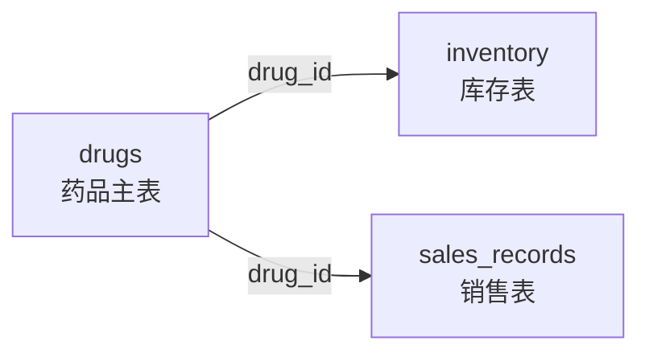
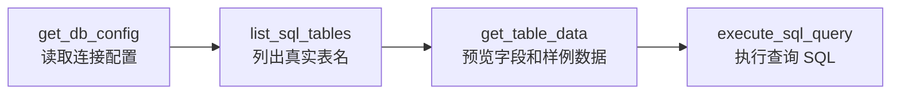
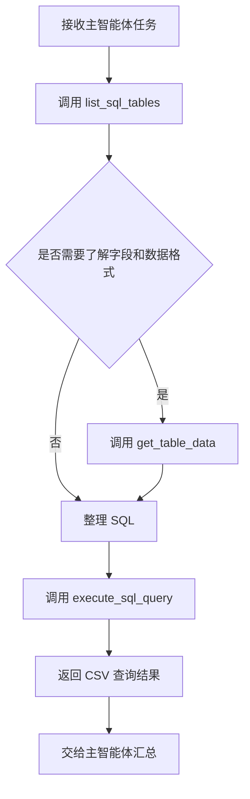

# 11 - 深度研搜：数据库查询子智能体与 MySQL 工具

<!-- TS-TRACK-BANNER -->
> **TypeScript 轨道说明**：中文讲解保留原教程；**代码块使用仓库内真实 TypeScript**（`examples/` / 精校案例 / `apps/shop-query-agent`），不再使用机翻 Python。
> 精校清单：[POLISHED-CASES](POLISHED-CASES.md)


## TypeScript 可运行示例（推荐）

本章优先对照仓库真实文件：`examples/12-langgraph-multi-agent/index.ts`

```typescript
// examples/12-langgraph-multi-agent/index.ts
/**
 * Maps to: 案例与源码-3-LangGraph框架/08-multi_agent
 * Python refs: SupervisorV0.3/V1.0.py, SupervisorHandoff.py
 *
 * Teaching version of supervisor + specialist workers (with step guard).
 */
import {
  AIMessage,
  HumanMessage,
  SystemMessage,
  type BaseMessage,
} from "@langchain/core/messages";
import {
  Annotation,
  END,
  START,
  StateGraph,
  messagesStateReducer,
} from "@langchain/langgraph";
import { z } from "zod";
import { createChatModel } from "../../src/shared/llm.js";
import { getWeatherTool, searchPolicyTool } from "../../src/shared/tools.js";
import { printRunHeader } from "../../src/shared/env.js";

const RouteSchema = z.object({
  next: z.enum(["weather", "policy", "FINISH"]),
  reason: z.string(),
});

const MultiAgentState = Annotation.Root({
  messages: Annotation<BaseMessage[]>({
    reducer: messagesStateReducer,
    default: () => [],
  }),
  next: Annotation<string>({
    reducer: (_prev, next) => next,
    default: () => "supervisor",
  }),
  steps: Annotation<number>({
    reducer: (_prev, next) => next,
    default: () => 0,
  }),
  visited: Annotation<string[]>({
    reducer: (prev, next) => Array.from(new Set([...prev, ...next])),
    default: () => [],
  }),
});

async function supervisorNode(state: typeof MultiAgentState.State) {
  // Safety: prevent infinite supervisor loops in demos.
  if (state.steps >= 4 || state.visited.length >= 2) {
    return {
      next: "FINISH",
      steps: state.steps + 1,
      messages: [new AIMessage("主管：信息已足够，结束本轮调度。")],
    };
  }

  const model = createChatModel(0).withStructuredOutput(RouteSchema);
  const decision = await model.invoke([
    new SystemMessage(
      [
        "你是主管 Agent，只负责路由。",
        "weather: 天气相关",
        "policy: 公司制度/报销/请假",
        "FINISH: 已有足够答案",
        `已访问专家: ${state.visited.join(", ") || "无"}`,
        "不要重复已访问专家。",
      ].join("\n"),
    ),
    ...state.messages,
  ]);

  // Avoid re-entering the same worker.
  let next = decision.next;
  if (next !== "FINISH" && state.visited.includes(next)) {
    next = "FINISH";
  }

  console.log("[supervisor]", { ...decision, next });
  return {
    next,
    steps: state.steps + 1,
    messages: [new AIMessage(`主管路由到：${next}（${decision.reason}）`)],
  };
}

async function weatherNode(state: typeof MultiAgentState.State) {
  const lastHuman = [...state.messages]
    .reverse()
    .find((m) => m.getType() === "human");
  const text = String(lastHuman?.content ?? "");
  const cityMatch = text.match(/北京|上海|深圳|杭州|广州/)?.[0] ?? "北京";
  const weather = await getWeatherTool.invoke({ city: cityMatch });
  return {
    next: "supervisor",
    visited: ["weather"],
    messages: [new AIMessage(`天气专员：${cityMatch} => ${weather}`)],
  };
}

async function policyNode(state: typeof MultiAgentState.State) {
  const lastHuman = [...state.messages]
    .reverse()
    .find((m) => m.getType() === "human");
  const text = String(lastHuman?.content ?? "报销");
  const keyword = /请假|加班|报销|设备/.exec(text)?.[0] ?? "报销";
  const policy = await searchPolicyTool.invoke({ keyword });

  const model = createChatModel(0);
  const polished = await model.invoke([
    new SystemMessage("你是制度专员，把检索结果整理成员工可执行答复。"),
    new HumanMessage(`用户问题：${text}\n检索结果：${policy}`),
  ]);

  return {
    next: "supervisor",
    visited: ["policy"],
    messages: [new AIMessage(`制度专员：${polished.content}`)],
  };
}

function routeFromSupervisor(state: typeof MultiAgentState.State) {
  if (state.next === "weather") return "weather";
  if (state.next === "policy") return "policy";
  return END;
}

function buildGraph() {
  return new StateGraph(MultiAgentState)
    .addNode("supervisor", supervisorNode)
    .addNode("weather", weatherNode)
    .addNode("policy", policyNode)
    .addEdge(START, "supervisor")
    .addConditionalEdges("supervisor", routeFromSupervisor, {
      weather: "weather",
      policy: "policy",
      [END]: END,
    })
    .addEdge("weather", "supervisor")
    .addEdge("policy", "supervisor")
    .compile();
}

async function main() {
  printRunHeader("12-langgraph-multi-agent | supervisor pattern");

  const app = buildGraph();
  const result = await app.invoke({
    messages: [
      new HumanMessage("我想了解差旅报销规则，另外顺便说下北京今天天气。"),
    ],
    next: "supervisor",
    steps: 0,
    visited: [],
  });

  console.log("\n===== transcript =====");
  for (const msg of result.messages) {
    console.log(`\n[${msg.getType()}] ${msg.content}`);
  }
}

main().catch((err) => {
  console.error(err);
  process.exit(1);
});
```

```bash
npx tsx examples/12-langgraph-multi-agent/index.ts
```


---

**本章课程目标：**

- 理解数据库查询助手在「深度研搜」项目中的职责边界。
- 明确为什么数据库助手不能直接让模型生成 SQL，而要按三步查询。
- 准备 MySQL 连接配置，并理解 `get_db_config` 的作用。
- 实现 `list_sql_tables`、`get_table_data`、`execute_sql_query` 三个数据库工具。
- 组装 `database_query_agent`，为后续主智能体调度做准备。

**学习建议：** 数据库助手不要一上来就看 SQL 怎么写。先看它如何知道有哪些表，再看表结构和样例数据如何暴露给模型，最后才是执行查询。这个顺序很重要：这类系统最怕的不是 SQL 写得慢，而是模型一开始就把表名、字段名、字段含义猜错。

**对应代码分支：** `11-deepsearch-database-subagent`

---

上一章已经完成了网络搜索助手。网络搜索助手负责公开互联网信息，它面对的是网页、新闻、外部资料。

本章要写第二个子智能体：数据库查询助手。

它面对的是企业内部结构化数据，比如：

- 药品基础信息；
- 药品库存；
- 药品销售记录；
- 不同区域、客户、批次、日期下的业务明细。

这些数据不适合交给网络搜索助手，也不适合交给 RAGFlow。它们存在 MySQL 里，需要通过 SQL 精确查询。

---

## 1、数据库助手解决什么问题

### 1.1 它负责查“具体是多少”

网络搜索适合回答“外部发生了什么”，RAGFlow 适合回答“内部文档怎么规定”，数据库适合回答“具体数据是多少”。

比如：`查询数据库中的药品信息，并生成 PDF 文件。`

数据库助手要做的不是直接回答“我猜有这些药品”，而是去真实数据库里查。

再比如：`查询 2025 年华北区销售额最高的药品。`

这类问题必须查询 `sales_records`、`drugs` 等真实表，才能得到准确结果。

### 1.2 它不负责回答概括性知识

数据库中保存的是结构化业务数据，不保存概括性知识。

| 用户问题                         | 应该交给谁     |
| -------------------------------- | -------------- |
| 某个药品当前库存是多少           | 数据库查询助手 |
| 某个药品最近公开政策有什么变化   | 网络搜索助手   |
| 公司内部制度里对报销怎么规定     | RAGFlow 助手   |
| 把查询结果整理成 Markdown 或 PDF | 主智能体       |

所以数据库助手的 `description` 里，要写清它只负责企业内部结构化数据。

---

## 2、数据库助手为什么要三步走

### 2.1 不能直接生成 SQL

最直接的想法是：`用户问题 -> 大模型生成 SQL -> 执行 SQL`

这看起来简单，但非常容易出错。

模型可能不知道真实表名，就编一个 `medicine` 表；不知道字段名，就编一个 `stock_count` 字段；不知道日期格式，就把 `2025-01-01` 写成 `2025/01/01`。所以数据库助手要让模型先获得真实上下文。

### 2.2 三个工具的关系

数据库助手有三个工具：

| 工具名              | 作用                                            |
| ------------------- | ----------------------------------------------- |
| `list_sql_tables`   | 先看数据库里有哪些表                            |
| `get_table_data`    | 查看某张表的列名和前 100 行数据，理解字段和格式 |
| `execute_sql_query` | 在确认表名、字段和格式后，执行自定义 SQL 查询   |

这三个工具不是平级乱用的，而是有顺序的：

```text
list_sql_tables
  -> get_table_data
  -> execute_sql_query
```

前两个工具其实是在给第三个工具铺路。模型先知道真实表名和数据样子，最后生成 SQL 才更靠谱。

### 2.3 为什么 get_table_data 要返回样例数据

读到这里可能会有一个疑问：如果只是想知道表结构，为什么不只查字段名？

因为字段名只能告诉模型“有哪些列”，不能告诉它“数据长什么样”。

比如日期字段可能是：

```text
2025-01-01
2025/01/01
20250101
```

区域字段可能是：

```text
华北区
华北
North China
```

如果模型不知道真实格式，`WHERE` 条件就容易写错。返回前 100 行样例数据，可以让模型同时看到列名和数据格式。

---

## 3、配置 prompts.yml 中的数据库助手

项目对应文件路径：`deepsearch-agents/app/prompt/prompts.yml`

数据库助手配置可以这样写：

```yaml
# DeepAgents 提示词配置：集中管理主智能体和各子智能体的名称、路由描述与系统提示词
# 主智能体读取 description 做任务分派，子智能体读取 system_prompt 约束自己的执行方式

# 子智能体配置：description 给主智能体判断是否调用，system_prompt 给子智能体约束执行方式
sub_agents:
  db:
    name: "数据库查询助手"
    description: |
      负责进行数据库查询的智能体助手。它可以查看数据库中有哪些表，
      读取表数据和查看表结构，并执行自定义 SQL 查询以获取精确的业务数据。
      数据库中包含了企业的药品信息、药品库存信息、以及药品销售具体数据，
      可以看到所有特定商品的一切详细信息。
      但是数据库中不包含概括性的知识，只包含具体商品的信息。
    system_prompt: |
      你是一个专业的数据库查询助手。你可以直接与 MySQL 数据库交互来检索信息。
      你掌握的工具包括：
      1. list_sql_tables: 列出数据库中所有可用的表，这是了解数据库结构的第一步。
      2. get_table_data: 读取指定表的前 100 行数据，用于快速预览数据内容和表列的信息。
      3. execute_sql_query: 执行自定义 SQL 查询。当需要复杂的筛选、联接或聚合时使用此工具。

      通常的工作流程是：先列出可用表，确认表名；
      如果需要，预览表数据了解字段；
      最后编写并执行 SQL 查询以回答用户问题。
```

这里有两个重点：

- 描述告诉主智能体：数据库助手查的是企业内部结构化数据。
- 提示词告诉数据库助手：先了解数据库结构，再执行 SQL 查询。

---

## 4、准备数据库与本地 MySQL 环境

### 4.1 本项目的三张业务表

课程素材里准备的是医药业务数据，核心有三张表：

| 表名            | 作用                   |
| --------------- | ---------------------- |
| `drugs`         | 药品基础信息           |
| `inventory`     | 药品库存和批次信息     |
| `sales_records` | 药品销售记录和区域信息 |

对应的初始化 SQL 放在：`deepsearch-agents/docker/mysql/mysql.sql`

这个脚本会创建 `deepsearch_db`，并写入一批教学模拟数据：

| 表名            | 数据规模 | 主要用途                            |
| --------------- | -------- | ----------------------------------- |
| `drugs`         | 50 条    | 药品主数据                          |
| `inventory`     | 150 条   | 每种药品 3 个库存批次               |
| `sales_records` | 100 条   | 每种药品 2 条销售记录，覆盖区域分析 |

三张表的关系可以简单理解为下面这张图。



也就是说，`drugs` 是主表，库存和销售都通过 `drug_id` 关联到具体药品。

再把三张表的核心字段展开看一下：

| 表名            | 关键字段                                                                                           | 适合回答的问题                         |
| --------------- | -------------------------------------------------------------------------------------------------- | -------------------------------------- |
| `drugs`         | `drug_id`、`generic_name`、`brand_name`、`approval_number`、`dosage_form`、`therapeutic_area`      | 某个药品是什么、属于什么治疗领域       |
| `inventory`     | `inventory_id`、`drug_id`、`batch_number`、`quantity_on_hand`、`warehouse_location`、`expiry_date` | 某个药品库存多少、在哪个仓库、何时过期 |
| `sales_records` | `sale_id`、`drug_id`、`sale_date`、`quantity_sold`、`unit_price`、`total_amount`、`region`         | 某个药品卖了多少、销售额多少、区域表现 |

这样模型在预览数据时，就能把用户问题映射到具体字段。例如“哪个区域销售额最高”更可能查 `sales_records.region` 和 `sales_records.total_amount`；“某个药还有多少库存”更可能查 `inventory.quantity_on_hand`。

### 4.2 .env 中加入 MySQL 配置

项目对应文件路径：`deepsearch-agents/.env`

添加数据库配置：

```dotenv
MYSQL_USER=root
MYSQL_PASSWORD=root
MYSQL_DATABASE=deepsearch_db
MYSQL_HOST=localhost
MYSQL_PORT=3307
MYSQL_CHARSET=utf8mb4
MYSQL_COLLATION=utf8mb4_unicode_ci
MYSQL_SQL_MODE=TRADITIONAL
```

这里的账号、密码和库名可以根据你自己的本地环境调整。教程里写的是课程演示值，真实项目不要把生产数据库密码写进文档或仓库。

这里端口写 `3307`，是因为课程项目用 Docker 启动 MySQL 时，会把容器里的 `3306` 映射到宿主机的 `3307`，避免和你电脑上已有的 MySQL `3306` 冲突。后面的 Python 工具连接的是宿主机地址，所以 `MYSQL_HOST=localhost`、`MYSQL_PORT=3307`。

### 4.3 使用 Docker 启动 MySQL

如果你对 Docker、Compose、端口映射或数据卷还不熟，可以先回看 [第 8 章 Docker 快速入门与 Dify 部署排障](../8-Docker快速入门与Dify部署排障.md)，再继续执行下面的启动命令。

项目里已经准备了 Docker Compose 文件：`deepsearch-agents/docker/docker-compose.yaml`

内容核心如下：

```yaml
# DeepSearch Agents 本地 MySQL 教学环境
# 首次启动时，mysql/mysql.sql 会被官方镜像自动导入到 deepsearch_db。
# 如果数据卷已存在，MySQL 不会重复执行初始化脚本，需要重建 volume 才会重新导入。

name: deepsearch-agents

services:
  mysql:
    image: mysql:8.4
    container_name: deepsearch-mysql
    restart: unless-stopped
    environment:
      MYSQL_ROOT_PASSWORD: ${MYSQL_PASSWORD:-root}
      MYSQL_ROOT_HOST: "%"
      MYSQL_DATABASE: ${MYSQL_DATABASE:-deepsearch_db}
      TZ: Asia/Shanghai
    command:
      - --character-set-server=utf8mb4
      - --collation-server=utf8mb4_unicode_ci
      - --default-time-zone=+08:00
      - --sql-mode=TRADITIONAL
    ports:
      # .env 默认使用 3307，避免和本机已有 MySQL 3306 冲突
      - "${MYSQL_PORT:-3306}:3306"
    volumes:
      - deepsearch_mysql_data:/var/lib/mysql
      # 容器首次创建数据目录时，MySQL 官方镜像会自动执行这个初始化脚本
      - ./mysql/mysql.sql:/docker-entrypoint-initdb.d/01-init-pharma.sql:ro
    healthcheck:
      test:
        [
          "CMD-SHELL",
          "mysqladmin ping -h 127.0.0.1 -uroot -p$${MYSQL_ROOT_PASSWORD} --silent",
        ]
      interval: 10s
      timeout: 5s
      retries: 10
      start_period: 30s

volumes:
  deepsearch_mysql_data:
```

在 `deepsearch-agents` 项目根目录执行：

```bash
docker compose --env-file .env -f docs/docker-compose.yaml up -d
```

这条命令会做几件事：

| 动作                         | 说明                                           |
| ---------------------------- | ---------------------------------------------- |
| 拉取 `mysql:8.4`             | 本地没有镜像时会自动下载                       |
| 创建 `deepsearch-mysql` 容器 | 后续可以通过容器名查看日志或进入容器           |
| 创建 `deepsearch_db`         | 由 `MYSQL_DATABASE` 控制                       |
| 导入 `mysql.sql`             | 只在数据卷第一次创建、数据库目录为空时自动执行 |
| 暴露本机端口 `3307`          | Python 代码通过 `localhost:3307` 连接 MySQL    |

检查容器状态：

```bash
docker compose --env-file .env -f docs/docker-compose.yaml ps
```

查看启动日志：

```bash
docker compose --env-file .env -f docs/docker-compose.yaml logs -f mysql
```

如果你修改了 `docs/mysql/mysql.sql`，但发现数据没有变化，通常是因为已有数据卷不会重复执行初始化脚本。教学环境可以重建数据卷：

```bash
docker compose --env-file .env -f docs/docker-compose.yaml down -v
docker compose --env-file .env -f docs/docker-compose.yaml up -d
```

`down -v` 会删除这个 Compose 项目创建的数据卷，等于重新初始化数据库。只在本地教学数据上这样做，真实业务库不要随便删卷。

---

## 5、实现数据库工具

项目对应文件路径：`deepsearch-agents/app/tools/db_tools.py`

这一节集中完成 4 件事：

```text
读取数据库配置
  -> 查询真实表名
  -> 预览表结构和样例数据
  -> 执行查询 SQL
```



### 5.1 get_db_config：集中读取连接配置

先写一个 `get_db_config`，统一从环境变量读取数据库配置：

```typescript
// Real TypeScript from repo: examples/12-langgraph-multi-agent/index.ts
/**
 * Maps to: 案例与源码-3-LangGraph框架/08-multi_agent
 * Python refs: SupervisorV0.3/V1.0.py, SupervisorHandoff.py
 *
 * Teaching version of supervisor + specialist workers (with step guard).
 */
import {
  AIMessage,
  HumanMessage,
  SystemMessage,
  type BaseMessage,
} from "@langchain/core/messages";
import {
  Annotation,
  END,
  START,
  StateGraph,
  messagesStateReducer,
} from "@langchain/langgraph";
import { z } from "zod";
import { createChatModel } from "../../src/shared/llm.js";
import { getWeatherTool, searchPolicyTool } from "../../src/shared/tools.js";
import { printRunHeader } from "../../src/shared/env.js";

const RouteSchema = z.object({
  next: z.enum(["weather", "policy", "FINISH"]),
  reason: z.string(),
});

const MultiAgentState = Annotation.Root({
  messages: Annotation<BaseMessage[]>({
    reducer: messagesStateReducer,
    default: () => [],
  }),
  next: Annotation<string>({
    reducer: (_prev, next) => next,
    default: () => "supervisor",
  }),
  steps: Annotation<number>({
    reducer: (_prev, next) => next,
    default: () => 0,
  }),
  visited: Annotation<string[]>({
    reducer: (prev, next) => Array.from(new Set([...prev, ...next])),
    default: () => [],
  }),
});

async function supervisorNode(state: typeof MultiAgentState.State) {
  // Safety: prevent infinite supervisor loops in demos.
  if (state.steps >= 4 || state.visited.length >= 2) {
    return {
      next: "FINISH",
      steps: state.steps + 1,
      messages: [new AIMessage("主管：信息已足够，结束本轮调度。")],
    };
  }

  const model = createChatModel(0).withStructuredOutput(RouteSchema);
  const decision = await model.invoke([
    new SystemMessage(
      [
        "你是主管 Agent，只负责路由。",
        "weather: 天气相关",
        "policy: 公司制度/报销/请假",
        "FINISH: 已有足够答案",
        `已访问专家: ${state.visited.join(", ") || "无"}`,
        "不要重复已访问专家。",
      ].join("\n"),
    ),
    ...state.messages,
  ]);

  // Avoid re-entering the same worker.
  let next = decision.next;
  if (next !== "FINISH" && state.visited.includes(next)) {
    next = "FINISH";
  }

  console.log("[supervisor]", { ...decision, next });
  return {
    next,
    steps: state.steps + 1,
    messages: [new AIMessage(`主管路由到：${next}（${decision.reason}）`)],
  };
}

async function weatherNode(state: typeof MultiAgentState.State) {
  const lastHuman = [...state.messages]
    .reverse()
    .find((m) => m.getType() === "human");
  const text = String(lastHuman?.content ?? "");
  const cityMatch = text.match(/北京|上海|深圳|杭州|广州/)?.[0] ?? "北京";
  const weather = await getWeatherTool.invoke({ city: cityMatch });
  return {
    next: "supervisor",
    visited: ["weather"],
    messages: [new AIMessage(`天气专员：${cityMatch} => ${weather}`)],
  };
}

async function policyNode(state: typeof MultiAgentState.State) {
  const lastHuman = [...state.messages]
    .reverse()
    .find((m) => m.getType() === "human");
  const text = String(lastHuman?.content ?? "报销");
  const keyword = /请假|加班|报销|设备/.exec(text)?.[0] ?? "报销";
  const policy = await searchPolicyTool.invoke({ keyword });

  const model = createChatModel(0);
  const polished = await model.invoke([
    new SystemMessage("你是制度专员，把检索结果整理成员工可执行答复。"),
    new HumanMessage(`用户问题：${text}\n检索结果：${policy}`),
  ]);

  return {
    next: "supervisor",
    visited: ["policy"],
    messages: [new AIMessage(`制度专员：${polished.content}`)],
  };
}

function routeFromSupervisor(state: typeof MultiAgentState.State) {
  if (state.next === "weather") return "weather";
  if (state.next === "policy") return "policy";
  return END;
}

function buildGraph() {
  return new StateGraph(MultiAgentState)
    .addNode("supervisor", supervisorNode)
    .addNode("weather", weatherNode)
    .addNode("policy", policyNode)
    .addEdge(START, "supervisor")
    .addConditionalEdges("supervisor", routeFromSupervisor, {
      weather: "weather",
      policy: "policy",
      [END]: END,
    })
    .addEdge("weather", "supervisor")
    .addEdge("policy", "supervisor")
    .compile();
}

async function main() {
  printRunHeader("12-langgraph-multi-agent | supervisor pattern");

  const app = buildGraph();
  const result = await app.invoke({
    messages: [
      new HumanMessage("我想了解差旅报销规则，另外顺便说下北京今天天气。"),
    ],
    next: "supervisor",
    steps: 0,
    visited: [],
  });

  console.log("\n===== transcript =====");
  for (const msg of result.messages) {
    console.log(`\n[${msg.getType()}] ${msg.content}`);
  }
}

main().catch((err) => {
  console.error(err);
  process.exit(1);
});
```

这里做了两件小事：

1. 给 `host`、`port`、字符集、排序规则和 SQL 模式等配置默认值。
2. 检查 `user`、`password`、`database` 是否存在。

数据库工具后面都会先调用它，避免每个工具里重复读取环境变量。

### 5.2 list_sql_tables：列出真实表名

`list_sql_tables` 用来查看当前数据库中有哪些表。

这是数据库查询的第一步。模型必须先知道真实表名，才能继续查看表结构或写 SQL。

核心代码如下：

```typescript
// Real TypeScript from repo: examples/11-langgraph-tool-agent/index.ts
/**
 * Maps to LangGraph tool-calling agent pattern
 * (course chapters 21-24: agent loop as a graph)
 */
import {
  AIMessage,
  HumanMessage,
  SystemMessage,
  ToolMessage,
  type BaseMessage,
} from "@langchain/core/messages";
import { tool } from "@langchain/core/tools";
import { Annotation, END, START, StateGraph, messagesStateReducer } from "@langchain/langgraph";
import { z } from "zod";
import { createChatModel } from "../../src/shared/llm.js";
import { addNumberTool, getWeatherTool } from "../../src/shared/tools.js";
import { printRunHeader } from "../../src/shared/env.js";

const tools = [addNumberTool, getWeatherTool];
const toolsByName = Object.fromEntries(tools.map((t) => [t.name, t]));
void toolsByName;

const AgentState = Annotation.Root({
  messages: Annotation<BaseMessage[]>({
    reducer: messagesStateReducer,
    default: () => [],
  }),
});

async function agentNode(state: typeof AgentState.State) {
  const model = createChatModel(0).bindTools(tools);
  const response = await model.invoke([
    new SystemMessage(
      "你是工具增强助手。需要计算或查天气时必须调用工具，不要编造。",
    ),
    ...state.messages,
  ]);
  return { messages: [response] };
}

async function toolNode(state: typeof AgentState.State) {
  const last = state.messages[state.messages.length - 1];
  if (!(last instanceof AIMessage) || !last.tool_calls?.length) {
    return { messages: [] };
  }

  const outputs: ToolMessage[] = [];
  for (const call of last.tool_calls) {
    let observation: string;
    if (call.name === "add_number") {
      observation = String(
        await addNumberTool.invoke(call.args as { a: number; b: number }),
      );
    } else if (call.name === "get_weather") {
      observation = String(
        await getWeatherTool.invoke(call.args as { city: string }),
      );
    } else {
      observation = `Unknown tool: ${call.name}`;
    }
    outputs.push(
      new ToolMessage({
        content: observation,
        tool_call_id: call.id ?? call.name,
      }),
    );
  }
  return { messages: outputs };
}

function shouldContinue(state: typeof AgentState.State) {
  const last = state.messages[state.messages.length - 1];
  if (last instanceof AIMessage && last.tool_calls?.length) {
    return "tools";
  }
  return END;
}

function buildGraph() {
  return new StateGraph(AgentState)
    .addNode("agent", agentNode)
    .addNode("tools", toolNode)
    .addEdge(START, "agent")
    .addConditionalEdges("agent", shouldContinue, {
      tools: "tools",
      [END]: END,
    })
    .addEdge("tools", "agent")
    .compile();
}

async function main() {
  printRunHeader("11-langgraph-tool-agent | manual ReAct graph");

  // tiny local tool to show schema flexibility
  const echo = tool(async ({ text }) => `echo:${text}`, {
    name: "echo",
    description: "Echo text",
    schema: z.object({ text: z.string() }),
  });
  void echo;

  const app = buildGraph();
  const result = await app.invoke({
    messages: [
      new HumanMessage("请计算 8+15，并告诉我北京天气，最后中文总结。"),
    ],
  });

  for (const msg of result.messages) {
    console.log(`\n[${msg.getType()}]`, msg.content);
    if (msg instanceof AIMessage && msg.tool_calls?.length) {
      console.log(" tool_calls:", JSON.stringify(msg.tool_calls, null, 2));
    }
  }
}

main().catch((err) => {
  console.error(err);
  process.exit(1);
});
```

这段代码本质上就是 MySQL 查询的标准流程：

```text
读取连接配置
  -> connect 建立连接
  -> cursor 创建游标
  -> execute 执行 SHOW TABLES
  -> fetchall 获取结果
  -> 格式化返回
```

`with connect(...)` 和 `with conn.cursor()` 可以在代码块结束后自动释放连接和游标，避免资源泄露。

### 5.3 get_table_data：预览字段与样例数据

`get_table_data` 用来读取指定表的前 100 行数据。

它有两个目的：

1. 查询单表数据。
2. 让模型看到表结构、字段名和数据格式。

核心代码如下：

```typescript
// Real TypeScript from repo: examples/09-agent/index.ts
/**
 * Maps to: 案例与源码-2-LangChain框架/12-agent
 * Python refs: AgentSmartSelectV1.0.py, AgentReact.py
 *
 * Modern LangChain JS path: createReactAgent (tool-calling ReAct loop).
 */
import { HumanMessage } from "@langchain/core/messages";
import { tool } from "@langchain/core/tools";
import { createReactAgent } from "@langchain/langgraph/prebuilt";
import { z } from "zod";
import { createChatModel } from "../../src/shared/llm.js";
import { basicTools } from "../../src/shared/tools.js";
import { printRunHeader } from "../../src/shared/env.js";

const PRODUCT_DATABASE: Record<
  string,
  Array<{ id: string; name: string; popularity: number; price: number }>
> = {
  无线耳机: [
    { id: "WH-1000XM5", name: "索尼 WH-1000XM5", popularity: 95, price: 299 },
    { id: "QC45", name: "Bose QuietComfort 45", popularity: 88, price: 329 },
  ],
  游戏鼠标: [
    { id: "GPW", name: "罗技 G Pro 无线", popularity: 90, price: 129 },
    { id: "VIPER", name: "雷蛇 Viper V2 Pro", popularity: 87, price: 149 },
  ],
};

const INVENTORY: Record<string, { stock: number; location: string }> = {
  "WH-1000XM5": { stock: 10, location: "仓库-A" },
  QC45: { stock: 0, location: "仓库-B" },
  GPW: { stock: 8, location: "仓库-C" },
  VIPER: { stock: 12, location: "仓库-A" },
};

const searchProductsTool = tool(
  async ({ query }) => {
    const category = Object.keys(PRODUCT_DATABASE).find((c) => query.includes(c));
    if (!category) return `未找到与「${query}」匹配的产品类别`;
    const items = [...PRODUCT_DATABASE[category]].sort(
      (a, b) => b.popularity - a.popularity,
    );
    return items
      .map(
        (p, i) =>
          `${i + 1}. ${p.name} (ID:${p.id}) 热度${p.popularity} ￥${p.price}`,
      )
      .join("\n");
  },
  {
    name: "search_products",
    description: "按类别搜索产品，如无线耳机、游戏鼠标",
    schema: z.object({ query: z.string() }),
  },
);

const checkInventoryTool = tool(
  async ({ productId }) => {
    const info = INVENTORY[productId];
    if (!info) return `未找到产品ID: ${productId}`;
    const status = info.stock > 0 ? "有库存" : "缺货";
    return `${productId}: ${status} (${info.stock}) @ ${info.location}`;
  },
  {
    name: "check_inventory",
    description: "根据产品 ID 查询库存",
    schema: z.object({ productId: z.string() }),
  },
);

async function runMathWeatherAgent() {
  printRunHeader("09-agent | tool agent (math + weather)");
  const agent = createReactAgent({
    llm: createChatModel(0),
    tools: basicTools,
  });

  const result = await agent.invoke({
    messages: [
      new HumanMessage("请计算 45+17，并查询深圳天气，最后用中文给一个简短总结。"),
    ],
  });

  const last = result.messages[result.messages.length - 1];
  console.log("[final]", last.content);
}

async function runReactShopAgent() {
  printRunHeader("09-agent | ReAct shop agent (search + inventory)");
  const agent = createReactAgent({
    llm: createChatModel(0),
    tools: [searchProductsTool, checkInventoryTool],
  });

  const result = await agent.invoke({
    messages: [
      new HumanMessage(
        "帮我找最受欢迎的无线耳机，并检查第一名的库存，用中文给出购买建议。",
      ),
    ],
  });

  for (const msg of result.messages) {
    const role = msg.getType?.() ?? msg.constructor.name;
    console.log(`\n[${role}]`, msg.content);
  }
}

async function main() {
  await runMathWeatherAgent();
  await runReactShopAgent();
}

main().catch((err) => {
  console.error(err);
  process.exit(1);
});
```

### 5.4 cursor.description 与 CSV 返回格式

执行查询后，`cursor.description` 里保存的是结果集的列信息。

可以把它理解成：

```text
[
  ("drug_id", ...),
  ("generic_name", ...),
  ("brand_name", ...),
  ...
]
```

我们只需要每个元组里的第一个元素，也就是列名：

```typescript
// Real TypeScript from repo: examples/14-mcp/client-agent.ts
/**
 * Maps to: 案例与源码-2-LangChain框架/11-mcp/McpClientAgent.py
 *
 * Flow:
 * 1) spawn local MCP server over stdio
 * 2) list MCP tools
 * 3) wrap tools as LangChain tools
 * 4) run createReactAgent once with a user question
 */
import { dirname, join } from "node:path";
import { fileURLToPath } from "node:url";
import { Client } from "@modelcontextprotocol/sdk/client/index.js";
import { StdioClientTransport } from "@modelcontextprotocol/sdk/client/stdio.js";
import { DynamicStructuredTool } from "@langchain/core/tools";
import { HumanMessage } from "@langchain/core/messages";
import { createReactAgent } from "@langchain/langgraph/prebuilt";
import { z } from "zod";
import { createChatModel } from "../../src/shared/llm.js";
import { printRunHeader } from "../../src/shared/env.js";

const __dirname = dirname(fileURLToPath(import.meta.url));
const serverPath = join(__dirname, "server.ts");

function jsonSchemaToZod(inputSchema: unknown): z.ZodObject<z.ZodRawShape> {
  const schema = (inputSchema ?? {}) as {
    type?: string;
    properties?: Record<string, { type?: string; description?: string }>;
    required?: string[];
  };
  const shape: z.ZodRawShape = {};
  const required = new Set(schema.required ?? []);
  for (const [key, prop] of Object.entries(schema.properties ?? {})) {
    let field: z.ZodTypeAny =
      prop.type === "number" || prop.type === "integer"
        ? z.number()
        : prop.type === "boolean"
          ? z.boolean()
          : z.string();
    if (prop.description) field = field.describe(prop.description);
    if (!required.has(key)) field = field.optional();
    shape[key] = field;
  }
  return z.object(shape);
}

function textFromMcpResult(result: {
  content?: Array<{ type: string; text?: string }>;
}): string {
  if (!result.content?.length) return JSON.stringify(result);
  return result.content
    .map((c) => (c.type === "text" ? (c.text ?? "") : JSON.stringify(c)))
    .join("\n");
}

async function main() {
  printRunHeader("14-mcp | MCP server tools -> LangChain Agent");

  const transport = new StdioClientTransport({
    command: process.platform === "win32" ? "npx.cmd" : "npx",
    args: ["tsx", serverPath],
    stderr: "pipe",
  });

  const client = new Client({ name: "mcp-demo-client", version: "0.1.0" });
  await client.connect(transport);

  try {
    const listed = await client.listTools();
    console.log(
      "MCP tools:",
      listed.tools.map((t) => t.name).join(", ") || "(none)",
    );

    const resources = await client.listResources();
    console.log(
      "MCP resources:",
      resources.resources.map((r) => r.uri).join(", ") || "(none)",
    );

    const lcTools = listed.tools.map((mcpTool) => {
      const schema = jsonSchemaToZod(mcpTool.inputSchema);
      return new DynamicStructuredTool({
        name: mcpTool.name,
        description: mcpTool.description || mcpTool.name,
        schema,
        func: async (input) => {
          const result = await client.callTool({
            name: mcpTool.name,
            arguments: input as Record<string, unknown>,
          });
          return textFromMcpResult(
            result as { content?: Array<{ type: string; text?: string }> },
          );
        },
      });
    });

    if (!lcTools.length) {
      throw new Error("No MCP tools available");
    }

    const agent = createReactAgent({
      llm: createChatModel(0),
      tools: lcTools,
    });

    const question =
      process.argv.slice(2).join(" ") ||
      "请计算 19+26，并查询上海天气，用中文简短总结。";
    console.log("\n[question]", question);

    const result = await agent.invoke({
      messages: [new HumanMessage(question)],
    });

    const last = result.messages[result.messages.length - 1];
    console.log("\n[final]", last.content);
  } finally {
    await client.close();
    await transport.close();
  }
}

main().catch((err) => {
  console.error(err);
  process.exit(1);
});
```

拿到列名后，再把查询结果转成 CSV 格式：

```text
drug_id,generic_name,brand_name
1,阿莫西林胶囊,阿莫仙
2,布洛芬缓释胶囊,芬必得
```

CSV 对模型来说比较容易读，它既能看到字段名，也能看到每一列的数据样子。

### 5.5 表名安全与只读边界

当前课程代码重点是演示 Agent 查询流程。在最简写法里，`table_name` 会被拼进 SQL：

```typescript
// Real TypeScript from repo: examples/12-langgraph-multi-agent/index.ts
/**
 * Maps to: 案例与源码-3-LangGraph框架/08-multi_agent
 * Python refs: SupervisorV0.3/V1.0.py, SupervisorHandoff.py
 *
 * Teaching version of supervisor + specialist workers (with step guard).
 */
import {
  AIMessage,
  HumanMessage,
  SystemMessage,
  type BaseMessage,
} from "@langchain/core/messages";
import {
  Annotation,
  END,
  START,
  StateGraph,
  messagesStateReducer,
} from "@langchain/langgraph";
import { z } from "zod";
import { createChatModel } from "../../src/shared/llm.js";
import { getWeatherTool, searchPolicyTool } from "../../src/shared/tools.js";
import { printRunHeader } from "../../src/shared/env.js";

const RouteSchema = z.object({
  next: z.enum(["weather", "policy", "FINISH"]),
  reason: z.string(),
});

const MultiAgentState = Annotation.Root({
  messages: Annotation<BaseMessage[]>({
    reducer: messagesStateReducer,
    default: () => [],
  }),
  next: Annotation<string>({
    reducer: (_prev, next) => next,
    default: () => "supervisor",
  }),
  steps: Annotation<number>({
    reducer: (_prev, next) => next,
    default: () => 0,
  }),
  visited: Annotation<string[]>({
    reducer: (prev, next) => Array.from(new Set([...prev, ...next])),
    default: () => [],
  }),
});

async function supervisorNode(state: typeof MultiAgentState.State) {
  // Safety: prevent infinite supervisor loops in demos.
  if (state.steps >= 4 || state.visited.length >= 2) {
    return {
      next: "FINISH",
      steps: state.steps + 1,
      messages: [new AIMessage("主管：信息已足够，结束本轮调度。")],
    };
  }

  const model = createChatModel(0).withStructuredOutput(RouteSchema);
  const decision = await model.invoke([
    new SystemMessage(
      [
        "你是主管 Agent，只负责路由。",
        "weather: 天气相关",
        "policy: 公司制度/报销/请假",
        "FINISH: 已有足够答案",
        `已访问专家: ${state.visited.join(", ") || "无"}`,
        "不要重复已访问专家。",
      ].join("\n"),
    ),
    ...state.messages,
  ]);

  // Avoid re-entering the same worker.
  let next = decision.next;
  if (next !== "FINISH" && state.visited.includes(next)) {
    next = "FINISH";
  }

  console.log("[supervisor]", { ...decision, next });
  return {
    next,
    steps: state.steps + 1,
    messages: [new AIMessage(`主管路由到：${next}（${decision.reason}）`)],
  };
}

async function weatherNode(state: typeof MultiAgentState.State) {
  const lastHuman = [...state.messages]
    .reverse()
    .find((m) => m.getType() === "human");
  const text = String(lastHuman?.content ?? "");
  const cityMatch = text.match(/北京|上海|深圳|杭州|广州/)?.[0] ?? "北京";
  const weather = await getWeatherTool.invoke({ city: cityMatch });
  return {
    next: "supervisor",
    visited: ["weather"],
    messages: [new AIMessage(`天气专员：${cityMatch} => ${weather}`)],
  };
}

async function policyNode(state: typeof MultiAgentState.State) {
  const lastHuman = [...state.messages]
    .reverse()
    .find((m) => m.getType() === "human");
  const text = String(lastHuman?.content ?? "报销");
  const keyword = /请假|加班|报销|设备/.exec(text)?.[0] ?? "报销";
  const policy = await searchPolicyTool.invoke({ keyword });

  const model = createChatModel(0);
  const polished = await model.invoke([
    new SystemMessage("你是制度专员，把检索结果整理成员工可执行答复。"),
    new HumanMessage(`用户问题：${text}\n检索结果：${policy}`),
  ]);

  return {
    next: "supervisor",
    visited: ["policy"],
    messages: [new AIMessage(`制度专员：${polished.content}`)],
  };
}

function routeFromSupervisor(state: typeof MultiAgentState.State) {
  if (state.next === "weather") return "weather";
  if (state.next === "policy") return "policy";
  return END;
}

function buildGraph() {
  return new StateGraph(MultiAgentState)
    .addNode("supervisor", supervisorNode)
    .addNode("weather", weatherNode)
    .addNode("policy", policyNode)
    .addEdge(START, "supervisor")
    .addConditionalEdges("supervisor", routeFromSupervisor, {
      weather: "weather",
      policy: "policy",
      [END]: END,
    })
    .addEdge("weather", "supervisor")
    .addEdge("policy", "supervisor")
    .compile();
}

async function main() {
  printRunHeader("12-langgraph-multi-agent | supervisor pattern");

  const app = buildGraph();
  const result = await app.invoke({
    messages: [
      new HumanMessage("我想了解差旅报销规则，另外顺便说下北京今天天气。"),
    ],
    next: "supervisor",
    steps: 0,
    visited: [],
  });

  console.log("\n===== transcript =====");
  for (const msg of result.messages) {
    console.log(`\n[${msg.getType()}] ${msg.content}`);
  }
}

main().catch((err) => {
  console.error(err);
  process.exit(1);
});
```

这能帮助初学者看清工具链路，但在真实项目里要小心 SQL 注入风险。

如果先做一层基础清洗，可以从下面这种写法开始理解：

```typescript
// Real TypeScript from repo: examples/11-langgraph-tool-agent/index.ts
/**
 * Maps to LangGraph tool-calling agent pattern
 * (course chapters 21-24: agent loop as a graph)
 */
import {
  AIMessage,
  HumanMessage,
  SystemMessage,
  ToolMessage,
  type BaseMessage,
} from "@langchain/core/messages";
import { tool } from "@langchain/core/tools";
import { Annotation, END, START, StateGraph, messagesStateReducer } from "@langchain/langgraph";
import { z } from "zod";
import { createChatModel } from "../../src/shared/llm.js";
import { addNumberTool, getWeatherTool } from "../../src/shared/tools.js";
import { printRunHeader } from "../../src/shared/env.js";

const tools = [addNumberTool, getWeatherTool];
const toolsByName = Object.fromEntries(tools.map((t) => [t.name, t]));
void toolsByName;

const AgentState = Annotation.Root({
  messages: Annotation<BaseMessage[]>({
    reducer: messagesStateReducer,
    default: () => [],
  }),
});

async function agentNode(state: typeof AgentState.State) {
  const model = createChatModel(0).bindTools(tools);
  const response = await model.invoke([
    new SystemMessage(
      "你是工具增强助手。需要计算或查天气时必须调用工具，不要编造。",
    ),
    ...state.messages,
  ]);
  return { messages: [response] };
}

async function toolNode(state: typeof AgentState.State) {
  const last = state.messages[state.messages.length - 1];
  if (!(last instanceof AIMessage) || !last.tool_calls?.length) {
    return { messages: [] };
  }

  const outputs: ToolMessage[] = [];
  for (const call of last.tool_calls) {
    let observation: string;
    if (call.name === "add_number") {
      observation = String(
        await addNumberTool.invoke(call.args as { a: number; b: number }),
      );
    } else if (call.name === "get_weather") {
      observation = String(
        await getWeatherTool.invoke(call.args as { city: string }),
      );
    } else {
      observation = `Unknown tool: ${call.name}`;
    }
    outputs.push(
      new ToolMessage({
        content: observation,
        tool_call_id: call.id ?? call.name,
      }),
    );
  }
  return { messages: outputs };
}

function shouldContinue(state: typeof AgentState.State) {
  const last = state.messages[state.messages.length - 1];
  if (last instanceof AIMessage && last.tool_calls?.length) {
    return "tools";
  }
  return END;
}

function buildGraph() {
  return new StateGraph(AgentState)
    .addNode("agent", agentNode)
    .addNode("tools", toolNode)
    .addEdge(START, "agent")
    .addConditionalEdges("agent", shouldContinue, {
      tools: "tools",
      [END]: END,
    })
    .addEdge("tools", "agent")
    .compile();
}

async function main() {
  printRunHeader("11-langgraph-tool-agent | manual ReAct graph");

  // tiny local tool to show schema flexibility
  const echo = tool(async ({ text }) => `echo:${text}`, {
    name: "echo",
    description: "Echo text",
    schema: z.object({ text: z.string() }),
  });
  void echo;

  const app = buildGraph();
  const result = await app.invoke({
    messages: [
      new HumanMessage("请计算 8+15，并告诉我北京天气，最后中文总结。"),
    ],
  });

  for (const msg of result.messages) {
    console.log(`\n[${msg.getType()}]`, msg.content);
    if (msg instanceof AIMessage && msg.tool_calls?.length) {
      console.log(" tool_calls:", JSON.stringify(msg.tool_calls, null, 2));
    }
  }
}

main().catch((err) => {
  console.error(err);
  process.exit(1);
});
```

这段代码做了三件事：

| 处理动作              | 作用                              |
| --------------------- | --------------------------------- |
| 去掉反引号字符        | 避免通过反引号构造异常表名        |
| 去掉分号 `;`          | 降低一条输入里拼接多条 SQL 的风险 |
| `split()[0]` 取第一段 | 避免表名后面继续夹带额外 SQL 片段 |

在生产环境里，建议增加表名白名单校验，例如先调用 `list_sql_tables` 得到真实表名，然后只允许查询白名单里的表。对于自定义 SQL，也建议限制为只读查询，避免执行 `UPDATE`、`DELETE`、`DROP` 之类高风险语句。

### 5.6 execute_sql_query：执行查询 SQL

`execute_sql_query` 是真正执行查询的工具。

它适合处理：

- 多表关联；
- 条件筛选；
- 聚合统计；
- 排序和分组。

比如查询药品和销售记录：

```sql
SELECT *
FROM drugs d
JOIN sales_records s ON d.drug_id = s.drug_id;
```

核心代码如下：

```typescript
// Real TypeScript from repo: examples/09-agent/index.ts
/**
 * Maps to: 案例与源码-2-LangChain框架/12-agent
 * Python refs: AgentSmartSelectV1.0.py, AgentReact.py
 *
 * Modern LangChain JS path: createReactAgent (tool-calling ReAct loop).
 */
import { HumanMessage } from "@langchain/core/messages";
import { tool } from "@langchain/core/tools";
import { createReactAgent } from "@langchain/langgraph/prebuilt";
import { z } from "zod";
import { createChatModel } from "../../src/shared/llm.js";
import { basicTools } from "../../src/shared/tools.js";
import { printRunHeader } from "../../src/shared/env.js";

const PRODUCT_DATABASE: Record<
  string,
  Array<{ id: string; name: string; popularity: number; price: number }>
> = {
  无线耳机: [
    { id: "WH-1000XM5", name: "索尼 WH-1000XM5", popularity: 95, price: 299 },
    { id: "QC45", name: "Bose QuietComfort 45", popularity: 88, price: 329 },
  ],
  游戏鼠标: [
    { id: "GPW", name: "罗技 G Pro 无线", popularity: 90, price: 129 },
    { id: "VIPER", name: "雷蛇 Viper V2 Pro", popularity: 87, price: 149 },
  ],
};

const INVENTORY: Record<string, { stock: number; location: string }> = {
  "WH-1000XM5": { stock: 10, location: "仓库-A" },
  QC45: { stock: 0, location: "仓库-B" },
  GPW: { stock: 8, location: "仓库-C" },
  VIPER: { stock: 12, location: "仓库-A" },
};

const searchProductsTool = tool(
  async ({ query }) => {
    const category = Object.keys(PRODUCT_DATABASE).find((c) => query.includes(c));
    if (!category) return `未找到与「${query}」匹配的产品类别`;
    const items = [...PRODUCT_DATABASE[category]].sort(
      (a, b) => b.popularity - a.popularity,
    );
    return items
      .map(
        (p, i) =>
          `${i + 1}. ${p.name} (ID:${p.id}) 热度${p.popularity} ￥${p.price}`,
      )
      .join("\n");
  },
  {
    name: "search_products",
    description: "按类别搜索产品，如无线耳机、游戏鼠标",
    schema: z.object({ query: z.string() }),
  },
);

const checkInventoryTool = tool(
  async ({ productId }) => {
    const info = INVENTORY[productId];
    if (!info) return `未找到产品ID: ${productId}`;
    const status = info.stock > 0 ? "有库存" : "缺货";
    return `${productId}: ${status} (${info.stock}) @ ${info.location}`;
  },
  {
    name: "check_inventory",
    description: "根据产品 ID 查询库存",
    schema: z.object({ productId: z.string() }),
  },
);

async function runMathWeatherAgent() {
  printRunHeader("09-agent | tool agent (math + weather)");
  const agent = createReactAgent({
    llm: createChatModel(0),
    tools: basicTools,
  });

  const result = await agent.invoke({
    messages: [
      new HumanMessage("请计算 45+17，并查询深圳天气，最后用中文给一个简短总结。"),
    ],
  });

  const last = result.messages[result.messages.length - 1];
  console.log("[final]", last.content);
}

async function runReactShopAgent() {
  printRunHeader("09-agent | ReAct shop agent (search + inventory)");
  const agent = createReactAgent({
    llm: createChatModel(0),
    tools: [searchProductsTool, checkInventoryTool],
  });

  const result = await agent.invoke({
    messages: [
      new HumanMessage(
        "帮我找最受欢迎的无线耳机，并检查第一名的库存，用中文给出购买建议。",
      ),
    ],
  });

  for (const msg of result.messages) {
    const role = msg.getType?.() ?? msg.constructor.name;
    console.log(`\n[${role}]`, msg.content);
  }
}

async function main() {
  await runMathWeatherAgent();
  await runReactShopAgent();
}

main().catch((err) => {
  console.error(err);
  process.exit(1);
});
```

这段代码和 `get_table_data` 很像。区别是：

| 工具                | SQL 来源                       |
| ------------------- | ------------------------------ |
| `get_table_data`    | 系统固定生成 `SELECT * ...`    |
| `execute_sql_query` | 模型根据用户问题生成或整理出来 |

当前项目主要依靠提示词约束它执行查询类 SQL。真实企业项目里，建议在工具层再加一层只读校验，例如只允许 `SELECT` 或 `SHOW` 开头的语句。

### 5.7 本地调试入口

在项目根目录运行：`uv run npx tsx app.tools.db_tools`

一次真实输出会先看到工具监控事件：

```text
[Monitor:tool_start] 开始执行工具: 数据库表数据查询工具：execute_sql_query
```

这说明 `execute_sql_query` 里的 `monitor.report_tool(...)` 已经生效：工具真正执行 SQL 之前，先把“数据库查询工具开始执行”这件事汇报给监控模块。后面接着才是 MySQL 返回的查询结果。

下面是把实际输出压缩后的结构，重点看字段和数据形态，不需要把 100 行结果都放进教程里：

```text
drug_id,generic_name,brand_name,approval_number,specifications,dosage_form,manufacturer,therapeutic_area,description,created_at,sale_id,drug_id,sale_date,quantity_sold,unit_price,total_amount,customer_name,region,sales_rep
1,阿莫西林胶囊,阿莫仙,国药准字H20051234,0.25g*24粒,胶囊剂,本公司制药,抗生素,...,2026-05-15 13:45:13,1,1,2025-02-15,200,25.00,5000.00,北京朝阳医院,华北区,北京朝阳销售部
1,阿莫西林胶囊,阿莫仙,国药准字H20051234,0.25g*24粒,胶囊剂,本公司制药,抗生素,...,2026-05-15 13:45:13,2,1,2025-08-10,500,24.50,12250.00,天津大药房,华北区,天津南开销售分部
2,布洛芬缓释胶囊,芬必得,国药准字H10900089,0.3g*20粒,胶囊剂,本公司制药,解热镇痛,...,2026-05-15 13:45:13,3,2,2025-01-20,1000,15.00,15000.00,海王星辰连锁,华东区,杭州滨江销售部
... 其余查询结果省略 ...
```

这段输出里有几个很值得注意的点：

| 现象                                                          | 说明                                                                              |
| ------------------------------------------------------------- | --------------------------------------------------------------------------------- |
| 先出现 `[Monitor:tool_start]`                                 | 说明工具层埋点正常，后续接入前端时可以看到数据库查询进度                          |
| 输出第一行是 CSV 表头                                         | 工具返回的不是自然语言，而是模型容易继续读取和整理的结构化文本                    |
| 表头里出现两次 `drug_id`                                      | 这是因为调试 SQL 同时查询了 `drugs` 和 `sales_records`，两张表都有 `drug_id` 字段 |
| 能看到 `generic_name`、`brand_name`、`therapeutic_area`       | 说明药品主表 `drugs` 已经成功导入                                                 |
| 能看到 `sale_date`、`quantity_sold`、`total_amount`、`region` | 说明销售记录表 `sales_records` 已经成功导入，并且关联查询可用                     |
| `created_at` 是本次初始化时间                                 | 这是 Docker MySQL 首次导入数据时写入的时间，不是药品销售日期                      |
| 销售日期集中在 `2025` 年                                      | 这是教学 SQL 中准备的模拟销售记录，适合后续练习按日期、区域、药品做统计           |

如果能看到类似这样的带列名 CSV 文本，说明数据库容器、初始化数据、`.env` 连接配置和工具链路都已经可用。

---

## 6、为什么这里没有使用 SQLAlchemy

这章使用的是 `mysql.connector`，不是 SQLAlchemy。这里单独说明一下，避免把「深度研搜」和「电商问数」两套项目混在一起。

### 6.1 ORM 映射是什么

ORM，全称是 Object Relational Mapping，可以理解成“把数据库表映射成程序里的对象”。如果用 SQLAlchemy ORM，通常会先写一批 Python 类：

```typescript
// Real TypeScript from repo: examples/14-mcp/client-agent.ts
/**
 * Maps to: 案例与源码-2-LangChain框架/11-mcp/McpClientAgent.py
 *
 * Flow:
 * 1) spawn local MCP server over stdio
 * 2) list MCP tools
 * 3) wrap tools as LangChain tools
 * 4) run createReactAgent once with a user question
 */
import { dirname, join } from "node:path";
import { fileURLToPath } from "node:url";
import { Client } from "@modelcontextprotocol/sdk/client/index.js";
import { StdioClientTransport } from "@modelcontextprotocol/sdk/client/stdio.js";
import { DynamicStructuredTool } from "@langchain/core/tools";
import { HumanMessage } from "@langchain/core/messages";
import { createReactAgent } from "@langchain/langgraph/prebuilt";
import { z } from "zod";
import { createChatModel } from "../../src/shared/llm.js";
import { printRunHeader } from "../../src/shared/env.js";

const __dirname = dirname(fileURLToPath(import.meta.url));
const serverPath = join(__dirname, "server.ts");

function jsonSchemaToZod(inputSchema: unknown): z.ZodObject<z.ZodRawShape> {
  const schema = (inputSchema ?? {}) as {
    type?: string;
    properties?: Record<string, { type?: string; description?: string }>;
    required?: string[];
  };
  const shape: z.ZodRawShape = {};
  const required = new Set(schema.required ?? []);
  for (const [key, prop] of Object.entries(schema.properties ?? {})) {
    let field: z.ZodTypeAny =
      prop.type === "number" || prop.type === "integer"
        ? z.number()
        : prop.type === "boolean"
          ? z.boolean()
          : z.string();
    if (prop.description) field = field.describe(prop.description);
    if (!required.has(key)) field = field.optional();
    shape[key] = field;
  }
  return z.object(shape);
}

function textFromMcpResult(result: {
  content?: Array<{ type: string; text?: string }>;
}): string {
  if (!result.content?.length) return JSON.stringify(result);
  return result.content
    .map((c) => (c.type === "text" ? (c.text ?? "") : JSON.stringify(c)))
    .join("\n");
}

async function main() {
  printRunHeader("14-mcp | MCP server tools -> LangChain Agent");

  const transport = new StdioClientTransport({
    command: process.platform === "win32" ? "npx.cmd" : "npx",
    args: ["tsx", serverPath],
    stderr: "pipe",
  });

  const client = new Client({ name: "mcp-demo-client", version: "0.1.0" });
  await client.connect(transport);

  try {
    const listed = await client.listTools();
    console.log(
      "MCP tools:",
      listed.tools.map((t) => t.name).join(", ") || "(none)",
    );

    const resources = await client.listResources();
    console.log(
      "MCP resources:",
      resources.resources.map((r) => r.uri).join(", ") || "(none)",
    );

    const lcTools = listed.tools.map((mcpTool) => {
      const schema = jsonSchemaToZod(mcpTool.inputSchema);
      return new DynamicStructuredTool({
        name: mcpTool.name,
        description: mcpTool.description || mcpTool.name,
        schema,
        func: async (input) => {
          const result = await client.callTool({
            name: mcpTool.name,
            arguments: input as Record<string, unknown>,
          });
          return textFromMcpResult(
            result as { content?: Array<{ type: string; text?: string }> },
          );
        },
      });
    });

    if (!lcTools.length) {
      throw new Error("No MCP tools available");
    }

    const agent = createReactAgent({
      llm: createChatModel(0),
      tools: lcTools,
    });

    const question =
      process.argv.slice(2).join(" ") ||
      "请计算 19+26，并查询上海天气，用中文简短总结。";
    console.log("\n[question]", question);

    const result = await agent.invoke({
      messages: [new HumanMessage(question)],
    });

    const last = result.messages[result.messages.length - 1];
    console.log("\n[final]", last.content);
  } finally {
    await client.close();
    await transport.close();
  }
}

main().catch((err) => {
  console.error(err);
  process.exit(1);
});
```

这样 `drugs` 表就对应 Python 里的 `Drug` 类，`generic_name`、`brand_name` 这些字段也变成了类属性。后续查询时，可以通过 `Session` 操作对象或构造 ORM 查询，而不是每次都手写底层连接代码。

在「电商问数」项目里，我们用了 SQLAlchemy。那个项目更像完整后端系统：有元数据库、数据仓库、Repository、Service、FastAPI 依赖注入和请求级 Session，所以需要 SQLAlchemy 管理连接、事务、Session 工厂和一部分 ORM 模型映射。

### 6.2 当前项目为什么只用小工具

当前「深度研搜」里的数据库助手目标更轻。它不是要搭完整的数据访问层，而是给 Agent 暴露三个可以调用的小工具：

```text
list_sql_tables
  -> 让模型知道真实表名

get_table_data
  -> 让模型看到字段和样例数据

execute_sql_query
  -> 在确认表结构后执行查询 SQL
```

所以这里直接用 `mysql.connector.connect` 创建连接，再把查询能力封装成 LangChain Tool。这样链路短、代码直观，适合教学阶段看清“模型如何通过工具查数据库”。

可以这样对比：

| 项目     | 数据库访问方式                                       | 适合场景                                                    |
| -------- | ---------------------------------------------------- | ----------------------------------------------------------- |
| 电商问数 | SQLAlchemy + asyncmy + Session + ORM / 原生 SQL 混合 | 完整后端工程、元数据管理、Repository 分层、请求级数据库会话 |
| 深度研搜 | `mysql.connector` + 3 个 LangChain 小工具            | 子智能体直接查三张教学表，重点是工具调用链路                |

不是 SQLAlchemy 不好，而是这一章暂时不需要这么重的访问层。等项目需要维护大量表、复杂事务、统一 Repository 或请求级 Session 时，再引入 SQLAlchemy 会更合适。

### 6.3 和电商问数的定位区别

这里容易产生一个疑问：既然两个项目都涉及“自然语言提问 -> 生成 SQL -> 查询数据库”，为什么「电商问数」要做元数据知识库、数仓建模、Qdrant、Elasticsearch、SQLAlchemy、Repository、LangGraph 流程编排，而这里三个小工具就能跑起来？

关键不在于“能不能生成 SQL”，而在于两个项目要解决的问题层级不同。

当前章节的数据库助手，本质是一个**工具型子智能体**。它只负责在主智能体需要查询内部结构化数据时，临时接管这个任务，然后按固定顺序完成：

```text
先列出真实表名
  -> 再查看表结构和样例数据
  -> 最后生成并执行查询 SQL
```

这套方式能成立，是因为本项目的数据库前提很简单：

- 表数量少，当前只有 `drugs`、`inventory`、`sales_records` 三张表。
- 字段语义直观，例如 `region`、`total_amount`、`quantity_on_hand` 都容易理解。
- 业务问题偏查询和汇总，不涉及复杂指标口径管理。
- 模型可以在运行时直接调用 `get_table_data` 看字段和样例数据。
- 数据库助手只是 DeepAgents 主智能体下的一个子能力，不承担完整问数系统的全部生命周期。

「电商问数」解决的是另一类问题。它不是给主智能体挂一个临时查库工具，而是在做一套相对完整的 `NL2SQL` 问数系统。它要面对更多表、更多字段、更多指标口径，还要考虑召回、过滤、SQL 校验、SQL 纠错、前端流式展示和长期运行的工程分层。

| 对比维度   | 深度研搜数据库助手                       | 电商问数                                                                 |
| ---------- | ---------------------------------------- | ------------------------------------------------------------------------ |
| 项目定位   | 深度研究 Agent 的一个数据库工具能力      | 专门面向企业数据分析的问数系统                                           |
| 数据规模   | 三张教学业务表                           | 数仓表、元数据表、字段、指标、字段取值                                   |
| 上下文获取 | 运行时直接看表名和样例数据               | 先构建元数据知识库，再按问题召回相关上下文                               |
| 检索能力   | 主要依赖 MySQL 工具返回的表结构和样例    | Qdrant 召回字段/指标，Elasticsearch 检索字段取值                         |
| 流程编排   | DeepAgents 子智能体自行决定工具调用      | LangGraph 拆成关键词抽取、召回、过滤、补全、生成、校验、纠错、执行等节点 |
| 数据访问层 | `mysql.connector` 直接连接查询           | SQLAlchemy + asyncmy + Session + Repository 分层                         |
| 适合场景   | 小型数据库查询、教学演示、Agent 工具接入 | 可扩展的企业问数、复杂指标和数仓语义理解                                 |

如果前面学过「电商问数」，这里可以这样理解：**只查三张固定表时，电商问数那套工程会显得偏重；但要做完整问数系统时，深度研搜这里的小工具方案又会显得太轻。**

这一章选择轻量实现，不是否定 SQLAlchemy、元数据知识库或 LangGraph 问数流程，而是把注意力收束到“数据库查询子智能体”这个局部能力上。

---

## 7、组装 database_query_agent

项目对应文件路径：`deepsearch-agents/app/agent/subagents/database_query_agent.py`

代码如下：

```typescript
// Real TypeScript from repo: examples/12-langgraph-multi-agent/index.ts
/**
 * Maps to: 案例与源码-3-LangGraph框架/08-multi_agent
 * Python refs: SupervisorV0.3/V1.0.py, SupervisorHandoff.py
 *
 * Teaching version of supervisor + specialist workers (with step guard).
 */
import {
  AIMessage,
  HumanMessage,
  SystemMessage,
  type BaseMessage,
} from "@langchain/core/messages";
import {
  Annotation,
  END,
  START,
  StateGraph,
  messagesStateReducer,
} from "@langchain/langgraph";
import { z } from "zod";
import { createChatModel } from "../../src/shared/llm.js";
import { getWeatherTool, searchPolicyTool } from "../../src/shared/tools.js";
import { printRunHeader } from "../../src/shared/env.js";

const RouteSchema = z.object({
  next: z.enum(["weather", "policy", "FINISH"]),
  reason: z.string(),
});

const MultiAgentState = Annotation.Root({
  messages: Annotation<BaseMessage[]>({
    reducer: messagesStateReducer,
    default: () => [],
  }),
  next: Annotation<string>({
    reducer: (_prev, next) => next,
    default: () => "supervisor",
  }),
  steps: Annotation<number>({
    reducer: (_prev, next) => next,
    default: () => 0,
  }),
  visited: Annotation<string[]>({
    reducer: (prev, next) => Array.from(new Set([...prev, ...next])),
    default: () => [],
  }),
});

async function supervisorNode(state: typeof MultiAgentState.State) {
  // Safety: prevent infinite supervisor loops in demos.
  if (state.steps >= 4 || state.visited.length >= 2) {
    return {
      next: "FINISH",
      steps: state.steps + 1,
      messages: [new AIMessage("主管：信息已足够，结束本轮调度。")],
    };
  }

  const model = createChatModel(0).withStructuredOutput(RouteSchema);
  const decision = await model.invoke([
    new SystemMessage(
      [
        "你是主管 Agent，只负责路由。",
        "weather: 天气相关",
        "policy: 公司制度/报销/请假",
        "FINISH: 已有足够答案",
        `已访问专家: ${state.visited.join(", ") || "无"}`,
        "不要重复已访问专家。",
      ].join("\n"),
    ),
    ...state.messages,
  ]);

  // Avoid re-entering the same worker.
  let next = decision.next;
  if (next !== "FINISH" && state.visited.includes(next)) {
    next = "FINISH";
  }

  console.log("[supervisor]", { ...decision, next });
  return {
    next,
    steps: state.steps + 1,
    messages: [new AIMessage(`主管路由到：${next}（${decision.reason}）`)],
  };
}

async function weatherNode(state: typeof MultiAgentState.State) {
  const lastHuman = [...state.messages]
    .reverse()
    .find((m) => m.getType() === "human");
  const text = String(lastHuman?.content ?? "");
  const cityMatch = text.match(/北京|上海|深圳|杭州|广州/)?.[0] ?? "北京";
  const weather = await getWeatherTool.invoke({ city: cityMatch });
  return {
    next: "supervisor",
    visited: ["weather"],
    messages: [new AIMessage(`天气专员：${cityMatch} => ${weather}`)],
  };
}

async function policyNode(state: typeof MultiAgentState.State) {
  const lastHuman = [...state.messages]
    .reverse()
    .find((m) => m.getType() === "human");
  const text = String(lastHuman?.content ?? "报销");
  const keyword = /请假|加班|报销|设备/.exec(text)?.[0] ?? "报销";
  const policy = await searchPolicyTool.invoke({ keyword });

  const model = createChatModel(0);
  const polished = await model.invoke([
    new SystemMessage("你是制度专员，把检索结果整理成员工可执行答复。"),
    new HumanMessage(`用户问题：${text}\n检索结果：${policy}`),
  ]);

  return {
    next: "supervisor",
    visited: ["policy"],
    messages: [new AIMessage(`制度专员：${polished.content}`)],
  };
}

function routeFromSupervisor(state: typeof MultiAgentState.State) {
  if (state.next === "weather") return "weather";
  if (state.next === "policy") return "policy";
  return END;
}

function buildGraph() {
  return new StateGraph(MultiAgentState)
    .addNode("supervisor", supervisorNode)
    .addNode("weather", weatherNode)
    .addNode("policy", policyNode)
    .addEdge(START, "supervisor")
    .addConditionalEdges("supervisor", routeFromSupervisor, {
      weather: "weather",
      policy: "policy",
      [END]: END,
    })
    .addEdge("weather", "supervisor")
    .addEdge("policy", "supervisor")
    .compile();
}

async function main() {
  printRunHeader("12-langgraph-multi-agent | supervisor pattern");

  const app = buildGraph();
  const result = await app.invoke({
    messages: [
      new HumanMessage("我想了解差旅报销规则，另外顺便说下北京今天天气。"),
    ],
    next: "supervisor",
    steps: 0,
    visited: [],
  });

  console.log("\n===== transcript =====");
  for (const msg of result.messages) {
    console.log(`\n[${msg.getType()}] ${msg.content}`);
  }
}

main().catch((err) => {
  console.error(err);
  process.exit(1);
});
```

这和上一章的网络搜索助手结构完全一致，只是工具数量从 1 个变成了 3 个。

---

## 8、数据库助手的执行过程



注意，数据库助手返回的是查询结果，不负责最终报告排版。后续生成 Markdown、Word 或 PDF，是主智能体的工作。

---

**本章小结：**

本章完成了数据库查询助手。它和网络搜索助手的写法一致，都是：`提示词配置 -> 工具封装 -> 子智能体字典组装`

区别在于数据库助手更强调执行顺序：

```text
先查表名
  -> 再看表结构和样例数据
  -> 最后执行 SQL
```

到这里，我们已经完成了两个子智能体：网络搜索助手和数据库查询助手。下一章开始进入 RAGFlow。它比前两个助手多一层复杂度，因为 RAGFlow 不是一个简单工具，而是一个独立的知识库服务，里面还有知识库、聊天助手和会话这几层概念。
