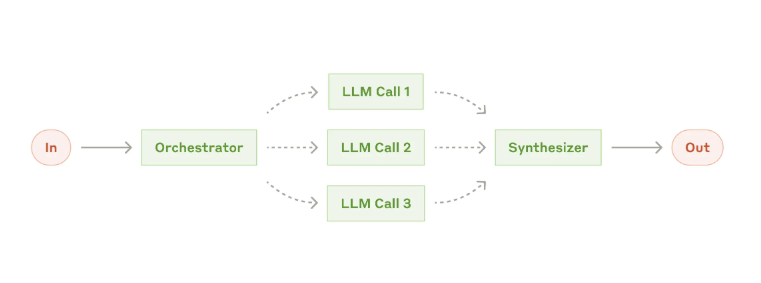
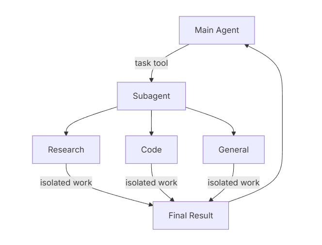
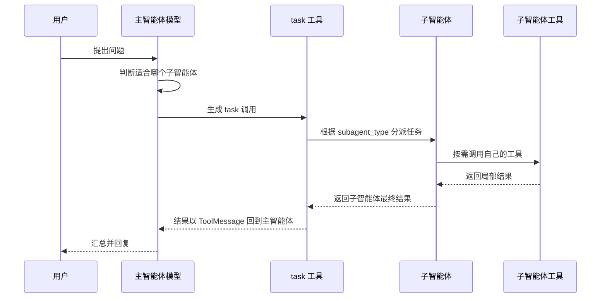

# 3 - 深度研搜：子智能体进阶与异步执行

<!-- TS-TRACK-BANNER -->
> **TS 生态对照（本仓库）**：深度研搜原项目偏 Python DeepAgents；TypeScript 对照请看 `examples/12-langgraph-multi-agent`、`examples/11-langgraph-tool-agent`、`examples/14-mcp`。

> **TypeScript 轨道说明**：中文讲解保留原教程；**代码块使用仓库内真实 TypeScript**（`examples/` / 精校案例 / `apps/shop-query-agent`），不再使用机翻 Python。
> 精校清单：[POLISHED-CASES](POLISHED-CASES.md)


## TypeScript 可运行示例（推荐）

本章优先对照仓库真实文件：`examples/12-langgraph-multi-agent/index.ts`

```typescript
// examples/12-langgraph-multi-agent/index.ts
/**
 * Maps to: 案例与源码-3-LangGraph框架/08-multi_agent
 * Python refs: SupervisorV0.3/V1.0.py, SupervisorHandoff.py
 *
 * Teaching version of supervisor + specialist workers (with step guard).
 */
import {
  AIMessage,
  HumanMessage,
  SystemMessage,
  type BaseMessage,
} from "@langchain/core/messages";
import {
  Annotation,
  END,
  START,
  StateGraph,
  messagesStateReducer,
} from "@langchain/langgraph";
import { z } from "zod";
import { createChatModel } from "../../src/shared/llm.js";
import { getWeatherTool, searchPolicyTool } from "../../src/shared/tools.js";
import { printRunHeader } from "../../src/shared/env.js";

const RouteSchema = z.object({
  next: z.enum(["weather", "policy", "FINISH"]),
  reason: z.string(),
});

const MultiAgentState = Annotation.Root({
  messages: Annotation<BaseMessage[]>({
    reducer: messagesStateReducer,
    default: () => [],
  }),
  next: Annotation<string>({
    reducer: (_prev, next) => next,
    default: () => "supervisor",
  }),
  steps: Annotation<number>({
    reducer: (_prev, next) => next,
    default: () => 0,
  }),
  visited: Annotation<string[]>({
    reducer: (prev, next) => Array.from(new Set([...prev, ...next])),
    default: () => [],
  }),
});

async function supervisorNode(state: typeof MultiAgentState.State) {
  // Safety: prevent infinite supervisor loops in demos.
  if (state.steps >= 4 || state.visited.length >= 2) {
    return {
      next: "FINISH",
      steps: state.steps + 1,
      messages: [new AIMessage("主管：信息已足够，结束本轮调度。")],
    };
  }

  const model = createChatModel(0).withStructuredOutput(RouteSchema);
  const decision = await model.invoke([
    new SystemMessage(
      [
        "你是主管 Agent，只负责路由。",
        "weather: 天气相关",
        "policy: 公司制度/报销/请假",
        "FINISH: 已有足够答案",
        `已访问专家: ${state.visited.join(", ") || "无"}`,
        "不要重复已访问专家。",
      ].join("\n"),
    ),
    ...state.messages,
  ]);

  // Avoid re-entering the same worker.
  let next = decision.next;
  if (next !== "FINISH" && state.visited.includes(next)) {
    next = "FINISH";
  }

  console.log("[supervisor]", { ...decision, next });
  return {
    next,
    steps: state.steps + 1,
    messages: [new AIMessage(`主管路由到：${next}（${decision.reason}）`)],
  };
}

async function weatherNode(state: typeof MultiAgentState.State) {
  const lastHuman = [...state.messages]
    .reverse()
    .find((m) => m.getType() === "human");
  const text = String(lastHuman?.content ?? "");
  const cityMatch = text.match(/北京|上海|深圳|杭州|广州/)?.[0] ?? "北京";
  const weather = await getWeatherTool.invoke({ city: cityMatch });
  return {
    next: "supervisor",
    visited: ["weather"],
    messages: [new AIMessage(`天气专员：${cityMatch} => ${weather}`)],
  };
}

async function policyNode(state: typeof MultiAgentState.State) {
  const lastHuman = [...state.messages]
    .reverse()
    .find((m) => m.getType() === "human");
  const text = String(lastHuman?.content ?? "报销");
  const keyword = /请假|加班|报销|设备/.exec(text)?.[0] ?? "报销";
  const policy = await searchPolicyTool.invoke({ keyword });

  const model = createChatModel(0);
  const polished = await model.invoke([
    new SystemMessage("你是制度专员，把检索结果整理成员工可执行答复。"),
    new HumanMessage(`用户问题：${text}\n检索结果：${policy}`),
  ]);

  return {
    next: "supervisor",
    visited: ["policy"],
    messages: [new AIMessage(`制度专员：${polished.content}`)],
  };
}

function routeFromSupervisor(state: typeof MultiAgentState.State) {
  if (state.next === "weather") return "weather";
  if (state.next === "policy") return "policy";
  return END;
}

function buildGraph() {
  return new StateGraph(MultiAgentState)
    .addNode("supervisor", supervisorNode)
    .addNode("weather", weatherNode)
    .addNode("policy", policyNode)
    .addEdge(START, "supervisor")
    .addConditionalEdges("supervisor", routeFromSupervisor, {
      weather: "weather",
      policy: "policy",
      [END]: END,
    })
    .addEdge("weather", "supervisor")
    .addEdge("policy", "supervisor")
    .compile();
}

async function main() {
  printRunHeader("12-langgraph-multi-agent | supervisor pattern");

  const app = buildGraph();
  const result = await app.invoke({
    messages: [
      new HumanMessage("我想了解差旅报销规则，另外顺便说下北京今天天气。"),
    ],
    next: "supervisor",
    steps: 0,
    visited: [],
  });

  console.log("\n===== transcript =====");
  for (const msg of result.messages) {
    console.log(`\n[${msg.getType()}] ${msg.content}`);
  }
}

main().catch((err) => {
  console.error(err);
  process.exit(1);
});
```

```bash
npx tsx examples/12-langgraph-multi-agent/index.ts
```


---

**本章课程目标：**

- 掌握字典方式配置子智能体的基本写法。
- 能判断一个能力更适合做成普通工具，还是拆成子智能体。
- 理解同步流式执行和异步流式执行的区别，能使用 `astream()` + `async/await.gather()` 并发处理多个任务。
- 了解 DeepAgents 子智能体嵌套的设计边界。

**学习建议：** 这一章重点不是“多建几个助手”，而是判断任务什么时候真的值得拆。读代码时按三步走：先看子智能体负责什么，再看它如何注册到主智能体，最后从 `stream()` 输出里观察主智能体有没有把任务交给它。异步部分先看调度结果，再回头看实现细节。

**对应代码分支：** `03-deepagents-subagents-async`

**参考资料：**
DeepAgents 子智能体：https://docs.langchain.com/oss/javascript/deepagents/subagents

---

前两章我们已经跑通了一个最小 DeepAgent：主智能体可以接收用户问题，调用 `internet_search` 工具，最后整理出结果。

第 1 章讲的是子智能体的概念和设计边界，第 2 章讲的是如何在 `stream()` 输出里识别工具调用，并预留 `task` 分支。从这一章开始，我们正式写子智能体配置和调度代码。

在真实项目里，一个复杂任务往往不只需要一个工具。以「深度研搜」为例，后面完整项目会涉及：联网搜索公开资料、查询业务数据库、检索企业私有知识库等能力。如果这些能力全部堆到一个主智能体里，主智能体会变得很重：工具多、提示词长、上下文混乱，模型也更容易在不同任务之间摇摆。

所以本章会把一些能力拆成几个简单助手：主智能体负责判断和分派，子智能体负责各自的小任务。



本章主要对应项目中的三个示例文件：

| 文件                             | 主题             | 解决的问题                                        |
| -------------------------------- | ---------------- | ------------------------------------------------- |
| `3-dict-subagents-routing.ts`    | 字典式子智能体   | 如何用 `subagents=[...]` 注册多个助手             |
| `4-async-subagents-streaming.ts` | 异步执行         | 如何用 `astream()` 和 `async/await.gather()` 并发执行 |
| `5-subagent-nesting-limits.ts`   | 子智能体嵌套边界 | 为什么普通字典子智能体不适合直接再套子智能体      |

---

## 1、先判断：该用工具还是子智能体

### 1.1 子智能体解决的核心问题

第 1 章已经讲过：子智能体主要解决上下文隔离、专业分工和可控并行的问题。本章不再重复展开概念，而是把这个判断落到代码设计上。



主智能体先通过 `task` 派活，子智能体拿到独立任务后自己完成推理和工具调用，最后只把结果交回主智能体。这样主智能体不用背着所有细节继续往下推理。

写子智能体之前，先问一个很实际的问题：

> 这件事是否值得单独拆出一个助手？

如果答案是“是”，才继续配置它的 `name`、`description`、`system_prompt` 和 `tools`。

### 1.2 适合拆成子智能体的任务

一般来说，下面几类任务适合拆成子智能体。

| 场景                 | 说明                                   | 示例                             |
| -------------------- | -------------------------------------- | -------------------------------- |
| 多步骤任务上下文很乱 | 中间过程多，主智能体容易被大量信息干扰 | 深度研究、多轮搜索、多源资料整合 |
| 存在不同专业领域     | 不同任务需要不同知识和工具             | 金融分析、法律检索、数据库查询   |
| 需要不同模型能力     | 某些任务可能需要多模态或更强模型       | 图片理解、长文档分析、代码生成   |
| 主智能体只做统筹     | 主智能体像项目经理，只负责分派和汇总   | 「深度研搜」的 Main Agent        |

本章的天气助手、数学助手、翻译助手是非常小的教学例子，真实项目里的子智能体通常会更像“网络搜索助手”“数据库查询助手”“知识库检索助手”。

### 1.3 普通工具和子智能体的选择边界

子智能体不是越多越好。可以先用下面这张表做一个粗略判断。

| 任务类型                     | 更适合的形式 | 原因                                 |
| ---------------------------- | ------------ | ------------------------------------ |
| 一次函数调用就能完成         | 普通工具     | 成本低、链路短、结果更稳定           |
| 查询天气、简单计算、格式转换 | 普通工具     | 逻辑边界清楚，不需要独立上下文       |
| 多步搜索、阅读、分析、归纳   | 子智能体     | 需要独立提示词、独立上下文和多步执行 |
| 带专属工具和复杂策略的任务   | 子智能体     | 方便限制工具权限，也方便单独调试     |

举个例子：用户给一篇英文文章，希望先翻译成中文，再总结中文内容。这个任务虽然可以拆成“翻译助手”和“总结助手”，但它的语义非常连续，第二步强依赖第一步输出。拆开以后，主智能体还要在中间重新接收、再分派，反而会增加成本。

所以写代码前，更准确的判断标准不是“步骤多不多”，而是下面三个问题：

- 这些步骤是否需要不同专业能力？
- 这些步骤之间是否可以隔离上下文？
- 拆开以后收益是否大于额外成本？

一句话总结：**工具适合做确定的小动作，子智能体适合做需要思考的一段小任务。**

---

## 2、字典方式配置子智能体

### 2.1 子智能体的基本字段

DeepAgents 支持用字典定义轻量级子智能体。对于更复杂的场景，也可以使用 `CompiledSubAgent` 封装已有的 LangGraph / LangChain 智能体流程。

- 字典子智能体：配置一个简单助手。
- `CompiledSubAgent`：把一个完整 Agent / Graph 封装成子智能体。

本章先讲最容易入门的字典方式，后面第 4 章再展开 `CompiledSubAgent`。

一个最小的字典子智能体通常包含下面几个字段：

| 字段            | 作用                                           | 是否必填 |
| --------------- | ---------------------------------------------- | -------- |
| `name`          | 子智能体名称，主智能体调用时会使用             | 必填     |
| `description`   | 子智能体职责描述，主智能体靠它判断是否调用     | 必填     |
| `system_prompt` | 子智能体自己的系统提示词                       | 常用     |
| `tools`         | 子智能体可使用的工具列表                       | 常用     |
| `model`         | 子智能体使用的模型，不填则通常继承主智能体模型 | 可选     |

其中最关键的是 `name` 和 `description`。

`name` 是子智能体的唯一标识。后面流式输出里看到 `task` 调用时，`subagent_type` 就会对应这个名称。

`description` 是主智能体判断任务归属的依据。如果描述写得模糊，主智能体就容易分派错。

### 2.2 三个助手示例

项目对应文件路径：`deepsearch-agents/examples/3-dict-subagents-routing.ts`

本案例中定义了三个简单助手：天气助手、数学助手、翻译助手。

```typescript
// Real TypeScript from repo: examples/12-langgraph-multi-agent/index.ts
/**
 * Maps to: 案例与源码-3-LangGraph框架/08-multi_agent
 * Python refs: SupervisorV0.3/V1.0.py, SupervisorHandoff.py
 *
 * Teaching version of supervisor + specialist workers (with step guard).
 */
import {
  AIMessage,
  HumanMessage,
  SystemMessage,
  type BaseMessage,
} from "@langchain/core/messages";
import {
  Annotation,
  END,
  START,
  StateGraph,
  messagesStateReducer,
} from "@langchain/langgraph";
import { z } from "zod";
import { createChatModel } from "../../src/shared/llm.js";
import { getWeatherTool, searchPolicyTool } from "../../src/shared/tools.js";
import { printRunHeader } from "../../src/shared/env.js";

const RouteSchema = z.object({
  next: z.enum(["weather", "policy", "FINISH"]),
  reason: z.string(),
});

const MultiAgentState = Annotation.Root({
  messages: Annotation<BaseMessage[]>({
    reducer: messagesStateReducer,
    default: () => [],
  }),
  next: Annotation<string>({
    reducer: (_prev, next) => next,
    default: () => "supervisor",
  }),
  steps: Annotation<number>({
    reducer: (_prev, next) => next,
    default: () => 0,
  }),
  visited: Annotation<string[]>({
    reducer: (prev, next) => Array.from(new Set([...prev, ...next])),
    default: () => [],
  }),
});

async function supervisorNode(state: typeof MultiAgentState.State) {
  // Safety: prevent infinite supervisor loops in demos.
  if (state.steps >= 4 || state.visited.length >= 2) {
    return {
      next: "FINISH",
      steps: state.steps + 1,
      messages: [new AIMessage("主管：信息已足够，结束本轮调度。")],
    };
  }

  const model = createChatModel(0).withStructuredOutput(RouteSchema);
  const decision = await model.invoke([
    new SystemMessage(
      [
        "你是主管 Agent，只负责路由。",
        "weather: 天气相关",
        "policy: 公司制度/报销/请假",
        "FINISH: 已有足够答案",
        `已访问专家: ${state.visited.join(", ") || "无"}`,
        "不要重复已访问专家。",
      ].join("\n"),
    ),
    ...state.messages,
  ]);

  // Avoid re-entering the same worker.
  let next = decision.next;
  if (next !== "FINISH" && state.visited.includes(next)) {
    next = "FINISH";
  }

  console.log("[supervisor]", { ...decision, next });
  return {
    next,
    steps: state.steps + 1,
    messages: [new AIMessage(`主管路由到：${next}（${decision.reason}）`)],
  };
}

async function weatherNode(state: typeof MultiAgentState.State) {
  const lastHuman = [...state.messages]
    .reverse()
    .find((m) => m.getType() === "human");
  const text = String(lastHuman?.content ?? "");
  const cityMatch = text.match(/北京|上海|深圳|杭州|广州/)?.[0] ?? "北京";
  const weather = await getWeatherTool.invoke({ city: cityMatch });
  return {
    next: "supervisor",
    visited: ["weather"],
    messages: [new AIMessage(`天气专员：${cityMatch} => ${weather}`)],
  };
}

async function policyNode(state: typeof MultiAgentState.State) {
  const lastHuman = [...state.messages]
    .reverse()
    .find((m) => m.getType() === "human");
  const text = String(lastHuman?.content ?? "报销");
  const keyword = /请假|加班|报销|设备/.exec(text)?.[0] ?? "报销";
  const policy = await searchPolicyTool.invoke({ keyword });

  const model = createChatModel(0);
  const polished = await model.invoke([
    new SystemMessage("你是制度专员，把检索结果整理成员工可执行答复。"),
    new HumanMessage(`用户问题：${text}\n检索结果：${policy}`),
  ]);

  return {
    next: "supervisor",
    visited: ["policy"],
    messages: [new AIMessage(`制度专员：${polished.content}`)],
  };
}

function routeFromSupervisor(state: typeof MultiAgentState.State) {
  if (state.next === "weather") return "weather";
  if (state.next === "policy") return "policy";
  return END;
}

function buildGraph() {
  return new StateGraph(MultiAgentState)
    .addNode("supervisor", supervisorNode)
    .addNode("weather", weatherNode)
    .addNode("policy", policyNode)
    .addEdge(START, "supervisor")
    .addConditionalEdges("supervisor", routeFromSupervisor, {
      weather: "weather",
      policy: "policy",
      [END]: END,
    })
    .addEdge("weather", "supervisor")
    .addEdge("policy", "supervisor")
    .compile();
}

async function main() {
  printRunHeader("12-langgraph-multi-agent | supervisor pattern");

  const app = buildGraph();
  const result = await app.invoke({
    messages: [
      new HumanMessage("我想了解差旅报销规则，另外顺便说下北京今天天气。"),
    ],
    next: "supervisor",
    steps: 0,
    visited: [],
  });

  console.log("\n===== transcript =====");
  for (const msg of result.messages) {
    console.log(`\n[${msg.getType()}] ${msg.content}`);
  }
}

main().catch((err) => {
  console.error(err);
  process.exit(1);
});
```

这个例子故意把三个助手设计得很简单，是为了让我们先看懂主智能体如何做调度。真实项目里，天气查询、简单计算、中英翻译不一定都要拆成子智能体；本章这样写，主要是为了演示下面几个知识点：

- 如何用字典定义子智能体；
- 如何通过 `subagents=[...]` 注册多个子智能体；
- 主智能体如何通过 `task` 工具选择不同子智能体；
- 如何在 `stream()` 输出中观察子智能体调度过程。

### 2.3 注册到主智能体

创建主智能体时，把这些字典放进 `subagents` 即可。

```typescript
// Real TypeScript from repo: examples/11-langgraph-tool-agent/index.ts
/**
 * Maps to LangGraph tool-calling agent pattern
 * (course chapters 21-24: agent loop as a graph)
 */
import {
  AIMessage,
  HumanMessage,
  SystemMessage,
  ToolMessage,
  type BaseMessage,
} from "@langchain/core/messages";
import { tool } from "@langchain/core/tools";
import { Annotation, END, START, StateGraph, messagesStateReducer } from "@langchain/langgraph";
import { z } from "zod";
import { createChatModel } from "../../src/shared/llm.js";
import { addNumberTool, getWeatherTool } from "../../src/shared/tools.js";
import { printRunHeader } from "../../src/shared/env.js";

const tools = [addNumberTool, getWeatherTool];
const toolsByName = Object.fromEntries(tools.map((t) => [t.name, t]));
void toolsByName;

const AgentState = Annotation.Root({
  messages: Annotation<BaseMessage[]>({
    reducer: messagesStateReducer,
    default: () => [],
  }),
});

async function agentNode(state: typeof AgentState.State) {
  const model = createChatModel(0).bindTools(tools);
  const response = await model.invoke([
    new SystemMessage(
      "你是工具增强助手。需要计算或查天气时必须调用工具，不要编造。",
    ),
    ...state.messages,
  ]);
  return { messages: [response] };
}

async function toolNode(state: typeof AgentState.State) {
  const last = state.messages[state.messages.length - 1];
  if (!(last instanceof AIMessage) || !last.tool_calls?.length) {
    return { messages: [] };
  }

  const outputs: ToolMessage[] = [];
  for (const call of last.tool_calls) {
    let observation: string;
    if (call.name === "add_number") {
      observation = String(
        await addNumberTool.invoke(call.args as { a: number; b: number }),
      );
    } else if (call.name === "get_weather") {
      observation = String(
        await getWeatherTool.invoke(call.args as { city: string }),
      );
    } else {
      observation = `Unknown tool: ${call.name}`;
    }
    outputs.push(
      new ToolMessage({
        content: observation,
        tool_call_id: call.id ?? call.name,
      }),
    );
  }
  return { messages: outputs };
}

function shouldContinue(state: typeof AgentState.State) {
  const last = state.messages[state.messages.length - 1];
  if (last instanceof AIMessage && last.tool_calls?.length) {
    return "tools";
  }
  return END;
}

function buildGraph() {
  return new StateGraph(AgentState)
    .addNode("agent", agentNode)
    .addNode("tools", toolNode)
    .addEdge(START, "agent")
    .addConditionalEdges("agent", shouldContinue, {
      tools: "tools",
      [END]: END,
    })
    .addEdge("tools", "agent")
    .compile();
}

async function main() {
  printRunHeader("11-langgraph-tool-agent | manual ReAct graph");

  // tiny local tool to show schema flexibility
  const echo = tool(async ({ text }) => `echo:${text}`, {
    name: "echo",
    description: "Echo text",
    schema: z.object({ text: z.string() }),
  });
  void echo;

  const app = buildGraph();
  const result = await app.invoke({
    messages: [
      new HumanMessage("请计算 8+15，并告诉我北京天气，最后中文总结。"),
    ],
  });

  for (const msg of result.messages) {
    console.log(`\n[${msg.getType()}]`, msg.content);
    if (msg instanceof AIMessage && msg.tool_calls?.length) {
      console.log(" tool_calls:", JSON.stringify(msg.tool_calls, null, 2));
    }
  }
}

main().catch((err) => {
  console.error(err);
  process.exit(1);
});
```

这里有两个细节。

**第一，**主智能体的 `tools=[]`，说明它自己不直接调用普通工具，而是主要负责分派任务。

**第二，**系统提示词要说清楚主智能体的边界：它不是天气助手、数学助手或翻译助手本身，而是负责把任务交给合适的子智能体。

---

## 3、观察主智能体如何调度子智能体

### 3.1 先看打印入口和输出效果

前面已经把子智能体注册到了 `subagents` 中。接下来不要急着分析内部原理，先看代码里是从哪里把调度过程打印出来的。

在 `3-dict-subagents-routing.ts` 里，最后执行了两次 `test_stream()`：

```typescript
// Real TypeScript from repo: examples/09-agent/index.ts
/**
 * Maps to: 案例与源码-2-LangChain框架/12-agent
 * Python refs: AgentSmartSelectV1.0.py, AgentReact.py
 *
 * Modern LangChain JS path: createReactAgent (tool-calling ReAct loop).
 */
import { HumanMessage } from "@langchain/core/messages";
import { tool } from "@langchain/core/tools";
import { createReactAgent } from "@langchain/langgraph/prebuilt";
import { z } from "zod";
import { createChatModel } from "../../src/shared/llm.js";
import { basicTools } from "../../src/shared/tools.js";
import { printRunHeader } from "../../src/shared/env.js";

const PRODUCT_DATABASE: Record<
  string,
  Array<{ id: string; name: string; popularity: number; price: number }>
> = {
  无线耳机: [
    { id: "WH-1000XM5", name: "索尼 WH-1000XM5", popularity: 95, price: 299 },
    { id: "QC45", name: "Bose QuietComfort 45", popularity: 88, price: 329 },
  ],
  游戏鼠标: [
    { id: "GPW", name: "罗技 G Pro 无线", popularity: 90, price: 129 },
    { id: "VIPER", name: "雷蛇 Viper V2 Pro", popularity: 87, price: 149 },
  ],
};

const INVENTORY: Record<string, { stock: number; location: string }> = {
  "WH-1000XM5": { stock: 10, location: "仓库-A" },
  QC45: { stock: 0, location: "仓库-B" },
  GPW: { stock: 8, location: "仓库-C" },
  VIPER: { stock: 12, location: "仓库-A" },
};

const searchProductsTool = tool(
  async ({ query }) => {
    const category = Object.keys(PRODUCT_DATABASE).find((c) => query.includes(c));
    if (!category) return `未找到与「${query}」匹配的产品类别`;
    const items = [...PRODUCT_DATABASE[category]].sort(
      (a, b) => b.popularity - a.popularity,
    );
    return items
      .map(
        (p, i) =>
          `${i + 1}. ${p.name} (ID:${p.id}) 热度${p.popularity} ￥${p.price}`,
      )
      .join("\n");
  },
  {
    name: "search_products",
    description: "按类别搜索产品，如无线耳机、游戏鼠标",
    schema: z.object({ query: z.string() }),
  },
);

const checkInventoryTool = tool(
  async ({ productId }) => {
    const info = INVENTORY[productId];
    if (!info) return `未找到产品ID: ${productId}`;
    const status = info.stock > 0 ? "有库存" : "缺货";
    return `${productId}: ${status} (${info.stock}) @ ${info.location}`;
  },
  {
    name: "check_inventory",
    description: "根据产品 ID 查询库存",
    schema: z.object({ productId: z.string() }),
  },
);

async function runMathWeatherAgent() {
  printRunHeader("09-agent | tool agent (math + weather)");
  const agent = createReactAgent({
    llm: createChatModel(0),
    tools: basicTools,
  });

  const result = await agent.invoke({
    messages: [
      new HumanMessage("请计算 45+17，并查询深圳天气，最后用中文给一个简短总结。"),
    ],
  });

  const last = result.messages[result.messages.length - 1];
  console.log("[final]", last.content);
}

async function runReactShopAgent() {
  printRunHeader("09-agent | ReAct shop agent (search + inventory)");
  const agent = createReactAgent({
    llm: createChatModel(0),
    tools: [searchProductsTool, checkInventoryTool],
  });

  const result = await agent.invoke({
    messages: [
      new HumanMessage(
        "帮我找最受欢迎的无线耳机，并检查第一名的库存，用中文给出购买建议。",
      ),
    ],
  });

  for (const msg of result.messages) {
    const role = msg.getType?.() ?? msg.constructor.name;
    console.log(`\n[${role}]`, msg.content);
  }
}

async function main() {
  await runMathWeatherAgent();
  await runReactShopAgent();
}

main().catch((err) => {
  console.error(err);
  process.exit(1);
});
```

也就是说，我们不是只看最终回答，而是通过 `test_stream()` 一边执行，一边把主智能体的关键动作打印出来。

执行文件验证，成功：

```text
uv run examples/3-dict-subagents-routing.py

【model】决定调用子智能体weather_helper
【agent】调用了具体的工具task,返回结果为：今天天气晴朗，温度25度。...
【model】返回最终结果：今天北京的天气晴朗，温度是25度。
【model】决定调用子智能体translate_helper
【agent】调用了具体的工具task,返回结果为：You are the best....
【model】返回最终结果："你是最棒的" 翻译成英文是 "You are the best."
```

以天气查询这组输出为例，三行日志分别对应三件事：

| 输出片段                                  | 代表的含义                                         |
| ----------------------------------------- | -------------------------------------------------- |
| `【model】决定调用子智能体weather_helper` | 主智能体判断这个问题应该交给天气助手处理           |
| `【agent】调用了具体的工具task`           | DeepAgents 执行 `task`，也就是实际去调用子智能体   |
| `【model】返回最终结果`                   | 主智能体拿到子智能体结果后，再整理成最终回复给用户 |

后面分析 `task` 工具调用时，心里先记住这条线就可以：

```text
用户问题 -> 主智能体选择子智能体 -> task 执行 -> 子智能体返回结果 -> 主智能体整理最终回复
```

### 3.2 子智能体调用本质上是 task 工具调用

现在再看一个关键点：主智能体并不是直接跳到某个子智能体里执行，而是先由模型做一次决策。

在 DeepAgents 中，主智能体调用子智能体时，通常会表现为一次特殊工具调用：

```typescript
// Real TypeScript from repo: examples/14-mcp/client-agent.ts
/**
 * Maps to: 案例与源码-2-LangChain框架/11-mcp/McpClientAgent.py
 *
 * Flow:
 * 1) spawn local MCP server over stdio
 * 2) list MCP tools
 * 3) wrap tools as LangChain tools
 * 4) run createReactAgent once with a user question
 */
import { dirname, join } from "node:path";
import { fileURLToPath } from "node:url";
import { Client } from "@modelcontextprotocol/sdk/client/index.js";
import { StdioClientTransport } from "@modelcontextprotocol/sdk/client/stdio.js";
import { DynamicStructuredTool } from "@langchain/core/tools";
import { HumanMessage } from "@langchain/core/messages";
import { createReactAgent } from "@langchain/langgraph/prebuilt";
import { z } from "zod";
import { createChatModel } from "../../src/shared/llm.js";
import { printRunHeader } from "../../src/shared/env.js";

const __dirname = dirname(fileURLToPath(import.meta.url));
const serverPath = join(__dirname, "server.ts");

function jsonSchemaToZod(inputSchema: unknown): z.ZodObject<z.ZodRawShape> {
  const schema = (inputSchema ?? {}) as {
    type?: string;
    properties?: Record<string, { type?: string; description?: string }>;
    required?: string[];
  };
  const shape: z.ZodRawShape = {};
  const required = new Set(schema.required ?? []);
  for (const [key, prop] of Object.entries(schema.properties ?? {})) {
    let field: z.ZodTypeAny =
      prop.type === "number" || prop.type === "integer"
        ? z.number()
        : prop.type === "boolean"
          ? z.boolean()
          : z.string();
    if (prop.description) field = field.describe(prop.description);
    if (!required.has(key)) field = field.optional();
    shape[key] = field;
  }
  return z.object(shape);
}

function textFromMcpResult(result: {
  content?: Array<{ type: string; text?: string }>;
}): string {
  if (!result.content?.length) return JSON.stringify(result);
  return result.content
    .map((c) => (c.type === "text" ? (c.text ?? "") : JSON.stringify(c)))
    .join("\n");
}

async function main() {
  printRunHeader("14-mcp | MCP server tools -> LangChain Agent");

  const transport = new StdioClientTransport({
    command: process.platform === "win32" ? "npx.cmd" : "npx",
    args: ["tsx", serverPath],
    stderr: "pipe",
  });

  const client = new Client({ name: "mcp-demo-client", version: "0.1.0" });
  await client.connect(transport);

  try {
    const listed = await client.listTools();
    console.log(
      "MCP tools:",
      listed.tools.map((t) => t.name).join(", ") || "(none)",
    );

    const resources = await client.listResources();
    console.log(
      "MCP resources:",
      resources.resources.map((r) => r.uri).join(", ") || "(none)",
    );

    const lcTools = listed.tools.map((mcpTool) => {
      const schema = jsonSchemaToZod(mcpTool.inputSchema);
      return new DynamicStructuredTool({
        name: mcpTool.name,
        description: mcpTool.description || mcpTool.name,
        schema,
        func: async (input) => {
          const result = await client.callTool({
            name: mcpTool.name,
            arguments: input as Record<string, unknown>,
          });
          return textFromMcpResult(
            result as { content?: Array<{ type: string; text?: string }> },
          );
        },
      });
    });

    if (!lcTools.length) {
      throw new Error("No MCP tools available");
    }

    const agent = createReactAgent({
      llm: createChatModel(0),
      tools: lcTools,
    });

    const question =
      process.argv.slice(2).join(" ") ||
      "请计算 19+26，并查询上海天气，用中文简短总结。";
    console.log("\n[question]", question);

    const result = await agent.invoke({
      messages: [new HumanMessage(question)],
    });

    const last = result.messages[result.messages.length - 1];
    console.log("\n[final]", last.content);
  } finally {
    await client.close();
    await transport.close();
  }
}

main().catch((err) => {
  console.error(err);
  process.exit(1);
});
```

它的参数里会说明两件事：

- `subagent_type`：要调用哪个子智能体，对应前面配置里的 `name`。
- `description`：交给这个子智能体的具体任务。

```typescript
// Real TypeScript from repo: examples/12-langgraph-multi-agent/index.ts
/**
 * Maps to: 案例与源码-3-LangGraph框架/08-multi_agent
 * Python refs: SupervisorV0.3/V1.0.py, SupervisorHandoff.py
 *
 * Teaching version of supervisor + specialist workers (with step guard).
 */
import {
  AIMessage,
  HumanMessage,
  SystemMessage,
  type BaseMessage,
} from "@langchain/core/messages";
import {
  Annotation,
  END,
  START,
  StateGraph,
  messagesStateReducer,
} from "@langchain/langgraph";
import { z } from "zod";
import { createChatModel } from "../../src/shared/llm.js";
import { getWeatherTool, searchPolicyTool } from "../../src/shared/tools.js";
import { printRunHeader } from "../../src/shared/env.js";

const RouteSchema = z.object({
  next: z.enum(["weather", "policy", "FINISH"]),
  reason: z.string(),
});

const MultiAgentState = Annotation.Root({
  messages: Annotation<BaseMessage[]>({
    reducer: messagesStateReducer,
    default: () => [],
  }),
  next: Annotation<string>({
    reducer: (_prev, next) => next,
    default: () => "supervisor",
  }),
  steps: Annotation<number>({
    reducer: (_prev, next) => next,
    default: () => 0,
  }),
  visited: Annotation<string[]>({
    reducer: (prev, next) => Array.from(new Set([...prev, ...next])),
    default: () => [],
  }),
});

async function supervisorNode(state: typeof MultiAgentState.State) {
  // Safety: prevent infinite supervisor loops in demos.
  if (state.steps >= 4 || state.visited.length >= 2) {
    return {
      next: "FINISH",
      steps: state.steps + 1,
      messages: [new AIMessage("主管：信息已足够，结束本轮调度。")],
    };
  }

  const model = createChatModel(0).withStructuredOutput(RouteSchema);
  const decision = await model.invoke([
    new SystemMessage(
      [
        "你是主管 Agent，只负责路由。",
        "weather: 天气相关",
        "policy: 公司制度/报销/请假",
        "FINISH: 已有足够答案",
        `已访问专家: ${state.visited.join(", ") || "无"}`,
        "不要重复已访问专家。",
      ].join("\n"),
    ),
    ...state.messages,
  ]);

  // Avoid re-entering the same worker.
  let next = decision.next;
  if (next !== "FINISH" && state.visited.includes(next)) {
    next = "FINISH";
  }

  console.log("[supervisor]", { ...decision, next });
  return {
    next,
    steps: state.steps + 1,
    messages: [new AIMessage(`主管路由到：${next}（${decision.reason}）`)],
  };
}

async function weatherNode(state: typeof MultiAgentState.State) {
  const lastHuman = [...state.messages]
    .reverse()
    .find((m) => m.getType() === "human");
  const text = String(lastHuman?.content ?? "");
  const cityMatch = text.match(/北京|上海|深圳|杭州|广州/)?.[0] ?? "北京";
  const weather = await getWeatherTool.invoke({ city: cityMatch });
  return {
    next: "supervisor",
    visited: ["weather"],
    messages: [new AIMessage(`天气专员：${cityMatch} => ${weather}`)],
  };
}

async function policyNode(state: typeof MultiAgentState.State) {
  const lastHuman = [...state.messages]
    .reverse()
    .find((m) => m.getType() === "human");
  const text = String(lastHuman?.content ?? "报销");
  const keyword = /请假|加班|报销|设备/.exec(text)?.[0] ?? "报销";
  const policy = await searchPolicyTool.invoke({ keyword });

  const model = createChatModel(0);
  const polished = await model.invoke([
    new SystemMessage("你是制度专员，把检索结果整理成员工可执行答复。"),
    new HumanMessage(`用户问题：${text}\n检索结果：${policy}`),
  ]);

  return {
    next: "supervisor",
    visited: ["policy"],
    messages: [new AIMessage(`制度专员：${polished.content}`)],
  };
}

function routeFromSupervisor(state: typeof MultiAgentState.State) {
  if (state.next === "weather") return "weather";
  if (state.next === "policy") return "policy";
  return END;
}

function buildGraph() {
  return new StateGraph(MultiAgentState)
    .addNode("supervisor", supervisorNode)
    .addNode("weather", weatherNode)
    .addNode("policy", policyNode)
    .addEdge(START, "supervisor")
    .addConditionalEdges("supervisor", routeFromSupervisor, {
      weather: "weather",
      policy: "policy",
      [END]: END,
    })
    .addEdge("weather", "supervisor")
    .addEdge("policy", "supervisor")
    .compile();
}

async function main() {
  printRunHeader("12-langgraph-multi-agent | supervisor pattern");

  const app = buildGraph();
  const result = await app.invoke({
    messages: [
      new HumanMessage("我想了解差旅报销规则，另外顺便说下北京今天天气。"),
    ],
    next: "supervisor",
    steps: 0,
    visited: [],
  });

  console.log("\n===== transcript =====");
  for (const msg of result.messages) {
    console.log(`\n[${msg.getType()}] ${msg.content}`);
  }
}

main().catch((err) => {
  console.error(err);
  process.exit(1);
});
```

也就是说，从主智能体视角看，子智能体是一种可调度能力。它不是普通 TypeScript 函数工具，而是一个拥有独立提示词、独立工具集和独立上下文的 Agent。



所以，子智能体并不是“凭空被调用”的。主智能体先请求模型判断下一步，模型返回 `task` 工具调用，DeepAgents 再根据 `subagent_type` 找到对应子智能体执行。

这里还要补一个容易混淆的细节：**子智能体不是普通工具，但它在主智能体眼里会像工具一样返回结果。**

原因是主智能体调用子智能体时，走的是 `task` 这个特殊工具。子智能体执行完以后，它的结果会回到主智能体这边，并且通常表现为一条 `ToolMessage`。

所以在流式输出里，经常会看到类似下面的三段过程：

```text
第 1 次 model 输出：主智能体决定调用 task，也就是决定分派子智能体
中间 tools 输出：task 执行完成，子智能体结果以 ToolMessage 形式返回
第 2 次 model 输出：主智能体基于子智能体结果，整理最终回复
```

如果把子智能体内部也算上，它自己执行任务时通常还会调用一次模型。也就是说，一个“主智能体调用子智能体再回答”的简单流程，常见链路是：

```text
主智能体模型：判断调用哪个子智能体
子智能体模型：完成被分派的局部任务
主智能体模型：整合子智能体结果并输出最终答案
```

这也是为什么子智能体比普通工具成本更高：普通工具通常只是一次函数或 API 调用，而子智能体本身还会走一段 Agent 执行过程。

### 3.3 如何在流式输出里识别 task

第 2 章已经讲过，`stream()` 会不断产出类似下面的 `chunk`：

```typescript
// Real TypeScript from repo: examples/11-langgraph-tool-agent/index.ts
/**
 * Maps to LangGraph tool-calling agent pattern
 * (course chapters 21-24: agent loop as a graph)
 */
import {
  AIMessage,
  HumanMessage,
  SystemMessage,
  ToolMessage,
  type BaseMessage,
} from "@langchain/core/messages";
import { tool } from "@langchain/core/tools";
import { Annotation, END, START, StateGraph, messagesStateReducer } from "@langchain/langgraph";
import { z } from "zod";
import { createChatModel } from "../../src/shared/llm.js";
import { addNumberTool, getWeatherTool } from "../../src/shared/tools.js";
import { printRunHeader } from "../../src/shared/env.js";

const tools = [addNumberTool, getWeatherTool];
const toolsByName = Object.fromEntries(tools.map((t) => [t.name, t]));
void toolsByName;

const AgentState = Annotation.Root({
  messages: Annotation<BaseMessage[]>({
    reducer: messagesStateReducer,
    default: () => [],
  }),
});

async function agentNode(state: typeof AgentState.State) {
  const model = createChatModel(0).bindTools(tools);
  const response = await model.invoke([
    new SystemMessage(
      "你是工具增强助手。需要计算或查天气时必须调用工具，不要编造。",
    ),
    ...state.messages,
  ]);
  return { messages: [response] };
}

async function toolNode(state: typeof AgentState.State) {
  const last = state.messages[state.messages.length - 1];
  if (!(last instanceof AIMessage) || !last.tool_calls?.length) {
    return { messages: [] };
  }

  const outputs: ToolMessage[] = [];
  for (const call of last.tool_calls) {
    let observation: string;
    if (call.name === "add_number") {
      observation = String(
        await addNumberTool.invoke(call.args as { a: number; b: number }),
      );
    } else if (call.name === "get_weather") {
      observation = String(
        await getWeatherTool.invoke(call.args as { city: string }),
      );
    } else {
      observation = `Unknown tool: ${call.name}`;
    }
    outputs.push(
      new ToolMessage({
        content: observation,
        tool_call_id: call.id ?? call.name,
      }),
    );
  }
  return { messages: outputs };
}

function shouldContinue(state: typeof AgentState.State) {
  const last = state.messages[state.messages.length - 1];
  if (last instanceof AIMessage && last.tool_calls?.length) {
    return "tools";
  }
  return END;
}

function buildGraph() {
  return new StateGraph(AgentState)
    .addNode("agent", agentNode)
    .addNode("tools", toolNode)
    .addEdge(START, "agent")
    .addConditionalEdges("agent", shouldContinue, {
      tools: "tools",
      [END]: END,
    })
    .addEdge("tools", "agent")
    .compile();
}

async function main() {
  printRunHeader("11-langgraph-tool-agent | manual ReAct graph");

  // tiny local tool to show schema flexibility
  const echo = tool(async ({ text }) => `echo:${text}`, {
    name: "echo",
    description: "Echo text",
    schema: z.object({ text: z.string() }),
  });
  void echo;

  const app = buildGraph();
  const result = await app.invoke({
    messages: [
      new HumanMessage("请计算 8+15，并告诉我北京天气，最后中文总结。"),
    ],
  });

  for (const msg of result.messages) {
    console.log(`\n[${msg.getType()}]`, msg.content);
    if (msg instanceof AIMessage && msg.tool_calls?.length) {
      console.log(" tool_calls:", JSON.stringify(msg.tool_calls, null, 2));
    }
  }
}

main().catch((err) => {
  console.error(err);
  process.exit(1);
});
```

本章重点看 `model` 节点里最后一条消息的 `tool_calls`。普通工具调用和子智能体调用都会出现在这里，区别主要看工具名。

| 观察位置            | 普通工具调用                           | 子智能体调用                                     |
| ------------------- | -------------------------------------- | ------------------------------------------------ |
| `tool_call["name"]` | 工具自己的名字，例如 `internet_search` | 固定是 `task`                                    |
| `tool_call["args"]` | 普通工具的入参                         | 包含 `subagent_type` 和 `description`            |
| 返回结果所在节点    | `tools`                                | 也是 `tools`，因为 `task` 本身表现为一个工具结果 |

所以在流式解析代码里，只要判断工具名是不是 `task`，就能区分“调用普通工具”和“分派子智能体”：

```typescript
// Real TypeScript from repo: examples/09-agent/index.ts
/**
 * Maps to: 案例与源码-2-LangChain框架/12-agent
 * Python refs: AgentSmartSelectV1.0.py, AgentReact.py
 *
 * Modern LangChain JS path: createReactAgent (tool-calling ReAct loop).
 */
import { HumanMessage } from "@langchain/core/messages";
import { tool } from "@langchain/core/tools";
import { createReactAgent } from "@langchain/langgraph/prebuilt";
import { z } from "zod";
import { createChatModel } from "../../src/shared/llm.js";
import { basicTools } from "../../src/shared/tools.js";
import { printRunHeader } from "../../src/shared/env.js";

const PRODUCT_DATABASE: Record<
  string,
  Array<{ id: string; name: string; popularity: number; price: number }>
> = {
  无线耳机: [
    { id: "WH-1000XM5", name: "索尼 WH-1000XM5", popularity: 95, price: 299 },
    { id: "QC45", name: "Bose QuietComfort 45", popularity: 88, price: 329 },
  ],
  游戏鼠标: [
    { id: "GPW", name: "罗技 G Pro 无线", popularity: 90, price: 129 },
    { id: "VIPER", name: "雷蛇 Viper V2 Pro", popularity: 87, price: 149 },
  ],
};

const INVENTORY: Record<string, { stock: number; location: string }> = {
  "WH-1000XM5": { stock: 10, location: "仓库-A" },
  QC45: { stock: 0, location: "仓库-B" },
  GPW: { stock: 8, location: "仓库-C" },
  VIPER: { stock: 12, location: "仓库-A" },
};

const searchProductsTool = tool(
  async ({ query }) => {
    const category = Object.keys(PRODUCT_DATABASE).find((c) => query.includes(c));
    if (!category) return `未找到与「${query}」匹配的产品类别`;
    const items = [...PRODUCT_DATABASE[category]].sort(
      (a, b) => b.popularity - a.popularity,
    );
    return items
      .map(
        (p, i) =>
          `${i + 1}. ${p.name} (ID:${p.id}) 热度${p.popularity} ￥${p.price}`,
      )
      .join("\n");
  },
  {
    name: "search_products",
    description: "按类别搜索产品，如无线耳机、游戏鼠标",
    schema: z.object({ query: z.string() }),
  },
);

const checkInventoryTool = tool(
  async ({ productId }) => {
    const info = INVENTORY[productId];
    if (!info) return `未找到产品ID: ${productId}`;
    const status = info.stock > 0 ? "有库存" : "缺货";
    return `${productId}: ${status} (${info.stock}) @ ${info.location}`;
  },
  {
    name: "check_inventory",
    description: "根据产品 ID 查询库存",
    schema: z.object({ productId: z.string() }),
  },
);

async function runMathWeatherAgent() {
  printRunHeader("09-agent | tool agent (math + weather)");
  const agent = createReactAgent({
    llm: createChatModel(0),
    tools: basicTools,
  });

  const result = await agent.invoke({
    messages: [
      new HumanMessage("请计算 45+17，并查询深圳天气，最后用中文给一个简短总结。"),
    ],
  });

  const last = result.messages[result.messages.length - 1];
  console.log("[final]", last.content);
}

async function runReactShopAgent() {
  printRunHeader("09-agent | ReAct shop agent (search + inventory)");
  const agent = createReactAgent({
    llm: createChatModel(0),
    tools: [searchProductsTool, checkInventoryTool],
  });

  const result = await agent.invoke({
    messages: [
      new HumanMessage(
        "帮我找最受欢迎的无线耳机，并检查第一名的库存，用中文给出购买建议。",
      ),
    ],
  });

  for (const msg of result.messages) {
    const role = msg.getType?.() ?? msg.constructor.name;
    console.log(`\n[${role}]`, msg.content);
  }
}

async function main() {
  await runMathWeatherAgent();
  await runReactShopAgent();
}

main().catch((err) => {
  console.error(err);
  process.exit(1);
});
```

这也是第 2 章解析流式输出时提前保留 `task` 分支的原因。第 2 章的示例没有真正配置子智能体，所以它只是一个预留入口；本章配置了 `subagents` 以后，这个分支才会真正发挥作用。

### 3.4 用 stream 打印调度过程

项目对应文件路径：`deepsearch-agents/examples/3-dict-subagents-routing.ts`

本案例中通过 `stream()` 观察主智能体的调度过程。

```typescript
// Real TypeScript from repo: examples/14-mcp/client-agent.ts
/**
 * Maps to: 案例与源码-2-LangChain框架/11-mcp/McpClientAgent.py
 *
 * Flow:
 * 1) spawn local MCP server over stdio
 * 2) list MCP tools
 * 3) wrap tools as LangChain tools
 * 4) run createReactAgent once with a user question
 */
import { dirname, join } from "node:path";
import { fileURLToPath } from "node:url";
import { Client } from "@modelcontextprotocol/sdk/client/index.js";
import { StdioClientTransport } from "@modelcontextprotocol/sdk/client/stdio.js";
import { DynamicStructuredTool } from "@langchain/core/tools";
import { HumanMessage } from "@langchain/core/messages";
import { createReactAgent } from "@langchain/langgraph/prebuilt";
import { z } from "zod";
import { createChatModel } from "../../src/shared/llm.js";
import { printRunHeader } from "../../src/shared/env.js";

const __dirname = dirname(fileURLToPath(import.meta.url));
const serverPath = join(__dirname, "server.ts");

function jsonSchemaToZod(inputSchema: unknown): z.ZodObject<z.ZodRawShape> {
  const schema = (inputSchema ?? {}) as {
    type?: string;
    properties?: Record<string, { type?: string; description?: string }>;
    required?: string[];
  };
  const shape: z.ZodRawShape = {};
  const required = new Set(schema.required ?? []);
  for (const [key, prop] of Object.entries(schema.properties ?? {})) {
    let field: z.ZodTypeAny =
      prop.type === "number" || prop.type === "integer"
        ? z.number()
        : prop.type === "boolean"
          ? z.boolean()
          : z.string();
    if (prop.description) field = field.describe(prop.description);
    if (!required.has(key)) field = field.optional();
    shape[key] = field;
  }
  return z.object(shape);
}

function textFromMcpResult(result: {
  content?: Array<{ type: string; text?: string }>;
}): string {
  if (!result.content?.length) return JSON.stringify(result);
  return result.content
    .map((c) => (c.type === "text" ? (c.text ?? "") : JSON.stringify(c)))
    .join("\n");
}

async function main() {
  printRunHeader("14-mcp | MCP server tools -> LangChain Agent");

  const transport = new StdioClientTransport({
    command: process.platform === "win32" ? "npx.cmd" : "npx",
    args: ["tsx", serverPath],
    stderr: "pipe",
  });

  const client = new Client({ name: "mcp-demo-client", version: "0.1.0" });
  await client.connect(transport);

  try {
    const listed = await client.listTools();
    console.log(
      "MCP tools:",
      listed.tools.map((t) => t.name).join(", ") || "(none)",
    );

    const resources = await client.listResources();
    console.log(
      "MCP resources:",
      resources.resources.map((r) => r.uri).join(", ") || "(none)",
    );

    const lcTools = listed.tools.map((mcpTool) => {
      const schema = jsonSchemaToZod(mcpTool.inputSchema);
      return new DynamicStructuredTool({
        name: mcpTool.name,
        description: mcpTool.description || mcpTool.name,
        schema,
        func: async (input) => {
          const result = await client.callTool({
            name: mcpTool.name,
            arguments: input as Record<string, unknown>,
          });
          return textFromMcpResult(
            result as { content?: Array<{ type: string; text?: string }> },
          );
        },
      });
    });

    if (!lcTools.length) {
      throw new Error("No MCP tools available");
    }

    const agent = createReactAgent({
      llm: createChatModel(0),
      tools: lcTools,
    });

    const question =
      process.argv.slice(2).join(" ") ||
      "请计算 19+26，并查询上海天气，用中文简短总结。";
    console.log("\n[question]", question);

    const result = await agent.invoke({
      messages: [new HumanMessage(question)],
    });

    const last = result.messages[result.messages.length - 1];
    console.log("\n[final]", last.content);
  } finally {
    await client.close();
    await transport.close();
  }
}

main().catch((err) => {
  console.error(err);
  process.exit(1);
});
```

这段代码和第 2 章的流式解析非常像，只是这里重点观察 `task`。`model` 节点用于观察主智能体的决策，`tools` 节点用于观察工具或子智能体执行后的返回结果。

当用户问“北京今天的天气怎么样？”时，主智能体应该选择 `weather_helper`。

当用户问“100 + 200 等于多少？”时，主智能体应该选择 `math_helper`。

当用户问“将 hello 翻译成中文”时，主智能体应该选择 `translate_helper`。

### 3.5 description 写不好会怎样

主智能体选择子智能体，主要依赖每个子智能体的 `description`。所以描述要尽量具体。

不太好的写法：

```typescript
// Real TypeScript from repo: examples/12-langgraph-multi-agent/index.ts
/**
 * Maps to: 案例与源码-3-LangGraph框架/08-multi_agent
 * Python refs: SupervisorV0.3/V1.0.py, SupervisorHandoff.py
 *
 * Teaching version of supervisor + specialist workers (with step guard).
 */
import {
  AIMessage,
  HumanMessage,
  SystemMessage,
  type BaseMessage,
} from "@langchain/core/messages";
import {
  Annotation,
  END,
  START,
  StateGraph,
  messagesStateReducer,
} from "@langchain/langgraph";
import { z } from "zod";
import { createChatModel } from "../../src/shared/llm.js";
import { getWeatherTool, searchPolicyTool } from "../../src/shared/tools.js";
import { printRunHeader } from "../../src/shared/env.js";

const RouteSchema = z.object({
  next: z.enum(["weather", "policy", "FINISH"]),
  reason: z.string(),
});

const MultiAgentState = Annotation.Root({
  messages: Annotation<BaseMessage[]>({
    reducer: messagesStateReducer,
    default: () => [],
  }),
  next: Annotation<string>({
    reducer: (_prev, next) => next,
    default: () => "supervisor",
  }),
  steps: Annotation<number>({
    reducer: (_prev, next) => next,
    default: () => 0,
  }),
  visited: Annotation<string[]>({
    reducer: (prev, next) => Array.from(new Set([...prev, ...next])),
    default: () => [],
  }),
});

async function supervisorNode(state: typeof MultiAgentState.State) {
  // Safety: prevent infinite supervisor loops in demos.
  if (state.steps >= 4 || state.visited.length >= 2) {
    return {
      next: "FINISH",
      steps: state.steps + 1,
      messages: [new AIMessage("主管：信息已足够，结束本轮调度。")],
    };
  }

  const model = createChatModel(0).withStructuredOutput(RouteSchema);
  const decision = await model.invoke([
    new SystemMessage(
      [
        "你是主管 Agent，只负责路由。",
        "weather: 天气相关",
        "policy: 公司制度/报销/请假",
        "FINISH: 已有足够答案",
        `已访问专家: ${state.visited.join(", ") || "无"}`,
        "不要重复已访问专家。",
      ].join("\n"),
    ),
    ...state.messages,
  ]);

  // Avoid re-entering the same worker.
  let next = decision.next;
  if (next !== "FINISH" && state.visited.includes(next)) {
    next = "FINISH";
  }

  console.log("[supervisor]", { ...decision, next });
  return {
    next,
    steps: state.steps + 1,
    messages: [new AIMessage(`主管路由到：${next}（${decision.reason}）`)],
  };
}

async function weatherNode(state: typeof MultiAgentState.State) {
  const lastHuman = [...state.messages]
    .reverse()
    .find((m) => m.getType() === "human");
  const text = String(lastHuman?.content ?? "");
  const cityMatch = text.match(/北京|上海|深圳|杭州|广州/)?.[0] ?? "北京";
  const weather = await getWeatherTool.invoke({ city: cityMatch });
  return {
    next: "supervisor",
    visited: ["weather"],
    messages: [new AIMessage(`天气专员：${cityMatch} => ${weather}`)],
  };
}

async function policyNode(state: typeof MultiAgentState.State) {
  const lastHuman = [...state.messages]
    .reverse()
    .find((m) => m.getType() === "human");
  const text = String(lastHuman?.content ?? "报销");
  const keyword = /请假|加班|报销|设备/.exec(text)?.[0] ?? "报销";
  const policy = await searchPolicyTool.invoke({ keyword });

  const model = createChatModel(0);
  const polished = await model.invoke([
    new SystemMessage("你是制度专员，把检索结果整理成员工可执行答复。"),
    new HumanMessage(`用户问题：${text}\n检索结果：${policy}`),
  ]);

  return {
    next: "supervisor",
    visited: ["policy"],
    messages: [new AIMessage(`制度专员：${polished.content}`)],
  };
}

function routeFromSupervisor(state: typeof MultiAgentState.State) {
  if (state.next === "weather") return "weather";
  if (state.next === "policy") return "policy";
  return END;
}

function buildGraph() {
  return new StateGraph(MultiAgentState)
    .addNode("supervisor", supervisorNode)
    .addNode("weather", weatherNode)
    .addNode("policy", policyNode)
    .addEdge(START, "supervisor")
    .addConditionalEdges("supervisor", routeFromSupervisor, {
      weather: "weather",
      policy: "policy",
      [END]: END,
    })
    .addEdge("weather", "supervisor")
    .addEdge("policy", "supervisor")
    .compile();
}

async function main() {
  printRunHeader("12-langgraph-multi-agent | supervisor pattern");

  const app = buildGraph();
  const result = await app.invoke({
    messages: [
      new HumanMessage("我想了解差旅报销规则，另外顺便说下北京今天天气。"),
    ],
    next: "supervisor",
    steps: 0,
    visited: [],
  });

  console.log("\n===== transcript =====");
  for (const msg of result.messages) {
    console.log(`\n[${msg.getType()}] ${msg.content}`);
  }
}

main().catch((err) => {
  console.error(err);
  process.exit(1);
});
```

更好的写法：

```typescript
// Real TypeScript from repo: examples/11-langgraph-tool-agent/index.ts
/**
 * Maps to LangGraph tool-calling agent pattern
 * (course chapters 21-24: agent loop as a graph)
 */
import {
  AIMessage,
  HumanMessage,
  SystemMessage,
  ToolMessage,
  type BaseMessage,
} from "@langchain/core/messages";
import { tool } from "@langchain/core/tools";
import { Annotation, END, START, StateGraph, messagesStateReducer } from "@langchain/langgraph";
import { z } from "zod";
import { createChatModel } from "../../src/shared/llm.js";
import { addNumberTool, getWeatherTool } from "../../src/shared/tools.js";
import { printRunHeader } from "../../src/shared/env.js";

const tools = [addNumberTool, getWeatherTool];
const toolsByName = Object.fromEntries(tools.map((t) => [t.name, t]));
void toolsByName;

const AgentState = Annotation.Root({
  messages: Annotation<BaseMessage[]>({
    reducer: messagesStateReducer,
    default: () => [],
  }),
});

async function agentNode(state: typeof AgentState.State) {
  const model = createChatModel(0).bindTools(tools);
  const response = await model.invoke([
    new SystemMessage(
      "你是工具增强助手。需要计算或查天气时必须调用工具，不要编造。",
    ),
    ...state.messages,
  ]);
  return { messages: [response] };
}

async function toolNode(state: typeof AgentState.State) {
  const last = state.messages[state.messages.length - 1];
  if (!(last instanceof AIMessage) || !last.tool_calls?.length) {
    return { messages: [] };
  }

  const outputs: ToolMessage[] = [];
  for (const call of last.tool_calls) {
    let observation: string;
    if (call.name === "add_number") {
      observation = String(
        await addNumberTool.invoke(call.args as { a: number; b: number }),
      );
    } else if (call.name === "get_weather") {
      observation = String(
        await getWeatherTool.invoke(call.args as { city: string }),
      );
    } else {
      observation = `Unknown tool: ${call.name}`;
    }
    outputs.push(
      new ToolMessage({
        content: observation,
        tool_call_id: call.id ?? call.name,
      }),
    );
  }
  return { messages: outputs };
}

function shouldContinue(state: typeof AgentState.State) {
  const last = state.messages[state.messages.length - 1];
  if (last instanceof AIMessage && last.tool_calls?.length) {
    return "tools";
  }
  return END;
}

function buildGraph() {
  return new StateGraph(AgentState)
    .addNode("agent", agentNode)
    .addNode("tools", toolNode)
    .addEdge(START, "agent")
    .addConditionalEdges("agent", shouldContinue, {
      tools: "tools",
      [END]: END,
    })
    .addEdge("tools", "agent")
    .compile();
}

async function main() {
  printRunHeader("11-langgraph-tool-agent | manual ReAct graph");

  // tiny local tool to show schema flexibility
  const echo = tool(async ({ text }) => `echo:${text}`, {
    name: "echo",
    description: "Echo text",
    schema: z.object({ text: z.string() }),
  });
  void echo;

  const app = buildGraph();
  const result = await app.invoke({
    messages: [
      new HumanMessage("请计算 8+15，并告诉我北京天气，最后中文总结。"),
    ],
  });

  for (const msg of result.messages) {
    console.log(`\n[${msg.getType()}]`, msg.content);
    if (msg instanceof AIMessage && msg.tool_calls?.length) {
      console.log(" tool_calls:", JSON.stringify(msg.tool_calls, null, 2));
    }
  }
}

main().catch((err) => {
  console.error(err);
  process.exit(1);
});
```

后者明确说明了调用场景，主智能体更容易做出正确判断。

---

## 4、异步执行：astream 与并发处理

### 4.1 为什么需要异步

同步 `stream()` 一次只能处理一个任务。如果我们依次测试三个问题，就要等第一个完成后再执行第二个。

```text
任务 A 执行完成 -> 任务 B 执行完成 -> 任务 C 执行完成
```

真实 Web 服务中，多个用户可能同时发起请求。每个请求都可能等待模型、工具、网络搜索。如果全部串行处理，后端吞吐会很差。

这时就需要异步执行。DeepAgents 提供了 `astream()`，可以配合 TypeScript 的 `async/await` 使用。注意，异步不会让某一个任务“思考得更快”，它解决的是多个任务一起等待、一起推进的问题。

### 4.2 把 stream 改成 astream

项目对应文件路径：`deepsearch-agents/examples/4-async-subagents-streaming.ts`

本案例中把同步函数改成了异步函数。

```typescript
// Real TypeScript from repo: examples/09-agent/index.ts
/**
 * Maps to: 案例与源码-2-LangChain框架/12-agent
 * Python refs: AgentSmartSelectV1.0.py, AgentReact.py
 *
 * Modern LangChain JS path: createReactAgent (tool-calling ReAct loop).
 */
import { HumanMessage } from "@langchain/core/messages";
import { tool } from "@langchain/core/tools";
import { createReactAgent } from "@langchain/langgraph/prebuilt";
import { z } from "zod";
import { createChatModel } from "../../src/shared/llm.js";
import { basicTools } from "../../src/shared/tools.js";
import { printRunHeader } from "../../src/shared/env.js";

const PRODUCT_DATABASE: Record<
  string,
  Array<{ id: string; name: string; popularity: number; price: number }>
> = {
  无线耳机: [
    { id: "WH-1000XM5", name: "索尼 WH-1000XM5", popularity: 95, price: 299 },
    { id: "QC45", name: "Bose QuietComfort 45", popularity: 88, price: 329 },
  ],
  游戏鼠标: [
    { id: "GPW", name: "罗技 G Pro 无线", popularity: 90, price: 129 },
    { id: "VIPER", name: "雷蛇 Viper V2 Pro", popularity: 87, price: 149 },
  ],
};

const INVENTORY: Record<string, { stock: number; location: string }> = {
  "WH-1000XM5": { stock: 10, location: "仓库-A" },
  QC45: { stock: 0, location: "仓库-B" },
  GPW: { stock: 8, location: "仓库-C" },
  VIPER: { stock: 12, location: "仓库-A" },
};

const searchProductsTool = tool(
  async ({ query }) => {
    const category = Object.keys(PRODUCT_DATABASE).find((c) => query.includes(c));
    if (!category) return `未找到与「${query}」匹配的产品类别`;
    const items = [...PRODUCT_DATABASE[category]].sort(
      (a, b) => b.popularity - a.popularity,
    );
    return items
      .map(
        (p, i) =>
          `${i + 1}. ${p.name} (ID:${p.id}) 热度${p.popularity} ￥${p.price}`,
      )
      .join("\n");
  },
  {
    name: "search_products",
    description: "按类别搜索产品，如无线耳机、游戏鼠标",
    schema: z.object({ query: z.string() }),
  },
);

const checkInventoryTool = tool(
  async ({ productId }) => {
    const info = INVENTORY[productId];
    if (!info) return `未找到产品ID: ${productId}`;
    const status = info.stock > 0 ? "有库存" : "缺货";
    return `${productId}: ${status} (${info.stock}) @ ${info.location}`;
  },
  {
    name: "check_inventory",
    description: "根据产品 ID 查询库存",
    schema: z.object({ productId: z.string() }),
  },
);

async function runMathWeatherAgent() {
  printRunHeader("09-agent | tool agent (math + weather)");
  const agent = createReactAgent({
    llm: createChatModel(0),
    tools: basicTools,
  });

  const result = await agent.invoke({
    messages: [
      new HumanMessage("请计算 45+17，并查询深圳天气，最后用中文给一个简短总结。"),
    ],
  });

  const last = result.messages[result.messages.length - 1];
  console.log("[final]", last.content);
}

async function runReactShopAgent() {
  printRunHeader("09-agent | ReAct shop agent (search + inventory)");
  const agent = createReactAgent({
    llm: createChatModel(0),
    tools: [searchProductsTool, checkInventoryTool],
  });

  const result = await agent.invoke({
    messages: [
      new HumanMessage(
        "帮我找最受欢迎的无线耳机，并检查第一名的库存，用中文给出购买建议。",
      ),
    ],
  });

  for (const msg of result.messages) {
    const role = msg.getType?.() ?? msg.constructor.name;
    console.log(`\n[${role}]`, msg.content);
  }
}

async function main() {
  await runMathWeatherAgent();
  await runReactShopAgent();
}

main().catch((err) => {
  console.error(err);
  process.exit(1);
});
```

同步和异步的主要区别有三处：

| 同步写法                 | 异步写法                     |
| ------------------------ | ---------------------------- |
| `def test_stream(...)`   | `async def test_stream(...)` |
| `for chunk in stream`    | `async for chunk in stream`  |
| `main_agent.stream(...)` | `main_agent.astream(...)`    |

### 4.3 使用 async/await.gather 并发执行

如果想同时发起多个任务，可以使用 `async/await.gather()`。

```typescript
// Real TypeScript from repo: examples/14-mcp/client-agent.ts
/**
 * Maps to: 案例与源码-2-LangChain框架/11-mcp/McpClientAgent.py
 *
 * Flow:
 * 1) spawn local MCP server over stdio
 * 2) list MCP tools
 * 3) wrap tools as LangChain tools
 * 4) run createReactAgent once with a user question
 */
import { dirname, join } from "node:path";
import { fileURLToPath } from "node:url";
import { Client } from "@modelcontextprotocol/sdk/client/index.js";
import { StdioClientTransport } from "@modelcontextprotocol/sdk/client/stdio.js";
import { DynamicStructuredTool } from "@langchain/core/tools";
import { HumanMessage } from "@langchain/core/messages";
import { createReactAgent } from "@langchain/langgraph/prebuilt";
import { z } from "zod";
import { createChatModel } from "../../src/shared/llm.js";
import { printRunHeader } from "../../src/shared/env.js";

const __dirname = dirname(fileURLToPath(import.meta.url));
const serverPath = join(__dirname, "server.ts");

function jsonSchemaToZod(inputSchema: unknown): z.ZodObject<z.ZodRawShape> {
  const schema = (inputSchema ?? {}) as {
    type?: string;
    properties?: Record<string, { type?: string; description?: string }>;
    required?: string[];
  };
  const shape: z.ZodRawShape = {};
  const required = new Set(schema.required ?? []);
  for (const [key, prop] of Object.entries(schema.properties ?? {})) {
    let field: z.ZodTypeAny =
      prop.type === "number" || prop.type === "integer"
        ? z.number()
        : prop.type === "boolean"
          ? z.boolean()
          : z.string();
    if (prop.description) field = field.describe(prop.description);
    if (!required.has(key)) field = field.optional();
    shape[key] = field;
  }
  return z.object(shape);
}

function textFromMcpResult(result: {
  content?: Array<{ type: string; text?: string }>;
}): string {
  if (!result.content?.length) return JSON.stringify(result);
  return result.content
    .map((c) => (c.type === "text" ? (c.text ?? "") : JSON.stringify(c)))
    .join("\n");
}

async function main() {
  printRunHeader("14-mcp | MCP server tools -> LangChain Agent");

  const transport = new StdioClientTransport({
    command: process.platform === "win32" ? "npx.cmd" : "npx",
    args: ["tsx", serverPath],
    stderr: "pipe",
  });

  const client = new Client({ name: "mcp-demo-client", version: "0.1.0" });
  await client.connect(transport);

  try {
    const listed = await client.listTools();
    console.log(
      "MCP tools:",
      listed.tools.map((t) => t.name).join(", ") || "(none)",
    );

    const resources = await client.listResources();
    console.log(
      "MCP resources:",
      resources.resources.map((r) => r.uri).join(", ") || "(none)",
    );

    const lcTools = listed.tools.map((mcpTool) => {
      const schema = jsonSchemaToZod(mcpTool.inputSchema);
      return new DynamicStructuredTool({
        name: mcpTool.name,
        description: mcpTool.description || mcpTool.name,
        schema,
        func: async (input) => {
          const result = await client.callTool({
            name: mcpTool.name,
            arguments: input as Record<string, unknown>,
          });
          return textFromMcpResult(
            result as { content?: Array<{ type: string; text?: string }> },
          );
        },
      });
    });

    if (!lcTools.length) {
      throw new Error("No MCP tools available");
    }

    const agent = createReactAgent({
      llm: createChatModel(0),
      tools: lcTools,
    });

    const question =
      process.argv.slice(2).join(" ") ||
      "请计算 19+26，并查询上海天气，用中文简短总结。";
    console.log("\n[question]", question);

    const result = await agent.invoke({
      messages: [new HumanMessage(question)],
    });

    const last = result.messages[result.messages.length - 1];
    console.log("\n[final]", last.content);
  } finally {
    await client.close();
    await transport.close();
  }
}

main().catch((err) => {
  console.error(err);
  process.exit(1);
});
```

执行文件验证，成功：

```text
uv run examples/4-async-subagents-streaming.py

LangChainPendingDeprecationWarning: The default value of `allowed_objects` will change in a future version.
<class 'coroutine'>
<class 'coroutine'>
【model】决定调用子智能体weather_helper
【agent】调用了具体的工具task,返回结果为：今天天气晴朗，温度25度。...
【model】决定调用子智能体translate_helper
【model】返回最终结果：今天北京的天气晴朗，温度是25度。
【agent】调用了具体的工具task,返回结果为：You are the best....
【model】返回最终结果："你是最棒的" 翻译成英文是 "You are the best."
```

这里的执行方式不再是“任务 1 完成后再开始任务 2”，而是两个任务一起推进。哪个任务先拿到模型或工具结果，哪个任务就先输出。

从这段输出也能看出两个细节：

- `test_stream(...)` 被调用后先返回的是 `<class 'coroutine'>`，说明异步函数不会立刻执行完整逻辑，而是先得到一个协程对象。
- 天气任务和翻译任务的日志是交错出现的。天气助手先返回了工具结果，但翻译助手的调度也已经开始了，这正是 `async/await.gather()` 并发推进的效果。

在后面做 Next.js / Hono / Fastify 接口时，异步能力非常重要。因为 Web 服务本身就是多用户、多请求场景，不能让一个智能体任务阻塞整个服务。

### 4.4 补充：async/await.create_task

除了直接把协程传给 `async/await.gather()`，TypeScript 里还有一种常见写法：`async/await.create_task()`。

`create_task()` 的作用是把一个协程明确包装成任务，并提交给事件循环调度。

```typescript
// Real TypeScript from repo: examples/12-langgraph-multi-agent/index.ts
/**
 * Maps to: 案例与源码-3-LangGraph框架/08-multi_agent
 * Python refs: SupervisorV0.3/V1.0.py, SupervisorHandoff.py
 *
 * Teaching version of supervisor + specialist workers (with step guard).
 */
import {
  AIMessage,
  HumanMessage,
  SystemMessage,
  type BaseMessage,
} from "@langchain/core/messages";
import {
  Annotation,
  END,
  START,
  StateGraph,
  messagesStateReducer,
} from "@langchain/langgraph";
import { z } from "zod";
import { createChatModel } from "../../src/shared/llm.js";
import { getWeatherTool, searchPolicyTool } from "../../src/shared/tools.js";
import { printRunHeader } from "../../src/shared/env.js";

const RouteSchema = z.object({
  next: z.enum(["weather", "policy", "FINISH"]),
  reason: z.string(),
});

const MultiAgentState = Annotation.Root({
  messages: Annotation<BaseMessage[]>({
    reducer: messagesStateReducer,
    default: () => [],
  }),
  next: Annotation<string>({
    reducer: (_prev, next) => next,
    default: () => "supervisor",
  }),
  steps: Annotation<number>({
    reducer: (_prev, next) => next,
    default: () => 0,
  }),
  visited: Annotation<string[]>({
    reducer: (prev, next) => Array.from(new Set([...prev, ...next])),
    default: () => [],
  }),
});

async function supervisorNode(state: typeof MultiAgentState.State) {
  // Safety: prevent infinite supervisor loops in demos.
  if (state.steps >= 4 || state.visited.length >= 2) {
    return {
      next: "FINISH",
      steps: state.steps + 1,
      messages: [new AIMessage("主管：信息已足够，结束本轮调度。")],
    };
  }

  const model = createChatModel(0).withStructuredOutput(RouteSchema);
  const decision = await model.invoke([
    new SystemMessage(
      [
        "你是主管 Agent，只负责路由。",
        "weather: 天气相关",
        "policy: 公司制度/报销/请假",
        "FINISH: 已有足够答案",
        `已访问专家: ${state.visited.join(", ") || "无"}`,
        "不要重复已访问专家。",
      ].join("\n"),
    ),
    ...state.messages,
  ]);

  // Avoid re-entering the same worker.
  let next = decision.next;
  if (next !== "FINISH" && state.visited.includes(next)) {
    next = "FINISH";
  }

  console.log("[supervisor]", { ...decision, next });
  return {
    next,
    steps: state.steps + 1,
    messages: [new AIMessage(`主管路由到：${next}（${decision.reason}）`)],
  };
}

async function weatherNode(state: typeof MultiAgentState.State) {
  const lastHuman = [...state.messages]
    .reverse()
    .find((m) => m.getType() === "human");
  const text = String(lastHuman?.content ?? "");
  const cityMatch = text.match(/北京|上海|深圳|杭州|广州/)?.[0] ?? "北京";
  const weather = await getWeatherTool.invoke({ city: cityMatch });
  return {
    next: "supervisor",
    visited: ["weather"],
    messages: [new AIMessage(`天气专员：${cityMatch} => ${weather}`)],
  };
}

async function policyNode(state: typeof MultiAgentState.State) {
  const lastHuman = [...state.messages]
    .reverse()
    .find((m) => m.getType() === "human");
  const text = String(lastHuman?.content ?? "报销");
  const keyword = /请假|加班|报销|设备/.exec(text)?.[0] ?? "报销";
  const policy = await searchPolicyTool.invoke({ keyword });

  const model = createChatModel(0);
  const polished = await model.invoke([
    new SystemMessage("你是制度专员，把检索结果整理成员工可执行答复。"),
    new HumanMessage(`用户问题：${text}\n检索结果：${policy}`),
  ]);

  return {
    next: "supervisor",
    visited: ["policy"],
    messages: [new AIMessage(`制度专员：${polished.content}`)],
  };
}

function routeFromSupervisor(state: typeof MultiAgentState.State) {
  if (state.next === "weather") return "weather";
  if (state.next === "policy") return "policy";
  return END;
}

function buildGraph() {
  return new StateGraph(MultiAgentState)
    .addNode("supervisor", supervisorNode)
    .addNode("weather", weatherNode)
    .addNode("policy", policyNode)
    .addEdge(START, "supervisor")
    .addConditionalEdges("supervisor", routeFromSupervisor, {
      weather: "weather",
      policy: "policy",
      [END]: END,
    })
    .addEdge("weather", "supervisor")
    .addEdge("policy", "supervisor")
    .compile();
}

async function main() {
  printRunHeader("12-langgraph-multi-agent | supervisor pattern");

  const app = buildGraph();
  const result = await app.invoke({
    messages: [
      new HumanMessage("我想了解差旅报销规则，另外顺便说下北京今天天气。"),
    ],
    next: "supervisor",
    steps: 0,
    visited: [],
  });

  console.log("\n===== transcript =====");
  for (const msg of result.messages) {
    console.log(`\n[${msg.getType()}] ${msg.content}`);
  }
}

main().catch((err) => {
  console.error(err);
  process.exit(1);
});
```

这段代码和前面的 `gather()` 示例效果很像，都是让两个任务并发执行。区别在于：

| 写法                          | 适合场景                                       |
| ----------------------------- | ---------------------------------------------- |
| 直接传协程给 `gather()`       | 一次性启动多个任务，并等待它们全部完成         |
| 先用 `create_task()` 创建任务 | 需要先启动任务，后面再等待、取消或管理任务状态 |

你可以先了解：**简单并发用 `gather()` 就够；需要更明确地管理任务时，再使用 `create_task()`。**

---

## 5、子智能体嵌套的边界

### 5.1 普通字典子智能体不适合继续嵌套

项目对应文件路径：`deepsearch-agents/examples/5-subagent-nesting-limits.ts`

本案例演示了一个容易误解的点：我们可能想配置一个层级结构，比如 CEO 调 CTO，CTO 再调 Coder。

示例中大致是这样的结构：

```typescript
// Real TypeScript from repo: examples/11-langgraph-tool-agent/index.ts
/**
 * Maps to LangGraph tool-calling agent pattern
 * (course chapters 21-24: agent loop as a graph)
 */
import {
  AIMessage,
  HumanMessage,
  SystemMessage,
  ToolMessage,
  type BaseMessage,
} from "@langchain/core/messages";
import { tool } from "@langchain/core/tools";
import { Annotation, END, START, StateGraph, messagesStateReducer } from "@langchain/langgraph";
import { z } from "zod";
import { createChatModel } from "../../src/shared/llm.js";
import { addNumberTool, getWeatherTool } from "../../src/shared/tools.js";
import { printRunHeader } from "../../src/shared/env.js";

const tools = [addNumberTool, getWeatherTool];
const toolsByName = Object.fromEntries(tools.map((t) => [t.name, t]));
void toolsByName;

const AgentState = Annotation.Root({
  messages: Annotation<BaseMessage[]>({
    reducer: messagesStateReducer,
    default: () => [],
  }),
});

async function agentNode(state: typeof AgentState.State) {
  const model = createChatModel(0).bindTools(tools);
  const response = await model.invoke([
    new SystemMessage(
      "你是工具增强助手。需要计算或查天气时必须调用工具，不要编造。",
    ),
    ...state.messages,
  ]);
  return { messages: [response] };
}

async function toolNode(state: typeof AgentState.State) {
  const last = state.messages[state.messages.length - 1];
  if (!(last instanceof AIMessage) || !last.tool_calls?.length) {
    return { messages: [] };
  }

  const outputs: ToolMessage[] = [];
  for (const call of last.tool_calls) {
    let observation: string;
    if (call.name === "add_number") {
      observation = String(
        await addNumberTool.invoke(call.args as { a: number; b: number }),
      );
    } else if (call.name === "get_weather") {
      observation = String(
        await getWeatherTool.invoke(call.args as { city: string }),
      );
    } else {
      observation = `Unknown tool: ${call.name}`;
    }
    outputs.push(
      new ToolMessage({
        content: observation,
        tool_call_id: call.id ?? call.name,
      }),
    );
  }
  return { messages: outputs };
}

function shouldContinue(state: typeof AgentState.State) {
  const last = state.messages[state.messages.length - 1];
  if (last instanceof AIMessage && last.tool_calls?.length) {
    return "tools";
  }
  return END;
}

function buildGraph() {
  return new StateGraph(AgentState)
    .addNode("agent", agentNode)
    .addNode("tools", toolNode)
    .addEdge(START, "agent")
    .addConditionalEdges("agent", shouldContinue, {
      tools: "tools",
      [END]: END,
    })
    .addEdge("tools", "agent")
    .compile();
}

async function main() {
  printRunHeader("11-langgraph-tool-agent | manual ReAct graph");

  // tiny local tool to show schema flexibility
  const echo = tool(async ({ text }) => `echo:${text}`, {
    name: "echo",
    description: "Echo text",
    schema: z.object({ text: z.string() }),
  });
  void echo;

  const app = buildGraph();
  const result = await app.invoke({
    messages: [
      new HumanMessage("请计算 8+15，并告诉我北京天气，最后中文总结。"),
    ],
  });

  for (const msg of result.messages) {
    console.log(`\n[${msg.getType()}]`, msg.content);
    if (msg instanceof AIMessage && msg.tool_calls?.length) {
      console.log(" tool_calls:", JSON.stringify(msg.tool_calls, null, 2));
    }
  }
}

main().catch((err) => {
  console.error(err);
  process.exit(1);
});
```

但这里要注意：普通字典式子智能体的官方配置字段里，并不包含 `subagents`。也就是说，直接往字典里硬塞 `subagents`，并不是推荐写法，也不一定会被底层识别。

执行文件验证，输出节选如下：

```text
uv run examples/5-subagent-nesting-limits.py

LangChainPendingDeprecationWarning: The default value of `allowed_objects` will change in a future version.
>>> 开始执行任务链...

>>> 最终结果：
{'PatchToolCallsMiddleware.before_agent': None}
{'model': {'messages': [AIMessage(
    content='',
    name='CEO',
    tool_calls=[
        {
            'name': 'task',
            'args': {
                'description': '开发一个贪吃蛇游戏，使用 TypeScript 实现。请直接提供完整的代码字符串。',
                'subagent_type': 'CTO'
            },
            'type': 'tool_call'
        }
    ]
)]}}
{'TodoListMiddleware.after_model': None}
{'tools': {'messages': [ToolMessage(
    name='task',
    content='为了开发一个简单的贪吃蛇游戏，我们可以使用 Python 的 curses 库...'
)]}}
{'model': {'messages': [AIMessage(
    name='CEO',
    content='代码已准备好，这是一个使用 Python 和 curses 库实现的基础贪吃蛇游戏...'
)]}}
{'TodoListMiddleware.after_model': None}
```

这段输出里有两个地方最值得看。

**第一，**顶层 CEO 确实调用了 `task`，并且 `subagent_type` 是 `CTO`：

```text
'name': 'task'
'subagent_type': 'CTO'
```

这说明 CEO -> CTO 这一层委派是生效的。

**第二，**后面的输出里没有继续出现 `subagent_type == "Coder"`。也就是说，虽然 `cto_config` 里写了 `"subagents": [coder_config]`，但普通字典式子智能体并没有稳定形成 CTO -> Coder 的二级委派。

这个示例的价值不是告诉你“应该这样嵌套”，而是提醒你：**字典式子智能体适合轻量分工，不适合承载复杂层级架构。**

### 5.2 如果需要复杂层级怎么办

如果确实要做更复杂的层级结构，建议使用后面第 4 章要讲的 `CompiledSubAgent`，或者把复杂逻辑封装成一个独立的 LangGraph 图，再作为子智能体挂到 DeepAgents 中。

也就是说：

- 简单子智能体：用字典配置。
- 复杂子智能体：用 CompiledSubAgent 封装。

本章先把字典式子智能体和异步执行掌握好。下一章我们再看如何把已有 LangGraph / LangChain 智能体接入 DeepAgents。

---

**本章小结：**

这一章我们从“该用工具还是子智能体”讲到了“怎么配置、观察和并发执行子智能体”。先明确了子智能体适合解决上下文膨胀和专业分工问题，但简单任务、语义连续任务、成本过高的任务不建议拆。

接着用 `3-dict-subagents-routing.ts` 学习了字典式子智能体：每个子智能体通过 `name`、`description`、`system_prompt`、`tools` 描述自己的职责，主智能体通过 `subagents=[...]` 注册它们。

然后通过 `stream()` 观察了主智能体如何生成 `task` 调用，并根据 `subagent_type` 分派给对应助手。最后用 `4-async-subagents-streaming.ts` 把同步执行改成 `astream()` 异步执行，并通过 `async/await.gather()` 并发处理多个任务。

**请记住：** 子智能体不是为了把系统做复杂，而是为了让复杂任务的职责更清楚、上下文更干净、执行过程更容易观察。
