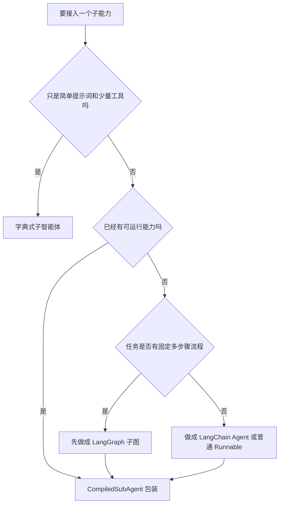

# 4 - 深度研搜：接入 LangGraph 与 LangChain

<!-- TS-TRACK-BANNER -->
> **TS 生态对照（本仓库）**：深度研搜原项目偏 Python DeepAgents；TypeScript 对照请看 `examples/12-langgraph-multi-agent`、`examples/11-langgraph-tool-agent`、`examples/14-mcp`。

> **TypeScript 轨道说明**：中文讲解保留原教程；**代码块使用仓库内真实 TypeScript**（`examples/` / 精校案例 / `apps/shop-query-agent`），不再使用机翻 Python。
> 精校清单：[POLISHED-CASES](POLISHED-CASES.md)


## TypeScript 可运行示例（推荐）

本章优先对照仓库真实文件：`examples/12-langgraph-multi-agent/index.ts`

```typescript
// examples/12-langgraph-multi-agent/index.ts
/**
 * Maps to: 案例与源码-3-LangGraph框架/08-multi_agent
 * Python refs: SupervisorV0.3/V1.0.py, SupervisorHandoff.py
 *
 * Teaching version of supervisor + specialist workers (with step guard).
 */
import {
  AIMessage,
  HumanMessage,
  SystemMessage,
  type BaseMessage,
} from "@langchain/core/messages";
import {
  Annotation,
  END,
  START,
  StateGraph,
  messagesStateReducer,
} from "@langchain/langgraph";
import { z } from "zod";
import { createChatModel } from "../../src/shared/llm.js";
import { getWeatherTool, searchPolicyTool } from "../../src/shared/tools.js";
import { printRunHeader } from "../../src/shared/env.js";

const RouteSchema = z.object({
  next: z.enum(["weather", "policy", "FINISH"]),
  reason: z.string(),
});

const MultiAgentState = Annotation.Root({
  messages: Annotation<BaseMessage[]>({
    reducer: messagesStateReducer,
    default: () => [],
  }),
  next: Annotation<string>({
    reducer: (_prev, next) => next,
    default: () => "supervisor",
  }),
  steps: Annotation<number>({
    reducer: (_prev, next) => next,
    default: () => 0,
  }),
  visited: Annotation<string[]>({
    reducer: (prev, next) => Array.from(new Set([...prev, ...next])),
    default: () => [],
  }),
});

async function supervisorNode(state: typeof MultiAgentState.State) {
  // Safety: prevent infinite supervisor loops in demos.
  if (state.steps >= 4 || state.visited.length >= 2) {
    return {
      next: "FINISH",
      steps: state.steps + 1,
      messages: [new AIMessage("主管：信息已足够，结束本轮调度。")],
    };
  }

  const model = createChatModel(0).withStructuredOutput(RouteSchema);
  const decision = await model.invoke([
    new SystemMessage(
      [
        "你是主管 Agent，只负责路由。",
        "weather: 天气相关",
        "policy: 公司制度/报销/请假",
        "FINISH: 已有足够答案",
        `已访问专家: ${state.visited.join(", ") || "无"}`,
        "不要重复已访问专家。",
      ].join("\n"),
    ),
    ...state.messages,
  ]);

  // Avoid re-entering the same worker.
  let next = decision.next;
  if (next !== "FINISH" && state.visited.includes(next)) {
    next = "FINISH";
  }

  console.log("[supervisor]", { ...decision, next });
  return {
    next,
    steps: state.steps + 1,
    messages: [new AIMessage(`主管路由到：${next}（${decision.reason}）`)],
  };
}

async function weatherNode(state: typeof MultiAgentState.State) {
  const lastHuman = [...state.messages]
    .reverse()
    .find((m) => m.getType() === "human");
  const text = String(lastHuman?.content ?? "");
  const cityMatch = text.match(/北京|上海|深圳|杭州|广州/)?.[0] ?? "北京";
  const weather = await getWeatherTool.invoke({ city: cityMatch });
  return {
    next: "supervisor",
    visited: ["weather"],
    messages: [new AIMessage(`天气专员：${cityMatch} => ${weather}`)],
  };
}

async function policyNode(state: typeof MultiAgentState.State) {
  const lastHuman = [...state.messages]
    .reverse()
    .find((m) => m.getType() === "human");
  const text = String(lastHuman?.content ?? "报销");
  const keyword = /请假|加班|报销|设备/.exec(text)?.[0] ?? "报销";
  const policy = await searchPolicyTool.invoke({ keyword });

  const model = createChatModel(0);
  const polished = await model.invoke([
    new SystemMessage("你是制度专员，把检索结果整理成员工可执行答复。"),
    new HumanMessage(`用户问题：${text}\n检索结果：${policy}`),
  ]);

  return {
    next: "supervisor",
    visited: ["policy"],
    messages: [new AIMessage(`制度专员：${polished.content}`)],
  };
}

function routeFromSupervisor(state: typeof MultiAgentState.State) {
  if (state.next === "weather") return "weather";
  if (state.next === "policy") return "policy";
  return END;
}

function buildGraph() {
  return new StateGraph(MultiAgentState)
    .addNode("supervisor", supervisorNode)
    .addNode("weather", weatherNode)
    .addNode("policy", policyNode)
    .addEdge(START, "supervisor")
    .addConditionalEdges("supervisor", routeFromSupervisor, {
      weather: "weather",
      policy: "policy",
      [END]: END,
    })
    .addEdge("weather", "supervisor")
    .addEdge("policy", "supervisor")
    .compile();
}

async function main() {
  printRunHeader("12-langgraph-multi-agent | supervisor pattern");

  const app = buildGraph();
  const result = await app.invoke({
    messages: [
      new HumanMessage("我想了解差旅报销规则，另外顺便说下北京今天天气。"),
    ],
    next: "supervisor",
    steps: 0,
    visited: [],
  });

  console.log("\n===== transcript =====");
  for (const msg of result.messages) {
    console.log(`\n[${msg.getType()}] ${msg.content}`);
  }
}

main().catch((err) => {
  console.error(err);
  process.exit(1);
});
```

```bash
npx tsx examples/12-langgraph-multi-agent/index.ts
```


---

**本章课程目标：**

- 理解为什么 DeepAgents 需要复用已有 LangGraph / LangChain 能力。
- 掌握 `CompiledSubAgent` 的作用和基本配置方式。
- 理解 LangGraph 子智能体为什么必须包含可累加的 `messages` 状态字段。
- 能判断复杂子任务应该交给 LangGraph，还是交给 LangChain Agent。

**学习建议：** 这一章学的是“复用现成能力”，不是重新学 LangGraph 或 LangChain。读的时候重点看 `CompiledSubAgent` 如何把已有图、Agent 或 Runnable 包成 DeepAgents 能调度的子智能体。如果 `StateGraph`、`add_messages`、条件边、`@tool`、`createReactAgent()` 还不熟，先回看对应章节，否则这里会像在看一层薄薄的适配胶水。

**对应代码分支：** `04-deepagents-langgraph-langchain`

---

上一章我们学习了字典式子智能体。它适合定义简单、轻量、职责明确的助手，比如天气助手、数学助手、翻译助手。

但真实项目里，经常已经有一些现成能力：

- 前面用 LangGraph 写好的工作流；
- 前面用 LangChain `createReactAgent()` 创建的工具型 Agent；
- 已经封装好的 Runnable；
- 需要多节点状态流转、条件分支或工具选择的复杂子任务。

这些能力如果全部重写成字典式子智能体，成本很高，也没有必要。DeepAgents 提供了 `CompiledSubAgent`，它的作用就是把已有图、Agent 或 Runnable 封装成 DeepAgents 可以调度的子智能体。

本章对应两个示例文件：

| 文件                                    | 主题           | 本章示例的业务含义                                 |
| --------------------------------------- | -------------- | -------------------------------------------------- |
| `6-langgraph-subagent-wrapper.ts`       | 兼容 LangGraph | 把“研究任务规划” LangGraph 工作流封装成子智能体    |
| `7-langchain-agent-subagent-wrapper.ts` | 兼容 LangChain | 把“资料检索” LangChain 工具型 Agent 封装成子智能体 |

---

## 1、先看整体关系：DeepAgents 负责调度

学习这一章时，先不要把 LangGraph、LangChain 和 DeepAgents 混在一起看。它们在本章里的分工很清楚：

```text
用户问题
  -> DeepAgents 主智能体
      -> 字典子智能体：适合简单助手
      -> CompiledSubAgent：适合复用已有复杂能力
            -> LangGraph 子图：适合多节点流程和状态流转
            -> LangChain Agent：适合工具选择和资料检索
```

**图 4-1 说明：** DeepAgents 主智能体像一个调度层，它不需要关心 LangGraph 子图里有几个节点，也不需要知道 LangChain Agent 具体调用了哪个工具。它只要知道：某个子智能体能完成什么任务，以及应该在什么时候把任务交出去。

所以本章的主线其实只有一句话：

> 已经写好的 LangGraph 图或 LangChain Agent，不用推倒重写，可以通过 `CompiledSubAgent` 接到 DeepAgents 主智能体下面。

理解了这一点，再看后面的两个例子就会轻松很多。

---

## 2、CompiledSubAgent 是什么

### 2.1 字典子智能体和 CompiledSubAgent 的区别

DeepAgents 中常见的子智能体配置方式有两种。

| 方式               | 适合场景     | 特点                                          |
| ------------------ | ------------ | --------------------------------------------- |
| 字典配置           | 简单子智能体 | 写法简单，适合只配置提示词和工具              |
| `CompiledSubAgent` | 复杂子智能体 | 可以接入已有 LangGraph / LangChain / Runnable |

字典方式更像“直接声明一个助手”：

```typescript
// Real TypeScript from repo: examples/12-langgraph-multi-agent/index.ts
/**
 * Maps to: 案例与源码-3-LangGraph框架/08-multi_agent
 * Python refs: SupervisorV0.3/V1.0.py, SupervisorHandoff.py
 *
 * Teaching version of supervisor + specialist workers (with step guard).
 */
import {
  AIMessage,
  HumanMessage,
  SystemMessage,
  type BaseMessage,
} from "@langchain/core/messages";
import {
  Annotation,
  END,
  START,
  StateGraph,
  messagesStateReducer,
} from "@langchain/langgraph";
import { z } from "zod";
import { createChatModel } from "../../src/shared/llm.js";
import { getWeatherTool, searchPolicyTool } from "../../src/shared/tools.js";
import { printRunHeader } from "../../src/shared/env.js";

const RouteSchema = z.object({
  next: z.enum(["weather", "policy", "FINISH"]),
  reason: z.string(),
});

const MultiAgentState = Annotation.Root({
  messages: Annotation<BaseMessage[]>({
    reducer: messagesStateReducer,
    default: () => [],
  }),
  next: Annotation<string>({
    reducer: (_prev, next) => next,
    default: () => "supervisor",
  }),
  steps: Annotation<number>({
    reducer: (_prev, next) => next,
    default: () => 0,
  }),
  visited: Annotation<string[]>({
    reducer: (prev, next) => Array.from(new Set([...prev, ...next])),
    default: () => [],
  }),
});

async function supervisorNode(state: typeof MultiAgentState.State) {
  // Safety: prevent infinite supervisor loops in demos.
  if (state.steps >= 4 || state.visited.length >= 2) {
    return {
      next: "FINISH",
      steps: state.steps + 1,
      messages: [new AIMessage("主管：信息已足够，结束本轮调度。")],
    };
  }

  const model = createChatModel(0).withStructuredOutput(RouteSchema);
  const decision = await model.invoke([
    new SystemMessage(
      [
        "你是主管 Agent，只负责路由。",
        "weather: 天气相关",
        "policy: 公司制度/报销/请假",
        "FINISH: 已有足够答案",
        `已访问专家: ${state.visited.join(", ") || "无"}`,
        "不要重复已访问专家。",
      ].join("\n"),
    ),
    ...state.messages,
  ]);

  // Avoid re-entering the same worker.
  let next = decision.next;
  if (next !== "FINISH" && state.visited.includes(next)) {
    next = "FINISH";
  }

  console.log("[supervisor]", { ...decision, next });
  return {
    next,
    steps: state.steps + 1,
    messages: [new AIMessage(`主管路由到：${next}（${decision.reason}）`)],
  };
}

async function weatherNode(state: typeof MultiAgentState.State) {
  const lastHuman = [...state.messages]
    .reverse()
    .find((m) => m.getType() === "human");
  const text = String(lastHuman?.content ?? "");
  const cityMatch = text.match(/北京|上海|深圳|杭州|广州/)?.[0] ?? "北京";
  const weather = await getWeatherTool.invoke({ city: cityMatch });
  return {
    next: "supervisor",
    visited: ["weather"],
    messages: [new AIMessage(`天气专员：${cityMatch} => ${weather}`)],
  };
}

async function policyNode(state: typeof MultiAgentState.State) {
  const lastHuman = [...state.messages]
    .reverse()
    .find((m) => m.getType() === "human");
  const text = String(lastHuman?.content ?? "报销");
  const keyword = /请假|加班|报销|设备/.exec(text)?.[0] ?? "报销";
  const policy = await searchPolicyTool.invoke({ keyword });

  const model = createChatModel(0);
  const polished = await model.invoke([
    new SystemMessage("你是制度专员，把检索结果整理成员工可执行答复。"),
    new HumanMessage(`用户问题：${text}\n检索结果：${policy}`),
  ]);

  return {
    next: "supervisor",
    visited: ["policy"],
    messages: [new AIMessage(`制度专员：${polished.content}`)],
  };
}

function routeFromSupervisor(state: typeof MultiAgentState.State) {
  if (state.next === "weather") return "weather";
  if (state.next === "policy") return "policy";
  return END;
}

function buildGraph() {
  return new StateGraph(MultiAgentState)
    .addNode("supervisor", supervisorNode)
    .addNode("weather", weatherNode)
    .addNode("policy", policyNode)
    .addEdge(START, "supervisor")
    .addConditionalEdges("supervisor", routeFromSupervisor, {
      weather: "weather",
      policy: "policy",
      [END]: END,
    })
    .addEdge("weather", "supervisor")
    .addEdge("policy", "supervisor")
    .compile();
}

async function main() {
  printRunHeader("12-langgraph-multi-agent | supervisor pattern");

  const app = buildGraph();
  const result = await app.invoke({
    messages: [
      new HumanMessage("我想了解差旅报销规则，另外顺便说下北京今天天气。"),
    ],
    next: "supervisor",
    steps: 0,
    visited: [],
  });

  console.log("\n===== transcript =====");
  for (const msg of result.messages) {
    console.log(`\n[${msg.getType()}] ${msg.content}`);
  }
}

main().catch((err) => {
  console.error(err);
  process.exit(1);
});
```

`CompiledSubAgent` 更像“把已经写好的能力包一层，交给 DeepAgents 调度”：

```typescript
// Real TypeScript from repo: examples/11-langgraph-tool-agent/index.ts
/**
 * Maps to LangGraph tool-calling agent pattern
 * (course chapters 21-24: agent loop as a graph)
 */
import {
  AIMessage,
  HumanMessage,
  SystemMessage,
  ToolMessage,
  type BaseMessage,
} from "@langchain/core/messages";
import { tool } from "@langchain/core/tools";
import { Annotation, END, START, StateGraph, messagesStateReducer } from "@langchain/langgraph";
import { z } from "zod";
import { createChatModel } from "../../src/shared/llm.js";
import { addNumberTool, getWeatherTool } from "../../src/shared/tools.js";
import { printRunHeader } from "../../src/shared/env.js";

const tools = [addNumberTool, getWeatherTool];
const toolsByName = Object.fromEntries(tools.map((t) => [t.name, t]));
void toolsByName;

const AgentState = Annotation.Root({
  messages: Annotation<BaseMessage[]>({
    reducer: messagesStateReducer,
    default: () => [],
  }),
});

async function agentNode(state: typeof AgentState.State) {
  const model = createChatModel(0).bindTools(tools);
  const response = await model.invoke([
    new SystemMessage(
      "你是工具增强助手。需要计算或查天气时必须调用工具，不要编造。",
    ),
    ...state.messages,
  ]);
  return { messages: [response] };
}

async function toolNode(state: typeof AgentState.State) {
  const last = state.messages[state.messages.length - 1];
  if (!(last instanceof AIMessage) || !last.tool_calls?.length) {
    return { messages: [] };
  }

  const outputs: ToolMessage[] = [];
  for (const call of last.tool_calls) {
    let observation: string;
    if (call.name === "add_number") {
      observation = String(
        await addNumberTool.invoke(call.args as { a: number; b: number }),
      );
    } else if (call.name === "get_weather") {
      observation = String(
        await getWeatherTool.invoke(call.args as { city: string }),
      );
    } else {
      observation = `Unknown tool: ${call.name}`;
    }
    outputs.push(
      new ToolMessage({
        content: observation,
        tool_call_id: call.id ?? call.name,
      }),
    );
  }
  return { messages: outputs };
}

function shouldContinue(state: typeof AgentState.State) {
  const last = state.messages[state.messages.length - 1];
  if (last instanceof AIMessage && last.tool_calls?.length) {
    return "tools";
  }
  return END;
}

function buildGraph() {
  return new StateGraph(AgentState)
    .addNode("agent", agentNode)
    .addNode("tools", toolNode)
    .addEdge(START, "agent")
    .addConditionalEdges("agent", shouldContinue, {
      tools: "tools",
      [END]: END,
    })
    .addEdge("tools", "agent")
    .compile();
}

async function main() {
  printRunHeader("11-langgraph-tool-agent | manual ReAct graph");

  // tiny local tool to show schema flexibility
  const echo = tool(async ({ text }) => `echo:${text}`, {
    name: "echo",
    description: "Echo text",
    schema: z.object({ text: z.string() }),
  });
  void echo;

  const app = buildGraph();
  const result = await app.invoke({
    messages: [
      new HumanMessage("请计算 8+15，并告诉我北京天气，最后中文总结。"),
    ],
  });

  for (const msg of result.messages) {
    console.log(`\n[${msg.getType()}]`, msg.content);
    if (msg instanceof AIMessage && msg.tool_calls?.length) {
      console.log(" tool_calls:", JSON.stringify(msg.tool_calls, null, 2));
    }
  }
}

main().catch((err) => {
  console.error(err);
  process.exit(1);
});
```

### 2.2 三个核心参数

`CompiledSubAgent` 最核心的是三个参数：

| 参数          | 说明                                                              |
| ------------- | ----------------------------------------------------------------- |
| `name`        | 子智能体名称，主智能体通过它识别子智能体                          |
| `description` | 子智能体能力说明，主智能体靠它判断什么时候调用                    |
| `runnable`    | 真正执行任务的对象，可以是编译后的 LangGraph 图或 LangChain Agent |

也就是说，`CompiledSubAgent` 自己不负责写业务逻辑。业务逻辑在 `runnable` 里，它只负责把这个能力包装成 DeepAgents 能识别的子智能体。

---

## 3、接入 LangGraph：研究任务规划子图

### 3.1 这个例子解决什么问题

项目对应文件路径：`deepsearch-agents/examples/6-langgraph-subagent-wrapper.ts`

这一节的 LangGraph 示例，是一个贴近「深度研搜」场景的子能力：**研究任务规划器**。

它不是简单返回一句“我处理完了”，而是模拟下面这条链路：

```text
用户提出研究问题
  -> DeepAgents 主智能体判断需要研究规划
  -> task 调用 research_planner_graph
  -> LangGraph 子图提取研究主题
  -> 条件边判断 quick / deep
  -> 生成普通计划或深度研究计划
  -> 汇总成最终规划结果
```

这一节会用到你前面已经学过的 LangGraph 知识点：

| 本章用法                  | 对应仓库案例                                                               |
| ------------------------- | -------------------------------------------------------------------------- |
| `messages + add_messages` | `案例与源码-3-LangGraph框架/03-state/reducers/StateReducer_AddMessages.ts` |
| 条件边                    | `案例与源码-3-LangGraph框架/05-edge/Edge_Conditional.ts`                   |
| 多节点业务流              | `案例与源码-3-LangGraph框架/01-helloworld/LangGraphBiz.ts`                 |

### 3.2 State 为什么必须包含 messages

LangGraph 子图要接入 DeepAgents，最关键的要求是：**State 里必须包含 `messages` 字段。**

```typescript
// Real TypeScript from repo: examples/09-agent/index.ts
/**
 * Maps to: 案例与源码-2-LangChain框架/12-agent
 * Python refs: AgentSmartSelectV1.0.py, AgentReact.py
 *
 * Modern LangChain JS path: createReactAgent (tool-calling ReAct loop).
 */
import { HumanMessage } from "@langchain/core/messages";
import { tool } from "@langchain/core/tools";
import { createReactAgent } from "@langchain/langgraph/prebuilt";
import { z } from "zod";
import { createChatModel } from "../../src/shared/llm.js";
import { basicTools } from "../../src/shared/tools.js";
import { printRunHeader } from "../../src/shared/env.js";

const PRODUCT_DATABASE: Record<
  string,
  Array<{ id: string; name: string; popularity: number; price: number }>
> = {
  无线耳机: [
    { id: "WH-1000XM5", name: "索尼 WH-1000XM5", popularity: 95, price: 299 },
    { id: "QC45", name: "Bose QuietComfort 45", popularity: 88, price: 329 },
  ],
  游戏鼠标: [
    { id: "GPW", name: "罗技 G Pro 无线", popularity: 90, price: 129 },
    { id: "VIPER", name: "雷蛇 Viper V2 Pro", popularity: 87, price: 149 },
  ],
};

const INVENTORY: Record<string, { stock: number; location: string }> = {
  "WH-1000XM5": { stock: 10, location: "仓库-A" },
  QC45: { stock: 0, location: "仓库-B" },
  GPW: { stock: 8, location: "仓库-C" },
  VIPER: { stock: 12, location: "仓库-A" },
};

const searchProductsTool = tool(
  async ({ query }) => {
    const category = Object.keys(PRODUCT_DATABASE).find((c) => query.includes(c));
    if (!category) return `未找到与「${query}」匹配的产品类别`;
    const items = [...PRODUCT_DATABASE[category]].sort(
      (a, b) => b.popularity - a.popularity,
    );
    return items
      .map(
        (p, i) =>
          `${i + 1}. ${p.name} (ID:${p.id}) 热度${p.popularity} ￥${p.price}`,
      )
      .join("\n");
  },
  {
    name: "search_products",
    description: "按类别搜索产品，如无线耳机、游戏鼠标",
    schema: z.object({ query: z.string() }),
  },
);

const checkInventoryTool = tool(
  async ({ productId }) => {
    const info = INVENTORY[productId];
    if (!info) return `未找到产品ID: ${productId}`;
    const status = info.stock > 0 ? "有库存" : "缺货";
    return `${productId}: ${status} (${info.stock}) @ ${info.location}`;
  },
  {
    name: "check_inventory",
    description: "根据产品 ID 查询库存",
    schema: z.object({ productId: z.string() }),
  },
);

async function runMathWeatherAgent() {
  printRunHeader("09-agent | tool agent (math + weather)");
  const agent = createReactAgent({
    llm: createChatModel(0),
    tools: basicTools,
  });

  const result = await agent.invoke({
    messages: [
      new HumanMessage("请计算 45+17，并查询深圳天气，最后用中文给一个简短总结。"),
    ],
  });

  const last = result.messages[result.messages.length - 1];
  console.log("[final]", last.content);
}

async function runReactShopAgent() {
  printRunHeader("09-agent | ReAct shop agent (search + inventory)");
  const agent = createReactAgent({
    llm: createChatModel(0),
    tools: [searchProductsTool, checkInventoryTool],
  });

  const result = await agent.invoke({
    messages: [
      new HumanMessage(
        "帮我找最受欢迎的无线耳机，并检查第一名的库存，用中文给出购买建议。",
      ),
    ],
  });

  for (const msg of result.messages) {
    const role = msg.getType?.() ?? msg.constructor.name;
    console.log(`\n[${role}]`, msg.content);
  }
}

async function main() {
  await runMathWeatherAgent();
  await runReactShopAgent();
}

main().catch((err) => {
  console.error(err);
  process.exit(1);
});
```

这里有两个重点。

**第一，**DeepAgents 会通过 `messages` 把任务传给子图，也会从 `messages` 里读取子图返回结果。

**第二，**`messages` 要配合 `add_messages` 使用。这样节点返回的新消息会追加到原消息列表，而不是覆盖历史消息。

如果写成普通的：

```typescript
// Real TypeScript from repo: examples/14-mcp/client-agent.ts
/**
 * Maps to: 案例与源码-2-LangChain框架/11-mcp/McpClientAgent.py
 *
 * Flow:
 * 1) spawn local MCP server over stdio
 * 2) list MCP tools
 * 3) wrap tools as LangChain tools
 * 4) run createReactAgent once with a user question
 */
import { dirname, join } from "node:path";
import { fileURLToPath } from "node:url";
import { Client } from "@modelcontextprotocol/sdk/client/index.js";
import { StdioClientTransport } from "@modelcontextprotocol/sdk/client/stdio.js";
import { DynamicStructuredTool } from "@langchain/core/tools";
import { HumanMessage } from "@langchain/core/messages";
import { createReactAgent } from "@langchain/langgraph/prebuilt";
import { z } from "zod";
import { createChatModel } from "../../src/shared/llm.js";
import { printRunHeader } from "../../src/shared/env.js";

const __dirname = dirname(fileURLToPath(import.meta.url));
const serverPath = join(__dirname, "server.ts");

function jsonSchemaToZod(inputSchema: unknown): z.ZodObject<z.ZodRawShape> {
  const schema = (inputSchema ?? {}) as {
    type?: string;
    properties?: Record<string, { type?: string; description?: string }>;
    required?: string[];
  };
  const shape: z.ZodRawShape = {};
  const required = new Set(schema.required ?? []);
  for (const [key, prop] of Object.entries(schema.properties ?? {})) {
    let field: z.ZodTypeAny =
      prop.type === "number" || prop.type === "integer"
        ? z.number()
        : prop.type === "boolean"
          ? z.boolean()
          : z.string();
    if (prop.description) field = field.describe(prop.description);
    if (!required.has(key)) field = field.optional();
    shape[key] = field;
  }
  return z.object(shape);
}

function textFromMcpResult(result: {
  content?: Array<{ type: string; text?: string }>;
}): string {
  if (!result.content?.length) return JSON.stringify(result);
  return result.content
    .map((c) => (c.type === "text" ? (c.text ?? "") : JSON.stringify(c)))
    .join("\n");
}

async function main() {
  printRunHeader("14-mcp | MCP server tools -> LangChain Agent");

  const transport = new StdioClientTransport({
    command: process.platform === "win32" ? "npx.cmd" : "npx",
    args: ["tsx", serverPath],
    stderr: "pipe",
  });

  const client = new Client({ name: "mcp-demo-client", version: "0.1.0" });
  await client.connect(transport);

  try {
    const listed = await client.listTools();
    console.log(
      "MCP tools:",
      listed.tools.map((t) => t.name).join(", ") || "(none)",
    );

    const resources = await client.listResources();
    console.log(
      "MCP resources:",
      resources.resources.map((r) => r.uri).join(", ") || "(none)",
    );

    const lcTools = listed.tools.map((mcpTool) => {
      const schema = jsonSchemaToZod(mcpTool.inputSchema);
      return new DynamicStructuredTool({
        name: mcpTool.name,
        description: mcpTool.description || mcpTool.name,
        schema,
        func: async (input) => {
          const result = await client.callTool({
            name: mcpTool.name,
            arguments: input as Record<string, unknown>,
          });
          return textFromMcpResult(
            result as { content?: Array<{ type: string; text?: string }> },
          );
        },
      });
    });

    if (!lcTools.length) {
      throw new Error("No MCP tools available");
    }

    const agent = createReactAgent({
      llm: createChatModel(0),
      tools: lcTools,
    });

    const question =
      process.argv.slice(2).join(" ") ||
      "请计算 19+26，并查询上海天气，用中文简短总结。";
    console.log("\n[question]", question);

    const result = await agent.invoke({
      messages: [new HumanMessage(question)],
    });

    const last = result.messages[result.messages.length - 1];
    console.log("\n[final]", last.content);
  } finally {
    await client.close();
    await transport.close();
  }
}

main().catch((err) => {
  console.error(err);
  process.exit(1);
});
```

后面的节点很容易只看到最后一次状态，前面的用户问题、模型调度和子图中间结果都会丢失。

所以接入 DeepAgents 的 LangGraph 子图，一般要保留这种写法：

```typescript
// Real TypeScript from repo: examples/12-langgraph-multi-agent/index.ts
/**
 * Maps to: 案例与源码-3-LangGraph框架/08-multi_agent
 * Python refs: SupervisorV0.3/V1.0.py, SupervisorHandoff.py
 *
 * Teaching version of supervisor + specialist workers (with step guard).
 */
import {
  AIMessage,
  HumanMessage,
  SystemMessage,
  type BaseMessage,
} from "@langchain/core/messages";
import {
  Annotation,
  END,
  START,
  StateGraph,
  messagesStateReducer,
} from "@langchain/langgraph";
import { z } from "zod";
import { createChatModel } from "../../src/shared/llm.js";
import { getWeatherTool, searchPolicyTool } from "../../src/shared/tools.js";
import { printRunHeader } from "../../src/shared/env.js";

const RouteSchema = z.object({
  next: z.enum(["weather", "policy", "FINISH"]),
  reason: z.string(),
});

const MultiAgentState = Annotation.Root({
  messages: Annotation<BaseMessage[]>({
    reducer: messagesStateReducer,
    default: () => [],
  }),
  next: Annotation<string>({
    reducer: (_prev, next) => next,
    default: () => "supervisor",
  }),
  steps: Annotation<number>({
    reducer: (_prev, next) => next,
    default: () => 0,
  }),
  visited: Annotation<string[]>({
    reducer: (prev, next) => Array.from(new Set([...prev, ...next])),
    default: () => [],
  }),
});

async function supervisorNode(state: typeof MultiAgentState.State) {
  // Safety: prevent infinite supervisor loops in demos.
  if (state.steps >= 4 || state.visited.length >= 2) {
    return {
      next: "FINISH",
      steps: state.steps + 1,
      messages: [new AIMessage("主管：信息已足够，结束本轮调度。")],
    };
  }

  const model = createChatModel(0).withStructuredOutput(RouteSchema);
  const decision = await model.invoke([
    new SystemMessage(
      [
        "你是主管 Agent，只负责路由。",
        "weather: 天气相关",
        "policy: 公司制度/报销/请假",
        "FINISH: 已有足够答案",
        `已访问专家: ${state.visited.join(", ") || "无"}`,
        "不要重复已访问专家。",
      ].join("\n"),
    ),
    ...state.messages,
  ]);

  // Avoid re-entering the same worker.
  let next = decision.next;
  if (next !== "FINISH" && state.visited.includes(next)) {
    next = "FINISH";
  }

  console.log("[supervisor]", { ...decision, next });
  return {
    next,
    steps: state.steps + 1,
    messages: [new AIMessage(`主管路由到：${next}（${decision.reason}）`)],
  };
}

async function weatherNode(state: typeof MultiAgentState.State) {
  const lastHuman = [...state.messages]
    .reverse()
    .find((m) => m.getType() === "human");
  const text = String(lastHuman?.content ?? "");
  const cityMatch = text.match(/北京|上海|深圳|杭州|广州/)?.[0] ?? "北京";
  const weather = await getWeatherTool.invoke({ city: cityMatch });
  return {
    next: "supervisor",
    visited: ["weather"],
    messages: [new AIMessage(`天气专员：${cityMatch} => ${weather}`)],
  };
}

async function policyNode(state: typeof MultiAgentState.State) {
  const lastHuman = [...state.messages]
    .reverse()
    .find((m) => m.getType() === "human");
  const text = String(lastHuman?.content ?? "报销");
  const keyword = /请假|加班|报销|设备/.exec(text)?.[0] ?? "报销";
  const policy = await searchPolicyTool.invoke({ keyword });

  const model = createChatModel(0);
  const polished = await model.invoke([
    new SystemMessage("你是制度专员，把检索结果整理成员工可执行答复。"),
    new HumanMessage(`用户问题：${text}\n检索结果：${policy}`),
  ]);

  return {
    next: "supervisor",
    visited: ["policy"],
    messages: [new AIMessage(`制度专员：${polished.content}`)],
  };
}

function routeFromSupervisor(state: typeof MultiAgentState.State) {
  if (state.next === "weather") return "weather";
  if (state.next === "policy") return "policy";
  return END;
}

function buildGraph() {
  return new StateGraph(MultiAgentState)
    .addNode("supervisor", supervisorNode)
    .addNode("weather", weatherNode)
    .addNode("policy", policyNode)
    .addEdge(START, "supervisor")
    .addConditionalEdges("supervisor", routeFromSupervisor, {
      weather: "weather",
      policy: "policy",
      [END]: END,
    })
    .addEdge("weather", "supervisor")
    .addEdge("policy", "supervisor")
    .compile();
}

async function main() {
  printRunHeader("12-langgraph-multi-agent | supervisor pattern");

  const app = buildGraph();
  const result = await app.invoke({
    messages: [
      new HumanMessage("我想了解差旅报销规则，另外顺便说下北京今天天气。"),
    ],
    next: "supervisor",
    steps: 0,
    visited: [],
  });

  console.log("\n===== transcript =====");
  for (const msg of result.messages) {
    console.log(`\n[${msg.getType()}] ${msg.content}`);
  }
}

main().catch((err) => {
  console.error(err);
  process.exit(1);
});
```

### 3.3 定义研究规划节点

第一个节点负责从任务中提取研究主题，并判断研究深度。

```typescript
// Real TypeScript from repo: examples/11-langgraph-tool-agent/index.ts
/**
 * Maps to LangGraph tool-calling agent pattern
 * (course chapters 21-24: agent loop as a graph)
 */
import {
  AIMessage,
  HumanMessage,
  SystemMessage,
  ToolMessage,
  type BaseMessage,
} from "@langchain/core/messages";
import { tool } from "@langchain/core/tools";
import { Annotation, END, START, StateGraph, messagesStateReducer } from "@langchain/langgraph";
import { z } from "zod";
import { createChatModel } from "../../src/shared/llm.js";
import { addNumberTool, getWeatherTool } from "../../src/shared/tools.js";
import { printRunHeader } from "../../src/shared/env.js";

const tools = [addNumberTool, getWeatherTool];
const toolsByName = Object.fromEntries(tools.map((t) => [t.name, t]));
void toolsByName;

const AgentState = Annotation.Root({
  messages: Annotation<BaseMessage[]>({
    reducer: messagesStateReducer,
    default: () => [],
  }),
});

async function agentNode(state: typeof AgentState.State) {
  const model = createChatModel(0).bindTools(tools);
  const response = await model.invoke([
    new SystemMessage(
      "你是工具增强助手。需要计算或查天气时必须调用工具，不要编造。",
    ),
    ...state.messages,
  ]);
  return { messages: [response] };
}

async function toolNode(state: typeof AgentState.State) {
  const last = state.messages[state.messages.length - 1];
  if (!(last instanceof AIMessage) || !last.tool_calls?.length) {
    return { messages: [] };
  }

  const outputs: ToolMessage[] = [];
  for (const call of last.tool_calls) {
    let observation: string;
    if (call.name === "add_number") {
      observation = String(
        await addNumberTool.invoke(call.args as { a: number; b: number }),
      );
    } else if (call.name === "get_weather") {
      observation = String(
        await getWeatherTool.invoke(call.args as { city: string }),
      );
    } else {
      observation = `Unknown tool: ${call.name}`;
    }
    outputs.push(
      new ToolMessage({
        content: observation,
        tool_call_id: call.id ?? call.name,
      }),
    );
  }
  return { messages: outputs };
}

function shouldContinue(state: typeof AgentState.State) {
  const last = state.messages[state.messages.length - 1];
  if (last instanceof AIMessage && last.tool_calls?.length) {
    return "tools";
  }
  return END;
}

function buildGraph() {
  return new StateGraph(AgentState)
    .addNode("agent", agentNode)
    .addNode("tools", toolNode)
    .addEdge(START, "agent")
    .addConditionalEdges("agent", shouldContinue, {
      tools: "tools",
      [END]: END,
    })
    .addEdge("tools", "agent")
    .compile();
}

async function main() {
  printRunHeader("11-langgraph-tool-agent | manual ReAct graph");

  // tiny local tool to show schema flexibility
  const echo = tool(async ({ text }) => `echo:${text}`, {
    name: "echo",
    description: "Echo text",
    schema: z.object({ text: z.string() }),
  });
  void echo;

  const app = buildGraph();
  const result = await app.invoke({
    messages: [
      new HumanMessage("请计算 8+15，并告诉我北京天气，最后中文总结。"),
    ],
  });

  for (const msg of result.messages) {
    console.log(`\n[${msg.getType()}]`, msg.content);
    if (msg instanceof AIMessage && msg.tool_calls?.length) {
      console.log(" tool_calls:", JSON.stringify(msg.tool_calls, null, 2));
    }
  }
}

main().catch((err) => {
  console.error(err);
  process.exit(1);
});
```

这里故意没有调用大模型，而是用简单规则模拟主题提取和深度判断。这样你可以先看清楚 LangGraph 的状态流转，不会被模型输出的不确定性带偏。

### 3.4 使用条件边选择规划路径

如果任务是普通查询，就走 `quick_plan`；如果任务是深度研究，就走 `deep_plan`。

```typescript
// Real TypeScript from repo: examples/09-agent/index.ts
/**
 * Maps to: 案例与源码-2-LangChain框架/12-agent
 * Python refs: AgentSmartSelectV1.0.py, AgentReact.py
 *
 * Modern LangChain JS path: createReactAgent (tool-calling ReAct loop).
 */
import { HumanMessage } from "@langchain/core/messages";
import { tool } from "@langchain/core/tools";
import { createReactAgent } from "@langchain/langgraph/prebuilt";
import { z } from "zod";
import { createChatModel } from "../../src/shared/llm.js";
import { basicTools } from "../../src/shared/tools.js";
import { printRunHeader } from "../../src/shared/env.js";

const PRODUCT_DATABASE: Record<
  string,
  Array<{ id: string; name: string; popularity: number; price: number }>
> = {
  无线耳机: [
    { id: "WH-1000XM5", name: "索尼 WH-1000XM5", popularity: 95, price: 299 },
    { id: "QC45", name: "Bose QuietComfort 45", popularity: 88, price: 329 },
  ],
  游戏鼠标: [
    { id: "GPW", name: "罗技 G Pro 无线", popularity: 90, price: 129 },
    { id: "VIPER", name: "雷蛇 Viper V2 Pro", popularity: 87, price: 149 },
  ],
};

const INVENTORY: Record<string, { stock: number; location: string }> = {
  "WH-1000XM5": { stock: 10, location: "仓库-A" },
  QC45: { stock: 0, location: "仓库-B" },
  GPW: { stock: 8, location: "仓库-C" },
  VIPER: { stock: 12, location: "仓库-A" },
};

const searchProductsTool = tool(
  async ({ query }) => {
    const category = Object.keys(PRODUCT_DATABASE).find((c) => query.includes(c));
    if (!category) return `未找到与「${query}」匹配的产品类别`;
    const items = [...PRODUCT_DATABASE[category]].sort(
      (a, b) => b.popularity - a.popularity,
    );
    return items
      .map(
        (p, i) =>
          `${i + 1}. ${p.name} (ID:${p.id}) 热度${p.popularity} ￥${p.price}`,
      )
      .join("\n");
  },
  {
    name: "search_products",
    description: "按类别搜索产品，如无线耳机、游戏鼠标",
    schema: z.object({ query: z.string() }),
  },
);

const checkInventoryTool = tool(
  async ({ productId }) => {
    const info = INVENTORY[productId];
    if (!info) return `未找到产品ID: ${productId}`;
    const status = info.stock > 0 ? "有库存" : "缺货";
    return `${productId}: ${status} (${info.stock}) @ ${info.location}`;
  },
  {
    name: "check_inventory",
    description: "根据产品 ID 查询库存",
    schema: z.object({ productId: z.string() }),
  },
);

async function runMathWeatherAgent() {
  printRunHeader("09-agent | tool agent (math + weather)");
  const agent = createReactAgent({
    llm: createChatModel(0),
    tools: basicTools,
  });

  const result = await agent.invoke({
    messages: [
      new HumanMessage("请计算 45+17，并查询深圳天气，最后用中文给一个简短总结。"),
    ],
  });

  const last = result.messages[result.messages.length - 1];
  console.log("[final]", last.content);
}

async function runReactShopAgent() {
  printRunHeader("09-agent | ReAct shop agent (search + inventory)");
  const agent = createReactAgent({
    llm: createChatModel(0),
    tools: [searchProductsTool, checkInventoryTool],
  });

  const result = await agent.invoke({
    messages: [
      new HumanMessage(
        "帮我找最受欢迎的无线耳机，并检查第一名的库存，用中文给出购买建议。",
      ),
    ],
  });

  for (const msg of result.messages) {
    const role = msg.getType?.() ?? msg.constructor.name;
    console.log(`\n[${role}]`, msg.content);
  }
}

async function main() {
  await runMathWeatherAgent();
  await runReactShopAgent();
}

main().catch((err) => {
  console.error(err);
  process.exit(1);
});
```

这部分对应前面 LangGraph 教程中的条件边：节点执行完成后，由路由函数读取当前 `state`，再决定下一步走向。

在「深度研搜」项目里，这类条件边很常见。例如：

- 资料是否足够，不够就继续搜索；
- 用户问题是否需要数据库查询；
- 检索结果是否需要交叉验证；
- 报告是否需要补充案例。

### 3.5 生成计划并汇总结果

深度研究计划节点会生成更完整的执行步骤：

```typescript
// Real TypeScript from repo: examples/14-mcp/client-agent.ts
/**
 * Maps to: 案例与源码-2-LangChain框架/11-mcp/McpClientAgent.py
 *
 * Flow:
 * 1) spawn local MCP server over stdio
 * 2) list MCP tools
 * 3) wrap tools as LangChain tools
 * 4) run createReactAgent once with a user question
 */
import { dirname, join } from "node:path";
import { fileURLToPath } from "node:url";
import { Client } from "@modelcontextprotocol/sdk/client/index.js";
import { StdioClientTransport } from "@modelcontextprotocol/sdk/client/stdio.js";
import { DynamicStructuredTool } from "@langchain/core/tools";
import { HumanMessage } from "@langchain/core/messages";
import { createReactAgent } from "@langchain/langgraph/prebuilt";
import { z } from "zod";
import { createChatModel } from "../../src/shared/llm.js";
import { printRunHeader } from "../../src/shared/env.js";

const __dirname = dirname(fileURLToPath(import.meta.url));
const serverPath = join(__dirname, "server.ts");

function jsonSchemaToZod(inputSchema: unknown): z.ZodObject<z.ZodRawShape> {
  const schema = (inputSchema ?? {}) as {
    type?: string;
    properties?: Record<string, { type?: string; description?: string }>;
    required?: string[];
  };
  const shape: z.ZodRawShape = {};
  const required = new Set(schema.required ?? []);
  for (const [key, prop] of Object.entries(schema.properties ?? {})) {
    let field: z.ZodTypeAny =
      prop.type === "number" || prop.type === "integer"
        ? z.number()
        : prop.type === "boolean"
          ? z.boolean()
          : z.string();
    if (prop.description) field = field.describe(prop.description);
    if (!required.has(key)) field = field.optional();
    shape[key] = field;
  }
  return z.object(shape);
}

function textFromMcpResult(result: {
  content?: Array<{ type: string; text?: string }>;
}): string {
  if (!result.content?.length) return JSON.stringify(result);
  return result.content
    .map((c) => (c.type === "text" ? (c.text ?? "") : JSON.stringify(c)))
    .join("\n");
}

async function main() {
  printRunHeader("14-mcp | MCP server tools -> LangChain Agent");

  const transport = new StdioClientTransport({
    command: process.platform === "win32" ? "npx.cmd" : "npx",
    args: ["tsx", serverPath],
    stderr: "pipe",
  });

  const client = new Client({ name: "mcp-demo-client", version: "0.1.0" });
  await client.connect(transport);

  try {
    const listed = await client.listTools();
    console.log(
      "MCP tools:",
      listed.tools.map((t) => t.name).join(", ") || "(none)",
    );

    const resources = await client.listResources();
    console.log(
      "MCP resources:",
      resources.resources.map((r) => r.uri).join(", ") || "(none)",
    );

    const lcTools = listed.tools.map((mcpTool) => {
      const schema = jsonSchemaToZod(mcpTool.inputSchema);
      return new DynamicStructuredTool({
        name: mcpTool.name,
        description: mcpTool.description || mcpTool.name,
        schema,
        func: async (input) => {
          const result = await client.callTool({
            name: mcpTool.name,
            arguments: input as Record<string, unknown>,
          });
          return textFromMcpResult(
            result as { content?: Array<{ type: string; text?: string }> },
          );
        },
      });
    });

    if (!lcTools.length) {
      throw new Error("No MCP tools available");
    }

    const agent = createReactAgent({
      llm: createChatModel(0),
      tools: lcTools,
    });

    const question =
      process.argv.slice(2).join(" ") ||
      "请计算 19+26，并查询上海天气，用中文简短总结。";
    console.log("\n[question]", question);

    const result = await agent.invoke({
      messages: [new HumanMessage(question)],
    });

    const last = result.messages[result.messages.length - 1];
    console.log("\n[final]", last.content);
  } finally {
    await client.close();
    await transport.close();
  }
}

main().catch((err) => {
  console.error(err);
  process.exit(1);
});
```

最后由 `finalize_plan()` 把状态里的 `topic`、`depth`、`plan` 汇总成一条 `AIMessage`，返回给 DeepAgents 主智能体。

### 3.6 封装成 CompiledSubAgent

LangGraph 图编译完成后，就可以作为 `runnable` 传给 `CompiledSubAgent`。

```typescript
// Real TypeScript from repo: examples/12-langgraph-multi-agent/index.ts
/**
 * Maps to: 案例与源码-3-LangGraph框架/08-multi_agent
 * Python refs: SupervisorV0.3/V1.0.py, SupervisorHandoff.py
 *
 * Teaching version of supervisor + specialist workers (with step guard).
 */
import {
  AIMessage,
  HumanMessage,
  SystemMessage,
  type BaseMessage,
} from "@langchain/core/messages";
import {
  Annotation,
  END,
  START,
  StateGraph,
  messagesStateReducer,
} from "@langchain/langgraph";
import { z } from "zod";
import { createChatModel } from "../../src/shared/llm.js";
import { getWeatherTool, searchPolicyTool } from "../../src/shared/tools.js";
import { printRunHeader } from "../../src/shared/env.js";

const RouteSchema = z.object({
  next: z.enum(["weather", "policy", "FINISH"]),
  reason: z.string(),
});

const MultiAgentState = Annotation.Root({
  messages: Annotation<BaseMessage[]>({
    reducer: messagesStateReducer,
    default: () => [],
  }),
  next: Annotation<string>({
    reducer: (_prev, next) => next,
    default: () => "supervisor",
  }),
  steps: Annotation<number>({
    reducer: (_prev, next) => next,
    default: () => 0,
  }),
  visited: Annotation<string[]>({
    reducer: (prev, next) => Array.from(new Set([...prev, ...next])),
    default: () => [],
  }),
});

async function supervisorNode(state: typeof MultiAgentState.State) {
  // Safety: prevent infinite supervisor loops in demos.
  if (state.steps >= 4 || state.visited.length >= 2) {
    return {
      next: "FINISH",
      steps: state.steps + 1,
      messages: [new AIMessage("主管：信息已足够，结束本轮调度。")],
    };
  }

  const model = createChatModel(0).withStructuredOutput(RouteSchema);
  const decision = await model.invoke([
    new SystemMessage(
      [
        "你是主管 Agent，只负责路由。",
        "weather: 天气相关",
        "policy: 公司制度/报销/请假",
        "FINISH: 已有足够答案",
        `已访问专家: ${state.visited.join(", ") || "无"}`,
        "不要重复已访问专家。",
      ].join("\n"),
    ),
    ...state.messages,
  ]);

  // Avoid re-entering the same worker.
  let next = decision.next;
  if (next !== "FINISH" && state.visited.includes(next)) {
    next = "FINISH";
  }

  console.log("[supervisor]", { ...decision, next });
  return {
    next,
    steps: state.steps + 1,
    messages: [new AIMessage(`主管路由到：${next}（${decision.reason}）`)],
  };
}

async function weatherNode(state: typeof MultiAgentState.State) {
  const lastHuman = [...state.messages]
    .reverse()
    .find((m) => m.getType() === "human");
  const text = String(lastHuman?.content ?? "");
  const cityMatch = text.match(/北京|上海|深圳|杭州|广州/)?.[0] ?? "北京";
  const weather = await getWeatherTool.invoke({ city: cityMatch });
  return {
    next: "supervisor",
    visited: ["weather"],
    messages: [new AIMessage(`天气专员：${cityMatch} => ${weather}`)],
  };
}

async function policyNode(state: typeof MultiAgentState.State) {
  const lastHuman = [...state.messages]
    .reverse()
    .find((m) => m.getType() === "human");
  const text = String(lastHuman?.content ?? "报销");
  const keyword = /请假|加班|报销|设备/.exec(text)?.[0] ?? "报销";
  const policy = await searchPolicyTool.invoke({ keyword });

  const model = createChatModel(0);
  const polished = await model.invoke([
    new SystemMessage("你是制度专员，把检索结果整理成员工可执行答复。"),
    new HumanMessage(`用户问题：${text}\n检索结果：${policy}`),
  ]);

  return {
    next: "supervisor",
    visited: ["policy"],
    messages: [new AIMessage(`制度专员：${polished.content}`)],
  };
}

function routeFromSupervisor(state: typeof MultiAgentState.State) {
  if (state.next === "weather") return "weather";
  if (state.next === "policy") return "policy";
  return END;
}

function buildGraph() {
  return new StateGraph(MultiAgentState)
    .addNode("supervisor", supervisorNode)
    .addNode("weather", weatherNode)
    .addNode("policy", policyNode)
    .addEdge(START, "supervisor")
    .addConditionalEdges("supervisor", routeFromSupervisor, {
      weather: "weather",
      policy: "policy",
      [END]: END,
    })
    .addEdge("weather", "supervisor")
    .addEdge("policy", "supervisor")
    .compile();
}

async function main() {
  printRunHeader("12-langgraph-multi-agent | supervisor pattern");

  const app = buildGraph();
  const result = await app.invoke({
    messages: [
      new HumanMessage("我想了解差旅报销规则，另外顺便说下北京今天天气。"),
    ],
    next: "supervisor",
    steps: 0,
    visited: [],
  });

  console.log("\n===== transcript =====");
  for (const msg of result.messages) {
    console.log(`\n[${msg.getType()}] ${msg.content}`);
  }
}

main().catch((err) => {
  console.error(err);
  process.exit(1);
});
```

最后注册到 DeepAgents 主智能体：

```typescript
// Real TypeScript from repo: examples/11-langgraph-tool-agent/index.ts
/**
 * Maps to LangGraph tool-calling agent pattern
 * (course chapters 21-24: agent loop as a graph)
 */
import {
  AIMessage,
  HumanMessage,
  SystemMessage,
  ToolMessage,
  type BaseMessage,
} from "@langchain/core/messages";
import { tool } from "@langchain/core/tools";
import { Annotation, END, START, StateGraph, messagesStateReducer } from "@langchain/langgraph";
import { z } from "zod";
import { createChatModel } from "../../src/shared/llm.js";
import { addNumberTool, getWeatherTool } from "../../src/shared/tools.js";
import { printRunHeader } from "../../src/shared/env.js";

const tools = [addNumberTool, getWeatherTool];
const toolsByName = Object.fromEntries(tools.map((t) => [t.name, t]));
void toolsByName;

const AgentState = Annotation.Root({
  messages: Annotation<BaseMessage[]>({
    reducer: messagesStateReducer,
    default: () => [],
  }),
});

async function agentNode(state: typeof AgentState.State) {
  const model = createChatModel(0).bindTools(tools);
  const response = await model.invoke([
    new SystemMessage(
      "你是工具增强助手。需要计算或查天气时必须调用工具，不要编造。",
    ),
    ...state.messages,
  ]);
  return { messages: [response] };
}

async function toolNode(state: typeof AgentState.State) {
  const last = state.messages[state.messages.length - 1];
  if (!(last instanceof AIMessage) || !last.tool_calls?.length) {
    return { messages: [] };
  }

  const outputs: ToolMessage[] = [];
  for (const call of last.tool_calls) {
    let observation: string;
    if (call.name === "add_number") {
      observation = String(
        await addNumberTool.invoke(call.args as { a: number; b: number }),
      );
    } else if (call.name === "get_weather") {
      observation = String(
        await getWeatherTool.invoke(call.args as { city: string }),
      );
    } else {
      observation = `Unknown tool: ${call.name}`;
    }
    outputs.push(
      new ToolMessage({
        content: observation,
        tool_call_id: call.id ?? call.name,
      }),
    );
  }
  return { messages: outputs };
}

function shouldContinue(state: typeof AgentState.State) {
  const last = state.messages[state.messages.length - 1];
  if (last instanceof AIMessage && last.tool_calls?.length) {
    return "tools";
  }
  return END;
}

function buildGraph() {
  return new StateGraph(AgentState)
    .addNode("agent", agentNode)
    .addNode("tools", toolNode)
    .addEdge(START, "agent")
    .addConditionalEdges("agent", shouldContinue, {
      tools: "tools",
      [END]: END,
    })
    .addEdge("tools", "agent")
    .compile();
}

async function main() {
  printRunHeader("11-langgraph-tool-agent | manual ReAct graph");

  // tiny local tool to show schema flexibility
  const echo = tool(async ({ text }) => `echo:${text}`, {
    name: "echo",
    description: "Echo text",
    schema: z.object({ text: z.string() }),
  });
  void echo;

  const app = buildGraph();
  const result = await app.invoke({
    messages: [
      new HumanMessage("请计算 8+15，并告诉我北京天气，最后中文总结。"),
    ],
  });

  for (const msg of result.messages) {
    console.log(`\n[${msg.getType()}]`, msg.content);
    if (msg instanceof AIMessage && msg.tool_calls?.length) {
      console.log(" tool_calls:", JSON.stringify(msg.tool_calls, null, 2));
    }
  }
}

main().catch((err) => {
  console.error(err);
  process.exit(1);
});
```

### 3.7 执行输出

执行文件验证，成功：

主智能体生成的 `tool_calls`、LangGraph 子图内部的打印、子图返回的 `ToolMessage`，以及主智能体最后整理出的 `AIMessage`。

```text
tools@ToolsMacBook-Pro deepsearch-agents % uv run examples/6-langgraph-subagent-wrapper.py

/Users/tools/Desktop/agent/data-agent-study/deepsearch-agents/.venv/lib/python3.12/site-packages/langgraph/checkpoint/serde/encrypted.py:5:
LangChainPendingDeprecationWarning: The default value of `allowed_objects` will change in a future version.

{'PatchToolCallsMiddleware.before_agent': None}
{'model': {'messages': [AIMessage(content='', tool_calls=[
  {
    'name': 'task',
    'args': {
      'subagent_type': 'research_planner_graph',
      'description': '请为用户创建一份关于人工智能与机器人行业趋势的深度研究计划。这份计划应该包括但不限于：1. 行业现状概述 2. 关键技术进展 3. 主要市场参与者 4. 应用案例分析 5. 面临的挑战与机遇 6. 未来发展方向预测...'
    }
  }
])]}}
{'TodoListMiddleware.after_model': None}

【LangGraph】提取研究主题：为用户创建关于人工智能与机器人行业趋势的深度研究计划。这份计划应该包括但不限于：1. 行业现状概述 2. 关键技术进展 3. 主要市场参与者 4. 应用案例分析 5. 面临的挑战与机遇 6. 未来发展方向预测...
【LangGraph】判断研究深度：deep
【LangGraph】进入 deep_plan 节点
【LangGraph】汇总研究计划

{'tools': {'messages': [ToolMessage(content='研究主题：为用户创建关于人工智能与机器人行业趋势的深度研究计划...\\n研究深度：deep\\n\\n执行计划：\\n1. 明确研究范围、时间窗口和核心问题\\n2. 搜索公开资料，优先收集权威媒体、机构报告和官方信息\\n3. 拆分技术、产业、公司案例、风险四个方向分别整理证据\\n4. 对不同来源的信息做交叉验证，记录冲突和缺口\\n5. 输出结构化研究报告：背景、现状、趋势、案例、风险、结论') ]}}

{'model': {'messages': [AIMessage(content='为了完成关于人工智能与机器人行业趋势的深度研究计划，我们将按照以下步骤进行：\\n\\n1. **明确研究范围、时间窗口和核心问题**...\\n2. **搜索公开资料**...\\n3. **整理证据**...\\n4. **交叉验证信息**...\\n5. **撰写结构化研究报告**...')]}}
{'TodoListMiddleware.after_model': None}
```

上面这段输出省略了 `token_usage`、`id` 等调试字段，保留的是最适合读者理解执行链路的部分。开头的 `LangChainPendingDeprecationWarning` 是依赖库提示，不影响本例运行。

这段输出可以按四个位置来看：

| 输出片段                               | 说明                                                |
| -------------------------------------- | --------------------------------------------------- |
| `tool_calls -> research_planner_graph` | 主智能体决定通过 `task` 调用 LangGraph 子智能体     |
| `【LangGraph】提取研究主题...`         | 子图内部节点正在执行，这是 LangGraph 自己的业务流程 |
| `ToolMessage(content='研究主题...')`   | 子图执行完成，结果作为 `task` 工具返回给主智能体    |
| 最后一条 `AIMessage(content=...)`      | 主智能体基于子图结果整理最终回复                    |

这里最重要的是：DeepAgents 主智能体不需要知道 LangGraph 子图内部有几个节点，它只需要知道有一个叫 `research_planner_graph` 的子智能体可以完成“研究规划”。

---

## 4、接入 LangChain：资料检索 Agent

### 4.1 这个例子解决什么问题

项目对应文件路径：`deepsearch-agents/examples/7-langchain-agent-subagent-wrapper.ts`

这一节的 LangChain Agent 示例，是一个贴近「深度研搜」场景的子能力：**资料检索助手**。

它负责在自己的工具集中选择合适工具：

```text
用户问题
  -> DeepAgents 主智能体
  -> task 调用 research_retriever_agent
  -> LangChain Agent 判断该查公开资料还是内部知识库
  -> 调用 search_public_web / search_internal_knowledge_base
  -> 返回资料来源、关键发现和后续建议
```

这一节会用到你前面已经学过的 LangChain 知识点：

| 本章用法         | 对应仓库案例                                                         |
| ---------------- | -------------------------------------------------------------------- |
| `@tool` 工具封装 | `案例与源码-2-LangChain框架/08-tools/QueryWeatherTool.ts`            |
| `createReactAgent()` | `案例与源码-2-LangChain框架/12-agent/AgentSmartSelectV1.0.ts`        |
| 结构化结果意识   | `案例与源码-2-LangChain框架/05_parser/StructuredOutput_TypeScript type / interface.ts` |

### 4.2 定义资料检索工具

示例里没有直接调用真实搜索引擎或企业知识库，而是先用两个模拟工具表达真实项目中的两类资料来源。

```typescript
// Real TypeScript from repo: examples/09-agent/index.ts
/**
 * Maps to: 案例与源码-2-LangChain框架/12-agent
 * Python refs: AgentSmartSelectV1.0.py, AgentReact.py
 *
 * Modern LangChain JS path: createReactAgent (tool-calling ReAct loop).
 */
import { HumanMessage } from "@langchain/core/messages";
import { tool } from "@langchain/core/tools";
import { createReactAgent } from "@langchain/langgraph/prebuilt";
import { z } from "zod";
import { createChatModel } from "../../src/shared/llm.js";
import { basicTools } from "../../src/shared/tools.js";
import { printRunHeader } from "../../src/shared/env.js";

const PRODUCT_DATABASE: Record<
  string,
  Array<{ id: string; name: string; popularity: number; price: number }>
> = {
  无线耳机: [
    { id: "WH-1000XM5", name: "索尼 WH-1000XM5", popularity: 95, price: 299 },
    { id: "QC45", name: "Bose QuietComfort 45", popularity: 88, price: 329 },
  ],
  游戏鼠标: [
    { id: "GPW", name: "罗技 G Pro 无线", popularity: 90, price: 129 },
    { id: "VIPER", name: "雷蛇 Viper V2 Pro", popularity: 87, price: 149 },
  ],
};

const INVENTORY: Record<string, { stock: number; location: string }> = {
  "WH-1000XM5": { stock: 10, location: "仓库-A" },
  QC45: { stock: 0, location: "仓库-B" },
  GPW: { stock: 8, location: "仓库-C" },
  VIPER: { stock: 12, location: "仓库-A" },
};

const searchProductsTool = tool(
  async ({ query }) => {
    const category = Object.keys(PRODUCT_DATABASE).find((c) => query.includes(c));
    if (!category) return `未找到与「${query}」匹配的产品类别`;
    const items = [...PRODUCT_DATABASE[category]].sort(
      (a, b) => b.popularity - a.popularity,
    );
    return items
      .map(
        (p, i) =>
          `${i + 1}. ${p.name} (ID:${p.id}) 热度${p.popularity} ￥${p.price}`,
      )
      .join("\n");
  },
  {
    name: "search_products",
    description: "按类别搜索产品，如无线耳机、游戏鼠标",
    schema: z.object({ query: z.string() }),
  },
);

const checkInventoryTool = tool(
  async ({ productId }) => {
    const info = INVENTORY[productId];
    if (!info) return `未找到产品ID: ${productId}`;
    const status = info.stock > 0 ? "有库存" : "缺货";
    return `${productId}: ${status} (${info.stock}) @ ${info.location}`;
  },
  {
    name: "check_inventory",
    description: "根据产品 ID 查询库存",
    schema: z.object({ productId: z.string() }),
  },
);

async function runMathWeatherAgent() {
  printRunHeader("09-agent | tool agent (math + weather)");
  const agent = createReactAgent({
    llm: createChatModel(0),
    tools: basicTools,
  });

  const result = await agent.invoke({
    messages: [
      new HumanMessage("请计算 45+17，并查询深圳天气，最后用中文给一个简短总结。"),
    ],
  });

  const last = result.messages[result.messages.length - 1];
  console.log("[final]", last.content);
}

async function runReactShopAgent() {
  printRunHeader("09-agent | ReAct shop agent (search + inventory)");
  const agent = createReactAgent({
    llm: createChatModel(0),
    tools: [searchProductsTool, checkInventoryTool],
  });

  const result = await agent.invoke({
    messages: [
      new HumanMessage(
        "帮我找最受欢迎的无线耳机，并检查第一名的库存，用中文给出购买建议。",
      ),
    ],
  });

  for (const msg of result.messages) {
    const role = msg.getType?.() ?? msg.constructor.name;
    console.log(`\n[${role}]`, msg.content);
  }
}

async function main() {
  await runMathWeatherAgent();
  await runReactShopAgent();
}

main().catch((err) => {
  console.error(err);
  process.exit(1);
});
```

另一个工具模拟企业内部知识库：

```typescript
// Real TypeScript from repo: examples/14-mcp/client-agent.ts
/**
 * Maps to: 案例与源码-2-LangChain框架/11-mcp/McpClientAgent.py
 *
 * Flow:
 * 1) spawn local MCP server over stdio
 * 2) list MCP tools
 * 3) wrap tools as LangChain tools
 * 4) run createReactAgent once with a user question
 */
import { dirname, join } from "node:path";
import { fileURLToPath } from "node:url";
import { Client } from "@modelcontextprotocol/sdk/client/index.js";
import { StdioClientTransport } from "@modelcontextprotocol/sdk/client/stdio.js";
import { DynamicStructuredTool } from "@langchain/core/tools";
import { HumanMessage } from "@langchain/core/messages";
import { createReactAgent } from "@langchain/langgraph/prebuilt";
import { z } from "zod";
import { createChatModel } from "../../src/shared/llm.js";
import { printRunHeader } from "../../src/shared/env.js";

const __dirname = dirname(fileURLToPath(import.meta.url));
const serverPath = join(__dirname, "server.ts");

function jsonSchemaToZod(inputSchema: unknown): z.ZodObject<z.ZodRawShape> {
  const schema = (inputSchema ?? {}) as {
    type?: string;
    properties?: Record<string, { type?: string; description?: string }>;
    required?: string[];
  };
  const shape: z.ZodRawShape = {};
  const required = new Set(schema.required ?? []);
  for (const [key, prop] of Object.entries(schema.properties ?? {})) {
    let field: z.ZodTypeAny =
      prop.type === "number" || prop.type === "integer"
        ? z.number()
        : prop.type === "boolean"
          ? z.boolean()
          : z.string();
    if (prop.description) field = field.describe(prop.description);
    if (!required.has(key)) field = field.optional();
    shape[key] = field;
  }
  return z.object(shape);
}

function textFromMcpResult(result: {
  content?: Array<{ type: string; text?: string }>;
}): string {
  if (!result.content?.length) return JSON.stringify(result);
  return result.content
    .map((c) => (c.type === "text" ? (c.text ?? "") : JSON.stringify(c)))
    .join("\n");
}

async function main() {
  printRunHeader("14-mcp | MCP server tools -> LangChain Agent");

  const transport = new StdioClientTransport({
    command: process.platform === "win32" ? "npx.cmd" : "npx",
    args: ["tsx", serverPath],
    stderr: "pipe",
  });

  const client = new Client({ name: "mcp-demo-client", version: "0.1.0" });
  await client.connect(transport);

  try {
    const listed = await client.listTools();
    console.log(
      "MCP tools:",
      listed.tools.map((t) => t.name).join(", ") || "(none)",
    );

    const resources = await client.listResources();
    console.log(
      "MCP resources:",
      resources.resources.map((r) => r.uri).join(", ") || "(none)",
    );

    const lcTools = listed.tools.map((mcpTool) => {
      const schema = jsonSchemaToZod(mcpTool.inputSchema);
      return new DynamicStructuredTool({
        name: mcpTool.name,
        description: mcpTool.description || mcpTool.name,
        schema,
        func: async (input) => {
          const result = await client.callTool({
            name: mcpTool.name,
            arguments: input as Record<string, unknown>,
          });
          return textFromMcpResult(
            result as { content?: Array<{ type: string; text?: string }> },
          );
        },
      });
    });

    if (!lcTools.length) {
      throw new Error("No MCP tools available");
    }

    const agent = createReactAgent({
      llm: createChatModel(0),
      tools: lcTools,
    });

    const question =
      process.argv.slice(2).join(" ") ||
      "请计算 19+26，并查询上海天气，用中文简短总结。";
    console.log("\n[question]", question);

    const result = await agent.invoke({
      messages: [new HumanMessage(question)],
    });

    const last = result.messages[result.messages.length - 1];
    console.log("\n[final]", last.content);
  } finally {
    await client.close();
    await transport.close();
  }
}

main().catch((err) => {
  console.error(err);
  process.exit(1);
});
```

这里的关键不是模拟数据本身，而是工具边界：

- 公开资料工具负责外部趋势；
- 内部知识库工具负责企业经验；
- LangChain Agent 负责判断什么时候调用哪个工具。

### 4.3 创建 LangChain Agent

接下来用 `createReactAgent()` 创建一个普通 LangChain Agent。

```typescript
// Real TypeScript from repo: examples/12-langgraph-multi-agent/index.ts
/**
 * Maps to: 案例与源码-3-LangGraph框架/08-multi_agent
 * Python refs: SupervisorV0.3/V1.0.py, SupervisorHandoff.py
 *
 * Teaching version of supervisor + specialist workers (with step guard).
 */
import {
  AIMessage,
  HumanMessage,
  SystemMessage,
  type BaseMessage,
} from "@langchain/core/messages";
import {
  Annotation,
  END,
  START,
  StateGraph,
  messagesStateReducer,
} from "@langchain/langgraph";
import { z } from "zod";
import { createChatModel } from "../../src/shared/llm.js";
import { getWeatherTool, searchPolicyTool } from "../../src/shared/tools.js";
import { printRunHeader } from "../../src/shared/env.js";

const RouteSchema = z.object({
  next: z.enum(["weather", "policy", "FINISH"]),
  reason: z.string(),
});

const MultiAgentState = Annotation.Root({
  messages: Annotation<BaseMessage[]>({
    reducer: messagesStateReducer,
    default: () => [],
  }),
  next: Annotation<string>({
    reducer: (_prev, next) => next,
    default: () => "supervisor",
  }),
  steps: Annotation<number>({
    reducer: (_prev, next) => next,
    default: () => 0,
  }),
  visited: Annotation<string[]>({
    reducer: (prev, next) => Array.from(new Set([...prev, ...next])),
    default: () => [],
  }),
});

async function supervisorNode(state: typeof MultiAgentState.State) {
  // Safety: prevent infinite supervisor loops in demos.
  if (state.steps >= 4 || state.visited.length >= 2) {
    return {
      next: "FINISH",
      steps: state.steps + 1,
      messages: [new AIMessage("主管：信息已足够，结束本轮调度。")],
    };
  }

  const model = createChatModel(0).withStructuredOutput(RouteSchema);
  const decision = await model.invoke([
    new SystemMessage(
      [
        "你是主管 Agent，只负责路由。",
        "weather: 天气相关",
        "policy: 公司制度/报销/请假",
        "FINISH: 已有足够答案",
        `已访问专家: ${state.visited.join(", ") || "无"}`,
        "不要重复已访问专家。",
      ].join("\n"),
    ),
    ...state.messages,
  ]);

  // Avoid re-entering the same worker.
  let next = decision.next;
  if (next !== "FINISH" && state.visited.includes(next)) {
    next = "FINISH";
  }

  console.log("[supervisor]", { ...decision, next });
  return {
    next,
    steps: state.steps + 1,
    messages: [new AIMessage(`主管路由到：${next}（${decision.reason}）`)],
  };
}

async function weatherNode(state: typeof MultiAgentState.State) {
  const lastHuman = [...state.messages]
    .reverse()
    .find((m) => m.getType() === "human");
  const text = String(lastHuman?.content ?? "");
  const cityMatch = text.match(/北京|上海|深圳|杭州|广州/)?.[0] ?? "北京";
  const weather = await getWeatherTool.invoke({ city: cityMatch });
  return {
    next: "supervisor",
    visited: ["weather"],
    messages: [new AIMessage(`天气专员：${cityMatch} => ${weather}`)],
  };
}

async function policyNode(state: typeof MultiAgentState.State) {
  const lastHuman = [...state.messages]
    .reverse()
    .find((m) => m.getType() === "human");
  const text = String(lastHuman?.content ?? "报销");
  const keyword = /请假|加班|报销|设备/.exec(text)?.[0] ?? "报销";
  const policy = await searchPolicyTool.invoke({ keyword });

  const model = createChatModel(0);
  const polished = await model.invoke([
    new SystemMessage("你是制度专员，把检索结果整理成员工可执行答复。"),
    new HumanMessage(`用户问题：${text}\n检索结果：${policy}`),
  ]);

  return {
    next: "supervisor",
    visited: ["policy"],
    messages: [new AIMessage(`制度专员：${polished.content}`)],
  };
}

function routeFromSupervisor(state: typeof MultiAgentState.State) {
  if (state.next === "weather") return "weather";
  if (state.next === "policy") return "policy";
  return END;
}

function buildGraph() {
  return new StateGraph(MultiAgentState)
    .addNode("supervisor", supervisorNode)
    .addNode("weather", weatherNode)
    .addNode("policy", policyNode)
    .addEdge(START, "supervisor")
    .addConditionalEdges("supervisor", routeFromSupervisor, {
      weather: "weather",
      policy: "policy",
      [END]: END,
    })
    .addEdge("weather", "supervisor")
    .addEdge("policy", "supervisor")
    .compile();
}

async function main() {
  printRunHeader("12-langgraph-multi-agent | supervisor pattern");

  const app = buildGraph();
  const result = await app.invoke({
    messages: [
      new HumanMessage("我想了解差旅报销规则，另外顺便说下北京今天天气。"),
    ],
    next: "supervisor",
    steps: 0,
    visited: [],
  });

  console.log("\n===== transcript =====");
  for (const msg of result.messages) {
    console.log(`\n[${msg.getType()}] ${msg.content}`);
  }
}

main().catch((err) => {
  console.error(err);
  process.exit(1);
});
```

这个 Agent 本身已经能根据用户问题调用工具。DeepAgents 需要做的，不是重写它，而是把它包成子智能体。

### 4.4 封装成 DeepAgents 子智能体

```typescript
// Real TypeScript from repo: examples/11-langgraph-tool-agent/index.ts
/**
 * Maps to LangGraph tool-calling agent pattern
 * (course chapters 21-24: agent loop as a graph)
 */
import {
  AIMessage,
  HumanMessage,
  SystemMessage,
  ToolMessage,
  type BaseMessage,
} from "@langchain/core/messages";
import { tool } from "@langchain/core/tools";
import { Annotation, END, START, StateGraph, messagesStateReducer } from "@langchain/langgraph";
import { z } from "zod";
import { createChatModel } from "../../src/shared/llm.js";
import { addNumberTool, getWeatherTool } from "../../src/shared/tools.js";
import { printRunHeader } from "../../src/shared/env.js";

const tools = [addNumberTool, getWeatherTool];
const toolsByName = Object.fromEntries(tools.map((t) => [t.name, t]));
void toolsByName;

const AgentState = Annotation.Root({
  messages: Annotation<BaseMessage[]>({
    reducer: messagesStateReducer,
    default: () => [],
  }),
});

async function agentNode(state: typeof AgentState.State) {
  const model = createChatModel(0).bindTools(tools);
  const response = await model.invoke([
    new SystemMessage(
      "你是工具增强助手。需要计算或查天气时必须调用工具，不要编造。",
    ),
    ...state.messages,
  ]);
  return { messages: [response] };
}

async function toolNode(state: typeof AgentState.State) {
  const last = state.messages[state.messages.length - 1];
  if (!(last instanceof AIMessage) || !last.tool_calls?.length) {
    return { messages: [] };
  }

  const outputs: ToolMessage[] = [];
  for (const call of last.tool_calls) {
    let observation: string;
    if (call.name === "add_number") {
      observation = String(
        await addNumberTool.invoke(call.args as { a: number; b: number }),
      );
    } else if (call.name === "get_weather") {
      observation = String(
        await getWeatherTool.invoke(call.args as { city: string }),
      );
    } else {
      observation = `Unknown tool: ${call.name}`;
    }
    outputs.push(
      new ToolMessage({
        content: observation,
        tool_call_id: call.id ?? call.name,
      }),
    );
  }
  return { messages: outputs };
}

function shouldContinue(state: typeof AgentState.State) {
  const last = state.messages[state.messages.length - 1];
  if (last instanceof AIMessage && last.tool_calls?.length) {
    return "tools";
  }
  return END;
}

function buildGraph() {
  return new StateGraph(AgentState)
    .addNode("agent", agentNode)
    .addNode("tools", toolNode)
    .addEdge(START, "agent")
    .addConditionalEdges("agent", shouldContinue, {
      tools: "tools",
      [END]: END,
    })
    .addEdge("tools", "agent")
    .compile();
}

async function main() {
  printRunHeader("11-langgraph-tool-agent | manual ReAct graph");

  // tiny local tool to show schema flexibility
  const echo = tool(async ({ text }) => `echo:${text}`, {
    name: "echo",
    description: "Echo text",
    schema: z.object({ text: z.string() }),
  });
  void echo;

  const app = buildGraph();
  const result = await app.invoke({
    messages: [
      new HumanMessage("请计算 8+15，并告诉我北京天气，最后中文总结。"),
    ],
  });

  for (const msg of result.messages) {
    console.log(`\n[${msg.getType()}]`, msg.content);
    if (msg instanceof AIMessage && msg.tool_calls?.length) {
      console.log(" tool_calls:", JSON.stringify(msg.tool_calls, null, 2));
    }
  }
}

main().catch((err) => {
  console.error(err);
  process.exit(1);
});
```

然后注册到 DeepAgents 主智能体：

```typescript
// Real TypeScript from repo: examples/09-agent/index.ts
/**
 * Maps to: 案例与源码-2-LangChain框架/12-agent
 * Python refs: AgentSmartSelectV1.0.py, AgentReact.py
 *
 * Modern LangChain JS path: createReactAgent (tool-calling ReAct loop).
 */
import { HumanMessage } from "@langchain/core/messages";
import { tool } from "@langchain/core/tools";
import { createReactAgent } from "@langchain/langgraph/prebuilt";
import { z } from "zod";
import { createChatModel } from "../../src/shared/llm.js";
import { basicTools } from "../../src/shared/tools.js";
import { printRunHeader } from "../../src/shared/env.js";

const PRODUCT_DATABASE: Record<
  string,
  Array<{ id: string; name: string; popularity: number; price: number }>
> = {
  无线耳机: [
    { id: "WH-1000XM5", name: "索尼 WH-1000XM5", popularity: 95, price: 299 },
    { id: "QC45", name: "Bose QuietComfort 45", popularity: 88, price: 329 },
  ],
  游戏鼠标: [
    { id: "GPW", name: "罗技 G Pro 无线", popularity: 90, price: 129 },
    { id: "VIPER", name: "雷蛇 Viper V2 Pro", popularity: 87, price: 149 },
  ],
};

const INVENTORY: Record<string, { stock: number; location: string }> = {
  "WH-1000XM5": { stock: 10, location: "仓库-A" },
  QC45: { stock: 0, location: "仓库-B" },
  GPW: { stock: 8, location: "仓库-C" },
  VIPER: { stock: 12, location: "仓库-A" },
};

const searchProductsTool = tool(
  async ({ query }) => {
    const category = Object.keys(PRODUCT_DATABASE).find((c) => query.includes(c));
    if (!category) return `未找到与「${query}」匹配的产品类别`;
    const items = [...PRODUCT_DATABASE[category]].sort(
      (a, b) => b.popularity - a.popularity,
    );
    return items
      .map(
        (p, i) =>
          `${i + 1}. ${p.name} (ID:${p.id}) 热度${p.popularity} ￥${p.price}`,
      )
      .join("\n");
  },
  {
    name: "search_products",
    description: "按类别搜索产品，如无线耳机、游戏鼠标",
    schema: z.object({ query: z.string() }),
  },
);

const checkInventoryTool = tool(
  async ({ productId }) => {
    const info = INVENTORY[productId];
    if (!info) return `未找到产品ID: ${productId}`;
    const status = info.stock > 0 ? "有库存" : "缺货";
    return `${productId}: ${status} (${info.stock}) @ ${info.location}`;
  },
  {
    name: "check_inventory",
    description: "根据产品 ID 查询库存",
    schema: z.object({ productId: z.string() }),
  },
);

async function runMathWeatherAgent() {
  printRunHeader("09-agent | tool agent (math + weather)");
  const agent = createReactAgent({
    llm: createChatModel(0),
    tools: basicTools,
  });

  const result = await agent.invoke({
    messages: [
      new HumanMessage("请计算 45+17，并查询深圳天气，最后用中文给一个简短总结。"),
    ],
  });

  const last = result.messages[result.messages.length - 1];
  console.log("[final]", last.content);
}

async function runReactShopAgent() {
  printRunHeader("09-agent | ReAct shop agent (search + inventory)");
  const agent = createReactAgent({
    llm: createChatModel(0),
    tools: [searchProductsTool, checkInventoryTool],
  });

  const result = await agent.invoke({
    messages: [
      new HumanMessage(
        "帮我找最受欢迎的无线耳机，并检查第一名的库存，用中文给出购买建议。",
      ),
    ],
  });

  for (const msg of result.messages) {
    const role = msg.getType?.() ?? msg.constructor.name;
    console.log(`\n[${role}]`, msg.content);
  }
}

async function main() {
  await runMathWeatherAgent();
  await runReactShopAgent();
}

main().catch((err) => {
  console.error(err);
  process.exit(1);
});
```

注意这里主智能体的 `tools=[]`。也就是说，公开搜索工具和内部知识库工具没有直接挂在 DeepAgents 主智能体上，而是挂在 LangChain 子 Agent 上。

这就形成了两层职责：

```text
DeepAgents 主智能体：决定是否需要资料检索
LangChain 子智能体：决定调用公开资料工具还是内部知识库工具
```

### 4.5 执行输出

执行文件验证，成功：

这段输出比 LangGraph 示例更能体现“工具型 Agent”的特点：主智能体一次派出两个 `task`，LangChain Agent 再分别调用公开资料工具和内部知识库工具。

```text
tools@ToolsMacBook-Pro deepsearch-agents % uv run examples/7-langchain-agent-subagent-wrapper.py

/Users/tools/Desktop/agent/data-agent-study/deepsearch-agents/.venv/lib/python3.12/site-packages/langgraph/checkpoint/serde/encrypted.py:5:
LangChainPendingDeprecationWarning: The default value of `allowed_objects` will change in a future version.

{'PatchToolCallsMiddleware.before_agent': None}
{'model': {'messages': [AIMessage(content='', tool_calls=[
  {
    'name': 'task',
    'args': {
      'subagent_type': 'research_retriever_agent',
      'description': '检索公开资料以了解人工智能机器人行业的最新趋势。请收集关于技术进步、市场增长、主要参与者和未来预测的信息。'
    }
  },
  {
    'name': 'task',
    'args': {
      'subagent_type': 'research_retriever_agent',
      'description': '从内部知识库中检索我们公司在人工智能机器人领域的项目经验。请查找相关案例研究、已完成的项目文档以及任何与客户合作的成功故事。'
    }
  }
])]}}
{'TodoListMiddleware.after_model': None}

【LangChain Tool】检索公开资料：人工智能机器人行业的最新趋势 技术进步 市场增长 主要参与者 未来预测
【LangChain Tool】检索内部知识库：人工智能机器人 项目经验 案例研究 成功故事

{'tools': {'messages': [ToolMessage(content='资料来源：企业内部知识库\\n\\n关键发现：\\n1. 从历史项目复盘中了解到，客户在选择人工智能机器人方案时最重视的是系统的稳定性、部署所需时间以及长期维护的成本。\\n2. 销售材料里高频提及的产品卖点包括多模态感知、自动任务分解、远程运维、自我学习和优化能力。\\n3. 准备研究报告时，建议单独列出落地风险和缓解措施，并强调数据闭环。') ]}}

{'tools': {'messages': [ToolMessage(content='资料来源：公开网络\\n\\n关键发现：\\n1. 当前人工智能机器人行业正受到具身智能技术推动，机器人正在从单一任务走向更广泛的通用任务。\\n2. 产业热点包括大模型控制、灵巧手、低成本传感器和仿真训练。\\n3. 领先企业正在布局工业制造、仓储物流及家庭服务等场景。') ]}}

{'model': {'messages': [AIMessage(content='### 公开趋势检索结果\\n\\n从公开资料中，我们了解到人工智能机器人行业正经历以下关键发展...\\n\\n### 内部知识库项目经验总结\\n\\n根据我们的内部记录，关于人工智能机器人项目的几个重要发现如下...\\n\\n### 后续建议...')]}}
{'TodoListMiddleware.after_model': None}
```

这段输出对应的含义是：

| 输出片段                              | 说明                                                 |
| ------------------------------------- | ---------------------------------------------------- |
| `task -> research_retriever_agent`    | DeepAgents 主智能体把检索任务交给 LangChain Agent    |
| `【LangChain Tool】检索公开资料...`   | LangChain Agent 调用了公开资料工具                   |
| `【LangChain Tool】检索内部知识库...` | LangChain Agent 调用了内部知识库工具                 |
| `ToolMessage(content=...)`            | LangChain Agent 的最终结果返回给 DeepAgents 主智能体 |
| 最后一条 `AIMessage(content=...)`     | 主智能体整理最终答复                                 |

这个例子里，主智能体一次生成了两个 `task` 调用：一个检索公开趋势，一个检索内部经验。真正选择并执行 `search_public_web`、`search_internal_knowledge_base` 的，是被封装进去的 LangChain Agent。

---

## 5、两种兼容方式怎么选

### 5.1 LangGraph 适合什么场景

如果子任务内部有明确的状态流转、多节点处理、条件判断，推荐用 LangGraph。

例如：

- 研究问题 -> 提取主题 -> 判断研究深度 -> 生成计划 -> 汇总；
- 数据库查询 -> SQL 生成 -> SQL 校验 -> 执行 -> 返回结果；
- 多路召回 -> 合并 -> 排序 -> 过滤；
- 报告生成 -> 反思缺口 -> 补充资料 -> 重新生成。

这类任务本身就是一张图，封装成 LangGraph 子智能体更自然。

### 5.2 LangChain Agent 适合什么场景

如果子任务更像“一个会自己选工具的 Agent”，可以用 LangChain Agent。

例如：

- 根据问题选择公开搜索工具或内部知识库工具；
- 根据用户输入选择不同 API；
- 已经写好的 ReAct / Tool Calling Agent 需要复用；
- 希望把工具选择细节隔离在子智能体内部。

它不一定需要复杂图结构，只要能作为 Runnable 执行，就可以通过 `CompiledSubAgent` 接入。

### 5.3 选择建议

可以用下面这张表快速判断。

| 问题                         | 推荐方式                             |
| ---------------------------- | ------------------------------------ |
| 子任务流程固定、有多个步骤   | LangGraph + `CompiledSubAgent`       |
| 子任务需要条件分支和状态流转 | LangGraph                            |
| 子任务是已有 LangChain Agent | LangChain Agent + `CompiledSubAgent` |
| 子任务核心是工具选择         | LangChain Agent                      |
| 子任务只是简单提示词和工具   | 字典式子智能体                       |



放到「深度研搜」项目里，可以这样分工：

```text
DeepAgents：总调度，决定下一步交给谁
LangGraph：承接流程型子任务，例如研究规划、报告生成流程、校验流程
LangChain Agent：承接工具型子任务，例如公开资料检索、知识库检索、API 查询
字典子智能体：承接简单、轻量、无需复杂流程的助手
```

### 5.4 容易踩坑的地方

| 问题                                  | 建议                                                                 |
| ------------------------------------- | -------------------------------------------------------------------- |
| LangGraph 子图没有 `messages` 字段    | 接入 DeepAgents 时必须保留 `messages: Annotated[list, add_messages]` |
| 主智能体和子智能体都挂同一批工具      | 尽量让工具归属于真正执行任务的那一层，主智能体保持调度职责           |
| `description` 写得太泛                | 写清楚“适合什么任务”，主智能体才更容易选对子智能体                   |
| 子任务只是一次确定函数调用            | 优先做成普通工具，不必为了拆分而拆分                                 |
| 已有 LangGraph / LangChain 能力能复用 | 优先用 `CompiledSubAgent` 包装，不要重复造一套                       |

---

**本章小结：**

这一章讲的是 DeepAgents 和已有生态的连接方式。

字典式子智能体适合简单任务，但如果你已经有 LangGraph 图或 LangChain Agent，就不应该重写一遍，而是用 `CompiledSubAgent` 封装。

兼容 LangGraph 时，要特别注意 State 中必须包含 `messages`，并且这个字段要能累加消息。因为 DeepAgents 通过 `messages` 给子智能体传任务，也通过它读取结果。

兼容 LangChain 时，思路更像“把已有工具型 Agent 接进来”：工具仍然挂在 LangChain Agent 上，DeepAgents 主智能体只负责通过 `task` 分派任务。

**请记住：** `CompiledSubAgent` 是 DeepAgents 连接外部 Agent 能力的适配器，它让已有 LangGraph / LangChain 能力可以继续复用。
