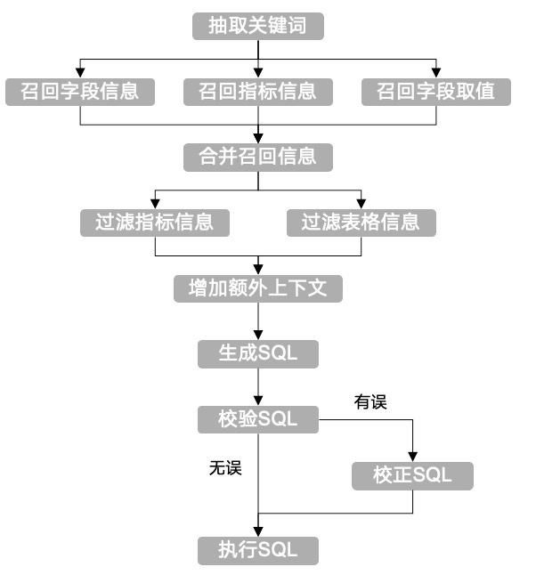
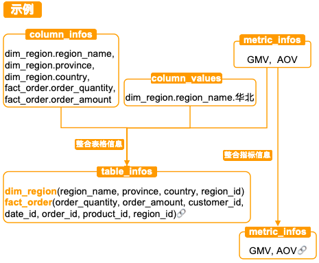
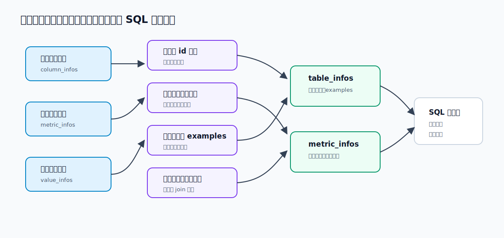

# 12 - 电商问数：召回信息合并与上下文构建

<!-- TS-TRACK-BANNER -->
> **TS 生态对照（本仓库）**：可运行 Demo 在 `apps/shop-query-agent`，技术栈为 **Next.js + LangChain.js + Zod + 内存数仓/元数据召回 + Route Handler**；原教程 MySQL / Qdrant / ES / FastAPI 在 Demo 中教学简化，概念仍按本章理解。

> **TypeScript 轨道说明**：中文讲解保留原教程；**代码块使用仓库内真实 TypeScript**（`examples/` / 精校案例 / `apps/shop-query-agent`），不再使用机翻 Python。
> 精校清单：[POLISHED-CASES](POLISHED-CASES.md)


## TypeScript 可运行示例（推荐）

本章优先对照仓库真实文件：`apps/shop-query-agent/lib/agent.ts`

```typescript
// apps/shop-query-agent/lib/agent.ts
import { ChatOpenAI } from "@langchain/openai";
import { z } from "zod";
import { buildSchemaContext, recallMetadata, type RecallHit } from "./metadata";
import { executeSelect, validateSql, type QueryResult } from "./sql-engine";

export type AgentStep = {
  id: string;
  title: string;
  detail: string;
  status: "ok" | "error" | "info";
};

export type AgentResponse = {
  question: string;
  steps: AgentStep[];
  hits: RecallHit[];
  sql: string;
  result: QueryResult | null;
  answer: string;
  error?: string;
};

function createModel() {
  const apiKey = process.env.OPENAI_API_KEY;
  if (!apiKey) {
    throw new Error("缺少 OPENAI_API_KEY，请在 apps/shop-query-agent/.env.local 配置");
  }
  return new ChatOpenAI({
    apiKey,
    model: process.env.OPENAI_MODEL || "qwen-plus",
    temperature: 0,
    configuration: process.env.OPENAI_BASE_URL
      ? { baseURL: process.env.OPENAI_BASE_URL }
      : undefined,
  });
}

const SqlPlanSchema = z.object({
  sql: z.string().describe("Single SELECT statement only"),
  rationale: z.string().describe("Why this SQL answers the question"),
});

function fallbackSql(question: string, hits: RecallHit[]): string {
  const values = hits.filter((h) => h.kind === "value");
  const region = values.find((v) => v.column === "region_name")?.value;
  const brand = values.find((v) => v.column === "brand")?.value;
  const level = values.find((v) => v.column === "member_level")?.value;
  const category = values.find((v) => v.column === "category")?.value;

  const wantsGroupRegion = /地区|大区|区域|华北|华东|华南|西南/.test(question);
  const wantsBrand = /品牌/.test(question) || Boolean(brand);
  const wantsLevel = /会员/.test(question) || Boolean(level);

  if (wantsGroupRegion && !region) {
    return [
      "SELECT dim_region.region_name AS region_name, SUM(fact_order.amount) AS total_amount",
      "FROM fact_order",
      "JOIN dim_region ON fact_order.region_id = dim_region.region_id",
      "WHERE fact_order.status = 'paid'",
      "GROUP BY dim_region.region_name",
      "ORDER BY total_amount DESC",
      "LIMIT 20",
    ].join("\n");
  }

  const where: string[] = ["fact_order.status = 'paid'"];
  if (region) where.push(`dim_region.region_name = '${region}'`);
  if (brand) where.push(`dim_product.brand = '${brand}'`);
  if (level) where.push(`dim_customer.member_level = '${level}'`);
  if (category) where.push(`dim_product.category = '${category}'`);

  if (wantsBrand && region) {
    return [
      "SELECT dim_product.brand AS brand, SUM(fact_order.amount) AS total_amount",
      "FROM fact_order",
      "JOIN dim_product ON fact_order.product_id = dim_product.product_id",
      "JOIN dim_region ON fact_order.region_id = dim_region.region_id",
      `WHERE ${where.join(" AND ")}`,
      "GROUP BY dim_product.brand",
      "ORDER BY total_amount DESC",
      "LIMIT 20",
    ].join("\n");
  }

  if (wantsLevel) {
    return [
      "SELECT dim_customer.member_level AS member_level, SUM(fact_order.amount) AS total_amount, COUNT(fact_order.order_id) AS order_cnt",
      "FROM fact_order",
      "JOIN dim_customer ON fact_order.customer_id = dim_customer.customer_id",
      "JOIN dim_region ON fact_order.region_id = dim_region.region_id",
      "JOIN dim_product ON fact_order.product_id = dim_product.product_id",
      `WHERE ${where.join(" AND ")}`,
      "GROUP BY dim_customer.member_level",
      "ORDER BY total_amount DESC",
      "LIMIT 20",
    ].join("\n");
  }

  return [
    "SELECT SUM(fact_order.amount) AS total_amount, SUM(fact_order.quantity) AS total_qty, COUNT(fact_order.order_id) AS order_cnt",
    "FROM fact_order",
    "JOIN dim_customer ON fact_order.customer_id = dim_customer.customer_id",
    "JOIN dim_product ON fact_order.product_id = dim_product.product_id",
    "JOIN dim_region ON fact_order.region_id = dim_region.region_id",
    `WHERE ${where.join(" AND ")}`,
    "LIMIT 20",
  ].join("\n");
}

async function generateSql(question: string, hits: RecallHit[]): Promise<{ sql: string; rationale: string; usedModel: boolean }> {
  const context = buildSchemaContext(hits);

  try {
    const model = createModel().withStructuredOutput(SqlPlanSchema);
    const plan = await model.invoke([
      [
        "system",
        "你是电商数仓 NL2SQL 助手。只输出一条可执行的 SELECT SQL。不要编造不存在的表或字段。",
      ],
      [
        "human",
        `用户问题：${question}\n\n元数据上下文：\n${context}\n\n请生成 SQL。`,
      ],
    ]);
    return { sql: plan.sql, rationale: plan.rationale, usedModel: true };
  } catch (err) {
    const sql = fallbackSql(question, hits);
    const raw = err instanceof Error ? err.message : String(err);
    const short =
      raw.includes("API key") || raw.includes("401")
        ? "未配置有效 OPENAI_API_KEY，已切换规则兜底 SQL"
        : raw.slice(0, 180);
    return {
      sql,
      rationale: short,
      usedModel: false,
    };
  }
}

function summarize(question: string, result: QueryResult, rationale: string): string {
  if (!result.rows.length) {
    return "查询成功，但没有命中数据。可以尝试放宽地区/品牌/会员条件。";
  }
  const preview = result.rows
    .slice(0, 5)
    .map((r) =>
      Object.entries(r)
        .map(([k, v]) => `${k}=${v}`)
        .join(", "),
    )
    .join("；");
  return `针对「${question}」共返回 ${result.rowCount} 行。${rationale} 示例：${preview}`;
}

export async function runShopQueryAgent(question: string): Promise<AgentResponse> {
  const steps: AgentStep[] = [];
  const q = question.trim();
  if (!q) {
    return {
      question,
      steps: [{ id: "1", title: "校验输入", detail: "问题为空", status: "error" }],
      hits: [],
      sql: "",
      result: null,
      answer: "请输入问题",
      error: "empty_question",
    };
  }

  const hits = recallMetadata(q);
  steps.push({
    id: "recall",
    title: "元数据召回",
    detail: hits.map((h) => `[${h.kind}] ${h.label}`).join(" | "),
    status: "ok",
  });

  const gen = await generateSql(q, hits);
  steps.push({
    id: "codegen",
    title: gen.usedModel ? "LLM 生成 SQL" : "规则兜底 SQL",
    detail: gen.rationale,
    status: "ok",
  });

  let sql = gen.sql.trim();
  try {
    sql = validateSql(sql);
    steps.push({
      id: "validate",
      title: "SQL 校验",
      detail: "通过（仅 SELECT，无危险语句）",
      status: "ok",
    });
  } catch (err) {
    // one repair attempt with fallback
    sql = fallbackSql(q, hits);
    steps.push({
      id: "validate",
      title: "SQL 校验失败，已纠错",
      detail: err instanceof Error ? err.message : String(err),
      status: "info",
    });
  }

  try {
    const result = executeSelect(sql);
    steps.push({
      id: "execute",
      title: "执行 SQL",
      detail: `返回 ${result.rowCount} 行`,
      status: "ok",
    });
    const answer = summarize(q, result, gen.rationale);
    steps.push({
      id: "answer",
      title: "生成结论",
      detail: answer,
      status: "ok",
    });
    return { question: q, steps, hits, sql, result, answer };
  } catch (err) {
    const message = err instanceof Error ? err.message : String(err);
    // final fallback
    try {
      const fb = fallbackSql(q, hits);
      const result = executeSelect(fb);
      steps.push({
        id: "execute",
        title: "执行失败后启用兜底 SQL",
        detail: message,
        status: "info",
      });
      const answer = summarize(q, result, "使用兜底查询");
      return {
        question: q,
        steps,
        hits,
        sql: fb,
        result,
        answer,
      };
    } catch (err2) {
      const msg2 = err2 instanceof Error ? err2.message : String(err2);
      steps.push({
        id: "execute",
        title: "执行 SQL 失败",
        detail: msg2,
        status: "error",
      });
      return {
        question: q,
        steps,
        hits,
        sql,
        result: null,
        answer: "查询失败",
        error: msg2,
      };
    }
  }
}
```

```bash
npx tsx apps/shop-query-agent/lib/agent.ts
```


---

**本章课程目标：**

- 理解为什么字段、指标、字段取值三路召回后，还不能直接生成 SQL。
- 掌握 `table_infos` 和 `metric_infos` 这两个后续核心上下文的结构。
- 看懂 `merge_retrieved_info` 如何把分散的 `ColumnInfo`、`MetricInfo`、`ValueInfo` 合并成按表组织的信息。

**学习建议：** 这一章不调用大模型，本质是把上一章召回来的候选信息整理成 SQL 生成能用的上下文。读代码时先拿一组样例输入，观察它如何分组、去重、补字段、转类型，最后变成下游更好消费的结构。这里看懂了，后面 SQL 提示词为什么能写得更稳就有依据。

**对应代码分支：** `12-agent-merge-retrievals`

---

## 1、本章在问数链路中的位置



上一章完成了关键词抽取和三路召回。三路召回结束后，`state` 里会有三份结果：

```text
retrieved_column_infos  # 召回到的字段信息
retrieved_metric_infos  # 召回到的指标信息
retrieved_value_infos   # 召回到的字段真实取值
```

这一章要实现的是下一个节点：`merge_retrieved_info`

在整条问数链路中，它的位置如下：

```text
用户问题
  -> extract_keywords
  -> recall_column / recall_metric / recall_value
  -> merge_retrieved_info
  -> filter_table / filter_metric
  -> add_extra_context
  -> generate_sql
```



召回节点负责“找候选”，合并节点负责“整理候选”。整理后的结果会继续交给过滤节点和 SQL 生成节点使用。

本章结束后，`state` 里会多出两个后续节点最常用的字段：

```text
table_infos   # 按表组织好的表结构上下文
metric_infos  # 整理后的指标上下文
```

后面的过滤表、过滤指标、生成 SQL，都会围绕这两份上下文继续工作。

---

## 2、为什么召回结果不能直接交给大模型

三路召回拿到的信息是分散的。

字段召回得到的是一个字段列表，列表里的每一项都是一个 `ColumnInfo`：

```text
retrieved_column_infos: list[ColumnInfo]
```

比如用户问“统计华北地区的销售总额”，字段召回里可能会有：

```text
fact_order.order_amount  # 订单金额字段
dim_region.region_name   # 地区名称字段
fact_order.region_id     # 订单事实表里的地区外键
```

指标召回得到的是一个指标列表，列表里的每一项都是一个 `MetricInfo`：

```text
retrieved_metric_infos: list[MetricInfo]
```

例如：

```text
GMV  # 销售总额、成交额
AOV  # 客单价
```

字段取值召回得到的是一个真实值列表，列表里的每一项都是一个 `ValueInfo`：

```text
retrieved_value_infos: list[ValueInfo]
```

例如：

```text
dim_region.region_name.华北  # region_name 字段里的真实取值：华北
```

但是大模型生成 SQL 时，更希望看到的是这样的上下文：

```text
有哪些表
每张表有哪些字段
字段类型是什么
字段角色是什么
字段有哪些示例值
指标如何定义
指标依赖哪些字段
表之间可能如何 join
```

这就像让一个人写 SQL。你只给他说：

```text
order_amount
GMV
华北
region_name
```

他还是要猜这些字段分别在哪张表、哪些字段能关联、`华北` 应该放到哪个字段的过滤条件里。

更适合 SQL 生成的输入，是按表组织后的结构：

```yaml
- name: fact_order
  role: fact
  description: 订单事实表
  columns:
    - name: order_amount
      type: decimal
      role: measure
      description: 订单金额

- name: dim_region
  role: dimension
  description: 地区维度表
  columns:
    - name: region_name
      type: string
      role: dimension
      examples: ["华北"]
      description: 地区名称
```

所以 `merge_retrieved_info` 要做的事，不是继续检索，而是把分散的召回结果整理成结构化上下文。

---

## 3、合并后的目标结构



`merge_retrieved_info` 最终返回两个字段：

```typescript
// Real TypeScript from repo: apps/shop-query-agent/lib/agent.ts
import { ChatOpenAI } from "@langchain/openai";
import { z } from "zod";
import { buildSchemaContext, recallMetadata, type RecallHit } from "./metadata";
import { executeSelect, validateSql, type QueryResult } from "./sql-engine";

export type AgentStep = {
  id: string;
  title: string;
  detail: string;
  status: "ok" | "error" | "info";
};

export type AgentResponse = {
  question: string;
  steps: AgentStep[];
  hits: RecallHit[];
  sql: string;
  result: QueryResult | null;
  answer: string;
  error?: string;
};

function createModel() {
  const apiKey = process.env.OPENAI_API_KEY;
  if (!apiKey) {
    throw new Error("缺少 OPENAI_API_KEY，请在 apps/shop-query-agent/.env.local 配置");
  }
  return new ChatOpenAI({
    apiKey,
    model: process.env.OPENAI_MODEL || "qwen-plus",
    temperature: 0,
    configuration: process.env.OPENAI_BASE_URL
      ? { baseURL: process.env.OPENAI_BASE_URL }
      : undefined,
  });
}

const SqlPlanSchema = z.object({
  sql: z.string().describe("Single SELECT statement only"),
  rationale: z.string().describe("Why this SQL answers the question"),
});

function fallbackSql(question: string, hits: RecallHit[]): string {
  const values = hits.filter((h) => h.kind === "value");
  const region = values.find((v) => v.column === "region_name")?.value;
  const brand = values.find((v) => v.column === "brand")?.value;
  const level = values.find((v) => v.column === "member_level")?.value;
  const category = values.find((v) => v.column === "category")?.value;

  const wantsGroupRegion = /地区|大区|区域|华北|华东|华南|西南/.test(question);
  const wantsBrand = /品牌/.test(question) || Boolean(brand);
  const wantsLevel = /会员/.test(question) || Boolean(level);

  if (wantsGroupRegion && !region) {
    return [
      "SELECT dim_region.region_name AS region_name, SUM(fact_order.amount) AS total_amount",
      "FROM fact_order",
      "JOIN dim_region ON fact_order.region_id = dim_region.region_id",
      "WHERE fact_order.status = 'paid'",
      "GROUP BY dim_region.region_name",
      "ORDER BY total_amount DESC",
      "LIMIT 20",
    ].join("\n");
  }

  const where: string[] = ["fact_order.status = 'paid'"];
  if (region) where.push(`dim_region.region_name = '${region}'`);
  if (brand) where.push(`dim_product.brand = '${brand}'`);
  if (level) where.push(`dim_customer.member_level = '${level}'`);
  if (category) where.push(`dim_product.category = '${category}'`);

  if (wantsBrand && region) {
    return [
      "SELECT dim_product.brand AS brand, SUM(fact_order.amount) AS total_amount",
      "FROM fact_order",
      "JOIN dim_product ON fact_order.product_id = dim_product.product_id",
      "JOIN dim_region ON fact_order.region_id = dim_region.region_id",
      `WHERE ${where.join(" AND ")}`,
      "GROUP BY dim_product.brand",
      "ORDER BY total_amount DESC",
      "LIMIT 20",
    ].join("\n");
  }

  if (wantsLevel) {
    return [
      "SELECT dim_customer.member_level AS member_level, SUM(fact_order.amount) AS total_amount, COUNT(fact_order.order_id) AS order_cnt",
      "FROM fact_order",
      "JOIN dim_customer ON fact_order.customer_id = dim_customer.customer_id",
      "JOIN dim_region ON fact_order.region_id = dim_region.region_id",
      "JOIN dim_product ON fact_order.product_id = dim_product.product_id",
      `WHERE ${where.join(" AND ")}`,
      "GROUP BY dim_customer.member_level",
      "ORDER BY total_amount DESC",
      "LIMIT 20",
    ].join("\n");
  }

  return [
    "SELECT SUM(fact_order.amount) AS total_amount, SUM(fact_order.quantity) AS total_qty, COUNT(fact_order.order_id) AS order_cnt",
    "FROM fact_order",
    "JOIN dim_customer ON fact_order.customer_id = dim_customer.customer_id",
    "JOIN dim_product ON fact_order.product_id = dim_product.product_id",
    "JOIN dim_region ON fact_order.region_id = dim_region.region_id",
    `WHERE ${where.join(" AND ")}`,
    "LIMIT 20",
  ].join("\n");
}

async function generateSql(question: string, hits: RecallHit[]): Promise<{ sql: string; rationale: string; usedModel: boolean }> {
  const context = buildSchemaContext(hits);

  try {
    const model = createModel().withStructuredOutput(SqlPlanSchema);
    const plan = await model.invoke([
      [
        "system",
        "你是电商数仓 NL2SQL 助手。只输出一条可执行的 SELECT SQL。不要编造不存在的表或字段。",
      ],
      [
        "human",
        `用户问题：${question}\n\n元数据上下文：\n${context}\n\n请生成 SQL。`,
      ],
    ]);
    return { sql: plan.sql, rationale: plan.rationale, usedModel: true };
  } catch (err) {
    const sql = fallbackSql(question, hits);
    const raw = err instanceof Error ? err.message : String(err);
    const short =
      raw.includes("API key") || raw.includes("401")
        ? "未配置有效 OPENAI_API_KEY，已切换规则兜底 SQL"
        : raw.slice(0, 180);
    return {
      sql,
      rationale: short,
      usedModel: false,
    };
  }
}

function summarize(question: string, result: QueryResult, rationale: string): string {
  if (!result.rows.length) {
    return "查询成功，但没有命中数据。可以尝试放宽地区/品牌/会员条件。";
  }
  const preview = result.rows
    .slice(0, 5)
    .map((r) =>
      Object.entries(r)
        .map(([k, v]) => `${k}=${v}`)
        .join(", "),
    )
    .join("；");
  return `针对「${question}」共返回 ${result.rowCount} 行。${rationale} 示例：${preview}`;
}

export async function runShopQueryAgent(question: string): Promise<AgentResponse> {
  const steps: AgentStep[] = [];
  const q = question.trim();
  if (!q) {
    return {
      question,
      steps: [{ id: "1", title: "校验输入", detail: "问题为空", status: "error" }],
      hits: [],
      sql: "",
      result: null,
      answer: "请输入问题",
      error: "empty_question",
    };
  }

  const hits = recallMetadata(q);
  steps.push({
    id: "recall",
    title: "元数据召回",
    detail: hits.map((h) => `[${h.kind}] ${h.label}`).join(" | "),
    status: "ok",
  });

  const gen = await generateSql(q, hits);
  steps.push({
    id: "codegen",
    title: gen.usedModel ? "LLM 生成 SQL" : "规则兜底 SQL",
    detail: gen.rationale,
    status: "ok",
  });

  let sql = gen.sql.trim();
  try {
    sql = validateSql(sql);
    steps.push({
      id: "validate",
      title: "SQL 校验",
      detail: "通过（仅 SELECT，无危险语句）",
      status: "ok",
    });
  } catch (err) {
    // one repair attempt with fallback
    sql = fallbackSql(q, hits);
    steps.push({
      id: "validate",
      title: "SQL 校验失败，已纠错",
      detail: err instanceof Error ? err.message : String(err),
      status: "info",
    });
  }

  try {
    const result = executeSelect(sql);
    steps.push({
      id: "execute",
      title: "执行 SQL",
      detail: `返回 ${result.rowCount} 行`,
      status: "ok",
    });
    const answer = summarize(q, result, gen.rationale);
    steps.push({
      id: "answer",
      title: "生成结论",
      detail: answer,
      status: "ok",
    });
    return { question: q, steps, hits, sql, result, answer };
  } catch (err) {
    const message = err instanceof Error ? err.message : String(err);
    // final fallback
    try {
      const fb = fallbackSql(q, hits);
      const result = executeSelect(fb);
      steps.push({
        id: "execute",
        title: "执行失败后启用兜底 SQL",
        detail: message,
        status: "info",
      });
      const answer = summarize(q, result, "使用兜底查询");
      return {
        question: q,
        steps,
        hits,
        sql: fb,
        result,
        answer,
      };
    } catch (err2) {
      const msg2 = err2 instanceof Error ? err2.message : String(err2);
      steps.push({
        id: "execute",
        title: "执行 SQL 失败",
        detail: msg2,
        status: "error",
      });
      return {
        question: q,
        steps,
        hits,
        sql,
        result: null,
        answer: "查询失败",
        error: msg2,
      };
    }
  }
}
```

这两个字段会写回 `DataAgentState`。

### 3.1 table_infos：按表组织字段

`table_infos` 是一组表信息。每个表里包含表名、表角色、表描述，以及这张表下相关的字段列表。

大致结构如下：

```typescript
// Real TypeScript from repo: apps/shop-query-agent/lib/metadata.ts
/**
 * Metadata knowledge base (simplified).
 * Real project: MySQL meta + Qdrant + ES.
 * Demo: in-memory field/metric catalog + keyword/value map.
 */

export type FieldMeta = {
  table: string;
  column: string;
  role: "metric" | "dimension" | "id" | "time" | "status";
  aliases: string[];
  description: string;
  sampleValues?: string[];
};

export type MetricMeta = {
  name: string;
  expression: string;
  aliases: string[];
  description: string;
};

export const fieldCatalog: FieldMeta[] = [
  {
    table: "fact_order",
    column: "amount",
    role: "metric",
    aliases: ["销售额", "成交额", "销售总额", "金额", "GMV"],
    description: "订单成交金额",
  },
  {
    table: "fact_order",
    column: "quantity",
    role: "metric",
    aliases: ["销量", "数量", "件数"],
    description: "订单商品数量",
  },
  {
    table: "fact_order",
    column: "order_date",
    role: "time",
    aliases: ["日期", "下单日期", "时间"],
    description: "订单日期 YYYY-MM-DD",
  },
  {
    table: "fact_order",
    column: "status",
    role: "status",
    aliases: ["订单状态", "状态"],
    description: "paid / refunded / pending",
    sampleValues: ["paid", "refunded", "pending"],
  },
  {
    table: "dim_region",
    column: "region_name",
    role: "dimension",
    aliases: ["地区", "大区", "区域"],
    description: "销售大区",
    sampleValues: ["华北", "华东", "华南", "西南"],
  },
  {
    table: "dim_product",
    column: "brand",
    role: "dimension",
    aliases: ["品牌"],
    description: "商品品牌",
    sampleValues: ["苹果", "华为", "小米"],
  },
  {
    table: "dim_product",
    column: "category",
    role: "dimension",
    aliases: ["品类", "类目"],
    description: "商品品类",
    sampleValues: ["手机", "耳机"],
  },
  {
    table: "dim_customer",
    column: "member_level",
    role: "dimension",
    aliases: ["会员", "会员等级", "等级"],
    description: "会员等级",
    sampleValues: ["普通", "黄金", "钻石"],
  },
  {
    table: "dim_customer",
    column: "city",
    role: "dimension",
    aliases: ["城市"],
    description: "客户城市",
    sampleValues: ["北京", "上海", "杭州", "深圳", "成都"],
  },
];

export const metricCatalog: MetricMeta[] = [
  {
    name: "销售总额",
    expression: "SUM(fact_order.amount)",
    aliases: ["销售额", "成交总额", "GMV", "总销售额"],
    description: "订单金额合计（默认仅 paid）",
  },
  {
    name: "订单量",
    expression: "COUNT(DISTINCT fact_order.order_id)",
    aliases: ["订单数", "单量"],
    description: "订单数",
  },
  {
    name: "销售件数",
    expression: "SUM(fact_order.quantity)",
    aliases: ["销量", "件数"],
    description: "销售件数合计",
  },
];

export type RecallHit = {
  kind: "field" | "metric" | "value";
  score: number;
  label: string;
  detail: string;
  table?: string;
  column?: string;
  value?: string;
};

function includesAny(text: string, words: string[]) {
  return words.some((w) => text.includes(w));
}

/** Multi-path recall: fields / metrics / values from natural language. */
export function recallMetadata(question: string): RecallHit[] {
  const q = question.trim();
  const hits: RecallHit[] = [];

  for (const m of metricCatalog) {
    const keys = [m.name, ...m.aliases];
    if (includesAny(q, keys)) {
      hits.push({
        kind: "metric",
        score: 3,
        label: m.name,
        detail: `${m.expression} | ${m.description}`,
      });
    }
  }

  for (const f of fieldCatalog) {
    const keys = [f.column, ...f.aliases];
    if (includesAny(q, keys)) {
      hits.push({
        kind: "field",
        score: 2,
        label: `${f.table}.${f.column}`,
        detail: `${f.role} | ${f.description}`,
        table: f.table,
        column: f.column,
      });
    }
    for (const v of f.sampleValues ?? []) {
      if (q.includes(v)) {
        hits.push({
          kind: "value",
          score: 4,
          label: `${f.table}.${f.column} = ${v}`,
          detail: `命中字段取值「${v}」`,
          table: f.table,
          column: f.column,
          value: v,
        });
      }
    }
  }

  // defaults if nothing matched
  if (!hits.some((h) => h.kind === "metric")) {
    hits.push({
      kind: "metric",
      score: 1,
      label: "销售总额",
      detail: "SUM(fact_order.amount) | 默认指标",
    });
  }

  hits.sort((a, b) => b.score - a.score);
  // de-dup by label
  const seen = new Set<string>();
  return hits.filter((h) => {
    if (seen.has(h.label)) return false;
    seen.add(h.label);
    return true;
  });
}

export function buildSchemaContext(hits: RecallHit[]): string {
  const fields = fieldCatalog
    .map(
      (f) =>
        `- ${f.table}.${f.column} (${f.role}) aliases=${f.aliases.join("/")}; ${f.description}`,
    )
    .join("\n");
  const metrics = metricCatalog
    .map((m) => `- ${m.name}: ${m.expression}; aliases=${m.aliases.join("/")}`)
    .join("\n");
  const hitText = hits
    .map((h) => `- [${h.kind}] ${h.label}: ${h.detail}`)
    .join("\n");

  return [
    "可用表：fact_order, dim_customer, dim_product, dim_region",
    "关联键：fact_order.customer_id=dim_customer.customer_id; fact_order.product_id=dim_product.product_id; fact_order.region_id=dim_region.region_id",
    "字段目录：",
    fields,
    "指标目录：",
    metrics,
    "本问题召回命中：",
    hitText,
    "SQL 规则：只写 SELECT；默认 status='paid'；表名列名必须来自目录；可用 GROUP BY；limit <= 50。",
  ].join("\n");
}
```

这里的重点是“按表分组”。后面生成 SQL 时，模型不只是知道有 `order_amount` 这个字段，还知道它属于 `fact_order`。

### 3.2 metric_infos：整理后的指标定义

`metric_infos` 是一组指标信息。它保留指标生成 SQL 所需的内容：

```typescript
// Real TypeScript from repo: apps/shop-query-agent/lib/sql-engine.ts
/**
 * Extremely small SQL executor for teaching demos.
 * Supports a subset of SELECT ... FROM ... JOIN ... WHERE ... GROUP BY ... ORDER BY ... LIMIT
 * against the in-memory warehouse.
 */
import {
  dim_customer,
  dim_product,
  dim_region,
  fact_order,
  type CustomerRow,
  type OrderRow,
  type ProductRow,
  type RegionRow,
} from "./warehouse";

type JoinedRow = OrderRow & {
  customer_name: string;
  member_level: string;
  city: string;
  product_name: string;
  brand: string;
  category: string;
  region_name: string;
  province: string;
};

function buildJoined(): JoinedRow[] {
  const cMap = new Map(dim_customer.map((c) => [c.customer_id, c]));
  const pMap = new Map(dim_product.map((p) => [p.product_id, p]));
  const rMap = new Map(dim_region.map((r) => [r.region_id, r]));

  return fact_order.map((o) => {
    const c = cMap.get(o.customer_id) as CustomerRow;
    const p = pMap.get(o.product_id) as ProductRow;
    const r = rMap.get(o.region_id) as RegionRow;
    return {
      ...o,
      customer_name: c.name,
      member_level: c.member_level,
      city: c.city,
      product_name: p.product_name,
      brand: p.brand,
      category: p.category,
      region_name: r.region_name,
      province: r.province,
    };
  });
}

const FIELD_GETTERS: Record<string, (row: JoinedRow) => string | number> = {
  order_id: (r) => r.order_id,
  order_date: (r) => r.order_date,
  customer_id: (r) => r.customer_id,
  product_id: (r) => r.product_id,
  region_id: (r) => r.region_id,
  quantity: (r) => r.quantity,
  amount: (r) => r.amount,
  status: (r) => r.status,
  name: (r) => r.customer_name,
  customer_name: (r) => r.customer_name,
  member_level: (r) => r.member_level,
  city: (r) => r.city,
  product_name: (r) => r.product_name,
  brand: (r) => r.brand,
  category: (r) => r.category,
  region_name: (r) => r.region_name,
  province: (r) => r.province,
  "fact_order.amount": (r) => r.amount,
  "fact_order.quantity": (r) => r.quantity,
  "fact_order.status": (r) => r.status,
  "fact_order.order_date": (r) => r.order_date,
  "dim_region.region_name": (r) => r.region_name,
  "dim_product.brand": (r) => r.brand,
  "dim_product.category": (r) => r.category,
  "dim_customer.member_level": (r) => r.member_level,
  "dim_customer.city": (r) => r.city,
};

function normalizeIdent(raw: string) {
  return raw.replace(/["'`]/g, "").trim();
}

function getField(row: JoinedRow, ident: string) {
  const key = normalizeIdent(ident);
  const simple = key.includes(".") ? key.split(".").pop()! : key;
  const getter =
    FIELD_GETTERS[key] ||
    FIELD_GETTERS[simple] ||
    FIELD_GETTERS[key.toLowerCase()];
  if (!getter) throw new Error(`未知字段: ${ident}`);
  return getter(row);
}

type WhereCond =
  | { type: "eq" | "ne" | "gt" | "gte" | "lt" | "lte"; left: string; right: string }
  | { type: "like"; left: string; right: string }
  | { type: "and" | "or"; items: WhereCond[] };

function parseValue(token: string): string {
  const t = token.trim();
  if (
    (t.startsWith("'") && t.endsWith("'")) ||
    (t.startsWith('"') && t.endsWith('"'))
  ) {
    return t.slice(1, -1);
  }
  return t;
}

function parseWhere(expr: string): WhereCond {
  const orParts = splitTopLevel(expr, " OR ");
  if (orParts.length > 1) {
    return { type: "or", items: orParts.map(parseWhere) };
  }
  const andParts = splitTopLevel(expr, " AND ");
  if (andParts.length > 1) {
    return { type: "and", items: andParts.map(parseWhere) };
  }

  const like = expr.match(/^(.+?)\s+LIKE\s+(.+)$/i);
  if (like) {
    return {
      type: "like",
      left: normalizeIdent(like[1]),
      right: parseValue(like[2]),
    };
  }

  const ops: Array<[RegExp, WhereCond["type"]]> = [
    [/^(.+?)\s*>=\s*(.+)$/, "gte"],
    [/^(.+?)\s*<=\s*(.+)$/, "lte"],
    [/^(.+?)\s*!=\s*(.+)$/, "ne"],
    [/^(.+?)\s*<>\s*(.+)$/, "ne"],
    [/^(.+?)\s*>\s*(.+)$/, "gt"],
    [/^(.+?)\s*<\s*(.+)$/, "lt"],
    [/^(.+?)\s*=\s*(.+)$/, "eq"],
  ];
  for (const [re, type] of ops) {
    const m = expr.match(re);
    if (m) {
      return {
        type: type as "eq",
        left: normalizeIdent(m[1]),
        right: parseValue(m[2]),
      };
    }
  }
  throw new Error(`无法解析 WHERE 条件: ${expr}`);
}

function splitTopLevel(input: string, sep: string): string[] {
  const parts: string[] = [];
  let depth = 0;
  let buf = "";
  for (let i = 0; i < input.length; i++) {
    const ch = input[i];
    if (ch === "(") depth++;
    if (ch === ")") depth = Math.max(0, depth - 1);
    if (depth === 0 && input.slice(i, i + sep.length).toUpperCase() === sep) {
      parts.push(buf.trim());
      buf = "";
      i += sep.length - 1;
      continue;
    }
    buf += ch;
  }
  if (buf.trim()) parts.push(buf.trim());
  return parts;
}

function isLogicCond(cond: WhereCond): cond is { type: "and" | "or"; items: WhereCond[] } {
  return cond.type === "and" || cond.type === "or";
}

function evalWhere(row: JoinedRow, cond: WhereCond): boolean {
  if (isLogicCond(cond)) {
    if (cond.type === "and") return cond.items.every((c) => evalWhere(row, c));
    return cond.items.some((c) => evalWhere(row, c));
  }

  const left = getField(row, cond.left);
  if (cond.type === "like") {
    const pattern = cond.right.replace(/%/g, ".*");
    return new RegExp(`^${pattern}$`, "i").test(String(left));
  }

  const rightRaw = cond.right;
  const rightNum = Number(rightRaw);
  const leftNum = Number(left);
  const bothNum = !Number.isNaN(rightNum) && !Number.isNaN(leftNum);
  switch (cond.type) {
    case "eq":
      return bothNum ? leftNum === rightNum : String(left) === rightRaw;
    case "ne":
      return bothNum ? leftNum !== rightNum : String(left) !== rightRaw;
    case "gt":
      return leftNum > rightNum;
    case "gte":
      return leftNum >= rightNum;
    case "lt":
      return leftNum < rightNum;
    case "lte":
      return leftNum <= rightNum;
    default:
      return false;
  }
}

type SelectItem =
  | { kind: "field"; expr: string; alias: string }
  | { kind: "agg"; fn: "sum" | "count" | "avg" | "max" | "min"; expr: string; alias: string };

function parseSelectList(selectSql: string): SelectItem[] {
  return selectSql.split(",").map((raw) => {
    const part = raw.trim();
    const aliasMatch = part.match(/\s+AS\s+([a-zA-Z_][\w]*)$/i);
    const alias = aliasMatch ? aliasMatch[1] : "";
    const expr = aliasMatch ? part.slice(0, aliasMatch.index).trim() : part;

    const agg = expr.match(/^(SUM|COUNT|AVG|MAX|MIN)\s*\(\s*(.+?)\s*\)$/i);
    if (agg) {
      const fn = agg[1].toLowerCase() as SelectItem & { kind: "agg" } extends never
        ? never
        : "sum";
      const inner = agg[2].trim();
      const autoAlias =
        alias ||
        `${agg[1].toLowerCase()}_${normalizeIdent(inner).replace(/\W+/g, "_")}`;
      return {
        kind: "agg",
        fn: agg[1].toLowerCase() as "sum",
        expr: inner,
        alias: autoAlias,
      };
    }

    return {
      kind: "field",
      expr,
      alias: alias || normalizeIdent(expr).split(".").pop()!,
    };
  });
}

export type QueryResult = {
  columns: string[];
  rows: Array<Record<string, string | number | null>>;
  rowCount: number;
};

export function validateSql(sql: string): string {
  const cleaned = sql.trim().replace(/;+\s*$/, "");
  if (!/^\s*SELECT\s+/i.test(cleaned)) {
    throw new Error("仅允许 SELECT 查询");
  }
  if (/\b(INSERT|UPDATE|DELETE|DROP|ALTER|TRUNCATE|ATTACH|PRAGMA)\b/i.test(cleaned)) {
    throw new Error("检测到危险语句，已拒绝执行");
  }
  if (!/\bFROM\b/i.test(cleaned)) {
    throw new Error("SQL 缺少 FROM");
  }
  return cleaned;
}

export function executeSelect(sql: string): QueryResult {
  const cleaned = validateSql(sql);
  const selectMatch = cleaned.match(
    /^\s*SELECT\s+([\s\S]+?)\s+FROM\s+([\s\S]+)$/i,
  );
  if (!selectMatch) throw new Error("无法解析 SELECT/FROM");

  const selectList = selectMatch[1].trim();
  let rest = selectMatch[2].trim();

  // strip joins textually; demo always uses pre-joined universe
  rest = rest.replace(
    /\b(?:INNER\s+|LEFT\s+|RIGHT\s+)?JOIN\b[\s\S]*?(?=\bWHERE\b|\bGROUP\s+BY\b|\bORDER\s+BY\b|\bLIMIT\b|$)/gi,
    " ",
  );

  let whereSql = "";
  let groupSql = "";
  let orderSql = "";
  let limit = 50;

  const limitMatch = rest.match(/\bLIMIT\s+(\d+)\s*$/i);
  if (limitMatch) {
    limit = Math.min(50, Number(limitMatch[1]));
    rest = rest.slice(0, limitMatch.index).trim();
  }

  const orderMatch = rest.match(/\bORDER\s+BY\s+([\s\S]+)$/i);
  if (orderMatch) {
    orderSql = orderMatch[1].trim();
    rest = rest.slice(0, orderMatch.index).trim();
  }

  const groupMatch = rest.match(/\bGROUP\s+BY\s+([\s\S]+)$/i);
  if (groupMatch) {
    groupSql = groupMatch[1].trim();
    rest = rest.slice(0, groupMatch.index).trim();
  }

  const whereMatch = rest.match(/\bWHERE\s+([\s\S]+)$/i);
  if (whereMatch) {
    whereSql = whereMatch[1].trim();
    rest = rest.slice(0, whereMatch.index).trim();
  }

  void rest; // from clause ignored after join strip (single joined table universe)

  let rows = buildJoined();
  if (whereSql) {
    const cond = parseWhere(whereSql);
    rows = rows.filter((r) => evalWhere(r, cond));
  }

  const items = parseSelectList(selectList);
  const hasAgg = items.some((i) => i.kind === "agg");

  if (hasAgg || groupSql) {
    const groupKeys = groupSql
      ? groupSql.split(",").map((g) => normalizeIdent(g))
      : [];
    const groups = new Map<string, JoinedRow[]>();
    for (const row of rows) {
      const key =
        groupKeys.length === 0
          ? "__all__"
          : groupKeys.map((k) => String(getField(row, k))).join("||");
      const list = groups.get(key) ?? [];
      list.push(row);
      groups.set(key, list);
    }

    const out: Array<Record<string, string | number | null>> = [];
    for (const [, groupRows] of groups) {
      const obj: Record<string, string | number | null> = {};
      for (const item of items) {
        if (item.kind === "field") {
          obj[item.alias] = getField(groupRows[0], item.expr) as string | number
// ... truncated; see full file in repository ...
```

它和召回阶段的 `MetricInfo` 很像，只是去掉了不需要给模型看的内部 `id`。

---

## 4、补齐 State 和 Context

### 4.1 DataAgentState：保存合并后的上下文

合并后的 `table_infos` 和 `metric_infos` 后面还要被过滤节点、SQL 生成节点继续读取，所以它们必须放进 `DataAgentState`。

项目对应文件路径：`apps/shop-query-agent/app/agent/state.ts`

```typescript
// Real TypeScript from repo: apps/shop-query-agent/lib/warehouse.ts
/**
 * Teaching warehouse (MySQL-like) in memory.
 * Mirrors 电商问数 fact/dim tables at small scale.
 */

export type OrderRow = {
  order_id: string;
  order_date: string;
  customer_id: string;
  product_id: string;
  region_id: string;
  quantity: number;
  amount: number;
  status: "paid" | "refunded" | "pending";
};

export type CustomerRow = {
  customer_id: string;
  name: string;
  member_level: "普通" | "黄金" | "钻石";
  city: string;
};

export type ProductRow = {
  product_id: string;
  product_name: string;
  brand: string;
  category: string;
  unit_price: number;
};

export type RegionRow = {
  region_id: string;
  region_name: string;
  province: string;
};

export const dim_customer: CustomerRow[] = [
  { customer_id: "C001", name: "张三", member_level: "黄金", city: "北京" },
  { customer_id: "C002", name: "李四", member_level: "普通", city: "上海" },
  { customer_id: "C003", name: "王五", member_level: "钻石", city: "杭州" },
  { customer_id: "C004", name: "赵六", member_level: "黄金", city: "深圳" },
  { customer_id: "C005", name: "钱七", member_level: "普通", city: "成都" },
];

export const dim_product: ProductRow[] = [
  {
    product_id: "P001",
    product_name: "iPhone 15",
    brand: "苹果",
    category: "手机",
    unit_price: 5999,
  },
  {
    product_id: "P002",
    product_name: "Mate 60",
    brand: "华为",
    category: "手机",
    unit_price: 5499,
  },
  {
    product_id: "P003",
    product_name: "小米14",
    brand: "小米",
    category: "手机",
    unit_price: 3999,
  },
  {
    product_id: "P004",
    product_name: "AirPods Pro",
    brand: "苹果",
    category: "耳机",
    unit_price: 1899,
  },
  {
    product_id: "P005",
    product_name: "Redmi Buds",
    brand: "小米",
    category: "耳机",
    unit_price: 299,
  },
];

export const dim_region: RegionRow[] = [
  { region_id: "R01", region_name: "华北", province: "北京" },
  { region_id: "R02", region_name: "华东", province: "上海" },
  { region_id: "R03", region_name: "华南", province: "广东" },
  { region_id: "R04", region_name: "西南", province: "四川" },
];

export const fact_order: OrderRow[] = [
  {
    order_id: "O1001",
    order_date: "2026-01-05",
    customer_id: "C001",
    product_id: "P001",
    region_id: "R01",
    quantity: 1,
    amount: 5999,
    status: "paid",
  },
  {
    order_id: "O1002",
    order_date: "2026-01-08",
    customer_id: "C002",
    product_id: "P003",
    region_id: "R02",
    quantity: 2,
    amount: 7998,
    status: "paid",
  },
  {
    order_id: "O1003",
    order_date: "2026-01-12",
    customer_id: "C003",
    product_id: "P002",
    region_id: "R02",
    quantity: 1,
    amount: 5499,
    status: "paid",
  },
  {
    order_id: "O1004",
    order_date: "2026-02-03",
    customer_id: "C004",
    product_id: "P004",
    region_id: "R03",
    quantity: 1,
    amount: 1899,
    status: "paid",
  },
  {
    order_id: "O1005",
    order_date: "2026-02-10",
    customer_id: "C001",
    product_id: "P005",
    region_id: "R01",
    quantity: 3,
    amount: 897,
    status: "paid",
  },
  {
    order_id: "O1006",
    order_date: "2026-02-18",
    customer_id: "C005",
    product_id: "P001",
    region_id: "R04",
    quantity: 1,
    amount: 5999,
    status: "refunded",
  },
  {
    order_id: "O1007",
    order_date: "2026-03-01",
    customer_id: "C003",
    product_id: "P004",
    region_id: "R02",
    quantity: 2,
    amount: 3798,
    status: "paid",
  },
  {
    order_id: "O1008",
    order_date: "2026-03-11",
    customer_id: "C004",
    product_id: "P002",
    region_id: "R03",
    quantity: 1,
    amount: 5499,
    status: "paid",
  },
  {
    order_id: "O1009",
    order_date: "2026-03-20",
    customer_id: "C002",
    product_id: "P005",
    region_id: "R02",
    quantity: 4,
    amount: 1196,
    status: "paid",
  },
  {
    order_id: "O1010",
    order_date: "2026-04-02",
    customer_id: "C001",
    product_id: "P003",
    region_id: "R01",
    quantity: 1,
    amount: 3999,
    status: "paid",
  },
];

export const tables = {
  fact_order,
  dim_customer,
  dim_product,
  dim_region,
} as const;

export type TableName = keyof typeof tables;
```

然后在 `DataAgentState` 中加入合并后的上下文：

```typescript
// Real TypeScript from repo: apps/shop-query-agent/app/api/query/route.ts
import { NextResponse } from "next/server";
import { runShopQueryAgent } from "@/lib/agent";

export const runtime = "nodejs";

export async function POST(req: Request) {
  try {
    const body = (await req.json()) as { question?: string };
    const question = body.question?.trim() ?? "";
    if (!question) {
      return NextResponse.json({ error: "question is required" }, { status: 400 });
    }
    const result = await runShopQueryAgent(question);
    return NextResponse.json(result);
  } catch (err) {
    const message = err instanceof Error ? err.message : String(err);
    return NextResponse.json({ error: message }, { status: 500 });
  }
}
```

这里没有直接复用前面定义过的 `TableInfo`、`ColumnInfo`、`MetricInfo` 实体，是因为合并后的结构已经变了。

比如 `TableInfo` 实体只描述一张表本身，并不包含 `columns`；而 SQL 生成阶段需要的是“表 + 字段”的嵌套结构。所以这里单独定义了 `TableInfoState`。

同理，`MetricInfoState` 不需要内部 `id`，只保留指标名称、描述、依赖字段和别名。

---

### 4.2 DataAgentContext：注入 Meta Repository

合并节点需要根据字段 ID、表 ID 再去 `Meta MySQL` 查完整元数据。所以 `DataAgentContext` 里要有 `meta_mysql_repository`。

项目对应文件路径：`apps/shop-query-agent/app/agent/context.ts`

```typescript
// Real TypeScript from repo: apps/shop-query-agent/lib/agent.ts
import { ChatOpenAI } from "@langchain/openai";
import { z } from "zod";
import { buildSchemaContext, recallMetadata, type RecallHit } from "./metadata";
import { executeSelect, validateSql, type QueryResult } from "./sql-engine";

export type AgentStep = {
  id: string;
  title: string;
  detail: string;
  status: "ok" | "error" | "info";
};

export type AgentResponse = {
  question: string;
  steps: AgentStep[];
  hits: RecallHit[];
  sql: string;
  result: QueryResult | null;
  answer: string;
  error?: string;
};

function createModel() {
  const apiKey = process.env.OPENAI_API_KEY;
  if (!apiKey) {
    throw new Error("缺少 OPENAI_API_KEY，请在 apps/shop-query-agent/.env.local 配置");
  }
  return new ChatOpenAI({
    apiKey,
    model: process.env.OPENAI_MODEL || "qwen-plus",
    temperature: 0,
    configuration: process.env.OPENAI_BASE_URL
      ? { baseURL: process.env.OPENAI_BASE_URL }
      : undefined,
  });
}

const SqlPlanSchema = z.object({
  sql: z.string().describe("Single SELECT statement only"),
  rationale: z.string().describe("Why this SQL answers the question"),
});

function fallbackSql(question: string, hits: RecallHit[]): string {
  const values = hits.filter((h) => h.kind === "value");
  const region = values.find((v) => v.column === "region_name")?.value;
  const brand = values.find((v) => v.column === "brand")?.value;
  const level = values.find((v) => v.column === "member_level")?.value;
  const category = values.find((v) => v.column === "category")?.value;

  const wantsGroupRegion = /地区|大区|区域|华北|华东|华南|西南/.test(question);
  const wantsBrand = /品牌/.test(question) || Boolean(brand);
  const wantsLevel = /会员/.test(question) || Boolean(level);

  if (wantsGroupRegion && !region) {
    return [
      "SELECT dim_region.region_name AS region_name, SUM(fact_order.amount) AS total_amount",
      "FROM fact_order",
      "JOIN dim_region ON fact_order.region_id = dim_region.region_id",
      "WHERE fact_order.status = 'paid'",
      "GROUP BY dim_region.region_name",
      "ORDER BY total_amount DESC",
      "LIMIT 20",
    ].join("\n");
  }

  const where: string[] = ["fact_order.status = 'paid'"];
  if (region) where.push(`dim_region.region_name = '${region}'`);
  if (brand) where.push(`dim_product.brand = '${brand}'`);
  if (level) where.push(`dim_customer.member_level = '${level}'`);
  if (category) where.push(`dim_product.category = '${category}'`);

  if (wantsBrand && region) {
    return [
      "SELECT dim_product.brand AS brand, SUM(fact_order.amount) AS total_amount",
      "FROM fact_order",
      "JOIN dim_product ON fact_order.product_id = dim_product.product_id",
      "JOIN dim_region ON fact_order.region_id = dim_region.region_id",
      `WHERE ${where.join(" AND ")}`,
      "GROUP BY dim_product.brand",
      "ORDER BY total_amount DESC",
      "LIMIT 20",
    ].join("\n");
  }

  if (wantsLevel) {
    return [
      "SELECT dim_customer.member_level AS member_level, SUM(fact_order.amount) AS total_amount, COUNT(fact_order.order_id) AS order_cnt",
      "FROM fact_order",
      "JOIN dim_customer ON fact_order.customer_id = dim_customer.customer_id",
      "JOIN dim_region ON fact_order.region_id = dim_region.region_id",
      "JOIN dim_product ON fact_order.product_id = dim_product.product_id",
      `WHERE ${where.join(" AND ")}`,
      "GROUP BY dim_customer.member_level",
      "ORDER BY total_amount DESC",
      "LIMIT 20",
    ].join("\n");
  }

  return [
    "SELECT SUM(fact_order.amount) AS total_amount, SUM(fact_order.quantity) AS total_qty, COUNT(fact_order.order_id) AS order_cnt",
    "FROM fact_order",
    "JOIN dim_customer ON fact_order.customer_id = dim_customer.customer_id",
    "JOIN dim_product ON fact_order.product_id = dim_product.product_id",
    "JOIN dim_region ON fact_order.region_id = dim_region.region_id",
    `WHERE ${where.join(" AND ")}`,
    "LIMIT 20",
  ].join("\n");
}

async function generateSql(question: string, hits: RecallHit[]): Promise<{ sql: string; rationale: string; usedModel: boolean }> {
  const context = buildSchemaContext(hits);

  try {
    const model = createModel().withStructuredOutput(SqlPlanSchema);
    const plan = await model.invoke([
      [
        "system",
        "你是电商数仓 NL2SQL 助手。只输出一条可执行的 SELECT SQL。不要编造不存在的表或字段。",
      ],
      [
        "human",
        `用户问题：${question}\n\n元数据上下文：\n${context}\n\n请生成 SQL。`,
      ],
    ]);
    return { sql: plan.sql, rationale: plan.rationale, usedModel: true };
  } catch (err) {
    const sql = fallbackSql(question, hits);
    const raw = err instanceof Error ? err.message : String(err);
    const short =
      raw.includes("API key") || raw.includes("401")
        ? "未配置有效 OPENAI_API_KEY，已切换规则兜底 SQL"
        : raw.slice(0, 180);
    return {
      sql,
      rationale: short,
      usedModel: false,
    };
  }
}

function summarize(question: string, result: QueryResult, rationale: string): string {
  if (!result.rows.length) {
    return "查询成功，但没有命中数据。可以尝试放宽地区/品牌/会员条件。";
  }
  const preview = result.rows
    .slice(0, 5)
    .map((r) =>
      Object.entries(r)
        .map(([k, v]) => `${k}=${v}`)
        .join(", "),
    )
    .join("；");
  return `针对「${question}」共返回 ${result.rowCount} 行。${rationale} 示例：${preview}`;
}

export async function runShopQueryAgent(question: string): Promise<AgentResponse> {
  const steps: AgentStep[] = [];
  const q = question.trim();
  if (!q) {
    return {
      question,
      steps: [{ id: "1", title: "校验输入", detail: "问题为空", status: "error" }],
      hits: [],
      sql: "",
      result: null,
      answer: "请输入问题",
      error: "empty_question",
    };
  }

  const hits = recallMetadata(q);
  steps.push({
    id: "recall",
    title: "元数据召回",
    detail: hits.map((h) => `[${h.kind}] ${h.label}`).join(" | "),
    status: "ok",
  });

  const gen = await generateSql(q, hits);
  steps.push({
    id: "codegen",
    title: gen.usedModel ? "LLM 生成 SQL" : "规则兜底 SQL",
    detail: gen.rationale,
    status: "ok",
  });

  let sql = gen.sql.trim();
  try {
    sql = validateSql(sql);
    steps.push({
      id: "validate",
      title: "SQL 校验",
      detail: "通过（仅 SELECT，无危险语句）",
      status: "ok",
    });
  } catch (err) {
    // one repair attempt with fallback
    sql = fallbackSql(q, hits);
    steps.push({
      id: "validate",
      title: "SQL 校验失败，已纠错",
      detail: err instanceof Error ? err.message : String(err),
      status: "info",
    });
  }

  try {
    const result = executeSelect(sql);
    steps.push({
      id: "execute",
      title: "执行 SQL",
      detail: `返回 ${result.rowCount} 行`,
      status: "ok",
    });
    const answer = summarize(q, result, gen.rationale);
    steps.push({
      id: "answer",
      title: "生成结论",
      detail: answer,
      status: "ok",
    });
    return { question: q, steps, hits, sql, result, answer };
  } catch (err) {
    const message = err instanceof Error ? err.message : String(err);
    // final fallback
    try {
      const fb = fallbackSql(q, hits);
      const result = executeSelect(fb);
      steps.push({
        id: "execute",
        title: "执行失败后启用兜底 SQL",
        detail: message,
        status: "info",
      });
      const answer = summarize(q, result, "使用兜底查询");
      return {
        question: q,
        steps,
        hits,
        sql: fb,
        result,
        answer,
      };
    } catch (err2) {
      const msg2 = err2 instanceof Error ? err2.message : String(err2);
      steps.push({
        id: "execute",
        title: "执行 SQL 失败",
        detail: msg2,
        status: "error",
      });
      return {
        question: q,
        steps,
        hits,
        sql,
        result: null,
        answer: "查询失败",
        error: msg2,
      };
    }
  }
}
```

注意这里的分工：

```text
state           -> 保存本次问数链路里的业务中间结果
runtime.context -> 保存节点执行时要用的外部依赖
```

`meta_mysql_repository` 是外部依赖，所以放在 `context`，不是放在 `state`。

---

## 5、merge_retrieved_info 的合并主线

先把完整逻辑压缩成一条流程：

```text
读取三路召回结果
  -> 把字段召回结果转成 column_id -> ColumnInfo
  -> 根据指标 relevant_columns 补齐字段
  -> 根据字段取值 column_id/value 补齐字段 examples
  -> 按 table_id 对字段分组
  -> 为每张表补充主键和外键字段
  -> 查询表信息，组装 TableInfoState
  -> 把 MetricInfo 转成 MetricInfoState
  -> 写回 table_infos 和 metric_infos
```

这里有两个关键词：

- **补齐**：召回结果可能缺字段，所以要从 `Meta MySQL` 补回来；
- **整理**：召回结果是散的，最终要按表组织成层次结构。

这个节点不需要调用大模型，也不需要访问 Qdrant 或 Elasticsearch。它只处理上一章已经召回出来的信息，并在必要时查 `Meta MySQL`。

---

### 5.1 节点入口：读取 state 和 context

项目对应文件路径：`apps/shop-query-agent/app/agent/nodes/merge_retrieved_info.ts`

```typescript
// Real TypeScript from repo: apps/shop-query-agent/lib/metadata.ts
/**
 * Metadata knowledge base (simplified).
 * Real project: MySQL meta + Qdrant + ES.
 * Demo: in-memory field/metric catalog + keyword/value map.
 */

export type FieldMeta = {
  table: string;
  column: string;
  role: "metric" | "dimension" | "id" | "time" | "status";
  aliases: string[];
  description: string;
  sampleValues?: string[];
};

export type MetricMeta = {
  name: string;
  expression: string;
  aliases: string[];
  description: string;
};

export const fieldCatalog: FieldMeta[] = [
  {
    table: "fact_order",
    column: "amount",
    role: "metric",
    aliases: ["销售额", "成交额", "销售总额", "金额", "GMV"],
    description: "订单成交金额",
  },
  {
    table: "fact_order",
    column: "quantity",
    role: "metric",
    aliases: ["销量", "数量", "件数"],
    description: "订单商品数量",
  },
  {
    table: "fact_order",
    column: "order_date",
    role: "time",
    aliases: ["日期", "下单日期", "时间"],
    description: "订单日期 YYYY-MM-DD",
  },
  {
    table: "fact_order",
    column: "status",
    role: "status",
    aliases: ["订单状态", "状态"],
    description: "paid / refunded / pending",
    sampleValues: ["paid", "refunded", "pending"],
  },
  {
    table: "dim_region",
    column: "region_name",
    role: "dimension",
    aliases: ["地区", "大区", "区域"],
    description: "销售大区",
    sampleValues: ["华北", "华东", "华南", "西南"],
  },
  {
    table: "dim_product",
    column: "brand",
    role: "dimension",
    aliases: ["品牌"],
    description: "商品品牌",
    sampleValues: ["苹果", "华为", "小米"],
  },
  {
    table: "dim_product",
    column: "category",
    role: "dimension",
    aliases: ["品类", "类目"],
    description: "商品品类",
    sampleValues: ["手机", "耳机"],
  },
  {
    table: "dim_customer",
    column: "member_level",
    role: "dimension",
    aliases: ["会员", "会员等级", "等级"],
    description: "会员等级",
    sampleValues: ["普通", "黄金", "钻石"],
  },
  {
    table: "dim_customer",
    column: "city",
    role: "dimension",
    aliases: ["城市"],
    description: "客户城市",
    sampleValues: ["北京", "上海", "杭州", "深圳", "成都"],
  },
];

export const metricCatalog: MetricMeta[] = [
  {
    name: "销售总额",
    expression: "SUM(fact_order.amount)",
    aliases: ["销售额", "成交总额", "GMV", "总销售额"],
    description: "订单金额合计（默认仅 paid）",
  },
  {
    name: "订单量",
    expression: "COUNT(DISTINCT fact_order.order_id)",
    aliases: ["订单数", "单量"],
    description: "订单数",
  },
  {
    name: "销售件数",
    expression: "SUM(fact_order.quantity)",
    aliases: ["销量", "件数"],
    description: "销售件数合计",
  },
];

export type RecallHit = {
  kind: "field" | "metric" | "value";
  score: number;
  label: string;
  detail: string;
  table?: string;
  column?: string;
  value?: string;
};

function includesAny(text: string, words: string[]) {
  return words.some((w) => text.includes(w));
}

/** Multi-path recall: fields / metrics / values from natural language. */
export function recallMetadata(question: string): RecallHit[] {
  const q = question.trim();
  const hits: RecallHit[] = [];

  for (const m of metricCatalog) {
    const keys = [m.name, ...m.aliases];
    if (includesAny(q, keys)) {
      hits.push({
        kind: "metric",
        score: 3,
        label: m.name,
        detail: `${m.expression} | ${m.description}`,
      });
    }
  }

  for (const f of fieldCatalog) {
    const keys = [f.column, ...f.aliases];
    if (includesAny(q, keys)) {
      hits.push({
        kind: "field",
        score: 2,
        label: `${f.table}.${f.column}`,
        detail: `${f.role} | ${f.description}`,
        table: f.table,
        column: f.column,
      });
    }
    for (const v of f.sampleValues ?? []) {
      if (q.includes(v)) {
        hits.push({
          kind: "value",
          score: 4,
          label: `${f.table}.${f.column} = ${v}`,
          detail: `命中字段取值「${v}」`,
          table: f.table,
          column: f.column,
          value: v,
        });
      }
    }
  }

  // defaults if nothing matched
  if (!hits.some((h) => h.kind === "metric")) {
    hits.push({
      kind: "metric",
      score: 1,
      label: "销售总额",
      detail: "SUM(fact_order.amount) | 默认指标",
    });
  }

  hits.sort((a, b) => b.score - a.score);
  // de-dup by label
  const seen = new Set<string>();
  return hits.filter((h) => {
    if (seen.has(h.label)) return false;
    seen.add(h.label);
    return true;
  });
}

export function buildSchemaContext(hits: RecallHit[]): string {
  const fields = fieldCatalog
    .map(
      (f) =>
        `- ${f.table}.${f.column} (${f.role}) aliases=${f.aliases.join("/")}; ${f.description}`,
    )
    .join("\n");
  const metrics = metricCatalog
    .map((m) => `- ${m.name}: ${m.expression}; aliases=${m.aliases.join("/")}`)
    .join("\n");
  const hitText = hits
    .map((h) => `- [${h.kind}] ${h.label}: ${h.detail}`)
    .join("\n");

  return [
    "可用表：fact_order, dim_customer, dim_product, dim_region",
    "关联键：fact_order.customer_id=dim_customer.customer_id; fact_order.product_id=dim_product.product_id; fact_order.region_id=dim_region.region_id",
    "字段目录：",
    fields,
    "指标目录：",
    metrics,
    "本问题召回命中：",
    hitText,
    "SQL 规则：只写 SELECT；默认 status='paid'；表名列名必须来自目录；可用 GROUP BY；limit <= 50。",
  ].join("\n");
}
```

这几行先拿到四类东西：

- 已召回字段：`retrieved_column_infos`
- 已召回指标：`retrieved_metric_infos`
- 已召回字段取值：`retrieved_value_infos`
- 元数据仓储：`meta_mysql_repository`

后面的逻辑都围绕这几份数据展开。

---

### 5.2 第一步：把字段列表转成 Map

合并过程中会不断判断某个字段是否已经存在。如果每次都遍历列表，代码会很绕；所以第一步先把字段列表转成 Map：

```typescript
// Real TypeScript from repo: apps/shop-query-agent/lib/sql-engine.ts
/**
 * Extremely small SQL executor for teaching demos.
 * Supports a subset of SELECT ... FROM ... JOIN ... WHERE ... GROUP BY ... ORDER BY ... LIMIT
 * against the in-memory warehouse.
 */
import {
  dim_customer,
  dim_product,
  dim_region,
  fact_order,
  type CustomerRow,
  type OrderRow,
  type ProductRow,
  type RegionRow,
} from "./warehouse";

type JoinedRow = OrderRow & {
  customer_name: string;
  member_level: string;
  city: string;
  product_name: string;
  brand: string;
  category: string;
  region_name: string;
  province: string;
};

function buildJoined(): JoinedRow[] {
  const cMap = new Map(dim_customer.map((c) => [c.customer_id, c]));
  const pMap = new Map(dim_product.map((p) => [p.product_id, p]));
  const rMap = new Map(dim_region.map((r) => [r.region_id, r]));

  return fact_order.map((o) => {
    const c = cMap.get(o.customer_id) as CustomerRow;
    const p = pMap.get(o.product_id) as ProductRow;
    const r = rMap.get(o.region_id) as RegionRow;
    return {
      ...o,
      customer_name: c.name,
      member_level: c.member_level,
      city: c.city,
      product_name: p.product_name,
      brand: p.brand,
      category: p.category,
      region_name: r.region_name,
      province: r.province,
    };
  });
}

const FIELD_GETTERS: Record<string, (row: JoinedRow) => string | number> = {
  order_id: (r) => r.order_id,
  order_date: (r) => r.order_date,
  customer_id: (r) => r.customer_id,
  product_id: (r) => r.product_id,
  region_id: (r) => r.region_id,
  quantity: (r) => r.quantity,
  amount: (r) => r.amount,
  status: (r) => r.status,
  name: (r) => r.customer_name,
  customer_name: (r) => r.customer_name,
  member_level: (r) => r.member_level,
  city: (r) => r.city,
  product_name: (r) => r.product_name,
  brand: (r) => r.brand,
  category: (r) => r.category,
  region_name: (r) => r.region_name,
  province: (r) => r.province,
  "fact_order.amount": (r) => r.amount,
  "fact_order.quantity": (r) => r.quantity,
  "fact_order.status": (r) => r.status,
  "fact_order.order_date": (r) => r.order_date,
  "dim_region.region_name": (r) => r.region_name,
  "dim_product.brand": (r) => r.brand,
  "dim_product.category": (r) => r.category,
  "dim_customer.member_level": (r) => r.member_level,
  "dim_customer.city": (r) => r.city,
};

function normalizeIdent(raw: string) {
  return raw.replace(/["'`]/g, "").trim();
}

function getField(row: JoinedRow, ident: string) {
  const key = normalizeIdent(ident);
  const simple = key.includes(".") ? key.split(".").pop()! : key;
  const getter =
    FIELD_GETTERS[key] ||
    FIELD_GETTERS[simple] ||
    FIELD_GETTERS[key.toLowerCase()];
  if (!getter) throw new Error(`未知字段: ${ident}`);
  return getter(row);
}

type WhereCond =
  | { type: "eq" | "ne" | "gt" | "gte" | "lt" | "lte"; left: string; right: string }
  | { type: "like"; left: string; right: string }
  | { type: "and" | "or"; items: WhereCond[] };

function parseValue(token: string): string {
  const t = token.trim();
  if (
    (t.startsWith("'") && t.endsWith("'")) ||
    (t.startsWith('"') && t.endsWith('"'))
  ) {
    return t.slice(1, -1);
  }
  return t;
}

function parseWhere(expr: string): WhereCond {
  const orParts = splitTopLevel(expr, " OR ");
  if (orParts.length > 1) {
    return { type: "or", items: orParts.map(parseWhere) };
  }
  const andParts = splitTopLevel(expr, " AND ");
  if (andParts.length > 1) {
    return { type: "and", items: andParts.map(parseWhere) };
  }

  const like = expr.match(/^(.+?)\s+LIKE\s+(.+)$/i);
  if (like) {
    return {
      type: "like",
      left: normalizeIdent(like[1]),
      right: parseValue(like[2]),
    };
  }

  const ops: Array<[RegExp, WhereCond["type"]]> = [
    [/^(.+?)\s*>=\s*(.+)$/, "gte"],
    [/^(.+?)\s*<=\s*(.+)$/, "lte"],
    [/^(.+?)\s*!=\s*(.+)$/, "ne"],
    [/^(.+?)\s*<>\s*(.+)$/, "ne"],
    [/^(.+?)\s*>\s*(.+)$/, "gt"],
    [/^(.+?)\s*<\s*(.+)$/, "lt"],
    [/^(.+?)\s*=\s*(.+)$/, "eq"],
  ];
  for (const [re, type] of ops) {
    const m = expr.match(re);
    if (m) {
      return {
        type: type as "eq",
        left: normalizeIdent(m[1]),
        right: parseValue(m[2]),
      };
    }
  }
  throw new Error(`无法解析 WHERE 条件: ${expr}`);
}

function splitTopLevel(input: string, sep: string): string[] {
  const parts: string[] = [];
  let depth = 0;
  let buf = "";
  for (let i = 0; i < input.length; i++) {
    const ch = input[i];
    if (ch === "(") depth++;
    if (ch === ")") depth = Math.max(0, depth - 1);
    if (depth === 0 && input.slice(i, i + sep.length).toUpperCase() === sep) {
      parts.push(buf.trim());
      buf = "";
      i += sep.length - 1;
      continue;
    }
    buf += ch;
  }
  if (buf.trim()) parts.push(buf.trim());
  return parts;
}

function isLogicCond(cond: WhereCond): cond is { type: "and" | "or"; items: WhereCond[] } {
  return cond.type === "and" || cond.type === "or";
}

function evalWhere(row: JoinedRow, cond: WhereCond): boolean {
  if (isLogicCond(cond)) {
    if (cond.type === "and") return cond.items.every((c) => evalWhere(row, c));
    return cond.items.some((c) => evalWhere(row, c));
  }

  const left = getField(row, cond.left);
  if (cond.type === "like") {
    const pattern = cond.right.replace(/%/g, ".*");
    return new RegExp(`^${pattern}$`, "i").test(String(left));
  }

  const rightRaw = cond.right;
  const rightNum = Number(rightRaw);
  const leftNum = Number(left);
  const bothNum = !Number.isNaN(rightNum) && !Number.isNaN(leftNum);
  switch (cond.type) {
    case "eq":
      return bothNum ? leftNum === rightNum : String(left) === rightRaw;
    case "ne":
      return bothNum ? leftNum !== rightNum : String(left) !== rightRaw;
    case "gt":
      return leftNum > rightNum;
    case "gte":
      return leftNum >= rightNum;
    case "lt":
      return leftNum < rightNum;
    case "lte":
      return leftNum <= rightNum;
    default:
      return false;
  }
}

type SelectItem =
  | { kind: "field"; expr: string; alias: string }
  | { kind: "agg"; fn: "sum" | "count" | "avg" | "max" | "min"; expr: string; alias: string };

function parseSelectList(selectSql: string): SelectItem[] {
  return selectSql.split(",").map((raw) => {
    const part = raw.trim();
    const aliasMatch = part.match(/\s+AS\s+([a-zA-Z_][\w]*)$/i);
    const alias = aliasMatch ? aliasMatch[1] : "";
    const expr = aliasMatch ? part.slice(0, aliasMatch.index).trim() : part;

    const agg = expr.match(/^(SUM|COUNT|AVG|MAX|MIN)\s*\(\s*(.+?)\s*\)$/i);
    if (agg) {
      const fn = agg[1].toLowerCase() as SelectItem & { kind: "agg" } extends never
        ? never
        : "sum";
      const inner = agg[2].trim();
      const autoAlias =
        alias ||
        `${agg[1].toLowerCase()}_${normalizeIdent(inner).replace(/\W+/g, "_")}`;
      return {
        kind: "agg",
        fn: agg[1].toLowerCase() as "sum",
        expr: inner,
        alias: autoAlias,
      };
    }

    return {
      kind: "field",
      expr,
      alias: alias || normalizeIdent(expr).split(".").pop()!,
    };
  });
}

export type QueryResult = {
  columns: string[];
  rows: Array<Record<string, string | number | null>>;
  rowCount: number;
};

export function validateSql(sql: string): string {
  const cleaned = sql.trim().replace(/;+\s*$/, "");
  if (!/^\s*SELECT\s+/i.test(cleaned)) {
    throw new Error("仅允许 SELECT 查询");
  }
  if (/\b(INSERT|UPDATE|DELETE|DROP|ALTER|TRUNCATE|ATTACH|PRAGMA)\b/i.test(cleaned)) {
    throw new Error("检测到危险语句，已拒绝执行");
  }
  if (!/\bFROM\b/i.test(cleaned)) {
    throw new Error("SQL 缺少 FROM");
  }
  return cleaned;
}

export function executeSelect(sql: string): QueryResult {
  const cleaned = validateSql(sql);
  const selectMatch = cleaned.match(
    /^\s*SELECT\s+([\s\S]+?)\s+FROM\s+([\s\S]+)$/i,
  );
  if (!selectMatch) throw new Error("无法解析 SELECT/FROM");

  const selectList = selectMatch[1].trim();
  let rest = selectMatch[2].trim();

  // strip joins textually; demo always uses pre-joined universe
  rest = rest.replace(
    /\b(?:INNER\s+|LEFT\s+|RIGHT\s+)?JOIN\b[\s\S]*?(?=\bWHERE\b|\bGROUP\s+BY\b|\bORDER\s+BY\b|\bLIMIT\b|$)/gi,
    " ",
  );

  let whereSql = "";
  let groupSql = "";
  let orderSql = "";
  let limit = 50;

  const limitMatch = rest.match(/\bLIMIT\s+(\d+)\s*$/i);
  if (limitMatch) {
    limit = Math.min(50, Number(limitMatch[1]));
    rest = rest.slice(0, limitMatch.index).trim();
  }

  const orderMatch = rest.match(/\bORDER\s+BY\s+([\s\S]+)$/i);
  if (orderMatch) {
    orderSql = orderMatch[1].trim();
    rest = rest.slice(0, orderMatch.index).trim();
  }

  const groupMatch = rest.match(/\bGROUP\s+BY\s+([\s\S]+)$/i);
  if (groupMatch) {
    groupSql = groupMatch[1].trim();
    rest = rest.slice(0, groupMatch.index).trim();
  }

  const whereMatch = rest.match(/\bWHERE\s+([\s\S]+)$/i);
  if (whereMatch) {
    whereSql = whereMatch[1].trim();
    rest = rest.slice(0, whereMatch.index).trim();
  }

  void rest; // from clause ignored after join strip (single joined table universe)

  let rows = buildJoined();
  if (whereSql) {
    const cond = parseWhere(whereSql);
    rows = rows.filter((r) => evalWhere(r, cond));
  }

  const items = parseSelectList(selectList);
  const hasAgg = items.some((i) => i.kind === "agg");

  if (hasAgg || groupSql) {
    const groupKeys = groupSql
      ? groupSql.split(",").map((g) => normalizeIdent(g))
      : [];
    const groups = new Map<string, JoinedRow[]>();
    for (const row of rows) {
      const key =
        groupKeys.length === 0
          ? "__all__"
          : groupKeys.map((k) => String(getField(row, k))).join("||");
      const list = groups.get(key) ?? [];
      list.push(row);
      groups.set(key, list);
    }

    const out: Array<Record<string, string | number | null>> = [];
    for (const [, groupRows] of groups) {
      const obj: Record<string, string | number | null> = {};
      for (const item of items) {
        if (item.kind === "field") {
          obj[item.alias] = getField(groupRows[0], item.expr) as string | number
// ... truncated; see full file in repository ...
```

这个 Map 的结构是：

```text
column_id -> ColumnInfo
```

比如：

```text
fact_order.order_amount -> ColumnInfo(...)
dim_region.region_name  -> ColumnInfo(...)
```

后面无论是补指标依赖字段，还是补字段取值所属字段，都可以通过 `column_id` 快速判断：

```typescript
// Real TypeScript from repo: apps/shop-query-agent/lib/warehouse.ts
/**
 * Teaching warehouse (MySQL-like) in memory.
 * Mirrors 电商问数 fact/dim tables at small scale.
 */

export type OrderRow = {
  order_id: string;
  order_date: string;
  customer_id: string;
  product_id: string;
  region_id: string;
  quantity: number;
  amount: number;
  status: "paid" | "refunded" | "pending";
};

export type CustomerRow = {
  customer_id: string;
  name: string;
  member_level: "普通" | "黄金" | "钻石";
  city: string;
};

export type ProductRow = {
  product_id: string;
  product_name: string;
  brand: string;
  category: string;
  unit_price: number;
};

export type RegionRow = {
  region_id: string;
  region_name: string;
  province: string;
};

export const dim_customer: CustomerRow[] = [
  { customer_id: "C001", name: "张三", member_level: "黄金", city: "北京" },
  { customer_id: "C002", name: "李四", member_level: "普通", city: "上海" },
  { customer_id: "C003", name: "王五", member_level: "钻石", city: "杭州" },
  { customer_id: "C004", name: "赵六", member_level: "黄金", city: "深圳" },
  { customer_id: "C005", name: "钱七", member_level: "普通", city: "成都" },
];

export const dim_product: ProductRow[] = [
  {
    product_id: "P001",
    product_name: "iPhone 15",
    brand: "苹果",
    category: "手机",
    unit_price: 5999,
  },
  {
    product_id: "P002",
    product_name: "Mate 60",
    brand: "华为",
    category: "手机",
    unit_price: 5499,
  },
  {
    product_id: "P003",
    product_name: "小米14",
    brand: "小米",
    category: "手机",
    unit_price: 3999,
  },
  {
    product_id: "P004",
    product_name: "AirPods Pro",
    brand: "苹果",
    category: "耳机",
    unit_price: 1899,
  },
  {
    product_id: "P005",
    product_name: "Redmi Buds",
    brand: "小米",
    category: "耳机",
    unit_price: 299,
  },
];

export const dim_region: RegionRow[] = [
  { region_id: "R01", region_name: "华北", province: "北京" },
  { region_id: "R02", region_name: "华东", province: "上海" },
  { region_id: "R03", region_name: "华南", province: "广东" },
  { region_id: "R04", region_name: "西南", province: "四川" },
];

export const fact_order: OrderRow[] = [
  {
    order_id: "O1001",
    order_date: "2026-01-05",
    customer_id: "C001",
    product_id: "P001",
    region_id: "R01",
    quantity: 1,
    amount: 5999,
    status: "paid",
  },
  {
    order_id: "O1002",
    order_date: "2026-01-08",
    customer_id: "C002",
    product_id: "P003",
    region_id: "R02",
    quantity: 2,
    amount: 7998,
    status: "paid",
  },
  {
    order_id: "O1003",
    order_date: "2026-01-12",
    customer_id: "C003",
    product_id: "P002",
    region_id: "R02",
    quantity: 1,
    amount: 5499,
    status: "paid",
  },
  {
    order_id: "O1004",
    order_date: "2026-02-03",
    customer_id: "C004",
    product_id: "P004",
    region_id: "R03",
    quantity: 1,
    amount: 1899,
    status: "paid",
  },
  {
    order_id: "O1005",
    order_date: "2026-02-10",
    customer_id: "C001",
    product_id: "P005",
    region_id: "R01",
    quantity: 3,
    amount: 897,
    status: "paid",
  },
  {
    order_id: "O1006",
    order_date: "2026-02-18",
    customer_id: "C005",
    product_id: "P001",
    region_id: "R04",
    quantity: 1,
    amount: 5999,
    status: "refunded",
  },
  {
    order_id: "O1007",
    order_date: "2026-03-01",
    customer_id: "C003",
    product_id: "P004",
    region_id: "R02",
    quantity: 2,
    amount: 3798,
    status: "paid",
  },
  {
    order_id: "O1008",
    order_date: "2026-03-11",
    customer_id: "C004",
    product_id: "P002",
    region_id: "R03",
    quantity: 1,
    amount: 5499,
    status: "paid",
  },
  {
    order_id: "O1009",
    order_date: "2026-03-20",
    customer_id: "C002",
    product_id: "P005",
    region_id: "R02",
    quantity: 4,
    amount: 1196,
    status: "paid",
  },
  {
    order_id: "O1010",
    order_date: "2026-04-02",
    customer_id: "C001",
    product_id: "P003",
    region_id: "R01",
    quantity: 1,
    amount: 3999,
    status: "paid",
  },
];

export const tables = {
  fact_order,
  dim_customer,
  dim_product,
  dim_region,
} as const;

export type TableName = keyof typeof tables;
```

这一步还有一个天然好处：按字段 ID 去重。

---

### 5.3 第二步：把指标依赖字段补进字段列表

指标召回命中的是指标，但生成 SQL 不能只知道指标名。

比如召回到了 `GMV`：

```typescript
// Real TypeScript from repo: apps/shop-query-agent/app/api/query/route.ts
import { NextResponse } from "next/server";
import { runShopQueryAgent } from "@/lib/agent";

export const runtime = "nodejs";

export async function POST(req: Request) {
  try {
    const body = (await req.json()) as { question?: string };
    const question = body.question?.trim() ?? "";
    if (!question) {
      return NextResponse.json({ error: "question is required" }, { status: 400 });
    }
    const result = await runShopQueryAgent(question);
    return NextResponse.json(result);
  } catch (err) {
    const message = err instanceof Error ? err.message : String(err);
    return NextResponse.json({ error: message }, { status: 500 });
  }
}
```

这里的 `relevant_columns` 记录的是指标依赖的底层字段 ID。也就是说，如果后面要计算 `GMV`，至少需要知道 `fact_order.order_amount` 这个字段。

所以合并节点要做一件事：**只要某个指标被召回，它依赖的字段也必须进入表字段上下文。**

对应代码如下：

```typescript
// Real TypeScript from repo: apps/shop-query-agent/lib/agent.ts
import { ChatOpenAI } from "@langchain/openai";
import { z } from "zod";
import { buildSchemaContext, recallMetadata, type RecallHit } from "./metadata";
import { executeSelect, validateSql, type QueryResult } from "./sql-engine";

export type AgentStep = {
  id: string;
  title: string;
  detail: string;
  status: "ok" | "error" | "info";
};

export type AgentResponse = {
  question: string;
  steps: AgentStep[];
  hits: RecallHit[];
  sql: string;
  result: QueryResult | null;
  answer: string;
  error?: string;
};

function createModel() {
  const apiKey = process.env.OPENAI_API_KEY;
  if (!apiKey) {
    throw new Error("缺少 OPENAI_API_KEY，请在 apps/shop-query-agent/.env.local 配置");
  }
  return new ChatOpenAI({
    apiKey,
    model: process.env.OPENAI_MODEL || "qwen-plus",
    temperature: 0,
    configuration: process.env.OPENAI_BASE_URL
      ? { baseURL: process.env.OPENAI_BASE_URL }
      : undefined,
  });
}

const SqlPlanSchema = z.object({
  sql: z.string().describe("Single SELECT statement only"),
  rationale: z.string().describe("Why this SQL answers the question"),
});

function fallbackSql(question: string, hits: RecallHit[]): string {
  const values = hits.filter((h) => h.kind === "value");
  const region = values.find((v) => v.column === "region_name")?.value;
  const brand = values.find((v) => v.column === "brand")?.value;
  const level = values.find((v) => v.column === "member_level")?.value;
  const category = values.find((v) => v.column === "category")?.value;

  const wantsGroupRegion = /地区|大区|区域|华北|华东|华南|西南/.test(question);
  const wantsBrand = /品牌/.test(question) || Boolean(brand);
  const wantsLevel = /会员/.test(question) || Boolean(level);

  if (wantsGroupRegion && !region) {
    return [
      "SELECT dim_region.region_name AS region_name, SUM(fact_order.amount) AS total_amount",
      "FROM fact_order",
      "JOIN dim_region ON fact_order.region_id = dim_region.region_id",
      "WHERE fact_order.status = 'paid'",
      "GROUP BY dim_region.region_name",
      "ORDER BY total_amount DESC",
      "LIMIT 20",
    ].join("\n");
  }

  const where: string[] = ["fact_order.status = 'paid'"];
  if (region) where.push(`dim_region.region_name = '${region}'`);
  if (brand) where.push(`dim_product.brand = '${brand}'`);
  if (level) where.push(`dim_customer.member_level = '${level}'`);
  if (category) where.push(`dim_product.category = '${category}'`);

  if (wantsBrand && region) {
    return [
      "SELECT dim_product.brand AS brand, SUM(fact_order.amount) AS total_amount",
      "FROM fact_order",
      "JOIN dim_product ON fact_order.product_id = dim_product.product_id",
      "JOIN dim_region ON fact_order.region_id = dim_region.region_id",
      `WHERE ${where.join(" AND ")}`,
      "GROUP BY dim_product.brand",
      "ORDER BY total_amount DESC",
      "LIMIT 20",
    ].join("\n");
  }

  if (wantsLevel) {
    return [
      "SELECT dim_customer.member_level AS member_level, SUM(fact_order.amount) AS total_amount, COUNT(fact_order.order_id) AS order_cnt",
      "FROM fact_order",
      "JOIN dim_customer ON fact_order.customer_id = dim_customer.customer_id",
      "JOIN dim_region ON fact_order.region_id = dim_region.region_id",
      "JOIN dim_product ON fact_order.product_id = dim_product.product_id",
      `WHERE ${where.join(" AND ")}`,
      "GROUP BY dim_customer.member_level",
      "ORDER BY total_amount DESC",
      "LIMIT 20",
    ].join("\n");
  }

  return [
    "SELECT SUM(fact_order.amount) AS total_amount, SUM(fact_order.quantity) AS total_qty, COUNT(fact_order.order_id) AS order_cnt",
    "FROM fact_order",
    "JOIN dim_customer ON fact_order.customer_id = dim_customer.customer_id",
    "JOIN dim_product ON fact_order.product_id = dim_product.product_id",
    "JOIN dim_region ON fact_order.region_id = dim_region.region_id",
    `WHERE ${where.join(" AND ")}`,
    "LIMIT 20",
  ].join("\n");
}

async function generateSql(question: string, hits: RecallHit[]): Promise<{ sql: string; rationale: string; usedModel: boolean }> {
  const context = buildSchemaContext(hits);

  try {
    const model = createModel().withStructuredOutput(SqlPlanSchema);
    const plan = await model.invoke([
      [
        "system",
        "你是电商数仓 NL2SQL 助手。只输出一条可执行的 SELECT SQL。不要编造不存在的表或字段。",
      ],
      [
        "human",
        `用户问题：${question}\n\n元数据上下文：\n${context}\n\n请生成 SQL。`,
      ],
    ]);
    return { sql: plan.sql, rationale: plan.rationale, usedModel: true };
  } catch (err) {
    const sql = fallbackSql(question, hits);
    const raw = err instanceof Error ? err.message : String(err);
    const short =
      raw.includes("API key") || raw.includes("401")
        ? "未配置有效 OPENAI_API_KEY，已切换规则兜底 SQL"
        : raw.slice(0, 180);
    return {
      sql,
      rationale: short,
      usedModel: false,
    };
  }
}

function summarize(question: string, result: QueryResult, rationale: string): string {
  if (!result.rows.length) {
    return "查询成功，但没有命中数据。可以尝试放宽地区/品牌/会员条件。";
  }
  const preview = result.rows
    .slice(0, 5)
    .map((r) =>
      Object.entries(r)
        .map(([k, v]) => `${k}=${v}`)
        .join(", "),
    )
    .join("；");
  return `针对「${question}」共返回 ${result.rowCount} 行。${rationale} 示例：${preview}`;
}

export async function runShopQueryAgent(question: string): Promise<AgentResponse> {
  const steps: AgentStep[] = [];
  const q = question.trim();
  if (!q) {
    return {
      question,
      steps: [{ id: "1", title: "校验输入", detail: "问题为空", status: "error" }],
      hits: [],
      sql: "",
      result: null,
      answer: "请输入问题",
      error: "empty_question",
    };
  }

  const hits = recallMetadata(q);
  steps.push({
    id: "recall",
    title: "元数据召回",
    detail: hits.map((h) => `[${h.kind}] ${h.label}`).join(" | "),
    status: "ok",
  });

  const gen = await generateSql(q, hits);
  steps.push({
    id: "codegen",
    title: gen.usedModel ? "LLM 生成 SQL" : "规则兜底 SQL",
    detail: gen.rationale,
    status: "ok",
  });

  let sql = gen.sql.trim();
  try {
    sql = validateSql(sql);
    steps.push({
      id: "validate",
      title: "SQL 校验",
      detail: "通过（仅 SELECT，无危险语句）",
      status: "ok",
    });
  } catch (err) {
    // one repair attempt with fallback
    sql = fallbackSql(q, hits);
    steps.push({
      id: "validate",
      title: "SQL 校验失败，已纠错",
      detail: err instanceof Error ? err.message : String(err),
      status: "info",
    });
  }

  try {
    const result = executeSelect(sql);
    steps.push({
      id: "execute",
      title: "执行 SQL",
      detail: `返回 ${result.rowCount} 行`,
      status: "ok",
    });
    const answer = summarize(q, result, gen.rationale);
    steps.push({
      id: "answer",
      title: "生成结论",
      detail: answer,
      status: "ok",
    });
    return { question: q, steps, hits, sql, result, answer };
  } catch (err) {
    const message = err instanceof Error ? err.message : String(err);
    // final fallback
    try {
      const fb = fallbackSql(q, hits);
      const result = executeSelect(fb);
      steps.push({
        id: "execute",
        title: "执行失败后启用兜底 SQL",
        detail: message,
        status: "info",
      });
      const answer = summarize(q, result, "使用兜底查询");
      return {
        question: q,
        steps,
        hits,
        sql: fb,
        result,
        answer,
      };
    } catch (err2) {
      const msg2 = err2 instanceof Error ? err2.message : String(err2);
      steps.push({
        id: "execute",
        title: "执行 SQL 失败",
        detail: msg2,
        status: "error",
      });
      return {
        question: q,
        steps,
        hits,
        sql,
        result: null,
        answer: "查询失败",
        error: msg2,
      };
    }
  }
}
```

这里要注意，`relevant_column` 不是完整字段对象，而是字段 ID。

如果这个字段已经在字段召回结果里，就不需要重复添加；如果不在，就通过 `Meta MySQL` 查出来，再放进 `retrieved_column_infos_map`。

这样后面生成 SQL 时，模型不只是知道“用户问的是 GMV”，还知道“GMV 要用哪个底层字段计算”。

---

### 5.4 第三步：把字段取值补进字段 examples

字段取值召回命中的是数据库里的真实值，比如：

```typescript
// Real TypeScript from repo: apps/shop-query-agent/lib/metadata.ts
/**
 * Metadata knowledge base (simplified).
 * Real project: MySQL meta + Qdrant + ES.
 * Demo: in-memory field/metric catalog + keyword/value map.
 */

export type FieldMeta = {
  table: string;
  column: string;
  role: "metric" | "dimension" | "id" | "time" | "status";
  aliases: string[];
  description: string;
  sampleValues?: string[];
};

export type MetricMeta = {
  name: string;
  expression: string;
  aliases: string[];
  description: string;
};

export const fieldCatalog: FieldMeta[] = [
  {
    table: "fact_order",
    column: "amount",
    role: "metric",
    aliases: ["销售额", "成交额", "销售总额", "金额", "GMV"],
    description: "订单成交金额",
  },
  {
    table: "fact_order",
    column: "quantity",
    role: "metric",
    aliases: ["销量", "数量", "件数"],
    description: "订单商品数量",
  },
  {
    table: "fact_order",
    column: "order_date",
    role: "time",
    aliases: ["日期", "下单日期", "时间"],
    description: "订单日期 YYYY-MM-DD",
  },
  {
    table: "fact_order",
    column: "status",
    role: "status",
    aliases: ["订单状态", "状态"],
    description: "paid / refunded / pending",
    sampleValues: ["paid", "refunded", "pending"],
  },
  {
    table: "dim_region",
    column: "region_name",
    role: "dimension",
    aliases: ["地区", "大区", "区域"],
    description: "销售大区",
    sampleValues: ["华北", "华东", "华南", "西南"],
  },
  {
    table: "dim_product",
    column: "brand",
    role: "dimension",
    aliases: ["品牌"],
    description: "商品品牌",
    sampleValues: ["苹果", "华为", "小米"],
  },
  {
    table: "dim_product",
    column: "category",
    role: "dimension",
    aliases: ["品类", "类目"],
    description: "商品品类",
    sampleValues: ["手机", "耳机"],
  },
  {
    table: "dim_customer",
    column: "member_level",
    role: "dimension",
    aliases: ["会员", "会员等级", "等级"],
    description: "会员等级",
    sampleValues: ["普通", "黄金", "钻石"],
  },
  {
    table: "dim_customer",
    column: "city",
    role: "dimension",
    aliases: ["城市"],
    description: "客户城市",
    sampleValues: ["北京", "上海", "杭州", "深圳", "成都"],
  },
];

export const metricCatalog: MetricMeta[] = [
  {
    name: "销售总额",
    expression: "SUM(fact_order.amount)",
    aliases: ["销售额", "成交总额", "GMV", "总销售额"],
    description: "订单金额合计（默认仅 paid）",
  },
  {
    name: "订单量",
    expression: "COUNT(DISTINCT fact_order.order_id)",
    aliases: ["订单数", "单量"],
    description: "订单数",
  },
  {
    name: "销售件数",
    expression: "SUM(fact_order.quantity)",
    aliases: ["销量", "件数"],
    description: "销售件数合计",
  },
];

export type RecallHit = {
  kind: "field" | "metric" | "value";
  score: number;
  label: string;
  detail: string;
  table?: string;
  column?: string;
  value?: string;
};

function includesAny(text: string, words: string[]) {
  return words.some((w) => text.includes(w));
}

/** Multi-path recall: fields / metrics / values from natural language. */
export function recallMetadata(question: string): RecallHit[] {
  const q = question.trim();
  const hits: RecallHit[] = [];

  for (const m of metricCatalog) {
    const keys = [m.name, ...m.aliases];
    if (includesAny(q, keys)) {
      hits.push({
        kind: "metric",
        score: 3,
        label: m.name,
        detail: `${m.expression} | ${m.description}`,
      });
    }
  }

  for (const f of fieldCatalog) {
    const keys = [f.column, ...f.aliases];
    if (includesAny(q, keys)) {
      hits.push({
        kind: "field",
        score: 2,
        label: `${f.table}.${f.column}`,
        detail: `${f.role} | ${f.description}`,
        table: f.table,
        column: f.column,
      });
    }
    for (const v of f.sampleValues ?? []) {
      if (q.includes(v)) {
        hits.push({
          kind: "value",
          score: 4,
          label: `${f.table}.${f.column} = ${v}`,
          detail: `命中字段取值「${v}」`,
          table: f.table,
          column: f.column,
          value: v,
        });
      }
    }
  }

  // defaults if nothing matched
  if (!hits.some((h) => h.kind === "metric")) {
    hits.push({
      kind: "metric",
      score: 1,
      label: "销售总额",
      detail: "SUM(fact_order.amount) | 默认指标",
    });
  }

  hits.sort((a, b) => b.score - a.score);
  // de-dup by label
  const seen = new Set<string>();
  return hits.filter((h) => {
    if (seen.has(h.label)) return false;
    seen.add(h.label);
    return true;
  });
}

export function buildSchemaContext(hits: RecallHit[]): string {
  const fields = fieldCatalog
    .map(
      (f) =>
        `- ${f.table}.${f.column} (${f.role}) aliases=${f.aliases.join("/")}; ${f.description}`,
    )
    .join("\n");
  const metrics = metricCatalog
    .map((m) => `- ${m.name}: ${m.expression}; aliases=${m.aliases.join("/")}`)
    .join("\n");
  const hitText = hits
    .map((h) => `- [${h.kind}] ${h.label}: ${h.detail}`)
    .join("\n");

  return [
    "可用表：fact_order, dim_customer, dim_product, dim_region",
    "关联键：fact_order.customer_id=dim_customer.customer_id; fact_order.product_id=dim_product.product_id; fact_order.region_id=dim_region.region_id",
    "字段目录：",
    fields,
    "指标目录：",
    metrics,
    "本问题召回命中：",
    hitText,
    "SQL 规则：只写 SELECT；默认 status='paid'；表名列名必须来自目录；可用 GROUP BY；limit <= 50。",
  ].join("\n");
}
```

它表达的意思是：

```text
字段 dim_region.region_name 里存在一个真实取值：华北
```

这个信息对 SQL 生成很重要。用户说“华北地区”，SQL 里真正应该写的可能是：

```sql
where dim_region.region_name = '华北'
```

所以合并节点要把 `ValueInfo.value` 追加到对应字段的 `examples` 中。

对应代码如下：

```typescript
// Real TypeScript from repo: apps/shop-query-agent/lib/sql-engine.ts
/**
 * Extremely small SQL executor for teaching demos.
 * Supports a subset of SELECT ... FROM ... JOIN ... WHERE ... GROUP BY ... ORDER BY ... LIMIT
 * against the in-memory warehouse.
 */
import {
  dim_customer,
  dim_product,
  dim_region,
  fact_order,
  type CustomerRow,
  type OrderRow,
  type ProductRow,
  type RegionRow,
} from "./warehouse";

type JoinedRow = OrderRow & {
  customer_name: string;
  member_level: string;
  city: string;
  product_name: string;
  brand: string;
  category: string;
  region_name: string;
  province: string;
};

function buildJoined(): JoinedRow[] {
  const cMap = new Map(dim_customer.map((c) => [c.customer_id, c]));
  const pMap = new Map(dim_product.map((p) => [p.product_id, p]));
  const rMap = new Map(dim_region.map((r) => [r.region_id, r]));

  return fact_order.map((o) => {
    const c = cMap.get(o.customer_id) as CustomerRow;
    const p = pMap.get(o.product_id) as ProductRow;
    const r = rMap.get(o.region_id) as RegionRow;
    return {
      ...o,
      customer_name: c.name,
      member_level: c.member_level,
      city: c.city,
      product_name: p.product_name,
      brand: p.brand,
      category: p.category,
      region_name: r.region_name,
      province: r.province,
    };
  });
}

const FIELD_GETTERS: Record<string, (row: JoinedRow) => string | number> = {
  order_id: (r) => r.order_id,
  order_date: (r) => r.order_date,
  customer_id: (r) => r.customer_id,
  product_id: (r) => r.product_id,
  region_id: (r) => r.region_id,
  quantity: (r) => r.quantity,
  amount: (r) => r.amount,
  status: (r) => r.status,
  name: (r) => r.customer_name,
  customer_name: (r) => r.customer_name,
  member_level: (r) => r.member_level,
  city: (r) => r.city,
  product_name: (r) => r.product_name,
  brand: (r) => r.brand,
  category: (r) => r.category,
  region_name: (r) => r.region_name,
  province: (r) => r.province,
  "fact_order.amount": (r) => r.amount,
  "fact_order.quantity": (r) => r.quantity,
  "fact_order.status": (r) => r.status,
  "fact_order.order_date": (r) => r.order_date,
  "dim_region.region_name": (r) => r.region_name,
  "dim_product.brand": (r) => r.brand,
  "dim_product.category": (r) => r.category,
  "dim_customer.member_level": (r) => r.member_level,
  "dim_customer.city": (r) => r.city,
};

function normalizeIdent(raw: string) {
  return raw.replace(/["'`]/g, "").trim();
}

function getField(row: JoinedRow, ident: string) {
  const key = normalizeIdent(ident);
  const simple = key.includes(".") ? key.split(".").pop()! : key;
  const getter =
    FIELD_GETTERS[key] ||
    FIELD_GETTERS[simple] ||
    FIELD_GETTERS[key.toLowerCase()];
  if (!getter) throw new Error(`未知字段: ${ident}`);
  return getter(row);
}

type WhereCond =
  | { type: "eq" | "ne" | "gt" | "gte" | "lt" | "lte"; left: string; right: string }
  | { type: "like"; left: string; right: string }
  | { type: "and" | "or"; items: WhereCond[] };

function parseValue(token: string): string {
  const t = token.trim();
  if (
    (t.startsWith("'") && t.endsWith("'")) ||
    (t.startsWith('"') && t.endsWith('"'))
  ) {
    return t.slice(1, -1);
  }
  return t;
}

function parseWhere(expr: string): WhereCond {
  const orParts = splitTopLevel(expr, " OR ");
  if (orParts.length > 1) {
    return { type: "or", items: orParts.map(parseWhere) };
  }
  const andParts = splitTopLevel(expr, " AND ");
  if (andParts.length > 1) {
    return { type: "and", items: andParts.map(parseWhere) };
  }

  const like = expr.match(/^(.+?)\s+LIKE\s+(.+)$/i);
  if (like) {
    return {
      type: "like",
      left: normalizeIdent(like[1]),
      right: parseValue(like[2]),
    };
  }

  const ops: Array<[RegExp, WhereCond["type"]]> = [
    [/^(.+?)\s*>=\s*(.+)$/, "gte"],
    [/^(.+?)\s*<=\s*(.+)$/, "lte"],
    [/^(.+?)\s*!=\s*(.+)$/, "ne"],
    [/^(.+?)\s*<>\s*(.+)$/, "ne"],
    [/^(.+?)\s*>\s*(.+)$/, "gt"],
    [/^(.+?)\s*<\s*(.+)$/, "lt"],
    [/^(.+?)\s*=\s*(.+)$/, "eq"],
  ];
  for (const [re, type] of ops) {
    const m = expr.match(re);
    if (m) {
      return {
        type: type as "eq",
        left: normalizeIdent(m[1]),
        right: parseValue(m[2]),
      };
    }
  }
  throw new Error(`无法解析 WHERE 条件: ${expr}`);
}

function splitTopLevel(input: string, sep: string): string[] {
  const parts: string[] = [];
  let depth = 0;
  let buf = "";
  for (let i = 0; i < input.length; i++) {
    const ch = input[i];
    if (ch === "(") depth++;
    if (ch === ")") depth = Math.max(0, depth - 1);
    if (depth === 0 && input.slice(i, i + sep.length).toUpperCase() === sep) {
      parts.push(buf.trim());
      buf = "";
      i += sep.length - 1;
      continue;
    }
    buf += ch;
  }
  if (buf.trim()) parts.push(buf.trim());
  return parts;
}

function isLogicCond(cond: WhereCond): cond is { type: "and" | "or"; items: WhereCond[] } {
  return cond.type === "and" || cond.type === "or";
}

function evalWhere(row: JoinedRow, cond: WhereCond): boolean {
  if (isLogicCond(cond)) {
    if (cond.type === "and") return cond.items.every((c) => evalWhere(row, c));
    return cond.items.some((c) => evalWhere(row, c));
  }

  const left = getField(row, cond.left);
  if (cond.type === "like") {
    const pattern = cond.right.replace(/%/g, ".*");
    return new RegExp(`^${pattern}$`, "i").test(String(left));
  }

  const rightRaw = cond.right;
  const rightNum = Number(rightRaw);
  const leftNum = Number(left);
  const bothNum = !Number.isNaN(rightNum) && !Number.isNaN(leftNum);
  switch (cond.type) {
    case "eq":
      return bothNum ? leftNum === rightNum : String(left) === rightRaw;
    case "ne":
      return bothNum ? leftNum !== rightNum : String(left) !== rightRaw;
    case "gt":
      return leftNum > rightNum;
    case "gte":
      return leftNum >= rightNum;
    case "lt":
      return leftNum < rightNum;
    case "lte":
      return leftNum <= rightNum;
    default:
      return false;
  }
}

type SelectItem =
  | { kind: "field"; expr: string; alias: string }
  | { kind: "agg"; fn: "sum" | "count" | "avg" | "max" | "min"; expr: string; alias: string };

function parseSelectList(selectSql: string): SelectItem[] {
  return selectSql.split(",").map((raw) => {
    const part = raw.trim();
    const aliasMatch = part.match(/\s+AS\s+([a-zA-Z_][\w]*)$/i);
    const alias = aliasMatch ? aliasMatch[1] : "";
    const expr = aliasMatch ? part.slice(0, aliasMatch.index).trim() : part;

    const agg = expr.match(/^(SUM|COUNT|AVG|MAX|MIN)\s*\(\s*(.+?)\s*\)$/i);
    if (agg) {
      const fn = agg[1].toLowerCase() as SelectItem & { kind: "agg" } extends never
        ? never
        : "sum";
      const inner = agg[2].trim();
      const autoAlias =
        alias ||
        `${agg[1].toLowerCase()}_${normalizeIdent(inner).replace(/\W+/g, "_")}`;
      return {
        kind: "agg",
        fn: agg[1].toLowerCase() as "sum",
        expr: inner,
        alias: autoAlias,
      };
    }

    return {
      kind: "field",
      expr,
      alias: alias || normalizeIdent(expr).split(".").pop()!,
    };
  });
}

export type QueryResult = {
  columns: string[];
  rows: Array<Record<string, string | number | null>>;
  rowCount: number;
};

export function validateSql(sql: string): string {
  const cleaned = sql.trim().replace(/;+\s*$/, "");
  if (!/^\s*SELECT\s+/i.test(cleaned)) {
    throw new Error("仅允许 SELECT 查询");
  }
  if (/\b(INSERT|UPDATE|DELETE|DROP|ALTER|TRUNCATE|ATTACH|PRAGMA)\b/i.test(cleaned)) {
    throw new Error("检测到危险语句，已拒绝执行");
  }
  if (!/\bFROM\b/i.test(cleaned)) {
    throw new Error("SQL 缺少 FROM");
  }
  return cleaned;
}

export function executeSelect(sql: string): QueryResult {
  const cleaned = validateSql(sql);
  const selectMatch = cleaned.match(
    /^\s*SELECT\s+([\s\S]+?)\s+FROM\s+([\s\S]+)$/i,
  );
  if (!selectMatch) throw new Error("无法解析 SELECT/FROM");

  const selectList = selectMatch[1].trim();
  let rest = selectMatch[2].trim();

  // strip joins textually; demo always uses pre-joined universe
  rest = rest.replace(
    /\b(?:INNER\s+|LEFT\s+|RIGHT\s+)?JOIN\b[\s\S]*?(?=\bWHERE\b|\bGROUP\s+BY\b|\bORDER\s+BY\b|\bLIMIT\b|$)/gi,
    " ",
  );

  let whereSql = "";
  let groupSql = "";
  let orderSql = "";
  let limit = 50;

  const limitMatch = rest.match(/\bLIMIT\s+(\d+)\s*$/i);
  if (limitMatch) {
    limit = Math.min(50, Number(limitMatch[1]));
    rest = rest.slice(0, limitMatch.index).trim();
  }

  const orderMatch = rest.match(/\bORDER\s+BY\s+([\s\S]+)$/i);
  if (orderMatch) {
    orderSql = orderMatch[1].trim();
    rest = rest.slice(0, orderMatch.index).trim();
  }

  const groupMatch = rest.match(/\bGROUP\s+BY\s+([\s\S]+)$/i);
  if (groupMatch) {
    groupSql = groupMatch[1].trim();
    rest = rest.slice(0, groupMatch.index).trim();
  }

  const whereMatch = rest.match(/\bWHERE\s+([\s\S]+)$/i);
  if (whereMatch) {
    whereSql = whereMatch[1].trim();
    rest = rest.slice(0, whereMatch.index).trim();
  }

  void rest; // from clause ignored after join strip (single joined table universe)

  let rows = buildJoined();
  if (whereSql) {
    const cond = parseWhere(whereSql);
    rows = rows.filter((r) => evalWhere(r, cond));
  }

  const items = parseSelectList(selectList);
  const hasAgg = items.some((i) => i.kind === "agg");

  if (hasAgg || groupSql) {
    const groupKeys = groupSql
      ? groupSql.split(",").map((g) => normalizeIdent(g))
      : [];
    const groups = new Map<string, JoinedRow[]>();
    for (const row of rows) {
      const key =
        groupKeys.length === 0
          ? "__all__"
          : groupKeys.map((k) => String(getField(row, k))).join("||");
      const list = groups.get(key) ?? [];
      list.push(row);
      groups.set(key, list);
    }

    const out: Array<Record<string, string | number | null>> = [];
    for (const [, groupRows] of groups) {
      const obj: Record<string, string | number | null> = {};
      for (const item of items) {
        if (item.kind === "field") {
          obj[item.alias] = getField(groupRows[0], item.expr) as string | number
// ... truncated; see full file in repository ...
```

这段代码做了两个保护。

第一，如果字段取值所属的字段没有被字段召回命中，就先从 `Meta MySQL` 把字段信息查出来。

这很合理：既然 `华北` 这个值属于 `dim_region.region_name`，那后续生成 SQL 大概率也需要 `dim_region.region_name` 这个字段。

第二，追加 `examples` 前先判断是否已经存在。

因为构建元数据知识库时，某些字段本来就已经带了一些示例值。如果直接 `append`，可能会重复出现同一个值。重复值对模型没有帮助，还会让上下文变乱。

到这一步结束，`retrieved_column_infos_map` 里已经包含了三类字段：

- 字段召回直接命中的字段；
- 指标依赖补进来的字段；
- 字段取值所属字段补进来的字段。

---

### 5.5 第四步：按表对字段分组

前面维护的还是一个字段 Map：

```text
column_id -> ColumnInfo
```

但最终要给大模型的是按表组织的结构。所以接下来要按照 `table_id` 分组。

代码如下：

```typescript
// Real TypeScript from repo: apps/shop-query-agent/lib/warehouse.ts
/**
 * Teaching warehouse (MySQL-like) in memory.
 * Mirrors 电商问数 fact/dim tables at small scale.
 */

export type OrderRow = {
  order_id: string;
  order_date: string;
  customer_id: string;
  product_id: string;
  region_id: string;
  quantity: number;
  amount: number;
  status: "paid" | "refunded" | "pending";
};

export type CustomerRow = {
  customer_id: string;
  name: string;
  member_level: "普通" | "黄金" | "钻石";
  city: string;
};

export type ProductRow = {
  product_id: string;
  product_name: string;
  brand: string;
  category: string;
  unit_price: number;
};

export type RegionRow = {
  region_id: string;
  region_name: string;
  province: string;
};

export const dim_customer: CustomerRow[] = [
  { customer_id: "C001", name: "张三", member_level: "黄金", city: "北京" },
  { customer_id: "C002", name: "李四", member_level: "普通", city: "上海" },
  { customer_id: "C003", name: "王五", member_level: "钻石", city: "杭州" },
  { customer_id: "C004", name: "赵六", member_level: "黄金", city: "深圳" },
  { customer_id: "C005", name: "钱七", member_level: "普通", city: "成都" },
];

export const dim_product: ProductRow[] = [
  {
    product_id: "P001",
    product_name: "iPhone 15",
    brand: "苹果",
    category: "手机",
    unit_price: 5999,
  },
  {
    product_id: "P002",
    product_name: "Mate 60",
    brand: "华为",
    category: "手机",
    unit_price: 5499,
  },
  {
    product_id: "P003",
    product_name: "小米14",
    brand: "小米",
    category: "手机",
    unit_price: 3999,
  },
  {
    product_id: "P004",
    product_name: "AirPods Pro",
    brand: "苹果",
    category: "耳机",
    unit_price: 1899,
  },
  {
    product_id: "P005",
    product_name: "Redmi Buds",
    brand: "小米",
    category: "耳机",
    unit_price: 299,
  },
];

export const dim_region: RegionRow[] = [
  { region_id: "R01", region_name: "华北", province: "北京" },
  { region_id: "R02", region_name: "华东", province: "上海" },
  { region_id: "R03", region_name: "华南", province: "广东" },
  { region_id: "R04", region_name: "西南", province: "四川" },
];

export const fact_order: OrderRow[] = [
  {
    order_id: "O1001",
    order_date: "2026-01-05",
    customer_id: "C001",
    product_id: "P001",
    region_id: "R01",
    quantity: 1,
    amount: 5999,
    status: "paid",
  },
  {
    order_id: "O1002",
    order_date: "2026-01-08",
    customer_id: "C002",
    product_id: "P003",
    region_id: "R02",
    quantity: 2,
    amount: 7998,
    status: "paid",
  },
  {
    order_id: "O1003",
    order_date: "2026-01-12",
    customer_id: "C003",
    product_id: "P002",
    region_id: "R02",
    quantity: 1,
    amount: 5499,
    status: "paid",
  },
  {
    order_id: "O1004",
    order_date: "2026-02-03",
    customer_id: "C004",
    product_id: "P004",
    region_id: "R03",
    quantity: 1,
    amount: 1899,
    status: "paid",
  },
  {
    order_id: "O1005",
    order_date: "2026-02-10",
    customer_id: "C001",
    product_id: "P005",
    region_id: "R01",
    quantity: 3,
    amount: 897,
    status: "paid",
  },
  {
    order_id: "O1006",
    order_date: "2026-02-18",
    customer_id: "C005",
    product_id: "P001",
    region_id: "R04",
    quantity: 1,
    amount: 5999,
    status: "refunded",
  },
  {
    order_id: "O1007",
    order_date: "2026-03-01",
    customer_id: "C003",
    product_id: "P004",
    region_id: "R02",
    quantity: 2,
    amount: 3798,
    status: "paid",
  },
  {
    order_id: "O1008",
    order_date: "2026-03-11",
    customer_id: "C004",
    product_id: "P002",
    region_id: "R03",
    quantity: 1,
    amount: 5499,
    status: "paid",
  },
  {
    order_id: "O1009",
    order_date: "2026-03-20",
    customer_id: "C002",
    product_id: "P005",
    region_id: "R02",
    quantity: 4,
    amount: 1196,
    status: "paid",
  },
  {
    order_id: "O1010",
    order_date: "2026-04-02",
    customer_id: "C001",
    product_id: "P003",
    region_id: "R01",
    quantity: 1,
    amount: 3999,
    status: "paid",
  },
];

export const tables = {
  fact_order,
  dim_customer,
  dim_product,
  dim_region,
} as const;

export type TableName = keyof typeof tables;
```

这一步得到的结构是：

```text
table_id -> list[ColumnInfo]
```

比如：

```text
fact_order -> [
  fact_order.order_amount,
  fact_order.region_id
]

dim_region -> [
  dim_region.region_name
]
```

这里有一个小细节：每次追加字段前，要先判断 `table_id` 是否已经在 Map 里。

如果是第一次遇到某张表，就先初始化一个空列表：

```typescript
// Real TypeScript from repo: apps/shop-query-agent/app/api/query/route.ts
import { NextResponse } from "next/server";
import { runShopQueryAgent } from "@/lib/agent";

export const runtime = "nodejs";

export async function POST(req: Request) {
  try {
    const body = (await req.json()) as { question?: string };
    const question = body.question?.trim() ?? "";
    if (!question) {
      return NextResponse.json({ error: "question is required" }, { status: 400 });
    }
    const result = await runShopQueryAgent(question);
    return NextResponse.json(result);
  } catch (err) {
    const message = err instanceof Error ? err.message : String(err);
    return NextResponse.json({ error: message }, { status: 500 });
  }
}
```

否则直接 `append` 会因为找不到这个 key 而报错。

---

### 5.6 第五步：为每张表补充主键和外键

这一节是本章最容易被忽略，但非常重要的一步。

向量召回字段时，主键和外键不一定稳定命中。原因也很简单：主外键字段常常语义不明显。

例如很多表的主键都叫：

```text
id
```

或者外键叫：

```text
region_id
customer_id
product_id
```

这些字段对 SQL 的 `join` 很重要，但它们在自然语言问题里不一定出现。用户问：

```text
统计华北地区的销售总额
```

召回可能命中 `region_name` 和 `order_amount`，但不一定命中：

```text
dim_region.region_id
fact_order.region_id
```

如果后续上下文里缺少这些主外键，模型就很难写出正确的关联条件：

```sql
fact_order.region_id = dim_region.region_id
```

所以合并节点会在“按表分组之后”显式补充每张表的主键和外键字段。

为什么要在分组之后补？

因为只有分组之后，我们才知道当前涉及哪些表。知道了表 ID，才能去查这张表下所有 `primary_key` 和 `foreign_key` 字段。

对应代码如下：

```typescript
// Real TypeScript from repo: apps/shop-query-agent/lib/agent.ts
import { ChatOpenAI } from "@langchain/openai";
import { z } from "zod";
import { buildSchemaContext, recallMetadata, type RecallHit } from "./metadata";
import { executeSelect, validateSql, type QueryResult } from "./sql-engine";

export type AgentStep = {
  id: string;
  title: string;
  detail: string;
  status: "ok" | "error" | "info";
};

export type AgentResponse = {
  question: string;
  steps: AgentStep[];
  hits: RecallHit[];
  sql: string;
  result: QueryResult | null;
  answer: string;
  error?: string;
};

function createModel() {
  const apiKey = process.env.OPENAI_API_KEY;
  if (!apiKey) {
    throw new Error("缺少 OPENAI_API_KEY，请在 apps/shop-query-agent/.env.local 配置");
  }
  return new ChatOpenAI({
    apiKey,
    model: process.env.OPENAI_MODEL || "qwen-plus",
    temperature: 0,
    configuration: process.env.OPENAI_BASE_URL
      ? { baseURL: process.env.OPENAI_BASE_URL }
      : undefined,
  });
}

const SqlPlanSchema = z.object({
  sql: z.string().describe("Single SELECT statement only"),
  rationale: z.string().describe("Why this SQL answers the question"),
});

function fallbackSql(question: string, hits: RecallHit[]): string {
  const values = hits.filter((h) => h.kind === "value");
  const region = values.find((v) => v.column === "region_name")?.value;
  const brand = values.find((v) => v.column === "brand")?.value;
  const level = values.find((v) => v.column === "member_level")?.value;
  const category = values.find((v) => v.column === "category")?.value;

  const wantsGroupRegion = /地区|大区|区域|华北|华东|华南|西南/.test(question);
  const wantsBrand = /品牌/.test(question) || Boolean(brand);
  const wantsLevel = /会员/.test(question) || Boolean(level);

  if (wantsGroupRegion && !region) {
    return [
      "SELECT dim_region.region_name AS region_name, SUM(fact_order.amount) AS total_amount",
      "FROM fact_order",
      "JOIN dim_region ON fact_order.region_id = dim_region.region_id",
      "WHERE fact_order.status = 'paid'",
      "GROUP BY dim_region.region_name",
      "ORDER BY total_amount DESC",
      "LIMIT 20",
    ].join("\n");
  }

  const where: string[] = ["fact_order.status = 'paid'"];
  if (region) where.push(`dim_region.region_name = '${region}'`);
  if (brand) where.push(`dim_product.brand = '${brand}'`);
  if (level) where.push(`dim_customer.member_level = '${level}'`);
  if (category) where.push(`dim_product.category = '${category}'`);

  if (wantsBrand && region) {
    return [
      "SELECT dim_product.brand AS brand, SUM(fact_order.amount) AS total_amount",
      "FROM fact_order",
      "JOIN dim_product ON fact_order.product_id = dim_product.product_id",
      "JOIN dim_region ON fact_order.region_id = dim_region.region_id",
      `WHERE ${where.join(" AND ")}`,
      "GROUP BY dim_product.brand",
      "ORDER BY total_amount DESC",
      "LIMIT 20",
    ].join("\n");
  }

  if (wantsLevel) {
    return [
      "SELECT dim_customer.member_level AS member_level, SUM(fact_order.amount) AS total_amount, COUNT(fact_order.order_id) AS order_cnt",
      "FROM fact_order",
      "JOIN dim_customer ON fact_order.customer_id = dim_customer.customer_id",
      "JOIN dim_region ON fact_order.region_id = dim_region.region_id",
      "JOIN dim_product ON fact_order.product_id = dim_product.product_id",
      `WHERE ${where.join(" AND ")}`,
      "GROUP BY dim_customer.member_level",
      "ORDER BY total_amount DESC",
      "LIMIT 20",
    ].join("\n");
  }

  return [
    "SELECT SUM(fact_order.amount) AS total_amount, SUM(fact_order.quantity) AS total_qty, COUNT(fact_order.order_id) AS order_cnt",
    "FROM fact_order",
    "JOIN dim_customer ON fact_order.customer_id = dim_customer.customer_id",
    "JOIN dim_product ON fact_order.product_id = dim_product.product_id",
    "JOIN dim_region ON fact_order.region_id = dim_region.region_id",
    `WHERE ${where.join(" AND ")}`,
    "LIMIT 20",
  ].join("\n");
}

async function generateSql(question: string, hits: RecallHit[]): Promise<{ sql: string; rationale: string; usedModel: boolean }> {
  const context = buildSchemaContext(hits);

  try {
    const model = createModel().withStructuredOutput(SqlPlanSchema);
    const plan = await model.invoke([
      [
        "system",
        "你是电商数仓 NL2SQL 助手。只输出一条可执行的 SELECT SQL。不要编造不存在的表或字段。",
      ],
      [
        "human",
        `用户问题：${question}\n\n元数据上下文：\n${context}\n\n请生成 SQL。`,
      ],
    ]);
    return { sql: plan.sql, rationale: plan.rationale, usedModel: true };
  } catch (err) {
    const sql = fallbackSql(question, hits);
    const raw = err instanceof Error ? err.message : String(err);
    const short =
      raw.includes("API key") || raw.includes("401")
        ? "未配置有效 OPENAI_API_KEY，已切换规则兜底 SQL"
        : raw.slice(0, 180);
    return {
      sql,
      rationale: short,
      usedModel: false,
    };
  }
}

function summarize(question: string, result: QueryResult, rationale: string): string {
  if (!result.rows.length) {
    return "查询成功，但没有命中数据。可以尝试放宽地区/品牌/会员条件。";
  }
  const preview = result.rows
    .slice(0, 5)
    .map((r) =>
      Object.entries(r)
        .map(([k, v]) => `${k}=${v}`)
        .join(", "),
    )
    .join("；");
  return `针对「${question}」共返回 ${result.rowCount} 行。${rationale} 示例：${preview}`;
}

export async function runShopQueryAgent(question: string): Promise<AgentResponse> {
  const steps: AgentStep[] = [];
  const q = question.trim();
  if (!q) {
    return {
      question,
      steps: [{ id: "1", title: "校验输入", detail: "问题为空", status: "error" }],
      hits: [],
      sql: "",
      result: null,
      answer: "请输入问题",
      error: "empty_question",
    };
  }

  const hits = recallMetadata(q);
  steps.push({
    id: "recall",
    title: "元数据召回",
    detail: hits.map((h) => `[${h.kind}] ${h.label}`).join(" | "),
    status: "ok",
  });

  const gen = await generateSql(q, hits);
  steps.push({
    id: "codegen",
    title: gen.usedModel ? "LLM 生成 SQL" : "规则兜底 SQL",
    detail: gen.rationale,
    status: "ok",
  });

  let sql = gen.sql.trim();
  try {
    sql = validateSql(sql);
    steps.push({
      id: "validate",
      title: "SQL 校验",
      detail: "通过（仅 SELECT，无危险语句）",
      status: "ok",
    });
  } catch (err) {
    // one repair attempt with fallback
    sql = fallbackSql(q, hits);
    steps.push({
      id: "validate",
      title: "SQL 校验失败，已纠错",
      detail: err instanceof Error ? err.message : String(err),
      status: "info",
    });
  }

  try {
    const result = executeSelect(sql);
    steps.push({
      id: "execute",
      title: "执行 SQL",
      detail: `返回 ${result.rowCount} 行`,
      status: "ok",
    });
    const answer = summarize(q, result, gen.rationale);
    steps.push({
      id: "answer",
      title: "生成结论",
      detail: answer,
      status: "ok",
    });
    return { question: q, steps, hits, sql, result, answer };
  } catch (err) {
    const message = err instanceof Error ? err.message : String(err);
    // final fallback
    try {
      const fb = fallbackSql(q, hits);
      const result = executeSelect(fb);
      steps.push({
        id: "execute",
        title: "执行失败后启用兜底 SQL",
        detail: message,
        status: "info",
      });
      const answer = summarize(q, result, "使用兜底查询");
      return {
        question: q,
        steps,
        hits,
        sql: fb,
        result,
        answer,
      };
    } catch (err2) {
      const msg2 = err2 instanceof Error ? err2.message : String(err2);
      steps.push({
        id: "execute",
        title: "执行 SQL 失败",
        detail: msg2,
        status: "error",
      });
      return {
        question: q,
        steps,
        hits,
        sql,
        result: null,
        answer: "查询失败",
        error: msg2,
      };
    }
  }
}
```

这里不能直接用：

```typescript
// Real TypeScript from repo: apps/shop-query-agent/lib/metadata.ts
/**
 * Metadata knowledge base (simplified).
 * Real project: MySQL meta + Qdrant + ES.
 * Demo: in-memory field/metric catalog + keyword/value map.
 */

export type FieldMeta = {
  table: string;
  column: string;
  role: "metric" | "dimension" | "id" | "time" | "status";
  aliases: string[];
  description: string;
  sampleValues?: string[];
};

export type MetricMeta = {
  name: string;
  expression: string;
  aliases: string[];
  description: string;
};

export const fieldCatalog: FieldMeta[] = [
  {
    table: "fact_order",
    column: "amount",
    role: "metric",
    aliases: ["销售额", "成交额", "销售总额", "金额", "GMV"],
    description: "订单成交金额",
  },
  {
    table: "fact_order",
    column: "quantity",
    role: "metric",
    aliases: ["销量", "数量", "件数"],
    description: "订单商品数量",
  },
  {
    table: "fact_order",
    column: "order_date",
    role: "time",
    aliases: ["日期", "下单日期", "时间"],
    description: "订单日期 YYYY-MM-DD",
  },
  {
    table: "fact_order",
    column: "status",
    role: "status",
    aliases: ["订单状态", "状态"],
    description: "paid / refunded / pending",
    sampleValues: ["paid", "refunded", "pending"],
  },
  {
    table: "dim_region",
    column: "region_name",
    role: "dimension",
    aliases: ["地区", "大区", "区域"],
    description: "销售大区",
    sampleValues: ["华北", "华东", "华南", "西南"],
  },
  {
    table: "dim_product",
    column: "brand",
    role: "dimension",
    aliases: ["品牌"],
    description: "商品品牌",
    sampleValues: ["苹果", "华为", "小米"],
  },
  {
    table: "dim_product",
    column: "category",
    role: "dimension",
    aliases: ["品类", "类目"],
    description: "商品品类",
    sampleValues: ["手机", "耳机"],
  },
  {
    table: "dim_customer",
    column: "member_level",
    role: "dimension",
    aliases: ["会员", "会员等级", "等级"],
    description: "会员等级",
    sampleValues: ["普通", "黄金", "钻石"],
  },
  {
    table: "dim_customer",
    column: "city",
    role: "dimension",
    aliases: ["城市"],
    description: "客户城市",
    sampleValues: ["北京", "上海", "杭州", "深圳", "成都"],
  },
];

export const metricCatalog: MetricMeta[] = [
  {
    name: "销售总额",
    expression: "SUM(fact_order.amount)",
    aliases: ["销售额", "成交总额", "GMV", "总销售额"],
    description: "订单金额合计（默认仅 paid）",
  },
  {
    name: "订单量",
    expression: "COUNT(DISTINCT fact_order.order_id)",
    aliases: ["订单数", "单量"],
    description: "订单数",
  },
  {
    name: "销售件数",
    expression: "SUM(fact_order.quantity)",
    aliases: ["销量", "件数"],
    description: "销售件数合计",
  },
];

export type RecallHit = {
  kind: "field" | "metric" | "value";
  score: number;
  label: string;
  detail: string;
  table?: string;
  column?: string;
  value?: string;
};

function includesAny(text: string, words: string[]) {
  return words.some((w) => text.includes(w));
}

/** Multi-path recall: fields / metrics / values from natural language. */
export function recallMetadata(question: string): RecallHit[] {
  const q = question.trim();
  const hits: RecallHit[] = [];

  for (const m of metricCatalog) {
    const keys = [m.name, ...m.aliases];
    if (includesAny(q, keys)) {
      hits.push({
        kind: "metric",
        score: 3,
        label: m.name,
        detail: `${m.expression} | ${m.description}`,
      });
    }
  }

  for (const f of fieldCatalog) {
    const keys = [f.column, ...f.aliases];
    if (includesAny(q, keys)) {
      hits.push({
        kind: "field",
        score: 2,
        label: `${f.table}.${f.column}`,
        detail: `${f.role} | ${f.description}`,
        table: f.table,
        column: f.column,
      });
    }
    for (const v of f.sampleValues ?? []) {
      if (q.includes(v)) {
        hits.push({
          kind: "value",
          score: 4,
          label: `${f.table}.${f.column} = ${v}`,
          detail: `命中字段取值「${v}」`,
          table: f.table,
          column: f.column,
          value: v,
        });
      }
    }
  }

  // defaults if nothing matched
  if (!hits.some((h) => h.kind === "metric")) {
    hits.push({
      kind: "metric",
      score: 1,
      label: "销售总额",
      detail: "SUM(fact_order.amount) | 默认指标",
    });
  }

  hits.sort((a, b) => b.score - a.score);
  // de-dup by label
  const seen = new Set<string>();
  return hits.filter((h) => {
    if (seen.has(h.label)) return false;
    seen.add(h.label);
    return true;
  });
}

export function buildSchemaContext(hits: RecallHit[]): string {
  const fields = fieldCatalog
    .map(
      (f) =>
        `- ${f.table}.${f.column} (${f.role}) aliases=${f.aliases.join("/")}; ${f.description}`,
    )
    .join("\n");
  const metrics = metricCatalog
    .map((m) => `- ${m.name}: ${m.expression}; aliases=${m.aliases.join("/")}`)
    .join("\n");
  const hitText = hits
    .map((h) => `- [${h.kind}] ${h.label}: ${h.detail}`)
    .join("\n");

  return [
    "可用表：fact_order, dim_customer, dim_product, dim_region",
    "关联键：fact_order.customer_id=dim_customer.customer_id; fact_order.product_id=dim_product.product_id; fact_order.region_id=dim_region.region_id",
    "字段目录：",
    fields,
    "指标目录：",
    metrics,
    "本问题召回命中：",
    hitText,
    "SQL 规则：只写 SELECT；默认 status='paid'；表名列名必须来自目录；可用 GROUP BY；limit <= 50。",
  ].join("\n");
}
```

因为 `key_column` 是对象。直接比较对象时，很容易变成比较对象地址，而不是比较字段 ID。这里更稳的做法是先拿到当前表已经存在的字段 ID：

```typescript
// Real TypeScript from repo: apps/shop-query-agent/lib/sql-engine.ts
/**
 * Extremely small SQL executor for teaching demos.
 * Supports a subset of SELECT ... FROM ... JOIN ... WHERE ... GROUP BY ... ORDER BY ... LIMIT
 * against the in-memory warehouse.
 */
import {
  dim_customer,
  dim_product,
  dim_region,
  fact_order,
  type CustomerRow,
  type OrderRow,
  type ProductRow,
  type RegionRow,
} from "./warehouse";

type JoinedRow = OrderRow & {
  customer_name: string;
  member_level: string;
  city: string;
  product_name: string;
  brand: string;
  category: string;
  region_name: string;
  province: string;
};

function buildJoined(): JoinedRow[] {
  const cMap = new Map(dim_customer.map((c) => [c.customer_id, c]));
  const pMap = new Map(dim_product.map((p) => [p.product_id, p]));
  const rMap = new Map(dim_region.map((r) => [r.region_id, r]));

  return fact_order.map((o) => {
    const c = cMap.get(o.customer_id) as CustomerRow;
    const p = pMap.get(o.product_id) as ProductRow;
    const r = rMap.get(o.region_id) as RegionRow;
    return {
      ...o,
      customer_name: c.name,
      member_level: c.member_level,
      city: c.city,
      product_name: p.product_name,
      brand: p.brand,
      category: p.category,
      region_name: r.region_name,
      province: r.province,
    };
  });
}

const FIELD_GETTERS: Record<string, (row: JoinedRow) => string | number> = {
  order_id: (r) => r.order_id,
  order_date: (r) => r.order_date,
  customer_id: (r) => r.customer_id,
  product_id: (r) => r.product_id,
  region_id: (r) => r.region_id,
  quantity: (r) => r.quantity,
  amount: (r) => r.amount,
  status: (r) => r.status,
  name: (r) => r.customer_name,
  customer_name: (r) => r.customer_name,
  member_level: (r) => r.member_level,
  city: (r) => r.city,
  product_name: (r) => r.product_name,
  brand: (r) => r.brand,
  category: (r) => r.category,
  region_name: (r) => r.region_name,
  province: (r) => r.province,
  "fact_order.amount": (r) => r.amount,
  "fact_order.quantity": (r) => r.quantity,
  "fact_order.status": (r) => r.status,
  "fact_order.order_date": (r) => r.order_date,
  "dim_region.region_name": (r) => r.region_name,
  "dim_product.brand": (r) => r.brand,
  "dim_product.category": (r) => r.category,
  "dim_customer.member_level": (r) => r.member_level,
  "dim_customer.city": (r) => r.city,
};

function normalizeIdent(raw: string) {
  return raw.replace(/["'`]/g, "").trim();
}

function getField(row: JoinedRow, ident: string) {
  const key = normalizeIdent(ident);
  const simple = key.includes(".") ? key.split(".").pop()! : key;
  const getter =
    FIELD_GETTERS[key] ||
    FIELD_GETTERS[simple] ||
    FIELD_GETTERS[key.toLowerCase()];
  if (!getter) throw new Error(`未知字段: ${ident}`);
  return getter(row);
}

type WhereCond =
  | { type: "eq" | "ne" | "gt" | "gte" | "lt" | "lte"; left: string; right: string }
  | { type: "like"; left: string; right: string }
  | { type: "and" | "or"; items: WhereCond[] };

function parseValue(token: string): string {
  const t = token.trim();
  if (
    (t.startsWith("'") && t.endsWith("'")) ||
    (t.startsWith('"') && t.endsWith('"'))
  ) {
    return t.slice(1, -1);
  }
  return t;
}

function parseWhere(expr: string): WhereCond {
  const orParts = splitTopLevel(expr, " OR ");
  if (orParts.length > 1) {
    return { type: "or", items: orParts.map(parseWhere) };
  }
  const andParts = splitTopLevel(expr, " AND ");
  if (andParts.length > 1) {
    return { type: "and", items: andParts.map(parseWhere) };
  }

  const like = expr.match(/^(.+?)\s+LIKE\s+(.+)$/i);
  if (like) {
    return {
      type: "like",
      left: normalizeIdent(like[1]),
      right: parseValue(like[2]),
    };
  }

  const ops: Array<[RegExp, WhereCond["type"]]> = [
    [/^(.+?)\s*>=\s*(.+)$/, "gte"],
    [/^(.+?)\s*<=\s*(.+)$/, "lte"],
    [/^(.+?)\s*!=\s*(.+)$/, "ne"],
    [/^(.+?)\s*<>\s*(.+)$/, "ne"],
    [/^(.+?)\s*>\s*(.+)$/, "gt"],
    [/^(.+?)\s*<\s*(.+)$/, "lt"],
    [/^(.+?)\s*=\s*(.+)$/, "eq"],
  ];
  for (const [re, type] of ops) {
    const m = expr.match(re);
    if (m) {
      return {
        type: type as "eq",
        left: normalizeIdent(m[1]),
        right: parseValue(m[2]),
      };
    }
  }
  throw new Error(`无法解析 WHERE 条件: ${expr}`);
}

function splitTopLevel(input: string, sep: string): string[] {
  const parts: string[] = [];
  let depth = 0;
  let buf = "";
  for (let i = 0; i < input.length; i++) {
    const ch = input[i];
    if (ch === "(") depth++;
    if (ch === ")") depth = Math.max(0, depth - 1);
    if (depth === 0 && input.slice(i, i + sep.length).toUpperCase() === sep) {
      parts.push(buf.trim());
      buf = "";
      i += sep.length - 1;
      continue;
    }
    buf += ch;
  }
  if (buf.trim()) parts.push(buf.trim());
  return parts;
}

function isLogicCond(cond: WhereCond): cond is { type: "and" | "or"; items: WhereCond[] } {
  return cond.type === "and" || cond.type === "or";
}

function evalWhere(row: JoinedRow, cond: WhereCond): boolean {
  if (isLogicCond(cond)) {
    if (cond.type === "and") return cond.items.every((c) => evalWhere(row, c));
    return cond.items.some((c) => evalWhere(row, c));
  }

  const left = getField(row, cond.left);
  if (cond.type === "like") {
    const pattern = cond.right.replace(/%/g, ".*");
    return new RegExp(`^${pattern}$`, "i").test(String(left));
  }

  const rightRaw = cond.right;
  const rightNum = Number(rightRaw);
  const leftNum = Number(left);
  const bothNum = !Number.isNaN(rightNum) && !Number.isNaN(leftNum);
  switch (cond.type) {
    case "eq":
      return bothNum ? leftNum === rightNum : String(left) === rightRaw;
    case "ne":
      return bothNum ? leftNum !== rightNum : String(left) !== rightRaw;
    case "gt":
      return leftNum > rightNum;
    case "gte":
      return leftNum >= rightNum;
    case "lt":
      return leftNum < rightNum;
    case "lte":
      return leftNum <= rightNum;
    default:
      return false;
  }
}

type SelectItem =
  | { kind: "field"; expr: string; alias: string }
  | { kind: "agg"; fn: "sum" | "count" | "avg" | "max" | "min"; expr: string; alias: string };

function parseSelectList(selectSql: string): SelectItem[] {
  return selectSql.split(",").map((raw) => {
    const part = raw.trim();
    const aliasMatch = part.match(/\s+AS\s+([a-zA-Z_][\w]*)$/i);
    const alias = aliasMatch ? aliasMatch[1] : "";
    const expr = aliasMatch ? part.slice(0, aliasMatch.index).trim() : part;

    const agg = expr.match(/^(SUM|COUNT|AVG|MAX|MIN)\s*\(\s*(.+?)\s*\)$/i);
    if (agg) {
      const fn = agg[1].toLowerCase() as SelectItem & { kind: "agg" } extends never
        ? never
        : "sum";
      const inner = agg[2].trim();
      const autoAlias =
        alias ||
        `${agg[1].toLowerCase()}_${normalizeIdent(inner).replace(/\W+/g, "_")}`;
      return {
        kind: "agg",
        fn: agg[1].toLowerCase() as "sum",
        expr: inner,
        alias: autoAlias,
      };
    }

    return {
      kind: "field",
      expr,
      alias: alias || normalizeIdent(expr).split(".").pop()!,
    };
  });
}

export type QueryResult = {
  columns: string[];
  rows: Array<Record<string, string | number | null>>;
  rowCount: number;
};

export function validateSql(sql: string): string {
  const cleaned = sql.trim().replace(/;+\s*$/, "");
  if (!/^\s*SELECT\s+/i.test(cleaned)) {
    throw new Error("仅允许 SELECT 查询");
  }
  if (/\b(INSERT|UPDATE|DELETE|DROP|ALTER|TRUNCATE|ATTACH|PRAGMA)\b/i.test(cleaned)) {
    throw new Error("检测到危险语句，已拒绝执行");
  }
  if (!/\bFROM\b/i.test(cleaned)) {
    throw new Error("SQL 缺少 FROM");
  }
  return cleaned;
}

export function executeSelect(sql: string): QueryResult {
  const cleaned = validateSql(sql);
  const selectMatch = cleaned.match(
    /^\s*SELECT\s+([\s\S]+?)\s+FROM\s+([\s\S]+)$/i,
  );
  if (!selectMatch) throw new Error("无法解析 SELECT/FROM");

  const selectList = selectMatch[1].trim();
  let rest = selectMatch[2].trim();

  // strip joins textually; demo always uses pre-joined universe
  rest = rest.replace(
    /\b(?:INNER\s+|LEFT\s+|RIGHT\s+)?JOIN\b[\s\S]*?(?=\bWHERE\b|\bGROUP\s+BY\b|\bORDER\s+BY\b|\bLIMIT\b|$)/gi,
    " ",
  );

  let whereSql = "";
  let groupSql = "";
  let orderSql = "";
  let limit = 50;

  const limitMatch = rest.match(/\bLIMIT\s+(\d+)\s*$/i);
  if (limitMatch) {
    limit = Math.min(50, Number(limitMatch[1]));
    rest = rest.slice(0, limitMatch.index).trim();
  }

  const orderMatch = rest.match(/\bORDER\s+BY\s+([\s\S]+)$/i);
  if (orderMatch) {
    orderSql = orderMatch[1].trim();
    rest = rest.slice(0, orderMatch.index).trim();
  }

  const groupMatch = rest.match(/\bGROUP\s+BY\s+([\s\S]+)$/i);
  if (groupMatch) {
    groupSql = groupMatch[1].trim();
    rest = rest.slice(0, groupMatch.index).trim();
  }

  const whereMatch = rest.match(/\bWHERE\s+([\s\S]+)$/i);
  if (whereMatch) {
    whereSql = whereMatch[1].trim();
    rest = rest.slice(0, whereMatch.index).trim();
  }

  void rest; // from clause ignored after join strip (single joined table universe)

  let rows = buildJoined();
  if (whereSql) {
    const cond = parseWhere(whereSql);
    rows = rows.filter((r) => evalWhere(r, cond));
  }

  const items = parseSelectList(selectList);
  const hasAgg = items.some((i) => i.kind === "agg");

  if (hasAgg || groupSql) {
    const groupKeys = groupSql
      ? groupSql.split(",").map((g) => normalizeIdent(g))
      : [];
    const groups = new Map<string, JoinedRow[]>();
    for (const row of rows) {
      const key =
        groupKeys.length === 0
          ? "__all__"
          : groupKeys.map((k) => String(getField(row, k))).join("||");
      const list = groups.get(key) ?? [];
      list.push(row);
      groups.set(key, list);
    }

    const out: Array<Record<string, string | number | null>> = [];
    for (const [, groupRows] of groups) {
      const obj: Record<string, string | number | null> = {};
      for (const item of items) {
        if (item.kind === "field") {
          obj[item.alias] = getField(groupRows[0], item.expr) as string | number
// ... truncated; see full file in repository ...
```

然后按 `key_column.id` 判断是否已经存在。

补主外键会带来一个副作用：可能会多带入一些当前问题暂时用不上的字段。这个问题可以接受，因为下一章的过滤节点还会继续精简上下文。这里优先保证 SQL 生成时不要缺少 join 必需字段。

---

### 5.7 第六步：组装 TableInfoState

现在已经有了：

```text
table_id -> list[ColumnInfo]
```

但最终的 `state["table_infos"]` 需要的是：

```text
list[TableInfoState]
```

所以还要做一次转换。

代码如下：

```typescript
// Real TypeScript from repo: apps/shop-query-agent/lib/warehouse.ts
/**
 * Teaching warehouse (MySQL-like) in memory.
 * Mirrors 电商问数 fact/dim tables at small scale.
 */

export type OrderRow = {
  order_id: string;
  order_date: string;
  customer_id: string;
  product_id: string;
  region_id: string;
  quantity: number;
  amount: number;
  status: "paid" | "refunded" | "pending";
};

export type CustomerRow = {
  customer_id: string;
  name: string;
  member_level: "普通" | "黄金" | "钻石";
  city: string;
};

export type ProductRow = {
  product_id: string;
  product_name: string;
  brand: string;
  category: string;
  unit_price: number;
};

export type RegionRow = {
  region_id: string;
  region_name: string;
  province: string;
};

export const dim_customer: CustomerRow[] = [
  { customer_id: "C001", name: "张三", member_level: "黄金", city: "北京" },
  { customer_id: "C002", name: "李四", member_level: "普通", city: "上海" },
  { customer_id: "C003", name: "王五", member_level: "钻石", city: "杭州" },
  { customer_id: "C004", name: "赵六", member_level: "黄金", city: "深圳" },
  { customer_id: "C005", name: "钱七", member_level: "普通", city: "成都" },
];

export const dim_product: ProductRow[] = [
  {
    product_id: "P001",
    product_name: "iPhone 15",
    brand: "苹果",
    category: "手机",
    unit_price: 5999,
  },
  {
    product_id: "P002",
    product_name: "Mate 60",
    brand: "华为",
    category: "手机",
    unit_price: 5499,
  },
  {
    product_id: "P003",
    product_name: "小米14",
    brand: "小米",
    category: "手机",
    unit_price: 3999,
  },
  {
    product_id: "P004",
    product_name: "AirPods Pro",
    brand: "苹果",
    category: "耳机",
    unit_price: 1899,
  },
  {
    product_id: "P005",
    product_name: "Redmi Buds",
    brand: "小米",
    category: "耳机",
    unit_price: 299,
  },
];

export const dim_region: RegionRow[] = [
  { region_id: "R01", region_name: "华北", province: "北京" },
  { region_id: "R02", region_name: "华东", province: "上海" },
  { region_id: "R03", region_name: "华南", province: "广东" },
  { region_id: "R04", region_name: "西南", province: "四川" },
];

export const fact_order: OrderRow[] = [
  {
    order_id: "O1001",
    order_date: "2026-01-05",
    customer_id: "C001",
    product_id: "P001",
    region_id: "R01",
    quantity: 1,
    amount: 5999,
    status: "paid",
  },
  {
    order_id: "O1002",
    order_date: "2026-01-08",
    customer_id: "C002",
    product_id: "P003",
    region_id: "R02",
    quantity: 2,
    amount: 7998,
    status: "paid",
  },
  {
    order_id: "O1003",
    order_date: "2026-01-12",
    customer_id: "C003",
    product_id: "P002",
    region_id: "R02",
    quantity: 1,
    amount: 5499,
    status: "paid",
  },
  {
    order_id: "O1004",
    order_date: "2026-02-03",
    customer_id: "C004",
    product_id: "P004",
    region_id: "R03",
    quantity: 1,
    amount: 1899,
    status: "paid",
  },
  {
    order_id: "O1005",
    order_date: "2026-02-10",
    customer_id: "C001",
    product_id: "P005",
    region_id: "R01",
    quantity: 3,
    amount: 897,
    status: "paid",
  },
  {
    order_id: "O1006",
    order_date: "2026-02-18",
    customer_id: "C005",
    product_id: "P001",
    region_id: "R04",
    quantity: 1,
    amount: 5999,
    status: "refunded",
  },
  {
    order_id: "O1007",
    order_date: "2026-03-01",
    customer_id: "C003",
    product_id: "P004",
    region_id: "R02",
    quantity: 2,
    amount: 3798,
    status: "paid",
  },
  {
    order_id: "O1008",
    order_date: "2026-03-11",
    customer_id: "C004",
    product_id: "P002",
    region_id: "R03",
    quantity: 1,
    amount: 5499,
    status: "paid",
  },
  {
    order_id: "O1009",
    order_date: "2026-03-20",
    customer_id: "C002",
    product_id: "P005",
    region_id: "R02",
    quantity: 4,
    amount: 1196,
    status: "paid",
  },
  {
    order_id: "O1010",
    order_date: "2026-04-02",
    customer_id: "C001",
    product_id: "P003",
    region_id: "R01",
    quantity: 1,
    amount: 3999,
    status: "paid",
  },
];

export const tables = {
  fact_order,
  dim_customer,
  dim_product,
  dim_region,
} as const;

export type TableName = keyof typeof tables;
```

这一步做了两层转换。

第一层，把 `ColumnInfo` 转成 `ColumnInfoState`。

`ColumnInfo` 里有 `id`、`table_id` 等内部字段，但提示词上下文里不一定都需要。这里保留的是更适合大模型阅读的字段：

```text
name
type
role
examples
description
alias
```

第二层，把表信息和字段列表组合成 `TableInfoState`。

`get_table_info_by_id(table_id)` 查到的是表名、表角色、表描述；`columns` 来自前面分组后的字段列表。两者合在一起，才是后面 SQL 生成需要的表结构上下文。

---

### 5.8 第七步：组装 MetricInfoState

相比表信息，指标信息的处理简单很多。

召回得到的是 `MetricInfo`：

```typescript
// Real TypeScript from repo: apps/shop-query-agent/app/api/query/route.ts
import { NextResponse } from "next/server";
import { runShopQueryAgent } from "@/lib/agent";

export const runtime = "nodejs";

export async function POST(req: Request) {
  try {
    const body = (await req.json()) as { question?: string };
    const question = body.question?.trim() ?? "";
    if (!question) {
      return NextResponse.json({ error: "question is required" }, { status: 400 });
    }
    const result = await runShopQueryAgent(question);
    return NextResponse.json(result);
  } catch (err) {
    const message = err instanceof Error ? err.message : String(err);
    return NextResponse.json({ error: message }, { status: 500 });
  }
}
```

最终要写入 `state` 的是 `MetricInfoState`：

```typescript
// Real TypeScript from repo: apps/shop-query-agent/lib/agent.ts
import { ChatOpenAI } from "@langchain/openai";
import { z } from "zod";
import { buildSchemaContext, recallMetadata, type RecallHit } from "./metadata";
import { executeSelect, validateSql, type QueryResult } from "./sql-engine";

export type AgentStep = {
  id: string;
  title: string;
  detail: string;
  status: "ok" | "error" | "info";
};

export type AgentResponse = {
  question: string;
  steps: AgentStep[];
  hits: RecallHit[];
  sql: string;
  result: QueryResult | null;
  answer: string;
  error?: string;
};

function createModel() {
  const apiKey = process.env.OPENAI_API_KEY;
  if (!apiKey) {
    throw new Error("缺少 OPENAI_API_KEY，请在 apps/shop-query-agent/.env.local 配置");
  }
  return new ChatOpenAI({
    apiKey,
    model: process.env.OPENAI_MODEL || "qwen-plus",
    temperature: 0,
    configuration: process.env.OPENAI_BASE_URL
      ? { baseURL: process.env.OPENAI_BASE_URL }
      : undefined,
  });
}

const SqlPlanSchema = z.object({
  sql: z.string().describe("Single SELECT statement only"),
  rationale: z.string().describe("Why this SQL answers the question"),
});

function fallbackSql(question: string, hits: RecallHit[]): string {
  const values = hits.filter((h) => h.kind === "value");
  const region = values.find((v) => v.column === "region_name")?.value;
  const brand = values.find((v) => v.column === "brand")?.value;
  const level = values.find((v) => v.column === "member_level")?.value;
  const category = values.find((v) => v.column === "category")?.value;

  const wantsGroupRegion = /地区|大区|区域|华北|华东|华南|西南/.test(question);
  const wantsBrand = /品牌/.test(question) || Boolean(brand);
  const wantsLevel = /会员/.test(question) || Boolean(level);

  if (wantsGroupRegion && !region) {
    return [
      "SELECT dim_region.region_name AS region_name, SUM(fact_order.amount) AS total_amount",
      "FROM fact_order",
      "JOIN dim_region ON fact_order.region_id = dim_region.region_id",
      "WHERE fact_order.status = 'paid'",
      "GROUP BY dim_region.region_name",
      "ORDER BY total_amount DESC",
      "LIMIT 20",
    ].join("\n");
  }

  const where: string[] = ["fact_order.status = 'paid'"];
  if (region) where.push(`dim_region.region_name = '${region}'`);
  if (brand) where.push(`dim_product.brand = '${brand}'`);
  if (level) where.push(`dim_customer.member_level = '${level}'`);
  if (category) where.push(`dim_product.category = '${category}'`);

  if (wantsBrand && region) {
    return [
      "SELECT dim_product.brand AS brand, SUM(fact_order.amount) AS total_amount",
      "FROM fact_order",
      "JOIN dim_product ON fact_order.product_id = dim_product.product_id",
      "JOIN dim_region ON fact_order.region_id = dim_region.region_id",
      `WHERE ${where.join(" AND ")}`,
      "GROUP BY dim_product.brand",
      "ORDER BY total_amount DESC",
      "LIMIT 20",
    ].join("\n");
  }

  if (wantsLevel) {
    return [
      "SELECT dim_customer.member_level AS member_level, SUM(fact_order.amount) AS total_amount, COUNT(fact_order.order_id) AS order_cnt",
      "FROM fact_order",
      "JOIN dim_customer ON fact_order.customer_id = dim_customer.customer_id",
      "JOIN dim_region ON fact_order.region_id = dim_region.region_id",
      "JOIN dim_product ON fact_order.product_id = dim_product.product_id",
      `WHERE ${where.join(" AND ")}`,
      "GROUP BY dim_customer.member_level",
      "ORDER BY total_amount DESC",
      "LIMIT 20",
    ].join("\n");
  }

  return [
    "SELECT SUM(fact_order.amount) AS total_amount, SUM(fact_order.quantity) AS total_qty, COUNT(fact_order.order_id) AS order_cnt",
    "FROM fact_order",
    "JOIN dim_customer ON fact_order.customer_id = dim_customer.customer_id",
    "JOIN dim_product ON fact_order.product_id = dim_product.product_id",
    "JOIN dim_region ON fact_order.region_id = dim_region.region_id",
    `WHERE ${where.join(" AND ")}`,
    "LIMIT 20",
  ].join("\n");
}

async function generateSql(question: string, hits: RecallHit[]): Promise<{ sql: string; rationale: string; usedModel: boolean }> {
  const context = buildSchemaContext(hits);

  try {
    const model = createModel().withStructuredOutput(SqlPlanSchema);
    const plan = await model.invoke([
      [
        "system",
        "你是电商数仓 NL2SQL 助手。只输出一条可执行的 SELECT SQL。不要编造不存在的表或字段。",
      ],
      [
        "human",
        `用户问题：${question}\n\n元数据上下文：\n${context}\n\n请生成 SQL。`,
      ],
    ]);
    return { sql: plan.sql, rationale: plan.rationale, usedModel: true };
  } catch (err) {
    const sql = fallbackSql(question, hits);
    const raw = err instanceof Error ? err.message : String(err);
    const short =
      raw.includes("API key") || raw.includes("401")
        ? "未配置有效 OPENAI_API_KEY，已切换规则兜底 SQL"
        : raw.slice(0, 180);
    return {
      sql,
      rationale: short,
      usedModel: false,
    };
  }
}

function summarize(question: string, result: QueryResult, rationale: string): string {
  if (!result.rows.length) {
    return "查询成功，但没有命中数据。可以尝试放宽地区/品牌/会员条件。";
  }
  const preview = result.rows
    .slice(0, 5)
    .map((r) =>
      Object.entries(r)
        .map(([k, v]) => `${k}=${v}`)
        .join(", "),
    )
    .join("；");
  return `针对「${question}」共返回 ${result.rowCount} 行。${rationale} 示例：${preview}`;
}

export async function runShopQueryAgent(question: string): Promise<AgentResponse> {
  const steps: AgentStep[] = [];
  const q = question.trim();
  if (!q) {
    return {
      question,
      steps: [{ id: "1", title: "校验输入", detail: "问题为空", status: "error" }],
      hits: [],
      sql: "",
      result: null,
      answer: "请输入问题",
      error: "empty_question",
    };
  }

  const hits = recallMetadata(q);
  steps.push({
    id: "recall",
    title: "元数据召回",
    detail: hits.map((h) => `[${h.kind}] ${h.label}`).join(" | "),
    status: "ok",
  });

  const gen = await generateSql(q, hits);
  steps.push({
    id: "codegen",
    title: gen.usedModel ? "LLM 生成 SQL" : "规则兜底 SQL",
    detail: gen.rationale,
    status: "ok",
  });

  let sql = gen.sql.trim();
  try {
    sql = validateSql(sql);
    steps.push({
      id: "validate",
      title: "SQL 校验",
      detail: "通过（仅 SELECT，无危险语句）",
      status: "ok",
    });
  } catch (err) {
    // one repair attempt with fallback
    sql = fallbackSql(q, hits);
    steps.push({
      id: "validate",
      title: "SQL 校验失败，已纠错",
      detail: err instanceof Error ? err.message : String(err),
      status: "info",
    });
  }

  try {
    const result = executeSelect(sql);
    steps.push({
      id: "execute",
      title: "执行 SQL",
      detail: `返回 ${result.rowCount} 行`,
      status: "ok",
    });
    const answer = summarize(q, result, gen.rationale);
    steps.push({
      id: "answer",
      title: "生成结论",
      detail: answer,
      status: "ok",
    });
    return { question: q, steps, hits, sql, result, answer };
  } catch (err) {
    const message = err instanceof Error ? err.message : String(err);
    // final fallback
    try {
      const fb = fallbackSql(q, hits);
      const result = executeSelect(fb);
      steps.push({
        id: "execute",
        title: "执行失败后启用兜底 SQL",
        detail: message,
        status: "info",
      });
      const answer = summarize(q, result, "使用兜底查询");
      return {
        question: q,
        steps,
        hits,
        sql: fb,
        result,
        answer,
      };
    } catch (err2) {
      const msg2 = err2 instanceof Error ? err2.message : String(err2);
      steps.push({
        id: "execute",
        title: "执行 SQL 失败",
        detail: msg2,
        status: "error",
      });
      return {
        question: q,
        steps,
        hits,
        sql,
        result: null,
        answer: "查询失败",
        error: msg2,
      };
    }
  }
}
```

差别主要是去掉了内部 `id`。代码用列表推导式就能完成：

```typescript
// Real TypeScript from repo: apps/shop-query-agent/lib/metadata.ts
/**
 * Metadata knowledge base (simplified).
 * Real project: MySQL meta + Qdrant + ES.
 * Demo: in-memory field/metric catalog + keyword/value map.
 */

export type FieldMeta = {
  table: string;
  column: string;
  role: "metric" | "dimension" | "id" | "time" | "status";
  aliases: string[];
  description: string;
  sampleValues?: string[];
};

export type MetricMeta = {
  name: string;
  expression: string;
  aliases: string[];
  description: string;
};

export const fieldCatalog: FieldMeta[] = [
  {
    table: "fact_order",
    column: "amount",
    role: "metric",
    aliases: ["销售额", "成交额", "销售总额", "金额", "GMV"],
    description: "订单成交金额",
  },
  {
    table: "fact_order",
    column: "quantity",
    role: "metric",
    aliases: ["销量", "数量", "件数"],
    description: "订单商品数量",
  },
  {
    table: "fact_order",
    column: "order_date",
    role: "time",
    aliases: ["日期", "下单日期", "时间"],
    description: "订单日期 YYYY-MM-DD",
  },
  {
    table: "fact_order",
    column: "status",
    role: "status",
    aliases: ["订单状态", "状态"],
    description: "paid / refunded / pending",
    sampleValues: ["paid", "refunded", "pending"],
  },
  {
    table: "dim_region",
    column: "region_name",
    role: "dimension",
    aliases: ["地区", "大区", "区域"],
    description: "销售大区",
    sampleValues: ["华北", "华东", "华南", "西南"],
  },
  {
    table: "dim_product",
    column: "brand",
    role: "dimension",
    aliases: ["品牌"],
    description: "商品品牌",
    sampleValues: ["苹果", "华为", "小米"],
  },
  {
    table: "dim_product",
    column: "category",
    role: "dimension",
    aliases: ["品类", "类目"],
    description: "商品品类",
    sampleValues: ["手机", "耳机"],
  },
  {
    table: "dim_customer",
    column: "member_level",
    role: "dimension",
    aliases: ["会员", "会员等级", "等级"],
    description: "会员等级",
    sampleValues: ["普通", "黄金", "钻石"],
  },
  {
    table: "dim_customer",
    column: "city",
    role: "dimension",
    aliases: ["城市"],
    description: "客户城市",
    sampleValues: ["北京", "上海", "杭州", "深圳", "成都"],
  },
];

export const metricCatalog: MetricMeta[] = [
  {
    name: "销售总额",
    expression: "SUM(fact_order.amount)",
    aliases: ["销售额", "成交总额", "GMV", "总销售额"],
    description: "订单金额合计（默认仅 paid）",
  },
  {
    name: "订单量",
    expression: "COUNT(DISTINCT fact_order.order_id)",
    aliases: ["订单数", "单量"],
    description: "订单数",
  },
  {
    name: "销售件数",
    expression: "SUM(fact_order.quantity)",
    aliases: ["销量", "件数"],
    description: "销售件数合计",
  },
];

export type RecallHit = {
  kind: "field" | "metric" | "value";
  score: number;
  label: string;
  detail: string;
  table?: string;
  column?: string;
  value?: string;
};

function includesAny(text: string, words: string[]) {
  return words.some((w) => text.includes(w));
}

/** Multi-path recall: fields / metrics / values from natural language. */
export function recallMetadata(question: string): RecallHit[] {
  const q = question.trim();
  const hits: RecallHit[] = [];

  for (const m of metricCatalog) {
    const keys = [m.name, ...m.aliases];
    if (includesAny(q, keys)) {
      hits.push({
        kind: "metric",
        score: 3,
        label: m.name,
        detail: `${m.expression} | ${m.description}`,
      });
    }
  }

  for (const f of fieldCatalog) {
    const keys = [f.column, ...f.aliases];
    if (includesAny(q, keys)) {
      hits.push({
        kind: "field",
        score: 2,
        label: `${f.table}.${f.column}`,
        detail: `${f.role} | ${f.description}`,
        table: f.table,
        column: f.column,
      });
    }
    for (const v of f.sampleValues ?? []) {
      if (q.includes(v)) {
        hits.push({
          kind: "value",
          score: 4,
          label: `${f.table}.${f.column} = ${v}`,
          detail: `命中字段取值「${v}」`,
          table: f.table,
          column: f.column,
          value: v,
        });
      }
    }
  }

  // defaults if nothing matched
  if (!hits.some((h) => h.kind === "metric")) {
    hits.push({
      kind: "metric",
      score: 1,
      label: "销售总额",
      detail: "SUM(fact_order.amount) | 默认指标",
    });
  }

  hits.sort((a, b) => b.score - a.score);
  // de-dup by label
  const seen = new Set<string>();
  return hits.filter((h) => {
    if (seen.has(h.label)) return false;
    seen.add(h.label);
    return true;
  });
}

export function buildSchemaContext(hits: RecallHit[]): string {
  const fields = fieldCatalog
    .map(
      (f) =>
        `- ${f.table}.${f.column} (${f.role}) aliases=${f.aliases.join("/")}; ${f.description}`,
    )
    .join("\n");
  const metrics = metricCatalog
    .map((m) => `- ${m.name}: ${m.expression}; aliases=${m.aliases.join("/")}`)
    .join("\n");
  const hitText = hits
    .map((h) => `- [${h.kind}] ${h.label}: ${h.detail}`)
    .join("\n");

  return [
    "可用表：fact_order, dim_customer, dim_product, dim_region",
    "关联键：fact_order.customer_id=dim_customer.customer_id; fact_order.product_id=dim_product.product_id; fact_order.region_id=dim_region.region_id",
    "字段目录：",
    fields,
    "指标目录：",
    metrics,
    "本问题召回命中：",
    hitText,
    "SQL 规则：只写 SELECT；默认 status='paid'；表名列名必须来自目录；可用 GROUP BY；limit <= 50。",
  ].join("\n");
}
```

到这里，`merge_retrieved_info` 节点的核心逻辑就完成了。

---

## 6、完整节点代码

把上面的步骤合起来，完整节点如下。

项目对应文件路径：`apps/shop-query-agent/app/agent/nodes/merge_retrieved_info.ts`

```typescript
// Real TypeScript from repo: apps/shop-query-agent/lib/sql-engine.ts
/**
 * Extremely small SQL executor for teaching demos.
 * Supports a subset of SELECT ... FROM ... JOIN ... WHERE ... GROUP BY ... ORDER BY ... LIMIT
 * against the in-memory warehouse.
 */
import {
  dim_customer,
  dim_product,
  dim_region,
  fact_order,
  type CustomerRow,
  type OrderRow,
  type ProductRow,
  type RegionRow,
} from "./warehouse";

type JoinedRow = OrderRow & {
  customer_name: string;
  member_level: string;
  city: string;
  product_name: string;
  brand: string;
  category: string;
  region_name: string;
  province: string;
};

function buildJoined(): JoinedRow[] {
  const cMap = new Map(dim_customer.map((c) => [c.customer_id, c]));
  const pMap = new Map(dim_product.map((p) => [p.product_id, p]));
  const rMap = new Map(dim_region.map((r) => [r.region_id, r]));

  return fact_order.map((o) => {
    const c = cMap.get(o.customer_id) as CustomerRow;
    const p = pMap.get(o.product_id) as ProductRow;
    const r = rMap.get(o.region_id) as RegionRow;
    return {
      ...o,
      customer_name: c.name,
      member_level: c.member_level,
      city: c.city,
      product_name: p.product_name,
      brand: p.brand,
      category: p.category,
      region_name: r.region_name,
      province: r.province,
    };
  });
}

const FIELD_GETTERS: Record<string, (row: JoinedRow) => string | number> = {
  order_id: (r) => r.order_id,
  order_date: (r) => r.order_date,
  customer_id: (r) => r.customer_id,
  product_id: (r) => r.product_id,
  region_id: (r) => r.region_id,
  quantity: (r) => r.quantity,
  amount: (r) => r.amount,
  status: (r) => r.status,
  name: (r) => r.customer_name,
  customer_name: (r) => r.customer_name,
  member_level: (r) => r.member_level,
  city: (r) => r.city,
  product_name: (r) => r.product_name,
  brand: (r) => r.brand,
  category: (r) => r.category,
  region_name: (r) => r.region_name,
  province: (r) => r.province,
  "fact_order.amount": (r) => r.amount,
  "fact_order.quantity": (r) => r.quantity,
  "fact_order.status": (r) => r.status,
  "fact_order.order_date": (r) => r.order_date,
  "dim_region.region_name": (r) => r.region_name,
  "dim_product.brand": (r) => r.brand,
  "dim_product.category": (r) => r.category,
  "dim_customer.member_level": (r) => r.member_level,
  "dim_customer.city": (r) => r.city,
};

function normalizeIdent(raw: string) {
  return raw.replace(/["'`]/g, "").trim();
}

function getField(row: JoinedRow, ident: string) {
  const key = normalizeIdent(ident);
  const simple = key.includes(".") ? key.split(".").pop()! : key;
  const getter =
    FIELD_GETTERS[key] ||
    FIELD_GETTERS[simple] ||
    FIELD_GETTERS[key.toLowerCase()];
  if (!getter) throw new Error(`未知字段: ${ident}`);
  return getter(row);
}

type WhereCond =
  | { type: "eq" | "ne" | "gt" | "gte" | "lt" | "lte"; left: string; right: string }
  | { type: "like"; left: string; right: string }
  | { type: "and" | "or"; items: WhereCond[] };

function parseValue(token: string): string {
  const t = token.trim();
  if (
    (t.startsWith("'") && t.endsWith("'")) ||
    (t.startsWith('"') && t.endsWith('"'))
  ) {
    return t.slice(1, -1);
  }
  return t;
}

function parseWhere(expr: string): WhereCond {
  const orParts = splitTopLevel(expr, " OR ");
  if (orParts.length > 1) {
    return { type: "or", items: orParts.map(parseWhere) };
  }
  const andParts = splitTopLevel(expr, " AND ");
  if (andParts.length > 1) {
    return { type: "and", items: andParts.map(parseWhere) };
  }

  const like = expr.match(/^(.+?)\s+LIKE\s+(.+)$/i);
  if (like) {
    return {
      type: "like",
      left: normalizeIdent(like[1]),
      right: parseValue(like[2]),
    };
  }

  const ops: Array<[RegExp, WhereCond["type"]]> = [
    [/^(.+?)\s*>=\s*(.+)$/, "gte"],
    [/^(.+?)\s*<=\s*(.+)$/, "lte"],
    [/^(.+?)\s*!=\s*(.+)$/, "ne"],
    [/^(.+?)\s*<>\s*(.+)$/, "ne"],
    [/^(.+?)\s*>\s*(.+)$/, "gt"],
    [/^(.+?)\s*<\s*(.+)$/, "lt"],
    [/^(.+?)\s*=\s*(.+)$/, "eq"],
  ];
  for (const [re, type] of ops) {
    const m = expr.match(re);
    if (m) {
      return {
        type: type as "eq",
        left: normalizeIdent(m[1]),
        right: parseValue(m[2]),
      };
    }
  }
  throw new Error(`无法解析 WHERE 条件: ${expr}`);
}

function splitTopLevel(input: string, sep: string): string[] {
  const parts: string[] = [];
  let depth = 0;
  let buf = "";
  for (let i = 0; i < input.length; i++) {
    const ch = input[i];
    if (ch === "(") depth++;
    if (ch === ")") depth = Math.max(0, depth - 1);
    if (depth === 0 && input.slice(i, i + sep.length).toUpperCase() === sep) {
      parts.push(buf.trim());
      buf = "";
      i += sep.length - 1;
      continue;
    }
    buf += ch;
  }
  if (buf.trim()) parts.push(buf.trim());
  return parts;
}

function isLogicCond(cond: WhereCond): cond is { type: "and" | "or"; items: WhereCond[] } {
  return cond.type === "and" || cond.type === "or";
}

function evalWhere(row: JoinedRow, cond: WhereCond): boolean {
  if (isLogicCond(cond)) {
    if (cond.type === "and") return cond.items.every((c) => evalWhere(row, c));
    return cond.items.some((c) => evalWhere(row, c));
  }

  const left = getField(row, cond.left);
  if (cond.type === "like") {
    const pattern = cond.right.replace(/%/g, ".*");
    return new RegExp(`^${pattern}$`, "i").test(String(left));
  }

  const rightRaw = cond.right;
  const rightNum = Number(rightRaw);
  const leftNum = Number(left);
  const bothNum = !Number.isNaN(rightNum) && !Number.isNaN(leftNum);
  switch (cond.type) {
    case "eq":
      return bothNum ? leftNum === rightNum : String(left) === rightRaw;
    case "ne":
      return bothNum ? leftNum !== rightNum : String(left) !== rightRaw;
    case "gt":
      return leftNum > rightNum;
    case "gte":
      return leftNum >= rightNum;
    case "lt":
      return leftNum < rightNum;
    case "lte":
      return leftNum <= rightNum;
    default:
      return false;
  }
}

type SelectItem =
  | { kind: "field"; expr: string; alias: string }
  | { kind: "agg"; fn: "sum" | "count" | "avg" | "max" | "min"; expr: string; alias: string };

function parseSelectList(selectSql: string): SelectItem[] {
  return selectSql.split(",").map((raw) => {
    const part = raw.trim();
    const aliasMatch = part.match(/\s+AS\s+([a-zA-Z_][\w]*)$/i);
    const alias = aliasMatch ? aliasMatch[1] : "";
    const expr = aliasMatch ? part.slice(0, aliasMatch.index).trim() : part;

    const agg = expr.match(/^(SUM|COUNT|AVG|MAX|MIN)\s*\(\s*(.+?)\s*\)$/i);
    if (agg) {
      const fn = agg[1].toLowerCase() as SelectItem & { kind: "agg" } extends never
        ? never
        : "sum";
      const inner = agg[2].trim();
      const autoAlias =
        alias ||
        `${agg[1].toLowerCase()}_${normalizeIdent(inner).replace(/\W+/g, "_")}`;
      return {
        kind: "agg",
        fn: agg[1].toLowerCase() as "sum",
        expr: inner,
        alias: autoAlias,
      };
    }

    return {
      kind: "field",
      expr,
      alias: alias || normalizeIdent(expr).split(".").pop()!,
    };
  });
}

export type QueryResult = {
  columns: string[];
  rows: Array<Record<string, string | number | null>>;
  rowCount: number;
};

export function validateSql(sql: string): string {
  const cleaned = sql.trim().replace(/;+\s*$/, "");
  if (!/^\s*SELECT\s+/i.test(cleaned)) {
    throw new Error("仅允许 SELECT 查询");
  }
  if (/\b(INSERT|UPDATE|DELETE|DROP|ALTER|TRUNCATE|ATTACH|PRAGMA)\b/i.test(cleaned)) {
    throw new Error("检测到危险语句，已拒绝执行");
  }
  if (!/\bFROM\b/i.test(cleaned)) {
    throw new Error("SQL 缺少 FROM");
  }
  return cleaned;
}

export function executeSelect(sql: string): QueryResult {
  const cleaned = validateSql(sql);
  const selectMatch = cleaned.match(
    /^\s*SELECT\s+([\s\S]+?)\s+FROM\s+([\s\S]+)$/i,
  );
  if (!selectMatch) throw new Error("无法解析 SELECT/FROM");

  const selectList = selectMatch[1].trim();
  let rest = selectMatch[2].trim();

  // strip joins textually; demo always uses pre-joined universe
  rest = rest.replace(
    /\b(?:INNER\s+|LEFT\s+|RIGHT\s+)?JOIN\b[\s\S]*?(?=\bWHERE\b|\bGROUP\s+BY\b|\bORDER\s+BY\b|\bLIMIT\b|$)/gi,
    " ",
  );

  let whereSql = "";
  let groupSql = "";
  let orderSql = "";
  let limit = 50;

  const limitMatch = rest.match(/\bLIMIT\s+(\d+)\s*$/i);
  if (limitMatch) {
    limit = Math.min(50, Number(limitMatch[1]));
    rest = rest.slice(0, limitMatch.index).trim();
  }

  const orderMatch = rest.match(/\bORDER\s+BY\s+([\s\S]+)$/i);
  if (orderMatch) {
    orderSql = orderMatch[1].trim();
    rest = rest.slice(0, orderMatch.index).trim();
  }

  const groupMatch = rest.match(/\bGROUP\s+BY\s+([\s\S]+)$/i);
  if (groupMatch) {
    groupSql = groupMatch[1].trim();
    rest = rest.slice(0, groupMatch.index).trim();
  }

  const whereMatch = rest.match(/\bWHERE\s+([\s\S]+)$/i);
  if (whereMatch) {
    whereSql = whereMatch[1].trim();
    rest = rest.slice(0, whereMatch.index).trim();
  }

  void rest; // from clause ignored after join strip (single joined table universe)

  let rows = buildJoined();
  if (whereSql) {
    const cond = parseWhere(whereSql);
    rows = rows.filter((r) => evalWhere(r, cond));
  }

  const items = parseSelectList(selectList);
  const hasAgg = items.some((i) => i.kind === "agg");

  if (hasAgg || groupSql) {
    const groupKeys = groupSql
      ? groupSql.split(",").map((g) => normalizeIdent(g))
      : [];
    const groups = new Map<string, JoinedRow[]>();
    for (const row of rows) {
      const key =
        groupKeys.length === 0
          ? "__all__"
          : groupKeys.map((k) => String(getField(row, k))).join("||");
      const list = groups.get(key) ?? [];
      list.push(row);
      groups.set(key, list);
    }

    const out: Array<Record<string, string | number | null>> = [];
    for (const [, groupRows] of groups) {
      const obj: Record<string, string | number | null> = {};
      for (const item of items) {
        if (item.kind === "field") {
          obj[item.alias] = getField(groupRows[0], item.expr) as string | number
// ... truncated; see full file in repository ...
```

这段代码看起来长，但主线只有两条：

```text
表信息：字段 Map -> 补指标字段 -> 补字段值 -> 按表分组 -> 补主外键 -> TableInfoState
指标信息：MetricInfo -> MetricInfoState
```

---

## 7、MetaMySQLRepository 需要补充的方法

合并节点需要从 `Meta MySQL` 查询三类信息：

- 根据字段 ID 查字段完整信息；
- 根据表 ID 查表完整信息；
- 根据表 ID 查这张表的主键和外键字段。

所以需要在 `MetaMySQLRepository` 中补充三个方法。

项目对应文件路径：`apps/shop-query-agent/app/repositories/mysql/meta/meta_mysql_repository.ts`

### 7.1 根据字段 ID 查询字段

```typescript
// Real TypeScript from repo: apps/shop-query-agent/lib/warehouse.ts
/**
 * Teaching warehouse (MySQL-like) in memory.
 * Mirrors 电商问数 fact/dim tables at small scale.
 */

export type OrderRow = {
  order_id: string;
  order_date: string;
  customer_id: string;
  product_id: string;
  region_id: string;
  quantity: number;
  amount: number;
  status: "paid" | "refunded" | "pending";
};

export type CustomerRow = {
  customer_id: string;
  name: string;
  member_level: "普通" | "黄金" | "钻石";
  city: string;
};

export type ProductRow = {
  product_id: string;
  product_name: string;
  brand: string;
  category: string;
  unit_price: number;
};

export type RegionRow = {
  region_id: string;
  region_name: string;
  province: string;
};

export const dim_customer: CustomerRow[] = [
  { customer_id: "C001", name: "张三", member_level: "黄金", city: "北京" },
  { customer_id: "C002", name: "李四", member_level: "普通", city: "上海" },
  { customer_id: "C003", name: "王五", member_level: "钻石", city: "杭州" },
  { customer_id: "C004", name: "赵六", member_level: "黄金", city: "深圳" },
  { customer_id: "C005", name: "钱七", member_level: "普通", city: "成都" },
];

export const dim_product: ProductRow[] = [
  {
    product_id: "P001",
    product_name: "iPhone 15",
    brand: "苹果",
    category: "手机",
    unit_price: 5999,
  },
  {
    product_id: "P002",
    product_name: "Mate 60",
    brand: "华为",
    category: "手机",
    unit_price: 5499,
  },
  {
    product_id: "P003",
    product_name: "小米14",
    brand: "小米",
    category: "手机",
    unit_price: 3999,
  },
  {
    product_id: "P004",
    product_name: "AirPods Pro",
    brand: "苹果",
    category: "耳机",
    unit_price: 1899,
  },
  {
    product_id: "P005",
    product_name: "Redmi Buds",
    brand: "小米",
    category: "耳机",
    unit_price: 299,
  },
];

export const dim_region: RegionRow[] = [
  { region_id: "R01", region_name: "华北", province: "北京" },
  { region_id: "R02", region_name: "华东", province: "上海" },
  { region_id: "R03", region_name: "华南", province: "广东" },
  { region_id: "R04", region_name: "西南", province: "四川" },
];

export const fact_order: OrderRow[] = [
  {
    order_id: "O1001",
    order_date: "2026-01-05",
    customer_id: "C001",
    product_id: "P001",
    region_id: "R01",
    quantity: 1,
    amount: 5999,
    status: "paid",
  },
  {
    order_id: "O1002",
    order_date: "2026-01-08",
    customer_id: "C002",
    product_id: "P003",
    region_id: "R02",
    quantity: 2,
    amount: 7998,
    status: "paid",
  },
  {
    order_id: "O1003",
    order_date: "2026-01-12",
    customer_id: "C003",
    product_id: "P002",
    region_id: "R02",
    quantity: 1,
    amount: 5499,
    status: "paid",
  },
  {
    order_id: "O1004",
    order_date: "2026-02-03",
    customer_id: "C004",
    product_id: "P004",
    region_id: "R03",
    quantity: 1,
    amount: 1899,
    status: "paid",
  },
  {
    order_id: "O1005",
    order_date: "2026-02-10",
    customer_id: "C001",
    product_id: "P005",
    region_id: "R01",
    quantity: 3,
    amount: 897,
    status: "paid",
  },
  {
    order_id: "O1006",
    order_date: "2026-02-18",
    customer_id: "C005",
    product_id: "P001",
    region_id: "R04",
    quantity: 1,
    amount: 5999,
    status: "refunded",
  },
  {
    order_id: "O1007",
    order_date: "2026-03-01",
    customer_id: "C003",
    product_id: "P004",
    region_id: "R02",
    quantity: 2,
    amount: 3798,
    status: "paid",
  },
  {
    order_id: "O1008",
    order_date: "2026-03-11",
    customer_id: "C004",
    product_id: "P002",
    region_id: "R03",
    quantity: 1,
    amount: 5499,
    status: "paid",
  },
  {
    order_id: "O1009",
    order_date: "2026-03-20",
    customer_id: "C002",
    product_id: "P005",
    region_id: "R02",
    quantity: 4,
    amount: 1196,
    status: "paid",
  },
  {
    order_id: "O1010",
    order_date: "2026-04-02",
    customer_id: "C001",
    product_id: "P003",
    region_id: "R01",
    quantity: 1,
    amount: 3999,
    status: "paid",
  },
];

export const tables = {
  fact_order,
  dim_customer,
  dim_product,
  dim_region,
} as const;

export type TableName = keyof typeof tables;
```

这里使用的是 Prisma / Drizzle / TypeORM 的 `session.get(...)`。它适合按主键查询单条记录。

查出来的是 ORM Model：`ColumnInfoMySQL`。业务层更希望使用实体对象 `ColumnInfo`，所以最后通过 `ColumnInfoMapper.to_entity(...)` 做一次转换。

### 7.2 根据表 ID 查询表

```typescript
// Real TypeScript from repo: apps/shop-query-agent/app/api/query/route.ts
import { NextResponse } from "next/server";
import { runShopQueryAgent } from "@/lib/agent";

export const runtime = "nodejs";

export async function POST(req: Request) {
  try {
    const body = (await req.json()) as { question?: string };
    const question = body.question?.trim() ?? "";
    if (!question) {
      return NextResponse.json({ error: "question is required" }, { status: 400 });
    }
    const result = await runShopQueryAgent(question);
    return NextResponse.json(result);
  } catch (err) {
    const message = err instanceof Error ? err.message : String(err);
    return NextResponse.json({ error: message }, { status: 500 });
  }
}
```

这段逻辑和查询字段类似，只是查询对象换成了 `TableInfoMySQL`。

合并阶段用它补充表名、表角色和表描述。

### 7.3 根据表 ID 查询主外键字段

```typescript
// Real TypeScript from repo: apps/shop-query-agent/lib/agent.ts
import { ChatOpenAI } from "@langchain/openai";
import { z } from "zod";
import { buildSchemaContext, recallMetadata, type RecallHit } from "./metadata";
import { executeSelect, validateSql, type QueryResult } from "./sql-engine";

export type AgentStep = {
  id: string;
  title: string;
  detail: string;
  status: "ok" | "error" | "info";
};

export type AgentResponse = {
  question: string;
  steps: AgentStep[];
  hits: RecallHit[];
  sql: string;
  result: QueryResult | null;
  answer: string;
  error?: string;
};

function createModel() {
  const apiKey = process.env.OPENAI_API_KEY;
  if (!apiKey) {
    throw new Error("缺少 OPENAI_API_KEY，请在 apps/shop-query-agent/.env.local 配置");
  }
  return new ChatOpenAI({
    apiKey,
    model: process.env.OPENAI_MODEL || "qwen-plus",
    temperature: 0,
    configuration: process.env.OPENAI_BASE_URL
      ? { baseURL: process.env.OPENAI_BASE_URL }
      : undefined,
  });
}

const SqlPlanSchema = z.object({
  sql: z.string().describe("Single SELECT statement only"),
  rationale: z.string().describe("Why this SQL answers the question"),
});

function fallbackSql(question: string, hits: RecallHit[]): string {
  const values = hits.filter((h) => h.kind === "value");
  const region = values.find((v) => v.column === "region_name")?.value;
  const brand = values.find((v) => v.column === "brand")?.value;
  const level = values.find((v) => v.column === "member_level")?.value;
  const category = values.find((v) => v.column === "category")?.value;

  const wantsGroupRegion = /地区|大区|区域|华北|华东|华南|西南/.test(question);
  const wantsBrand = /品牌/.test(question) || Boolean(brand);
  const wantsLevel = /会员/.test(question) || Boolean(level);

  if (wantsGroupRegion && !region) {
    return [
      "SELECT dim_region.region_name AS region_name, SUM(fact_order.amount) AS total_amount",
      "FROM fact_order",
      "JOIN dim_region ON fact_order.region_id = dim_region.region_id",
      "WHERE fact_order.status = 'paid'",
      "GROUP BY dim_region.region_name",
      "ORDER BY total_amount DESC",
      "LIMIT 20",
    ].join("\n");
  }

  const where: string[] = ["fact_order.status = 'paid'"];
  if (region) where.push(`dim_region.region_name = '${region}'`);
  if (brand) where.push(`dim_product.brand = '${brand}'`);
  if (level) where.push(`dim_customer.member_level = '${level}'`);
  if (category) where.push(`dim_product.category = '${category}'`);

  if (wantsBrand && region) {
    return [
      "SELECT dim_product.brand AS brand, SUM(fact_order.amount) AS total_amount",
      "FROM fact_order",
      "JOIN dim_product ON fact_order.product_id = dim_product.product_id",
      "JOIN dim_region ON fact_order.region_id = dim_region.region_id",
      `WHERE ${where.join(" AND ")}`,
      "GROUP BY dim_product.brand",
      "ORDER BY total_amount DESC",
      "LIMIT 20",
    ].join("\n");
  }

  if (wantsLevel) {
    return [
      "SELECT dim_customer.member_level AS member_level, SUM(fact_order.amount) AS total_amount, COUNT(fact_order.order_id) AS order_cnt",
      "FROM fact_order",
      "JOIN dim_customer ON fact_order.customer_id = dim_customer.customer_id",
      "JOIN dim_region ON fact_order.region_id = dim_region.region_id",
      "JOIN dim_product ON fact_order.product_id = dim_product.product_id",
      `WHERE ${where.join(" AND ")}`,
      "GROUP BY dim_customer.member_level",
      "ORDER BY total_amount DESC",
      "LIMIT 20",
    ].join("\n");
  }

  return [
    "SELECT SUM(fact_order.amount) AS total_amount, SUM(fact_order.quantity) AS total_qty, COUNT(fact_order.order_id) AS order_cnt",
    "FROM fact_order",
    "JOIN dim_customer ON fact_order.customer_id = dim_customer.customer_id",
    "JOIN dim_product ON fact_order.product_id = dim_product.product_id",
    "JOIN dim_region ON fact_order.region_id = dim_region.region_id",
    `WHERE ${where.join(" AND ")}`,
    "LIMIT 20",
  ].join("\n");
}

async function generateSql(question: string, hits: RecallHit[]): Promise<{ sql: string; rationale: string; usedModel: boolean }> {
  const context = buildSchemaContext(hits);

  try {
    const model = createModel().withStructuredOutput(SqlPlanSchema);
    const plan = await model.invoke([
      [
        "system",
        "你是电商数仓 NL2SQL 助手。只输出一条可执行的 SELECT SQL。不要编造不存在的表或字段。",
      ],
      [
        "human",
        `用户问题：${question}\n\n元数据上下文：\n${context}\n\n请生成 SQL。`,
      ],
    ]);
    return { sql: plan.sql, rationale: plan.rationale, usedModel: true };
  } catch (err) {
    const sql = fallbackSql(question, hits);
    const raw = err instanceof Error ? err.message : String(err);
    const short =
      raw.includes("API key") || raw.includes("401")
        ? "未配置有效 OPENAI_API_KEY，已切换规则兜底 SQL"
        : raw.slice(0, 180);
    return {
      sql,
      rationale: short,
      usedModel: false,
    };
  }
}

function summarize(question: string, result: QueryResult, rationale: string): string {
  if (!result.rows.length) {
    return "查询成功，但没有命中数据。可以尝试放宽地区/品牌/会员条件。";
  }
  const preview = result.rows
    .slice(0, 5)
    .map((r) =>
      Object.entries(r)
        .map(([k, v]) => `${k}=${v}`)
        .join(", "),
    )
    .join("；");
  return `针对「${question}」共返回 ${result.rowCount} 行。${rationale} 示例：${preview}`;
}

export async function runShopQueryAgent(question: string): Promise<AgentResponse> {
  const steps: AgentStep[] = [];
  const q = question.trim();
  if (!q) {
    return {
      question,
      steps: [{ id: "1", title: "校验输入", detail: "问题为空", status: "error" }],
      hits: [],
      sql: "",
      result: null,
      answer: "请输入问题",
      error: "empty_question",
    };
  }

  const hits = recallMetadata(q);
  steps.push({
    id: "recall",
    title: "元数据召回",
    detail: hits.map((h) => `[${h.kind}] ${h.label}`).join(" | "),
    status: "ok",
  });

  const gen = await generateSql(q, hits);
  steps.push({
    id: "codegen",
    title: gen.usedModel ? "LLM 生成 SQL" : "规则兜底 SQL",
    detail: gen.rationale,
    status: "ok",
  });

  let sql = gen.sql.trim();
  try {
    sql = validateSql(sql);
    steps.push({
      id: "validate",
      title: "SQL 校验",
      detail: "通过（仅 SELECT，无危险语句）",
      status: "ok",
    });
  } catch (err) {
    // one repair attempt with fallback
    sql = fallbackSql(q, hits);
    steps.push({
      id: "validate",
      title: "SQL 校验失败，已纠错",
      detail: err instanceof Error ? err.message : String(err),
      status: "info",
    });
  }

  try {
    const result = executeSelect(sql);
    steps.push({
      id: "execute",
      title: "执行 SQL",
      detail: `返回 ${result.rowCount} 行`,
      status: "ok",
    });
    const answer = summarize(q, result, gen.rationale);
    steps.push({
      id: "answer",
      title: "生成结论",
      detail: answer,
      status: "ok",
    });
    return { question: q, steps, hits, sql, result, answer };
  } catch (err) {
    const message = err instanceof Error ? err.message : String(err);
    // final fallback
    try {
      const fb = fallbackSql(q, hits);
      const result = executeSelect(fb);
      steps.push({
        id: "execute",
        title: "执行失败后启用兜底 SQL",
        detail: message,
        status: "info",
      });
      const answer = summarize(q, result, "使用兜底查询");
      return {
        question: q,
        steps,
        hits,
        sql: fb,
        result,
        answer,
      };
    } catch (err2) {
      const msg2 = err2 instanceof Error ? err2.message : String(err2);
      steps.push({
        id: "execute",
        title: "执行 SQL 失败",
        detail: msg2,
        status: "error",
      });
      return {
        question: q,
        steps,
        hits,
        sql,
        result: null,
        answer: "查询失败",
        error: msg2,
      };
    }
  }
}
```

这条 SQL 做了两层过滤：

```sql
where table_id = :table_id
  and role in ('primary_key','foreign_key')
```

`:table_id` 是 Prisma / Drizzle / TypeORM 文本 SQL 中的参数占位符。真正执行时，通过第二个参数传入：

```typescript
// Real TypeScript from repo: apps/shop-query-agent/lib/metadata.ts
/**
 * Metadata knowledge base (simplified).
 * Real project: MySQL meta + Qdrant + ES.
 * Demo: in-memory field/metric catalog + keyword/value map.
 */

export type FieldMeta = {
  table: string;
  column: string;
  role: "metric" | "dimension" | "id" | "time" | "status";
  aliases: string[];
  description: string;
  sampleValues?: string[];
};

export type MetricMeta = {
  name: string;
  expression: string;
  aliases: string[];
  description: string;
};

export const fieldCatalog: FieldMeta[] = [
  {
    table: "fact_order",
    column: "amount",
    role: "metric",
    aliases: ["销售额", "成交额", "销售总额", "金额", "GMV"],
    description: "订单成交金额",
  },
  {
    table: "fact_order",
    column: "quantity",
    role: "metric",
    aliases: ["销量", "数量", "件数"],
    description: "订单商品数量",
  },
  {
    table: "fact_order",
    column: "order_date",
    role: "time",
    aliases: ["日期", "下单日期", "时间"],
    description: "订单日期 YYYY-MM-DD",
  },
  {
    table: "fact_order",
    column: "status",
    role: "status",
    aliases: ["订单状态", "状态"],
    description: "paid / refunded / pending",
    sampleValues: ["paid", "refunded", "pending"],
  },
  {
    table: "dim_region",
    column: "region_name",
    role: "dimension",
    aliases: ["地区", "大区", "区域"],
    description: "销售大区",
    sampleValues: ["华北", "华东", "华南", "西南"],
  },
  {
    table: "dim_product",
    column: "brand",
    role: "dimension",
    aliases: ["品牌"],
    description: "商品品牌",
    sampleValues: ["苹果", "华为", "小米"],
  },
  {
    table: "dim_product",
    column: "category",
    role: "dimension",
    aliases: ["品类", "类目"],
    description: "商品品类",
    sampleValues: ["手机", "耳机"],
  },
  {
    table: "dim_customer",
    column: "member_level",
    role: "dimension",
    aliases: ["会员", "会员等级", "等级"],
    description: "会员等级",
    sampleValues: ["普通", "黄金", "钻石"],
  },
  {
    table: "dim_customer",
    column: "city",
    role: "dimension",
    aliases: ["城市"],
    description: "客户城市",
    sampleValues: ["北京", "上海", "杭州", "深圳", "成都"],
  },
];

export const metricCatalog: MetricMeta[] = [
  {
    name: "销售总额",
    expression: "SUM(fact_order.amount)",
    aliases: ["销售额", "成交总额", "GMV", "总销售额"],
    description: "订单金额合计（默认仅 paid）",
  },
  {
    name: "订单量",
    expression: "COUNT(DISTINCT fact_order.order_id)",
    aliases: ["订单数", "单量"],
    description: "订单数",
  },
  {
    name: "销售件数",
    expression: "SUM(fact_order.quantity)",
    aliases: ["销量", "件数"],
    description: "销售件数合计",
  },
];

export type RecallHit = {
  kind: "field" | "metric" | "value";
  score: number;
  label: string;
  detail: string;
  table?: string;
  column?: string;
  value?: string;
};

function includesAny(text: string, words: string[]) {
  return words.some((w) => text.includes(w));
}

/** Multi-path recall: fields / metrics / values from natural language. */
export function recallMetadata(question: string): RecallHit[] {
  const q = question.trim();
  const hits: RecallHit[] = [];

  for (const m of metricCatalog) {
    const keys = [m.name, ...m.aliases];
    if (includesAny(q, keys)) {
      hits.push({
        kind: "metric",
        score: 3,
        label: m.name,
        detail: `${m.expression} | ${m.description}`,
      });
    }
  }

  for (const f of fieldCatalog) {
    const keys = [f.column, ...f.aliases];
    if (includesAny(q, keys)) {
      hits.push({
        kind: "field",
        score: 2,
        label: `${f.table}.${f.column}`,
        detail: `${f.role} | ${f.description}`,
        table: f.table,
        column: f.column,
      });
    }
    for (const v of f.sampleValues ?? []) {
      if (q.includes(v)) {
        hits.push({
          kind: "value",
          score: 4,
          label: `${f.table}.${f.column} = ${v}`,
          detail: `命中字段取值「${v}」`,
          table: f.table,
          column: f.column,
          value: v,
        });
      }
    }
  }

  // defaults if nothing matched
  if (!hits.some((h) => h.kind === "metric")) {
    hits.push({
      kind: "metric",
      score: 1,
      label: "销售总额",
      detail: "SUM(fact_order.amount) | 默认指标",
    });
  }

  hits.sort((a, b) => b.score - a.score);
  // de-dup by label
  const seen = new Set<string>();
  return hits.filter((h) => {
    if (seen.has(h.label)) return false;
    seen.add(h.label);
    return true;
  });
}

export function buildSchemaContext(hits: RecallHit[]): string {
  const fields = fieldCatalog
    .map(
      (f) =>
        `- ${f.table}.${f.column} (${f.role}) aliases=${f.aliases.join("/")}; ${f.description}`,
    )
    .join("\n");
  const metrics = metricCatalog
    .map((m) => `- ${m.name}: ${m.expression}; aliases=${m.aliases.join("/")}`)
    .join("\n");
  const hitText = hits
    .map((h) => `- [${h.kind}] ${h.label}: ${h.detail}`)
    .join("\n");

  return [
    "可用表：fact_order, dim_customer, dim_product, dim_region",
    "关联键：fact_order.customer_id=dim_customer.customer_id; fact_order.product_id=dim_product.product_id; fact_order.region_id=dim_region.region_id",
    "字段目录：",
    fields,
    "指标目录：",
    metrics,
    "本问题召回命中：",
    hitText,
    "SQL 规则：只写 SELECT；默认 status='paid'；表名列名必须来自目录；可用 GROUP BY；limit <= 50。",
  ].join("\n");
}
```

这样写比直接拼接字符串更稳，也避免把变量硬塞进 SQL 字符串。

`result.mappings().fetchall()` 得到的是类似字典的行数据。代码里再用：

```typescript
// Real TypeScript from repo: apps/shop-query-agent/lib/sql-engine.ts
/**
 * Extremely small SQL executor for teaching demos.
 * Supports a subset of SELECT ... FROM ... JOIN ... WHERE ... GROUP BY ... ORDER BY ... LIMIT
 * against the in-memory warehouse.
 */
import {
  dim_customer,
  dim_product,
  dim_region,
  fact_order,
  type CustomerRow,
  type OrderRow,
  type ProductRow,
  type RegionRow,
} from "./warehouse";

type JoinedRow = OrderRow & {
  customer_name: string;
  member_level: string;
  city: string;
  product_name: string;
  brand: string;
  category: string;
  region_name: string;
  province: string;
};

function buildJoined(): JoinedRow[] {
  const cMap = new Map(dim_customer.map((c) => [c.customer_id, c]));
  const pMap = new Map(dim_product.map((p) => [p.product_id, p]));
  const rMap = new Map(dim_region.map((r) => [r.region_id, r]));

  return fact_order.map((o) => {
    const c = cMap.get(o.customer_id) as CustomerRow;
    const p = pMap.get(o.product_id) as ProductRow;
    const r = rMap.get(o.region_id) as RegionRow;
    return {
      ...o,
      customer_name: c.name,
      member_level: c.member_level,
      city: c.city,
      product_name: p.product_name,
      brand: p.brand,
      category: p.category,
      region_name: r.region_name,
      province: r.province,
    };
  });
}

const FIELD_GETTERS: Record<string, (row: JoinedRow) => string | number> = {
  order_id: (r) => r.order_id,
  order_date: (r) => r.order_date,
  customer_id: (r) => r.customer_id,
  product_id: (r) => r.product_id,
  region_id: (r) => r.region_id,
  quantity: (r) => r.quantity,
  amount: (r) => r.amount,
  status: (r) => r.status,
  name: (r) => r.customer_name,
  customer_name: (r) => r.customer_name,
  member_level: (r) => r.member_level,
  city: (r) => r.city,
  product_name: (r) => r.product_name,
  brand: (r) => r.brand,
  category: (r) => r.category,
  region_name: (r) => r.region_name,
  province: (r) => r.province,
  "fact_order.amount": (r) => r.amount,
  "fact_order.quantity": (r) => r.quantity,
  "fact_order.status": (r) => r.status,
  "fact_order.order_date": (r) => r.order_date,
  "dim_region.region_name": (r) => r.region_name,
  "dim_product.brand": (r) => r.brand,
  "dim_product.category": (r) => r.category,
  "dim_customer.member_level": (r) => r.member_level,
  "dim_customer.city": (r) => r.city,
};

function normalizeIdent(raw: string) {
  return raw.replace(/["'`]/g, "").trim();
}

function getField(row: JoinedRow, ident: string) {
  const key = normalizeIdent(ident);
  const simple = key.includes(".") ? key.split(".").pop()! : key;
  const getter =
    FIELD_GETTERS[key] ||
    FIELD_GETTERS[simple] ||
    FIELD_GETTERS[key.toLowerCase()];
  if (!getter) throw new Error(`未知字段: ${ident}`);
  return getter(row);
}

type WhereCond =
  | { type: "eq" | "ne" | "gt" | "gte" | "lt" | "lte"; left: string; right: string }
  | { type: "like"; left: string; right: string }
  | { type: "and" | "or"; items: WhereCond[] };

function parseValue(token: string): string {
  const t = token.trim();
  if (
    (t.startsWith("'") && t.endsWith("'")) ||
    (t.startsWith('"') && t.endsWith('"'))
  ) {
    return t.slice(1, -1);
  }
  return t;
}

function parseWhere(expr: string): WhereCond {
  const orParts = splitTopLevel(expr, " OR ");
  if (orParts.length > 1) {
    return { type: "or", items: orParts.map(parseWhere) };
  }
  const andParts = splitTopLevel(expr, " AND ");
  if (andParts.length > 1) {
    return { type: "and", items: andParts.map(parseWhere) };
  }

  const like = expr.match(/^(.+?)\s+LIKE\s+(.+)$/i);
  if (like) {
    return {
      type: "like",
      left: normalizeIdent(like[1]),
      right: parseValue(like[2]),
    };
  }

  const ops: Array<[RegExp, WhereCond["type"]]> = [
    [/^(.+?)\s*>=\s*(.+)$/, "gte"],
    [/^(.+?)\s*<=\s*(.+)$/, "lte"],
    [/^(.+?)\s*!=\s*(.+)$/, "ne"],
    [/^(.+?)\s*<>\s*(.+)$/, "ne"],
    [/^(.+?)\s*>\s*(.+)$/, "gt"],
    [/^(.+?)\s*<\s*(.+)$/, "lt"],
    [/^(.+?)\s*=\s*(.+)$/, "eq"],
  ];
  for (const [re, type] of ops) {
    const m = expr.match(re);
    if (m) {
      return {
        type: type as "eq",
        left: normalizeIdent(m[1]),
        right: parseValue(m[2]),
      };
    }
  }
  throw new Error(`无法解析 WHERE 条件: ${expr}`);
}

function splitTopLevel(input: string, sep: string): string[] {
  const parts: string[] = [];
  let depth = 0;
  let buf = "";
  for (let i = 0; i < input.length; i++) {
    const ch = input[i];
    if (ch === "(") depth++;
    if (ch === ")") depth = Math.max(0, depth - 1);
    if (depth === 0 && input.slice(i, i + sep.length).toUpperCase() === sep) {
      parts.push(buf.trim());
      buf = "";
      i += sep.length - 1;
      continue;
    }
    buf += ch;
  }
  if (buf.trim()) parts.push(buf.trim());
  return parts;
}

function isLogicCond(cond: WhereCond): cond is { type: "and" | "or"; items: WhereCond[] } {
  return cond.type === "and" || cond.type === "or";
}

function evalWhere(row: JoinedRow, cond: WhereCond): boolean {
  if (isLogicCond(cond)) {
    if (cond.type === "and") return cond.items.every((c) => evalWhere(row, c));
    return cond.items.some((c) => evalWhere(row, c));
  }

  const left = getField(row, cond.left);
  if (cond.type === "like") {
    const pattern = cond.right.replace(/%/g, ".*");
    return new RegExp(`^${pattern}$`, "i").test(String(left));
  }

  const rightRaw = cond.right;
  const rightNum = Number(rightRaw);
  const leftNum = Number(left);
  const bothNum = !Number.isNaN(rightNum) && !Number.isNaN(leftNum);
  switch (cond.type) {
    case "eq":
      return bothNum ? leftNum === rightNum : String(left) === rightRaw;
    case "ne":
      return bothNum ? leftNum !== rightNum : String(left) !== rightRaw;
    case "gt":
      return leftNum > rightNum;
    case "gte":
      return leftNum >= rightNum;
    case "lt":
      return leftNum < rightNum;
    case "lte":
      return leftNum <= rightNum;
    default:
      return false;
  }
}

type SelectItem =
  | { kind: "field"; expr: string; alias: string }
  | { kind: "agg"; fn: "sum" | "count" | "avg" | "max" | "min"; expr: string; alias: string };

function parseSelectList(selectSql: string): SelectItem[] {
  return selectSql.split(",").map((raw) => {
    const part = raw.trim();
    const aliasMatch = part.match(/\s+AS\s+([a-zA-Z_][\w]*)$/i);
    const alias = aliasMatch ? aliasMatch[1] : "";
    const expr = aliasMatch ? part.slice(0, aliasMatch.index).trim() : part;

    const agg = expr.match(/^(SUM|COUNT|AVG|MAX|MIN)\s*\(\s*(.+?)\s*\)$/i);
    if (agg) {
      const fn = agg[1].toLowerCase() as SelectItem & { kind: "agg" } extends never
        ? never
        : "sum";
      const inner = agg[2].trim();
      const autoAlias =
        alias ||
        `${agg[1].toLowerCase()}_${normalizeIdent(inner).replace(/\W+/g, "_")}`;
      return {
        kind: "agg",
        fn: agg[1].toLowerCase() as "sum",
        expr: inner,
        alias: autoAlias,
      };
    }

    return {
      kind: "field",
      expr,
      alias: alias || normalizeIdent(expr).split(".").pop()!,
    };
  });
}

export type QueryResult = {
  columns: string[];
  rows: Array<Record<string, string | number | null>>;
  rowCount: number;
};

export function validateSql(sql: string): string {
  const cleaned = sql.trim().replace(/;+\s*$/, "");
  if (!/^\s*SELECT\s+/i.test(cleaned)) {
    throw new Error("仅允许 SELECT 查询");
  }
  if (/\b(INSERT|UPDATE|DELETE|DROP|ALTER|TRUNCATE|ATTACH|PRAGMA)\b/i.test(cleaned)) {
    throw new Error("检测到危险语句，已拒绝执行");
  }
  if (!/\bFROM\b/i.test(cleaned)) {
    throw new Error("SQL 缺少 FROM");
  }
  return cleaned;
}

export function executeSelect(sql: string): QueryResult {
  const cleaned = validateSql(sql);
  const selectMatch = cleaned.match(
    /^\s*SELECT\s+([\s\S]+?)\s+FROM\s+([\s\S]+)$/i,
  );
  if (!selectMatch) throw new Error("无法解析 SELECT/FROM");

  const selectList = selectMatch[1].trim();
  let rest = selectMatch[2].trim();

  // strip joins textually; demo always uses pre-joined universe
  rest = rest.replace(
    /\b(?:INNER\s+|LEFT\s+|RIGHT\s+)?JOIN\b[\s\S]*?(?=\bWHERE\b|\bGROUP\s+BY\b|\bORDER\s+BY\b|\bLIMIT\b|$)/gi,
    " ",
  );

  let whereSql = "";
  let groupSql = "";
  let orderSql = "";
  let limit = 50;

  const limitMatch = rest.match(/\bLIMIT\s+(\d+)\s*$/i);
  if (limitMatch) {
    limit = Math.min(50, Number(limitMatch[1]));
    rest = rest.slice(0, limitMatch.index).trim();
  }

  const orderMatch = rest.match(/\bORDER\s+BY\s+([\s\S]+)$/i);
  if (orderMatch) {
    orderSql = orderMatch[1].trim();
    rest = rest.slice(0, orderMatch.index).trim();
  }

  const groupMatch = rest.match(/\bGROUP\s+BY\s+([\s\S]+)$/i);
  if (groupMatch) {
    groupSql = groupMatch[1].trim();
    rest = rest.slice(0, groupMatch.index).trim();
  }

  const whereMatch = rest.match(/\bWHERE\s+([\s\S]+)$/i);
  if (whereMatch) {
    whereSql = whereMatch[1].trim();
    rest = rest.slice(0, whereMatch.index).trim();
  }

  void rest; // from clause ignored after join strip (single joined table universe)

  let rows = buildJoined();
  if (whereSql) {
    const cond = parseWhere(whereSql);
    rows = rows.filter((r) => evalWhere(r, cond));
  }

  const items = parseSelectList(selectList);
  const hasAgg = items.some((i) => i.kind === "agg");

  if (hasAgg || groupSql) {
    const groupKeys = groupSql
      ? groupSql.split(",").map((g) => normalizeIdent(g))
      : [];
    const groups = new Map<string, JoinedRow[]>();
    for (const row of rows) {
      const key =
        groupKeys.length === 0
          ? "__all__"
          : groupKeys.map((k) => String(getField(row, k))).join("||");
      const list = groups.get(key) ?? [];
      list.push(row);
      groups.set(key, list);
    }

    const out: Array<Record<string, string | number | null>> = [];
    for (const [, groupRows] of groups) {
      const obj: Record<string, string | number | null> = {};
      for (const item of items) {
        if (item.kind === "field") {
          obj[item.alias] = getField(groupRows[0], item.expr) as string | number
// ... truncated; see full file in repository ...
```

把每一行转成 `ColumnInfo` 实体。

---

## 8、在 graph.ts 中传入 Meta Repository

因为 `merge_retrieved_info` 会读取：

```typescript
// Real TypeScript from repo: apps/shop-query-agent/lib/warehouse.ts
/**
 * Teaching warehouse (MySQL-like) in memory.
 * Mirrors 电商问数 fact/dim tables at small scale.
 */

export type OrderRow = {
  order_id: string;
  order_date: string;
  customer_id: string;
  product_id: string;
  region_id: string;
  quantity: number;
  amount: number;
  status: "paid" | "refunded" | "pending";
};

export type CustomerRow = {
  customer_id: string;
  name: string;
  member_level: "普通" | "黄金" | "钻石";
  city: string;
};

export type ProductRow = {
  product_id: string;
  product_name: string;
  brand: string;
  category: string;
  unit_price: number;
};

export type RegionRow = {
  region_id: string;
  region_name: string;
  province: string;
};

export const dim_customer: CustomerRow[] = [
  { customer_id: "C001", name: "张三", member_level: "黄金", city: "北京" },
  { customer_id: "C002", name: "李四", member_level: "普通", city: "上海" },
  { customer_id: "C003", name: "王五", member_level: "钻石", city: "杭州" },
  { customer_id: "C004", name: "赵六", member_level: "黄金", city: "深圳" },
  { customer_id: "C005", name: "钱七", member_level: "普通", city: "成都" },
];

export const dim_product: ProductRow[] = [
  {
    product_id: "P001",
    product_name: "iPhone 15",
    brand: "苹果",
    category: "手机",
    unit_price: 5999,
  },
  {
    product_id: "P002",
    product_name: "Mate 60",
    brand: "华为",
    category: "手机",
    unit_price: 5499,
  },
  {
    product_id: "P003",
    product_name: "小米14",
    brand: "小米",
    category: "手机",
    unit_price: 3999,
  },
  {
    product_id: "P004",
    product_name: "AirPods Pro",
    brand: "苹果",
    category: "耳机",
    unit_price: 1899,
  },
  {
    product_id: "P005",
    product_name: "Redmi Buds",
    brand: "小米",
    category: "耳机",
    unit_price: 299,
  },
];

export const dim_region: RegionRow[] = [
  { region_id: "R01", region_name: "华北", province: "北京" },
  { region_id: "R02", region_name: "华东", province: "上海" },
  { region_id: "R03", region_name: "华南", province: "广东" },
  { region_id: "R04", region_name: "西南", province: "四川" },
];

export const fact_order: OrderRow[] = [
  {
    order_id: "O1001",
    order_date: "2026-01-05",
    customer_id: "C001",
    product_id: "P001",
    region_id: "R01",
    quantity: 1,
    amount: 5999,
    status: "paid",
  },
  {
    order_id: "O1002",
    order_date: "2026-01-08",
    customer_id: "C002",
    product_id: "P003",
    region_id: "R02",
    quantity: 2,
    amount: 7998,
    status: "paid",
  },
  {
    order_id: "O1003",
    order_date: "2026-01-12",
    customer_id: "C003",
    product_id: "P002",
    region_id: "R02",
    quantity: 1,
    amount: 5499,
    status: "paid",
  },
  {
    order_id: "O1004",
    order_date: "2026-02-03",
    customer_id: "C004",
    product_id: "P004",
    region_id: "R03",
    quantity: 1,
    amount: 1899,
    status: "paid",
  },
  {
    order_id: "O1005",
    order_date: "2026-02-10",
    customer_id: "C001",
    product_id: "P005",
    region_id: "R01",
    quantity: 3,
    amount: 897,
    status: "paid",
  },
  {
    order_id: "O1006",
    order_date: "2026-02-18",
    customer_id: "C005",
    product_id: "P001",
    region_id: "R04",
    quantity: 1,
    amount: 5999,
    status: "refunded",
  },
  {
    order_id: "O1007",
    order_date: "2026-03-01",
    customer_id: "C003",
    product_id: "P004",
    region_id: "R02",
    quantity: 2,
    amount: 3798,
    status: "paid",
  },
  {
    order_id: "O1008",
    order_date: "2026-03-11",
    customer_id: "C004",
    product_id: "P002",
    region_id: "R03",
    quantity: 1,
    amount: 5499,
    status: "paid",
  },
  {
    order_id: "O1009",
    order_date: "2026-03-20",
    customer_id: "C002",
    product_id: "P005",
    region_id: "R02",
    quantity: 4,
    amount: 1196,
    status: "paid",
  },
  {
    order_id: "O1010",
    order_date: "2026-04-02",
    customer_id: "C001",
    product_id: "P003",
    region_id: "R01",
    quantity: 1,
    amount: 3999,
    status: "paid",
  },
];

export const tables = {
  fact_order,
  dim_customer,
  dim_product,
  dim_region,
} as const;

export type TableName = keyof typeof tables;
```

所以本地测试工作流时，`graph.ts` 里也要初始化 `Meta MySQL` 客户端，并把 Repository 放进 `context`。

项目对应文件路径：`apps/shop-query-agent/app/agent/graph.ts`

```typescript
// Real TypeScript from repo: apps/shop-query-agent/app/api/query/route.ts
import { NextResponse } from "next/server";
import { runShopQueryAgent } from "@/lib/agent";

export const runtime = "nodejs";

export async function POST(req: Request) {
  try {
    const body = (await req.json()) as { question?: string };
    const question = body.question?.trim() ?? "";
    if (!question) {
      return NextResponse.json({ error: "question is required" }, { status: 400 });
    }
    const result = await runShopQueryAgent(question);
    return NextResponse.json(result);
  } catch (err) {
    const message = err instanceof Error ? err.message : String(err);
    return NextResponse.json({ error: message }, { status: 500 });
  }
}
```

图结构在第 10 章已经搭好，本章只需要确认三路召回都会汇入合并节点：

```typescript
// Real TypeScript from repo: apps/shop-query-agent/lib/agent.ts
import { ChatOpenAI } from "@langchain/openai";
import { z } from "zod";
import { buildSchemaContext, recallMetadata, type RecallHit } from "./metadata";
import { executeSelect, validateSql, type QueryResult } from "./sql-engine";

export type AgentStep = {
  id: string;
  title: string;
  detail: string;
  status: "ok" | "error" | "info";
};

export type AgentResponse = {
  question: string;
  steps: AgentStep[];
  hits: RecallHit[];
  sql: string;
  result: QueryResult | null;
  answer: string;
  error?: string;
};

function createModel() {
  const apiKey = process.env.OPENAI_API_KEY;
  if (!apiKey) {
    throw new Error("缺少 OPENAI_API_KEY，请在 apps/shop-query-agent/.env.local 配置");
  }
  return new ChatOpenAI({
    apiKey,
    model: process.env.OPENAI_MODEL || "qwen-plus",
    temperature: 0,
    configuration: process.env.OPENAI_BASE_URL
      ? { baseURL: process.env.OPENAI_BASE_URL }
      : undefined,
  });
}

const SqlPlanSchema = z.object({
  sql: z.string().describe("Single SELECT statement only"),
  rationale: z.string().describe("Why this SQL answers the question"),
});

function fallbackSql(question: string, hits: RecallHit[]): string {
  const values = hits.filter((h) => h.kind === "value");
  const region = values.find((v) => v.column === "region_name")?.value;
  const brand = values.find((v) => v.column === "brand")?.value;
  const level = values.find((v) => v.column === "member_level")?.value;
  const category = values.find((v) => v.column === "category")?.value;

  const wantsGroupRegion = /地区|大区|区域|华北|华东|华南|西南/.test(question);
  const wantsBrand = /品牌/.test(question) || Boolean(brand);
  const wantsLevel = /会员/.test(question) || Boolean(level);

  if (wantsGroupRegion && !region) {
    return [
      "SELECT dim_region.region_name AS region_name, SUM(fact_order.amount) AS total_amount",
      "FROM fact_order",
      "JOIN dim_region ON fact_order.region_id = dim_region.region_id",
      "WHERE fact_order.status = 'paid'",
      "GROUP BY dim_region.region_name",
      "ORDER BY total_amount DESC",
      "LIMIT 20",
    ].join("\n");
  }

  const where: string[] = ["fact_order.status = 'paid'"];
  if (region) where.push(`dim_region.region_name = '${region}'`);
  if (brand) where.push(`dim_product.brand = '${brand}'`);
  if (level) where.push(`dim_customer.member_level = '${level}'`);
  if (category) where.push(`dim_product.category = '${category}'`);

  if (wantsBrand && region) {
    return [
      "SELECT dim_product.brand AS brand, SUM(fact_order.amount) AS total_amount",
      "FROM fact_order",
      "JOIN dim_product ON fact_order.product_id = dim_product.product_id",
      "JOIN dim_region ON fact_order.region_id = dim_region.region_id",
      `WHERE ${where.join(" AND ")}`,
      "GROUP BY dim_product.brand",
      "ORDER BY total_amount DESC",
      "LIMIT 20",
    ].join("\n");
  }

  if (wantsLevel) {
    return [
      "SELECT dim_customer.member_level AS member_level, SUM(fact_order.amount) AS total_amount, COUNT(fact_order.order_id) AS order_cnt",
      "FROM fact_order",
      "JOIN dim_customer ON fact_order.customer_id = dim_customer.customer_id",
      "JOIN dim_region ON fact_order.region_id = dim_region.region_id",
      "JOIN dim_product ON fact_order.product_id = dim_product.product_id",
      `WHERE ${where.join(" AND ")}`,
      "GROUP BY dim_customer.member_level",
      "ORDER BY total_amount DESC",
      "LIMIT 20",
    ].join("\n");
  }

  return [
    "SELECT SUM(fact_order.amount) AS total_amount, SUM(fact_order.quantity) AS total_qty, COUNT(fact_order.order_id) AS order_cnt",
    "FROM fact_order",
    "JOIN dim_customer ON fact_order.customer_id = dim_customer.customer_id",
    "JOIN dim_product ON fact_order.product_id = dim_product.product_id",
    "JOIN dim_region ON fact_order.region_id = dim_region.region_id",
    `WHERE ${where.join(" AND ")}`,
    "LIMIT 20",
  ].join("\n");
}

async function generateSql(question: string, hits: RecallHit[]): Promise<{ sql: string; rationale: string; usedModel: boolean }> {
  const context = buildSchemaContext(hits);

  try {
    const model = createModel().withStructuredOutput(SqlPlanSchema);
    const plan = await model.invoke([
      [
        "system",
        "你是电商数仓 NL2SQL 助手。只输出一条可执行的 SELECT SQL。不要编造不存在的表或字段。",
      ],
      [
        "human",
        `用户问题：${question}\n\n元数据上下文：\n${context}\n\n请生成 SQL。`,
      ],
    ]);
    return { sql: plan.sql, rationale: plan.rationale, usedModel: true };
  } catch (err) {
    const sql = fallbackSql(question, hits);
    const raw = err instanceof Error ? err.message : String(err);
    const short =
      raw.includes("API key") || raw.includes("401")
        ? "未配置有效 OPENAI_API_KEY，已切换规则兜底 SQL"
        : raw.slice(0, 180);
    return {
      sql,
      rationale: short,
      usedModel: false,
    };
  }
}

function summarize(question: string, result: QueryResult, rationale: string): string {
  if (!result.rows.length) {
    return "查询成功，但没有命中数据。可以尝试放宽地区/品牌/会员条件。";
  }
  const preview = result.rows
    .slice(0, 5)
    .map((r) =>
      Object.entries(r)
        .map(([k, v]) => `${k}=${v}`)
        .join(", "),
    )
    .join("；");
  return `针对「${question}」共返回 ${result.rowCount} 行。${rationale} 示例：${preview}`;
}

export async function runShopQueryAgent(question: string): Promise<AgentResponse> {
  const steps: AgentStep[] = [];
  const q = question.trim();
  if (!q) {
    return {
      question,
      steps: [{ id: "1", title: "校验输入", detail: "问题为空", status: "error" }],
      hits: [],
      sql: "",
      result: null,
      answer: "请输入问题",
      error: "empty_question",
    };
  }

  const hits = recallMetadata(q);
  steps.push({
    id: "recall",
    title: "元数据召回",
    detail: hits.map((h) => `[${h.kind}] ${h.label}`).join(" | "),
    status: "ok",
  });

  const gen = await generateSql(q, hits);
  steps.push({
    id: "codegen",
    title: gen.usedModel ? "LLM 生成 SQL" : "规则兜底 SQL",
    detail: gen.rationale,
    status: "ok",
  });

  let sql = gen.sql.trim();
  try {
    sql = validateSql(sql);
    steps.push({
      id: "validate",
      title: "SQL 校验",
      detail: "通过（仅 SELECT，无危险语句）",
      status: "ok",
    });
  } catch (err) {
    // one repair attempt with fallback
    sql = fallbackSql(q, hits);
    steps.push({
      id: "validate",
      title: "SQL 校验失败，已纠错",
      detail: err instanceof Error ? err.message : String(err),
      status: "info",
    });
  }

  try {
    const result = executeSelect(sql);
    steps.push({
      id: "execute",
      title: "执行 SQL",
      detail: `返回 ${result.rowCount} 行`,
      status: "ok",
    });
    const answer = summarize(q, result, gen.rationale);
    steps.push({
      id: "answer",
      title: "生成结论",
      detail: answer,
      status: "ok",
    });
    return { question: q, steps, hits, sql, result, answer };
  } catch (err) {
    const message = err instanceof Error ? err.message : String(err);
    // final fallback
    try {
      const fb = fallbackSql(q, hits);
      const result = executeSelect(fb);
      steps.push({
        id: "execute",
        title: "执行失败后启用兜底 SQL",
        detail: message,
        status: "info",
      });
      const answer = summarize(q, result, "使用兜底查询");
      return {
        question: q,
        steps,
        hits,
        sql: fb,
        result,
        answer,
      };
    } catch (err2) {
      const msg2 = err2 instanceof Error ? err2.message : String(err2);
      steps.push({
        id: "execute",
        title: "执行 SQL 失败",
        detail: msg2,
        status: "error",
      });
      return {
        question: q,
        steps,
        hits,
        sql,
        result: null,
        answer: "查询失败",
        error: msg2,
      };
    }
  }
}
```

这表示：

```text
字段、指标、字段取值三路召回都完成
  -> 合并召回信息
  -> 再分别进入表过滤和指标过滤
```

---

## 9、运行验证

在后端项目根目录运行：

```bash
uv run npx tsx app.agent.graph
```

测试问题仍然可以使用：

```typescript
// Real TypeScript from repo: apps/shop-query-agent/lib/metadata.ts
/**
 * Metadata knowledge base (simplified).
 * Real project: MySQL meta + Qdrant + ES.
 * Demo: in-memory field/metric catalog + keyword/value map.
 */

export type FieldMeta = {
  table: string;
  column: string;
  role: "metric" | "dimension" | "id" | "time" | "status";
  aliases: string[];
  description: string;
  sampleValues?: string[];
};

export type MetricMeta = {
  name: string;
  expression: string;
  aliases: string[];
  description: string;
};

export const fieldCatalog: FieldMeta[] = [
  {
    table: "fact_order",
    column: "amount",
    role: "metric",
    aliases: ["销售额", "成交额", "销售总额", "金额", "GMV"],
    description: "订单成交金额",
  },
  {
    table: "fact_order",
    column: "quantity",
    role: "metric",
    aliases: ["销量", "数量", "件数"],
    description: "订单商品数量",
  },
  {
    table: "fact_order",
    column: "order_date",
    role: "time",
    aliases: ["日期", "下单日期", "时间"],
    description: "订单日期 YYYY-MM-DD",
  },
  {
    table: "fact_order",
    column: "status",
    role: "status",
    aliases: ["订单状态", "状态"],
    description: "paid / refunded / pending",
    sampleValues: ["paid", "refunded", "pending"],
  },
  {
    table: "dim_region",
    column: "region_name",
    role: "dimension",
    aliases: ["地区", "大区", "区域"],
    description: "销售大区",
    sampleValues: ["华北", "华东", "华南", "西南"],
  },
  {
    table: "dim_product",
    column: "brand",
    role: "dimension",
    aliases: ["品牌"],
    description: "商品品牌",
    sampleValues: ["苹果", "华为", "小米"],
  },
  {
    table: "dim_product",
    column: "category",
    role: "dimension",
    aliases: ["品类", "类目"],
    description: "商品品类",
    sampleValues: ["手机", "耳机"],
  },
  {
    table: "dim_customer",
    column: "member_level",
    role: "dimension",
    aliases: ["会员", "会员等级", "等级"],
    description: "会员等级",
    sampleValues: ["普通", "黄金", "钻石"],
  },
  {
    table: "dim_customer",
    column: "city",
    role: "dimension",
    aliases: ["城市"],
    description: "客户城市",
    sampleValues: ["北京", "上海", "杭州", "深圳", "成都"],
  },
];

export const metricCatalog: MetricMeta[] = [
  {
    name: "销售总额",
    expression: "SUM(fact_order.amount)",
    aliases: ["销售额", "成交总额", "GMV", "总销售额"],
    description: "订单金额合计（默认仅 paid）",
  },
  {
    name: "订单量",
    expression: "COUNT(DISTINCT fact_order.order_id)",
    aliases: ["订单数", "单量"],
    description: "订单数",
  },
  {
    name: "销售件数",
    expression: "SUM(fact_order.quantity)",
    aliases: ["销量", "件数"],
    description: "销售件数合计",
  },
];

export type RecallHit = {
  kind: "field" | "metric" | "value";
  score: number;
  label: string;
  detail: string;
  table?: string;
  column?: string;
  value?: string;
};

function includesAny(text: string, words: string[]) {
  return words.some((w) => text.includes(w));
}

/** Multi-path recall: fields / metrics / values from natural language. */
export function recallMetadata(question: string): RecallHit[] {
  const q = question.trim();
  const hits: RecallHit[] = [];

  for (const m of metricCatalog) {
    const keys = [m.name, ...m.aliases];
    if (includesAny(q, keys)) {
      hits.push({
        kind: "metric",
        score: 3,
        label: m.name,
        detail: `${m.expression} | ${m.description}`,
      });
    }
  }

  for (const f of fieldCatalog) {
    const keys = [f.column, ...f.aliases];
    if (includesAny(q, keys)) {
      hits.push({
        kind: "field",
        score: 2,
        label: `${f.table}.${f.column}`,
        detail: `${f.role} | ${f.description}`,
        table: f.table,
        column: f.column,
      });
    }
    for (const v of f.sampleValues ?? []) {
      if (q.includes(v)) {
        hits.push({
          kind: "value",
          score: 4,
          label: `${f.table}.${f.column} = ${v}`,
          detail: `命中字段取值「${v}」`,
          table: f.table,
          column: f.column,
          value: v,
        });
      }
    }
  }

  // defaults if nothing matched
  if (!hits.some((h) => h.kind === "metric")) {
    hits.push({
      kind: "metric",
      score: 1,
      label: "销售总额",
      detail: "SUM(fact_order.amount) | 默认指标",
    });
  }

  hits.sort((a, b) => b.score - a.score);
  // de-dup by label
  const seen = new Set<string>();
  return hits.filter((h) => {
    if (seen.has(h.label)) return false;
    seen.add(h.label);
    return true;
  });
}

export function buildSchemaContext(hits: RecallHit[]): string {
  const fields = fieldCatalog
    .map(
      (f) =>
        `- ${f.table}.${f.column} (${f.role}) aliases=${f.aliases.join("/")}; ${f.description}`,
    )
    .join("\n");
  const metrics = metricCatalog
    .map((m) => `- ${m.name}: ${m.expression}; aliases=${m.aliases.join("/")}`)
    .join("\n");
  const hitText = hits
    .map((h) => `- [${h.kind}] ${h.label}: ${h.detail}`)
    .join("\n");

  return [
    "可用表：fact_order, dim_customer, dim_product, dim_region",
    "关联键：fact_order.customer_id=dim_customer.customer_id; fact_order.product_id=dim_product.product_id; fact_order.region_id=dim_region.region_id",
    "字段目录：",
    fields,
    "指标目录：",
    metrics,
    "本问题召回命中：",
    hitText,
    "SQL 规则：只写 SELECT；默认 status='paid'；表名列名必须来自目录；可用 GROUP BY；limit <= 50。",
  ].join("\n");
}
```

执行过程中，流式输出里应该能看到：

```text
2026-04-27 00:29:48.467 | INFO     | request_id - 1 | app.agent.nodes.extract_keywords:extract_keywords:46 - 抽取关键词: ['华北地区', '统计', '统计华北地区的销售总额', '销售总额']
抽取关键词
召回字段信息
召回指标信息
召回字段取值
2026-04-27 00:29:57.592 | INFO     | request_id - 1 | app.agent.nodes.recall_column:recall_column:64 - 检索到字段信息：['fact_order.order_amount', 'fact_order.order_quantity', 'dim_region.region_name', 'dim_region.country', 'dim_region.province', 'fact_order.region_id', 'dim_region.region_id', 'dim_product.category']
2026-04-27 00:30:00.543 | INFO     | request_id - 1 | app.agent.nodes.recall_value:recall_value:59 - 检索到字段取值：['dim_region.region_name.华北']
2026-04-27 00:30:04.302 | INFO     | request_id - 1 | app.agent.nodes.recall_metric:recall_metric:64 - 检索到指标信息：['GMV', 'AOV']
合并召回信息
2026-04-27 00:30:04.398 | INFO     | request_id - 1 | app.agent.nodes.merge_retrieved_info:merge_retrieved_info:116 - 合并后的表信息：['fact_order', 'dim_region', 'dim_product']
2026-04-27 00:30:04.399 | INFO     | request_id - 1 | app.agent.nodes.merge_retrieved_info:merge_retrieved_info:117 - 合并后的指标信息：['GMV', 'AOV']
过滤指标信息
过滤表信息
添加额外上下文
生成SQL
校验SQL
执行SQL
```

合并节点跑通后，可以重点观察 `table_infos` 和 `metric_infos`。

这里要注意：`table_infos` 和 `metric_infos` 不是写回 MySQL 的表数据，而是 LangGraph 当前执行过程中的 `state` 中间结果。所以不要去 MySQL 里找这两个名字的表。

更直接的观察方式有两种。

第一，在 `merge_retrieved_info.ts` 的 `return` 前打断点，查看内存变量：

```typescript
// Real TypeScript from repo: apps/shop-query-agent/lib/sql-engine.ts
/**
 * Extremely small SQL executor for teaching demos.
 * Supports a subset of SELECT ... FROM ... JOIN ... WHERE ... GROUP BY ... ORDER BY ... LIMIT
 * against the in-memory warehouse.
 */
import {
  dim_customer,
  dim_product,
  dim_region,
  fact_order,
  type CustomerRow,
  type OrderRow,
  type ProductRow,
  type RegionRow,
} from "./warehouse";

type JoinedRow = OrderRow & {
  customer_name: string;
  member_level: string;
  city: string;
  product_name: string;
  brand: string;
  category: string;
  region_name: string;
  province: string;
};

function buildJoined(): JoinedRow[] {
  const cMap = new Map(dim_customer.map((c) => [c.customer_id, c]));
  const pMap = new Map(dim_product.map((p) => [p.product_id, p]));
  const rMap = new Map(dim_region.map((r) => [r.region_id, r]));

  return fact_order.map((o) => {
    const c = cMap.get(o.customer_id) as CustomerRow;
    const p = pMap.get(o.product_id) as ProductRow;
    const r = rMap.get(o.region_id) as RegionRow;
    return {
      ...o,
      customer_name: c.name,
      member_level: c.member_level,
      city: c.city,
      product_name: p.product_name,
      brand: p.brand,
      category: p.category,
      region_name: r.region_name,
      province: r.province,
    };
  });
}

const FIELD_GETTERS: Record<string, (row: JoinedRow) => string | number> = {
  order_id: (r) => r.order_id,
  order_date: (r) => r.order_date,
  customer_id: (r) => r.customer_id,
  product_id: (r) => r.product_id,
  region_id: (r) => r.region_id,
  quantity: (r) => r.quantity,
  amount: (r) => r.amount,
  status: (r) => r.status,
  name: (r) => r.customer_name,
  customer_name: (r) => r.customer_name,
  member_level: (r) => r.member_level,
  city: (r) => r.city,
  product_name: (r) => r.product_name,
  brand: (r) => r.brand,
  category: (r) => r.category,
  region_name: (r) => r.region_name,
  province: (r) => r.province,
  "fact_order.amount": (r) => r.amount,
  "fact_order.quantity": (r) => r.quantity,
  "fact_order.status": (r) => r.status,
  "fact_order.order_date": (r) => r.order_date,
  "dim_region.region_name": (r) => r.region_name,
  "dim_product.brand": (r) => r.brand,
  "dim_product.category": (r) => r.category,
  "dim_customer.member_level": (r) => r.member_level,
  "dim_customer.city": (r) => r.city,
};

function normalizeIdent(raw: string) {
  return raw.replace(/["'`]/g, "").trim();
}

function getField(row: JoinedRow, ident: string) {
  const key = normalizeIdent(ident);
  const simple = key.includes(".") ? key.split(".").pop()! : key;
  const getter =
    FIELD_GETTERS[key] ||
    FIELD_GETTERS[simple] ||
    FIELD_GETTERS[key.toLowerCase()];
  if (!getter) throw new Error(`未知字段: ${ident}`);
  return getter(row);
}

type WhereCond =
  | { type: "eq" | "ne" | "gt" | "gte" | "lt" | "lte"; left: string; right: string }
  | { type: "like"; left: string; right: string }
  | { type: "and" | "or"; items: WhereCond[] };

function parseValue(token: string): string {
  const t = token.trim();
  if (
    (t.startsWith("'") && t.endsWith("'")) ||
    (t.startsWith('"') && t.endsWith('"'))
  ) {
    return t.slice(1, -1);
  }
  return t;
}

function parseWhere(expr: string): WhereCond {
  const orParts = splitTopLevel(expr, " OR ");
  if (orParts.length > 1) {
    return { type: "or", items: orParts.map(parseWhere) };
  }
  const andParts = splitTopLevel(expr, " AND ");
  if (andParts.length > 1) {
    return { type: "and", items: andParts.map(parseWhere) };
  }

  const like = expr.match(/^(.+?)\s+LIKE\s+(.+)$/i);
  if (like) {
    return {
      type: "like",
      left: normalizeIdent(like[1]),
      right: parseValue(like[2]),
    };
  }

  const ops: Array<[RegExp, WhereCond["type"]]> = [
    [/^(.+?)\s*>=\s*(.+)$/, "gte"],
    [/^(.+?)\s*<=\s*(.+)$/, "lte"],
    [/^(.+?)\s*!=\s*(.+)$/, "ne"],
    [/^(.+?)\s*<>\s*(.+)$/, "ne"],
    [/^(.+?)\s*>\s*(.+)$/, "gt"],
    [/^(.+?)\s*<\s*(.+)$/, "lt"],
    [/^(.+?)\s*=\s*(.+)$/, "eq"],
  ];
  for (const [re, type] of ops) {
    const m = expr.match(re);
    if (m) {
      return {
        type: type as "eq",
        left: normalizeIdent(m[1]),
        right: parseValue(m[2]),
      };
    }
  }
  throw new Error(`无法解析 WHERE 条件: ${expr}`);
}

function splitTopLevel(input: string, sep: string): string[] {
  const parts: string[] = [];
  let depth = 0;
  let buf = "";
  for (let i = 0; i < input.length; i++) {
    const ch = input[i];
    if (ch === "(") depth++;
    if (ch === ")") depth = Math.max(0, depth - 1);
    if (depth === 0 && input.slice(i, i + sep.length).toUpperCase() === sep) {
      parts.push(buf.trim());
      buf = "";
      i += sep.length - 1;
      continue;
    }
    buf += ch;
  }
  if (buf.trim()) parts.push(buf.trim());
  return parts;
}

function isLogicCond(cond: WhereCond): cond is { type: "and" | "or"; items: WhereCond[] } {
  return cond.type === "and" || cond.type === "or";
}

function evalWhere(row: JoinedRow, cond: WhereCond): boolean {
  if (isLogicCond(cond)) {
    if (cond.type === "and") return cond.items.every((c) => evalWhere(row, c));
    return cond.items.some((c) => evalWhere(row, c));
  }

  const left = getField(row, cond.left);
  if (cond.type === "like") {
    const pattern = cond.right.replace(/%/g, ".*");
    return new RegExp(`^${pattern}$`, "i").test(String(left));
  }

  const rightRaw = cond.right;
  const rightNum = Number(rightRaw);
  const leftNum = Number(left);
  const bothNum = !Number.isNaN(rightNum) && !Number.isNaN(leftNum);
  switch (cond.type) {
    case "eq":
      return bothNum ? leftNum === rightNum : String(left) === rightRaw;
    case "ne":
      return bothNum ? leftNum !== rightNum : String(left) !== rightRaw;
    case "gt":
      return leftNum > rightNum;
    case "gte":
      return leftNum >= rightNum;
    case "lt":
      return leftNum < rightNum;
    case "lte":
      return leftNum <= rightNum;
    default:
      return false;
  }
}

type SelectItem =
  | { kind: "field"; expr: string; alias: string }
  | { kind: "agg"; fn: "sum" | "count" | "avg" | "max" | "min"; expr: string; alias: string };

function parseSelectList(selectSql: string): SelectItem[] {
  return selectSql.split(",").map((raw) => {
    const part = raw.trim();
    const aliasMatch = part.match(/\s+AS\s+([a-zA-Z_][\w]*)$/i);
    const alias = aliasMatch ? aliasMatch[1] : "";
    const expr = aliasMatch ? part.slice(0, aliasMatch.index).trim() : part;

    const agg = expr.match(/^(SUM|COUNT|AVG|MAX|MIN)\s*\(\s*(.+?)\s*\)$/i);
    if (agg) {
      const fn = agg[1].toLowerCase() as SelectItem & { kind: "agg" } extends never
        ? never
        : "sum";
      const inner = agg[2].trim();
      const autoAlias =
        alias ||
        `${agg[1].toLowerCase()}_${normalizeIdent(inner).replace(/\W+/g, "_")}`;
      return {
        kind: "agg",
        fn: agg[1].toLowerCase() as "sum",
        expr: inner,
        alias: autoAlias,
      };
    }

    return {
      kind: "field",
      expr,
      alias: alias || normalizeIdent(expr).split(".").pop()!,
    };
  });
}

export type QueryResult = {
  columns: string[];
  rows: Array<Record<string, string | number | null>>;
  rowCount: number;
};

export function validateSql(sql: string): string {
  const cleaned = sql.trim().replace(/;+\s*$/, "");
  if (!/^\s*SELECT\s+/i.test(cleaned)) {
    throw new Error("仅允许 SELECT 查询");
  }
  if (/\b(INSERT|UPDATE|DELETE|DROP|ALTER|TRUNCATE|ATTACH|PRAGMA)\b/i.test(cleaned)) {
    throw new Error("检测到危险语句，已拒绝执行");
  }
  if (!/\bFROM\b/i.test(cleaned)) {
    throw new Error("SQL 缺少 FROM");
  }
  return cleaned;
}

export function executeSelect(sql: string): QueryResult {
  const cleaned = validateSql(sql);
  const selectMatch = cleaned.match(
    /^\s*SELECT\s+([\s\S]+?)\s+FROM\s+([\s\S]+)$/i,
  );
  if (!selectMatch) throw new Error("无法解析 SELECT/FROM");

  const selectList = selectMatch[1].trim();
  let rest = selectMatch[2].trim();

  // strip joins textually; demo always uses pre-joined universe
  rest = rest.replace(
    /\b(?:INNER\s+|LEFT\s+|RIGHT\s+)?JOIN\b[\s\S]*?(?=\bWHERE\b|\bGROUP\s+BY\b|\bORDER\s+BY\b|\bLIMIT\b|$)/gi,
    " ",
  );

  let whereSql = "";
  let groupSql = "";
  let orderSql = "";
  let limit = 50;

  const limitMatch = rest.match(/\bLIMIT\s+(\d+)\s*$/i);
  if (limitMatch) {
    limit = Math.min(50, Number(limitMatch[1]));
    rest = rest.slice(0, limitMatch.index).trim();
  }

  const orderMatch = rest.match(/\bORDER\s+BY\s+([\s\S]+)$/i);
  if (orderMatch) {
    orderSql = orderMatch[1].trim();
    rest = rest.slice(0, orderMatch.index).trim();
  }

  const groupMatch = rest.match(/\bGROUP\s+BY\s+([\s\S]+)$/i);
  if (groupMatch) {
    groupSql = groupMatch[1].trim();
    rest = rest.slice(0, groupMatch.index).trim();
  }

  const whereMatch = rest.match(/\bWHERE\s+([\s\S]+)$/i);
  if (whereMatch) {
    whereSql = whereMatch[1].trim();
    rest = rest.slice(0, whereMatch.index).trim();
  }

  void rest; // from clause ignored after join strip (single joined table universe)

  let rows = buildJoined();
  if (whereSql) {
    const cond = parseWhere(whereSql);
    rows = rows.filter((r) => evalWhere(r, cond));
  }

  const items = parseSelectList(selectList);
  const hasAgg = items.some((i) => i.kind === "agg");

  if (hasAgg || groupSql) {
    const groupKeys = groupSql
      ? groupSql.split(",").map((g) => normalizeIdent(g))
      : [];
    const groups = new Map<string, JoinedRow[]>();
    for (const row of rows) {
      const key =
        groupKeys.length === 0
          ? "__all__"
          : groupKeys.map((k) => String(getField(row, k))).join("||");
      const list = groups.get(key) ?? [];
      list.push(row);
      groups.set(key, list);
    }

    const out: Array<Record<string, string | number | null>> = [];
    for (const [, groupRows] of groups) {
      const obj: Record<string, string | number | null> = {};
      for (const item of items) {
        if (item.kind === "field") {
          obj[item.alias] = getField(groupRows[0], item.expr) as string | number
// ... truncated; see full file in repository ...
```

第二，查看节点里的日志输出：

```typescript
// Real TypeScript from repo: apps/shop-query-agent/lib/warehouse.ts
/**
 * Teaching warehouse (MySQL-like) in memory.
 * Mirrors 电商问数 fact/dim tables at small scale.
 */

export type OrderRow = {
  order_id: string;
  order_date: string;
  customer_id: string;
  product_id: string;
  region_id: string;
  quantity: number;
  amount: number;
  status: "paid" | "refunded" | "pending";
};

export type CustomerRow = {
  customer_id: string;
  name: string;
  member_level: "普通" | "黄金" | "钻石";
  city: string;
};

export type ProductRow = {
  product_id: string;
  product_name: string;
  brand: string;
  category: string;
  unit_price: number;
};

export type RegionRow = {
  region_id: string;
  region_name: string;
  province: string;
};

export const dim_customer: CustomerRow[] = [
  { customer_id: "C001", name: "张三", member_level: "黄金", city: "北京" },
  { customer_id: "C002", name: "李四", member_level: "普通", city: "上海" },
  { customer_id: "C003", name: "王五", member_level: "钻石", city: "杭州" },
  { customer_id: "C004", name: "赵六", member_level: "黄金", city: "深圳" },
  { customer_id: "C005", name: "钱七", member_level: "普通", city: "成都" },
];

export const dim_product: ProductRow[] = [
  {
    product_id: "P001",
    product_name: "iPhone 15",
    brand: "苹果",
    category: "手机",
    unit_price: 5999,
  },
  {
    product_id: "P002",
    product_name: "Mate 60",
    brand: "华为",
    category: "手机",
    unit_price: 5499,
  },
  {
    product_id: "P003",
    product_name: "小米14",
    brand: "小米",
    category: "手机",
    unit_price: 3999,
  },
  {
    product_id: "P004",
    product_name: "AirPods Pro",
    brand: "苹果",
    category: "耳机",
    unit_price: 1899,
  },
  {
    product_id: "P005",
    product_name: "Redmi Buds",
    brand: "小米",
    category: "耳机",
    unit_price: 299,
  },
];

export const dim_region: RegionRow[] = [
  { region_id: "R01", region_name: "华北", province: "北京" },
  { region_id: "R02", region_name: "华东", province: "上海" },
  { region_id: "R03", region_name: "华南", province: "广东" },
  { region_id: "R04", region_name: "西南", province: "四川" },
];

export const fact_order: OrderRow[] = [
  {
    order_id: "O1001",
    order_date: "2026-01-05",
    customer_id: "C001",
    product_id: "P001",
    region_id: "R01",
    quantity: 1,
    amount: 5999,
    status: "paid",
  },
  {
    order_id: "O1002",
    order_date: "2026-01-08",
    customer_id: "C002",
    product_id: "P003",
    region_id: "R02",
    quantity: 2,
    amount: 7998,
    status: "paid",
  },
  {
    order_id: "O1003",
    order_date: "2026-01-12",
    customer_id: "C003",
    product_id: "P002",
    region_id: "R02",
    quantity: 1,
    amount: 5499,
    status: "paid",
  },
  {
    order_id: "O1004",
    order_date: "2026-02-03",
    customer_id: "C004",
    product_id: "P004",
    region_id: "R03",
    quantity: 1,
    amount: 1899,
    status: "paid",
  },
  {
    order_id: "O1005",
    order_date: "2026-02-10",
    customer_id: "C001",
    product_id: "P005",
    region_id: "R01",
    quantity: 3,
    amount: 897,
    status: "paid",
  },
  {
    order_id: "O1006",
    order_date: "2026-02-18",
    customer_id: "C005",
    product_id: "P001",
    region_id: "R04",
    quantity: 1,
    amount: 5999,
    status: "refunded",
  },
  {
    order_id: "O1007",
    order_date: "2026-03-01",
    customer_id: "C003",
    product_id: "P004",
    region_id: "R02",
    quantity: 2,
    amount: 3798,
    status: "paid",
  },
  {
    order_id: "O1008",
    order_date: "2026-03-11",
    customer_id: "C004",
    product_id: "P002",
    region_id: "R03",
    quantity: 1,
    amount: 5499,
    status: "paid",
  },
  {
    order_id: "O1009",
    order_date: "2026-03-20",
    customer_id: "C002",
    product_id: "P005",
    region_id: "R02",
    quantity: 4,
    amount: 1196,
    status: "paid",
  },
  {
    order_id: "O1010",
    order_date: "2026-04-02",
    customer_id: "C001",
    product_id: "P003",
    region_id: "R01",
    quantity: 1,
    amount: 3999,
    status: "paid",
  },
];

export const tables = {
  fact_order,
  dim_customer,
  dim_product,
  dim_region,
} as const;

export type TableName = keyof typeof tables;
```

MySQL 中能看到的是原始元数据表，例如 `table_info`、`column_info`、`metric_info`、`column_metric`。合并节点只是从这些表里读取信息，并在运行时组装出更适合后续节点使用的上下文。

以“统计华北地区的销售总额”为例，比较理想的结果是：

- `table_infos` 中能看到订单事实表，例如 `fact_order`；
- `table_infos` 中能看到地区维度表，例如 `dim_region`；
- `fact_order` 中包含金额字段，例如 `order_amount`；
- `dim_region` 中包含地区名称字段，例如 `region_name`；
- `region_name.examples` 中能看到真实取值 `华北`；
- 相关表中包含必要的主键和外键字段，例如 `region_id`；
- `metric_infos` 中能看到 `GMV` 这类指标。

如果出现一些暂时用不上的表或字段，也先不用紧张。合并阶段宁愿多保留一些上下文，下一章的过滤节点会继续精简。

---

**本章小结：**

本章实现了问数智能体中的 `merge_retrieved_info` 节点。

可以把整章压缩成下面这条链路：

```text
retrieved_column_infos
retrieved_metric_infos
retrieved_value_infos
  -> 字段按 id 转 Map
  -> 指标依赖字段补进字段 Map
  -> 字段真实取值补进字段 examples
  -> 字段按 table_id 分组
  -> 每张表补主键和外键
  -> 组装 table_infos
  -> 组装 metric_infos
```

到这里，前面分散召回到的字段、指标和值，已经被整理成大模型更容易理解的结构化上下文。下一章要做的，就是在这份上下文基础上继续过滤，把和当前问题关系不大的表、字段和指标再压缩掉。
