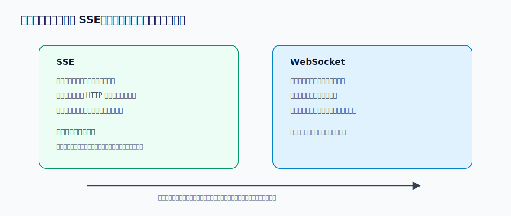
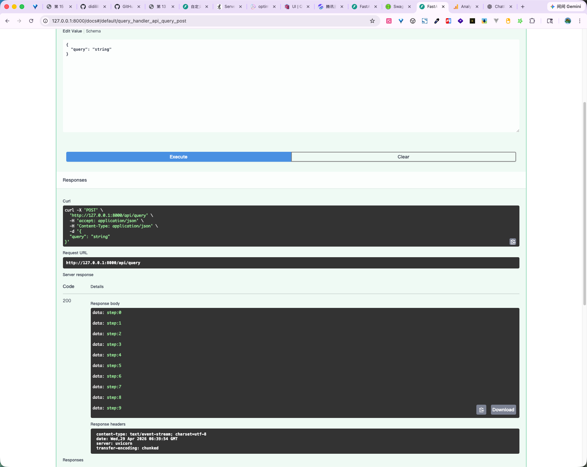
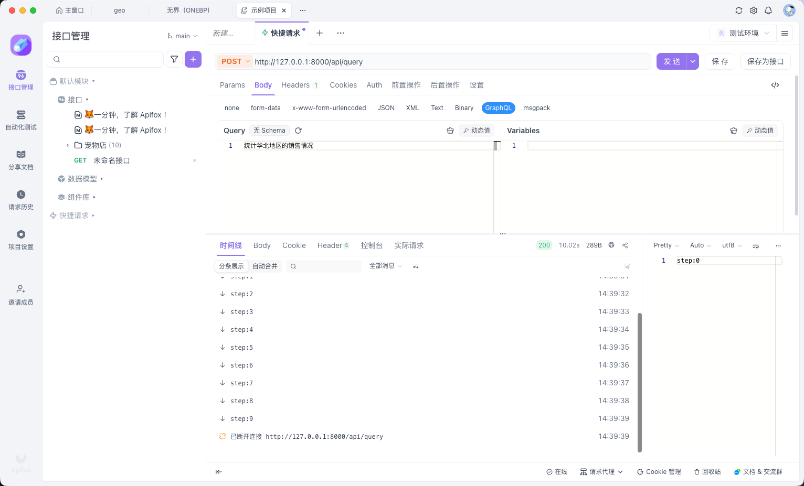

# 15 - 电商问数：API 接口基础与 FastAPI 入门

<!-- TS-TRACK-BANNER -->
> **TypeScript 轨道说明**：中文讲解保留原教程；**代码块使用仓库内真实 TypeScript**（`examples/` / 精校案例 / `apps/shop-query-agent`），不再使用机翻 Python。
> 精校清单：[POLISHED-CASES](POLISHED-CASES.md)


## TypeScript 可运行示例（推荐）

本章优先对照仓库真实文件：`apps/shop-query-agent/lib/agent.ts`

```typescript
// apps/shop-query-agent/lib/agent.ts
import { ChatOpenAI } from "@langchain/openai";
import { z } from "zod";
import { buildSchemaContext, recallMetadata, type RecallHit } from "./metadata";
import { executeSelect, validateSql, type QueryResult } from "./sql-engine";

export type AgentStep = {
  id: string;
  title: string;
  detail: string;
  status: "ok" | "error" | "info";
};

export type AgentResponse = {
  question: string;
  steps: AgentStep[];
  hits: RecallHit[];
  sql: string;
  result: QueryResult | null;
  answer: string;
  error?: string;
};

function createModel() {
  const apiKey = process.env.OPENAI_API_KEY;
  if (!apiKey) {
    throw new Error("缺少 OPENAI_API_KEY，请在 apps/shop-query-agent/.env.local 配置");
  }
  return new ChatOpenAI({
    apiKey,
    model: process.env.OPENAI_MODEL || "qwen-plus",
    temperature: 0,
    configuration: process.env.OPENAI_BASE_URL
      ? { baseURL: process.env.OPENAI_BASE_URL }
      : undefined,
  });
}

const SqlPlanSchema = z.object({
  sql: z.string().describe("Single SELECT statement only"),
  rationale: z.string().describe("Why this SQL answers the question"),
});

function fallbackSql(question: string, hits: RecallHit[]): string {
  const values = hits.filter((h) => h.kind === "value");
  const region = values.find((v) => v.column === "region_name")?.value;
  const brand = values.find((v) => v.column === "brand")?.value;
  const level = values.find((v) => v.column === "member_level")?.value;
  const category = values.find((v) => v.column === "category")?.value;

  const wantsGroupRegion = /地区|大区|区域|华北|华东|华南|西南/.test(question);
  const wantsBrand = /品牌/.test(question) || Boolean(brand);
  const wantsLevel = /会员/.test(question) || Boolean(level);

  if (wantsGroupRegion && !region) {
    return [
      "SELECT dim_region.region_name AS region_name, SUM(fact_order.amount) AS total_amount",
      "FROM fact_order",
      "JOIN dim_region ON fact_order.region_id = dim_region.region_id",
      "WHERE fact_order.status = 'paid'",
      "GROUP BY dim_region.region_name",
      "ORDER BY total_amount DESC",
      "LIMIT 20",
    ].join("\n");
  }

  const where: string[] = ["fact_order.status = 'paid'"];
  if (region) where.push(`dim_region.region_name = '${region}'`);
  if (brand) where.push(`dim_product.brand = '${brand}'`);
  if (level) where.push(`dim_customer.member_level = '${level}'`);
  if (category) where.push(`dim_product.category = '${category}'`);

  if (wantsBrand && region) {
    return [
      "SELECT dim_product.brand AS brand, SUM(fact_order.amount) AS total_amount",
      "FROM fact_order",
      "JOIN dim_product ON fact_order.product_id = dim_product.product_id",
      "JOIN dim_region ON fact_order.region_id = dim_region.region_id",
      `WHERE ${where.join(" AND ")}`,
      "GROUP BY dim_product.brand",
      "ORDER BY total_amount DESC",
      "LIMIT 20",
    ].join("\n");
  }

  if (wantsLevel) {
    return [
      "SELECT dim_customer.member_level AS member_level, SUM(fact_order.amount) AS total_amount, COUNT(fact_order.order_id) AS order_cnt",
      "FROM fact_order",
      "JOIN dim_customer ON fact_order.customer_id = dim_customer.customer_id",
      "JOIN dim_region ON fact_order.region_id = dim_region.region_id",
      "JOIN dim_product ON fact_order.product_id = dim_product.product_id",
      `WHERE ${where.join(" AND ")}`,
      "GROUP BY dim_customer.member_level",
      "ORDER BY total_amount DESC",
      "LIMIT 20",
    ].join("\n");
  }

  return [
    "SELECT SUM(fact_order.amount) AS total_amount, SUM(fact_order.quantity) AS total_qty, COUNT(fact_order.order_id) AS order_cnt",
    "FROM fact_order",
    "JOIN dim_customer ON fact_order.customer_id = dim_customer.customer_id",
    "JOIN dim_product ON fact_order.product_id = dim_product.product_id",
    "JOIN dim_region ON fact_order.region_id = dim_region.region_id",
    `WHERE ${where.join(" AND ")}`,
    "LIMIT 20",
  ].join("\n");
}

async function generateSql(question: string, hits: RecallHit[]): Promise<{ sql: string; rationale: string; usedModel: boolean }> {
  const context = buildSchemaContext(hits);

  try {
    const model = createModel().withStructuredOutput(SqlPlanSchema);
    const plan = await model.invoke([
      [
        "system",
        "你是电商数仓 NL2SQL 助手。只输出一条可执行的 SELECT SQL。不要编造不存在的表或字段。",
      ],
      [
        "human",
        `用户问题：${question}\n\n元数据上下文：\n${context}\n\n请生成 SQL。`,
      ],
    ]);
    return { sql: plan.sql, rationale: plan.rationale, usedModel: true };
  } catch (err) {
    const sql = fallbackSql(question, hits);
    const raw = err instanceof Error ? err.message : String(err);
    const short =
      raw.includes("API key") || raw.includes("401")
        ? "未配置有效 OPENAI_API_KEY，已切换规则兜底 SQL"
        : raw.slice(0, 180);
    return {
      sql,
      rationale: short,
      usedModel: false,
    };
  }
}

function summarize(question: string, result: QueryResult, rationale: string): string {
  if (!result.rows.length) {
    return "查询成功，但没有命中数据。可以尝试放宽地区/品牌/会员条件。";
  }
  const preview = result.rows
    .slice(0, 5)
    .map((r) =>
      Object.entries(r)
        .map(([k, v]) => `${k}=${v}`)
        .join(", "),
    )
    .join("；");
  return `针对「${question}」共返回 ${result.rowCount} 行。${rationale} 示例：${preview}`;
}

export async function runShopQueryAgent(question: string): Promise<AgentResponse> {
  const steps: AgentStep[] = [];
  const q = question.trim();
  if (!q) {
    return {
      question,
      steps: [{ id: "1", title: "校验输入", detail: "问题为空", status: "error" }],
      hits: [],
      sql: "",
      result: null,
      answer: "请输入问题",
      error: "empty_question",
    };
  }

  const hits = recallMetadata(q);
  steps.push({
    id: "recall",
    title: "元数据召回",
    detail: hits.map((h) => `[${h.kind}] ${h.label}`).join(" | "),
    status: "ok",
  });

  const gen = await generateSql(q, hits);
  steps.push({
    id: "codegen",
    title: gen.usedModel ? "LLM 生成 SQL" : "规则兜底 SQL",
    detail: gen.rationale,
    status: "ok",
  });

  let sql = gen.sql.trim();
  try {
    sql = validateSql(sql);
    steps.push({
      id: "validate",
      title: "SQL 校验",
      detail: "通过（仅 SELECT，无危险语句）",
      status: "ok",
    });
  } catch (err) {
    // one repair attempt with fallback
    sql = fallbackSql(q, hits);
    steps.push({
      id: "validate",
      title: "SQL 校验失败，已纠错",
      detail: err instanceof Error ? err.message : String(err),
      status: "info",
    });
  }

  try {
    const result = executeSelect(sql);
    steps.push({
      id: "execute",
      title: "执行 SQL",
      detail: `返回 ${result.rowCount} 行`,
      status: "ok",
    });
    const answer = summarize(q, result, gen.rationale);
    steps.push({
      id: "answer",
      title: "生成结论",
      detail: answer,
      status: "ok",
    });
    return { question: q, steps, hits, sql, result, answer };
  } catch (err) {
    const message = err instanceof Error ? err.message : String(err);
    // final fallback
    try {
      const fb = fallbackSql(q, hits);
      const result = executeSelect(fb);
      steps.push({
        id: "execute",
        title: "执行失败后启用兜底 SQL",
        detail: message,
        status: "info",
      });
      const answer = summarize(q, result, "使用兜底查询");
      return {
        question: q,
        steps,
        hits,
        sql: fb,
        result,
        answer,
      };
    } catch (err2) {
      const msg2 = err2 instanceof Error ? err2.message : String(err2);
      steps.push({
        id: "execute",
        title: "执行 SQL 失败",
        detail: msg2,
        status: "error",
      });
      return {
        question: q,
        steps,
        hits,
        sql,
        result: null,
        answer: "查询失败",
        error: msg2,
      };
    }
  }
}
```

```bash
npx tsx apps/shop-query-agent/lib/agent.ts
```


---

**本章课程目标：**

- 理解为什么问数智能体最后要封装成 HTTP API。
- 搭建一个最小可测试的 `/api/query` 接口。
- 理解普通响应、流式响应和 SSE 协议之间的关系。
- 理解 FastAPI 的三个工程基础：`lifespan`、middleware、`Depends`。
- 为下一章接入真实 `QueryService` 做好准备。

**学习建议：** 这一章先学 API 骨架，不急着接入真实问数工作流。重点看请求怎么进来、响应怎么出去、为什么要流式返回、SSE 每段数据如何约定，以及 FastAPI 的路由、依赖、生命周期分别管什么。把这些基础看清，下一章再接 `QueryService` 时就不会觉得文件关系散。

**对应代码分支：** `15-api-streaming-basics`

**官方文档参考：**

- FastAPI 流式响应：https://fastapi.org.cn/advanced/custom-response/#streamingresponse
- SSE 协议讲解：https://www.ruanyifeng.com/blog/2017/05/server-sent_events.html
- FastAPI 生命周期事件：https://fastapi.org.cn/advanced/events
- FastAPI 中间件：https://fastapi.org.cn/tutorial/middleware
- FastAPI 依赖注入：https://fastapi.org.cn/tutorial/dependencies

---

第 14 章结束后，问数智能体的核心链路已经能在后端内部跑通，但是，到这一步它还不是一个真正的应用。因为现在调用方式更像内部调试：开发者在命令行里运行图，观察日志和输出。真正交付给前端或其他系统时，需要把这条能力封装成一个 HTTP API。

本章只做第一步：先把 API 的基础形态和流式协议讲清楚。真正接入 `QueryService` 会放到下一章。

---

## 1、查询接口要解决什么问题

最终我们需要一个查询接口，接收前端提交的自然语言问题：

```json
{
  "query": "统计华北地区的销售总额"
}
```

后端收到问题后，要调用前面已经搭好的 LangGraph 问数智能体，并把执行过程持续返回给前端。

这个接口至少要满足四个要求：

| 要求           | 说明                                 |
| -------------- | ------------------------------------ |
| 接收用户问题   | 前端通过请求体传入 `query`           |
| 执行问数工作流 | 后端调用 `graph.astream(...)`        |
| 实时返回进度   | 每执行到关键节点，就把进度推给前端   |
| 返回最终结果   | SQL 执行完成后，把查询结果返回给前端 |

这里最关键的是“实时返回进度”。问数智能体不是普通 CRUD 接口，它中间会经过多个步骤。如果后端等所有节点都执行完再一次性返回，用户只能看到页面一直转圈，不知道系统是在正常执行、卡住了，还是已经失败了。

更好的体验是：

```text
正在抽取关键词...
正在召回字段信息...
正在召回指标信息...
正在生成 SQL...
正在执行 SQL...
查询完成
```

这就是本章要引出的第一个核心概念：**流式响应**。

---

## 2、先搭一个最小 FastAPI 接口

FastAPI 是一个用于构建 API 服务的 Python Web 框架。简单说，它负责把 Python 函数暴露成 HTTP 接口，让前端、Apifox、Postman 或其他业务系统可以通过 URL 调用后端能力。

一个最小 FastAPI 应用大概长这样：

```typescript
// Real TypeScript from repo: apps/shop-query-agent/lib/agent.ts
import { ChatOpenAI } from "@langchain/openai";
import { z } from "zod";
import { buildSchemaContext, recallMetadata, type RecallHit } from "./metadata";
import { executeSelect, validateSql, type QueryResult } from "./sql-engine";

export type AgentStep = {
  id: string;
  title: string;
  detail: string;
  status: "ok" | "error" | "info";
};

export type AgentResponse = {
  question: string;
  steps: AgentStep[];
  hits: RecallHit[];
  sql: string;
  result: QueryResult | null;
  answer: string;
  error?: string;
};

function createModel() {
  const apiKey = process.env.OPENAI_API_KEY;
  if (!apiKey) {
    throw new Error("缺少 OPENAI_API_KEY，请在 apps/shop-query-agent/.env.local 配置");
  }
  return new ChatOpenAI({
    apiKey,
    model: process.env.OPENAI_MODEL || "qwen-plus",
    temperature: 0,
    configuration: process.env.OPENAI_BASE_URL
      ? { baseURL: process.env.OPENAI_BASE_URL }
      : undefined,
  });
}

const SqlPlanSchema = z.object({
  sql: z.string().describe("Single SELECT statement only"),
  rationale: z.string().describe("Why this SQL answers the question"),
});

function fallbackSql(question: string, hits: RecallHit[]): string {
  const values = hits.filter((h) => h.kind === "value");
  const region = values.find((v) => v.column === "region_name")?.value;
  const brand = values.find((v) => v.column === "brand")?.value;
  const level = values.find((v) => v.column === "member_level")?.value;
  const category = values.find((v) => v.column === "category")?.value;

  const wantsGroupRegion = /地区|大区|区域|华北|华东|华南|西南/.test(question);
  const wantsBrand = /品牌/.test(question) || Boolean(brand);
  const wantsLevel = /会员/.test(question) || Boolean(level);

  if (wantsGroupRegion && !region) {
    return [
      "SELECT dim_region.region_name AS region_name, SUM(fact_order.amount) AS total_amount",
      "FROM fact_order",
      "JOIN dim_region ON fact_order.region_id = dim_region.region_id",
      "WHERE fact_order.status = 'paid'",
      "GROUP BY dim_region.region_name",
      "ORDER BY total_amount DESC",
      "LIMIT 20",
    ].join("\n");
  }

  const where: string[] = ["fact_order.status = 'paid'"];
  if (region) where.push(`dim_region.region_name = '${region}'`);
  if (brand) where.push(`dim_product.brand = '${brand}'`);
  if (level) where.push(`dim_customer.member_level = '${level}'`);
  if (category) where.push(`dim_product.category = '${category}'`);

  if (wantsBrand && region) {
    return [
      "SELECT dim_product.brand AS brand, SUM(fact_order.amount) AS total_amount",
      "FROM fact_order",
      "JOIN dim_product ON fact_order.product_id = dim_product.product_id",
      "JOIN dim_region ON fact_order.region_id = dim_region.region_id",
      `WHERE ${where.join(" AND ")}`,
      "GROUP BY dim_product.brand",
      "ORDER BY total_amount DESC",
      "LIMIT 20",
    ].join("\n");
  }

  if (wantsLevel) {
    return [
      "SELECT dim_customer.member_level AS member_level, SUM(fact_order.amount) AS total_amount, COUNT(fact_order.order_id) AS order_cnt",
      "FROM fact_order",
      "JOIN dim_customer ON fact_order.customer_id = dim_customer.customer_id",
      "JOIN dim_region ON fact_order.region_id = dim_region.region_id",
      "JOIN dim_product ON fact_order.product_id = dim_product.product_id",
      `WHERE ${where.join(" AND ")}`,
      "GROUP BY dim_customer.member_level",
      "ORDER BY total_amount DESC",
      "LIMIT 20",
    ].join("\n");
  }

  return [
    "SELECT SUM(fact_order.amount) AS total_amount, SUM(fact_order.quantity) AS total_qty, COUNT(fact_order.order_id) AS order_cnt",
    "FROM fact_order",
    "JOIN dim_customer ON fact_order.customer_id = dim_customer.customer_id",
    "JOIN dim_product ON fact_order.product_id = dim_product.product_id",
    "JOIN dim_region ON fact_order.region_id = dim_region.region_id",
    `WHERE ${where.join(" AND ")}`,
    "LIMIT 20",
  ].join("\n");
}

async function generateSql(question: string, hits: RecallHit[]): Promise<{ sql: string; rationale: string; usedModel: boolean }> {
  const context = buildSchemaContext(hits);

  try {
    const model = createModel().withStructuredOutput(SqlPlanSchema);
    const plan = await model.invoke([
      [
        "system",
        "你是电商数仓 NL2SQL 助手。只输出一条可执行的 SELECT SQL。不要编造不存在的表或字段。",
      ],
      [
        "human",
        `用户问题：${question}\n\n元数据上下文：\n${context}\n\n请生成 SQL。`,
      ],
    ]);
    return { sql: plan.sql, rationale: plan.rationale, usedModel: true };
  } catch (err) {
    const sql = fallbackSql(question, hits);
    const raw = err instanceof Error ? err.message : String(err);
    const short =
      raw.includes("API key") || raw.includes("401")
        ? "未配置有效 OPENAI_API_KEY，已切换规则兜底 SQL"
        : raw.slice(0, 180);
    return {
      sql,
      rationale: short,
      usedModel: false,
    };
  }
}

function summarize(question: string, result: QueryResult, rationale: string): string {
  if (!result.rows.length) {
    return "查询成功，但没有命中数据。可以尝试放宽地区/品牌/会员条件。";
  }
  const preview = result.rows
    .slice(0, 5)
    .map((r) =>
      Object.entries(r)
        .map(([k, v]) => `${k}=${v}`)
        .join(", "),
    )
    .join("；");
  return `针对「${question}」共返回 ${result.rowCount} 行。${rationale} 示例：${preview}`;
}

export async function runShopQueryAgent(question: string): Promise<AgentResponse> {
  const steps: AgentStep[] = [];
  const q = question.trim();
  if (!q) {
    return {
      question,
      steps: [{ id: "1", title: "校验输入", detail: "问题为空", status: "error" }],
      hits: [],
      sql: "",
      result: null,
      answer: "请输入问题",
      error: "empty_question",
    };
  }

  const hits = recallMetadata(q);
  steps.push({
    id: "recall",
    title: "元数据召回",
    detail: hits.map((h) => `[${h.kind}] ${h.label}`).join(" | "),
    status: "ok",
  });

  const gen = await generateSql(q, hits);
  steps.push({
    id: "codegen",
    title: gen.usedModel ? "LLM 生成 SQL" : "规则兜底 SQL",
    detail: gen.rationale,
    status: "ok",
  });

  let sql = gen.sql.trim();
  try {
    sql = validateSql(sql);
    steps.push({
      id: "validate",
      title: "SQL 校验",
      detail: "通过（仅 SELECT，无危险语句）",
      status: "ok",
    });
  } catch (err) {
    // one repair attempt with fallback
    sql = fallbackSql(q, hits);
    steps.push({
      id: "validate",
      title: "SQL 校验失败，已纠错",
      detail: err instanceof Error ? err.message : String(err),
      status: "info",
    });
  }

  try {
    const result = executeSelect(sql);
    steps.push({
      id: "execute",
      title: "执行 SQL",
      detail: `返回 ${result.rowCount} 行`,
      status: "ok",
    });
    const answer = summarize(q, result, gen.rationale);
    steps.push({
      id: "answer",
      title: "生成结论",
      detail: answer,
      status: "ok",
    });
    return { question: q, steps, hits, sql, result, answer };
  } catch (err) {
    const message = err instanceof Error ? err.message : String(err);
    // final fallback
    try {
      const fb = fallbackSql(q, hits);
      const result = executeSelect(fb);
      steps.push({
        id: "execute",
        title: "执行失败后启用兜底 SQL",
        detail: message,
        status: "info",
      });
      const answer = summarize(q, result, "使用兜底查询");
      return {
        question: q,
        steps,
        hits,
        sql: fb,
        result,
        answer,
      };
    } catch (err2) {
      const msg2 = err2 instanceof Error ? err2.message : String(err2);
      steps.push({
        id: "execute",
        title: "执行 SQL 失败",
        detail: msg2,
        status: "error",
      });
      return {
        question: q,
        steps,
        hits,
        sql,
        result: null,
        answer: "查询失败",
        error: msg2,
      };
    }
  }
}
```

这里有三个关键信息：

| 代码                      | 含义                            |
| ------------------------- | ------------------------------- |
| `app = FastAPI()`         | 创建 FastAPI 应用实例           |
| `@app.get("/health")`     | 声明一个 GET 接口               |
| `return {"status": "ok"}` | 返回字典，FastAPI 自动转成 JSON |

本项目不会把所有接口都堆在 `main.py` 里，而是先按下面的结构拆开：

```text
shopkeeper-agent/
├─ main.py
└─ app/
   └─ api/
      ├─ routers/
      │  └─ query_router.py
      └─ schemas/
         └─ query_schema.py
```

| 文件              | 职责                              |
| ----------------- | --------------------------------- |
| `main.py`         | 创建 FastAPI 应用，并挂载路由     |
| `query_router.py` | 定义查询接口，例如 `/api/query`   |
| `query_schema.py` | 定义请求体结构，例如 `query: str` |

### 2.1 定义请求体 QuerySchema

项目对应文件路径：`shopkeeper-agent/app/api/schemas/query_schema.py`

```typescript
// Real TypeScript from repo: apps/shop-query-agent/lib/metadata.ts
/**
 * Metadata knowledge base (simplified).
 * Real project: MySQL meta + Qdrant + ES.
 * Demo: in-memory field/metric catalog + keyword/value map.
 */

export type FieldMeta = {
  table: string;
  column: string;
  role: "metric" | "dimension" | "id" | "time" | "status";
  aliases: string[];
  description: string;
  sampleValues?: string[];
};

export type MetricMeta = {
  name: string;
  expression: string;
  aliases: string[];
  description: string;
};

export const fieldCatalog: FieldMeta[] = [
  {
    table: "fact_order",
    column: "amount",
    role: "metric",
    aliases: ["销售额", "成交额", "销售总额", "金额", "GMV"],
    description: "订单成交金额",
  },
  {
    table: "fact_order",
    column: "quantity",
    role: "metric",
    aliases: ["销量", "数量", "件数"],
    description: "订单商品数量",
  },
  {
    table: "fact_order",
    column: "order_date",
    role: "time",
    aliases: ["日期", "下单日期", "时间"],
    description: "订单日期 YYYY-MM-DD",
  },
  {
    table: "fact_order",
    column: "status",
    role: "status",
    aliases: ["订单状态", "状态"],
    description: "paid / refunded / pending",
    sampleValues: ["paid", "refunded", "pending"],
  },
  {
    table: "dim_region",
    column: "region_name",
    role: "dimension",
    aliases: ["地区", "大区", "区域"],
    description: "销售大区",
    sampleValues: ["华北", "华东", "华南", "西南"],
  },
  {
    table: "dim_product",
    column: "brand",
    role: "dimension",
    aliases: ["品牌"],
    description: "商品品牌",
    sampleValues: ["苹果", "华为", "小米"],
  },
  {
    table: "dim_product",
    column: "category",
    role: "dimension",
    aliases: ["品类", "类目"],
    description: "商品品类",
    sampleValues: ["手机", "耳机"],
  },
  {
    table: "dim_customer",
    column: "member_level",
    role: "dimension",
    aliases: ["会员", "会员等级", "等级"],
    description: "会员等级",
    sampleValues: ["普通", "黄金", "钻石"],
  },
  {
    table: "dim_customer",
    column: "city",
    role: "dimension",
    aliases: ["城市"],
    description: "客户城市",
    sampleValues: ["北京", "上海", "杭州", "深圳", "成都"],
  },
];

export const metricCatalog: MetricMeta[] = [
  {
    name: "销售总额",
    expression: "SUM(fact_order.amount)",
    aliases: ["销售额", "成交总额", "GMV", "总销售额"],
    description: "订单金额合计（默认仅 paid）",
  },
  {
    name: "订单量",
    expression: "COUNT(DISTINCT fact_order.order_id)",
    aliases: ["订单数", "单量"],
    description: "订单数",
  },
  {
    name: "销售件数",
    expression: "SUM(fact_order.quantity)",
    aliases: ["销量", "件数"],
    description: "销售件数合计",
  },
];

export type RecallHit = {
  kind: "field" | "metric" | "value";
  score: number;
  label: string;
  detail: string;
  table?: string;
  column?: string;
  value?: string;
};

function includesAny(text: string, words: string[]) {
  return words.some((w) => text.includes(w));
}

/** Multi-path recall: fields / metrics / values from natural language. */
export function recallMetadata(question: string): RecallHit[] {
  const q = question.trim();
  const hits: RecallHit[] = [];

  for (const m of metricCatalog) {
    const keys = [m.name, ...m.aliases];
    if (includesAny(q, keys)) {
      hits.push({
        kind: "metric",
        score: 3,
        label: m.name,
        detail: `${m.expression} | ${m.description}`,
      });
    }
  }

  for (const f of fieldCatalog) {
    const keys = [f.column, ...f.aliases];
    if (includesAny(q, keys)) {
      hits.push({
        kind: "field",
        score: 2,
        label: `${f.table}.${f.column}`,
        detail: `${f.role} | ${f.description}`,
        table: f.table,
        column: f.column,
      });
    }
    for (const v of f.sampleValues ?? []) {
      if (q.includes(v)) {
        hits.push({
          kind: "value",
          score: 4,
          label: `${f.table}.${f.column} = ${v}`,
          detail: `命中字段取值「${v}」`,
          table: f.table,
          column: f.column,
          value: v,
        });
      }
    }
  }

  // defaults if nothing matched
  if (!hits.some((h) => h.kind === "metric")) {
    hits.push({
      kind: "metric",
      score: 1,
      label: "销售总额",
      detail: "SUM(fact_order.amount) | 默认指标",
    });
  }

  hits.sort((a, b) => b.score - a.score);
  // de-dup by label
  const seen = new Set<string>();
  return hits.filter((h) => {
    if (seen.has(h.label)) return false;
    seen.add(h.label);
    return true;
  });
}

export function buildSchemaContext(hits: RecallHit[]): string {
  const fields = fieldCatalog
    .map(
      (f) =>
        `- ${f.table}.${f.column} (${f.role}) aliases=${f.aliases.join("/")}; ${f.description}`,
    )
    .join("\n");
  const metrics = metricCatalog
    .map((m) => `- ${m.name}: ${m.expression}; aliases=${m.aliases.join("/")}`)
    .join("\n");
  const hitText = hits
    .map((h) => `- [${h.kind}] ${h.label}: ${h.detail}`)
    .join("\n");

  return [
    "可用表：fact_order, dim_customer, dim_product, dim_region",
    "关联键：fact_order.customer_id=dim_customer.customer_id; fact_order.product_id=dim_product.product_id; fact_order.region_id=dim_region.region_id",
    "字段目录：",
    fields,
    "指标目录：",
    metrics,
    "本问题召回命中：",
    hitText,
    "SQL 规则：只写 SELECT；默认 status='paid'；表名列名必须来自目录；可用 GROUP BY；limit <= 50。",
  ].join("\n");
}
```

`QuerySchema` 的作用是告诉 FastAPI：当前接口的请求体里应该有一个字符串字段 `query`。

当前端发送：

```json
{
  "query": "统计华北地区的销售总额"
}
```

路由函数里就可以通过 `query.query` 取出用户问题。这里两个 `query` 含义不同：

```text
第一个 query：函数参数名，是 QuerySchema 对象
第二个 query：请求体字段名，是用户问题字符串
```

### 2.2 创建查询路由 query_router

项目对应文件路径：`shopkeeper-agent/app/api/routers/query_router.py`

本章先用 `fake_streamer()` 模拟流式输出，不接入真实问数智能体：

```typescript
// Real TypeScript from repo: apps/shop-query-agent/lib/sql-engine.ts
/**
 * Extremely small SQL executor for teaching demos.
 * Supports a subset of SELECT ... FROM ... JOIN ... WHERE ... GROUP BY ... ORDER BY ... LIMIT
 * against the in-memory warehouse.
 */
import {
  dim_customer,
  dim_product,
  dim_region,
  fact_order,
  type CustomerRow,
  type OrderRow,
  type ProductRow,
  type RegionRow,
} from "./warehouse";

type JoinedRow = OrderRow & {
  customer_name: string;
  member_level: string;
  city: string;
  product_name: string;
  brand: string;
  category: string;
  region_name: string;
  province: string;
};

function buildJoined(): JoinedRow[] {
  const cMap = new Map(dim_customer.map((c) => [c.customer_id, c]));
  const pMap = new Map(dim_product.map((p) => [p.product_id, p]));
  const rMap = new Map(dim_region.map((r) => [r.region_id, r]));

  return fact_order.map((o) => {
    const c = cMap.get(o.customer_id) as CustomerRow;
    const p = pMap.get(o.product_id) as ProductRow;
    const r = rMap.get(o.region_id) as RegionRow;
    return {
      ...o,
      customer_name: c.name,
      member_level: c.member_level,
      city: c.city,
      product_name: p.product_name,
      brand: p.brand,
      category: p.category,
      region_name: r.region_name,
      province: r.province,
    };
  });
}

const FIELD_GETTERS: Record<string, (row: JoinedRow) => string | number> = {
  order_id: (r) => r.order_id,
  order_date: (r) => r.order_date,
  customer_id: (r) => r.customer_id,
  product_id: (r) => r.product_id,
  region_id: (r) => r.region_id,
  quantity: (r) => r.quantity,
  amount: (r) => r.amount,
  status: (r) => r.status,
  name: (r) => r.customer_name,
  customer_name: (r) => r.customer_name,
  member_level: (r) => r.member_level,
  city: (r) => r.city,
  product_name: (r) => r.product_name,
  brand: (r) => r.brand,
  category: (r) => r.category,
  region_name: (r) => r.region_name,
  province: (r) => r.province,
  "fact_order.amount": (r) => r.amount,
  "fact_order.quantity": (r) => r.quantity,
  "fact_order.status": (r) => r.status,
  "fact_order.order_date": (r) => r.order_date,
  "dim_region.region_name": (r) => r.region_name,
  "dim_product.brand": (r) => r.brand,
  "dim_product.category": (r) => r.category,
  "dim_customer.member_level": (r) => r.member_level,
  "dim_customer.city": (r) => r.city,
};

function normalizeIdent(raw: string) {
  return raw.replace(/["'`]/g, "").trim();
}

function getField(row: JoinedRow, ident: string) {
  const key = normalizeIdent(ident);
  const simple = key.includes(".") ? key.split(".").pop()! : key;
  const getter =
    FIELD_GETTERS[key] ||
    FIELD_GETTERS[simple] ||
    FIELD_GETTERS[key.toLowerCase()];
  if (!getter) throw new Error(`未知字段: ${ident}`);
  return getter(row);
}

type WhereCond =
  | { type: "eq" | "ne" | "gt" | "gte" | "lt" | "lte"; left: string; right: string }
  | { type: "like"; left: string; right: string }
  | { type: "and" | "or"; items: WhereCond[] };

function parseValue(token: string): string {
  const t = token.trim();
  if (
    (t.startsWith("'") && t.endsWith("'")) ||
    (t.startsWith('"') && t.endsWith('"'))
  ) {
    return t.slice(1, -1);
  }
  return t;
}

function parseWhere(expr: string): WhereCond {
  const orParts = splitTopLevel(expr, " OR ");
  if (orParts.length > 1) {
    return { type: "or", items: orParts.map(parseWhere) };
  }
  const andParts = splitTopLevel(expr, " AND ");
  if (andParts.length > 1) {
    return { type: "and", items: andParts.map(parseWhere) };
  }

  const like = expr.match(/^(.+?)\s+LIKE\s+(.+)$/i);
  if (like) {
    return {
      type: "like",
      left: normalizeIdent(like[1]),
      right: parseValue(like[2]),
    };
  }

  const ops: Array<[RegExp, WhereCond["type"]]> = [
    [/^(.+?)\s*>=\s*(.+)$/, "gte"],
    [/^(.+?)\s*<=\s*(.+)$/, "lte"],
    [/^(.+?)\s*!=\s*(.+)$/, "ne"],
    [/^(.+?)\s*<>\s*(.+)$/, "ne"],
    [/^(.+?)\s*>\s*(.+)$/, "gt"],
    [/^(.+?)\s*<\s*(.+)$/, "lt"],
    [/^(.+?)\s*=\s*(.+)$/, "eq"],
  ];
  for (const [re, type] of ops) {
    const m = expr.match(re);
    if (m) {
      return {
        type: type as "eq",
        left: normalizeIdent(m[1]),
        right: parseValue(m[2]),
      };
    }
  }
  throw new Error(`无法解析 WHERE 条件: ${expr}`);
}

function splitTopLevel(input: string, sep: string): string[] {
  const parts: string[] = [];
  let depth = 0;
  let buf = "";
  for (let i = 0; i < input.length; i++) {
    const ch = input[i];
    if (ch === "(") depth++;
    if (ch === ")") depth = Math.max(0, depth - 1);
    if (depth === 0 && input.slice(i, i + sep.length).toUpperCase() === sep) {
      parts.push(buf.trim());
      buf = "";
      i += sep.length - 1;
      continue;
    }
    buf += ch;
  }
  if (buf.trim()) parts.push(buf.trim());
  return parts;
}

function isLogicCond(cond: WhereCond): cond is { type: "and" | "or"; items: WhereCond[] } {
  return cond.type === "and" || cond.type === "or";
}

function evalWhere(row: JoinedRow, cond: WhereCond): boolean {
  if (isLogicCond(cond)) {
    if (cond.type === "and") return cond.items.every((c) => evalWhere(row, c));
    return cond.items.some((c) => evalWhere(row, c));
  }

  const left = getField(row, cond.left);
  if (cond.type === "like") {
    const pattern = cond.right.replace(/%/g, ".*");
    return new RegExp(`^${pattern}$`, "i").test(String(left));
  }

  const rightRaw = cond.right;
  const rightNum = Number(rightRaw);
  const leftNum = Number(left);
  const bothNum = !Number.isNaN(rightNum) && !Number.isNaN(leftNum);
  switch (cond.type) {
    case "eq":
      return bothNum ? leftNum === rightNum : String(left) === rightRaw;
    case "ne":
      return bothNum ? leftNum !== rightNum : String(left) !== rightRaw;
    case "gt":
      return leftNum > rightNum;
    case "gte":
      return leftNum >= rightNum;
    case "lt":
      return leftNum < rightNum;
    case "lte":
      return leftNum <= rightNum;
    default:
      return false;
  }
}

type SelectItem =
  | { kind: "field"; expr: string; alias: string }
  | { kind: "agg"; fn: "sum" | "count" | "avg" | "max" | "min"; expr: string; alias: string };

function parseSelectList(selectSql: string): SelectItem[] {
  return selectSql.split(",").map((raw) => {
    const part = raw.trim();
    const aliasMatch = part.match(/\s+AS\s+([a-zA-Z_][\w]*)$/i);
    const alias = aliasMatch ? aliasMatch[1] : "";
    const expr = aliasMatch ? part.slice(0, aliasMatch.index).trim() : part;

    const agg = expr.match(/^(SUM|COUNT|AVG|MAX|MIN)\s*\(\s*(.+?)\s*\)$/i);
    if (agg) {
      const fn = agg[1].toLowerCase() as SelectItem & { kind: "agg" } extends never
        ? never
        : "sum";
      const inner = agg[2].trim();
      const autoAlias =
        alias ||
        `${agg[1].toLowerCase()}_${normalizeIdent(inner).replace(/\W+/g, "_")}`;
      return {
        kind: "agg",
        fn: agg[1].toLowerCase() as "sum",
        expr: inner,
        alias: autoAlias,
      };
    }

    return {
      kind: "field",
      expr,
      alias: alias || normalizeIdent(expr).split(".").pop()!,
    };
  });
}

export type QueryResult = {
  columns: string[];
  rows: Array<Record<string, string | number | null>>;
  rowCount: number;
};

export function validateSql(sql: string): string {
  const cleaned = sql.trim().replace(/;+\s*$/, "");
  if (!/^\s*SELECT\s+/i.test(cleaned)) {
    throw new Error("仅允许 SELECT 查询");
  }
  if (/\b(INSERT|UPDATE|DELETE|DROP|ALTER|TRUNCATE|ATTACH|PRAGMA)\b/i.test(cleaned)) {
    throw new Error("检测到危险语句，已拒绝执行");
  }
  if (!/\bFROM\b/i.test(cleaned)) {
    throw new Error("SQL 缺少 FROM");
  }
  return cleaned;
}

export function executeSelect(sql: string): QueryResult {
  const cleaned = validateSql(sql);
  const selectMatch = cleaned.match(
    /^\s*SELECT\s+([\s\S]+?)\s+FROM\s+([\s\S]+)$/i,
  );
  if (!selectMatch) throw new Error("无法解析 SELECT/FROM");

  const selectList = selectMatch[1].trim();
  let rest = selectMatch[2].trim();

  // strip joins textually; demo always uses pre-joined universe
  rest = rest.replace(
    /\b(?:INNER\s+|LEFT\s+|RIGHT\s+)?JOIN\b[\s\S]*?(?=\bWHERE\b|\bGROUP\s+BY\b|\bORDER\s+BY\b|\bLIMIT\b|$)/gi,
    " ",
  );

  let whereSql = "";
  let groupSql = "";
  let orderSql = "";
  let limit = 50;

  const limitMatch = rest.match(/\bLIMIT\s+(\d+)\s*$/i);
  if (limitMatch) {
    limit = Math.min(50, Number(limitMatch[1]));
    rest = rest.slice(0, limitMatch.index).trim();
  }

  const orderMatch = rest.match(/\bORDER\s+BY\s+([\s\S]+)$/i);
  if (orderMatch) {
    orderSql = orderMatch[1].trim();
    rest = rest.slice(0, orderMatch.index).trim();
  }

  const groupMatch = rest.match(/\bGROUP\s+BY\s+([\s\S]+)$/i);
  if (groupMatch) {
    groupSql = groupMatch[1].trim();
    rest = rest.slice(0, groupMatch.index).trim();
  }

  const whereMatch = rest.match(/\bWHERE\s+([\s\S]+)$/i);
  if (whereMatch) {
    whereSql = whereMatch[1].trim();
    rest = rest.slice(0, whereMatch.index).trim();
  }

  void rest; // from clause ignored after join strip (single joined table universe)

  let rows = buildJoined();
  if (whereSql) {
    const cond = parseWhere(whereSql);
    rows = rows.filter((r) => evalWhere(r, cond));
  }

  const items = parseSelectList(selectList);
  const hasAgg = items.some((i) => i.kind === "agg");

  if (hasAgg || groupSql) {
    const groupKeys = groupSql
      ? groupSql.split(",").map((g) => normalizeIdent(g))
      : [];
    const groups = new Map<string, JoinedRow[]>();
    for (const row of rows) {
      const key =
        groupKeys.length === 0
          ? "__all__"
          : groupKeys.map((k) => String(getField(row, k))).join("||");
      const list = groups.get(key) ?? [];
      list.push(row);
      groups.set(key, list);
    }

    const out: Array<Record<string, string | number | null>> = [];
    for (const [, groupRows] of groups) {
      const obj: Record<string, string | number | null> = {};
      for (const item of items) {
        if (item.kind === "field") {
          obj[item.alias] = getField(groupRows[0], item.expr) as string | number
// ... truncated; see full file in repository ...
```

这段代码先抓住两点。

第一，`APIRouter` 用来组织一组接口。虽然当前只有一个查询接口，也先放进 `query_router`，后续接口变多时不至于全部挤在 `main.py` 里。

第二，`fake_streamer()` 是一个异步生成器。它不是一次性 `return` 一个完整结果，而是每隔 1 秒 `yield` 一段内容。下一章接入真实智能体时，会把它替换成 `QueryService.query(...)`。

### 2.3 在 main.py 中挂载路由

项目对应文件路径：`shopkeeper-agent/main.py`

```typescript
// Real TypeScript from repo: apps/shop-query-agent/lib/warehouse.ts
/**
 * Teaching warehouse (MySQL-like) in memory.
 * Mirrors 电商问数 fact/dim tables at small scale.
 */

export type OrderRow = {
  order_id: string;
  order_date: string;
  customer_id: string;
  product_id: string;
  region_id: string;
  quantity: number;
  amount: number;
  status: "paid" | "refunded" | "pending";
};

export type CustomerRow = {
  customer_id: string;
  name: string;
  member_level: "普通" | "黄金" | "钻石";
  city: string;
};

export type ProductRow = {
  product_id: string;
  product_name: string;
  brand: string;
  category: string;
  unit_price: number;
};

export type RegionRow = {
  region_id: string;
  region_name: string;
  province: string;
};

export const dim_customer: CustomerRow[] = [
  { customer_id: "C001", name: "张三", member_level: "黄金", city: "北京" },
  { customer_id: "C002", name: "李四", member_level: "普通", city: "上海" },
  { customer_id: "C003", name: "王五", member_level: "钻石", city: "杭州" },
  { customer_id: "C004", name: "赵六", member_level: "黄金", city: "深圳" },
  { customer_id: "C005", name: "钱七", member_level: "普通", city: "成都" },
];

export const dim_product: ProductRow[] = [
  {
    product_id: "P001",
    product_name: "iPhone 15",
    brand: "苹果",
    category: "手机",
    unit_price: 5999,
  },
  {
    product_id: "P002",
    product_name: "Mate 60",
    brand: "华为",
    category: "手机",
    unit_price: 5499,
  },
  {
    product_id: "P003",
    product_name: "小米14",
    brand: "小米",
    category: "手机",
    unit_price: 3999,
  },
  {
    product_id: "P004",
    product_name: "AirPods Pro",
    brand: "苹果",
    category: "耳机",
    unit_price: 1899,
  },
  {
    product_id: "P005",
    product_name: "Redmi Buds",
    brand: "小米",
    category: "耳机",
    unit_price: 299,
  },
];

export const dim_region: RegionRow[] = [
  { region_id: "R01", region_name: "华北", province: "北京" },
  { region_id: "R02", region_name: "华东", province: "上海" },
  { region_id: "R03", region_name: "华南", province: "广东" },
  { region_id: "R04", region_name: "西南", province: "四川" },
];

export const fact_order: OrderRow[] = [
  {
    order_id: "O1001",
    order_date: "2026-01-05",
    customer_id: "C001",
    product_id: "P001",
    region_id: "R01",
    quantity: 1,
    amount: 5999,
    status: "paid",
  },
  {
    order_id: "O1002",
    order_date: "2026-01-08",
    customer_id: "C002",
    product_id: "P003",
    region_id: "R02",
    quantity: 2,
    amount: 7998,
    status: "paid",
  },
  {
    order_id: "O1003",
    order_date: "2026-01-12",
    customer_id: "C003",
    product_id: "P002",
    region_id: "R02",
    quantity: 1,
    amount: 5499,
    status: "paid",
  },
  {
    order_id: "O1004",
    order_date: "2026-02-03",
    customer_id: "C004",
    product_id: "P004",
    region_id: "R03",
    quantity: 1,
    amount: 1899,
    status: "paid",
  },
  {
    order_id: "O1005",
    order_date: "2026-02-10",
    customer_id: "C001",
    product_id: "P005",
    region_id: "R01",
    quantity: 3,
    amount: 897,
    status: "paid",
  },
  {
    order_id: "O1006",
    order_date: "2026-02-18",
    customer_id: "C005",
    product_id: "P001",
    region_id: "R04",
    quantity: 1,
    amount: 5999,
    status: "refunded",
  },
  {
    order_id: "O1007",
    order_date: "2026-03-01",
    customer_id: "C003",
    product_id: "P004",
    region_id: "R02",
    quantity: 2,
    amount: 3798,
    status: "paid",
  },
  {
    order_id: "O1008",
    order_date: "2026-03-11",
    customer_id: "C004",
    product_id: "P002",
    region_id: "R03",
    quantity: 1,
    amount: 5499,
    status: "paid",
  },
  {
    order_id: "O1009",
    order_date: "2026-03-20",
    customer_id: "C002",
    product_id: "P005",
    region_id: "R02",
    quantity: 4,
    amount: 1196,
    status: "paid",
  },
  {
    order_id: "O1010",
    order_date: "2026-04-02",
    customer_id: "C001",
    product_id: "P003",
    region_id: "R01",
    quantity: 1,
    amount: 3999,
    status: "paid",
  },
];

export const tables = {
  fact_order,
  dim_customer,
  dim_product,
  dim_region,
} as const;

export type TableName = keyof typeof tables;
```

`app.include_router(query_router)` 很关键。如果只在 `query_router.py` 里定义了接口，但没有挂载到 `app` 上，FastAPI 应用并不知道这个路由存在。打开 `/docs` 时，也看不到 `/api/query`。

---

## 3、为什么查询接口要用流式响应

普通 HTTP 接口通常是这样的：

```text
客户端发起请求
  -> 服务端处理完整逻辑
  -> 服务端一次性返回响应
```

如果用 Python 类比，普通响应更像 `return`：

```typescript
// Real TypeScript from repo: apps/shop-query-agent/app/api/query/route.ts
import { NextResponse } from "next/server";
import { runShopQueryAgent } from "@/lib/agent";

export const runtime = "nodejs";

export async function POST(req: Request) {
  try {
    const body = (await req.json()) as { question?: string };
    const question = body.question?.trim() ?? "";
    if (!question) {
      return NextResponse.json({ error: "question is required" }, { status: 400 });
    }
    const result = await runShopQueryAgent(question);
    return NextResponse.json(result);
  } catch (err) {
    const message = err instanceof Error ? err.message : String(err);
    return NextResponse.json({ error: message }, { status: 500 });
  }
}
```

它的特点是：必须等所有逻辑执行完，客户端才能拿到响应。

流式响应更像 `yield`：

```typescript
// Real TypeScript from repo: apps/shop-query-agent/lib/agent.ts
import { ChatOpenAI } from "@langchain/openai";
import { z } from "zod";
import { buildSchemaContext, recallMetadata, type RecallHit } from "./metadata";
import { executeSelect, validateSql, type QueryResult } from "./sql-engine";

export type AgentStep = {
  id: string;
  title: string;
  detail: string;
  status: "ok" | "error" | "info";
};

export type AgentResponse = {
  question: string;
  steps: AgentStep[];
  hits: RecallHit[];
  sql: string;
  result: QueryResult | null;
  answer: string;
  error?: string;
};

function createModel() {
  const apiKey = process.env.OPENAI_API_KEY;
  if (!apiKey) {
    throw new Error("缺少 OPENAI_API_KEY，请在 apps/shop-query-agent/.env.local 配置");
  }
  return new ChatOpenAI({
    apiKey,
    model: process.env.OPENAI_MODEL || "qwen-plus",
    temperature: 0,
    configuration: process.env.OPENAI_BASE_URL
      ? { baseURL: process.env.OPENAI_BASE_URL }
      : undefined,
  });
}

const SqlPlanSchema = z.object({
  sql: z.string().describe("Single SELECT statement only"),
  rationale: z.string().describe("Why this SQL answers the question"),
});

function fallbackSql(question: string, hits: RecallHit[]): string {
  const values = hits.filter((h) => h.kind === "value");
  const region = values.find((v) => v.column === "region_name")?.value;
  const brand = values.find((v) => v.column === "brand")?.value;
  const level = values.find((v) => v.column === "member_level")?.value;
  const category = values.find((v) => v.column === "category")?.value;

  const wantsGroupRegion = /地区|大区|区域|华北|华东|华南|西南/.test(question);
  const wantsBrand = /品牌/.test(question) || Boolean(brand);
  const wantsLevel = /会员/.test(question) || Boolean(level);

  if (wantsGroupRegion && !region) {
    return [
      "SELECT dim_region.region_name AS region_name, SUM(fact_order.amount) AS total_amount",
      "FROM fact_order",
      "JOIN dim_region ON fact_order.region_id = dim_region.region_id",
      "WHERE fact_order.status = 'paid'",
      "GROUP BY dim_region.region_name",
      "ORDER BY total_amount DESC",
      "LIMIT 20",
    ].join("\n");
  }

  const where: string[] = ["fact_order.status = 'paid'"];
  if (region) where.push(`dim_region.region_name = '${region}'`);
  if (brand) where.push(`dim_product.brand = '${brand}'`);
  if (level) where.push(`dim_customer.member_level = '${level}'`);
  if (category) where.push(`dim_product.category = '${category}'`);

  if (wantsBrand && region) {
    return [
      "SELECT dim_product.brand AS brand, SUM(fact_order.amount) AS total_amount",
      "FROM fact_order",
      "JOIN dim_product ON fact_order.product_id = dim_product.product_id",
      "JOIN dim_region ON fact_order.region_id = dim_region.region_id",
      `WHERE ${where.join(" AND ")}`,
      "GROUP BY dim_product.brand",
      "ORDER BY total_amount DESC",
      "LIMIT 20",
    ].join("\n");
  }

  if (wantsLevel) {
    return [
      "SELECT dim_customer.member_level AS member_level, SUM(fact_order.amount) AS total_amount, COUNT(fact_order.order_id) AS order_cnt",
      "FROM fact_order",
      "JOIN dim_customer ON fact_order.customer_id = dim_customer.customer_id",
      "JOIN dim_region ON fact_order.region_id = dim_region.region_id",
      "JOIN dim_product ON fact_order.product_id = dim_product.product_id",
      `WHERE ${where.join(" AND ")}`,
      "GROUP BY dim_customer.member_level",
      "ORDER BY total_amount DESC",
      "LIMIT 20",
    ].join("\n");
  }

  return [
    "SELECT SUM(fact_order.amount) AS total_amount, SUM(fact_order.quantity) AS total_qty, COUNT(fact_order.order_id) AS order_cnt",
    "FROM fact_order",
    "JOIN dim_customer ON fact_order.customer_id = dim_customer.customer_id",
    "JOIN dim_product ON fact_order.product_id = dim_product.product_id",
    "JOIN dim_region ON fact_order.region_id = dim_region.region_id",
    `WHERE ${where.join(" AND ")}`,
    "LIMIT 20",
  ].join("\n");
}

async function generateSql(question: string, hits: RecallHit[]): Promise<{ sql: string; rationale: string; usedModel: boolean }> {
  const context = buildSchemaContext(hits);

  try {
    const model = createModel().withStructuredOutput(SqlPlanSchema);
    const plan = await model.invoke([
      [
        "system",
        "你是电商数仓 NL2SQL 助手。只输出一条可执行的 SELECT SQL。不要编造不存在的表或字段。",
      ],
      [
        "human",
        `用户问题：${question}\n\n元数据上下文：\n${context}\n\n请生成 SQL。`,
      ],
    ]);
    return { sql: plan.sql, rationale: plan.rationale, usedModel: true };
  } catch (err) {
    const sql = fallbackSql(question, hits);
    const raw = err instanceof Error ? err.message : String(err);
    const short =
      raw.includes("API key") || raw.includes("401")
        ? "未配置有效 OPENAI_API_KEY，已切换规则兜底 SQL"
        : raw.slice(0, 180);
    return {
      sql,
      rationale: short,
      usedModel: false,
    };
  }
}

function summarize(question: string, result: QueryResult, rationale: string): string {
  if (!result.rows.length) {
    return "查询成功，但没有命中数据。可以尝试放宽地区/品牌/会员条件。";
  }
  const preview = result.rows
    .slice(0, 5)
    .map((r) =>
      Object.entries(r)
        .map(([k, v]) => `${k}=${v}`)
        .join(", "),
    )
    .join("；");
  return `针对「${question}」共返回 ${result.rowCount} 行。${rationale} 示例：${preview}`;
}

export async function runShopQueryAgent(question: string): Promise<AgentResponse> {
  const steps: AgentStep[] = [];
  const q = question.trim();
  if (!q) {
    return {
      question,
      steps: [{ id: "1", title: "校验输入", detail: "问题为空", status: "error" }],
      hits: [],
      sql: "",
      result: null,
      answer: "请输入问题",
      error: "empty_question",
    };
  }

  const hits = recallMetadata(q);
  steps.push({
    id: "recall",
    title: "元数据召回",
    detail: hits.map((h) => `[${h.kind}] ${h.label}`).join(" | "),
    status: "ok",
  });

  const gen = await generateSql(q, hits);
  steps.push({
    id: "codegen",
    title: gen.usedModel ? "LLM 生成 SQL" : "规则兜底 SQL",
    detail: gen.rationale,
    status: "ok",
  });

  let sql = gen.sql.trim();
  try {
    sql = validateSql(sql);
    steps.push({
      id: "validate",
      title: "SQL 校验",
      detail: "通过（仅 SELECT，无危险语句）",
      status: "ok",
    });
  } catch (err) {
    // one repair attempt with fallback
    sql = fallbackSql(q, hits);
    steps.push({
      id: "validate",
      title: "SQL 校验失败，已纠错",
      detail: err instanceof Error ? err.message : String(err),
      status: "info",
    });
  }

  try {
    const result = executeSelect(sql);
    steps.push({
      id: "execute",
      title: "执行 SQL",
      detail: `返回 ${result.rowCount} 行`,
      status: "ok",
    });
    const answer = summarize(q, result, gen.rationale);
    steps.push({
      id: "answer",
      title: "生成结论",
      detail: answer,
      status: "ok",
    });
    return { question: q, steps, hits, sql, result, answer };
  } catch (err) {
    const message = err instanceof Error ? err.message : String(err);
    // final fallback
    try {
      const fb = fallbackSql(q, hits);
      const result = executeSelect(fb);
      steps.push({
        id: "execute",
        title: "执行失败后启用兜底 SQL",
        detail: message,
        status: "info",
      });
      const answer = summarize(q, result, "使用兜底查询");
      return {
        question: q,
        steps,
        hits,
        sql: fb,
        result,
        answer,
      };
    } catch (err2) {
      const msg2 = err2 instanceof Error ? err2.message : String(err2);
      steps.push({
        id: "execute",
        title: "执行 SQL 失败",
        detail: msg2,
        status: "error",
      });
      return {
        question: q,
        steps,
        hits,
        sql,
        result: null,
        answer: "查询失败",
        error: msg2,
      };
    }
  }
}
```

每 `yield` 一次，后端就可以向客户端写出一段内容。套到问数接口上，就是：

```text
客户端提交问题
  -> 后端返回：抽取关键词
  -> 后端返回：召回字段信息
  -> 后端返回：生成 SQL
  -> 后端返回：执行 SQL
  -> 后端返回：最终结果
```

所以，流式响应解决的不是“能不能返回结果”的问题，而是“长流程执行过程中能不能持续给用户反馈”的问题。

---

## 4、流式响应：FastAPI 如何持续写出数据

官方文档参考：

- FastAPI 流式响应（StreamingResponse）：https://fastapi.org.cn/advanced/custom-response/#streamingresponse

FastAPI 中实现流式返回，核心就是 `StreamingResponse`。官方文档中说明，`StreamingResponse` 可以接收生成器、异步生成器或其他可迭代对象，并把其中产出的内容持续写入响应。

本章示例里对应这段代码：

```typescript
// Real TypeScript from repo: apps/shop-query-agent/lib/metadata.ts
/**
 * Metadata knowledge base (simplified).
 * Real project: MySQL meta + Qdrant + ES.
 * Demo: in-memory field/metric catalog + keyword/value map.
 */

export type FieldMeta = {
  table: string;
  column: string;
  role: "metric" | "dimension" | "id" | "time" | "status";
  aliases: string[];
  description: string;
  sampleValues?: string[];
};

export type MetricMeta = {
  name: string;
  expression: string;
  aliases: string[];
  description: string;
};

export const fieldCatalog: FieldMeta[] = [
  {
    table: "fact_order",
    column: "amount",
    role: "metric",
    aliases: ["销售额", "成交额", "销售总额", "金额", "GMV"],
    description: "订单成交金额",
  },
  {
    table: "fact_order",
    column: "quantity",
    role: "metric",
    aliases: ["销量", "数量", "件数"],
    description: "订单商品数量",
  },
  {
    table: "fact_order",
    column: "order_date",
    role: "time",
    aliases: ["日期", "下单日期", "时间"],
    description: "订单日期 YYYY-MM-DD",
  },
  {
    table: "fact_order",
    column: "status",
    role: "status",
    aliases: ["订单状态", "状态"],
    description: "paid / refunded / pending",
    sampleValues: ["paid", "refunded", "pending"],
  },
  {
    table: "dim_region",
    column: "region_name",
    role: "dimension",
    aliases: ["地区", "大区", "区域"],
    description: "销售大区",
    sampleValues: ["华北", "华东", "华南", "西南"],
  },
  {
    table: "dim_product",
    column: "brand",
    role: "dimension",
    aliases: ["品牌"],
    description: "商品品牌",
    sampleValues: ["苹果", "华为", "小米"],
  },
  {
    table: "dim_product",
    column: "category",
    role: "dimension",
    aliases: ["品类", "类目"],
    description: "商品品类",
    sampleValues: ["手机", "耳机"],
  },
  {
    table: "dim_customer",
    column: "member_level",
    role: "dimension",
    aliases: ["会员", "会员等级", "等级"],
    description: "会员等级",
    sampleValues: ["普通", "黄金", "钻石"],
  },
  {
    table: "dim_customer",
    column: "city",
    role: "dimension",
    aliases: ["城市"],
    description: "客户城市",
    sampleValues: ["北京", "上海", "杭州", "深圳", "成都"],
  },
];

export const metricCatalog: MetricMeta[] = [
  {
    name: "销售总额",
    expression: "SUM(fact_order.amount)",
    aliases: ["销售额", "成交总额", "GMV", "总销售额"],
    description: "订单金额合计（默认仅 paid）",
  },
  {
    name: "订单量",
    expression: "COUNT(DISTINCT fact_order.order_id)",
    aliases: ["订单数", "单量"],
    description: "订单数",
  },
  {
    name: "销售件数",
    expression: "SUM(fact_order.quantity)",
    aliases: ["销量", "件数"],
    description: "销售件数合计",
  },
];

export type RecallHit = {
  kind: "field" | "metric" | "value";
  score: number;
  label: string;
  detail: string;
  table?: string;
  column?: string;
  value?: string;
};

function includesAny(text: string, words: string[]) {
  return words.some((w) => text.includes(w));
}

/** Multi-path recall: fields / metrics / values from natural language. */
export function recallMetadata(question: string): RecallHit[] {
  const q = question.trim();
  const hits: RecallHit[] = [];

  for (const m of metricCatalog) {
    const keys = [m.name, ...m.aliases];
    if (includesAny(q, keys)) {
      hits.push({
        kind: "metric",
        score: 3,
        label: m.name,
        detail: `${m.expression} | ${m.description}`,
      });
    }
  }

  for (const f of fieldCatalog) {
    const keys = [f.column, ...f.aliases];
    if (includesAny(q, keys)) {
      hits.push({
        kind: "field",
        score: 2,
        label: `${f.table}.${f.column}`,
        detail: `${f.role} | ${f.description}`,
        table: f.table,
        column: f.column,
      });
    }
    for (const v of f.sampleValues ?? []) {
      if (q.includes(v)) {
        hits.push({
          kind: "value",
          score: 4,
          label: `${f.table}.${f.column} = ${v}`,
          detail: `命中字段取值「${v}」`,
          table: f.table,
          column: f.column,
          value: v,
        });
      }
    }
  }

  // defaults if nothing matched
  if (!hits.some((h) => h.kind === "metric")) {
    hits.push({
      kind: "metric",
      score: 1,
      label: "销售总额",
      detail: "SUM(fact_order.amount) | 默认指标",
    });
  }

  hits.sort((a, b) => b.score - a.score);
  // de-dup by label
  const seen = new Set<string>();
  return hits.filter((h) => {
    if (seen.has(h.label)) return false;
    seen.add(h.label);
    return true;
  });
}

export function buildSchemaContext(hits: RecallHit[]): string {
  const fields = fieldCatalog
    .map(
      (f) =>
        `- ${f.table}.${f.column} (${f.role}) aliases=${f.aliases.join("/")}; ${f.description}`,
    )
    .join("\n");
  const metrics = metricCatalog
    .map((m) => `- ${m.name}: ${m.expression}; aliases=${m.aliases.join("/")}`)
    .join("\n");
  const hitText = hits
    .map((h) => `- [${h.kind}] ${h.label}: ${h.detail}`)
    .join("\n");

  return [
    "可用表：fact_order, dim_customer, dim_product, dim_region",
    "关联键：fact_order.customer_id=dim_customer.customer_id; fact_order.product_id=dim_product.product_id; fact_order.region_id=dim_region.region_id",
    "字段目录：",
    fields,
    "指标目录：",
    metrics,
    "本问题召回命中：",
    hitText,
    "SQL 规则：只写 SELECT；默认 status='paid'；表名列名必须来自目录；可用 GROUP BY；limit <= 50。",
  ].join("\n");
}
```

这里要注意三件事。

### 4.1 StreamingResponse 接收的是生成器

`fake_streamer()` 内部使用 `yield`：

```typescript
// Real TypeScript from repo: apps/shop-query-agent/lib/sql-engine.ts
/**
 * Extremely small SQL executor for teaching demos.
 * Supports a subset of SELECT ... FROM ... JOIN ... WHERE ... GROUP BY ... ORDER BY ... LIMIT
 * against the in-memory warehouse.
 */
import {
  dim_customer,
  dim_product,
  dim_region,
  fact_order,
  type CustomerRow,
  type OrderRow,
  type ProductRow,
  type RegionRow,
} from "./warehouse";

type JoinedRow = OrderRow & {
  customer_name: string;
  member_level: string;
  city: string;
  product_name: string;
  brand: string;
  category: string;
  region_name: string;
  province: string;
};

function buildJoined(): JoinedRow[] {
  const cMap = new Map(dim_customer.map((c) => [c.customer_id, c]));
  const pMap = new Map(dim_product.map((p) => [p.product_id, p]));
  const rMap = new Map(dim_region.map((r) => [r.region_id, r]));

  return fact_order.map((o) => {
    const c = cMap.get(o.customer_id) as CustomerRow;
    const p = pMap.get(o.product_id) as ProductRow;
    const r = rMap.get(o.region_id) as RegionRow;
    return {
      ...o,
      customer_name: c.name,
      member_level: c.member_level,
      city: c.city,
      product_name: p.product_name,
      brand: p.brand,
      category: p.category,
      region_name: r.region_name,
      province: r.province,
    };
  });
}

const FIELD_GETTERS: Record<string, (row: JoinedRow) => string | number> = {
  order_id: (r) => r.order_id,
  order_date: (r) => r.order_date,
  customer_id: (r) => r.customer_id,
  product_id: (r) => r.product_id,
  region_id: (r) => r.region_id,
  quantity: (r) => r.quantity,
  amount: (r) => r.amount,
  status: (r) => r.status,
  name: (r) => r.customer_name,
  customer_name: (r) => r.customer_name,
  member_level: (r) => r.member_level,
  city: (r) => r.city,
  product_name: (r) => r.product_name,
  brand: (r) => r.brand,
  category: (r) => r.category,
  region_name: (r) => r.region_name,
  province: (r) => r.province,
  "fact_order.amount": (r) => r.amount,
  "fact_order.quantity": (r) => r.quantity,
  "fact_order.status": (r) => r.status,
  "fact_order.order_date": (r) => r.order_date,
  "dim_region.region_name": (r) => r.region_name,
  "dim_product.brand": (r) => r.brand,
  "dim_product.category": (r) => r.category,
  "dim_customer.member_level": (r) => r.member_level,
  "dim_customer.city": (r) => r.city,
};

function normalizeIdent(raw: string) {
  return raw.replace(/["'`]/g, "").trim();
}

function getField(row: JoinedRow, ident: string) {
  const key = normalizeIdent(ident);
  const simple = key.includes(".") ? key.split(".").pop()! : key;
  const getter =
    FIELD_GETTERS[key] ||
    FIELD_GETTERS[simple] ||
    FIELD_GETTERS[key.toLowerCase()];
  if (!getter) throw new Error(`未知字段: ${ident}`);
  return getter(row);
}

type WhereCond =
  | { type: "eq" | "ne" | "gt" | "gte" | "lt" | "lte"; left: string; right: string }
  | { type: "like"; left: string; right: string }
  | { type: "and" | "or"; items: WhereCond[] };

function parseValue(token: string): string {
  const t = token.trim();
  if (
    (t.startsWith("'") && t.endsWith("'")) ||
    (t.startsWith('"') && t.endsWith('"'))
  ) {
    return t.slice(1, -1);
  }
  return t;
}

function parseWhere(expr: string): WhereCond {
  const orParts = splitTopLevel(expr, " OR ");
  if (orParts.length > 1) {
    return { type: "or", items: orParts.map(parseWhere) };
  }
  const andParts = splitTopLevel(expr, " AND ");
  if (andParts.length > 1) {
    return { type: "and", items: andParts.map(parseWhere) };
  }

  const like = expr.match(/^(.+?)\s+LIKE\s+(.+)$/i);
  if (like) {
    return {
      type: "like",
      left: normalizeIdent(like[1]),
      right: parseValue(like[2]),
    };
  }

  const ops: Array<[RegExp, WhereCond["type"]]> = [
    [/^(.+?)\s*>=\s*(.+)$/, "gte"],
    [/^(.+?)\s*<=\s*(.+)$/, "lte"],
    [/^(.+?)\s*!=\s*(.+)$/, "ne"],
    [/^(.+?)\s*<>\s*(.+)$/, "ne"],
    [/^(.+?)\s*>\s*(.+)$/, "gt"],
    [/^(.+?)\s*<\s*(.+)$/, "lt"],
    [/^(.+?)\s*=\s*(.+)$/, "eq"],
  ];
  for (const [re, type] of ops) {
    const m = expr.match(re);
    if (m) {
      return {
        type: type as "eq",
        left: normalizeIdent(m[1]),
        right: parseValue(m[2]),
      };
    }
  }
  throw new Error(`无法解析 WHERE 条件: ${expr}`);
}

function splitTopLevel(input: string, sep: string): string[] {
  const parts: string[] = [];
  let depth = 0;
  let buf = "";
  for (let i = 0; i < input.length; i++) {
    const ch = input[i];
    if (ch === "(") depth++;
    if (ch === ")") depth = Math.max(0, depth - 1);
    if (depth === 0 && input.slice(i, i + sep.length).toUpperCase() === sep) {
      parts.push(buf.trim());
      buf = "";
      i += sep.length - 1;
      continue;
    }
    buf += ch;
  }
  if (buf.trim()) parts.push(buf.trim());
  return parts;
}

function isLogicCond(cond: WhereCond): cond is { type: "and" | "or"; items: WhereCond[] } {
  return cond.type === "and" || cond.type === "or";
}

function evalWhere(row: JoinedRow, cond: WhereCond): boolean {
  if (isLogicCond(cond)) {
    if (cond.type === "and") return cond.items.every((c) => evalWhere(row, c));
    return cond.items.some((c) => evalWhere(row, c));
  }

  const left = getField(row, cond.left);
  if (cond.type === "like") {
    const pattern = cond.right.replace(/%/g, ".*");
    return new RegExp(`^${pattern}$`, "i").test(String(left));
  }

  const rightRaw = cond.right;
  const rightNum = Number(rightRaw);
  const leftNum = Number(left);
  const bothNum = !Number.isNaN(rightNum) && !Number.isNaN(leftNum);
  switch (cond.type) {
    case "eq":
      return bothNum ? leftNum === rightNum : String(left) === rightRaw;
    case "ne":
      return bothNum ? leftNum !== rightNum : String(left) !== rightRaw;
    case "gt":
      return leftNum > rightNum;
    case "gte":
      return leftNum >= rightNum;
    case "lt":
      return leftNum < rightNum;
    case "lte":
      return leftNum <= rightNum;
    default:
      return false;
  }
}

type SelectItem =
  | { kind: "field"; expr: string; alias: string }
  | { kind: "agg"; fn: "sum" | "count" | "avg" | "max" | "min"; expr: string; alias: string };

function parseSelectList(selectSql: string): SelectItem[] {
  return selectSql.split(",").map((raw) => {
    const part = raw.trim();
    const aliasMatch = part.match(/\s+AS\s+([a-zA-Z_][\w]*)$/i);
    const alias = aliasMatch ? aliasMatch[1] : "";
    const expr = aliasMatch ? part.slice(0, aliasMatch.index).trim() : part;

    const agg = expr.match(/^(SUM|COUNT|AVG|MAX|MIN)\s*\(\s*(.+?)\s*\)$/i);
    if (agg) {
      const fn = agg[1].toLowerCase() as SelectItem & { kind: "agg" } extends never
        ? never
        : "sum";
      const inner = agg[2].trim();
      const autoAlias =
        alias ||
        `${agg[1].toLowerCase()}_${normalizeIdent(inner).replace(/\W+/g, "_")}`;
      return {
        kind: "agg",
        fn: agg[1].toLowerCase() as "sum",
        expr: inner,
        alias: autoAlias,
      };
    }

    return {
      kind: "field",
      expr,
      alias: alias || normalizeIdent(expr).split(".").pop()!,
    };
  });
}

export type QueryResult = {
  columns: string[];
  rows: Array<Record<string, string | number | null>>;
  rowCount: number;
};

export function validateSql(sql: string): string {
  const cleaned = sql.trim().replace(/;+\s*$/, "");
  if (!/^\s*SELECT\s+/i.test(cleaned)) {
    throw new Error("仅允许 SELECT 查询");
  }
  if (/\b(INSERT|UPDATE|DELETE|DROP|ALTER|TRUNCATE|ATTACH|PRAGMA)\b/i.test(cleaned)) {
    throw new Error("检测到危险语句，已拒绝执行");
  }
  if (!/\bFROM\b/i.test(cleaned)) {
    throw new Error("SQL 缺少 FROM");
  }
  return cleaned;
}

export function executeSelect(sql: string): QueryResult {
  const cleaned = validateSql(sql);
  const selectMatch = cleaned.match(
    /^\s*SELECT\s+([\s\S]+?)\s+FROM\s+([\s\S]+)$/i,
  );
  if (!selectMatch) throw new Error("无法解析 SELECT/FROM");

  const selectList = selectMatch[1].trim();
  let rest = selectMatch[2].trim();

  // strip joins textually; demo always uses pre-joined universe
  rest = rest.replace(
    /\b(?:INNER\s+|LEFT\s+|RIGHT\s+)?JOIN\b[\s\S]*?(?=\bWHERE\b|\bGROUP\s+BY\b|\bORDER\s+BY\b|\bLIMIT\b|$)/gi,
    " ",
  );

  let whereSql = "";
  let groupSql = "";
  let orderSql = "";
  let limit = 50;

  const limitMatch = rest.match(/\bLIMIT\s+(\d+)\s*$/i);
  if (limitMatch) {
    limit = Math.min(50, Number(limitMatch[1]));
    rest = rest.slice(0, limitMatch.index).trim();
  }

  const orderMatch = rest.match(/\bORDER\s+BY\s+([\s\S]+)$/i);
  if (orderMatch) {
    orderSql = orderMatch[1].trim();
    rest = rest.slice(0, orderMatch.index).trim();
  }

  const groupMatch = rest.match(/\bGROUP\s+BY\s+([\s\S]+)$/i);
  if (groupMatch) {
    groupSql = groupMatch[1].trim();
    rest = rest.slice(0, groupMatch.index).trim();
  }

  const whereMatch = rest.match(/\bWHERE\s+([\s\S]+)$/i);
  if (whereMatch) {
    whereSql = whereMatch[1].trim();
    rest = rest.slice(0, whereMatch.index).trim();
  }

  void rest; // from clause ignored after join strip (single joined table universe)

  let rows = buildJoined();
  if (whereSql) {
    const cond = parseWhere(whereSql);
    rows = rows.filter((r) => evalWhere(r, cond));
  }

  const items = parseSelectList(selectList);
  const hasAgg = items.some((i) => i.kind === "agg");

  if (hasAgg || groupSql) {
    const groupKeys = groupSql
      ? groupSql.split(",").map((g) => normalizeIdent(g))
      : [];
    const groups = new Map<string, JoinedRow[]>();
    for (const row of rows) {
      const key =
        groupKeys.length === 0
          ? "__all__"
          : groupKeys.map((k) => String(getField(row, k))).join("||");
      const list = groups.get(key) ?? [];
      list.push(row);
      groups.set(key, list);
    }

    const out: Array<Record<string, string | number | null>> = [];
    for (const [, groupRows] of groups) {
      const obj: Record<string, string | number | null> = {};
      for (const item of items) {
        if (item.kind === "field") {
          obj[item.alias] = getField(groupRows[0], item.expr) as string | number
// ... truncated; see full file in repository ...
```

`return` 会结束函数，`yield` 会暂停函数，把当前内容先交出去，下一次还能继续执行。这个特性天然适合“边执行边输出”的问数工作流。

### 4.2 sleep 只是为了看清流式效果

示例中的：

```typescript
// Real TypeScript from repo: apps/shop-query-agent/lib/warehouse.ts
/**
 * Teaching warehouse (MySQL-like) in memory.
 * Mirrors 电商问数 fact/dim tables at small scale.
 */

export type OrderRow = {
  order_id: string;
  order_date: string;
  customer_id: string;
  product_id: string;
  region_id: string;
  quantity: number;
  amount: number;
  status: "paid" | "refunded" | "pending";
};

export type CustomerRow = {
  customer_id: string;
  name: string;
  member_level: "普通" | "黄金" | "钻石";
  city: string;
};

export type ProductRow = {
  product_id: string;
  product_name: string;
  brand: string;
  category: string;
  unit_price: number;
};

export type RegionRow = {
  region_id: string;
  region_name: string;
  province: string;
};

export const dim_customer: CustomerRow[] = [
  { customer_id: "C001", name: "张三", member_level: "黄金", city: "北京" },
  { customer_id: "C002", name: "李四", member_level: "普通", city: "上海" },
  { customer_id: "C003", name: "王五", member_level: "钻石", city: "杭州" },
  { customer_id: "C004", name: "赵六", member_level: "黄金", city: "深圳" },
  { customer_id: "C005", name: "钱七", member_level: "普通", city: "成都" },
];

export const dim_product: ProductRow[] = [
  {
    product_id: "P001",
    product_name: "iPhone 15",
    brand: "苹果",
    category: "手机",
    unit_price: 5999,
  },
  {
    product_id: "P002",
    product_name: "Mate 60",
    brand: "华为",
    category: "手机",
    unit_price: 5499,
  },
  {
    product_id: "P003",
    product_name: "小米14",
    brand: "小米",
    category: "手机",
    unit_price: 3999,
  },
  {
    product_id: "P004",
    product_name: "AirPods Pro",
    brand: "苹果",
    category: "耳机",
    unit_price: 1899,
  },
  {
    product_id: "P005",
    product_name: "Redmi Buds",
    brand: "小米",
    category: "耳机",
    unit_price: 299,
  },
];

export const dim_region: RegionRow[] = [
  { region_id: "R01", region_name: "华北", province: "北京" },
  { region_id: "R02", region_name: "华东", province: "上海" },
  { region_id: "R03", region_name: "华南", province: "广东" },
  { region_id: "R04", region_name: "西南", province: "四川" },
];

export const fact_order: OrderRow[] = [
  {
    order_id: "O1001",
    order_date: "2026-01-05",
    customer_id: "C001",
    product_id: "P001",
    region_id: "R01",
    quantity: 1,
    amount: 5999,
    status: "paid",
  },
  {
    order_id: "O1002",
    order_date: "2026-01-08",
    customer_id: "C002",
    product_id: "P003",
    region_id: "R02",
    quantity: 2,
    amount: 7998,
    status: "paid",
  },
  {
    order_id: "O1003",
    order_date: "2026-01-12",
    customer_id: "C003",
    product_id: "P002",
    region_id: "R02",
    quantity: 1,
    amount: 5499,
    status: "paid",
  },
  {
    order_id: "O1004",
    order_date: "2026-02-03",
    customer_id: "C004",
    product_id: "P004",
    region_id: "R03",
    quantity: 1,
    amount: 1899,
    status: "paid",
  },
  {
    order_id: "O1005",
    order_date: "2026-02-10",
    customer_id: "C001",
    product_id: "P005",
    region_id: "R01",
    quantity: 3,
    amount: 897,
    status: "paid",
  },
  {
    order_id: "O1006",
    order_date: "2026-02-18",
    customer_id: "C005",
    product_id: "P001",
    region_id: "R04",
    quantity: 1,
    amount: 5999,
    status: "refunded",
  },
  {
    order_id: "O1007",
    order_date: "2026-03-01",
    customer_id: "C003",
    product_id: "P004",
    region_id: "R02",
    quantity: 2,
    amount: 3798,
    status: "paid",
  },
  {
    order_id: "O1008",
    order_date: "2026-03-11",
    customer_id: "C004",
    product_id: "P002",
    region_id: "R03",
    quantity: 1,
    amount: 5499,
    status: "paid",
  },
  {
    order_id: "O1009",
    order_date: "2026-03-20",
    customer_id: "C002",
    product_id: "P005",
    region_id: "R02",
    quantity: 4,
    amount: 1196,
    status: "paid",
  },
  {
    order_id: "O1010",
    order_date: "2026-04-02",
    customer_id: "C001",
    product_id: "P003",
    region_id: "R01",
    quantity: 1,
    amount: 3999,
    status: "paid",
  },
];

export const tables = {
  fact_order,
  dim_customer,
  dim_product,
  dim_region,
} as const;

export type TableName = keyof typeof tables;
```

不是业务逻辑，只是为了测试时能肉眼看到 `step:0`、`step:1`、`step:2` 一条一条返回。如果没有暂停，十条消息瞬间输出，看起来就像一次性返回。真实项目里，这个等待时间会被实际节点耗时代替，例如召回、调用大模型、执行 SQL。

### 4.3 media_type 要声明为 text/event-stream

这一行也很重要：

```typescript
// Real TypeScript from repo: apps/shop-query-agent/app/api/query/route.ts
import { NextResponse } from "next/server";
import { runShopQueryAgent } from "@/lib/agent";

export const runtime = "nodejs";

export async function POST(req: Request) {
  try {
    const body = (await req.json()) as { question?: string };
    const question = body.question?.trim() ?? "";
    if (!question) {
      return NextResponse.json({ error: "question is required" }, { status: 400 });
    }
    const result = await runShopQueryAgent(question);
    return NextResponse.json(result);
  } catch (err) {
    const message = err instanceof Error ? err.message : String(err);
    return NextResponse.json({ error: message }, { status: 500 });
  }
}
```

它告诉客户端：这不是普通 JSON，也不是普通文本，而是一段 SSE 事件流。如果不声明这个类型，后端即使在持续写出数据，前端或接口测试工具也不一定会按事件流处理。

---

## 5、SSE 协议：前后端约定的流式格式

`StreamingResponse` 解决的是“服务端怎么持续写出响应”。SSE 解决的是“持续写出的文本应该是什么格式，前端才容易解析”。

SSE 全称是 `Server-Sent Events`，可以理解成“服务端向客户端持续发送事件”。它的交互方式是：

```text
客户端发起一次 HTTP 请求
  -> 服务端保持连接
  -> 服务端持续发送多条事件消息
  -> 发送完成后关闭连接
```

这正好适合本项目：用户先提交一个问题，后续主要是服务端把执行进度和结果推回来。

### 5.1 SSE 和 WebSocket 怎么选

先看结论：当前项目的问题提交是一次性的，后续主要是后端持续返回进度和结果，所以 SSE 更贴合需求；WebSocket 更适合前后端都要持续主动发送消息的场景。



| 方案      | 特点                                     | 适合场景                     |
| --------- | ---------------------------------------- | ---------------------------- |
| WebSocket | 双向通信，客户端和服务端都能持续发送消息 | 在线协作、聊天、游戏         |
| SSE       | 主要是服务端持续向客户端推送消息         | 任务进度、日志流、模型输出流 |

本项目里，前端只需要先提交一次问题，后续接收服务端推送即可。因此用 SSE 更轻量，也更贴合当前需求。

### 5.2 SSE 的最小消息格式

SSE 消息本质上是 UTF-8 文本。最常见格式是：

```text
data: 这里是要发送的内容

```

注意一条消息后面要有一个空行，也就是两个换行符：

```text
\n\n
```

所以在 Python 中通常写成：

```typescript
// Real TypeScript from repo: apps/shop-query-agent/lib/agent.ts
import { ChatOpenAI } from "@langchain/openai";
import { z } from "zod";
import { buildSchemaContext, recallMetadata, type RecallHit } from "./metadata";
import { executeSelect, validateSql, type QueryResult } from "./sql-engine";

export type AgentStep = {
  id: string;
  title: string;
  detail: string;
  status: "ok" | "error" | "info";
};

export type AgentResponse = {
  question: string;
  steps: AgentStep[];
  hits: RecallHit[];
  sql: string;
  result: QueryResult | null;
  answer: string;
  error?: string;
};

function createModel() {
  const apiKey = process.env.OPENAI_API_KEY;
  if (!apiKey) {
    throw new Error("缺少 OPENAI_API_KEY，请在 apps/shop-query-agent/.env.local 配置");
  }
  return new ChatOpenAI({
    apiKey,
    model: process.env.OPENAI_MODEL || "qwen-plus",
    temperature: 0,
    configuration: process.env.OPENAI_BASE_URL
      ? { baseURL: process.env.OPENAI_BASE_URL }
      : undefined,
  });
}

const SqlPlanSchema = z.object({
  sql: z.string().describe("Single SELECT statement only"),
  rationale: z.string().describe("Why this SQL answers the question"),
});

function fallbackSql(question: string, hits: RecallHit[]): string {
  const values = hits.filter((h) => h.kind === "value");
  const region = values.find((v) => v.column === "region_name")?.value;
  const brand = values.find((v) => v.column === "brand")?.value;
  const level = values.find((v) => v.column === "member_level")?.value;
  const category = values.find((v) => v.column === "category")?.value;

  const wantsGroupRegion = /地区|大区|区域|华北|华东|华南|西南/.test(question);
  const wantsBrand = /品牌/.test(question) || Boolean(brand);
  const wantsLevel = /会员/.test(question) || Boolean(level);

  if (wantsGroupRegion && !region) {
    return [
      "SELECT dim_region.region_name AS region_name, SUM(fact_order.amount) AS total_amount",
      "FROM fact_order",
      "JOIN dim_region ON fact_order.region_id = dim_region.region_id",
      "WHERE fact_order.status = 'paid'",
      "GROUP BY dim_region.region_name",
      "ORDER BY total_amount DESC",
      "LIMIT 20",
    ].join("\n");
  }

  const where: string[] = ["fact_order.status = 'paid'"];
  if (region) where.push(`dim_region.region_name = '${region}'`);
  if (brand) where.push(`dim_product.brand = '${brand}'`);
  if (level) where.push(`dim_customer.member_level = '${level}'`);
  if (category) where.push(`dim_product.category = '${category}'`);

  if (wantsBrand && region) {
    return [
      "SELECT dim_product.brand AS brand, SUM(fact_order.amount) AS total_amount",
      "FROM fact_order",
      "JOIN dim_product ON fact_order.product_id = dim_product.product_id",
      "JOIN dim_region ON fact_order.region_id = dim_region.region_id",
      `WHERE ${where.join(" AND ")}`,
      "GROUP BY dim_product.brand",
      "ORDER BY total_amount DESC",
      "LIMIT 20",
    ].join("\n");
  }

  if (wantsLevel) {
    return [
      "SELECT dim_customer.member_level AS member_level, SUM(fact_order.amount) AS total_amount, COUNT(fact_order.order_id) AS order_cnt",
      "FROM fact_order",
      "JOIN dim_customer ON fact_order.customer_id = dim_customer.customer_id",
      "JOIN dim_region ON fact_order.region_id = dim_region.region_id",
      "JOIN dim_product ON fact_order.product_id = dim_product.product_id",
      `WHERE ${where.join(" AND ")}`,
      "GROUP BY dim_customer.member_level",
      "ORDER BY total_amount DESC",
      "LIMIT 20",
    ].join("\n");
  }

  return [
    "SELECT SUM(fact_order.amount) AS total_amount, SUM(fact_order.quantity) AS total_qty, COUNT(fact_order.order_id) AS order_cnt",
    "FROM fact_order",
    "JOIN dim_customer ON fact_order.customer_id = dim_customer.customer_id",
    "JOIN dim_product ON fact_order.product_id = dim_product.product_id",
    "JOIN dim_region ON fact_order.region_id = dim_region.region_id",
    `WHERE ${where.join(" AND ")}`,
    "LIMIT 20",
  ].join("\n");
}

async function generateSql(question: string, hits: RecallHit[]): Promise<{ sql: string; rationale: string; usedModel: boolean }> {
  const context = buildSchemaContext(hits);

  try {
    const model = createModel().withStructuredOutput(SqlPlanSchema);
    const plan = await model.invoke([
      [
        "system",
        "你是电商数仓 NL2SQL 助手。只输出一条可执行的 SELECT SQL。不要编造不存在的表或字段。",
      ],
      [
        "human",
        `用户问题：${question}\n\n元数据上下文：\n${context}\n\n请生成 SQL。`,
      ],
    ]);
    return { sql: plan.sql, rationale: plan.rationale, usedModel: true };
  } catch (err) {
    const sql = fallbackSql(question, hits);
    const raw = err instanceof Error ? err.message : String(err);
    const short =
      raw.includes("API key") || raw.includes("401")
        ? "未配置有效 OPENAI_API_KEY，已切换规则兜底 SQL"
        : raw.slice(0, 180);
    return {
      sql,
      rationale: short,
      usedModel: false,
    };
  }
}

function summarize(question: string, result: QueryResult, rationale: string): string {
  if (!result.rows.length) {
    return "查询成功，但没有命中数据。可以尝试放宽地区/品牌/会员条件。";
  }
  const preview = result.rows
    .slice(0, 5)
    .map((r) =>
      Object.entries(r)
        .map(([k, v]) => `${k}=${v}`)
        .join(", "),
    )
    .join("；");
  return `针对「${question}」共返回 ${result.rowCount} 行。${rationale} 示例：${preview}`;
}

export async function runShopQueryAgent(question: string): Promise<AgentResponse> {
  const steps: AgentStep[] = [];
  const q = question.trim();
  if (!q) {
    return {
      question,
      steps: [{ id: "1", title: "校验输入", detail: "问题为空", status: "error" }],
      hits: [],
      sql: "",
      result: null,
      answer: "请输入问题",
      error: "empty_question",
    };
  }

  const hits = recallMetadata(q);
  steps.push({
    id: "recall",
    title: "元数据召回",
    detail: hits.map((h) => `[${h.kind}] ${h.label}`).join(" | "),
    status: "ok",
  });

  const gen = await generateSql(q, hits);
  steps.push({
    id: "codegen",
    title: gen.usedModel ? "LLM 生成 SQL" : "规则兜底 SQL",
    detail: gen.rationale,
    status: "ok",
  });

  let sql = gen.sql.trim();
  try {
    sql = validateSql(sql);
    steps.push({
      id: "validate",
      title: "SQL 校验",
      detail: "通过（仅 SELECT，无危险语句）",
      status: "ok",
    });
  } catch (err) {
    // one repair attempt with fallback
    sql = fallbackSql(q, hits);
    steps.push({
      id: "validate",
      title: "SQL 校验失败，已纠错",
      detail: err instanceof Error ? err.message : String(err),
      status: "info",
    });
  }

  try {
    const result = executeSelect(sql);
    steps.push({
      id: "execute",
      title: "执行 SQL",
      detail: `返回 ${result.rowCount} 行`,
      status: "ok",
    });
    const answer = summarize(q, result, gen.rationale);
    steps.push({
      id: "answer",
      title: "生成结论",
      detail: answer,
      status: "ok",
    });
    return { question: q, steps, hits, sql, result, answer };
  } catch (err) {
    const message = err instanceof Error ? err.message : String(err);
    // final fallback
    try {
      const fb = fallbackSql(q, hits);
      const result = executeSelect(fb);
      steps.push({
        id: "execute",
        title: "执行失败后启用兜底 SQL",
        detail: message,
        status: "info",
      });
      const answer = summarize(q, result, "使用兜底查询");
      return {
        question: q,
        steps,
        hits,
        sql: fb,
        result,
        answer,
      };
    } catch (err2) {
      const msg2 = err2 instanceof Error ? err2.message : String(err2);
      steps.push({
        id: "execute",
        title: "执行 SQL 失败",
        detail: msg2,
        status: "error",
      });
      return {
        question: q,
        steps,
        hits,
        sql,
        result: null,
        answer: "查询失败",
        error: msg2,
      };
    }
  }
}
```

如果要发送 JSON，也可以写成：

```typescript
// Real TypeScript from repo: apps/shop-query-agent/lib/metadata.ts
/**
 * Metadata knowledge base (simplified).
 * Real project: MySQL meta + Qdrant + ES.
 * Demo: in-memory field/metric catalog + keyword/value map.
 */

export type FieldMeta = {
  table: string;
  column: string;
  role: "metric" | "dimension" | "id" | "time" | "status";
  aliases: string[];
  description: string;
  sampleValues?: string[];
};

export type MetricMeta = {
  name: string;
  expression: string;
  aliases: string[];
  description: string;
};

export const fieldCatalog: FieldMeta[] = [
  {
    table: "fact_order",
    column: "amount",
    role: "metric",
    aliases: ["销售额", "成交额", "销售总额", "金额", "GMV"],
    description: "订单成交金额",
  },
  {
    table: "fact_order",
    column: "quantity",
    role: "metric",
    aliases: ["销量", "数量", "件数"],
    description: "订单商品数量",
  },
  {
    table: "fact_order",
    column: "order_date",
    role: "time",
    aliases: ["日期", "下单日期", "时间"],
    description: "订单日期 YYYY-MM-DD",
  },
  {
    table: "fact_order",
    column: "status",
    role: "status",
    aliases: ["订单状态", "状态"],
    description: "paid / refunded / pending",
    sampleValues: ["paid", "refunded", "pending"],
  },
  {
    table: "dim_region",
    column: "region_name",
    role: "dimension",
    aliases: ["地区", "大区", "区域"],
    description: "销售大区",
    sampleValues: ["华北", "华东", "华南", "西南"],
  },
  {
    table: "dim_product",
    column: "brand",
    role: "dimension",
    aliases: ["品牌"],
    description: "商品品牌",
    sampleValues: ["苹果", "华为", "小米"],
  },
  {
    table: "dim_product",
    column: "category",
    role: "dimension",
    aliases: ["品类", "类目"],
    description: "商品品类",
    sampleValues: ["手机", "耳机"],
  },
  {
    table: "dim_customer",
    column: "member_level",
    role: "dimension",
    aliases: ["会员", "会员等级", "等级"],
    description: "会员等级",
    sampleValues: ["普通", "黄金", "钻石"],
  },
  {
    table: "dim_customer",
    column: "city",
    role: "dimension",
    aliases: ["城市"],
    description: "客户城市",
    sampleValues: ["北京", "上海", "杭州", "深圳", "成都"],
  },
];

export const metricCatalog: MetricMeta[] = [
  {
    name: "销售总额",
    expression: "SUM(fact_order.amount)",
    aliases: ["销售额", "成交总额", "GMV", "总销售额"],
    description: "订单金额合计（默认仅 paid）",
  },
  {
    name: "订单量",
    expression: "COUNT(DISTINCT fact_order.order_id)",
    aliases: ["订单数", "单量"],
    description: "订单数",
  },
  {
    name: "销售件数",
    expression: "SUM(fact_order.quantity)",
    aliases: ["销量", "件数"],
    description: "销售件数合计",
  },
];

export type RecallHit = {
  kind: "field" | "metric" | "value";
  score: number;
  label: string;
  detail: string;
  table?: string;
  column?: string;
  value?: string;
};

function includesAny(text: string, words: string[]) {
  return words.some((w) => text.includes(w));
}

/** Multi-path recall: fields / metrics / values from natural language. */
export function recallMetadata(question: string): RecallHit[] {
  const q = question.trim();
  const hits: RecallHit[] = [];

  for (const m of metricCatalog) {
    const keys = [m.name, ...m.aliases];
    if (includesAny(q, keys)) {
      hits.push({
        kind: "metric",
        score: 3,
        label: m.name,
        detail: `${m.expression} | ${m.description}`,
      });
    }
  }

  for (const f of fieldCatalog) {
    const keys = [f.column, ...f.aliases];
    if (includesAny(q, keys)) {
      hits.push({
        kind: "field",
        score: 2,
        label: `${f.table}.${f.column}`,
        detail: `${f.role} | ${f.description}`,
        table: f.table,
        column: f.column,
      });
    }
    for (const v of f.sampleValues ?? []) {
      if (q.includes(v)) {
        hits.push({
          kind: "value",
          score: 4,
          label: `${f.table}.${f.column} = ${v}`,
          detail: `命中字段取值「${v}」`,
          table: f.table,
          column: f.column,
          value: v,
        });
      }
    }
  }

  // defaults if nothing matched
  if (!hits.some((h) => h.kind === "metric")) {
    hits.push({
      kind: "metric",
      score: 1,
      label: "销售总额",
      detail: "SUM(fact_order.amount) | 默认指标",
    });
  }

  hits.sort((a, b) => b.score - a.score);
  // de-dup by label
  const seen = new Set<string>();
  return hits.filter((h) => {
    if (seen.has(h.label)) return false;
    seen.add(h.label);
    return true;
  });
}

export function buildSchemaContext(hits: RecallHit[]): string {
  const fields = fieldCatalog
    .map(
      (f) =>
        `- ${f.table}.${f.column} (${f.role}) aliases=${f.aliases.join("/")}; ${f.description}`,
    )
    .join("\n");
  const metrics = metricCatalog
    .map((m) => `- ${m.name}: ${m.expression}; aliases=${m.aliases.join("/")}`)
    .join("\n");
  const hitText = hits
    .map((h) => `- [${h.kind}] ${h.label}: ${h.detail}`)
    .join("\n");

  return [
    "可用表：fact_order, dim_customer, dim_product, dim_region",
    "关联键：fact_order.customer_id=dim_customer.customer_id; fact_order.product_id=dim_product.product_id; fact_order.region_id=dim_region.region_id",
    "字段目录：",
    fields,
    "指标目录：",
    metrics,
    "本问题召回命中：",
    hitText,
    "SQL 规则：只写 SELECT；默认 status='paid'；表名列名必须来自目录；可用 GROUP BY；limit <= 50。",
  ].join("\n");
}
```

下一章 `QueryService` 会使用类似写法：

```typescript
// Real TypeScript from repo: apps/shop-query-agent/lib/sql-engine.ts
/**
 * Extremely small SQL executor for teaching demos.
 * Supports a subset of SELECT ... FROM ... JOIN ... WHERE ... GROUP BY ... ORDER BY ... LIMIT
 * against the in-memory warehouse.
 */
import {
  dim_customer,
  dim_product,
  dim_region,
  fact_order,
  type CustomerRow,
  type OrderRow,
  type ProductRow,
  type RegionRow,
} from "./warehouse";

type JoinedRow = OrderRow & {
  customer_name: string;
  member_level: string;
  city: string;
  product_name: string;
  brand: string;
  category: string;
  region_name: string;
  province: string;
};

function buildJoined(): JoinedRow[] {
  const cMap = new Map(dim_customer.map((c) => [c.customer_id, c]));
  const pMap = new Map(dim_product.map((p) => [p.product_id, p]));
  const rMap = new Map(dim_region.map((r) => [r.region_id, r]));

  return fact_order.map((o) => {
    const c = cMap.get(o.customer_id) as CustomerRow;
    const p = pMap.get(o.product_id) as ProductRow;
    const r = rMap.get(o.region_id) as RegionRow;
    return {
      ...o,
      customer_name: c.name,
      member_level: c.member_level,
      city: c.city,
      product_name: p.product_name,
      brand: p.brand,
      category: p.category,
      region_name: r.region_name,
      province: r.province,
    };
  });
}

const FIELD_GETTERS: Record<string, (row: JoinedRow) => string | number> = {
  order_id: (r) => r.order_id,
  order_date: (r) => r.order_date,
  customer_id: (r) => r.customer_id,
  product_id: (r) => r.product_id,
  region_id: (r) => r.region_id,
  quantity: (r) => r.quantity,
  amount: (r) => r.amount,
  status: (r) => r.status,
  name: (r) => r.customer_name,
  customer_name: (r) => r.customer_name,
  member_level: (r) => r.member_level,
  city: (r) => r.city,
  product_name: (r) => r.product_name,
  brand: (r) => r.brand,
  category: (r) => r.category,
  region_name: (r) => r.region_name,
  province: (r) => r.province,
  "fact_order.amount": (r) => r.amount,
  "fact_order.quantity": (r) => r.quantity,
  "fact_order.status": (r) => r.status,
  "fact_order.order_date": (r) => r.order_date,
  "dim_region.region_name": (r) => r.region_name,
  "dim_product.brand": (r) => r.brand,
  "dim_product.category": (r) => r.category,
  "dim_customer.member_level": (r) => r.member_level,
  "dim_customer.city": (r) => r.city,
};

function normalizeIdent(raw: string) {
  return raw.replace(/["'`]/g, "").trim();
}

function getField(row: JoinedRow, ident: string) {
  const key = normalizeIdent(ident);
  const simple = key.includes(".") ? key.split(".").pop()! : key;
  const getter =
    FIELD_GETTERS[key] ||
    FIELD_GETTERS[simple] ||
    FIELD_GETTERS[key.toLowerCase()];
  if (!getter) throw new Error(`未知字段: ${ident}`);
  return getter(row);
}

type WhereCond =
  | { type: "eq" | "ne" | "gt" | "gte" | "lt" | "lte"; left: string; right: string }
  | { type: "like"; left: string; right: string }
  | { type: "and" | "or"; items: WhereCond[] };

function parseValue(token: string): string {
  const t = token.trim();
  if (
    (t.startsWith("'") && t.endsWith("'")) ||
    (t.startsWith('"') && t.endsWith('"'))
  ) {
    return t.slice(1, -1);
  }
  return t;
}

function parseWhere(expr: string): WhereCond {
  const orParts = splitTopLevel(expr, " OR ");
  if (orParts.length > 1) {
    return { type: "or", items: orParts.map(parseWhere) };
  }
  const andParts = splitTopLevel(expr, " AND ");
  if (andParts.length > 1) {
    return { type: "and", items: andParts.map(parseWhere) };
  }

  const like = expr.match(/^(.+?)\s+LIKE\s+(.+)$/i);
  if (like) {
    return {
      type: "like",
      left: normalizeIdent(like[1]),
      right: parseValue(like[2]),
    };
  }

  const ops: Array<[RegExp, WhereCond["type"]]> = [
    [/^(.+?)\s*>=\s*(.+)$/, "gte"],
    [/^(.+?)\s*<=\s*(.+)$/, "lte"],
    [/^(.+?)\s*!=\s*(.+)$/, "ne"],
    [/^(.+?)\s*<>\s*(.+)$/, "ne"],
    [/^(.+?)\s*>\s*(.+)$/, "gt"],
    [/^(.+?)\s*<\s*(.+)$/, "lt"],
    [/^(.+?)\s*=\s*(.+)$/, "eq"],
  ];
  for (const [re, type] of ops) {
    const m = expr.match(re);
    if (m) {
      return {
        type: type as "eq",
        left: normalizeIdent(m[1]),
        right: parseValue(m[2]),
      };
    }
  }
  throw new Error(`无法解析 WHERE 条件: ${expr}`);
}

function splitTopLevel(input: string, sep: string): string[] {
  const parts: string[] = [];
  let depth = 0;
  let buf = "";
  for (let i = 0; i < input.length; i++) {
    const ch = input[i];
    if (ch === "(") depth++;
    if (ch === ")") depth = Math.max(0, depth - 1);
    if (depth === 0 && input.slice(i, i + sep.length).toUpperCase() === sep) {
      parts.push(buf.trim());
      buf = "";
      i += sep.length - 1;
      continue;
    }
    buf += ch;
  }
  if (buf.trim()) parts.push(buf.trim());
  return parts;
}

function isLogicCond(cond: WhereCond): cond is { type: "and" | "or"; items: WhereCond[] } {
  return cond.type === "and" || cond.type === "or";
}

function evalWhere(row: JoinedRow, cond: WhereCond): boolean {
  if (isLogicCond(cond)) {
    if (cond.type === "and") return cond.items.every((c) => evalWhere(row, c));
    return cond.items.some((c) => evalWhere(row, c));
  }

  const left = getField(row, cond.left);
  if (cond.type === "like") {
    const pattern = cond.right.replace(/%/g, ".*");
    return new RegExp(`^${pattern}$`, "i").test(String(left));
  }

  const rightRaw = cond.right;
  const rightNum = Number(rightRaw);
  const leftNum = Number(left);
  const bothNum = !Number.isNaN(rightNum) && !Number.isNaN(leftNum);
  switch (cond.type) {
    case "eq":
      return bothNum ? leftNum === rightNum : String(left) === rightRaw;
    case "ne":
      return bothNum ? leftNum !== rightNum : String(left) !== rightRaw;
    case "gt":
      return leftNum > rightNum;
    case "gte":
      return leftNum >= rightNum;
    case "lt":
      return leftNum < rightNum;
    case "lte":
      return leftNum <= rightNum;
    default:
      return false;
  }
}

type SelectItem =
  | { kind: "field"; expr: string; alias: string }
  | { kind: "agg"; fn: "sum" | "count" | "avg" | "max" | "min"; expr: string; alias: string };

function parseSelectList(selectSql: string): SelectItem[] {
  return selectSql.split(",").map((raw) => {
    const part = raw.trim();
    const aliasMatch = part.match(/\s+AS\s+([a-zA-Z_][\w]*)$/i);
    const alias = aliasMatch ? aliasMatch[1] : "";
    const expr = aliasMatch ? part.slice(0, aliasMatch.index).trim() : part;

    const agg = expr.match(/^(SUM|COUNT|AVG|MAX|MIN)\s*\(\s*(.+?)\s*\)$/i);
    if (agg) {
      const fn = agg[1].toLowerCase() as SelectItem & { kind: "agg" } extends never
        ? never
        : "sum";
      const inner = agg[2].trim();
      const autoAlias =
        alias ||
        `${agg[1].toLowerCase()}_${normalizeIdent(inner).replace(/\W+/g, "_")}`;
      return {
        kind: "agg",
        fn: agg[1].toLowerCase() as "sum",
        expr: inner,
        alias: autoAlias,
      };
    }

    return {
      kind: "field",
      expr,
      alias: alias || normalizeIdent(expr).split(".").pop()!,
    };
  });
}

export type QueryResult = {
  columns: string[];
  rows: Array<Record<string, string | number | null>>;
  rowCount: number;
};

export function validateSql(sql: string): string {
  const cleaned = sql.trim().replace(/;+\s*$/, "");
  if (!/^\s*SELECT\s+/i.test(cleaned)) {
    throw new Error("仅允许 SELECT 查询");
  }
  if (/\b(INSERT|UPDATE|DELETE|DROP|ALTER|TRUNCATE|ATTACH|PRAGMA)\b/i.test(cleaned)) {
    throw new Error("检测到危险语句，已拒绝执行");
  }
  if (!/\bFROM\b/i.test(cleaned)) {
    throw new Error("SQL 缺少 FROM");
  }
  return cleaned;
}

export function executeSelect(sql: string): QueryResult {
  const cleaned = validateSql(sql);
  const selectMatch = cleaned.match(
    /^\s*SELECT\s+([\s\S]+?)\s+FROM\s+([\s\S]+)$/i,
  );
  if (!selectMatch) throw new Error("无法解析 SELECT/FROM");

  const selectList = selectMatch[1].trim();
  let rest = selectMatch[2].trim();

  // strip joins textually; demo always uses pre-joined universe
  rest = rest.replace(
    /\b(?:INNER\s+|LEFT\s+|RIGHT\s+)?JOIN\b[\s\S]*?(?=\bWHERE\b|\bGROUP\s+BY\b|\bORDER\s+BY\b|\bLIMIT\b|$)/gi,
    " ",
  );

  let whereSql = "";
  let groupSql = "";
  let orderSql = "";
  let limit = 50;

  const limitMatch = rest.match(/\bLIMIT\s+(\d+)\s*$/i);
  if (limitMatch) {
    limit = Math.min(50, Number(limitMatch[1]));
    rest = rest.slice(0, limitMatch.index).trim();
  }

  const orderMatch = rest.match(/\bORDER\s+BY\s+([\s\S]+)$/i);
  if (orderMatch) {
    orderSql = orderMatch[1].trim();
    rest = rest.slice(0, orderMatch.index).trim();
  }

  const groupMatch = rest.match(/\bGROUP\s+BY\s+([\s\S]+)$/i);
  if (groupMatch) {
    groupSql = groupMatch[1].trim();
    rest = rest.slice(0, groupMatch.index).trim();
  }

  const whereMatch = rest.match(/\bWHERE\s+([\s\S]+)$/i);
  if (whereMatch) {
    whereSql = whereMatch[1].trim();
    rest = rest.slice(0, whereMatch.index).trim();
  }

  void rest; // from clause ignored after join strip (single joined table universe)

  let rows = buildJoined();
  if (whereSql) {
    const cond = parseWhere(whereSql);
    rows = rows.filter((r) => evalWhere(r, cond));
  }

  const items = parseSelectList(selectList);
  const hasAgg = items.some((i) => i.kind === "agg");

  if (hasAgg || groupSql) {
    const groupKeys = groupSql
      ? groupSql.split(",").map((g) => normalizeIdent(g))
      : [];
    const groups = new Map<string, JoinedRow[]>();
    for (const row of rows) {
      const key =
        groupKeys.length === 0
          ? "__all__"
          : groupKeys.map((k) => String(getField(row, k))).join("||");
      const list = groups.get(key) ?? [];
      list.push(row);
      groups.set(key, list);
    }

    const out: Array<Record<string, string | number | null>> = [];
    for (const [, groupRows] of groups) {
      const obj: Record<string, string | number | null> = {};
      for (const item of items) {
        if (item.kind === "field") {
          obj[item.alias] = getField(groupRows[0], item.expr) as string | number
// ... truncated; see full file in repository ...
```

这行代码可以拆成三层理解：

```text
data:        # SSE 的 data 字段
JSON 字符串  # 本项目自己的业务消息
\n\n         # 一条 SSE 消息结束
```

### 5.3 SSE 外层和 JSON 内层

本项目后续会把流式消息设计成几类：

| 类型       | 用途             | 示例                       |
| ---------- | ---------------- | -------------------------- |
| `progress` | 返回节点执行进度 | `抽取关键词`、`生成SQL`    |
| `result`   | 返回最终查询结果 | SQL 查询出的数据           |
| `error`    | 返回异常信息     | SQL 执行失败、模型调用失败 |

也就是说，外层是 SSE：

```text
data: ...\n\n
```

内层是项目自己的 JSON 协议：

```json
{ "type": "progress", "step": "抽取关键词", "status": "running" }
```

这层关系一定要分清：**SSE 是传输格式，JSON 是业务内容。**

---

## 6、测试最小流式接口

启动后端服务：

```bash
uv run fastapi dev main.py
```

然后打开：http://127.0.0.1:8000/docs

如果能看到 `POST /api/query`，说明 `query_router` 已经成功挂载。

在 Swagger UI 中发送：

```json
{
  "query": "test"
}
```



Swagger 中可能会发现页面一直 loading，等全部结束后才一次性展示完整结果。这不代表后端没有流式输出，只是 Swagger UI 通常不会逐条渲染 SSE。

想观察真实流式效果，可以用两种方式：

| 工具             | 观察方式                                        |
| ---------------- | ----------------------------------------------- |
| 浏览器开发者工具 | Network 面板查看响应是否持续增长                |
| Apifox / Postman | 选择 POST `/api/query`，观察 SSE 是否一条条出现 |



如果看到 `step:0` 到 `step:9` 大约每秒出现一条，就说明本章的最小流式接口已经跑通。

---

## 7、FastAPI 三件套：lifespan、middleware、Depends

前面已经把最小查询接口和流式协议跑通了。接下来再补三个 FastAPI 工程基础。

它们分别解决不同问题：

| 工程问题                     | FastAPI 能力 | 本项目中的用途                           |
| ---------------------------- | ------------ | ---------------------------------------- |
| 应用启动和关闭时如何管理资源 | `lifespan`   | 初始化和关闭外部客户端                   |
| 每个请求前后如何统一执行逻辑 | middleware   | 生成 `request_id`，辅助日志追踪          |
| 路由函数依赖的对象如何创建   | `Depends`    | 组装 `QueryService`、Repository、Session |

这三个概念本章先理解到“各自管什么”就够了，具体代码会在后面两章展开。

### 7.1 lifespan：应用级资源什么时候初始化

FastAPI 的生命周期事件用于在应用开始接收请求前执行初始化逻辑，并在应用关闭时执行清理逻辑。现在推荐的写法是通过 `FastAPI(lifespan=...)` 传入一个异步上下文管理器。

为什么本项目需要它？因为问数接口依赖很多外部资源：

- Embedding 客户端；
- Qdrant 客户端；
- Elasticsearch 客户端；
- 元数据库 MySQL 连接；
- 数仓 MySQL 连接。

这些资源不应该每来一个请求就重新初始化一次。更合理的方式是：

```text
应用启动时：
  -> 初始化客户端和连接能力

请求处理期间：
  -> 复用已经初始化好的客户端

应用关闭前：
  -> 统一释放连接
```

FastAPI 中的 `lifespan` 写法类似下面这样：

```typescript
// Real TypeScript from repo: apps/shop-query-agent/lib/warehouse.ts
/**
 * Teaching warehouse (MySQL-like) in memory.
 * Mirrors 电商问数 fact/dim tables at small scale.
 */

export type OrderRow = {
  order_id: string;
  order_date: string;
  customer_id: string;
  product_id: string;
  region_id: string;
  quantity: number;
  amount: number;
  status: "paid" | "refunded" | "pending";
};

export type CustomerRow = {
  customer_id: string;
  name: string;
  member_level: "普通" | "黄金" | "钻石";
  city: string;
};

export type ProductRow = {
  product_id: string;
  product_name: string;
  brand: string;
  category: string;
  unit_price: number;
};

export type RegionRow = {
  region_id: string;
  region_name: string;
  province: string;
};

export const dim_customer: CustomerRow[] = [
  { customer_id: "C001", name: "张三", member_level: "黄金", city: "北京" },
  { customer_id: "C002", name: "李四", member_level: "普通", city: "上海" },
  { customer_id: "C003", name: "王五", member_level: "钻石", city: "杭州" },
  { customer_id: "C004", name: "赵六", member_level: "黄金", city: "深圳" },
  { customer_id: "C005", name: "钱七", member_level: "普通", city: "成都" },
];

export const dim_product: ProductRow[] = [
  {
    product_id: "P001",
    product_name: "iPhone 15",
    brand: "苹果",
    category: "手机",
    unit_price: 5999,
  },
  {
    product_id: "P002",
    product_name: "Mate 60",
    brand: "华为",
    category: "手机",
    unit_price: 5499,
  },
  {
    product_id: "P003",
    product_name: "小米14",
    brand: "小米",
    category: "手机",
    unit_price: 3999,
  },
  {
    product_id: "P004",
    product_name: "AirPods Pro",
    brand: "苹果",
    category: "耳机",
    unit_price: 1899,
  },
  {
    product_id: "P005",
    product_name: "Redmi Buds",
    brand: "小米",
    category: "耳机",
    unit_price: 299,
  },
];

export const dim_region: RegionRow[] = [
  { region_id: "R01", region_name: "华北", province: "北京" },
  { region_id: "R02", region_name: "华东", province: "上海" },
  { region_id: "R03", region_name: "华南", province: "广东" },
  { region_id: "R04", region_name: "西南", province: "四川" },
];

export const fact_order: OrderRow[] = [
  {
    order_id: "O1001",
    order_date: "2026-01-05",
    customer_id: "C001",
    product_id: "P001",
    region_id: "R01",
    quantity: 1,
    amount: 5999,
    status: "paid",
  },
  {
    order_id: "O1002",
    order_date: "2026-01-08",
    customer_id: "C002",
    product_id: "P003",
    region_id: "R02",
    quantity: 2,
    amount: 7998,
    status: "paid",
  },
  {
    order_id: "O1003",
    order_date: "2026-01-12",
    customer_id: "C003",
    product_id: "P002",
    region_id: "R02",
    quantity: 1,
    amount: 5499,
    status: "paid",
  },
  {
    order_id: "O1004",
    order_date: "2026-02-03",
    customer_id: "C004",
    product_id: "P004",
    region_id: "R03",
    quantity: 1,
    amount: 1899,
    status: "paid",
  },
  {
    order_id: "O1005",
    order_date: "2026-02-10",
    customer_id: "C001",
    product_id: "P005",
    region_id: "R01",
    quantity: 3,
    amount: 897,
    status: "paid",
  },
  {
    order_id: "O1006",
    order_date: "2026-02-18",
    customer_id: "C005",
    product_id: "P001",
    region_id: "R04",
    quantity: 1,
    amount: 5999,
    status: "refunded",
  },
  {
    order_id: "O1007",
    order_date: "2026-03-01",
    customer_id: "C003",
    product_id: "P004",
    region_id: "R02",
    quantity: 2,
    amount: 3798,
    status: "paid",
  },
  {
    order_id: "O1008",
    order_date: "2026-03-11",
    customer_id: "C004",
    product_id: "P002",
    region_id: "R03",
    quantity: 1,
    amount: 5499,
    status: "paid",
  },
  {
    order_id: "O1009",
    order_date: "2026-03-20",
    customer_id: "C002",
    product_id: "P005",
    region_id: "R02",
    quantity: 4,
    amount: 1196,
    status: "paid",
  },
  {
    order_id: "O1010",
    order_date: "2026-04-02",
    customer_id: "C001",
    product_id: "P003",
    region_id: "R01",
    quantity: 1,
    amount: 3999,
    status: "paid",
  },
];

export const tables = {
  fact_order,
  dim_customer,
  dim_product,
  dim_region,
} as const;

export type TableName = keyof typeof tables;
```

可以先把 `yield` 理解成分界线：

```text
yield 前：应用启动时执行
yield 后：应用关闭时执行
```

下一章会把真实代码写成：

```typescript
// Real TypeScript from repo: apps/shop-query-agent/app/api/query/route.ts
import { NextResponse } from "next/server";
import { runShopQueryAgent } from "@/lib/agent";

export const runtime = "nodejs";

export async function POST(req: Request) {
  try {
    const body = (await req.json()) as { question?: string };
    const question = body.question?.trim() ?? "";
    if (!question) {
      return NextResponse.json({ error: "question is required" }, { status: 400 });
    }
    const result = await runShopQueryAgent(question);
    return NextResponse.json(result);
  } catch (err) {
    const message = err instanceof Error ? err.message : String(err);
    return NextResponse.json({ error: message }, { status: 500 });
  }
}
```

### 7.2 middleware：所有请求都经过的统一逻辑

这里的中间件不是 Kafka、RabbitMQ 那类消息中间件，而是 Web 框架中的请求中间件。它可以理解成包在所有接口外层的一段逻辑。

一次请求大致会经过：

```text
客户端请求
  -> 中间件前半段
  -> 路由处理函数
  -> 中间件后半段
  -> 客户端响应
```

FastAPI 中定义 HTTP 中间件的基本写法是：

```typescript
// Real TypeScript from repo: apps/shop-query-agent/lib/agent.ts
import { ChatOpenAI } from "@langchain/openai";
import { z } from "zod";
import { buildSchemaContext, recallMetadata, type RecallHit } from "./metadata";
import { executeSelect, validateSql, type QueryResult } from "./sql-engine";

export type AgentStep = {
  id: string;
  title: string;
  detail: string;
  status: "ok" | "error" | "info";
};

export type AgentResponse = {
  question: string;
  steps: AgentStep[];
  hits: RecallHit[];
  sql: string;
  result: QueryResult | null;
  answer: string;
  error?: string;
};

function createModel() {
  const apiKey = process.env.OPENAI_API_KEY;
  if (!apiKey) {
    throw new Error("缺少 OPENAI_API_KEY，请在 apps/shop-query-agent/.env.local 配置");
  }
  return new ChatOpenAI({
    apiKey,
    model: process.env.OPENAI_MODEL || "qwen-plus",
    temperature: 0,
    configuration: process.env.OPENAI_BASE_URL
      ? { baseURL: process.env.OPENAI_BASE_URL }
      : undefined,
  });
}

const SqlPlanSchema = z.object({
  sql: z.string().describe("Single SELECT statement only"),
  rationale: z.string().describe("Why this SQL answers the question"),
});

function fallbackSql(question: string, hits: RecallHit[]): string {
  const values = hits.filter((h) => h.kind === "value");
  const region = values.find((v) => v.column === "region_name")?.value;
  const brand = values.find((v) => v.column === "brand")?.value;
  const level = values.find((v) => v.column === "member_level")?.value;
  const category = values.find((v) => v.column === "category")?.value;

  const wantsGroupRegion = /地区|大区|区域|华北|华东|华南|西南/.test(question);
  const wantsBrand = /品牌/.test(question) || Boolean(brand);
  const wantsLevel = /会员/.test(question) || Boolean(level);

  if (wantsGroupRegion && !region) {
    return [
      "SELECT dim_region.region_name AS region_name, SUM(fact_order.amount) AS total_amount",
      "FROM fact_order",
      "JOIN dim_region ON fact_order.region_id = dim_region.region_id",
      "WHERE fact_order.status = 'paid'",
      "GROUP BY dim_region.region_name",
      "ORDER BY total_amount DESC",
      "LIMIT 20",
    ].join("\n");
  }

  const where: string[] = ["fact_order.status = 'paid'"];
  if (region) where.push(`dim_region.region_name = '${region}'`);
  if (brand) where.push(`dim_product.brand = '${brand}'`);
  if (level) where.push(`dim_customer.member_level = '${level}'`);
  if (category) where.push(`dim_product.category = '${category}'`);

  if (wantsBrand && region) {
    return [
      "SELECT dim_product.brand AS brand, SUM(fact_order.amount) AS total_amount",
      "FROM fact_order",
      "JOIN dim_product ON fact_order.product_id = dim_product.product_id",
      "JOIN dim_region ON fact_order.region_id = dim_region.region_id",
      `WHERE ${where.join(" AND ")}`,
      "GROUP BY dim_product.brand",
      "ORDER BY total_amount DESC",
      "LIMIT 20",
    ].join("\n");
  }

  if (wantsLevel) {
    return [
      "SELECT dim_customer.member_level AS member_level, SUM(fact_order.amount) AS total_amount, COUNT(fact_order.order_id) AS order_cnt",
      "FROM fact_order",
      "JOIN dim_customer ON fact_order.customer_id = dim_customer.customer_id",
      "JOIN dim_region ON fact_order.region_id = dim_region.region_id",
      "JOIN dim_product ON fact_order.product_id = dim_product.product_id",
      `WHERE ${where.join(" AND ")}`,
      "GROUP BY dim_customer.member_level",
      "ORDER BY total_amount DESC",
      "LIMIT 20",
    ].join("\n");
  }

  return [
    "SELECT SUM(fact_order.amount) AS total_amount, SUM(fact_order.quantity) AS total_qty, COUNT(fact_order.order_id) AS order_cnt",
    "FROM fact_order",
    "JOIN dim_customer ON fact_order.customer_id = dim_customer.customer_id",
    "JOIN dim_product ON fact_order.product_id = dim_product.product_id",
    "JOIN dim_region ON fact_order.region_id = dim_region.region_id",
    `WHERE ${where.join(" AND ")}`,
    "LIMIT 20",
  ].join("\n");
}

async function generateSql(question: string, hits: RecallHit[]): Promise<{ sql: string; rationale: string; usedModel: boolean }> {
  const context = buildSchemaContext(hits);

  try {
    const model = createModel().withStructuredOutput(SqlPlanSchema);
    const plan = await model.invoke([
      [
        "system",
        "你是电商数仓 NL2SQL 助手。只输出一条可执行的 SELECT SQL。不要编造不存在的表或字段。",
      ],
      [
        "human",
        `用户问题：${question}\n\n元数据上下文：\n${context}\n\n请生成 SQL。`,
      ],
    ]);
    return { sql: plan.sql, rationale: plan.rationale, usedModel: true };
  } catch (err) {
    const sql = fallbackSql(question, hits);
    const raw = err instanceof Error ? err.message : String(err);
    const short =
      raw.includes("API key") || raw.includes("401")
        ? "未配置有效 OPENAI_API_KEY，已切换规则兜底 SQL"
        : raw.slice(0, 180);
    return {
      sql,
      rationale: short,
      usedModel: false,
    };
  }
}

function summarize(question: string, result: QueryResult, rationale: string): string {
  if (!result.rows.length) {
    return "查询成功，但没有命中数据。可以尝试放宽地区/品牌/会员条件。";
  }
  const preview = result.rows
    .slice(0, 5)
    .map((r) =>
      Object.entries(r)
        .map(([k, v]) => `${k}=${v}`)
        .join(", "),
    )
    .join("；");
  return `针对「${question}」共返回 ${result.rowCount} 行。${rationale} 示例：${preview}`;
}

export async function runShopQueryAgent(question: string): Promise<AgentResponse> {
  const steps: AgentStep[] = [];
  const q = question.trim();
  if (!q) {
    return {
      question,
      steps: [{ id: "1", title: "校验输入", detail: "问题为空", status: "error" }],
      hits: [],
      sql: "",
      result: null,
      answer: "请输入问题",
      error: "empty_question",
    };
  }

  const hits = recallMetadata(q);
  steps.push({
    id: "recall",
    title: "元数据召回",
    detail: hits.map((h) => `[${h.kind}] ${h.label}`).join(" | "),
    status: "ok",
  });

  const gen = await generateSql(q, hits);
  steps.push({
    id: "codegen",
    title: gen.usedModel ? "LLM 生成 SQL" : "规则兜底 SQL",
    detail: gen.rationale,
    status: "ok",
  });

  let sql = gen.sql.trim();
  try {
    sql = validateSql(sql);
    steps.push({
      id: "validate",
      title: "SQL 校验",
      detail: "通过（仅 SELECT，无危险语句）",
      status: "ok",
    });
  } catch (err) {
    // one repair attempt with fallback
    sql = fallbackSql(q, hits);
    steps.push({
      id: "validate",
      title: "SQL 校验失败，已纠错",
      detail: err instanceof Error ? err.message : String(err),
      status: "info",
    });
  }

  try {
    const result = executeSelect(sql);
    steps.push({
      id: "execute",
      title: "执行 SQL",
      detail: `返回 ${result.rowCount} 行`,
      status: "ok",
    });
    const answer = summarize(q, result, gen.rationale);
    steps.push({
      id: "answer",
      title: "生成结论",
      detail: answer,
      status: "ok",
    });
    return { question: q, steps, hits, sql, result, answer };
  } catch (err) {
    const message = err instanceof Error ? err.message : String(err);
    // final fallback
    try {
      const fb = fallbackSql(q, hits);
      const result = executeSelect(fb);
      steps.push({
        id: "execute",
        title: "执行失败后启用兜底 SQL",
        detail: message,
        status: "info",
      });
      const answer = summarize(q, result, "使用兜底查询");
      return {
        question: q,
        steps,
        hits,
        sql: fb,
        result,
        answer,
      };
    } catch (err2) {
      const msg2 = err2 instanceof Error ? err2.message : String(err2);
      steps.push({
        id: "execute",
        title: "执行 SQL 失败",
        detail: msg2,
        status: "error",
      });
      return {
        question: q,
        steps,
        hits,
        sql,
        result: null,
        answer: "查询失败",
        error: msg2,
      };
    }
  }
}
```

这里两个参数很重要：

| 参数        | 含义                                       |
| ----------- | ------------------------------------------ |
| `request`   | 当前请求对象，可以读取路径、方法、请求头等 |
| `call_next` | 把请求继续交给后续路由处理函数             |

中间件适合放所有接口都需要的横切逻辑，例如：

- 统一鉴权；
- 统计请求耗时；
- 添加响应头；
- 记录访问日志；
- 为每个请求生成 `request_id`。

本项目第 17 章会用中间件为每次请求生成唯一 `request_id`，让并发日志可以按请求维度追踪。

### 7.3 Depends：声明“我需要什么”

依赖注入（Depends）可以先按字面理解：接口函数只声明自己需要什么对象，FastAPI 负责在请求到来时调用依赖函数，把对象创建好并传进来。

官方示例的简化写法如下：

```typescript
// Real TypeScript from repo: apps/shop-query-agent/lib/metadata.ts
/**
 * Metadata knowledge base (simplified).
 * Real project: MySQL meta + Qdrant + ES.
 * Demo: in-memory field/metric catalog + keyword/value map.
 */

export type FieldMeta = {
  table: string;
  column: string;
  role: "metric" | "dimension" | "id" | "time" | "status";
  aliases: string[];
  description: string;
  sampleValues?: string[];
};

export type MetricMeta = {
  name: string;
  expression: string;
  aliases: string[];
  description: string;
};

export const fieldCatalog: FieldMeta[] = [
  {
    table: "fact_order",
    column: "amount",
    role: "metric",
    aliases: ["销售额", "成交额", "销售总额", "金额", "GMV"],
    description: "订单成交金额",
  },
  {
    table: "fact_order",
    column: "quantity",
    role: "metric",
    aliases: ["销量", "数量", "件数"],
    description: "订单商品数量",
  },
  {
    table: "fact_order",
    column: "order_date",
    role: "time",
    aliases: ["日期", "下单日期", "时间"],
    description: "订单日期 YYYY-MM-DD",
  },
  {
    table: "fact_order",
    column: "status",
    role: "status",
    aliases: ["订单状态", "状态"],
    description: "paid / refunded / pending",
    sampleValues: ["paid", "refunded", "pending"],
  },
  {
    table: "dim_region",
    column: "region_name",
    role: "dimension",
    aliases: ["地区", "大区", "区域"],
    description: "销售大区",
    sampleValues: ["华北", "华东", "华南", "西南"],
  },
  {
    table: "dim_product",
    column: "brand",
    role: "dimension",
    aliases: ["品牌"],
    description: "商品品牌",
    sampleValues: ["苹果", "华为", "小米"],
  },
  {
    table: "dim_product",
    column: "category",
    role: "dimension",
    aliases: ["品类", "类目"],
    description: "商品品类",
    sampleValues: ["手机", "耳机"],
  },
  {
    table: "dim_customer",
    column: "member_level",
    role: "dimension",
    aliases: ["会员", "会员等级", "等级"],
    description: "会员等级",
    sampleValues: ["普通", "黄金", "钻石"],
  },
  {
    table: "dim_customer",
    column: "city",
    role: "dimension",
    aliases: ["城市"],
    description: "客户城市",
    sampleValues: ["北京", "上海", "杭州", "深圳", "成都"],
  },
];

export const metricCatalog: MetricMeta[] = [
  {
    name: "销售总额",
    expression: "SUM(fact_order.amount)",
    aliases: ["销售额", "成交总额", "GMV", "总销售额"],
    description: "订单金额合计（默认仅 paid）",
  },
  {
    name: "订单量",
    expression: "COUNT(DISTINCT fact_order.order_id)",
    aliases: ["订单数", "单量"],
    description: "订单数",
  },
  {
    name: "销售件数",
    expression: "SUM(fact_order.quantity)",
    aliases: ["销量", "件数"],
    description: "销售件数合计",
  },
];

export type RecallHit = {
  kind: "field" | "metric" | "value";
  score: number;
  label: string;
  detail: string;
  table?: string;
  column?: string;
  value?: string;
};

function includesAny(text: string, words: string[]) {
  return words.some((w) => text.includes(w));
}

/** Multi-path recall: fields / metrics / values from natural language. */
export function recallMetadata(question: string): RecallHit[] {
  const q = question.trim();
  const hits: RecallHit[] = [];

  for (const m of metricCatalog) {
    const keys = [m.name, ...m.aliases];
    if (includesAny(q, keys)) {
      hits.push({
        kind: "metric",
        score: 3,
        label: m.name,
        detail: `${m.expression} | ${m.description}`,
      });
    }
  }

  for (const f of fieldCatalog) {
    const keys = [f.column, ...f.aliases];
    if (includesAny(q, keys)) {
      hits.push({
        kind: "field",
        score: 2,
        label: `${f.table}.${f.column}`,
        detail: `${f.role} | ${f.description}`,
        table: f.table,
        column: f.column,
      });
    }
    for (const v of f.sampleValues ?? []) {
      if (q.includes(v)) {
        hits.push({
          kind: "value",
          score: 4,
          label: `${f.table}.${f.column} = ${v}`,
          detail: `命中字段取值「${v}」`,
          table: f.table,
          column: f.column,
          value: v,
        });
      }
    }
  }

  // defaults if nothing matched
  if (!hits.some((h) => h.kind === "metric")) {
    hits.push({
      kind: "metric",
      score: 1,
      label: "销售总额",
      detail: "SUM(fact_order.amount) | 默认指标",
    });
  }

  hits.sort((a, b) => b.score - a.score);
  // de-dup by label
  const seen = new Set<string>();
  return hits.filter((h) => {
    if (seen.has(h.label)) return false;
    seen.add(h.label);
    return true;
  });
}

export function buildSchemaContext(hits: RecallHit[]): string {
  const fields = fieldCatalog
    .map(
      (f) =>
        `- ${f.table}.${f.column} (${f.role}) aliases=${f.aliases.join("/")}; ${f.description}`,
    )
    .join("\n");
  const metrics = metricCatalog
    .map((m) => `- ${m.name}: ${m.expression}; aliases=${m.aliases.join("/")}`)
    .join("\n");
  const hitText = hits
    .map((h) => `- [${h.kind}] ${h.label}: ${h.detail}`)
    .join("\n");

  return [
    "可用表：fact_order, dim_customer, dim_product, dim_region",
    "关联键：fact_order.customer_id=dim_customer.customer_id; fact_order.product_id=dim_product.product_id; fact_order.region_id=dim_region.region_id",
    "字段目录：",
    fields,
    "指标目录：",
    metrics,
    "本问题召回命中：",
    hitText,
    "SQL 规则：只写 SELECT；默认 status='paid'；表名列名必须来自目录；可用 GROUP BY；limit <= 50。",
  ].join("\n");
}
```

这段代码里，`read_items()` 没有手动调用 `common_parameters()`，它只是声明：

```text
我需要一个 commons
commons 的获取方式是 Depends(common_parameters)
```

请求进来时，FastAPI 会自动调用依赖函数。

放回本项目，查询接口最终会这样写：

```typescript
// Real TypeScript from repo: apps/shop-query-agent/lib/sql-engine.ts
/**
 * Extremely small SQL executor for teaching demos.
 * Supports a subset of SELECT ... FROM ... JOIN ... WHERE ... GROUP BY ... ORDER BY ... LIMIT
 * against the in-memory warehouse.
 */
import {
  dim_customer,
  dim_product,
  dim_region,
  fact_order,
  type CustomerRow,
  type OrderRow,
  type ProductRow,
  type RegionRow,
} from "./warehouse";

type JoinedRow = OrderRow & {
  customer_name: string;
  member_level: string;
  city: string;
  product_name: string;
  brand: string;
  category: string;
  region_name: string;
  province: string;
};

function buildJoined(): JoinedRow[] {
  const cMap = new Map(dim_customer.map((c) => [c.customer_id, c]));
  const pMap = new Map(dim_product.map((p) => [p.product_id, p]));
  const rMap = new Map(dim_region.map((r) => [r.region_id, r]));

  return fact_order.map((o) => {
    const c = cMap.get(o.customer_id) as CustomerRow;
    const p = pMap.get(o.product_id) as ProductRow;
    const r = rMap.get(o.region_id) as RegionRow;
    return {
      ...o,
      customer_name: c.name,
      member_level: c.member_level,
      city: c.city,
      product_name: p.product_name,
      brand: p.brand,
      category: p.category,
      region_name: r.region_name,
      province: r.province,
    };
  });
}

const FIELD_GETTERS: Record<string, (row: JoinedRow) => string | number> = {
  order_id: (r) => r.order_id,
  order_date: (r) => r.order_date,
  customer_id: (r) => r.customer_id,
  product_id: (r) => r.product_id,
  region_id: (r) => r.region_id,
  quantity: (r) => r.quantity,
  amount: (r) => r.amount,
  status: (r) => r.status,
  name: (r) => r.customer_name,
  customer_name: (r) => r.customer_name,
  member_level: (r) => r.member_level,
  city: (r) => r.city,
  product_name: (r) => r.product_name,
  brand: (r) => r.brand,
  category: (r) => r.category,
  region_name: (r) => r.region_name,
  province: (r) => r.province,
  "fact_order.amount": (r) => r.amount,
  "fact_order.quantity": (r) => r.quantity,
  "fact_order.status": (r) => r.status,
  "fact_order.order_date": (r) => r.order_date,
  "dim_region.region_name": (r) => r.region_name,
  "dim_product.brand": (r) => r.brand,
  "dim_product.category": (r) => r.category,
  "dim_customer.member_level": (r) => r.member_level,
  "dim_customer.city": (r) => r.city,
};

function normalizeIdent(raw: string) {
  return raw.replace(/["'`]/g, "").trim();
}

function getField(row: JoinedRow, ident: string) {
  const key = normalizeIdent(ident);
  const simple = key.includes(".") ? key.split(".").pop()! : key;
  const getter =
    FIELD_GETTERS[key] ||
    FIELD_GETTERS[simple] ||
    FIELD_GETTERS[key.toLowerCase()];
  if (!getter) throw new Error(`未知字段: ${ident}`);
  return getter(row);
}

type WhereCond =
  | { type: "eq" | "ne" | "gt" | "gte" | "lt" | "lte"; left: string; right: string }
  | { type: "like"; left: string; right: string }
  | { type: "and" | "or"; items: WhereCond[] };

function parseValue(token: string): string {
  const t = token.trim();
  if (
    (t.startsWith("'") && t.endsWith("'")) ||
    (t.startsWith('"') && t.endsWith('"'))
  ) {
    return t.slice(1, -1);
  }
  return t;
}

function parseWhere(expr: string): WhereCond {
  const orParts = splitTopLevel(expr, " OR ");
  if (orParts.length > 1) {
    return { type: "or", items: orParts.map(parseWhere) };
  }
  const andParts = splitTopLevel(expr, " AND ");
  if (andParts.length > 1) {
    return { type: "and", items: andParts.map(parseWhere) };
  }

  const like = expr.match(/^(.+?)\s+LIKE\s+(.+)$/i);
  if (like) {
    return {
      type: "like",
      left: normalizeIdent(like[1]),
      right: parseValue(like[2]),
    };
  }

  const ops: Array<[RegExp, WhereCond["type"]]> = [
    [/^(.+?)\s*>=\s*(.+)$/, "gte"],
    [/^(.+?)\s*<=\s*(.+)$/, "lte"],
    [/^(.+?)\s*!=\s*(.+)$/, "ne"],
    [/^(.+?)\s*<>\s*(.+)$/, "ne"],
    [/^(.+?)\s*>\s*(.+)$/, "gt"],
    [/^(.+?)\s*<\s*(.+)$/, "lt"],
    [/^(.+?)\s*=\s*(.+)$/, "eq"],
  ];
  for (const [re, type] of ops) {
    const m = expr.match(re);
    if (m) {
      return {
        type: type as "eq",
        left: normalizeIdent(m[1]),
        right: parseValue(m[2]),
      };
    }
  }
  throw new Error(`无法解析 WHERE 条件: ${expr}`);
}

function splitTopLevel(input: string, sep: string): string[] {
  const parts: string[] = [];
  let depth = 0;
  let buf = "";
  for (let i = 0; i < input.length; i++) {
    const ch = input[i];
    if (ch === "(") depth++;
    if (ch === ")") depth = Math.max(0, depth - 1);
    if (depth === 0 && input.slice(i, i + sep.length).toUpperCase() === sep) {
      parts.push(buf.trim());
      buf = "";
      i += sep.length - 1;
      continue;
    }
    buf += ch;
  }
  if (buf.trim()) parts.push(buf.trim());
  return parts;
}

function isLogicCond(cond: WhereCond): cond is { type: "and" | "or"; items: WhereCond[] } {
  return cond.type === "and" || cond.type === "or";
}

function evalWhere(row: JoinedRow, cond: WhereCond): boolean {
  if (isLogicCond(cond)) {
    if (cond.type === "and") return cond.items.every((c) => evalWhere(row, c));
    return cond.items.some((c) => evalWhere(row, c));
  }

  const left = getField(row, cond.left);
  if (cond.type === "like") {
    const pattern = cond.right.replace(/%/g, ".*");
    return new RegExp(`^${pattern}$`, "i").test(String(left));
  }

  const rightRaw = cond.right;
  const rightNum = Number(rightRaw);
  const leftNum = Number(left);
  const bothNum = !Number.isNaN(rightNum) && !Number.isNaN(leftNum);
  switch (cond.type) {
    case "eq":
      return bothNum ? leftNum === rightNum : String(left) === rightRaw;
    case "ne":
      return bothNum ? leftNum !== rightNum : String(left) !== rightRaw;
    case "gt":
      return leftNum > rightNum;
    case "gte":
      return leftNum >= rightNum;
    case "lt":
      return leftNum < rightNum;
    case "lte":
      return leftNum <= rightNum;
    default:
      return false;
  }
}

type SelectItem =
  | { kind: "field"; expr: string; alias: string }
  | { kind: "agg"; fn: "sum" | "count" | "avg" | "max" | "min"; expr: string; alias: string };

function parseSelectList(selectSql: string): SelectItem[] {
  return selectSql.split(",").map((raw) => {
    const part = raw.trim();
    const aliasMatch = part.match(/\s+AS\s+([a-zA-Z_][\w]*)$/i);
    const alias = aliasMatch ? aliasMatch[1] : "";
    const expr = aliasMatch ? part.slice(0, aliasMatch.index).trim() : part;

    const agg = expr.match(/^(SUM|COUNT|AVG|MAX|MIN)\s*\(\s*(.+?)\s*\)$/i);
    if (agg) {
      const fn = agg[1].toLowerCase() as SelectItem & { kind: "agg" } extends never
        ? never
        : "sum";
      const inner = agg[2].trim();
      const autoAlias =
        alias ||
        `${agg[1].toLowerCase()}_${normalizeIdent(inner).replace(/\W+/g, "_")}`;
      return {
        kind: "agg",
        fn: agg[1].toLowerCase() as "sum",
        expr: inner,
        alias: autoAlias,
      };
    }

    return {
      kind: "field",
      expr,
      alias: alias || normalizeIdent(expr).split(".").pop()!,
    };
  });
}

export type QueryResult = {
  columns: string[];
  rows: Array<Record<string, string | number | null>>;
  rowCount: number;
};

export function validateSql(sql: string): string {
  const cleaned = sql.trim().replace(/;+\s*$/, "");
  if (!/^\s*SELECT\s+/i.test(cleaned)) {
    throw new Error("仅允许 SELECT 查询");
  }
  if (/\b(INSERT|UPDATE|DELETE|DROP|ALTER|TRUNCATE|ATTACH|PRAGMA)\b/i.test(cleaned)) {
    throw new Error("检测到危险语句，已拒绝执行");
  }
  if (!/\bFROM\b/i.test(cleaned)) {
    throw new Error("SQL 缺少 FROM");
  }
  return cleaned;
}

export function executeSelect(sql: string): QueryResult {
  const cleaned = validateSql(sql);
  const selectMatch = cleaned.match(
    /^\s*SELECT\s+([\s\S]+?)\s+FROM\s+([\s\S]+)$/i,
  );
  if (!selectMatch) throw new Error("无法解析 SELECT/FROM");

  const selectList = selectMatch[1].trim();
  let rest = selectMatch[2].trim();

  // strip joins textually; demo always uses pre-joined universe
  rest = rest.replace(
    /\b(?:INNER\s+|LEFT\s+|RIGHT\s+)?JOIN\b[\s\S]*?(?=\bWHERE\b|\bGROUP\s+BY\b|\bORDER\s+BY\b|\bLIMIT\b|$)/gi,
    " ",
  );

  let whereSql = "";
  let groupSql = "";
  let orderSql = "";
  let limit = 50;

  const limitMatch = rest.match(/\bLIMIT\s+(\d+)\s*$/i);
  if (limitMatch) {
    limit = Math.min(50, Number(limitMatch[1]));
    rest = rest.slice(0, limitMatch.index).trim();
  }

  const orderMatch = rest.match(/\bORDER\s+BY\s+([\s\S]+)$/i);
  if (orderMatch) {
    orderSql = orderMatch[1].trim();
    rest = rest.slice(0, orderMatch.index).trim();
  }

  const groupMatch = rest.match(/\bGROUP\s+BY\s+([\s\S]+)$/i);
  if (groupMatch) {
    groupSql = groupMatch[1].trim();
    rest = rest.slice(0, groupMatch.index).trim();
  }

  const whereMatch = rest.match(/\bWHERE\s+([\s\S]+)$/i);
  if (whereMatch) {
    whereSql = whereMatch[1].trim();
    rest = rest.slice(0, whereMatch.index).trim();
  }

  void rest; // from clause ignored after join strip (single joined table universe)

  let rows = buildJoined();
  if (whereSql) {
    const cond = parseWhere(whereSql);
    rows = rows.filter((r) => evalWhere(r, cond));
  }

  const items = parseSelectList(selectList);
  const hasAgg = items.some((i) => i.kind === "agg");

  if (hasAgg || groupSql) {
    const groupKeys = groupSql
      ? groupSql.split(",").map((g) => normalizeIdent(g))
      : [];
    const groups = new Map<string, JoinedRow[]>();
    for (const row of rows) {
      const key =
        groupKeys.length === 0
          ? "__all__"
          : groupKeys.map((k) => String(getField(row, k))).join("||");
      const list = groups.get(key) ?? [];
      list.push(row);
      groups.set(key, list);
    }

    const out: Array<Record<string, string | number | null>> = [];
    for (const [, groupRows] of groups) {
      const obj: Record<string, string | number | null> = {};
      for (const item of items) {
        if (item.kind === "field") {
          obj[item.alias] = getField(groupRows[0], item.expr) as string | number
// ... truncated; see full file in repository ...
```

这表示：

```text
query 来自请求体
query_service 来自 get_query_service 这个依赖函数
```

路由层不需要关心 `QueryService` 里面又依赖哪些 Repository、Session、Client。这些对象会交给下一章的 `dependencies.py` 分层组装。

---

## 8、依赖注入再往下看一层

上一节只讲了 `Depends` 的基本写法。本节再补两个后面马上会用到的特性：子依赖和带 `yield` 的依赖项。

### 8.1 子依赖

依赖可以继续依赖别的依赖。例如：

```text
query_router
  -> QueryService
      -> MetaMySQLRepository
          -> meta_session
      -> DWMySQLRepository
          -> dw_session
      -> Qdrant / ES / Embedding client
```

FastAPI 会自动解析这棵依赖树。更重要的是，同一个请求里，如果多个依赖共用同一个子依赖，FastAPI 会做请求级缓存，不会在一次请求中重复创建同一个依赖对象。

注意这个缓存是**请求级别**，不是全局单例。每来一个新请求，依赖函数仍然会重新执行。

### 8.2 带 yield 的依赖项

数据库 Session 这类请求级资源，适合用带 `yield` 的依赖项：

```typescript
// Real TypeScript from repo: apps/shop-query-agent/lib/warehouse.ts
/**
 * Teaching warehouse (MySQL-like) in memory.
 * Mirrors 电商问数 fact/dim tables at small scale.
 */

export type OrderRow = {
  order_id: string;
  order_date: string;
  customer_id: string;
  product_id: string;
  region_id: string;
  quantity: number;
  amount: number;
  status: "paid" | "refunded" | "pending";
};

export type CustomerRow = {
  customer_id: string;
  name: string;
  member_level: "普通" | "黄金" | "钻石";
  city: string;
};

export type ProductRow = {
  product_id: string;
  product_name: string;
  brand: string;
  category: string;
  unit_price: number;
};

export type RegionRow = {
  region_id: string;
  region_name: string;
  province: string;
};

export const dim_customer: CustomerRow[] = [
  { customer_id: "C001", name: "张三", member_level: "黄金", city: "北京" },
  { customer_id: "C002", name: "李四", member_level: "普通", city: "上海" },
  { customer_id: "C003", name: "王五", member_level: "钻石", city: "杭州" },
  { customer_id: "C004", name: "赵六", member_level: "黄金", city: "深圳" },
  { customer_id: "C005", name: "钱七", member_level: "普通", city: "成都" },
];

export const dim_product: ProductRow[] = [
  {
    product_id: "P001",
    product_name: "iPhone 15",
    brand: "苹果",
    category: "手机",
    unit_price: 5999,
  },
  {
    product_id: "P002",
    product_name: "Mate 60",
    brand: "华为",
    category: "手机",
    unit_price: 5499,
  },
  {
    product_id: "P003",
    product_name: "小米14",
    brand: "小米",
    category: "手机",
    unit_price: 3999,
  },
  {
    product_id: "P004",
    product_name: "AirPods Pro",
    brand: "苹果",
    category: "耳机",
    unit_price: 1899,
  },
  {
    product_id: "P005",
    product_name: "Redmi Buds",
    brand: "小米",
    category: "耳机",
    unit_price: 299,
  },
];

export const dim_region: RegionRow[] = [
  { region_id: "R01", region_name: "华北", province: "北京" },
  { region_id: "R02", region_name: "华东", province: "上海" },
  { region_id: "R03", region_name: "华南", province: "广东" },
  { region_id: "R04", region_name: "西南", province: "四川" },
];

export const fact_order: OrderRow[] = [
  {
    order_id: "O1001",
    order_date: "2026-01-05",
    customer_id: "C001",
    product_id: "P001",
    region_id: "R01",
    quantity: 1,
    amount: 5999,
    status: "paid",
  },
  {
    order_id: "O1002",
    order_date: "2026-01-08",
    customer_id: "C002",
    product_id: "P003",
    region_id: "R02",
    quantity: 2,
    amount: 7998,
    status: "paid",
  },
  {
    order_id: "O1003",
    order_date: "2026-01-12",
    customer_id: "C003",
    product_id: "P002",
    region_id: "R02",
    quantity: 1,
    amount: 5499,
    status: "paid",
  },
  {
    order_id: "O1004",
    order_date: "2026-02-03",
    customer_id: "C004",
    product_id: "P004",
    region_id: "R03",
    quantity: 1,
    amount: 1899,
    status: "paid",
  },
  {
    order_id: "O1005",
    order_date: "2026-02-10",
    customer_id: "C001",
    product_id: "P005",
    region_id: "R01",
    quantity: 3,
    amount: 897,
    status: "paid",
  },
  {
    order_id: "O1006",
    order_date: "2026-02-18",
    customer_id: "C005",
    product_id: "P001",
    region_id: "R04",
    quantity: 1,
    amount: 5999,
    status: "refunded",
  },
  {
    order_id: "O1007",
    order_date: "2026-03-01",
    customer_id: "C003",
    product_id: "P004",
    region_id: "R02",
    quantity: 2,
    amount: 3798,
    status: "paid",
  },
  {
    order_id: "O1008",
    order_date: "2026-03-11",
    customer_id: "C004",
    product_id: "P002",
    region_id: "R03",
    quantity: 1,
    amount: 5499,
    status: "paid",
  },
  {
    order_id: "O1009",
    order_date: "2026-03-20",
    customer_id: "C002",
    product_id: "P005",
    region_id: "R02",
    quantity: 4,
    amount: 1196,
    status: "paid",
  },
  {
    order_id: "O1010",
    order_date: "2026-04-02",
    customer_id: "C001",
    product_id: "P003",
    region_id: "R01",
    quantity: 1,
    amount: 3999,
    status: "paid",
  },
];

export const tables = {
  fact_order,
  dim_customer,
  dim_product,
  dim_region,
} as const;

export type TableName = keyof typeof tables;
```

执行顺序可以理解为：

```text
请求需要 meta_session
  -> 进入 async with，创建 session
  -> yield session 给 Repository 使用
  -> 请求结束
  -> 退出 async with，session 被关闭或归还
```

这里也要区分 `lifespan` 和带 `yield` 的依赖项：

| 对比项       | `lifespan`                       | 带 `yield` 的依赖项                      |
| ------------ | -------------------------------- | ---------------------------------------- |
| 生命周期范围 | 整个应用                         | 单次请求                                 |
| 典型资源     | 客户端、连接池、全局配置         | 数据库 Session、请求级临时资源           |
| 本项目例子   | 初始化 Qdrant、ES、MySQL manager | `get_meta_session()`、`get_dw_session()` |

简单记：

```text
lifespan 管应用级资源
yield 依赖项管请求级资源
```

---

**本章小结：**

- `/api/query` 不是普通 JSON 接口，而是一个需要持续返回执行过程的流式接口。
- 本章先用 `fake_streamer()` 验证 API 骨架和流式响应，下一章再接入真实 `QueryService`。
- FastAPI 用 `StreamingResponse` 承接异步生成器，每 `yield` 一次就向客户端写出一段内容。
- 本项目用 SSE 作为前后端流式协议，最核心格式是 `data: xxx\n\n`。
- `lifespan`、middleware、`Depends` 分别解决应用级资源管理、请求级统一逻辑、依赖对象组装问题。

下一章会正式把 `fake_streamer()` 替换成真实的 `QueryService.query(...)`，让 `/api/query` 接到 LangGraph 问数工作流上。
