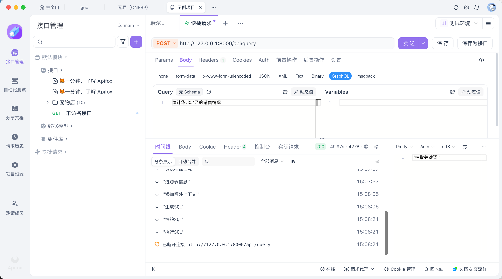

# 16 - 电商问数：查询接口实现与依赖组装

<!-- TS-TRACK-BANNER -->
> **TypeScript 轨道说明**：中文讲解保留原教程；**代码块使用仓库内真实 TypeScript**（`examples/` / 精校案例 / `apps/shop-query-agent`），不再使用机翻 Python。
> 精校清单：[POLISHED-CASES](POLISHED-CASES.md)


## TypeScript 可运行示例（推荐）

本章优先对照仓库真实文件：`examples/06-memory/index.ts`

```typescript
// examples/06-memory/index.ts
/**
 * Maps to: 案例与源码-2-LangChain框架/07-memory
 * Python refs: Memory_InMemoryChatMessageHistory.py, Memory_RunnableWithMessageHistory*.py
 *
 * JS/TS approach: keep an in-memory message list (same teaching goal as chat history).
 * Redis variants are documented in docs/MAPPING.md for production follow-up.
 */
import {
  AIMessage,
  HumanMessage,
  type BaseMessage,
  SystemMessage,
} from "@langchain/core/messages";
import { createChatModel } from "../../src/shared/llm.js";
import { printRunHeader } from "../../src/shared/env.js";

class InMemoryChatHistory {
  private store = new Map<string, BaseMessage[]>();

  get(sessionId: string): BaseMessage[] {
    return this.store.get(sessionId) ?? [];
  }

  append(sessionId: string, messages: BaseMessage[]) {
    const prev = this.get(sessionId);
    this.store.set(sessionId, [...prev, ...messages]);
  }
}

async function chat(sessionId: string, history: InMemoryChatHistory, text: string) {
  const model = createChatModel(0.2);
  const messages: BaseMessage[] = [
    new SystemMessage("你是有记忆的助教。请结合历史对话回答。"),
    ...history.get(sessionId),
    new HumanMessage(text),
  ];
  const ai = await model.invoke(messages);
  history.append(sessionId, [new HumanMessage(text), new AIMessage(String(ai.content))]);
  return String(ai.content);
}

async function main() {
  printRunHeader("06-memory | multi-turn chat history");
  const history = new InMemoryChatHistory();
  const sessionId = "user-001";

  const a1 = await chat(sessionId, history, "我叫小林，我在学 TypeScript Agent。");
  console.log("\n[round1]", a1);

  const a2 = await chat(sessionId, history, "还记得我的名字和在学什么吗？");
  console.log("\n[round2]", a2);

  console.log("\n[history size]", history.get(sessionId).length, "messages");
}

main().catch((err) => {
  console.error(err);
  process.exit(1);
});
```

```bash
npx tsx examples/06-memory/index.ts
```


---

**本章课程目标：**

- 把第 15 章的假流式接口替换成真实问数工作流。
- 使用 FastAPI 依赖注入组装 Repository、Session、Client 和 Service。
- 使用 `lifespan` 管理 Qdrant、ES、MySQL、Embedding 等应用级资源。

**学习建议：** 这一章开始把 API 和问数工作流接起来。读的时候沿着一条请求走：HTTP 进入路由，路由拿到 `QueryService`，`QueryService` 调用 LangGraph，执行进度再通过 SSE 返回前端。依赖函数看起来多，但本质是在按层次组装底层对象；别把装配代码误读成业务逻辑。

**对应代码分支：** `16-api-query-service`

---

第 15 章已经验证了 `StreamingResponse + SSE` 可以正常工作，但当时返回的是 `fake_streamer()` 模拟数据。本章要把它换成真实的问数智能体。

最终调用链路如下：

```text
前端 / Apifox
  -> POST /api/query
  -> query_router.py 接收请求
  -> Depends(get_query_service) 获取 QueryService
  -> QueryService.query(...)
  -> graph.astream(...)
  -> StreamingResponse 按 SSE 格式持续返回
```

完成这一章后，问数智能体就不再只是命令行里的内部脚本，而是一个可以通过 HTTP 调用的后端接口。

---

## 1、API 代码目录结构

这一阶段 API 代码主要涉及下面几个文件：

```text
shopkeeper-agent/
├─ main.py  # FastAPI 入口脚本，负责创建应用并注册路由
└─ app/
   ├─ api/
   │  ├─ routers/
   │  │  └─ query_router.py  # 查询接口路由，接收请求并返回流式响应
   │  ├─ schemas/
   │  │  └─ query_schema.py  # 查询接口请求体结构
   │  ├─ dependencies.py  # 查询接口依赖项，负责组装 QueryService
   │  └─ lifespan.py  # FastAPI 生命周期事件，负责初始化和关闭外部客户端
   └─ services/
      └─ query_service.py  # 查询接口核心业务逻辑，负责调用问数工作流
```

可以先把它们分成五层：

| 层次     | 文件               | 主要职责                                                  |
| -------- | ------------------ | --------------------------------------------------------- |
| 入口层   | `main.py`          | 创建 FastAPI 应用，注册生命周期和路由                     |
| HTTP 层  | `query_router.py`  | 定义 `/api/query`，接收请求，返回流式响应                 |
| 业务层   | `query_service.py` | 创建 `State` / `Context`，调用 LangGraph，并包装 SSE 消息 |
| 依赖层   | `dependencies.py`  | 组装 Service、Repository、Session、Client                 |
| 生命周期 | `lifespan.py`      | 应用启动时初始化客户端，应用关闭时释放连接                |

这几个文件的关系可以记成一句话：

```text
main 挂路由
router 接请求
service 调工作流
dependencies 组装对象
lifespan 管理应用级资源
```

---

## 2、入口和路由：让 HTTP 请求先进来

这一部分只解决一个问题：外部请求怎样进入我们的 Python 代码。

### 2.1 main.py：创建应用并挂载路由

项目对应文件路径：`shopkeeper-agent/main.py`

```typescript
// Real TypeScript from repo: examples/06-memory/index.ts
/**
 * Maps to: 案例与源码-2-LangChain框架/07-memory
 * Python refs: Memory_InMemoryChatMessageHistory.py, Memory_RunnableWithMessageHistory*.py
 *
 * JS/TS approach: keep an in-memory message list (same teaching goal as chat history).
 * Redis variants are documented in docs/MAPPING.md for production follow-up.
 */
import {
  AIMessage,
  HumanMessage,
  type BaseMessage,
  SystemMessage,
} from "@langchain/core/messages";
import { createChatModel } from "../../src/shared/llm.js";
import { printRunHeader } from "../../src/shared/env.js";

class InMemoryChatHistory {
  private store = new Map<string, BaseMessage[]>();

  get(sessionId: string): BaseMessage[] {
    return this.store.get(sessionId) ?? [];
  }

  append(sessionId: string, messages: BaseMessage[]) {
    const prev = this.get(sessionId);
    this.store.set(sessionId, [...prev, ...messages]);
  }
}

async function chat(sessionId: string, history: InMemoryChatHistory, text: string) {
  const model = createChatModel(0.2);
  const messages: BaseMessage[] = [
    new SystemMessage("你是有记忆的助教。请结合历史对话回答。"),
    ...history.get(sessionId),
    new HumanMessage(text),
  ];
  const ai = await model.invoke(messages);
  history.append(sessionId, [new HumanMessage(text), new AIMessage(String(ai.content))]);
  return String(ai.content);
}

async function main() {
  printRunHeader("06-memory | multi-turn chat history");
  const history = new InMemoryChatHistory();
  const sessionId = "user-001";

  const a1 = await chat(sessionId, history, "我叫小林，我在学 TypeScript Agent。");
  console.log("\n[round1]", a1);

  const a2 = await chat(sessionId, history, "还记得我的名字和在学什么吗？");
  console.log("\n[round2]", a2);

  console.log("\n[history size]", history.get(sessionId).length, "messages");
}

main().catch((err) => {
  console.error(err);
  process.exit(1);
});
```

这里最关键的是两行：

```typescript
// Real TypeScript from repo: book/cases-langchain/07-memory/Memory_InMemoryChatMessageHistory.ts
/**
 * 【精校可运行】内存多轮历史（第 16 章）
 * 原 Python: Memory_InMemoryChatMessageHistory.py 教学意图
 *
 *   npx tsx book/cases-langchain/07-memory/Memory_InMemoryChatMessageHistory.ts
 */
import {
  AIMessage,
  HumanMessage,
  SystemMessage,
  type BaseMessage,
} from "@langchain/core/messages";
import { createChatModel } from "../../../src/shared/llm.js";

class InMemoryChatHistory {
  private store = new Map<string, BaseMessage[]>();
  get(sessionId: string) {
    return this.store.get(sessionId) ?? [];
  }
  append(sessionId: string, messages: BaseMessage[]) {
    this.store.set(sessionId, [...this.get(sessionId), ...messages]);
  }
}

async function chat(
  history: InMemoryChatHistory,
  sessionId: string,
  text: string,
) {
  const model = createChatModel(0.2);
  const messages: BaseMessage[] = [
    new SystemMessage("你是有记忆的助教，请结合历史对话回答。"),
    ...history.get(sessionId),
    new HumanMessage(text),
  ];
  const ai = await model.invoke(messages);
  history.append(sessionId, [
    new HumanMessage(text),
    new AIMessage(String(ai.content)),
  ]);
  return String(ai.content);
}

async function main() {
  const history = new InMemoryChatHistory();
  const sid = "user-001";
  console.log(await chat(history, sid, "我叫小林，我在学 TypeScript Agent。"));
  console.log("---");
  console.log(await chat(history, sid, "还记得我的名字和在学什么吗？"));
  console.log("history size =", history.get(sid).length);
}

main().catch((e) => {
  console.error(e);
  process.exit(1);
});
```

`lifespan` 负责服务启动和关闭时的资源管理，`include_router` 负责把 `query_router.py` 中定义的接口挂到 FastAPI 应用上。

如果忘了 `app.include_router(query_router)`，即使 `query_router.py` 里写了 `/api/query`，FastAPI 应用也不知道这个接口存在，`/docs` 页面里自然也看不到它。

### 2.2 query_router.py：路由层只做 HTTP 相关的事

项目对应文件路径：`shopkeeper-agent/app/api/routers/query_router.py`

```typescript
// Real TypeScript from repo: examples/06-memory/index.ts
/**
 * Maps to: 案例与源码-2-LangChain框架/07-memory
 * Python refs: Memory_InMemoryChatMessageHistory.py, Memory_RunnableWithMessageHistory*.py
 *
 * JS/TS approach: keep an in-memory message list (same teaching goal as chat history).
 * Redis variants are documented in docs/MAPPING.md for production follow-up.
 */
import {
  AIMessage,
  HumanMessage,
  type BaseMessage,
  SystemMessage,
} from "@langchain/core/messages";
import { createChatModel } from "../../src/shared/llm.js";
import { printRunHeader } from "../../src/shared/env.js";

class InMemoryChatHistory {
  private store = new Map<string, BaseMessage[]>();

  get(sessionId: string): BaseMessage[] {
    return this.store.get(sessionId) ?? [];
  }

  append(sessionId: string, messages: BaseMessage[]) {
    const prev = this.get(sessionId);
    this.store.set(sessionId, [...prev, ...messages]);
  }
}

async function chat(sessionId: string, history: InMemoryChatHistory, text: string) {
  const model = createChatModel(0.2);
  const messages: BaseMessage[] = [
    new SystemMessage("你是有记忆的助教。请结合历史对话回答。"),
    ...history.get(sessionId),
    new HumanMessage(text),
  ];
  const ai = await model.invoke(messages);
  history.append(sessionId, [new HumanMessage(text), new AIMessage(String(ai.content))]);
  return String(ai.content);
}

async function main() {
  printRunHeader("06-memory | multi-turn chat history");
  const history = new InMemoryChatHistory();
  const sessionId = "user-001";

  const a1 = await chat(sessionId, history, "我叫小林，我在学 TypeScript Agent。");
  console.log("\n[round1]", a1);

  const a2 = await chat(sessionId, history, "还记得我的名字和在学什么吗？");
  console.log("\n[round2]", a2);

  console.log("\n[history size]", history.get(sessionId).length, "messages");
}

main().catch((err) => {
  console.error(err);
  process.exit(1);
});
```

路由层只做三件事：

```text
1. 接收 QuerySchema 请求体
2. 通过 Depends 拿到 QueryService
3. 把 QueryService.query(...) 交给 StreamingResponse
```

它不直接创建 Qdrant、ES、MySQL Repository，也不直接执行图节点。路由层越薄，后续接口越容易维护。

本节最重要的是这一行：

```typescript
// Real TypeScript from repo: book/cases-langchain/07-memory/Memory_InMemoryChatMessageHistory.ts
/**
 * 【精校可运行】内存多轮历史（第 16 章）
 * 原 Python: Memory_InMemoryChatMessageHistory.py 教学意图
 *
 *   npx tsx book/cases-langchain/07-memory/Memory_InMemoryChatMessageHistory.ts
 */
import {
  AIMessage,
  HumanMessage,
  SystemMessage,
  type BaseMessage,
} from "@langchain/core/messages";
import { createChatModel } from "../../../src/shared/llm.js";

class InMemoryChatHistory {
  private store = new Map<string, BaseMessage[]>();
  get(sessionId: string) {
    return this.store.get(sessionId) ?? [];
  }
  append(sessionId: string, messages: BaseMessage[]) {
    this.store.set(sessionId, [...this.get(sessionId), ...messages]);
  }
}

async function chat(
  history: InMemoryChatHistory,
  sessionId: string,
  text: string,
) {
  const model = createChatModel(0.2);
  const messages: BaseMessage[] = [
    new SystemMessage("你是有记忆的助教，请结合历史对话回答。"),
    ...history.get(sessionId),
    new HumanMessage(text),
  ];
  const ai = await model.invoke(messages);
  history.append(sessionId, [
    new HumanMessage(text),
    new AIMessage(String(ai.content)),
  ]);
  return String(ai.content);
}

async function main() {
  const history = new InMemoryChatHistory();
  const sid = "user-001";
  console.log(await chat(history, sid, "我叫小林，我在学 TypeScript Agent。"));
  console.log("---");
  console.log(await chat(history, sid, "还记得我的名字和在学什么吗？"));
  console.log("history size =", history.get(sid).length);
}

main().catch((e) => {
  console.error(e);
  process.exit(1);
});
```

它表达的是：当前接口需要一个 `QueryService`，这个对象由 `get_query_service()` 提供。路由只声明“我需要什么”，至于怎么创建，交给 `dependencies.py`。

---

## 3、QueryService：把一次请求变成一次图执行

`QueryService` 是这一章的核心。它把 HTTP 层传入的自然语言问题，转换成一次 LangGraph 工作流执行。

如果不抽出 `QueryService`，路由函数里就会堆满这些逻辑：

```text
解析请求体
创建 DataAgentState
创建 DataAgentContext
准备 Repository 和 Client
调用 graph.astream(...)
把 chunk 包成 SSE
处理异常
```

这会让路由层既懂 HTTP，又懂工作流，又懂底层依赖，边界很快就乱了。抽出 `QueryService` 后，分工会清楚很多：

```text
query_router.py
  -> 负责 HTTP 层：接请求、返响应

query_service.py
  -> 负责业务层：调问数智能体、组织流式输出
```

### 3.1 从测试脚本迁移到 API

前面测试 LangGraph 工作流时，核心代码大致是：

```typescript
// Real TypeScript from repo: examples/06-memory/index.ts
/**
 * Maps to: 案例与源码-2-LangChain框架/07-memory
 * Python refs: Memory_InMemoryChatMessageHistory.py, Memory_RunnableWithMessageHistory*.py
 *
 * JS/TS approach: keep an in-memory message list (same teaching goal as chat history).
 * Redis variants are documented in docs/MAPPING.md for production follow-up.
 */
import {
  AIMessage,
  HumanMessage,
  type BaseMessage,
  SystemMessage,
} from "@langchain/core/messages";
import { createChatModel } from "../../src/shared/llm.js";
import { printRunHeader } from "../../src/shared/env.js";

class InMemoryChatHistory {
  private store = new Map<string, BaseMessage[]>();

  get(sessionId: string): BaseMessage[] {
    return this.store.get(sessionId) ?? [];
  }

  append(sessionId: string, messages: BaseMessage[]) {
    const prev = this.get(sessionId);
    this.store.set(sessionId, [...prev, ...messages]);
  }
}

async function chat(sessionId: string, history: InMemoryChatHistory, text: string) {
  const model = createChatModel(0.2);
  const messages: BaseMessage[] = [
    new SystemMessage("你是有记忆的助教。请结合历史对话回答。"),
    ...history.get(sessionId),
    new HumanMessage(text),
  ];
  const ai = await model.invoke(messages);
  history.append(sessionId, [new HumanMessage(text), new AIMessage(String(ai.content))]);
  return String(ai.content);
}

async function main() {
  printRunHeader("06-memory | multi-turn chat history");
  const history = new InMemoryChatHistory();
  const sessionId = "user-001";

  const a1 = await chat(sessionId, history, "我叫小林，我在学 TypeScript Agent。");
  console.log("\n[round1]", a1);

  const a2 = await chat(sessionId, history, "还记得我的名字和在学什么吗？");
  console.log("\n[round2]", a2);

  console.log("\n[history size]", history.get(sessionId).length, "messages");
}

main().catch((err) => {
  console.error(err);
  process.exit(1);
});
```

迁移到 API 后，变化主要有三处：

| 测试脚本                    | API 接口版本                       |
| --------------------------- | ---------------------------------- |
| 用户问题写死在代码里        | 使用请求体传入的 `query`           |
| 上下文在测试脚本里手动创建  | 由 `QueryService` 接收依赖后创建   |
| `print(chunk)` 输出到控制台 | `yield data: ...\n\n` 流式写给前端 |

### 3.2 QueryService 核心代码

项目对应文件路径：`shopkeeper-agent/app/services/query_service.py`

```typescript
// Real TypeScript from repo: book/cases-langchain/07-memory/Memory_InMemoryChatMessageHistory.ts
/**
 * 【精校可运行】内存多轮历史（第 16 章）
 * 原 Python: Memory_InMemoryChatMessageHistory.py 教学意图
 *
 *   npx tsx book/cases-langchain/07-memory/Memory_InMemoryChatMessageHistory.ts
 */
import {
  AIMessage,
  HumanMessage,
  SystemMessage,
  type BaseMessage,
} from "@langchain/core/messages";
import { createChatModel } from "../../../src/shared/llm.js";

class InMemoryChatHistory {
  private store = new Map<string, BaseMessage[]>();
  get(sessionId: string) {
    return this.store.get(sessionId) ?? [];
  }
  append(sessionId: string, messages: BaseMessage[]) {
    this.store.set(sessionId, [...this.get(sessionId), ...messages]);
  }
}

async function chat(
  history: InMemoryChatHistory,
  sessionId: string,
  text: string,
) {
  const model = createChatModel(0.2);
  const messages: BaseMessage[] = [
    new SystemMessage("你是有记忆的助教，请结合历史对话回答。"),
    ...history.get(sessionId),
    new HumanMessage(text),
  ];
  const ai = await model.invoke(messages);
  history.append(sessionId, [
    new HumanMessage(text),
    new AIMessage(String(ai.content)),
  ]);
  return String(ai.content);
}

async function main() {
  const history = new InMemoryChatHistory();
  const sid = "user-001";
  console.log(await chat(history, sid, "我叫小林，我在学 TypeScript Agent。"));
  console.log("---");
  console.log(await chat(history, sid, "还记得我的名字和在学什么吗？"));
  console.log("history size =", history.get(sid).length);
}

main().catch((e) => {
  console.error(e);
  process.exit(1);
});
```

这段代码里最重要的不是 `json.dumps`，而是两个对象：`state` 和 `context`。

### 3.3 state 和 context 怎么区分

`state` 保存的是本次任务会不断变化的业务数据，例如：

```text
query
keywords
retrieved_column_infos
retrieved_metric_infos
table_infos
metric_infos
sql
result
```

`context` 保存的是节点运行时需要使用的外部能力，例如：

```text
Embedding Client
ColumnQdrantRepository
MetricQdrantRepository
ValueESRepository
MetaMySQLRepository
DWMySQLRepository
```

可以这样记：

```text
state：任务数据，图执行过程中会变
context：工具资源，节点执行时拿来用
```

不要把 Repository、Client 这类对象塞进 `state`。它们不是业务中间结果，而是节点执行时需要调用的外部能力，更适合放在 `context` 里。

### 3.4 为什么异常也要包装成 SSE

普通接口出错时，可以直接返回 500 状态码。但流式接口不太一样：一旦 `StreamingResponse` 开始往外写数据，HTTP 响应头通常已经发送出去了，后面就不能再随便改状态码。

所以当前版本先把异常包装成一条 SSE 消息：

```typescript
// Real TypeScript from repo: examples/06-memory/index.ts
/**
 * Maps to: 案例与源码-2-LangChain框架/07-memory
 * Python refs: Memory_InMemoryChatMessageHistory.py, Memory_RunnableWithMessageHistory*.py
 *
 * JS/TS approach: keep an in-memory message list (same teaching goal as chat history).
 * Redis variants are documented in docs/MAPPING.md for production follow-up.
 */
import {
  AIMessage,
  HumanMessage,
  type BaseMessage,
  SystemMessage,
} from "@langchain/core/messages";
import { createChatModel } from "../../src/shared/llm.js";
import { printRunHeader } from "../../src/shared/env.js";

class InMemoryChatHistory {
  private store = new Map<string, BaseMessage[]>();

  get(sessionId: string): BaseMessage[] {
    return this.store.get(sessionId) ?? [];
  }

  append(sessionId: string, messages: BaseMessage[]) {
    const prev = this.get(sessionId);
    this.store.set(sessionId, [...prev, ...messages]);
  }
}

async function chat(sessionId: string, history: InMemoryChatHistory, text: string) {
  const model = createChatModel(0.2);
  const messages: BaseMessage[] = [
    new SystemMessage("你是有记忆的助教。请结合历史对话回答。"),
    ...history.get(sessionId),
    new HumanMessage(text),
  ];
  const ai = await model.invoke(messages);
  history.append(sessionId, [new HumanMessage(text), new AIMessage(String(ai.content))]);
  return String(ai.content);
}

async function main() {
  printRunHeader("06-memory | multi-turn chat history");
  const history = new InMemoryChatHistory();
  const sessionId = "user-001";

  const a1 = await chat(sessionId, history, "我叫小林，我在学 TypeScript Agent。");
  console.log("\n[round1]", a1);

  const a2 = await chat(sessionId, history, "还记得我的名字和在学什么吗？");
  console.log("\n[round2]", a2);

  console.log("\n[history size]", history.get(sessionId).length, "messages");
}

main().catch((err) => {
  console.error(err);
  process.exit(1);
});
```

前端拿到这条消息后，可以按 `type=error` 展示错误状态。下一章会继续完善节点级异常处理、前后端联调和 `request_id` 日志追踪。

---

## 4、dependencies.py：把对象创建交给依赖层

现在路由里已经声明了：

```typescript
// Real TypeScript from repo: book/cases-langchain/07-memory/Memory_InMemoryChatMessageHistory.ts
/**
 * 【精校可运行】内存多轮历史（第 16 章）
 * 原 Python: Memory_InMemoryChatMessageHistory.py 教学意图
 *
 *   npx tsx book/cases-langchain/07-memory/Memory_InMemoryChatMessageHistory.ts
 */
import {
  AIMessage,
  HumanMessage,
  SystemMessage,
  type BaseMessage,
} from "@langchain/core/messages";
import { createChatModel } from "../../../src/shared/llm.js";

class InMemoryChatHistory {
  private store = new Map<string, BaseMessage[]>();
  get(sessionId: string) {
    return this.store.get(sessionId) ?? [];
  }
  append(sessionId: string, messages: BaseMessage[]) {
    this.store.set(sessionId, [...this.get(sessionId), ...messages]);
  }
}

async function chat(
  history: InMemoryChatHistory,
  sessionId: string,
  text: string,
) {
  const model = createChatModel(0.2);
  const messages: BaseMessage[] = [
    new SystemMessage("你是有记忆的助教，请结合历史对话回答。"),
    ...history.get(sessionId),
    new HumanMessage(text),
  ];
  const ai = await model.invoke(messages);
  history.append(sessionId, [
    new HumanMessage(text),
    new AIMessage(String(ai.content)),
  ]);
  return String(ai.content);
}

async function main() {
  const history = new InMemoryChatHistory();
  const sid = "user-001";
  console.log(await chat(history, sid, "我叫小林，我在学 TypeScript Agent。"));
  console.log("---");
  console.log(await chat(history, sid, "还记得我的名字和在学什么吗？"));
  console.log("history size =", history.get(sid).length);
}

main().catch((e) => {
  console.error(e);
  process.exit(1);
});
```

这意味着项目必须提供 `get_query_service()`。

如果直接在路由里创建 `QueryService`，路由就会知道太多底层细节：

```text
Qdrant 客户端怎么取
ES 客户端怎么取
MySQL Session 怎么创建和释放
Repository 怎么实例化
QueryService 需要哪些参数
```

这些不是 HTTP 层该关心的事。所以本项目把依赖组装统一放到：

```text
shopkeeper-agent/app/api/dependencies.py
```

### 4.1 先看最终依赖树

本章最终要组装的是 `QueryService`，依赖树大致如下：

```text
get_query_service
  -> get_meta_mysql_repository
      -> get_meta_session
  -> get_embedding_client
  -> get_dw_mysql_repository
      -> get_dw_session
  -> get_column_qdrant_repository
  -> get_metric_qdrant_repository
  -> get_value_es_repository
```

再往底层，这些依赖会使用生命周期中初始化好的客户端管理器：

```text
embedding_client_manager.client
qdrant_client_manager.client
es_client_manager.client
meta_mysql_client_manager.session_factory
dw_mysql_client_manager.session_factory
```

所以 `dependencies.py` 和 `lifespan.py` 是一组配合关系：

```text
lifespan.py
  -> 应用启动时初始化客户端管理器

dependencies.py
  -> 每次请求中取出客户端或 Session，组装 Repository 和 QueryService
```

### 4.2 MySQL Session 是请求级资源

项目中的 MySQL Session 用带 `yield` 的依赖项管理：

```typescript
// Real TypeScript from repo: examples/06-memory/index.ts
/**
 * Maps to: 案例与源码-2-LangChain框架/07-memory
 * Python refs: Memory_InMemoryChatMessageHistory.py, Memory_RunnableWithMessageHistory*.py
 *
 * JS/TS approach: keep an in-memory message list (same teaching goal as chat history).
 * Redis variants are documented in docs/MAPPING.md for production follow-up.
 */
import {
  AIMessage,
  HumanMessage,
  type BaseMessage,
  SystemMessage,
} from "@langchain/core/messages";
import { createChatModel } from "../../src/shared/llm.js";
import { printRunHeader } from "../../src/shared/env.js";

class InMemoryChatHistory {
  private store = new Map<string, BaseMessage[]>();

  get(sessionId: string): BaseMessage[] {
    return this.store.get(sessionId) ?? [];
  }

  append(sessionId: string, messages: BaseMessage[]) {
    const prev = this.get(sessionId);
    this.store.set(sessionId, [...prev, ...messages]);
  }
}

async function chat(sessionId: string, history: InMemoryChatHistory, text: string) {
  const model = createChatModel(0.2);
  const messages: BaseMessage[] = [
    new SystemMessage("你是有记忆的助教。请结合历史对话回答。"),
    ...history.get(sessionId),
    new HumanMessage(text),
  ];
  const ai = await model.invoke(messages);
  history.append(sessionId, [new HumanMessage(text), new AIMessage(String(ai.content))]);
  return String(ai.content);
}

async function main() {
  printRunHeader("06-memory | multi-turn chat history");
  const history = new InMemoryChatHistory();
  const sessionId = "user-001";

  const a1 = await chat(sessionId, history, "我叫小林，我在学 TypeScript Agent。");
  console.log("\n[round1]", a1);

  const a2 = await chat(sessionId, history, "还记得我的名字和在学什么吗？");
  console.log("\n[round2]", a2);

  console.log("\n[history size]", history.get(sessionId).length, "messages");
}

main().catch((err) => {
  console.error(err);
  process.exit(1);
});
```

执行顺序可以理解成：

```text
请求需要 Session
  -> 创建 Session
  -> yield 给 Repository 使用
  -> 请求结束
  -> 退出 async with，释放 Session
```

这里不要把 Session 做成全局对象。数据库 Session 通常属于一次请求的工作单元，而客户端管理器、连接池这类才适合放到应用生命周期里。

### 4.3 Repository 和 Client 怎么组装

有了 Session，就可以创建 MySQL Repository：

```typescript
// Real TypeScript from repo: book/cases-langchain/07-memory/Memory_InMemoryChatMessageHistory.ts
/**
 * 【精校可运行】内存多轮历史（第 16 章）
 * 原 Python: Memory_InMemoryChatMessageHistory.py 教学意图
 *
 *   npx tsx book/cases-langchain/07-memory/Memory_InMemoryChatMessageHistory.ts
 */
import {
  AIMessage,
  HumanMessage,
  SystemMessage,
  type BaseMessage,
} from "@langchain/core/messages";
import { createChatModel } from "../../../src/shared/llm.js";

class InMemoryChatHistory {
  private store = new Map<string, BaseMessage[]>();
  get(sessionId: string) {
    return this.store.get(sessionId) ?? [];
  }
  append(sessionId: string, messages: BaseMessage[]) {
    this.store.set(sessionId, [...this.get(sessionId), ...messages]);
  }
}

async function chat(
  history: InMemoryChatHistory,
  sessionId: string,
  text: string,
) {
  const model = createChatModel(0.2);
  const messages: BaseMessage[] = [
    new SystemMessage("你是有记忆的助教，请结合历史对话回答。"),
    ...history.get(sessionId),
    new HumanMessage(text),
  ];
  const ai = await model.invoke(messages);
  history.append(sessionId, [
    new HumanMessage(text),
    new AIMessage(String(ai.content)),
  ]);
  return String(ai.content);
}

async function main() {
  const history = new InMemoryChatHistory();
  const sid = "user-001";
  console.log(await chat(history, sid, "我叫小林，我在学 TypeScript Agent。"));
  console.log("---");
  console.log(await chat(history, sid, "还记得我的名字和在学什么吗？"));
  console.log("history size =", history.get(sid).length);
}

main().catch((e) => {
  console.error(e);
  process.exit(1);
});
```

Qdrant 和 ES Repository 使用的是应用启动阶段已经初始化好的客户端：

```typescript
// Real TypeScript from repo: examples/06-memory/index.ts
/**
 * Maps to: 案例与源码-2-LangChain框架/07-memory
 * Python refs: Memory_InMemoryChatMessageHistory.py, Memory_RunnableWithMessageHistory*.py
 *
 * JS/TS approach: keep an in-memory message list (same teaching goal as chat history).
 * Redis variants are documented in docs/MAPPING.md for production follow-up.
 */
import {
  AIMessage,
  HumanMessage,
  type BaseMessage,
  SystemMessage,
} from "@langchain/core/messages";
import { createChatModel } from "../../src/shared/llm.js";
import { printRunHeader } from "../../src/shared/env.js";

class InMemoryChatHistory {
  private store = new Map<string, BaseMessage[]>();

  get(sessionId: string): BaseMessage[] {
    return this.store.get(sessionId) ?? [];
  }

  append(sessionId: string, messages: BaseMessage[]) {
    const prev = this.get(sessionId);
    this.store.set(sessionId, [...prev, ...messages]);
  }
}

async function chat(sessionId: string, history: InMemoryChatHistory, text: string) {
  const model = createChatModel(0.2);
  const messages: BaseMessage[] = [
    new SystemMessage("你是有记忆的助教。请结合历史对话回答。"),
    ...history.get(sessionId),
    new HumanMessage(text),
  ];
  const ai = await model.invoke(messages);
  history.append(sessionId, [new HumanMessage(text), new AIMessage(String(ai.content))]);
  return String(ai.content);
}

async function main() {
  printRunHeader("06-memory | multi-turn chat history");
  const history = new InMemoryChatHistory();
  const sessionId = "user-001";

  const a1 = await chat(sessionId, history, "我叫小林，我在学 TypeScript Agent。");
  console.log("\n[round1]", a1);

  const a2 = await chat(sessionId, history, "还记得我的名字和在学什么吗？");
  console.log("\n[round2]", a2);

  console.log("\n[history size]", history.get(sessionId).length, "messages");
}

main().catch((err) => {
  console.error(err);
  process.exit(1);
});
```

Embedding 客户端也是同样的思路：

```typescript
// Real TypeScript from repo: book/cases-langchain/07-memory/Memory_InMemoryChatMessageHistory.ts
/**
 * 【精校可运行】内存多轮历史（第 16 章）
 * 原 Python: Memory_InMemoryChatMessageHistory.py 教学意图
 *
 *   npx tsx book/cases-langchain/07-memory/Memory_InMemoryChatMessageHistory.ts
 */
import {
  AIMessage,
  HumanMessage,
  SystemMessage,
  type BaseMessage,
} from "@langchain/core/messages";
import { createChatModel } from "../../../src/shared/llm.js";

class InMemoryChatHistory {
  private store = new Map<string, BaseMessage[]>();
  get(sessionId: string) {
    return this.store.get(sessionId) ?? [];
  }
  append(sessionId: string, messages: BaseMessage[]) {
    this.store.set(sessionId, [...this.get(sessionId), ...messages]);
  }
}

async function chat(
  history: InMemoryChatHistory,
  sessionId: string,
  text: string,
) {
  const model = createChatModel(0.2);
  const messages: BaseMessage[] = [
    new SystemMessage("你是有记忆的助教，请结合历史对话回答。"),
    ...history.get(sessionId),
    new HumanMessage(text),
  ];
  const ai = await model.invoke(messages);
  history.append(sessionId, [
    new HumanMessage(text),
    new AIMessage(String(ai.content)),
  ]);
  return String(ai.content);
}

async function main() {
  const history = new InMemoryChatHistory();
  const sid = "user-001";
  console.log(await chat(history, sid, "我叫小林，我在学 TypeScript Agent。"));
  console.log("---");
  console.log(await chat(history, sid, "还记得我的名字和在学什么吗？"));
  console.log("history size =", history.get(sid).length);
}

main().catch((e) => {
  console.error(e);
  process.exit(1);
});
```

### 4.4 最后组装 QueryService

所有依赖最终收拢到 `get_query_service()`：

```typescript
// Real TypeScript from repo: examples/06-memory/index.ts
/**
 * Maps to: 案例与源码-2-LangChain框架/07-memory
 * Python refs: Memory_InMemoryChatMessageHistory.py, Memory_RunnableWithMessageHistory*.py
 *
 * JS/TS approach: keep an in-memory message list (same teaching goal as chat history).
 * Redis variants are documented in docs/MAPPING.md for production follow-up.
 */
import {
  AIMessage,
  HumanMessage,
  type BaseMessage,
  SystemMessage,
} from "@langchain/core/messages";
import { createChatModel } from "../../src/shared/llm.js";
import { printRunHeader } from "../../src/shared/env.js";

class InMemoryChatHistory {
  private store = new Map<string, BaseMessage[]>();

  get(sessionId: string): BaseMessage[] {
    return this.store.get(sessionId) ?? [];
  }

  append(sessionId: string, messages: BaseMessage[]) {
    const prev = this.get(sessionId);
    this.store.set(sessionId, [...prev, ...messages]);
  }
}

async function chat(sessionId: string, history: InMemoryChatHistory, text: string) {
  const model = createChatModel(0.2);
  const messages: BaseMessage[] = [
    new SystemMessage("你是有记忆的助教。请结合历史对话回答。"),
    ...history.get(sessionId),
    new HumanMessage(text),
  ];
  const ai = await model.invoke(messages);
  history.append(sessionId, [new HumanMessage(text), new AIMessage(String(ai.content))]);
  return String(ai.content);
}

async function main() {
  printRunHeader("06-memory | multi-turn chat history");
  const history = new InMemoryChatHistory();
  const sessionId = "user-001";

  const a1 = await chat(sessionId, history, "我叫小林，我在学 TypeScript Agent。");
  console.log("\n[round1]", a1);

  const a2 = await chat(sessionId, history, "还记得我的名字和在学什么吗？");
  console.log("\n[round2]", a2);

  console.log("\n[history size]", history.get(sessionId).length, "messages");
}

main().catch((err) => {
  console.error(err);
  process.exit(1);
});
```

这就是 FastAPI 子依赖的价值：我们只声明依赖关系，FastAPI 会自动从叶子节点往上解析整棵依赖树。

---

## 5、lifespan.py：在应用启动时准备外部客户端

`dependencies.py` 能拿到 `qdrant_client_manager.client`、`es_client_manager.client`，前提是这些 manager 已经初始化。

所以需要在应用启动阶段执行：

```typescript
// Real TypeScript from repo: book/cases-langchain/07-memory/Memory_InMemoryChatMessageHistory.ts
/**
 * 【精校可运行】内存多轮历史（第 16 章）
 * 原 Python: Memory_InMemoryChatMessageHistory.py 教学意图
 *
 *   npx tsx book/cases-langchain/07-memory/Memory_InMemoryChatMessageHistory.ts
 */
import {
  AIMessage,
  HumanMessage,
  SystemMessage,
  type BaseMessage,
} from "@langchain/core/messages";
import { createChatModel } from "../../../src/shared/llm.js";

class InMemoryChatHistory {
  private store = new Map<string, BaseMessage[]>();
  get(sessionId: string) {
    return this.store.get(sessionId) ?? [];
  }
  append(sessionId: string, messages: BaseMessage[]) {
    this.store.set(sessionId, [...this.get(sessionId), ...messages]);
  }
}

async function chat(
  history: InMemoryChatHistory,
  sessionId: string,
  text: string,
) {
  const model = createChatModel(0.2);
  const messages: BaseMessage[] = [
    new SystemMessage("你是有记忆的助教，请结合历史对话回答。"),
    ...history.get(sessionId),
    new HumanMessage(text),
  ];
  const ai = await model.invoke(messages);
  history.append(sessionId, [
    new HumanMessage(text),
    new AIMessage(String(ai.content)),
  ]);
  return String(ai.content);
}

async function main() {
  const history = new InMemoryChatHistory();
  const sid = "user-001";
  console.log(await chat(history, sid, "我叫小林，我在学 TypeScript Agent。"));
  console.log("---");
  console.log(await chat(history, sid, "还记得我的名字和在学什么吗？"));
  console.log("history size =", history.get(sid).length);
}

main().catch((e) => {
  console.error(e);
  process.exit(1);
});
```

项目对应文件路径：`shopkeeper-agent/app/api/lifespan.py`

```typescript
// Real TypeScript from repo: examples/06-memory/index.ts
/**
 * Maps to: 案例与源码-2-LangChain框架/07-memory
 * Python refs: Memory_InMemoryChatMessageHistory.py, Memory_RunnableWithMessageHistory*.py
 *
 * JS/TS approach: keep an in-memory message list (same teaching goal as chat history).
 * Redis variants are documented in docs/MAPPING.md for production follow-up.
 */
import {
  AIMessage,
  HumanMessage,
  type BaseMessage,
  SystemMessage,
} from "@langchain/core/messages";
import { createChatModel } from "../../src/shared/llm.js";
import { printRunHeader } from "../../src/shared/env.js";

class InMemoryChatHistory {
  private store = new Map<string, BaseMessage[]>();

  get(sessionId: string): BaseMessage[] {
    return this.store.get(sessionId) ?? [];
  }

  append(sessionId: string, messages: BaseMessage[]) {
    const prev = this.get(sessionId);
    this.store.set(sessionId, [...prev, ...messages]);
  }
}

async function chat(sessionId: string, history: InMemoryChatHistory, text: string) {
  const model = createChatModel(0.2);
  const messages: BaseMessage[] = [
    new SystemMessage("你是有记忆的助教。请结合历史对话回答。"),
    ...history.get(sessionId),
    new HumanMessage(text),
  ];
  const ai = await model.invoke(messages);
  history.append(sessionId, [new HumanMessage(text), new AIMessage(String(ai.content))]);
  return String(ai.content);
}

async function main() {
  printRunHeader("06-memory | multi-turn chat history");
  const history = new InMemoryChatHistory();
  const sessionId = "user-001";

  const a1 = await chat(sessionId, history, "我叫小林，我在学 TypeScript Agent。");
  console.log("\n[round1]", a1);

  const a2 = await chat(sessionId, history, "还记得我的名字和在学什么吗？");
  console.log("\n[round2]", a2);

  console.log("\n[history size]", history.get(sessionId).length, "messages");
}

main().catch((err) => {
  console.error(err);
  process.exit(1);
});
```

按 `yield` 拆开看：

```text
yield 前：
  FastAPI 应用启动时执行
  初始化 Qdrant、Embedding、ES、MySQL 客户端管理器

yield 处：
  应用进入运行状态
  开始接收请求

yield 后：
  应用关闭前执行
  释放外部客户端连接
```

注意这里没有关闭 `embedding_client_manager`，因为当前项目代码里只对 Qdrant、ES、MySQL manager 提供了异步关闭逻辑。文档跟着实际代码走，不额外虚构关闭方法。

---

## 6、启动后端并测试真实查询接口

在 `shopkeeper-agent` 项目根目录启动后端：

```bash
uv run fastapi dev main.py
```

启动前要确认 MySQL、Qdrant、Elasticsearch 等外部服务可用，Embedding 相关配置也已经准备好。

用 Apifox 测试：

```text
POST http://127.0.0.1:8000/api/query
Content-Type: application/json
```

请求体示例：

```json
{
  "query": "统计华北地区销售额"
}
```

如果一切正常，接口不会一次性返回完整结果，而是持续返回多段 SSE 消息。前端或 Apifox 能看到问数智能体执行过程中的进度输出。



---

**本章小结：**

本章把 `/api/query` 从协议验证推进到了真实业务执行。

```text
main.py
  -> 创建 FastAPI 应用
  -> 注册 lifespan 和 query_router

query_router.py
  -> 接收 QuerySchema
  -> 通过 Depends 获取 QueryService
  -> 用 StreamingResponse 返回 query_service.query(...)

QueryService
  -> 创建 DataAgentState
  -> 创建 DataAgentContext
  -> 调用 graph.astream(..., stream_mode="custom")
  -> 把 chunk 转成 JSON 并包装成 SSE

dependencies.py
  -> 组装 Session、Repository、Client、Service

lifespan.py
  -> 应用启动时初始化客户端
  -> 应用关闭时释放客户端
```

这一章完成后，后端查询接口已经能跑真实问数流程。下一章要继续处理交付级问题：节点失败时如何停止工作流、前端如何稳定消费消息，以及并发请求时如何通过 `request_id` 追踪日志。
