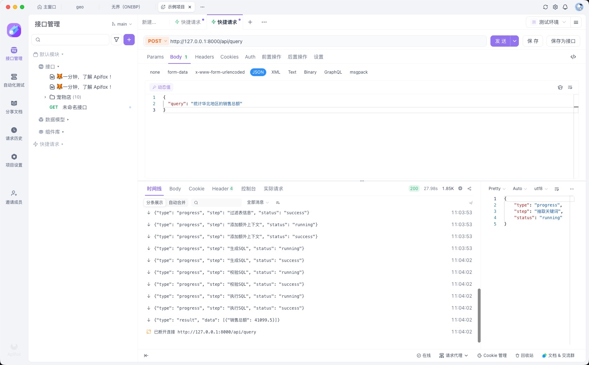
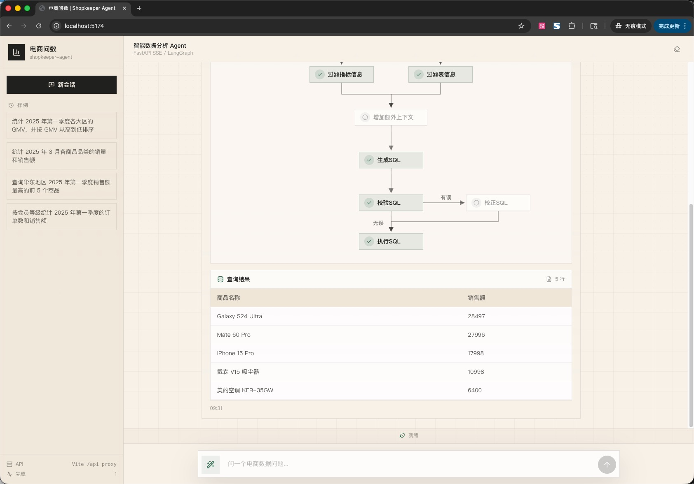
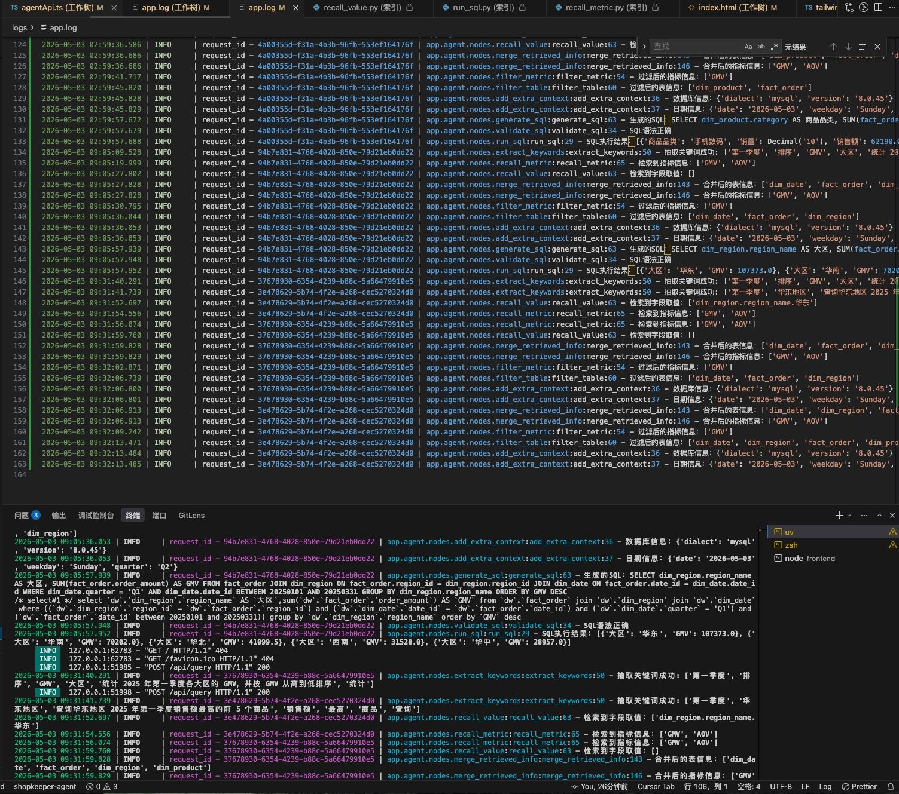

# 17 - 电商问数：前后端联调与日志追踪

<!-- TS-TRACK-BANNER -->
> **TypeScript 轨道说明**：中文讲解保留原教程；**代码块使用仓库内真实 TypeScript**（`examples/` / 精校案例 / `apps/shop-query-agent`），不再使用机翻 Python。
> 精校清单：[POLISHED-CASES](POLISHED-CASES.md)


## TypeScript 可运行示例（推荐）

本章优先对照仓库真实文件：`apps/shop-query-agent/lib/agent.ts`

```typescript
// apps/shop-query-agent/lib/agent.ts
import { ChatOpenAI } from "@langchain/openai";
import { z } from "zod";
import { buildSchemaContext, recallMetadata, type RecallHit } from "./metadata";
import { executeSelect, validateSql, type QueryResult } from "./sql-engine";

export type AgentStep = {
  id: string;
  title: string;
  detail: string;
  status: "ok" | "error" | "info";
};

export type AgentResponse = {
  question: string;
  steps: AgentStep[];
  hits: RecallHit[];
  sql: string;
  result: QueryResult | null;
  answer: string;
  error?: string;
};

function createModel() {
  const apiKey = process.env.OPENAI_API_KEY;
  if (!apiKey) {
    throw new Error("缺少 OPENAI_API_KEY，请在 apps/shop-query-agent/.env.local 配置");
  }
  return new ChatOpenAI({
    apiKey,
    model: process.env.OPENAI_MODEL || "qwen-plus",
    temperature: 0,
    configuration: process.env.OPENAI_BASE_URL
      ? { baseURL: process.env.OPENAI_BASE_URL }
      : undefined,
  });
}

const SqlPlanSchema = z.object({
  sql: z.string().describe("Single SELECT statement only"),
  rationale: z.string().describe("Why this SQL answers the question"),
});

function fallbackSql(question: string, hits: RecallHit[]): string {
  const values = hits.filter((h) => h.kind === "value");
  const region = values.find((v) => v.column === "region_name")?.value;
  const brand = values.find((v) => v.column === "brand")?.value;
  const level = values.find((v) => v.column === "member_level")?.value;
  const category = values.find((v) => v.column === "category")?.value;

  const wantsGroupRegion = /地区|大区|区域|华北|华东|华南|西南/.test(question);
  const wantsBrand = /品牌/.test(question) || Boolean(brand);
  const wantsLevel = /会员/.test(question) || Boolean(level);

  if (wantsGroupRegion && !region) {
    return [
      "SELECT dim_region.region_name AS region_name, SUM(fact_order.amount) AS total_amount",
      "FROM fact_order",
      "JOIN dim_region ON fact_order.region_id = dim_region.region_id",
      "WHERE fact_order.status = 'paid'",
      "GROUP BY dim_region.region_name",
      "ORDER BY total_amount DESC",
      "LIMIT 20",
    ].join("\n");
  }

  const where: string[] = ["fact_order.status = 'paid'"];
  if (region) where.push(`dim_region.region_name = '${region}'`);
  if (brand) where.push(`dim_product.brand = '${brand}'`);
  if (level) where.push(`dim_customer.member_level = '${level}'`);
  if (category) where.push(`dim_product.category = '${category}'`);

  if (wantsBrand && region) {
    return [
      "SELECT dim_product.brand AS brand, SUM(fact_order.amount) AS total_amount",
      "FROM fact_order",
      "JOIN dim_product ON fact_order.product_id = dim_product.product_id",
      "JOIN dim_region ON fact_order.region_id = dim_region.region_id",
      `WHERE ${where.join(" AND ")}`,
      "GROUP BY dim_product.brand",
      "ORDER BY total_amount DESC",
      "LIMIT 20",
    ].join("\n");
  }

  if (wantsLevel) {
    return [
      "SELECT dim_customer.member_level AS member_level, SUM(fact_order.amount) AS total_amount, COUNT(fact_order.order_id) AS order_cnt",
      "FROM fact_order",
      "JOIN dim_customer ON fact_order.customer_id = dim_customer.customer_id",
      "JOIN dim_region ON fact_order.region_id = dim_region.region_id",
      "JOIN dim_product ON fact_order.product_id = dim_product.product_id",
      `WHERE ${where.join(" AND ")}`,
      "GROUP BY dim_customer.member_level",
      "ORDER BY total_amount DESC",
      "LIMIT 20",
    ].join("\n");
  }

  return [
    "SELECT SUM(fact_order.amount) AS total_amount, SUM(fact_order.quantity) AS total_qty, COUNT(fact_order.order_id) AS order_cnt",
    "FROM fact_order",
    "JOIN dim_customer ON fact_order.customer_id = dim_customer.customer_id",
    "JOIN dim_product ON fact_order.product_id = dim_product.product_id",
    "JOIN dim_region ON fact_order.region_id = dim_region.region_id",
    `WHERE ${where.join(" AND ")}`,
    "LIMIT 20",
  ].join("\n");
}

async function generateSql(question: string, hits: RecallHit[]): Promise<{ sql: string; rationale: string; usedModel: boolean }> {
  const context = buildSchemaContext(hits);

  try {
    const model = createModel().withStructuredOutput(SqlPlanSchema);
    const plan = await model.invoke([
      [
        "system",
        "你是电商数仓 NL2SQL 助手。只输出一条可执行的 SELECT SQL。不要编造不存在的表或字段。",
      ],
      [
        "human",
        `用户问题：${question}\n\n元数据上下文：\n${context}\n\n请生成 SQL。`,
      ],
    ]);
    return { sql: plan.sql, rationale: plan.rationale, usedModel: true };
  } catch (err) {
    const sql = fallbackSql(question, hits);
    const raw = err instanceof Error ? err.message : String(err);
    const short =
      raw.includes("API key") || raw.includes("401")
        ? "未配置有效 OPENAI_API_KEY，已切换规则兜底 SQL"
        : raw.slice(0, 180);
    return {
      sql,
      rationale: short,
      usedModel: false,
    };
  }
}

function summarize(question: string, result: QueryResult, rationale: string): string {
  if (!result.rows.length) {
    return "查询成功，但没有命中数据。可以尝试放宽地区/品牌/会员条件。";
  }
  const preview = result.rows
    .slice(0, 5)
    .map((r) =>
      Object.entries(r)
        .map(([k, v]) => `${k}=${v}`)
        .join(", "),
    )
    .join("；");
  return `针对「${question}」共返回 ${result.rowCount} 行。${rationale} 示例：${preview}`;
}

export async function runShopQueryAgent(question: string): Promise<AgentResponse> {
  const steps: AgentStep[] = [];
  const q = question.trim();
  if (!q) {
    return {
      question,
      steps: [{ id: "1", title: "校验输入", detail: "问题为空", status: "error" }],
      hits: [],
      sql: "",
      result: null,
      answer: "请输入问题",
      error: "empty_question",
    };
  }

  const hits = recallMetadata(q);
  steps.push({
    id: "recall",
    title: "元数据召回",
    detail: hits.map((h) => `[${h.kind}] ${h.label}`).join(" | "),
    status: "ok",
  });

  const gen = await generateSql(q, hits);
  steps.push({
    id: "codegen",
    title: gen.usedModel ? "LLM 生成 SQL" : "规则兜底 SQL",
    detail: gen.rationale,
    status: "ok",
  });

  let sql = gen.sql.trim();
  try {
    sql = validateSql(sql);
    steps.push({
      id: "validate",
      title: "SQL 校验",
      detail: "通过（仅 SELECT，无危险语句）",
      status: "ok",
    });
  } catch (err) {
    // one repair attempt with fallback
    sql = fallbackSql(q, hits);
    steps.push({
      id: "validate",
      title: "SQL 校验失败，已纠错",
      detail: err instanceof Error ? err.message : String(err),
      status: "info",
    });
  }

  try {
    const result = executeSelect(sql);
    steps.push({
      id: "execute",
      title: "执行 SQL",
      detail: `返回 ${result.rowCount} 行`,
      status: "ok",
    });
    const answer = summarize(q, result, gen.rationale);
    steps.push({
      id: "answer",
      title: "生成结论",
      detail: answer,
      status: "ok",
    });
    return { question: q, steps, hits, sql, result, answer };
  } catch (err) {
    const message = err instanceof Error ? err.message : String(err);
    // final fallback
    try {
      const fb = fallbackSql(q, hits);
      const result = executeSelect(fb);
      steps.push({
        id: "execute",
        title: "执行失败后启用兜底 SQL",
        detail: message,
        status: "info",
      });
      const answer = summarize(q, result, "使用兜底查询");
      return {
        question: q,
        steps,
        hits,
        sql: fb,
        result,
        answer,
      };
    } catch (err2) {
      const msg2 = err2 instanceof Error ? err2.message : String(err2);
      steps.push({
        id: "execute",
        title: "执行 SQL 失败",
        detail: msg2,
        status: "error",
      });
      return {
        question: q,
        steps,
        hits,
        sql,
        result: null,
        answer: "查询失败",
        error: msg2,
      };
    }
  }
}
```

```bash
npx tsx apps/shop-query-agent/lib/agent.ts
```


---

**本章课程目标：**

- 统一后端给前端的 SSE 消息协议：`progress`、`result`、`error`。
- 理解节点异常为什么不能被吞掉，以及什么时候应该继续抛出异常。
- 在 `QueryService` 中把节点消息统一序列化成 SSE 文本。
- 完成前后端联调，让页面能展示进度、结果和错误。
- 使用 `request_id`、`ContextVar` 和 loguru 追踪并发请求日志。

**学习建议：** 这一章用“出错时怎么查”来读会更有效。先看前后端消息协议，再看节点异常如何被捕获，`QueryService` 如何兜底，最后看 `request_id` 怎样把一次请求的日志串起来。联调不是只看页面能不能显示结果，更要确认失败时前端、后端和日志都能给出有用线索。

**对应代码分支：** `17-api-integration-logging`

**官方文档参考：**

- FastAPI 中间件：https://fastapi.org.cn/tutorial/middleware/
- Python `contextvars`：https://docs.python.org/zh-cn/3/library/contextvars.html
- loguru 官方文档：https://loguru.readthedocs.io/

---

上一章已经完成真实查询接口，但真正联调时，还会遇到三个问题：

- 节点失败后，后续节点还要不要执行？
- 前端如何知道某一步是 running、success 还是 error？
- 多个请求并发时，日志如何区分是哪一次请求？

本章就是围绕这三个问题收尾。

---

## 1、先统一后端给前端的消息协议

前端要稳定渲染页面，后端返回的数据结构就不能随意变化。本项目约定三类消息：

| 类型       | 用途         | 示例                   |
| ---------- | ------------ | ---------------------- |
| `progress` | 节点执行进度 | 某节点开始、成功、失败 |
| `result`   | 最终查询结果 | SQL 查询结果列表       |
| `error`    | 全局错误信息 | 异常 message           |

这三类消息会通过同一条 SSE 流返回给前端。

### 1.1 progress：节点进度

节点刚开始执行时：

```json
{
  "type": "progress",
  "step": "抽取关键词",
  "status": "running"
}
```

节点执行成功时：

```json
{
  "type": "progress",
  "step": "抽取关键词",
  "status": "success"
}
```

节点执行失败时：

```json
{
  "type": "progress",
  "step": "抽取关键词",
  "status": "error"
}
```

前端拿到这些消息后，就可以把步骤展示成不同状态：

```text
running -> 执行中
success -> 已完成
error   -> 已失败
```

### 1.2 result：最终查询结果

最终查询结果由 `run_sql` 节点输出：

```json
{
  "type": "result",
  "data": [{ "region_name": "华北", "amount": 41099.5 }]
}
```

这里的 `data` 通常是 `list[dict]`，对应数据库查出来的多行结果。每一行结果是一个字典。

### 1.3 error：错误详情

如果图执行过程中发生系统异常，需要返回：

```json
{
  "type": "error",
  "message": "division by zero"
}
```

注意，`progress.status=error` 和 `type=error` 不是重复：

- progress error：告诉前端哪一步失败了
- error message：告诉前端失败原因是什么

一个负责界面状态，一个负责错误详情。前端拿到这两类消息后，既能把失败节点标红，也能展示具体报错原因。

---

## 2、节点异常处理：失败后必须停止错误链路

问数智能体由多个节点组成。如果某个节点失败，后续节点通常不应该继续执行。

例如：

```text
字段召回失败
  -> 后续生成 SQL 的上下文不完整

生成 SQL 失败
  -> 后续校验 SQL 没有意义

执行 SQL 失败
  -> 必须把错误返回给前端
```

所以节点内部捕获异常时，不能只是打印日志然后继续。推荐流程是：

```text
节点开始
  -> writer progress running

节点正常结束
  -> writer progress success
  -> return state 更新

节点发生异常
  -> logger.error(...)
  -> writer progress error
  -> raise 异常
  -> graph.astream(...) 停止
  -> QueryService 捕获异常
  -> SSE 返回 type=error
```

关键点只有一个：**节点捕获异常后，还要继续 `raise`。**

如果不 `raise`，LangGraph 会认为当前节点已经处理完成，然后继续执行后续节点。这不符合问数系统的预期。

### 2.1 普通节点的推荐写法

以“抽取关键词”节点为例，外层结构应该尽量统一：

```typescript
// Real TypeScript from repo: apps/shop-query-agent/lib/agent.ts
import { ChatOpenAI } from "@langchain/openai";
import { z } from "zod";
import { buildSchemaContext, recallMetadata, type RecallHit } from "./metadata";
import { executeSelect, validateSql, type QueryResult } from "./sql-engine";

export type AgentStep = {
  id: string;
  title: string;
  detail: string;
  status: "ok" | "error" | "info";
};

export type AgentResponse = {
  question: string;
  steps: AgentStep[];
  hits: RecallHit[];
  sql: string;
  result: QueryResult | null;
  answer: string;
  error?: string;
};

function createModel() {
  const apiKey = process.env.OPENAI_API_KEY;
  if (!apiKey) {
    throw new Error("缺少 OPENAI_API_KEY，请在 apps/shop-query-agent/.env.local 配置");
  }
  return new ChatOpenAI({
    apiKey,
    model: process.env.OPENAI_MODEL || "qwen-plus",
    temperature: 0,
    configuration: process.env.OPENAI_BASE_URL
      ? { baseURL: process.env.OPENAI_BASE_URL }
      : undefined,
  });
}

const SqlPlanSchema = z.object({
  sql: z.string().describe("Single SELECT statement only"),
  rationale: z.string().describe("Why this SQL answers the question"),
});

function fallbackSql(question: string, hits: RecallHit[]): string {
  const values = hits.filter((h) => h.kind === "value");
  const region = values.find((v) => v.column === "region_name")?.value;
  const brand = values.find((v) => v.column === "brand")?.value;
  const level = values.find((v) => v.column === "member_level")?.value;
  const category = values.find((v) => v.column === "category")?.value;

  const wantsGroupRegion = /地区|大区|区域|华北|华东|华南|西南/.test(question);
  const wantsBrand = /品牌/.test(question) || Boolean(brand);
  const wantsLevel = /会员/.test(question) || Boolean(level);

  if (wantsGroupRegion && !region) {
    return [
      "SELECT dim_region.region_name AS region_name, SUM(fact_order.amount) AS total_amount",
      "FROM fact_order",
      "JOIN dim_region ON fact_order.region_id = dim_region.region_id",
      "WHERE fact_order.status = 'paid'",
      "GROUP BY dim_region.region_name",
      "ORDER BY total_amount DESC",
      "LIMIT 20",
    ].join("\n");
  }

  const where: string[] = ["fact_order.status = 'paid'"];
  if (region) where.push(`dim_region.region_name = '${region}'`);
  if (brand) where.push(`dim_product.brand = '${brand}'`);
  if (level) where.push(`dim_customer.member_level = '${level}'`);
  if (category) where.push(`dim_product.category = '${category}'`);

  if (wantsBrand && region) {
    return [
      "SELECT dim_product.brand AS brand, SUM(fact_order.amount) AS total_amount",
      "FROM fact_order",
      "JOIN dim_product ON fact_order.product_id = dim_product.product_id",
      "JOIN dim_region ON fact_order.region_id = dim_region.region_id",
      `WHERE ${where.join(" AND ")}`,
      "GROUP BY dim_product.brand",
      "ORDER BY total_amount DESC",
      "LIMIT 20",
    ].join("\n");
  }

  if (wantsLevel) {
    return [
      "SELECT dim_customer.member_level AS member_level, SUM(fact_order.amount) AS total_amount, COUNT(fact_order.order_id) AS order_cnt",
      "FROM fact_order",
      "JOIN dim_customer ON fact_order.customer_id = dim_customer.customer_id",
      "JOIN dim_region ON fact_order.region_id = dim_region.region_id",
      "JOIN dim_product ON fact_order.product_id = dim_product.product_id",
      `WHERE ${where.join(" AND ")}`,
      "GROUP BY dim_customer.member_level",
      "ORDER BY total_amount DESC",
      "LIMIT 20",
    ].join("\n");
  }

  return [
    "SELECT SUM(fact_order.amount) AS total_amount, SUM(fact_order.quantity) AS total_qty, COUNT(fact_order.order_id) AS order_cnt",
    "FROM fact_order",
    "JOIN dim_customer ON fact_order.customer_id = dim_customer.customer_id",
    "JOIN dim_product ON fact_order.product_id = dim_product.product_id",
    "JOIN dim_region ON fact_order.region_id = dim_region.region_id",
    `WHERE ${where.join(" AND ")}`,
    "LIMIT 20",
  ].join("\n");
}

async function generateSql(question: string, hits: RecallHit[]): Promise<{ sql: string; rationale: string; usedModel: boolean }> {
  const context = buildSchemaContext(hits);

  try {
    const model = createModel().withStructuredOutput(SqlPlanSchema);
    const plan = await model.invoke([
      [
        "system",
        "你是电商数仓 NL2SQL 助手。只输出一条可执行的 SELECT SQL。不要编造不存在的表或字段。",
      ],
      [
        "human",
        `用户问题：${question}\n\n元数据上下文：\n${context}\n\n请生成 SQL。`,
      ],
    ]);
    return { sql: plan.sql, rationale: plan.rationale, usedModel: true };
  } catch (err) {
    const sql = fallbackSql(question, hits);
    const raw = err instanceof Error ? err.message : String(err);
    const short =
      raw.includes("API key") || raw.includes("401")
        ? "未配置有效 OPENAI_API_KEY，已切换规则兜底 SQL"
        : raw.slice(0, 180);
    return {
      sql,
      rationale: short,
      usedModel: false,
    };
  }
}

function summarize(question: string, result: QueryResult, rationale: string): string {
  if (!result.rows.length) {
    return "查询成功，但没有命中数据。可以尝试放宽地区/品牌/会员条件。";
  }
  const preview = result.rows
    .slice(0, 5)
    .map((r) =>
      Object.entries(r)
        .map(([k, v]) => `${k}=${v}`)
        .join(", "),
    )
    .join("；");
  return `针对「${question}」共返回 ${result.rowCount} 行。${rationale} 示例：${preview}`;
}

export async function runShopQueryAgent(question: string): Promise<AgentResponse> {
  const steps: AgentStep[] = [];
  const q = question.trim();
  if (!q) {
    return {
      question,
      steps: [{ id: "1", title: "校验输入", detail: "问题为空", status: "error" }],
      hits: [],
      sql: "",
      result: null,
      answer: "请输入问题",
      error: "empty_question",
    };
  }

  const hits = recallMetadata(q);
  steps.push({
    id: "recall",
    title: "元数据召回",
    detail: hits.map((h) => `[${h.kind}] ${h.label}`).join(" | "),
    status: "ok",
  });

  const gen = await generateSql(q, hits);
  steps.push({
    id: "codegen",
    title: gen.usedModel ? "LLM 生成 SQL" : "规则兜底 SQL",
    detail: gen.rationale,
    status: "ok",
  });

  let sql = gen.sql.trim();
  try {
    sql = validateSql(sql);
    steps.push({
      id: "validate",
      title: "SQL 校验",
      detail: "通过（仅 SELECT，无危险语句）",
      status: "ok",
    });
  } catch (err) {
    // one repair attempt with fallback
    sql = fallbackSql(q, hits);
    steps.push({
      id: "validate",
      title: "SQL 校验失败，已纠错",
      detail: err instanceof Error ? err.message : String(err),
      status: "info",
    });
  }

  try {
    const result = executeSelect(sql);
    steps.push({
      id: "execute",
      title: "执行 SQL",
      detail: `返回 ${result.rowCount} 行`,
      status: "ok",
    });
    const answer = summarize(q, result, gen.rationale);
    steps.push({
      id: "answer",
      title: "生成结论",
      detail: answer,
      status: "ok",
    });
    return { question: q, steps, hits, sql, result, answer };
  } catch (err) {
    const message = err instanceof Error ? err.message : String(err);
    // final fallback
    try {
      const fb = fallbackSql(q, hits);
      const result = executeSelect(fb);
      steps.push({
        id: "execute",
        title: "执行失败后启用兜底 SQL",
        detail: message,
        status: "info",
      });
      const answer = summarize(q, result, "使用兜底查询");
      return {
        question: q,
        steps,
        hits,
        sql: fb,
        result,
        answer,
      };
    } catch (err2) {
      const msg2 = err2 instanceof Error ? err2.message : String(err2);
      steps.push({
        id: "execute",
        title: "执行 SQL 失败",
        detail: msg2,
        status: "error",
      });
      return {
        question: q,
        steps,
        hits,
        sql,
        result: null,
        answer: "查询失败",
        error: msg2,
      };
    }
  }
}
```

这个结构有三个好处：

1. 前端能立即知道当前节点开始执行。
2. 成功和失败都会有明确状态。
3. 异常继续抛出，图执行会停止，最终由 `QueryService` 统一返回错误消息。

实际项目中每个节点的业务逻辑不同，但外层异常处理结构应该尽量一致。这样前端消费协议会稳定，后端排查也更容易。

### 2.2 validate_sql 是特殊节点

`validate_sql` 和普通节点不完全一样。

它内部用数据库执行：

```sql
explain <generated_sql>
```

如果 SQL 语法或字段有问题，数据库会报错。但这个错误在业务语义上不一定代表“节点失败”。因为本项目本来就设计了后续的 `correct_sql` 节点，用来根据错误信息修正 SQL。

因此 `validate_sql` 的处理方式是：

```text
EXPLAIN 成功
  -> 返回 {"error": None}
  -> 条件边进入 run_sql

EXPLAIN 失败
  -> 返回 {"error": "具体错误信息"}
  -> 条件边进入 correct_sql
```

也就是说，`validate_sql` 捕获 SQL 校验错误后，不一定要 `raise`。它要把错误写进 `state["error"]`，交给图的条件边判断是否需要校正 SQL。

这个点很重要：**系统异常要中断，业务分支要进入图的条件流转。**

### 2.3 run_sql 输出最终 result

前面多数节点只输出进度，最终结果应该由执行 SQL 的节点输出。

项目中 `run_sql` 的核心结构如下：

```typescript
// Real TypeScript from repo: apps/shop-query-agent/lib/metadata.ts
/**
 * Metadata knowledge base (simplified).
 * Real project: MySQL meta + Qdrant + ES.
 * Demo: in-memory field/metric catalog + keyword/value map.
 */

export type FieldMeta = {
  table: string;
  column: string;
  role: "metric" | "dimension" | "id" | "time" | "status";
  aliases: string[];
  description: string;
  sampleValues?: string[];
};

export type MetricMeta = {
  name: string;
  expression: string;
  aliases: string[];
  description: string;
};

export const fieldCatalog: FieldMeta[] = [
  {
    table: "fact_order",
    column: "amount",
    role: "metric",
    aliases: ["销售额", "成交额", "销售总额", "金额", "GMV"],
    description: "订单成交金额",
  },
  {
    table: "fact_order",
    column: "quantity",
    role: "metric",
    aliases: ["销量", "数量", "件数"],
    description: "订单商品数量",
  },
  {
    table: "fact_order",
    column: "order_date",
    role: "time",
    aliases: ["日期", "下单日期", "时间"],
    description: "订单日期 YYYY-MM-DD",
  },
  {
    table: "fact_order",
    column: "status",
    role: "status",
    aliases: ["订单状态", "状态"],
    description: "paid / refunded / pending",
    sampleValues: ["paid", "refunded", "pending"],
  },
  {
    table: "dim_region",
    column: "region_name",
    role: "dimension",
    aliases: ["地区", "大区", "区域"],
    description: "销售大区",
    sampleValues: ["华北", "华东", "华南", "西南"],
  },
  {
    table: "dim_product",
    column: "brand",
    role: "dimension",
    aliases: ["品牌"],
    description: "商品品牌",
    sampleValues: ["苹果", "华为", "小米"],
  },
  {
    table: "dim_product",
    column: "category",
    role: "dimension",
    aliases: ["品类", "类目"],
    description: "商品品类",
    sampleValues: ["手机", "耳机"],
  },
  {
    table: "dim_customer",
    column: "member_level",
    role: "dimension",
    aliases: ["会员", "会员等级", "等级"],
    description: "会员等级",
    sampleValues: ["普通", "黄金", "钻石"],
  },
  {
    table: "dim_customer",
    column: "city",
    role: "dimension",
    aliases: ["城市"],
    description: "客户城市",
    sampleValues: ["北京", "上海", "杭州", "深圳", "成都"],
  },
];

export const metricCatalog: MetricMeta[] = [
  {
    name: "销售总额",
    expression: "SUM(fact_order.amount)",
    aliases: ["销售额", "成交总额", "GMV", "总销售额"],
    description: "订单金额合计（默认仅 paid）",
  },
  {
    name: "订单量",
    expression: "COUNT(DISTINCT fact_order.order_id)",
    aliases: ["订单数", "单量"],
    description: "订单数",
  },
  {
    name: "销售件数",
    expression: "SUM(fact_order.quantity)",
    aliases: ["销量", "件数"],
    description: "销售件数合计",
  },
];

export type RecallHit = {
  kind: "field" | "metric" | "value";
  score: number;
  label: string;
  detail: string;
  table?: string;
  column?: string;
  value?: string;
};

function includesAny(text: string, words: string[]) {
  return words.some((w) => text.includes(w));
}

/** Multi-path recall: fields / metrics / values from natural language. */
export function recallMetadata(question: string): RecallHit[] {
  const q = question.trim();
  const hits: RecallHit[] = [];

  for (const m of metricCatalog) {
    const keys = [m.name, ...m.aliases];
    if (includesAny(q, keys)) {
      hits.push({
        kind: "metric",
        score: 3,
        label: m.name,
        detail: `${m.expression} | ${m.description}`,
      });
    }
  }

  for (const f of fieldCatalog) {
    const keys = [f.column, ...f.aliases];
    if (includesAny(q, keys)) {
      hits.push({
        kind: "field",
        score: 2,
        label: `${f.table}.${f.column}`,
        detail: `${f.role} | ${f.description}`,
        table: f.table,
        column: f.column,
      });
    }
    for (const v of f.sampleValues ?? []) {
      if (q.includes(v)) {
        hits.push({
          kind: "value",
          score: 4,
          label: `${f.table}.${f.column} = ${v}`,
          detail: `命中字段取值「${v}」`,
          table: f.table,
          column: f.column,
          value: v,
        });
      }
    }
  }

  // defaults if nothing matched
  if (!hits.some((h) => h.kind === "metric")) {
    hits.push({
      kind: "metric",
      score: 1,
      label: "销售总额",
      detail: "SUM(fact_order.amount) | 默认指标",
    });
  }

  hits.sort((a, b) => b.score - a.score);
  // de-dup by label
  const seen = new Set<string>();
  return hits.filter((h) => {
    if (seen.has(h.label)) return false;
    seen.add(h.label);
    return true;
  });
}

export function buildSchemaContext(hits: RecallHit[]): string {
  const fields = fieldCatalog
    .map(
      (f) =>
        `- ${f.table}.${f.column} (${f.role}) aliases=${f.aliases.join("/")}; ${f.description}`,
    )
    .join("\n");
  const metrics = metricCatalog
    .map((m) => `- ${m.name}: ${m.expression}; aliases=${m.aliases.join("/")}`)
    .join("\n");
  const hitText = hits
    .map((h) => `- [${h.kind}] ${h.label}: ${h.detail}`)
    .join("\n");

  return [
    "可用表：fact_order, dim_customer, dim_product, dim_region",
    "关联键：fact_order.customer_id=dim_customer.customer_id; fact_order.product_id=dim_product.product_id; fact_order.region_id=dim_region.region_id",
    "字段目录：",
    fields,
    "指标目录：",
    metrics,
    "本问题召回命中：",
    hitText,
    "SQL 规则：只写 SELECT；默认 status='paid'；表名列名必须来自目录；可用 GROUP BY；limit <= 50。",
  ].join("\n");
}
```

这样前端会先看到“执行 SQL 成功”，再收到最终查询结果。

---

## 3、QueryService：统一序列化和兜底错误

节点通过 `writer(...)` 写出的不是普通字符串，而是结构化字典，例如：

```typescript
// Real TypeScript from repo: apps/shop-query-agent/lib/sql-engine.ts
/**
 * Extremely small SQL executor for teaching demos.
 * Supports a subset of SELECT ... FROM ... JOIN ... WHERE ... GROUP BY ... ORDER BY ... LIMIT
 * against the in-memory warehouse.
 */
import {
  dim_customer,
  dim_product,
  dim_region,
  fact_order,
  type CustomerRow,
  type OrderRow,
  type ProductRow,
  type RegionRow,
} from "./warehouse";

type JoinedRow = OrderRow & {
  customer_name: string;
  member_level: string;
  city: string;
  product_name: string;
  brand: string;
  category: string;
  region_name: string;
  province: string;
};

function buildJoined(): JoinedRow[] {
  const cMap = new Map(dim_customer.map((c) => [c.customer_id, c]));
  const pMap = new Map(dim_product.map((p) => [p.product_id, p]));
  const rMap = new Map(dim_region.map((r) => [r.region_id, r]));

  return fact_order.map((o) => {
    const c = cMap.get(o.customer_id) as CustomerRow;
    const p = pMap.get(o.product_id) as ProductRow;
    const r = rMap.get(o.region_id) as RegionRow;
    return {
      ...o,
      customer_name: c.name,
      member_level: c.member_level,
      city: c.city,
      product_name: p.product_name,
      brand: p.brand,
      category: p.category,
      region_name: r.region_name,
      province: r.province,
    };
  });
}

const FIELD_GETTERS: Record<string, (row: JoinedRow) => string | number> = {
  order_id: (r) => r.order_id,
  order_date: (r) => r.order_date,
  customer_id: (r) => r.customer_id,
  product_id: (r) => r.product_id,
  region_id: (r) => r.region_id,
  quantity: (r) => r.quantity,
  amount: (r) => r.amount,
  status: (r) => r.status,
  name: (r) => r.customer_name,
  customer_name: (r) => r.customer_name,
  member_level: (r) => r.member_level,
  city: (r) => r.city,
  product_name: (r) => r.product_name,
  brand: (r) => r.brand,
  category: (r) => r.category,
  region_name: (r) => r.region_name,
  province: (r) => r.province,
  "fact_order.amount": (r) => r.amount,
  "fact_order.quantity": (r) => r.quantity,
  "fact_order.status": (r) => r.status,
  "fact_order.order_date": (r) => r.order_date,
  "dim_region.region_name": (r) => r.region_name,
  "dim_product.brand": (r) => r.brand,
  "dim_product.category": (r) => r.category,
  "dim_customer.member_level": (r) => r.member_level,
  "dim_customer.city": (r) => r.city,
};

function normalizeIdent(raw: string) {
  return raw.replace(/["'`]/g, "").trim();
}

function getField(row: JoinedRow, ident: string) {
  const key = normalizeIdent(ident);
  const simple = key.includes(".") ? key.split(".").pop()! : key;
  const getter =
    FIELD_GETTERS[key] ||
    FIELD_GETTERS[simple] ||
    FIELD_GETTERS[key.toLowerCase()];
  if (!getter) throw new Error(`未知字段: ${ident}`);
  return getter(row);
}

type WhereCond =
  | { type: "eq" | "ne" | "gt" | "gte" | "lt" | "lte"; left: string; right: string }
  | { type: "like"; left: string; right: string }
  | { type: "and" | "or"; items: WhereCond[] };

function parseValue(token: string): string {
  const t = token.trim();
  if (
    (t.startsWith("'") && t.endsWith("'")) ||
    (t.startsWith('"') && t.endsWith('"'))
  ) {
    return t.slice(1, -1);
  }
  return t;
}

function parseWhere(expr: string): WhereCond {
  const orParts = splitTopLevel(expr, " OR ");
  if (orParts.length > 1) {
    return { type: "or", items: orParts.map(parseWhere) };
  }
  const andParts = splitTopLevel(expr, " AND ");
  if (andParts.length > 1) {
    return { type: "and", items: andParts.map(parseWhere) };
  }

  const like = expr.match(/^(.+?)\s+LIKE\s+(.+)$/i);
  if (like) {
    return {
      type: "like",
      left: normalizeIdent(like[1]),
      right: parseValue(like[2]),
    };
  }

  const ops: Array<[RegExp, WhereCond["type"]]> = [
    [/^(.+?)\s*>=\s*(.+)$/, "gte"],
    [/^(.+?)\s*<=\s*(.+)$/, "lte"],
    [/^(.+?)\s*!=\s*(.+)$/, "ne"],
    [/^(.+?)\s*<>\s*(.+)$/, "ne"],
    [/^(.+?)\s*>\s*(.+)$/, "gt"],
    [/^(.+?)\s*<\s*(.+)$/, "lt"],
    [/^(.+?)\s*=\s*(.+)$/, "eq"],
  ];
  for (const [re, type] of ops) {
    const m = expr.match(re);
    if (m) {
      return {
        type: type as "eq",
        left: normalizeIdent(m[1]),
        right: parseValue(m[2]),
      };
    }
  }
  throw new Error(`无法解析 WHERE 条件: ${expr}`);
}

function splitTopLevel(input: string, sep: string): string[] {
  const parts: string[] = [];
  let depth = 0;
  let buf = "";
  for (let i = 0; i < input.length; i++) {
    const ch = input[i];
    if (ch === "(") depth++;
    if (ch === ")") depth = Math.max(0, depth - 1);
    if (depth === 0 && input.slice(i, i + sep.length).toUpperCase() === sep) {
      parts.push(buf.trim());
      buf = "";
      i += sep.length - 1;
      continue;
    }
    buf += ch;
  }
  if (buf.trim()) parts.push(buf.trim());
  return parts;
}

function isLogicCond(cond: WhereCond): cond is { type: "and" | "or"; items: WhereCond[] } {
  return cond.type === "and" || cond.type === "or";
}

function evalWhere(row: JoinedRow, cond: WhereCond): boolean {
  if (isLogicCond(cond)) {
    if (cond.type === "and") return cond.items.every((c) => evalWhere(row, c));
    return cond.items.some((c) => evalWhere(row, c));
  }

  const left = getField(row, cond.left);
  if (cond.type === "like") {
    const pattern = cond.right.replace(/%/g, ".*");
    return new RegExp(`^${pattern}$`, "i").test(String(left));
  }

  const rightRaw = cond.right;
  const rightNum = Number(rightRaw);
  const leftNum = Number(left);
  const bothNum = !Number.isNaN(rightNum) && !Number.isNaN(leftNum);
  switch (cond.type) {
    case "eq":
      return bothNum ? leftNum === rightNum : String(left) === rightRaw;
    case "ne":
      return bothNum ? leftNum !== rightNum : String(left) !== rightRaw;
    case "gt":
      return leftNum > rightNum;
    case "gte":
      return leftNum >= rightNum;
    case "lt":
      return leftNum < rightNum;
    case "lte":
      return leftNum <= rightNum;
    default:
      return false;
  }
}

type SelectItem =
  | { kind: "field"; expr: string; alias: string }
  | { kind: "agg"; fn: "sum" | "count" | "avg" | "max" | "min"; expr: string; alias: string };

function parseSelectList(selectSql: string): SelectItem[] {
  return selectSql.split(",").map((raw) => {
    const part = raw.trim();
    const aliasMatch = part.match(/\s+AS\s+([a-zA-Z_][\w]*)$/i);
    const alias = aliasMatch ? aliasMatch[1] : "";
    const expr = aliasMatch ? part.slice(0, aliasMatch.index).trim() : part;

    const agg = expr.match(/^(SUM|COUNT|AVG|MAX|MIN)\s*\(\s*(.+?)\s*\)$/i);
    if (agg) {
      const fn = agg[1].toLowerCase() as SelectItem & { kind: "agg" } extends never
        ? never
        : "sum";
      const inner = agg[2].trim();
      const autoAlias =
        alias ||
        `${agg[1].toLowerCase()}_${normalizeIdent(inner).replace(/\W+/g, "_")}`;
      return {
        kind: "agg",
        fn: agg[1].toLowerCase() as "sum",
        expr: inner,
        alias: autoAlias,
      };
    }

    return {
      kind: "field",
      expr,
      alias: alias || normalizeIdent(expr).split(".").pop()!,
    };
  });
}

export type QueryResult = {
  columns: string[];
  rows: Array<Record<string, string | number | null>>;
  rowCount: number;
};

export function validateSql(sql: string): string {
  const cleaned = sql.trim().replace(/;+\s*$/, "");
  if (!/^\s*SELECT\s+/i.test(cleaned)) {
    throw new Error("仅允许 SELECT 查询");
  }
  if (/\b(INSERT|UPDATE|DELETE|DROP|ALTER|TRUNCATE|ATTACH|PRAGMA)\b/i.test(cleaned)) {
    throw new Error("检测到危险语句，已拒绝执行");
  }
  if (!/\bFROM\b/i.test(cleaned)) {
    throw new Error("SQL 缺少 FROM");
  }
  return cleaned;
}

export function executeSelect(sql: string): QueryResult {
  const cleaned = validateSql(sql);
  const selectMatch = cleaned.match(
    /^\s*SELECT\s+([\s\S]+?)\s+FROM\s+([\s\S]+)$/i,
  );
  if (!selectMatch) throw new Error("无法解析 SELECT/FROM");

  const selectList = selectMatch[1].trim();
  let rest = selectMatch[2].trim();

  // strip joins textually; demo always uses pre-joined universe
  rest = rest.replace(
    /\b(?:INNER\s+|LEFT\s+|RIGHT\s+)?JOIN\b[\s\S]*?(?=\bWHERE\b|\bGROUP\s+BY\b|\bORDER\s+BY\b|\bLIMIT\b|$)/gi,
    " ",
  );

  let whereSql = "";
  let groupSql = "";
  let orderSql = "";
  let limit = 50;

  const limitMatch = rest.match(/\bLIMIT\s+(\d+)\s*$/i);
  if (limitMatch) {
    limit = Math.min(50, Number(limitMatch[1]));
    rest = rest.slice(0, limitMatch.index).trim();
  }

  const orderMatch = rest.match(/\bORDER\s+BY\s+([\s\S]+)$/i);
  if (orderMatch) {
    orderSql = orderMatch[1].trim();
    rest = rest.slice(0, orderMatch.index).trim();
  }

  const groupMatch = rest.match(/\bGROUP\s+BY\s+([\s\S]+)$/i);
  if (groupMatch) {
    groupSql = groupMatch[1].trim();
    rest = rest.slice(0, groupMatch.index).trim();
  }

  const whereMatch = rest.match(/\bWHERE\s+([\s\S]+)$/i);
  if (whereMatch) {
    whereSql = whereMatch[1].trim();
    rest = rest.slice(0, whereMatch.index).trim();
  }

  void rest; // from clause ignored after join strip (single joined table universe)

  let rows = buildJoined();
  if (whereSql) {
    const cond = parseWhere(whereSql);
    rows = rows.filter((r) => evalWhere(r, cond));
  }

  const items = parseSelectList(selectList);
  const hasAgg = items.some((i) => i.kind === "agg");

  if (hasAgg || groupSql) {
    const groupKeys = groupSql
      ? groupSql.split(",").map((g) => normalizeIdent(g))
      : [];
    const groups = new Map<string, JoinedRow[]>();
    for (const row of rows) {
      const key =
        groupKeys.length === 0
          ? "__all__"
          : groupKeys.map((k) => String(getField(row, k))).join("||");
      const list = groups.get(key) ?? [];
      list.push(row);
      groups.set(key, list);
    }

    const out: Array<Record<string, string | number | null>> = [];
    for (const [, groupRows] of groups) {
      const obj: Record<string, string | number | null> = {};
      for (const item of items) {
        if (item.kind === "field") {
          obj[item.alias] = getField(groupRows[0], item.expr) as string | number
// ... truncated; see full file in repository ...
```

但是 SSE 最终写给浏览器的必须是文本。所以 `QueryService` 要负责把 Python 字典转成 JSON 字符串，再包成 SSE 格式。

转换过程如下：

```text
节点 writer(...) 写出 Python 字典
  -> graph.astream(...) 产出 chunk
  -> QueryService 把 chunk 序列化成 JSON 字符串
  -> 包成 data: ...\n\n
  -> StreamingResponse 返回给前端
```

项目对应文件路径：`shopkeeper-agent/app/services/query_service.py`

```typescript
// Real TypeScript from repo: apps/shop-query-agent/lib/warehouse.ts
/**
 * Teaching warehouse (MySQL-like) in memory.
 * Mirrors 电商问数 fact/dim tables at small scale.
 */

export type OrderRow = {
  order_id: string;
  order_date: string;
  customer_id: string;
  product_id: string;
  region_id: string;
  quantity: number;
  amount: number;
  status: "paid" | "refunded" | "pending";
};

export type CustomerRow = {
  customer_id: string;
  name: string;
  member_level: "普通" | "黄金" | "钻石";
  city: string;
};

export type ProductRow = {
  product_id: string;
  product_name: string;
  brand: string;
  category: string;
  unit_price: number;
};

export type RegionRow = {
  region_id: string;
  region_name: string;
  province: string;
};

export const dim_customer: CustomerRow[] = [
  { customer_id: "C001", name: "张三", member_level: "黄金", city: "北京" },
  { customer_id: "C002", name: "李四", member_level: "普通", city: "上海" },
  { customer_id: "C003", name: "王五", member_level: "钻石", city: "杭州" },
  { customer_id: "C004", name: "赵六", member_level: "黄金", city: "深圳" },
  { customer_id: "C005", name: "钱七", member_level: "普通", city: "成都" },
];

export const dim_product: ProductRow[] = [
  {
    product_id: "P001",
    product_name: "iPhone 15",
    brand: "苹果",
    category: "手机",
    unit_price: 5999,
  },
  {
    product_id: "P002",
    product_name: "Mate 60",
    brand: "华为",
    category: "手机",
    unit_price: 5499,
  },
  {
    product_id: "P003",
    product_name: "小米14",
    brand: "小米",
    category: "手机",
    unit_price: 3999,
  },
  {
    product_id: "P004",
    product_name: "AirPods Pro",
    brand: "苹果",
    category: "耳机",
    unit_price: 1899,
  },
  {
    product_id: "P005",
    product_name: "Redmi Buds",
    brand: "小米",
    category: "耳机",
    unit_price: 299,
  },
];

export const dim_region: RegionRow[] = [
  { region_id: "R01", region_name: "华北", province: "北京" },
  { region_id: "R02", region_name: "华东", province: "上海" },
  { region_id: "R03", region_name: "华南", province: "广东" },
  { region_id: "R04", region_name: "西南", province: "四川" },
];

export const fact_order: OrderRow[] = [
  {
    order_id: "O1001",
    order_date: "2026-01-05",
    customer_id: "C001",
    product_id: "P001",
    region_id: "R01",
    quantity: 1,
    amount: 5999,
    status: "paid",
  },
  {
    order_id: "O1002",
    order_date: "2026-01-08",
    customer_id: "C002",
    product_id: "P003",
    region_id: "R02",
    quantity: 2,
    amount: 7998,
    status: "paid",
  },
  {
    order_id: "O1003",
    order_date: "2026-01-12",
    customer_id: "C003",
    product_id: "P002",
    region_id: "R02",
    quantity: 1,
    amount: 5499,
    status: "paid",
  },
  {
    order_id: "O1004",
    order_date: "2026-02-03",
    customer_id: "C004",
    product_id: "P004",
    region_id: "R03",
    quantity: 1,
    amount: 1899,
    status: "paid",
  },
  {
    order_id: "O1005",
    order_date: "2026-02-10",
    customer_id: "C001",
    product_id: "P005",
    region_id: "R01",
    quantity: 3,
    amount: 897,
    status: "paid",
  },
  {
    order_id: "O1006",
    order_date: "2026-02-18",
    customer_id: "C005",
    product_id: "P001",
    region_id: "R04",
    quantity: 1,
    amount: 5999,
    status: "refunded",
  },
  {
    order_id: "O1007",
    order_date: "2026-03-01",
    customer_id: "C003",
    product_id: "P004",
    region_id: "R02",
    quantity: 2,
    amount: 3798,
    status: "paid",
  },
  {
    order_id: "O1008",
    order_date: "2026-03-11",
    customer_id: "C004",
    product_id: "P002",
    region_id: "R03",
    quantity: 1,
    amount: 5499,
    status: "paid",
  },
  {
    order_id: "O1009",
    order_date: "2026-03-20",
    customer_id: "C002",
    product_id: "P005",
    region_id: "R02",
    quantity: 4,
    amount: 1196,
    status: "paid",
  },
  {
    order_id: "O1010",
    order_date: "2026-04-02",
    customer_id: "C001",
    product_id: "P003",
    region_id: "R01",
    quantity: 1,
    amount: 3999,
    status: "paid",
  },
];

export const tables = {
  fact_order,
  dim_customer,
  dim_product,
  dim_region,
} as const;

export type TableName = keyof typeof tables;
```

这段逻辑负责两件事。

第一，正常节点消息要统一序列化：

```typescript
// Real TypeScript from repo: apps/shop-query-agent/app/api/query/route.ts
import { NextResponse } from "next/server";
import { runShopQueryAgent } from "@/lib/agent";

export const runtime = "nodejs";

export async function POST(req: Request) {
  try {
    const body = (await req.json()) as { question?: string };
    const question = body.question?.trim() ?? "";
    if (!question) {
      return NextResponse.json({ error: "question is required" }, { status: 400 });
    }
    const result = await runShopQueryAgent(question);
    return NextResponse.json(result);
  } catch (err) {
    const message = err instanceof Error ? err.message : String(err);
    return NextResponse.json({ error: message }, { status: 500 });
  }
}
```

其中两个参数很关键：

| 参数                 | 作用                                                       |
| -------------------- | ---------------------------------------------------------- |
| `ensure_ascii=False` | 保留中文，避免把“抽取关键词”转成 Unicode 转义              |
| `default=str`        | 遇到 `Decimal`、日期等 JSON 不认识的类型时，转成字符串兜底 |

第二，异常也要按同一套协议返回：

```text
节点抛出异常
  -> graph.astream(...) 中断
  -> QueryService 捕获异常
  -> 构造 {"type": "error", "message": "..."}
  -> json.dumps(...)
  -> data: ...\n\n
  -> 返回前端
```

这里不能简单理解成“后端报错就返回 500”。因为流式响应一旦开始写出，HTTP 响应头通常已经发给客户端了，后面很难再临时改状态码。更合适的方式是把错误也包装成一条 SSE 消息：

```json
{
  "type": "error",
  "message": "division by zero"
}
```

这就是 API 层的最后兜底：节点负责告诉前端“哪一步失败”，`QueryService` 负责告诉前端“失败原因是什么”。

---

## 4、测试接口与前后端联调

这一节先用 Apifox 验证后端，再启动前端页面联调。顺序不要反过来：先确认后端消息协议稳定，前端展示才好排查。

### 4.1 用 Apifox 测试正常和异常场景

后端启动：

```bash
uv run fastapi dev main.py
```

请求：

```text
POST http://127.0.0.1:8000/api/query
Content-Type: application/json
```

请求体：

```json
{
  "query": "统计华北地区的销售总额"
}
```



### 4.2 启动前端项目

当后端接口已经能通过 Apifox 返回稳定 SSE 消息后，就可以进入前后端联调。

前端项目位于 `shopkeeper-agent/frontend`，使用 React + Vite + Tailwind CSS 编写，包管理器使用 pnpm。

在前端项目根目录执行：

```bash
cd frontend
pnpm install
pnpm dev
```

启动后根据终端输出访问页面。开发环境下，前端默认通过 Vite 代理访问后端：

```text
/api -> http://127.0.0.1:8000
```

Vite 会把它转发到后端真实接口：

```text
POST http://127.0.0.1:8000/api/query
```

如果需要修改后端地址，可以复制环境变量示例文件：`cp .env.example .env`

大功告成~~~~~~



---

## 5、request_id：让并发日志能查得清楚

本地单次测试时，日志通常很好读。但真实服务里可能同时有多个请求在跑：

```text
请求 A：统计华北地区销售总额
请求 B：查询黄金会员客单价
请求 C：统计数码品类 GMV
```

这些请求的日志会交错输出：

```text
抽取关键词成功
召回字段信息成功
抽取关键词成功
召回指标信息成功
生成SQL
召回字段信息成功
```

如果没有请求标识，很难判断某一行日志属于哪个用户的问题。

所以每个请求进入后端时，都应该生成一个唯一 `request_id`。同一次请求链路里的所有日志都带上同一个 `request_id`，排查时就能按这个 ID 过滤完整链路。

### 5.1 用中间件生成 request_id

中间件适合处理“所有请求都要做”的逻辑。生成 `request_id` 正好属于这类需求。

完整思路是：

```text
请求进入 FastAPI
  -> 中间件生成 uuid
  -> 写入 ContextVar
  -> call_next(request) 继续执行路由
  -> 后续日志都能读取当前请求的 request_id
```

项目对应文件路径：`shopkeeper-agent/main.py`

```typescript
// Real TypeScript from repo: apps/shop-query-agent/lib/agent.ts
import { ChatOpenAI } from "@langchain/openai";
import { z } from "zod";
import { buildSchemaContext, recallMetadata, type RecallHit } from "./metadata";
import { executeSelect, validateSql, type QueryResult } from "./sql-engine";

export type AgentStep = {
  id: string;
  title: string;
  detail: string;
  status: "ok" | "error" | "info";
};

export type AgentResponse = {
  question: string;
  steps: AgentStep[];
  hits: RecallHit[];
  sql: string;
  result: QueryResult | null;
  answer: string;
  error?: string;
};

function createModel() {
  const apiKey = process.env.OPENAI_API_KEY;
  if (!apiKey) {
    throw new Error("缺少 OPENAI_API_KEY，请在 apps/shop-query-agent/.env.local 配置");
  }
  return new ChatOpenAI({
    apiKey,
    model: process.env.OPENAI_MODEL || "qwen-plus",
    temperature: 0,
    configuration: process.env.OPENAI_BASE_URL
      ? { baseURL: process.env.OPENAI_BASE_URL }
      : undefined,
  });
}

const SqlPlanSchema = z.object({
  sql: z.string().describe("Single SELECT statement only"),
  rationale: z.string().describe("Why this SQL answers the question"),
});

function fallbackSql(question: string, hits: RecallHit[]): string {
  const values = hits.filter((h) => h.kind === "value");
  const region = values.find((v) => v.column === "region_name")?.value;
  const brand = values.find((v) => v.column === "brand")?.value;
  const level = values.find((v) => v.column === "member_level")?.value;
  const category = values.find((v) => v.column === "category")?.value;

  const wantsGroupRegion = /地区|大区|区域|华北|华东|华南|西南/.test(question);
  const wantsBrand = /品牌/.test(question) || Boolean(brand);
  const wantsLevel = /会员/.test(question) || Boolean(level);

  if (wantsGroupRegion && !region) {
    return [
      "SELECT dim_region.region_name AS region_name, SUM(fact_order.amount) AS total_amount",
      "FROM fact_order",
      "JOIN dim_region ON fact_order.region_id = dim_region.region_id",
      "WHERE fact_order.status = 'paid'",
      "GROUP BY dim_region.region_name",
      "ORDER BY total_amount DESC",
      "LIMIT 20",
    ].join("\n");
  }

  const where: string[] = ["fact_order.status = 'paid'"];
  if (region) where.push(`dim_region.region_name = '${region}'`);
  if (brand) where.push(`dim_product.brand = '${brand}'`);
  if (level) where.push(`dim_customer.member_level = '${level}'`);
  if (category) where.push(`dim_product.category = '${category}'`);

  if (wantsBrand && region) {
    return [
      "SELECT dim_product.brand AS brand, SUM(fact_order.amount) AS total_amount",
      "FROM fact_order",
      "JOIN dim_product ON fact_order.product_id = dim_product.product_id",
      "JOIN dim_region ON fact_order.region_id = dim_region.region_id",
      `WHERE ${where.join(" AND ")}`,
      "GROUP BY dim_product.brand",
      "ORDER BY total_amount DESC",
      "LIMIT 20",
    ].join("\n");
  }

  if (wantsLevel) {
    return [
      "SELECT dim_customer.member_level AS member_level, SUM(fact_order.amount) AS total_amount, COUNT(fact_order.order_id) AS order_cnt",
      "FROM fact_order",
      "JOIN dim_customer ON fact_order.customer_id = dim_customer.customer_id",
      "JOIN dim_region ON fact_order.region_id = dim_region.region_id",
      "JOIN dim_product ON fact_order.product_id = dim_product.product_id",
      `WHERE ${where.join(" AND ")}`,
      "GROUP BY dim_customer.member_level",
      "ORDER BY total_amount DESC",
      "LIMIT 20",
    ].join("\n");
  }

  return [
    "SELECT SUM(fact_order.amount) AS total_amount, SUM(fact_order.quantity) AS total_qty, COUNT(fact_order.order_id) AS order_cnt",
    "FROM fact_order",
    "JOIN dim_customer ON fact_order.customer_id = dim_customer.customer_id",
    "JOIN dim_product ON fact_order.product_id = dim_product.product_id",
    "JOIN dim_region ON fact_order.region_id = dim_region.region_id",
    `WHERE ${where.join(" AND ")}`,
    "LIMIT 20",
  ].join("\n");
}

async function generateSql(question: string, hits: RecallHit[]): Promise<{ sql: string; rationale: string; usedModel: boolean }> {
  const context = buildSchemaContext(hits);

  try {
    const model = createModel().withStructuredOutput(SqlPlanSchema);
    const plan = await model.invoke([
      [
        "system",
        "你是电商数仓 NL2SQL 助手。只输出一条可执行的 SELECT SQL。不要编造不存在的表或字段。",
      ],
      [
        "human",
        `用户问题：${question}\n\n元数据上下文：\n${context}\n\n请生成 SQL。`,
      ],
    ]);
    return { sql: plan.sql, rationale: plan.rationale, usedModel: true };
  } catch (err) {
    const sql = fallbackSql(question, hits);
    const raw = err instanceof Error ? err.message : String(err);
    const short =
      raw.includes("API key") || raw.includes("401")
        ? "未配置有效 OPENAI_API_KEY，已切换规则兜底 SQL"
        : raw.slice(0, 180);
    return {
      sql,
      rationale: short,
      usedModel: false,
    };
  }
}

function summarize(question: string, result: QueryResult, rationale: string): string {
  if (!result.rows.length) {
    return "查询成功，但没有命中数据。可以尝试放宽地区/品牌/会员条件。";
  }
  const preview = result.rows
    .slice(0, 5)
    .map((r) =>
      Object.entries(r)
        .map(([k, v]) => `${k}=${v}`)
        .join(", "),
    )
    .join("；");
  return `针对「${question}」共返回 ${result.rowCount} 行。${rationale} 示例：${preview}`;
}

export async function runShopQueryAgent(question: string): Promise<AgentResponse> {
  const steps: AgentStep[] = [];
  const q = question.trim();
  if (!q) {
    return {
      question,
      steps: [{ id: "1", title: "校验输入", detail: "问题为空", status: "error" }],
      hits: [],
      sql: "",
      result: null,
      answer: "请输入问题",
      error: "empty_question",
    };
  }

  const hits = recallMetadata(q);
  steps.push({
    id: "recall",
    title: "元数据召回",
    detail: hits.map((h) => `[${h.kind}] ${h.label}`).join(" | "),
    status: "ok",
  });

  const gen = await generateSql(q, hits);
  steps.push({
    id: "codegen",
    title: gen.usedModel ? "LLM 生成 SQL" : "规则兜底 SQL",
    detail: gen.rationale,
    status: "ok",
  });

  let sql = gen.sql.trim();
  try {
    sql = validateSql(sql);
    steps.push({
      id: "validate",
      title: "SQL 校验",
      detail: "通过（仅 SELECT，无危险语句）",
      status: "ok",
    });
  } catch (err) {
    // one repair attempt with fallback
    sql = fallbackSql(q, hits);
    steps.push({
      id: "validate",
      title: "SQL 校验失败，已纠错",
      detail: err instanceof Error ? err.message : String(err),
      status: "info",
    });
  }

  try {
    const result = executeSelect(sql);
    steps.push({
      id: "execute",
      title: "执行 SQL",
      detail: `返回 ${result.rowCount} 行`,
      status: "ok",
    });
    const answer = summarize(q, result, gen.rationale);
    steps.push({
      id: "answer",
      title: "生成结论",
      detail: answer,
      status: "ok",
    });
    return { question: q, steps, hits, sql, result, answer };
  } catch (err) {
    const message = err instanceof Error ? err.message : String(err);
    // final fallback
    try {
      const fb = fallbackSql(q, hits);
      const result = executeSelect(fb);
      steps.push({
        id: "execute",
        title: "执行失败后启用兜底 SQL",
        detail: message,
        status: "info",
      });
      const answer = summarize(q, result, "使用兜底查询");
      return {
        question: q,
        steps,
        hits,
        sql: fb,
        result,
        answer,
      };
    } catch (err2) {
      const msg2 = err2 instanceof Error ? err2.message : String(err2);
      steps.push({
        id: "execute",
        title: "执行 SQL 失败",
        detail: msg2,
        status: "error",
      });
      return {
        question: q,
        steps,
        hits,
        sql,
        result: null,
        answer: "查询失败",
        error: msg2,
      };
    }
  }
}
```

`uuid.uuid4()` 生成的是 UUID 对象，loguru 输出时会自动转成可读字符串。也可以显式写成 `str(uuid.uuid4())`，日志展示和文本过滤会更直接。

### 5.2 ContextVar：并发请求下保存请求上下文

如果用普通全局变量保存 `request_id`，并发请求会互相覆盖。

先简单区分两个概念：线程和协程。

线程可以理解成操作系统调度的执行单元。一个程序里可以有多个线程，它们可能并行执行，也可能交替执行。

协程可以理解成更轻量的异步任务。它通常运行在线程内部，遇到 `await`、网络 IO、数据库 IO 这类等待操作时，会主动让出执行权，让其他协程继续执行。

FastAPI 的异步接口通常就是用协程来处理请求的。多个请求同时进来时，它们会在不同的异步上下文中交替执行。

再看普通全局变量为什么不行。假设我们这样保存当前请求 ID：

```typescript
// Real TypeScript from repo: apps/shop-query-agent/lib/metadata.ts
/**
 * Metadata knowledge base (simplified).
 * Real project: MySQL meta + Qdrant + ES.
 * Demo: in-memory field/metric catalog + keyword/value map.
 */

export type FieldMeta = {
  table: string;
  column: string;
  role: "metric" | "dimension" | "id" | "time" | "status";
  aliases: string[];
  description: string;
  sampleValues?: string[];
};

export type MetricMeta = {
  name: string;
  expression: string;
  aliases: string[];
  description: string;
};

export const fieldCatalog: FieldMeta[] = [
  {
    table: "fact_order",
    column: "amount",
    role: "metric",
    aliases: ["销售额", "成交额", "销售总额", "金额", "GMV"],
    description: "订单成交金额",
  },
  {
    table: "fact_order",
    column: "quantity",
    role: "metric",
    aliases: ["销量", "数量", "件数"],
    description: "订单商品数量",
  },
  {
    table: "fact_order",
    column: "order_date",
    role: "time",
    aliases: ["日期", "下单日期", "时间"],
    description: "订单日期 YYYY-MM-DD",
  },
  {
    table: "fact_order",
    column: "status",
    role: "status",
    aliases: ["订单状态", "状态"],
    description: "paid / refunded / pending",
    sampleValues: ["paid", "refunded", "pending"],
  },
  {
    table: "dim_region",
    column: "region_name",
    role: "dimension",
    aliases: ["地区", "大区", "区域"],
    description: "销售大区",
    sampleValues: ["华北", "华东", "华南", "西南"],
  },
  {
    table: "dim_product",
    column: "brand",
    role: "dimension",
    aliases: ["品牌"],
    description: "商品品牌",
    sampleValues: ["苹果", "华为", "小米"],
  },
  {
    table: "dim_product",
    column: "category",
    role: "dimension",
    aliases: ["品类", "类目"],
    description: "商品品类",
    sampleValues: ["手机", "耳机"],
  },
  {
    table: "dim_customer",
    column: "member_level",
    role: "dimension",
    aliases: ["会员", "会员等级", "等级"],
    description: "会员等级",
    sampleValues: ["普通", "黄金", "钻石"],
  },
  {
    table: "dim_customer",
    column: "city",
    role: "dimension",
    aliases: ["城市"],
    description: "客户城市",
    sampleValues: ["北京", "上海", "杭州", "深圳", "成都"],
  },
];

export const metricCatalog: MetricMeta[] = [
  {
    name: "销售总额",
    expression: "SUM(fact_order.amount)",
    aliases: ["销售额", "成交总额", "GMV", "总销售额"],
    description: "订单金额合计（默认仅 paid）",
  },
  {
    name: "订单量",
    expression: "COUNT(DISTINCT fact_order.order_id)",
    aliases: ["订单数", "单量"],
    description: "订单数",
  },
  {
    name: "销售件数",
    expression: "SUM(fact_order.quantity)",
    aliases: ["销量", "件数"],
    description: "销售件数合计",
  },
];

export type RecallHit = {
  kind: "field" | "metric" | "value";
  score: number;
  label: string;
  detail: string;
  table?: string;
  column?: string;
  value?: string;
};

function includesAny(text: string, words: string[]) {
  return words.some((w) => text.includes(w));
}

/** Multi-path recall: fields / metrics / values from natural language. */
export function recallMetadata(question: string): RecallHit[] {
  const q = question.trim();
  const hits: RecallHit[] = [];

  for (const m of metricCatalog) {
    const keys = [m.name, ...m.aliases];
    if (includesAny(q, keys)) {
      hits.push({
        kind: "metric",
        score: 3,
        label: m.name,
        detail: `${m.expression} | ${m.description}`,
      });
    }
  }

  for (const f of fieldCatalog) {
    const keys = [f.column, ...f.aliases];
    if (includesAny(q, keys)) {
      hits.push({
        kind: "field",
        score: 2,
        label: `${f.table}.${f.column}`,
        detail: `${f.role} | ${f.description}`,
        table: f.table,
        column: f.column,
      });
    }
    for (const v of f.sampleValues ?? []) {
      if (q.includes(v)) {
        hits.push({
          kind: "value",
          score: 4,
          label: `${f.table}.${f.column} = ${v}`,
          detail: `命中字段取值「${v}」`,
          table: f.table,
          column: f.column,
          value: v,
        });
      }
    }
  }

  // defaults if nothing matched
  if (!hits.some((h) => h.kind === "metric")) {
    hits.push({
      kind: "metric",
      score: 1,
      label: "销售总额",
      detail: "SUM(fact_order.amount) | 默认指标",
    });
  }

  hits.sort((a, b) => b.score - a.score);
  // de-dup by label
  const seen = new Set<string>();
  return hits.filter((h) => {
    if (seen.has(h.label)) return false;
    seen.add(h.label);
    return true;
  });
}

export function buildSchemaContext(hits: RecallHit[]): string {
  const fields = fieldCatalog
    .map(
      (f) =>
        `- ${f.table}.${f.column} (${f.role}) aliases=${f.aliases.join("/")}; ${f.description}`,
    )
    .join("\n");
  const metrics = metricCatalog
    .map((m) => `- ${m.name}: ${m.expression}; aliases=${m.aliases.join("/")}`)
    .join("\n");
  const hitText = hits
    .map((h) => `- [${h.kind}] ${h.label}: ${h.detail}`)
    .join("\n");

  return [
    "可用表：fact_order, dim_customer, dim_product, dim_region",
    "关联键：fact_order.customer_id=dim_customer.customer_id; fact_order.product_id=dim_product.product_id; fact_order.region_id=dim_region.region_id",
    "字段目录：",
    fields,
    "指标目录：",
    metrics,
    "本问题召回命中：",
    hitText,
    "SQL 规则：只写 SELECT；默认 status='paid'；表名列名必须来自目录；可用 GROUP BY；limit <= 50。",
  ].join("\n");
}
```

请求 A 进来，把它设置成：

```typescript
// Real TypeScript from repo: apps/shop-query-agent/lib/sql-engine.ts
/**
 * Extremely small SQL executor for teaching demos.
 * Supports a subset of SELECT ... FROM ... JOIN ... WHERE ... GROUP BY ... ORDER BY ... LIMIT
 * against the in-memory warehouse.
 */
import {
  dim_customer,
  dim_product,
  dim_region,
  fact_order,
  type CustomerRow,
  type OrderRow,
  type ProductRow,
  type RegionRow,
} from "./warehouse";

type JoinedRow = OrderRow & {
  customer_name: string;
  member_level: string;
  city: string;
  product_name: string;
  brand: string;
  category: string;
  region_name: string;
  province: string;
};

function buildJoined(): JoinedRow[] {
  const cMap = new Map(dim_customer.map((c) => [c.customer_id, c]));
  const pMap = new Map(dim_product.map((p) => [p.product_id, p]));
  const rMap = new Map(dim_region.map((r) => [r.region_id, r]));

  return fact_order.map((o) => {
    const c = cMap.get(o.customer_id) as CustomerRow;
    const p = pMap.get(o.product_id) as ProductRow;
    const r = rMap.get(o.region_id) as RegionRow;
    return {
      ...o,
      customer_name: c.name,
      member_level: c.member_level,
      city: c.city,
      product_name: p.product_name,
      brand: p.brand,
      category: p.category,
      region_name: r.region_name,
      province: r.province,
    };
  });
}

const FIELD_GETTERS: Record<string, (row: JoinedRow) => string | number> = {
  order_id: (r) => r.order_id,
  order_date: (r) => r.order_date,
  customer_id: (r) => r.customer_id,
  product_id: (r) => r.product_id,
  region_id: (r) => r.region_id,
  quantity: (r) => r.quantity,
  amount: (r) => r.amount,
  status: (r) => r.status,
  name: (r) => r.customer_name,
  customer_name: (r) => r.customer_name,
  member_level: (r) => r.member_level,
  city: (r) => r.city,
  product_name: (r) => r.product_name,
  brand: (r) => r.brand,
  category: (r) => r.category,
  region_name: (r) => r.region_name,
  province: (r) => r.province,
  "fact_order.amount": (r) => r.amount,
  "fact_order.quantity": (r) => r.quantity,
  "fact_order.status": (r) => r.status,
  "fact_order.order_date": (r) => r.order_date,
  "dim_region.region_name": (r) => r.region_name,
  "dim_product.brand": (r) => r.brand,
  "dim_product.category": (r) => r.category,
  "dim_customer.member_level": (r) => r.member_level,
  "dim_customer.city": (r) => r.city,
};

function normalizeIdent(raw: string) {
  return raw.replace(/["'`]/g, "").trim();
}

function getField(row: JoinedRow, ident: string) {
  const key = normalizeIdent(ident);
  const simple = key.includes(".") ? key.split(".").pop()! : key;
  const getter =
    FIELD_GETTERS[key] ||
    FIELD_GETTERS[simple] ||
    FIELD_GETTERS[key.toLowerCase()];
  if (!getter) throw new Error(`未知字段: ${ident}`);
  return getter(row);
}

type WhereCond =
  | { type: "eq" | "ne" | "gt" | "gte" | "lt" | "lte"; left: string; right: string }
  | { type: "like"; left: string; right: string }
  | { type: "and" | "or"; items: WhereCond[] };

function parseValue(token: string): string {
  const t = token.trim();
  if (
    (t.startsWith("'") && t.endsWith("'")) ||
    (t.startsWith('"') && t.endsWith('"'))
  ) {
    return t.slice(1, -1);
  }
  return t;
}

function parseWhere(expr: string): WhereCond {
  const orParts = splitTopLevel(expr, " OR ");
  if (orParts.length > 1) {
    return { type: "or", items: orParts.map(parseWhere) };
  }
  const andParts = splitTopLevel(expr, " AND ");
  if (andParts.length > 1) {
    return { type: "and", items: andParts.map(parseWhere) };
  }

  const like = expr.match(/^(.+?)\s+LIKE\s+(.+)$/i);
  if (like) {
    return {
      type: "like",
      left: normalizeIdent(like[1]),
      right: parseValue(like[2]),
    };
  }

  const ops: Array<[RegExp, WhereCond["type"]]> = [
    [/^(.+?)\s*>=\s*(.+)$/, "gte"],
    [/^(.+?)\s*<=\s*(.+)$/, "lte"],
    [/^(.+?)\s*!=\s*(.+)$/, "ne"],
    [/^(.+?)\s*<>\s*(.+)$/, "ne"],
    [/^(.+?)\s*>\s*(.+)$/, "gt"],
    [/^(.+?)\s*<\s*(.+)$/, "lt"],
    [/^(.+?)\s*=\s*(.+)$/, "eq"],
  ];
  for (const [re, type] of ops) {
    const m = expr.match(re);
    if (m) {
      return {
        type: type as "eq",
        left: normalizeIdent(m[1]),
        right: parseValue(m[2]),
      };
    }
  }
  throw new Error(`无法解析 WHERE 条件: ${expr}`);
}

function splitTopLevel(input: string, sep: string): string[] {
  const parts: string[] = [];
  let depth = 0;
  let buf = "";
  for (let i = 0; i < input.length; i++) {
    const ch = input[i];
    if (ch === "(") depth++;
    if (ch === ")") depth = Math.max(0, depth - 1);
    if (depth === 0 && input.slice(i, i + sep.length).toUpperCase() === sep) {
      parts.push(buf.trim());
      buf = "";
      i += sep.length - 1;
      continue;
    }
    buf += ch;
  }
  if (buf.trim()) parts.push(buf.trim());
  return parts;
}

function isLogicCond(cond: WhereCond): cond is { type: "and" | "or"; items: WhereCond[] } {
  return cond.type === "and" || cond.type === "or";
}

function evalWhere(row: JoinedRow, cond: WhereCond): boolean {
  if (isLogicCond(cond)) {
    if (cond.type === "and") return cond.items.every((c) => evalWhere(row, c));
    return cond.items.some((c) => evalWhere(row, c));
  }

  const left = getField(row, cond.left);
  if (cond.type === "like") {
    const pattern = cond.right.replace(/%/g, ".*");
    return new RegExp(`^${pattern}$`, "i").test(String(left));
  }

  const rightRaw = cond.right;
  const rightNum = Number(rightRaw);
  const leftNum = Number(left);
  const bothNum = !Number.isNaN(rightNum) && !Number.isNaN(leftNum);
  switch (cond.type) {
    case "eq":
      return bothNum ? leftNum === rightNum : String(left) === rightRaw;
    case "ne":
      return bothNum ? leftNum !== rightNum : String(left) !== rightRaw;
    case "gt":
      return leftNum > rightNum;
    case "gte":
      return leftNum >= rightNum;
    case "lt":
      return leftNum < rightNum;
    case "lte":
      return leftNum <= rightNum;
    default:
      return false;
  }
}

type SelectItem =
  | { kind: "field"; expr: string; alias: string }
  | { kind: "agg"; fn: "sum" | "count" | "avg" | "max" | "min"; expr: string; alias: string };

function parseSelectList(selectSql: string): SelectItem[] {
  return selectSql.split(",").map((raw) => {
    const part = raw.trim();
    const aliasMatch = part.match(/\s+AS\s+([a-zA-Z_][\w]*)$/i);
    const alias = aliasMatch ? aliasMatch[1] : "";
    const expr = aliasMatch ? part.slice(0, aliasMatch.index).trim() : part;

    const agg = expr.match(/^(SUM|COUNT|AVG|MAX|MIN)\s*\(\s*(.+?)\s*\)$/i);
    if (agg) {
      const fn = agg[1].toLowerCase() as SelectItem & { kind: "agg" } extends never
        ? never
        : "sum";
      const inner = agg[2].trim();
      const autoAlias =
        alias ||
        `${agg[1].toLowerCase()}_${normalizeIdent(inner).replace(/\W+/g, "_")}`;
      return {
        kind: "agg",
        fn: agg[1].toLowerCase() as "sum",
        expr: inner,
        alias: autoAlias,
      };
    }

    return {
      kind: "field",
      expr,
      alias: alias || normalizeIdent(expr).split(".").pop()!,
    };
  });
}

export type QueryResult = {
  columns: string[];
  rows: Array<Record<string, string | number | null>>;
  rowCount: number;
};

export function validateSql(sql: string): string {
  const cleaned = sql.trim().replace(/;+\s*$/, "");
  if (!/^\s*SELECT\s+/i.test(cleaned)) {
    throw new Error("仅允许 SELECT 查询");
  }
  if (/\b(INSERT|UPDATE|DELETE|DROP|ALTER|TRUNCATE|ATTACH|PRAGMA)\b/i.test(cleaned)) {
    throw new Error("检测到危险语句，已拒绝执行");
  }
  if (!/\bFROM\b/i.test(cleaned)) {
    throw new Error("SQL 缺少 FROM");
  }
  return cleaned;
}

export function executeSelect(sql: string): QueryResult {
  const cleaned = validateSql(sql);
  const selectMatch = cleaned.match(
    /^\s*SELECT\s+([\s\S]+?)\s+FROM\s+([\s\S]+)$/i,
  );
  if (!selectMatch) throw new Error("无法解析 SELECT/FROM");

  const selectList = selectMatch[1].trim();
  let rest = selectMatch[2].trim();

  // strip joins textually; demo always uses pre-joined universe
  rest = rest.replace(
    /\b(?:INNER\s+|LEFT\s+|RIGHT\s+)?JOIN\b[\s\S]*?(?=\bWHERE\b|\bGROUP\s+BY\b|\bORDER\s+BY\b|\bLIMIT\b|$)/gi,
    " ",
  );

  let whereSql = "";
  let groupSql = "";
  let orderSql = "";
  let limit = 50;

  const limitMatch = rest.match(/\bLIMIT\s+(\d+)\s*$/i);
  if (limitMatch) {
    limit = Math.min(50, Number(limitMatch[1]));
    rest = rest.slice(0, limitMatch.index).trim();
  }

  const orderMatch = rest.match(/\bORDER\s+BY\s+([\s\S]+)$/i);
  if (orderMatch) {
    orderSql = orderMatch[1].trim();
    rest = rest.slice(0, orderMatch.index).trim();
  }

  const groupMatch = rest.match(/\bGROUP\s+BY\s+([\s\S]+)$/i);
  if (groupMatch) {
    groupSql = groupMatch[1].trim();
    rest = rest.slice(0, groupMatch.index).trim();
  }

  const whereMatch = rest.match(/\bWHERE\s+([\s\S]+)$/i);
  if (whereMatch) {
    whereSql = whereMatch[1].trim();
    rest = rest.slice(0, whereMatch.index).trim();
  }

  void rest; // from clause ignored after join strip (single joined table universe)

  let rows = buildJoined();
  if (whereSql) {
    const cond = parseWhere(whereSql);
    rows = rows.filter((r) => evalWhere(r, cond));
  }

  const items = parseSelectList(selectList);
  const hasAgg = items.some((i) => i.kind === "agg");

  if (hasAgg || groupSql) {
    const groupKeys = groupSql
      ? groupSql.split(",").map((g) => normalizeIdent(g))
      : [];
    const groups = new Map<string, JoinedRow[]>();
    for (const row of rows) {
      const key =
        groupKeys.length === 0
          ? "__all__"
          : groupKeys.map((k) => String(getField(row, k))).join("||");
      const list = groups.get(key) ?? [];
      list.push(row);
      groups.set(key, list);
    }

    const out: Array<Record<string, string | number | null>> = [];
    for (const [, groupRows] of groups) {
      const obj: Record<string, string | number | null> = {};
      for (const item of items) {
        if (item.kind === "field") {
          obj[item.alias] = getField(groupRows[0], item.expr) as string | number
// ... truncated; see full file in repository ...
```

请求 B 又进来，把它改成：

```typescript
// Real TypeScript from repo: apps/shop-query-agent/lib/warehouse.ts
/**
 * Teaching warehouse (MySQL-like) in memory.
 * Mirrors 电商问数 fact/dim tables at small scale.
 */

export type OrderRow = {
  order_id: string;
  order_date: string;
  customer_id: string;
  product_id: string;
  region_id: string;
  quantity: number;
  amount: number;
  status: "paid" | "refunded" | "pending";
};

export type CustomerRow = {
  customer_id: string;
  name: string;
  member_level: "普通" | "黄金" | "钻石";
  city: string;
};

export type ProductRow = {
  product_id: string;
  product_name: string;
  brand: string;
  category: string;
  unit_price: number;
};

export type RegionRow = {
  region_id: string;
  region_name: string;
  province: string;
};

export const dim_customer: CustomerRow[] = [
  { customer_id: "C001", name: "张三", member_level: "黄金", city: "北京" },
  { customer_id: "C002", name: "李四", member_level: "普通", city: "上海" },
  { customer_id: "C003", name: "王五", member_level: "钻石", city: "杭州" },
  { customer_id: "C004", name: "赵六", member_level: "黄金", city: "深圳" },
  { customer_id: "C005", name: "钱七", member_level: "普通", city: "成都" },
];

export const dim_product: ProductRow[] = [
  {
    product_id: "P001",
    product_name: "iPhone 15",
    brand: "苹果",
    category: "手机",
    unit_price: 5999,
  },
  {
    product_id: "P002",
    product_name: "Mate 60",
    brand: "华为",
    category: "手机",
    unit_price: 5499,
  },
  {
    product_id: "P003",
    product_name: "小米14",
    brand: "小米",
    category: "手机",
    unit_price: 3999,
  },
  {
    product_id: "P004",
    product_name: "AirPods Pro",
    brand: "苹果",
    category: "耳机",
    unit_price: 1899,
  },
  {
    product_id: "P005",
    product_name: "Redmi Buds",
    brand: "小米",
    category: "耳机",
    unit_price: 299,
  },
];

export const dim_region: RegionRow[] = [
  { region_id: "R01", region_name: "华北", province: "北京" },
  { region_id: "R02", region_name: "华东", province: "上海" },
  { region_id: "R03", region_name: "华南", province: "广东" },
  { region_id: "R04", region_name: "西南", province: "四川" },
];

export const fact_order: OrderRow[] = [
  {
    order_id: "O1001",
    order_date: "2026-01-05",
    customer_id: "C001",
    product_id: "P001",
    region_id: "R01",
    quantity: 1,
    amount: 5999,
    status: "paid",
  },
  {
    order_id: "O1002",
    order_date: "2026-01-08",
    customer_id: "C002",
    product_id: "P003",
    region_id: "R02",
    quantity: 2,
    amount: 7998,
    status: "paid",
  },
  {
    order_id: "O1003",
    order_date: "2026-01-12",
    customer_id: "C003",
    product_id: "P002",
    region_id: "R02",
    quantity: 1,
    amount: 5499,
    status: "paid",
  },
  {
    order_id: "O1004",
    order_date: "2026-02-03",
    customer_id: "C004",
    product_id: "P004",
    region_id: "R03",
    quantity: 1,
    amount: 1899,
    status: "paid",
  },
  {
    order_id: "O1005",
    order_date: "2026-02-10",
    customer_id: "C001",
    product_id: "P005",
    region_id: "R01",
    quantity: 3,
    amount: 897,
    status: "paid",
  },
  {
    order_id: "O1006",
    order_date: "2026-02-18",
    customer_id: "C005",
    product_id: "P001",
    region_id: "R04",
    quantity: 1,
    amount: 5999,
    status: "refunded",
  },
  {
    order_id: "O1007",
    order_date: "2026-03-01",
    customer_id: "C003",
    product_id: "P004",
    region_id: "R02",
    quantity: 2,
    amount: 3798,
    status: "paid",
  },
  {
    order_id: "O1008",
    order_date: "2026-03-11",
    customer_id: "C004",
    product_id: "P002",
    region_id: "R03",
    quantity: 1,
    amount: 5499,
    status: "paid",
  },
  {
    order_id: "O1009",
    order_date: "2026-03-20",
    customer_id: "C002",
    product_id: "P005",
    region_id: "R02",
    quantity: 4,
    amount: 1196,
    status: "paid",
  },
  {
    order_id: "O1010",
    order_date: "2026-04-02",
    customer_id: "C001",
    product_id: "P003",
    region_id: "R01",
    quantity: 1,
    amount: 3999,
    status: "paid",
  },
];

export const tables = {
  fact_order,
  dim_customer,
  dim_product,
  dim_region,
} as const;

export type TableName = keyof typeof tables;
```

那么请求 A 后续再打印日志时，读到的就可能已经不是 `"A"`，而是被请求 B 覆盖后的 `"B"`。这就是并发场景下普通全局变量的问题：**所有请求共用同一份值**。

如果有 Java 或后端开发经验，可以把 `ContextVar` 类比成 `ThreadLocal`。

```text
ThreadLocal：
  一个全局变量
  每个线程各自保存一份值
  适合多线程程序

ContextVar：
  一个全局变量
  每个异步上下文各自保存一份值
  适合 asyncio / FastAPI 这类异步程序
```

在 FastAPI 中，可以简单理解为：每个请求都有自己的异步上下文。请求 A 设置的 `request_id`，不会覆盖请求 B 的 `request_id`。

项目对应文件路径：`shopkeeper-agent/app/core/context.py`

```typescript
// Real TypeScript from repo: apps/shop-query-agent/app/api/query/route.ts
import { NextResponse } from "next/server";
import { runShopQueryAgent } from "@/lib/agent";

export const runtime = "nodejs";

export async function POST(req: Request) {
  try {
    const body = (await req.json()) as { question?: string };
    const question = body.question?.trim() ?? "";
    if (!question) {
      return NextResponse.json({ error: "question is required" }, { status: 400 });
    }
    const result = await runShopQueryAgent(question);
    return NextResponse.json(result);
  } catch (err) {
    const message = err instanceof Error ? err.message : String(err);
    return NextResponse.json({ error: message }, { status: 500 });
  }
}
```

为什么要设置默认值 `"1"`？

因为项目里不只有 HTTP 请求会打印日志，还有命令行脚本，例如构建元数据知识库的脚本。脚本执行时不会经过 FastAPI 中间件，也就没有人提前 `set(request_id)`。如果没有默认值，日志模块读取时可能报错。设置默认值后，脚本场景也能正常打印日志。

### 5.3 loguru：让日志自动带上 request_id

项目使用 loguru 管理日志。我们不希望在每个 `logger.info(...)` 里手动拼 `request_id`，那样太繁琐，也容易漏。

更好的做法是在日志模块统一注入。

项目对应文件路径：`shopkeeper-agent/app/core/log.py`

```typescript
// Real TypeScript from repo: apps/shop-query-agent/lib/agent.ts
import { ChatOpenAI } from "@langchain/openai";
import { z } from "zod";
import { buildSchemaContext, recallMetadata, type RecallHit } from "./metadata";
import { executeSelect, validateSql, type QueryResult } from "./sql-engine";

export type AgentStep = {
  id: string;
  title: string;
  detail: string;
  status: "ok" | "error" | "info";
};

export type AgentResponse = {
  question: string;
  steps: AgentStep[];
  hits: RecallHit[];
  sql: string;
  result: QueryResult | null;
  answer: string;
  error?: string;
};

function createModel() {
  const apiKey = process.env.OPENAI_API_KEY;
  if (!apiKey) {
    throw new Error("缺少 OPENAI_API_KEY，请在 apps/shop-query-agent/.env.local 配置");
  }
  return new ChatOpenAI({
    apiKey,
    model: process.env.OPENAI_MODEL || "qwen-plus",
    temperature: 0,
    configuration: process.env.OPENAI_BASE_URL
      ? { baseURL: process.env.OPENAI_BASE_URL }
      : undefined,
  });
}

const SqlPlanSchema = z.object({
  sql: z.string().describe("Single SELECT statement only"),
  rationale: z.string().describe("Why this SQL answers the question"),
});

function fallbackSql(question: string, hits: RecallHit[]): string {
  const values = hits.filter((h) => h.kind === "value");
  const region = values.find((v) => v.column === "region_name")?.value;
  const brand = values.find((v) => v.column === "brand")?.value;
  const level = values.find((v) => v.column === "member_level")?.value;
  const category = values.find((v) => v.column === "category")?.value;

  const wantsGroupRegion = /地区|大区|区域|华北|华东|华南|西南/.test(question);
  const wantsBrand = /品牌/.test(question) || Boolean(brand);
  const wantsLevel = /会员/.test(question) || Boolean(level);

  if (wantsGroupRegion && !region) {
    return [
      "SELECT dim_region.region_name AS region_name, SUM(fact_order.amount) AS total_amount",
      "FROM fact_order",
      "JOIN dim_region ON fact_order.region_id = dim_region.region_id",
      "WHERE fact_order.status = 'paid'",
      "GROUP BY dim_region.region_name",
      "ORDER BY total_amount DESC",
      "LIMIT 20",
    ].join("\n");
  }

  const where: string[] = ["fact_order.status = 'paid'"];
  if (region) where.push(`dim_region.region_name = '${region}'`);
  if (brand) where.push(`dim_product.brand = '${brand}'`);
  if (level) where.push(`dim_customer.member_level = '${level}'`);
  if (category) where.push(`dim_product.category = '${category}'`);

  if (wantsBrand && region) {
    return [
      "SELECT dim_product.brand AS brand, SUM(fact_order.amount) AS total_amount",
      "FROM fact_order",
      "JOIN dim_product ON fact_order.product_id = dim_product.product_id",
      "JOIN dim_region ON fact_order.region_id = dim_region.region_id",
      `WHERE ${where.join(" AND ")}`,
      "GROUP BY dim_product.brand",
      "ORDER BY total_amount DESC",
      "LIMIT 20",
    ].join("\n");
  }

  if (wantsLevel) {
    return [
      "SELECT dim_customer.member_level AS member_level, SUM(fact_order.amount) AS total_amount, COUNT(fact_order.order_id) AS order_cnt",
      "FROM fact_order",
      "JOIN dim_customer ON fact_order.customer_id = dim_customer.customer_id",
      "JOIN dim_region ON fact_order.region_id = dim_region.region_id",
      "JOIN dim_product ON fact_order.product_id = dim_product.product_id",
      `WHERE ${where.join(" AND ")}`,
      "GROUP BY dim_customer.member_level",
      "ORDER BY total_amount DESC",
      "LIMIT 20",
    ].join("\n");
  }

  return [
    "SELECT SUM(fact_order.amount) AS total_amount, SUM(fact_order.quantity) AS total_qty, COUNT(fact_order.order_id) AS order_cnt",
    "FROM fact_order",
    "JOIN dim_customer ON fact_order.customer_id = dim_customer.customer_id",
    "JOIN dim_product ON fact_order.product_id = dim_product.product_id",
    "JOIN dim_region ON fact_order.region_id = dim_region.region_id",
    `WHERE ${where.join(" AND ")}`,
    "LIMIT 20",
  ].join("\n");
}

async function generateSql(question: string, hits: RecallHit[]): Promise<{ sql: string; rationale: string; usedModel: boolean }> {
  const context = buildSchemaContext(hits);

  try {
    const model = createModel().withStructuredOutput(SqlPlanSchema);
    const plan = await model.invoke([
      [
        "system",
        "你是电商数仓 NL2SQL 助手。只输出一条可执行的 SELECT SQL。不要编造不存在的表或字段。",
      ],
      [
        "human",
        `用户问题：${question}\n\n元数据上下文：\n${context}\n\n请生成 SQL。`,
      ],
    ]);
    return { sql: plan.sql, rationale: plan.rationale, usedModel: true };
  } catch (err) {
    const sql = fallbackSql(question, hits);
    const raw = err instanceof Error ? err.message : String(err);
    const short =
      raw.includes("API key") || raw.includes("401")
        ? "未配置有效 OPENAI_API_KEY，已切换规则兜底 SQL"
        : raw.slice(0, 180);
    return {
      sql,
      rationale: short,
      usedModel: false,
    };
  }
}

function summarize(question: string, result: QueryResult, rationale: string): string {
  if (!result.rows.length) {
    return "查询成功，但没有命中数据。可以尝试放宽地区/品牌/会员条件。";
  }
  const preview = result.rows
    .slice(0, 5)
    .map((r) =>
      Object.entries(r)
        .map(([k, v]) => `${k}=${v}`)
        .join(", "),
    )
    .join("；");
  return `针对「${question}」共返回 ${result.rowCount} 行。${rationale} 示例：${preview}`;
}

export async function runShopQueryAgent(question: string): Promise<AgentResponse> {
  const steps: AgentStep[] = [];
  const q = question.trim();
  if (!q) {
    return {
      question,
      steps: [{ id: "1", title: "校验输入", detail: "问题为空", status: "error" }],
      hits: [],
      sql: "",
      result: null,
      answer: "请输入问题",
      error: "empty_question",
    };
  }

  const hits = recallMetadata(q);
  steps.push({
    id: "recall",
    title: "元数据召回",
    detail: hits.map((h) => `[${h.kind}] ${h.label}`).join(" | "),
    status: "ok",
  });

  const gen = await generateSql(q, hits);
  steps.push({
    id: "codegen",
    title: gen.usedModel ? "LLM 生成 SQL" : "规则兜底 SQL",
    detail: gen.rationale,
    status: "ok",
  });

  let sql = gen.sql.trim();
  try {
    sql = validateSql(sql);
    steps.push({
      id: "validate",
      title: "SQL 校验",
      detail: "通过（仅 SELECT，无危险语句）",
      status: "ok",
    });
  } catch (err) {
    // one repair attempt with fallback
    sql = fallbackSql(q, hits);
    steps.push({
      id: "validate",
      title: "SQL 校验失败，已纠错",
      detail: err instanceof Error ? err.message : String(err),
      status: "info",
    });
  }

  try {
    const result = executeSelect(sql);
    steps.push({
      id: "execute",
      title: "执行 SQL",
      detail: `返回 ${result.rowCount} 行`,
      status: "ok",
    });
    const answer = summarize(q, result, gen.rationale);
    steps.push({
      id: "answer",
      title: "生成结论",
      detail: answer,
      status: "ok",
    });
    return { question: q, steps, hits, sql, result, answer };
  } catch (err) {
    const message = err instanceof Error ? err.message : String(err);
    // final fallback
    try {
      const fb = fallbackSql(q, hits);
      const result = executeSelect(fb);
      steps.push({
        id: "execute",
        title: "执行失败后启用兜底 SQL",
        detail: message,
        status: "info",
      });
      const answer = summarize(q, result, "使用兜底查询");
      return {
        question: q,
        steps,
        hits,
        sql: fb,
        result,
        answer,
      };
    } catch (err2) {
      const msg2 = err2 instanceof Error ? err2.message : String(err2);
      steps.push({
        id: "execute",
        title: "执行 SQL 失败",
        detail: msg2,
        status: "error",
      });
      return {
        question: q,
        steps,
        hits,
        sql,
        result: null,
        answer: "查询失败",
        error: msg2,
      };
    }
  }
}
```

这段代码有三个重点：

```text
inject_request_id(record)
  -> 每条日志输出前执行
  -> 从 ContextVar 读取当前请求的 request_id
  -> 写入 record["extra"]["request_id"]
  -> 日志格式通过 {extra[request_id]} 展示出来
```

这样业务代码仍然只需要写：

```typescript
// Real TypeScript from repo: apps/shop-query-agent/lib/metadata.ts
/**
 * Metadata knowledge base (simplified).
 * Real project: MySQL meta + Qdrant + ES.
 * Demo: in-memory field/metric catalog + keyword/value map.
 */

export type FieldMeta = {
  table: string;
  column: string;
  role: "metric" | "dimension" | "id" | "time" | "status";
  aliases: string[];
  description: string;
  sampleValues?: string[];
};

export type MetricMeta = {
  name: string;
  expression: string;
  aliases: string[];
  description: string;
};

export const fieldCatalog: FieldMeta[] = [
  {
    table: "fact_order",
    column: "amount",
    role: "metric",
    aliases: ["销售额", "成交额", "销售总额", "金额", "GMV"],
    description: "订单成交金额",
  },
  {
    table: "fact_order",
    column: "quantity",
    role: "metric",
    aliases: ["销量", "数量", "件数"],
    description: "订单商品数量",
  },
  {
    table: "fact_order",
    column: "order_date",
    role: "time",
    aliases: ["日期", "下单日期", "时间"],
    description: "订单日期 YYYY-MM-DD",
  },
  {
    table: "fact_order",
    column: "status",
    role: "status",
    aliases: ["订单状态", "状态"],
    description: "paid / refunded / pending",
    sampleValues: ["paid", "refunded", "pending"],
  },
  {
    table: "dim_region",
    column: "region_name",
    role: "dimension",
    aliases: ["地区", "大区", "区域"],
    description: "销售大区",
    sampleValues: ["华北", "华东", "华南", "西南"],
  },
  {
    table: "dim_product",
    column: "brand",
    role: "dimension",
    aliases: ["品牌"],
    description: "商品品牌",
    sampleValues: ["苹果", "华为", "小米"],
  },
  {
    table: "dim_product",
    column: "category",
    role: "dimension",
    aliases: ["品类", "类目"],
    description: "商品品类",
    sampleValues: ["手机", "耳机"],
  },
  {
    table: "dim_customer",
    column: "member_level",
    role: "dimension",
    aliases: ["会员", "会员等级", "等级"],
    description: "会员等级",
    sampleValues: ["普通", "黄金", "钻石"],
  },
  {
    table: "dim_customer",
    column: "city",
    role: "dimension",
    aliases: ["城市"],
    description: "客户城市",
    sampleValues: ["北京", "上海", "杭州", "深圳", "成都"],
  },
];

export const metricCatalog: MetricMeta[] = [
  {
    name: "销售总额",
    expression: "SUM(fact_order.amount)",
    aliases: ["销售额", "成交总额", "GMV", "总销售额"],
    description: "订单金额合计（默认仅 paid）",
  },
  {
    name: "订单量",
    expression: "COUNT(DISTINCT fact_order.order_id)",
    aliases: ["订单数", "单量"],
    description: "订单数",
  },
  {
    name: "销售件数",
    expression: "SUM(fact_order.quantity)",
    aliases: ["销量", "件数"],
    description: "销售件数合计",
  },
];

export type RecallHit = {
  kind: "field" | "metric" | "value";
  score: number;
  label: string;
  detail: string;
  table?: string;
  column?: string;
  value?: string;
};

function includesAny(text: string, words: string[]) {
  return words.some((w) => text.includes(w));
}

/** Multi-path recall: fields / metrics / values from natural language. */
export function recallMetadata(question: string): RecallHit[] {
  const q = question.trim();
  const hits: RecallHit[] = [];

  for (const m of metricCatalog) {
    const keys = [m.name, ...m.aliases];
    if (includesAny(q, keys)) {
      hits.push({
        kind: "metric",
        score: 3,
        label: m.name,
        detail: `${m.expression} | ${m.description}`,
      });
    }
  }

  for (const f of fieldCatalog) {
    const keys = [f.column, ...f.aliases];
    if (includesAny(q, keys)) {
      hits.push({
        kind: "field",
        score: 2,
        label: `${f.table}.${f.column}`,
        detail: `${f.role} | ${f.description}`,
        table: f.table,
        column: f.column,
      });
    }
    for (const v of f.sampleValues ?? []) {
      if (q.includes(v)) {
        hits.push({
          kind: "value",
          score: 4,
          label: `${f.table}.${f.column} = ${v}`,
          detail: `命中字段取值「${v}」`,
          table: f.table,
          column: f.column,
          value: v,
        });
      }
    }
  }

  // defaults if nothing matched
  if (!hits.some((h) => h.kind === "metric")) {
    hits.push({
      kind: "metric",
      score: 1,
      label: "销售总额",
      detail: "SUM(fact_order.amount) | 默认指标",
    });
  }

  hits.sort((a, b) => b.score - a.score);
  // de-dup by label
  const seen = new Set<string>();
  return hits.filter((h) => {
    if (seen.has(h.label)) return false;
    seen.add(h.label);
    return true;
  });
}

export function buildSchemaContext(hits: RecallHit[]): string {
  const fields = fieldCatalog
    .map(
      (f) =>
        `- ${f.table}.${f.column} (${f.role}) aliases=${f.aliases.join("/")}; ${f.description}`,
    )
    .join("\n");
  const metrics = metricCatalog
    .map((m) => `- ${m.name}: ${m.expression}; aliases=${m.aliases.join("/")}`)
    .join("\n");
  const hitText = hits
    .map((h) => `- [${h.kind}] ${h.label}: ${h.detail}`)
    .join("\n");

  return [
    "可用表：fact_order, dim_customer, dim_product, dim_region",
    "关联键：fact_order.customer_id=dim_customer.customer_id; fact_order.product_id=dim_product.product_id; fact_order.region_id=dim_region.region_id",
    "字段目录：",
    fields,
    "指标目录：",
    metrics,
    "本问题召回命中：",
    hitText,
    "SQL 规则：只写 SELECT；默认 status='paid'；表名列名必须来自目录；可用 GROUP BY；limit <= 50。",
  ].join("\n");
}
```

输出时就会自动带上：

```text
request_id - 550e8400-e29b-41d4-a716-446655440000
```

### 5.4 测试 request_id 是否生效

我们可以打开两个前端页面，同时发起两个查询：

```text
页面 A：统计华北地区销售总额
页面 B：统计各地区销售总额
```

观察后端日志，应该能看到两组不同的 `request_id`。

接着复制其中一个 `request_id` 去日志里搜索，应该只会命中同一次请求相关的日志：

```text
抽取关键词
召回字段信息
召回指标信息
生成SQL
执行SQL
```

这说明并发请求虽然日志交错输出，但我们已经能够按请求维度把链路重新串起来。



---

**本章小结：**

本章完成了 API 部分的交付级收尾：

```text
异常处理：
  -> 节点失败后标记 progress error
  -> 继续 raise 异常
  -> QueryService 统一返回 type=error

前后端联调：
  -> 前端调用 /api/query
  -> 后端 SSE 持续返回 progress / result / error
  -> 页面实时展示进度和结果

日志追踪：
  -> 中间件生成 request_id
  -> ContextVar 保存请求上下文
  -> loguru 自动注入 request_id
  -> 并发请求可按 request_id 排查
```

到这里，「电商问数」的 API 部分就形成了完整闭环：前端可以发起自然语言查询，后端可以流式执行问数智能体，异常可以及时反馈，日志也能按请求链路追踪。

---

## 项目总结

到这一章为止，「电商问数」项目的主体内容就完整收尾了。回头看整套项目，它不是一个简单的“把用户问题丢给大模型生成 SQL”的 Demo，而是一套围绕企业问数场景搭起来的最小闭环系统。

这里的“最小”不是简陋，而是**最少且必要**：为了让读者从入门走到进阶，项目只保留了一条问数系统必须具备的主链路，没有一开始就把所有生产级功能都塞进来。它覆盖了 MySQL、Qdrant、Elasticsearch、Embedding、FastAPI、LangGraph 等关键技术栈，也把这些技术放进了一个能跑通的业务场景里。

这条主线其实很清楚：先理解电商数仓里的表、字段和指标，再把这些信息构建成元数据知识库；用户提问时，系统先召回相关字段、指标和字段取值，再把这些信息整理成 SQL 生成上下文；SQL 生成后，还要经过校验、校正和执行；最后再通过 FastAPI、SSE 和前端页面把结果交付给用户。

### 1、这个项目最终完成了什么

从用户视角看，系统最终提供的是一个自然语言问数能力：

用户输入“统计华北地区的销售总额”，系统会理解问题、检索相关元数据、生成 SQL、查询数仓，并把执行进度、查询结果或异常信息返回给前端。

从工程视角看，项目已经形成了一条完整链路：前端页面调用 FastAPI 查询接口，接口通过 `QueryService` 触发 LangGraph 问数工作流，工作流再访问元数据知识库、向量检索、全文检索和 MySQL 数仓。执行过程通过 SSE 持续返回 `progress`、`result`、`error`，后端日志则通过 `request_id` 串起同一次请求。

这条链路里，每一层都有明确分工：

| 层次     | 主要内容                                                 |
| -------- | -------------------------------------------------------- |
| 数据层   | MySQL 元数据库、模拟数仓、表字段和指标配置               |
| 检索层   | Qdrant 字段/指标向量检索，Elasticsearch 字段取值全文检索 |
| 智能体层 | LangGraph 节点编排，完成关键词抽取、召回、过滤、SQL 闭环 |
| 服务层   | `QueryService` 组装 `State`、`Context` 并调用图工作流    |
| API 层   | FastAPI 路由、依赖注入、生命周期管理、SSE 流式响应       |
| 可观测层 | 统一异常协议、`request_id`、ContextVar、loguru 日志追踪  |
| 前端层   | 消费 SSE 消息，实时展示节点进度、最终结果和错误信息      |

### 2、这套教程学到的不只是代码

这套项目最重要的价值，不是某一个函数怎么写，而是把一个智能体系统拆成了可以落地的工程模块。

前半部分解决“数据和知识从哪里来”：从数仓基础、项目结构、配置管理开始，到 MySQL、Qdrant、Elasticsearch、Embedding 接入，再到元数据知识库和字段、指标、字段取值索引构建。

中间部分解决“智能体如何一步步问数”：用 LangGraph 搭起工作流骨架，完成关键词抽取、多路召回、召回信息合并、表和指标过滤、额外上下文补全，以及 SQL 生成、校验、校正和执行。

最后部分解决“怎么把能力交付出去”：用 FastAPI 暴露查询接口，用 `StreamingResponse` 和 SSE 返回流式消息，用 `QueryService` 组装真实工作流，再通过异常处理、前后端联调和 `request_id` 日志追踪，把这条能力变成一个可以调试、可以排查的应用。

这三段合在一起，就构成了一套从入门到进阶都值得拆解的智能体项目。它不是停留在 Notebook 或命令行里的模型调用示例，也不是一上来就追求“大而全”的生产系统，而是先把最关键的工程骨架跑通。

如果按照企业级生产环境的标准来看，一个真正上线给多人长期使用的问数系统，还会涉及更多能力。比如权限、缓存、评测、审计、监控、多轮记忆、租户隔离、任务队列、灰度发布等。

但这些能力如果全部放进第一个实战项目里，学习成本会非常高，主线反而容易被淹没。所以「电商问数」更适合作为入门到进阶阶段的完整项目：它把最核心、最必要的链路讲透，让你知道一个企业级智能体应用应该怎样拆层、怎样组织代码、怎样把模型能力接进真实业务系统。

本项目重点放在自然语言问数主链路、元数据知识库、检索增强、LangGraph 多节点工作流、SQL 闭环、API 流式响应、异常处理和日志追踪上。记忆系统、用户权限、多租户、复杂评测、生产部署治理和更完整的监控告警体系暂时不展开，不是因为它们不重要，而是因为这些能力更适合放到后续其他实战项目里继续实现。这样每个项目都有清晰主题，学习路径也更稳。

### 3、几个值得记住的工程经验

第一，**不要让大模型凭空生成 SQL**。

模型真正需要的是被整理过的上下文：可用表、字段含义、指标口径、字段示例值、日期信息和数据库环境。前面的元数据知识库、召回和过滤，都是在帮模型减少“瞎猜”的空间。

第二，**智能体节点要职责清晰**。

`extract_keywords` 只负责抽关键词，召回节点只负责找候选信息，过滤节点只负责裁剪上下文，`generate_sql` 只负责生成 SQL，`validate_sql` 只负责校验，`run_sql` 只负责执行。节点职责越清楚，工作流越容易调试和扩展。

第三，**状态数据和运行时工具要分开**。

`DataAgentState` 保存本次任务不断变化的业务数据，例如关键词、召回结果、SQL 和查询结果。`DataAgentContext` 保存运行时工具，例如 Repository、Embedding Client、Qdrant、ES、MySQL 访问能力。这个分层能让图节点更干净。

第四，**接口交付时要考虑用户体验**。

问数链路不是瞬间完成的，用户需要看到系统正在做什么。所以项目使用 SSE 流式返回 `progress`、`result`、`error`，让前端能实时展示执行进度和最终结果。

第五，**异常和日志不是最后才补的边角料**。

节点失败后要停止错误链路，前端要知道哪一步失败，后端要能通过 `request_id` 找回同一次请求的完整日志。没有这些能力，系统一旦进入联调或多人使用，就会很难排查问题。

### 4、后续可以继续扩展什么

当前项目已经完成了主链路，但如果要继续往生产级方向推进，还可以考虑这些方向：

| 方向     | 可以继续补充的能力                                  |
| -------- | --------------------------------------------------- |
| 权限控制 | 不同用户只能查询自己有权限的数据范围                |
| SQL 安全 | 增加只读限制、黑名单关键字、查询超时和结果行数限制  |
| 多轮问数 | 支持基于上一次结果继续追问，引入会话记忆理解上下文  |
| 结果解释 | 不只返回表格，还解释 SQL、指标口径和查询结果含义    |
| 缓存性能 | 对元数据召回、Embedding、热点问题结果做缓存         |
| 评测体系 | 构建问题集，评估 SQL 正确率、召回质量和端到端成功率 |
| 部署运维 | 容器化部署，接入监控、告警、链路追踪和完整日志平台  |

这些扩展都不是推翻当前架构，而是在当前架构上继续加能力。也就是说，这套项目已经打好了一个可以继续生长的底座。后续如果在其他实战项目中实现记忆、多轮对话、权限、评测或生产部署，也可以把这里的分层思想继续带过去。

### 5、最后再压缩成一句话

「电商问数」最终完成的是一条从自然语言到数据结果的工程闭环：用户提出问题，系统召回元数据并构建上下文，然后生成和校验 SQL，查询数仓，再通过流式接口返回给前端，并用日志追踪把整条链路串起来。

如果你能把这条链路讲清楚、跑通、改得动，就已经不只是“会调用大模型”，而是开始具备设计和实现企业级智能体应用的能力了。

至于记忆、权限、评测、部署治理这些更进一步的生产级能力，不急着在这一个项目里全部吃完。先把这一条最少且必要的主链路打牢，后面的实战项目再一层一层往上加。
