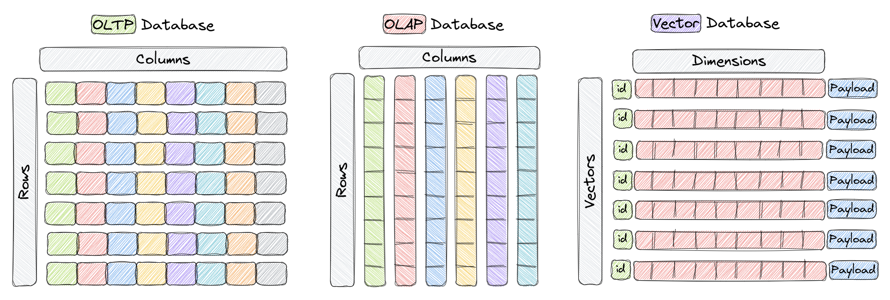
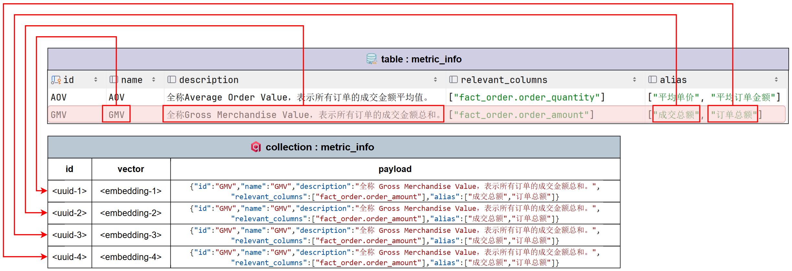
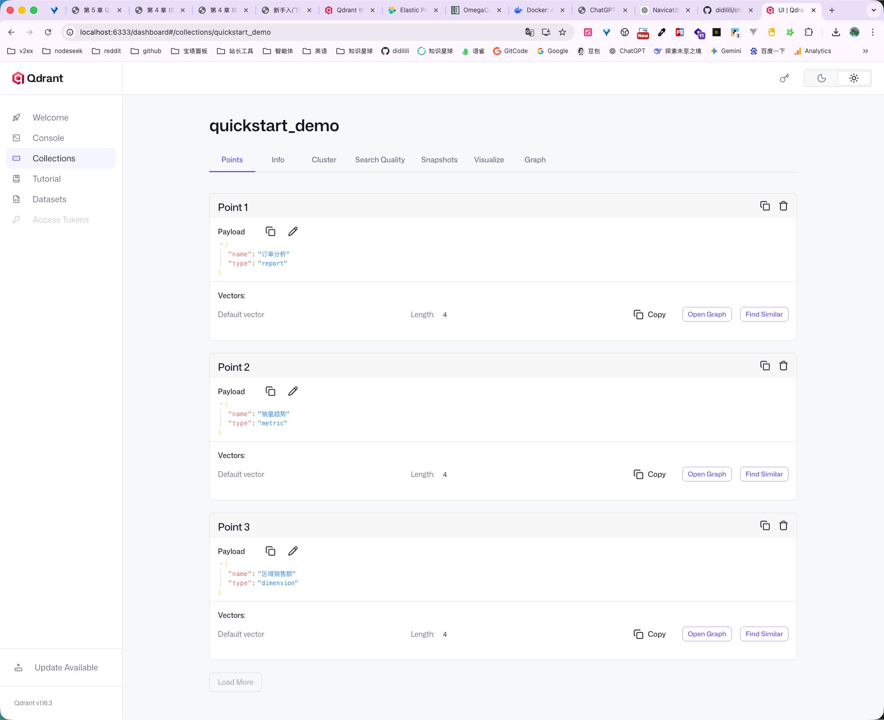
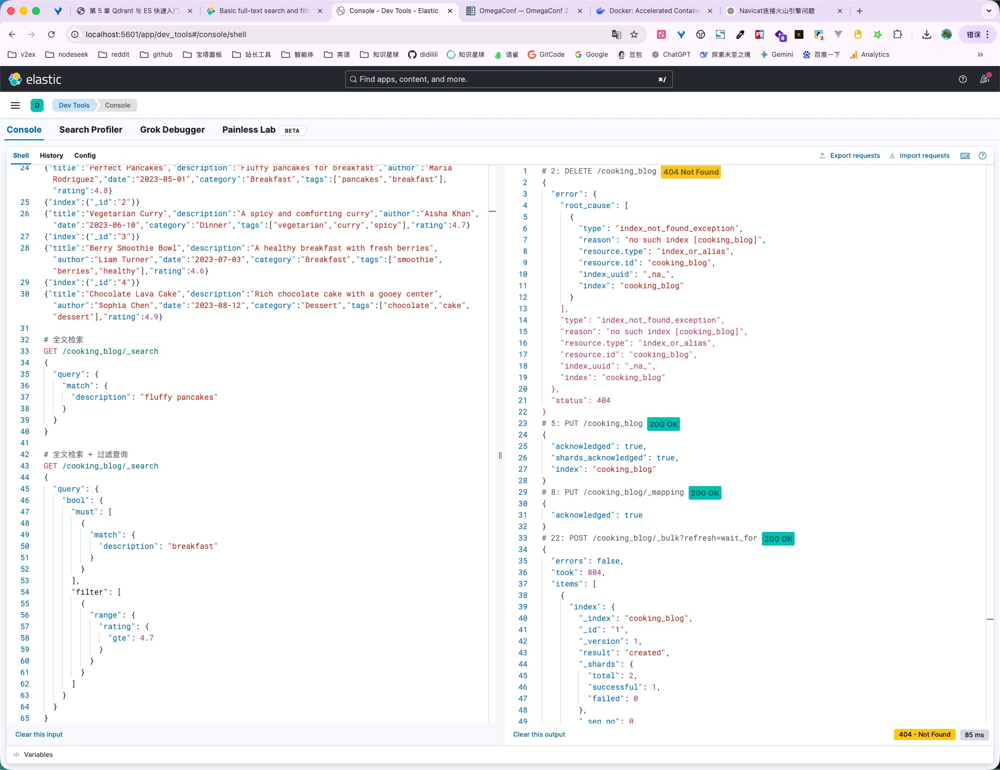
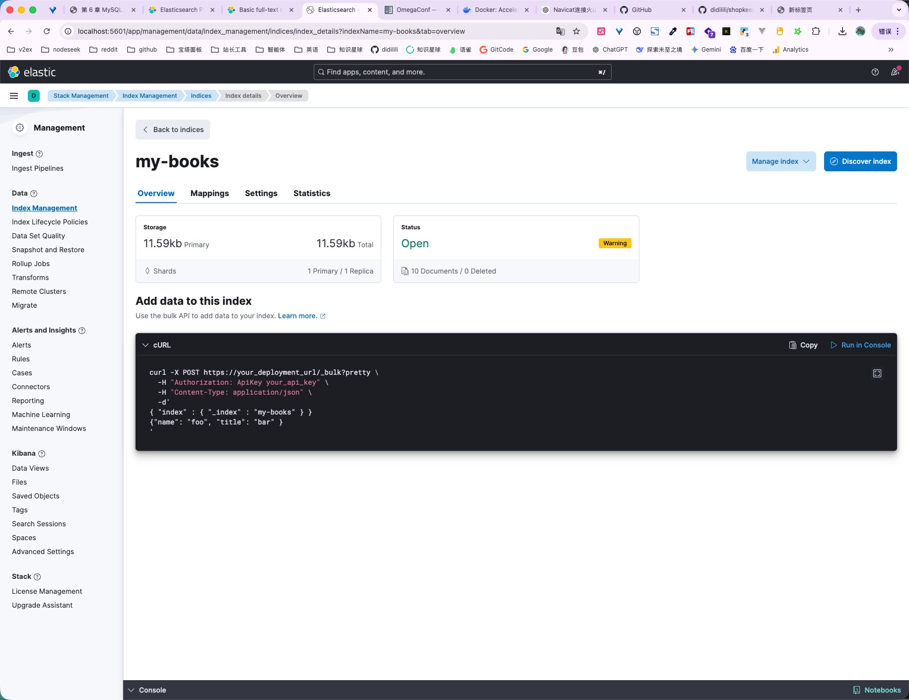

# 5 - 电商问数：Qdrant 与 ES 快速入门与接入

<!-- TS-TRACK-BANNER -->
> **TypeScript 轨道说明**：中文讲解保留原教程；**代码块使用仓库内真实 TypeScript**（`examples/` / 精校案例 / `apps/shop-query-agent`），不再使用机翻 Python。
> 精校清单：[POLISHED-CASES](POLISHED-CASES.md)


## TypeScript 可运行示例（推荐）

本章优先对照仓库真实文件：`apps/shop-query-agent/lib/agent.ts`

```typescript
// apps/shop-query-agent/lib/agent.ts
import { ChatOpenAI } from "@langchain/openai";
import { z } from "zod";
import { buildSchemaContext, recallMetadata, type RecallHit } from "./metadata";
import { executeSelect, validateSql, type QueryResult } from "./sql-engine";

export type AgentStep = {
  id: string;
  title: string;
  detail: string;
  status: "ok" | "error" | "info";
};

export type AgentResponse = {
  question: string;
  steps: AgentStep[];
  hits: RecallHit[];
  sql: string;
  result: QueryResult | null;
  answer: string;
  error?: string;
};

function createModel() {
  const apiKey = process.env.OPENAI_API_KEY;
  if (!apiKey) {
    throw new Error("缺少 OPENAI_API_KEY，请在 apps/shop-query-agent/.env.local 配置");
  }
  return new ChatOpenAI({
    apiKey,
    model: process.env.OPENAI_MODEL || "qwen-plus",
    temperature: 0,
    configuration: process.env.OPENAI_BASE_URL
      ? { baseURL: process.env.OPENAI_BASE_URL }
      : undefined,
  });
}

const SqlPlanSchema = z.object({
  sql: z.string().describe("Single SELECT statement only"),
  rationale: z.string().describe("Why this SQL answers the question"),
});

function fallbackSql(question: string, hits: RecallHit[]): string {
  const values = hits.filter((h) => h.kind === "value");
  const region = values.find((v) => v.column === "region_name")?.value;
  const brand = values.find((v) => v.column === "brand")?.value;
  const level = values.find((v) => v.column === "member_level")?.value;
  const category = values.find((v) => v.column === "category")?.value;

  const wantsGroupRegion = /地区|大区|区域|华北|华东|华南|西南/.test(question);
  const wantsBrand = /品牌/.test(question) || Boolean(brand);
  const wantsLevel = /会员/.test(question) || Boolean(level);

  if (wantsGroupRegion && !region) {
    return [
      "SELECT dim_region.region_name AS region_name, SUM(fact_order.amount) AS total_amount",
      "FROM fact_order",
      "JOIN dim_region ON fact_order.region_id = dim_region.region_id",
      "WHERE fact_order.status = 'paid'",
      "GROUP BY dim_region.region_name",
      "ORDER BY total_amount DESC",
      "LIMIT 20",
    ].join("\n");
  }

  const where: string[] = ["fact_order.status = 'paid'"];
  if (region) where.push(`dim_region.region_name = '${region}'`);
  if (brand) where.push(`dim_product.brand = '${brand}'`);
  if (level) where.push(`dim_customer.member_level = '${level}'`);
  if (category) where.push(`dim_product.category = '${category}'`);

  if (wantsBrand && region) {
    return [
      "SELECT dim_product.brand AS brand, SUM(fact_order.amount) AS total_amount",
      "FROM fact_order",
      "JOIN dim_product ON fact_order.product_id = dim_product.product_id",
      "JOIN dim_region ON fact_order.region_id = dim_region.region_id",
      `WHERE ${where.join(" AND ")}`,
      "GROUP BY dim_product.brand",
      "ORDER BY total_amount DESC",
      "LIMIT 20",
    ].join("\n");
  }

  if (wantsLevel) {
    return [
      "SELECT dim_customer.member_level AS member_level, SUM(fact_order.amount) AS total_amount, COUNT(fact_order.order_id) AS order_cnt",
      "FROM fact_order",
      "JOIN dim_customer ON fact_order.customer_id = dim_customer.customer_id",
      "JOIN dim_region ON fact_order.region_id = dim_region.region_id",
      "JOIN dim_product ON fact_order.product_id = dim_product.product_id",
      `WHERE ${where.join(" AND ")}`,
      "GROUP BY dim_customer.member_level",
      "ORDER BY total_amount DESC",
      "LIMIT 20",
    ].join("\n");
  }

  return [
    "SELECT SUM(fact_order.amount) AS total_amount, SUM(fact_order.quantity) AS total_qty, COUNT(fact_order.order_id) AS order_cnt",
    "FROM fact_order",
    "JOIN dim_customer ON fact_order.customer_id = dim_customer.customer_id",
    "JOIN dim_product ON fact_order.product_id = dim_product.product_id",
    "JOIN dim_region ON fact_order.region_id = dim_region.region_id",
    `WHERE ${where.join(" AND ")}`,
    "LIMIT 20",
  ].join("\n");
}

async function generateSql(question: string, hits: RecallHit[]): Promise<{ sql: string; rationale: string; usedModel: boolean }> {
  const context = buildSchemaContext(hits);

  try {
    const model = createModel().withStructuredOutput(SqlPlanSchema);
    const plan = await model.invoke([
      [
        "system",
        "你是电商数仓 NL2SQL 助手。只输出一条可执行的 SELECT SQL。不要编造不存在的表或字段。",
      ],
      [
        "human",
        `用户问题：${question}\n\n元数据上下文：\n${context}\n\n请生成 SQL。`,
      ],
    ]);
    return { sql: plan.sql, rationale: plan.rationale, usedModel: true };
  } catch (err) {
    const sql = fallbackSql(question, hits);
    const raw = err instanceof Error ? err.message : String(err);
    const short =
      raw.includes("API key") || raw.includes("401")
        ? "未配置有效 OPENAI_API_KEY，已切换规则兜底 SQL"
        : raw.slice(0, 180);
    return {
      sql,
      rationale: short,
      usedModel: false,
    };
  }
}

function summarize(question: string, result: QueryResult, rationale: string): string {
  if (!result.rows.length) {
    return "查询成功，但没有命中数据。可以尝试放宽地区/品牌/会员条件。";
  }
  const preview = result.rows
    .slice(0, 5)
    .map((r) =>
      Object.entries(r)
        .map(([k, v]) => `${k}=${v}`)
        .join(", "),
    )
    .join("；");
  return `针对「${question}」共返回 ${result.rowCount} 行。${rationale} 示例：${preview}`;
}

export async function runShopQueryAgent(question: string): Promise<AgentResponse> {
  const steps: AgentStep[] = [];
  const q = question.trim();
  if (!q) {
    return {
      question,
      steps: [{ id: "1", title: "校验输入", detail: "问题为空", status: "error" }],
      hits: [],
      sql: "",
      result: null,
      answer: "请输入问题",
      error: "empty_question",
    };
  }

  const hits = recallMetadata(q);
  steps.push({
    id: "recall",
    title: "元数据召回",
    detail: hits.map((h) => `[${h.kind}] ${h.label}`).join(" | "),
    status: "ok",
  });

  const gen = await generateSql(q, hits);
  steps.push({
    id: "codegen",
    title: gen.usedModel ? "LLM 生成 SQL" : "规则兜底 SQL",
    detail: gen.rationale,
    status: "ok",
  });

  let sql = gen.sql.trim();
  try {
    sql = validateSql(sql);
    steps.push({
      id: "validate",
      title: "SQL 校验",
      detail: "通过（仅 SELECT，无危险语句）",
      status: "ok",
    });
  } catch (err) {
    // one repair attempt with fallback
    sql = fallbackSql(q, hits);
    steps.push({
      id: "validate",
      title: "SQL 校验失败，已纠错",
      detail: err instanceof Error ? err.message : String(err),
      status: "info",
    });
  }

  try {
    const result = executeSelect(sql);
    steps.push({
      id: "execute",
      title: "执行 SQL",
      detail: `返回 ${result.rowCount} 行`,
      status: "ok",
    });
    const answer = summarize(q, result, gen.rationale);
    steps.push({
      id: "answer",
      title: "生成结论",
      detail: answer,
      status: "ok",
    });
    return { question: q, steps, hits, sql, result, answer };
  } catch (err) {
    const message = err instanceof Error ? err.message : String(err);
    // final fallback
    try {
      const fb = fallbackSql(q, hits);
      const result = executeSelect(fb);
      steps.push({
        id: "execute",
        title: "执行失败后启用兜底 SQL",
        detail: message,
        status: "info",
      });
      const answer = summarize(q, result, "使用兜底查询");
      return {
        question: q,
        steps,
        hits,
        sql: fb,
        result,
        answer,
      };
    } catch (err2) {
      const msg2 = err2 instanceof Error ? err2.message : String(err2);
      steps.push({
        id: "execute",
        title: "执行 SQL 失败",
        detail: msg2,
        status: "error",
      });
      return {
        question: q,
        steps,
        hits,
        sql,
        result: null,
        answer: "查询失败",
        error: msg2,
      };
    }
  }
}
```

```bash
npx tsx apps/shop-query-agent/lib/agent.ts
```


---

**本章课程目标：**

- 理解 `Qdrant` 和 `Elasticsearch` 在「电商问数」里的职责边界，而不是把它们都当成“检索组件”混在一起。
- 掌握向量数据库、全文检索、`mapping`、`collection`、`payload` 等核心概念。
- 看懂项目里的 `QdrantClientManager` 和 `ESClientManager` 是如何封装、初始化与测试的。

**学习建议：** Qdrant 和 ES 都叫检索，但不要把它们混成一个东西。读这篇时先记住分工：Qdrant 更适合语义相似度召回，ES 更适合全文匹配和精确过滤。跑 quickstart 的目的不是熟练所有 API，而是看清 collection / point / payload 和 index / document / mapping 分别在项目里对应什么。

**对应代码分支：** `05-qdrant-es`

---

很多同学第一次看到这套项目时，都会问一个很自然的问题：

> 既然都是“检索”，为什么还要同时接 `Qdrant` 和 `Elasticsearch`？

答案是：**它们解决的不是同一类问题。**

在「电商问数」里，这几个基础设施的分工可以概括成下面这张表：

| 组件            | 在项目中的核心职责             | 最擅长解决的问题                                 |
| --------------- | ------------------------------ | ------------------------------------------------ |
| `MySQL`         | 存储权威结构化元数据与数仓数据 | 表、字段、指标、关系、样例值等结构化信息怎么保存 |
| `Qdrant`        | 存储字段和指标的向量索引       | “语义上谁更像”                                   |
| `Elasticsearch` | 存储字段取值的全文索引         | “文本上谁能匹配上”                               |

把它们放回问数链路，职责会更清楚：

```text
用户自然语言问题
  -> Embedding 服务把文本转成向量
  -> Qdrant 召回语义相关的字段 / 指标
  -> Elasticsearch 检索可能相关的字段取值
  -> MySQL 补全表结构、字段定义、指标定义
  -> LLM 基于上下文生成 SQL
```

所以，本章真正要讲的不是两个彼此独立的客户端，而是「电商问数」的**检索基础设施层**：为什么需要它们、它们分别存什么、在项目里怎么接、后面又怎么被业务层调用。

---

## 1、Qdrant 客户端接入

### 1.1 Qdrant 简介

官方文档：https://qdrant.tech/documentation/overview/what-is-qdrant/ （英）

一句话来说，`Qdrant` 就是：**一个专门用于保存向量并执行相似度检索的数据库。**

但放到当前项目里，这句话还不够具体。更准确的说法应该是：

- 字段信息会被向量化后写入 `Qdrant`
- 指标信息也会被向量化后写入 `Qdrant`
- 用户问题到来时，同样会先被向量化
- 再用“问题向量”去搜索最相近的字段和指标

也就是说，`Qdrant` 在这里并不承担“保存全部元数据”的职责，而是承担：**在海量字段和指标候选中，先快速缩小语义问题空间。**

这一点非常关键。因为企业问数场景里，表和字段通常很多，如果没有这一步语义召回，大模型需要面对的候选上下文会非常多，后面的 SQL 生成更容易跑偏。

当前项目构建字段和指标向量索引时，不是只给每个实体写一条向量，而是会把名称、描述、别名分别向量化后再写入向量库。这样做的目的，是让系统既能听懂正式名，也能听懂业务别名和自然语言表达。

### 1.2 区分 OLTP、OLAP 和向量数据库



理解 `Qdrant` 之前，一个常见误区是把它简单理解成“另一种 MySQL”。

如果直接结合上面这张图来看，它本质上是在对比三类数据库的**数据组织方式**：

- **左边 `OLTP database`**
  - 重点是按“行”组织数据
  - 更适合支撑业务系统按一条记录去查、改、写

- **中间 `OLAP database`**
  - 重点是按“列”组织数据
  - 更适合做统计分析，因为分析场景经常需要一次扫描某一整列数据

- **右边 `Vector database`**
  - 核心单位不再是“表里的一行记录”，而是一个向量点
  - 一个点通常由 `id`、`vector`、`payload` 组成

所以这张图真正想表达的是：**数据组织方式不同，决定了它们擅长解决的问题也不同。**

先把三类数据库粗略理解成下面这样：

| 类型          | 典型代表                        | 主要用途               | 数据组织方式                                 |
| ------------- | ------------------------------- | ---------------------- | -------------------------------------------- |
| `OLTP` 数据库 | `MySQL`、`PostgreSQL`、`Oracle` | 支撑日常业务交易       | 通常以表的行列结构为主，更偏按行读写         |
| `OLAP` 数据库 | `Hive`、`ClickHouse`、`Doris`   | 支撑统计分析和报表计算 | 也是表结构，但更适合分析型查询，常见按列存储 |
| 向量数据库    | `Qdrant`                        | 支撑语义相似度检索     | 以向量点为核心数据单位                       |

如果再压缩成一句最容易记忆的话，可以这样区分：

- `OLTP（Online Transaction Processing）` 更偏**业务数据库**，适合查询某一行
- `OLAP（Online Analytical Processing）` 更偏**分析型数据库**，适合查询某一列
- 向量数据库更偏**语义相似度检索**

把这张图再映射回「电商问数」项目，分工就更清楚了：

- `MySQL` 负责存元数据和数仓模拟数据
- `Qdrant` 负责语义相似度召回，根据向量相似度召回相关字段和指标
- `Elasticsearch` 不等同于这里的 `OLAP`，它更偏搜索引擎和全文检索系统；在本项目里主要负责字段取值检索

你可能会问，**那 `Elasticsearch` 属于这三类数据库中的哪一种？**

更具体地说，`Elasticsearch` 并不完全等同于这里的任何一类。它更适合被理解成：**搜索引擎 / 全文检索系统**

在「电商问数」项目里，它承担的职责很明确：

- 根据用户问题里的自然语言表达
- 去匹配真实存在的字段取值
- 为后续 SQL 生成补充“值域层”的上下文信息

所以这里最重要的结论不是“谁替代谁”，而是：**结构化存储、统计分析、语义召回、全文检索，往往需要不同类型的基础服务共同完成。**

### 1.3 理解 Qdrant 核心概念



Qdrant 官方对 `collection` 的描述很清楚：**同一个 collection 里的 points 使用相同维度，并按同一种距离度量进行比较。**

如果是第一次接触向量数据库，先掌握下面几个概念：

| 概念         | 可以怎样理解                                   |
| ------------ | ---------------------------------------------- |
| `collection` | 一组向量点的集合，可以类比成“同类向量的一张表” |
| `point`      | 集合中的一条记录                               |
| `vector`     | 这条记录对应的向量                             |
| `payload`    | 跟着向量一起保存的业务字段                     |
| `distance`   | 用什么方式比较“像不像”                         |

一个 `point` 最常见的结构如下：

```json
{
  "id": "column-001",
  "vector": [0.12, 0.98, 0.44, 0.31],
  "payload": {
    "name": "region_name",
    "description": "地区名称"
  }
}
```

这里有两个参数特别重要：

- `size`：向量维度，必须和 Embedding 模型输出维度一致
- `distance`：相似度 / 距离计算方式，当前项目使用 `COSINE`

### 1.4 Qdrant 快速入门案例

这份 quickstart 演示的是最基础的 4 步：

```text
初始化客户端
  -> 创建 collection
  -> 写入 points
  -> query_points 查询相似向量
```

把这条思路进一步落成一个最小可运行的 `.py` 示例：

项目对应文件路径：`shopkeeper-agent/examples/qdrant_quickstart_demo.py`

```typescript
// Real TypeScript from repo: apps/shop-query-agent/lib/agent.ts
import { ChatOpenAI } from "@langchain/openai";
import { z } from "zod";
import { buildSchemaContext, recallMetadata, type RecallHit } from "./metadata";
import { executeSelect, validateSql, type QueryResult } from "./sql-engine";

export type AgentStep = {
  id: string;
  title: string;
  detail: string;
  status: "ok" | "error" | "info";
};

export type AgentResponse = {
  question: string;
  steps: AgentStep[];
  hits: RecallHit[];
  sql: string;
  result: QueryResult | null;
  answer: string;
  error?: string;
};

function createModel() {
  const apiKey = process.env.OPENAI_API_KEY;
  if (!apiKey) {
    throw new Error("缺少 OPENAI_API_KEY，请在 apps/shop-query-agent/.env.local 配置");
  }
  return new ChatOpenAI({
    apiKey,
    model: process.env.OPENAI_MODEL || "qwen-plus",
    temperature: 0,
    configuration: process.env.OPENAI_BASE_URL
      ? { baseURL: process.env.OPENAI_BASE_URL }
      : undefined,
  });
}

const SqlPlanSchema = z.object({
  sql: z.string().describe("Single SELECT statement only"),
  rationale: z.string().describe("Why this SQL answers the question"),
});

function fallbackSql(question: string, hits: RecallHit[]): string {
  const values = hits.filter((h) => h.kind === "value");
  const region = values.find((v) => v.column === "region_name")?.value;
  const brand = values.find((v) => v.column === "brand")?.value;
  const level = values.find((v) => v.column === "member_level")?.value;
  const category = values.find((v) => v.column === "category")?.value;

  const wantsGroupRegion = /地区|大区|区域|华北|华东|华南|西南/.test(question);
  const wantsBrand = /品牌/.test(question) || Boolean(brand);
  const wantsLevel = /会员/.test(question) || Boolean(level);

  if (wantsGroupRegion && !region) {
    return [
      "SELECT dim_region.region_name AS region_name, SUM(fact_order.amount) AS total_amount",
      "FROM fact_order",
      "JOIN dim_region ON fact_order.region_id = dim_region.region_id",
      "WHERE fact_order.status = 'paid'",
      "GROUP BY dim_region.region_name",
      "ORDER BY total_amount DESC",
      "LIMIT 20",
    ].join("\n");
  }

  const where: string[] = ["fact_order.status = 'paid'"];
  if (region) where.push(`dim_region.region_name = '${region}'`);
  if (brand) where.push(`dim_product.brand = '${brand}'`);
  if (level) where.push(`dim_customer.member_level = '${level}'`);
  if (category) where.push(`dim_product.category = '${category}'`);

  if (wantsBrand && region) {
    return [
      "SELECT dim_product.brand AS brand, SUM(fact_order.amount) AS total_amount",
      "FROM fact_order",
      "JOIN dim_product ON fact_order.product_id = dim_product.product_id",
      "JOIN dim_region ON fact_order.region_id = dim_region.region_id",
      `WHERE ${where.join(" AND ")}`,
      "GROUP BY dim_product.brand",
      "ORDER BY total_amount DESC",
      "LIMIT 20",
    ].join("\n");
  }

  if (wantsLevel) {
    return [
      "SELECT dim_customer.member_level AS member_level, SUM(fact_order.amount) AS total_amount, COUNT(fact_order.order_id) AS order_cnt",
      "FROM fact_order",
      "JOIN dim_customer ON fact_order.customer_id = dim_customer.customer_id",
      "JOIN dim_region ON fact_order.region_id = dim_region.region_id",
      "JOIN dim_product ON fact_order.product_id = dim_product.product_id",
      `WHERE ${where.join(" AND ")}`,
      "GROUP BY dim_customer.member_level",
      "ORDER BY total_amount DESC",
      "LIMIT 20",
    ].join("\n");
  }

  return [
    "SELECT SUM(fact_order.amount) AS total_amount, SUM(fact_order.quantity) AS total_qty, COUNT(fact_order.order_id) AS order_cnt",
    "FROM fact_order",
    "JOIN dim_customer ON fact_order.customer_id = dim_customer.customer_id",
    "JOIN dim_product ON fact_order.product_id = dim_product.product_id",
    "JOIN dim_region ON fact_order.region_id = dim_region.region_id",
    `WHERE ${where.join(" AND ")}`,
    "LIMIT 20",
  ].join("\n");
}

async function generateSql(question: string, hits: RecallHit[]): Promise<{ sql: string; rationale: string; usedModel: boolean }> {
  const context = buildSchemaContext(hits);

  try {
    const model = createModel().withStructuredOutput(SqlPlanSchema);
    const plan = await model.invoke([
      [
        "system",
        "你是电商数仓 NL2SQL 助手。只输出一条可执行的 SELECT SQL。不要编造不存在的表或字段。",
      ],
      [
        "human",
        `用户问题：${question}\n\n元数据上下文：\n${context}\n\n请生成 SQL。`,
      ],
    ]);
    return { sql: plan.sql, rationale: plan.rationale, usedModel: true };
  } catch (err) {
    const sql = fallbackSql(question, hits);
    const raw = err instanceof Error ? err.message : String(err);
    const short =
      raw.includes("API key") || raw.includes("401")
        ? "未配置有效 OPENAI_API_KEY，已切换规则兜底 SQL"
        : raw.slice(0, 180);
    return {
      sql,
      rationale: short,
      usedModel: false,
    };
  }
}

function summarize(question: string, result: QueryResult, rationale: string): string {
  if (!result.rows.length) {
    return "查询成功，但没有命中数据。可以尝试放宽地区/品牌/会员条件。";
  }
  const preview = result.rows
    .slice(0, 5)
    .map((r) =>
      Object.entries(r)
        .map(([k, v]) => `${k}=${v}`)
        .join(", "),
    )
    .join("；");
  return `针对「${question}」共返回 ${result.rowCount} 行。${rationale} 示例：${preview}`;
}

export async function runShopQueryAgent(question: string): Promise<AgentResponse> {
  const steps: AgentStep[] = [];
  const q = question.trim();
  if (!q) {
    return {
      question,
      steps: [{ id: "1", title: "校验输入", detail: "问题为空", status: "error" }],
      hits: [],
      sql: "",
      result: null,
      answer: "请输入问题",
      error: "empty_question",
    };
  }

  const hits = recallMetadata(q);
  steps.push({
    id: "recall",
    title: "元数据召回",
    detail: hits.map((h) => `[${h.kind}] ${h.label}`).join(" | "),
    status: "ok",
  });

  const gen = await generateSql(q, hits);
  steps.push({
    id: "codegen",
    title: gen.usedModel ? "LLM 生成 SQL" : "规则兜底 SQL",
    detail: gen.rationale,
    status: "ok",
  });

  let sql = gen.sql.trim();
  try {
    sql = validateSql(sql);
    steps.push({
      id: "validate",
      title: "SQL 校验",
      detail: "通过（仅 SELECT，无危险语句）",
      status: "ok",
    });
  } catch (err) {
    // one repair attempt with fallback
    sql = fallbackSql(q, hits);
    steps.push({
      id: "validate",
      title: "SQL 校验失败，已纠错",
      detail: err instanceof Error ? err.message : String(err),
      status: "info",
    });
  }

  try {
    const result = executeSelect(sql);
    steps.push({
      id: "execute",
      title: "执行 SQL",
      detail: `返回 ${result.rowCount} 行`,
      status: "ok",
    });
    const answer = summarize(q, result, gen.rationale);
    steps.push({
      id: "answer",
      title: "生成结论",
      detail: answer,
      status: "ok",
    });
    return { question: q, steps, hits, sql, result, answer };
  } catch (err) {
    const message = err instanceof Error ? err.message : String(err);
    // final fallback
    try {
      const fb = fallbackSql(q, hits);
      const result = executeSelect(fb);
      steps.push({
        id: "execute",
        title: "执行失败后启用兜底 SQL",
        detail: message,
        status: "info",
      });
      const answer = summarize(q, result, "使用兜底查询");
      return {
        question: q,
        steps,
        hits,
        sql: fb,
        result,
        answer,
      };
    } catch (err2) {
      const msg2 = err2 instanceof Error ? err2.message : String(err2);
      steps.push({
        id: "execute",
        title: "执行 SQL 失败",
        detail: msg2,
        status: "error",
      });
      return {
        question: q,
        steps,
        hits,
        sql,
        result: null,
        answer: "查询失败",
        error: msg2,
      };
    }
  }
}
```

执行文件验证，成功：

```bash
(shopkeeper-agent) didilili@DidililiMacBook-Pro shopkeeper-agent % npx tsx examples.qdrant_quickstart_demo

1. 已创建集合：quickstart_demo
2. 已写入 3 个向量点。
3. 查询向量：[0.2, 0.1, 0.9, 0.7]
4. 查询结果：
   1) id=1, score=0.8946, payload={'name': '订单分析', 'type': 'report'}
   2) id=3, score=0.8387, payload={'name': '区域销售额', 'type': 'dimension'}
   3) id=2, score=0.6660, payload={'name': '销量趋势', 'type': 'metric'}
```

这里最值得掌握的不是样例数据本身，而是三个 API：

- `create_collection(...)`：创建集合，并声明维度与距离度量
- `upsert(...)`：按 `id` 更新或插入 points
- `query_points(...)`：根据查询向量返回最相关的点

Qdrant 官方 API 文档里，`query_points` 还支持 `score_threshold`、`limit`、`filter`、`with_payload`、`with_vector` 等参数。当前项目最常用的是：

- `score_threshold`：控制最低召回分数
- `limit`：控制返回条数
- `with_payload`：控制是否把业务字段一起带回

`Qdrant` 自带可视化页面，通常可以通过 http://localhost:6333/dashboard 打开控制台页面，查看当前有哪些 `collection`、点数据是否写入成功。这对开发阶段排查问题会比较方便。



### 1.5 封装 Qdrant 客户端

理解了 `Qdrant` 的基本概念之后，再来看项目代码里的封装就顺了。

在这个项目里，我们并不是在每个地方都临时 new 一个客户端，而是专门写了一个 `QdrantClientManager`。这样做主要是为了统一处理这几件事：客户端初始化，客户端关闭，读取配置文件中的服务地址，保持项目里只使用同一套客户端对象。

另外，这一节还有一个很重要的演进点：前面快速入门时，示例代码先用同步客户端帮助我们理解流程；但真正放到项目里时，更合适的做法是改成**异步客户端**。

原因也不复杂：

- `Qdrant` 的读写本质上是网络 `I/O`
- 网络请求发出去之后，程序往往需要等待服务端响应
- 如果使用异步客户端，这段等待时间就可以把 `CPU` 让给其他协程

所以，项目最终采用 `AsyncQdrantClient`，本质上是为了和整套异步后端保持一致，减少阻塞，提高整体并发利用率。

项目对应文件路径：`shopkeeper-agent/app/clients/qdrant_client_manager.py`

```typescript
// Real TypeScript from repo: apps/shop-query-agent/lib/metadata.ts
/**
 * Metadata knowledge base (simplified).
 * Real project: MySQL meta + Qdrant + ES.
 * Demo: in-memory field/metric catalog + keyword/value map.
 */

export type FieldMeta = {
  table: string;
  column: string;
  role: "metric" | "dimension" | "id" | "time" | "status";
  aliases: string[];
  description: string;
  sampleValues?: string[];
};

export type MetricMeta = {
  name: string;
  expression: string;
  aliases: string[];
  description: string;
};

export const fieldCatalog: FieldMeta[] = [
  {
    table: "fact_order",
    column: "amount",
    role: "metric",
    aliases: ["销售额", "成交额", "销售总额", "金额", "GMV"],
    description: "订单成交金额",
  },
  {
    table: "fact_order",
    column: "quantity",
    role: "metric",
    aliases: ["销量", "数量", "件数"],
    description: "订单商品数量",
  },
  {
    table: "fact_order",
    column: "order_date",
    role: "time",
    aliases: ["日期", "下单日期", "时间"],
    description: "订单日期 YYYY-MM-DD",
  },
  {
    table: "fact_order",
    column: "status",
    role: "status",
    aliases: ["订单状态", "状态"],
    description: "paid / refunded / pending",
    sampleValues: ["paid", "refunded", "pending"],
  },
  {
    table: "dim_region",
    column: "region_name",
    role: "dimension",
    aliases: ["地区", "大区", "区域"],
    description: "销售大区",
    sampleValues: ["华北", "华东", "华南", "西南"],
  },
  {
    table: "dim_product",
    column: "brand",
    role: "dimension",
    aliases: ["品牌"],
    description: "商品品牌",
    sampleValues: ["苹果", "华为", "小米"],
  },
  {
    table: "dim_product",
    column: "category",
    role: "dimension",
    aliases: ["品类", "类目"],
    description: "商品品类",
    sampleValues: ["手机", "耳机"],
  },
  {
    table: "dim_customer",
    column: "member_level",
    role: "dimension",
    aliases: ["会员", "会员等级", "等级"],
    description: "会员等级",
    sampleValues: ["普通", "黄金", "钻石"],
  },
  {
    table: "dim_customer",
    column: "city",
    role: "dimension",
    aliases: ["城市"],
    description: "客户城市",
    sampleValues: ["北京", "上海", "杭州", "深圳", "成都"],
  },
];

export const metricCatalog: MetricMeta[] = [
  {
    name: "销售总额",
    expression: "SUM(fact_order.amount)",
    aliases: ["销售额", "成交总额", "GMV", "总销售额"],
    description: "订单金额合计（默认仅 paid）",
  },
  {
    name: "订单量",
    expression: "COUNT(DISTINCT fact_order.order_id)",
    aliases: ["订单数", "单量"],
    description: "订单数",
  },
  {
    name: "销售件数",
    expression: "SUM(fact_order.quantity)",
    aliases: ["销量", "件数"],
    description: "销售件数合计",
  },
];

export type RecallHit = {
  kind: "field" | "metric" | "value";
  score: number;
  label: string;
  detail: string;
  table?: string;
  column?: string;
  value?: string;
};

function includesAny(text: string, words: string[]) {
  return words.some((w) => text.includes(w));
}

/** Multi-path recall: fields / metrics / values from natural language. */
export function recallMetadata(question: string): RecallHit[] {
  const q = question.trim();
  const hits: RecallHit[] = [];

  for (const m of metricCatalog) {
    const keys = [m.name, ...m.aliases];
    if (includesAny(q, keys)) {
      hits.push({
        kind: "metric",
        score: 3,
        label: m.name,
        detail: `${m.expression} | ${m.description}`,
      });
    }
  }

  for (const f of fieldCatalog) {
    const keys = [f.column, ...f.aliases];
    if (includesAny(q, keys)) {
      hits.push({
        kind: "field",
        score: 2,
        label: `${f.table}.${f.column}`,
        detail: `${f.role} | ${f.description}`,
        table: f.table,
        column: f.column,
      });
    }
    for (const v of f.sampleValues ?? []) {
      if (q.includes(v)) {
        hits.push({
          kind: "value",
          score: 4,
          label: `${f.table}.${f.column} = ${v}`,
          detail: `命中字段取值「${v}」`,
          table: f.table,
          column: f.column,
          value: v,
        });
      }
    }
  }

  // defaults if nothing matched
  if (!hits.some((h) => h.kind === "metric")) {
    hits.push({
      kind: "metric",
      score: 1,
      label: "销售总额",
      detail: "SUM(fact_order.amount) | 默认指标",
    });
  }

  hits.sort((a, b) => b.score - a.score);
  // de-dup by label
  const seen = new Set<string>();
  return hits.filter((h) => {
    if (seen.has(h.label)) return false;
    seen.add(h.label);
    return true;
  });
}

export function buildSchemaContext(hits: RecallHit[]): string {
  const fields = fieldCatalog
    .map(
      (f) =>
        `- ${f.table}.${f.column} (${f.role}) aliases=${f.aliases.join("/")}; ${f.description}`,
    )
    .join("\n");
  const metrics = metricCatalog
    .map((m) => `- ${m.name}: ${m.expression}; aliases=${m.aliases.join("/")}`)
    .join("\n");
  const hitText = hits
    .map((h) => `- [${h.kind}] ${h.label}: ${h.detail}`)
    .join("\n");

  return [
    "可用表：fact_order, dim_customer, dim_product, dim_region",
    "关联键：fact_order.customer_id=dim_customer.customer_id; fact_order.product_id=dim_product.product_id; fact_order.region_id=dim_region.region_id",
    "字段目录：",
    fields,
    "指标目录：",
    metrics,
    "本问题召回命中：",
    hitText,
    "SQL 规则：只写 SELECT；默认 status='paid'；表名列名必须来自目录；可用 GROUP BY；limit <= 50。",
  ].join("\n");
}
```

执行文件验证，成功：

```bash
(shopkeeper-agent) didilili@DidililiMacBook-Pro shopkeeper-agent % npx tsx app.clients.qdrant_client_manager
points=[ScoredPoint(id=33, version=4, score=0.9287777, payload={}, vector=None, shard_key=None, order_value=None), ScoredPoint(id=45, version=4, score=0.9019778, payload={}, vector=None, shard_key=None, order_value=None), ScoredPoint(id=58, version=4, score=0.90187067, payload={}, vector=None, shard_key=None, order_value=None), ScoredPoint(id=75, version=4, score=0.8799222, payload={}, vector=None, shard_key=None, order_value=None), ScoredPoint(id=66, version=4, score=0.87921834, payload={}, vector=None, shard_key=None, order_value=None), ScoredPoint(id=87, version=4, score=0.8753782, payload={}, vector=None, shard_key=None, order_value=None), ScoredPoint(id=73, version=4, score=0.86765623, payload={}, vector=None, shard_key=None, order_value=None), ScoredPoint(id=27, version=4, score=0.86216307, payload={}, vector=None, shard_key=None, order_value=None), ScoredPoint(id=16, version=4, score=0.8618801, payload={}, vector=None, shard_key=None, order_value=None), ScoredPoint(id=69, version=4, score=0.8546801, payload={}, vector=None, shard_key=None, order_value=None)]
```

**代码分析：**

#### 1.5.1 理解文件的两层职责

这一节可以按两个层次来理解这个文件。第一个层次，是把 `Qdrant` 客户端封装成项目里的基础服务。第二个层次，是用文件底部的测试代码演示一条最小可运行链路。这样看时，这个文件的职责就很清楚了：**上半部分负责管理客户端，下半部分负责说明客户端怎么用**。

#### 1.5.2 上半部分：QdrantClientManager 在做什么

先看上半部分的管理器代码。这里的核心目标不是“多写一个类”，而是把 `Qdrant` 客户端的初始化和关闭统一收口，不让项目里每个地方都自己去创建和销毁连接。

这一部分最值得注意的是下面几个位置：

- `self.qdrant_config`：保存 `Qdrant` 配置对象，后面要从这里读取 `host`、`port` 等参数
- `_get_url()`：根据配置拼出完整服务地址，例如 `http://localhost:6333`
- `init()`：真正初始化 `AsyncQdrantClient`
- `close()`：在程序退出时统一关闭客户端连接
- `qdrant_client_manager = QdrantClientManager(app_config.qdrant)`：在模块加载时创建一份全局可复用的管理器对象

#### 1.5.3 下半部分：测试代码演示的最小链路

再看下半部分的测试代码，它并不是为了写一段“临时脚本”，而是在演示这个客户端封装好之后，最基本的使用流程是什么。它对应的就是下面这条链路：

1. 判断 `collection` 是否存在
2. 如果不存在，就调用 `create_collection(...)`
3. 通过 `upsert(...)` 写入一批向量点
4. 通过 `query_points(...)` 做相似度查询

把这四步看懂，这个文件就理解了一大半。

- `collection_name="my_collection"`：指定当前操作的是哪一个集合
- `models.VectorParams(size=10, distance=models.Distance.COSINE)`：指定向量维度和距离计算方式
- `models.PointStruct(...)`：表示单个点数据，里面至少会有 `id` 和 `vector`
- `limit=10`：表示最多返回前 10 个最相近结果
- `score_threshold=0.8`：表示只保留分数不低于 0.8 的结果

#### 1.5.4 异步写法和真实项目里的向量来源

因为这里使用的是异步客户端，所以代码写法上还有两个同步示例里不会出现的点：和服务端交互的方法，都要通过 `await` 调用；测试逻辑要先放进 `async def test()` 这样的异步函数里，再通过 `asyncio.run(test())` 执行。

这里为了演示流程，向量是随机生成的。真实项目里，写入 `Qdrant` 的向量并不是随便生成的，而是来自 `Embedding` 模型对字段说明、指标说明或用户问题的编码结果。

---

## 2、Elasticsearch 客户端接入

### 2.1 ES 简介

`Elasticsearch` 在当前项目里不是用来替代 MySQL，也不是用来替代 Qdrant。

它最核心的职责是：**为字段取值建立全文索引，让系统能把用户的自然语言表达映射到真实存在的值域。**

例如：

- 用户说“华北地区”
- 用户说“数码品类”
- 用户说“直营门店”

这些表达不一定是字段名，更可能是某个维度字段里的具体取值。这个时候，光靠向量召回字段和指标还不够，还要补一层“值域检索”，这就是 ES 在当前项目里的位置。

### 2.2 ES 基础概念

官方文档：https://www.elastic.co/guide/en/elasticsearch/reference/8.19/documents-indices.html （英）

在 Elasticsearch 里，先掌握四个词：

| 概念       | 可以怎样理解                       |
| ---------- | ---------------------------------- |
| `index`    | 一组同类文档的逻辑容器             |
| `document` | index 中的一条 JSON 文档           |
| `field`    | document 中的一个字段              |
| `mapping`  | 定义字段结构、字段类型以及索引行为 |

如果和其他基础设施做类比：

| 系统            | 结构类比                                |
| --------------- | --------------------------------------- |
| `MySQL`         | 表 -> 行 -> 列                          |
| `Qdrant`        | collection -> point -> vector / payload |
| `Elasticsearch` | index -> document -> field              |

也就是说，虽然三者都在“存数据”，但它们组织数据的方式并不一样：

- MySQL 更偏结构化记录
- Qdrant 更偏向量点
- Elasticsearch 更偏 JSON 文档

如果用最熟悉的 JSON 形式来理解，一个 `document` 大致就像这样：

```json
{
  "id": "v_001",
  "value": "华北地区",
  "column_id": "dim_region.region_name"
}
```

在这个例子里：

- 整个 JSON 对象就是一个 `document`
- `id`、`value`、`column_id` 就是 `field`
- 这些文档会被存进某个 `index`

如果把它和前面讲过的 `Qdrant` 再对一下，会更容易理解：

- 在 `Qdrant` 里，我们会说“往某个 `collection` 里写入一个 `point`”
- 在 `Elasticsearch` 里，我们会说“往某个 `index` 里写入一个 `document`”

这也解释了为什么这里要特别强调：`index` 在这里是**名词**，表示一个索引容器；而不是后面 API 里的那个“写入动作”。另外，`Elasticsearch` 返回结果里经常会出现一些以下划线开头的字段，例如 `_index`、`_id`、`_source`，这些属于元数据字段，属于 ES 自带的字段。

这里先做一个简要对应：

- `_index` 表示这条数据属于哪个索引
- `_id` 表示这条数据在索引中的唯一标识
- `_source` 里存放的，才是我们真正写进去的业务数据

### 2.3 理解 mapping

`mapping` 本质是 `Elasticsearch` 里的“表结构说明”。

如果之前接触过关系型数据库、数据建模，或者在别的技术栈里见过 `schema` 这个词，这里可以直接把两者对应起来：`mapping` 是 `Elasticsearch` 里的说法，而 `schema` 是很多数据库或数据系统里更常见的说法。

它们在这里表达的核心意思是一样的：**用一套结构定义，描述这一类数据有哪些字段、字段是什么类型、应该按什么方式被索引和存储。**

这里还要特别区分两种常见方式：

- `dynamic mapping`：让 `ES` 根据写入的数据自动推断字段类型
- `explicit mapping`：由我们显式定义字段结构和字段类型

从工程角度看，当前项目更适合使用 **显式定义** 的方式，因为这样更可控，也更方便我们精确设计检索行为。

### 2.4 text 和 keyword 区别

`mapping` 不只是定义“有哪些字段”，还要定义“字段的数据类型是什么”。而 `text` 和 `keyword`，就是 `ES` 里两种非常常见、但处理方式完全不同的字段类型。

也就是说，

1. 先有 `index`
2. `index` 里存的是 `document`
3. `document` 里有很多 `field`
4. `mapping` 要定义这些 `field` 的类型
5. 当字段类型是字符串时，最常见的两种类型就是 `text` 和 `keyword`

`text` 类型更偏**全文检索**。它适合保存一段可以被自然语言搜索的文本内容。为了支持这类搜索，`ES` 往往会先对文本做分词，再建立倒排索引。这意味着什么？意味着你存进去的不是一个“必须原样完全相等”的字符串，而是一段可以被拆开、被搜索、被匹配的文本。

例如：`"华北地区"`、`"数码品类"`、`"近三个月销售额"`。这类值如果定义成 `text`，用户在查询时不一定非得一模一样地输入整串文本，而是可以通过自然语言方式去匹配它们。

而`keyword` 更偏**精确匹配**。它不会像 `text` 那样做分词，更适合存那些“必须按原值整体处理”的字段。

例如：主键 `id`、字段标识 `column_id`、状态码、类别编码。这类值通常不是拿来做全文搜索的，而是要么相等，要么不相等，所以更适合定义成 `keyword`。

**字段类型不同，ES 后续建立索引和执行检索的方式也不同**。这正是 `mapping` 为什么重要的原因。我们并不是随便把字段声明成某个类型，而是在提前告诉 `ES`：这个字段将来打算怎么被搜索。

放到「电商问数」项目里，这个区别就非常具体了：字段取值里的 `value` 适合定义为 `text`。因为用户会用自然语言去搜它，例如“华北地区”“数码品类”。`id` 和 `column_id` 更适合定义为 `keyword`。因为它们更像结构化标识，不需要分词，只需要精确匹配。

这一点在项目真实代码里也能看到，对应文件：`shopkeeper-agent/app/repositories/es/value_es_repository.py`

其中索引映射大致如下：

```typescript
// Real TypeScript from repo: apps/shop-query-agent/lib/sql-engine.ts
/**
 * Extremely small SQL executor for teaching demos.
 * Supports a subset of SELECT ... FROM ... JOIN ... WHERE ... GROUP BY ... ORDER BY ... LIMIT
 * against the in-memory warehouse.
 */
import {
  dim_customer,
  dim_product,
  dim_region,
  fact_order,
  type CustomerRow,
  type OrderRow,
  type ProductRow,
  type RegionRow,
} from "./warehouse";

type JoinedRow = OrderRow & {
  customer_name: string;
  member_level: string;
  city: string;
  product_name: string;
  brand: string;
  category: string;
  region_name: string;
  province: string;
};

function buildJoined(): JoinedRow[] {
  const cMap = new Map(dim_customer.map((c) => [c.customer_id, c]));
  const pMap = new Map(dim_product.map((p) => [p.product_id, p]));
  const rMap = new Map(dim_region.map((r) => [r.region_id, r]));

  return fact_order.map((o) => {
    const c = cMap.get(o.customer_id) as CustomerRow;
    const p = pMap.get(o.product_id) as ProductRow;
    const r = rMap.get(o.region_id) as RegionRow;
    return {
      ...o,
      customer_name: c.name,
      member_level: c.member_level,
      city: c.city,
      product_name: p.product_name,
      brand: p.brand,
      category: p.category,
      region_name: r.region_name,
      province: r.province,
    };
  });
}

const FIELD_GETTERS: Record<string, (row: JoinedRow) => string | number> = {
  order_id: (r) => r.order_id,
  order_date: (r) => r.order_date,
  customer_id: (r) => r.customer_id,
  product_id: (r) => r.product_id,
  region_id: (r) => r.region_id,
  quantity: (r) => r.quantity,
  amount: (r) => r.amount,
  status: (r) => r.status,
  name: (r) => r.customer_name,
  customer_name: (r) => r.customer_name,
  member_level: (r) => r.member_level,
  city: (r) => r.city,
  product_name: (r) => r.product_name,
  brand: (r) => r.brand,
  category: (r) => r.category,
  region_name: (r) => r.region_name,
  province: (r) => r.province,
  "fact_order.amount": (r) => r.amount,
  "fact_order.quantity": (r) => r.quantity,
  "fact_order.status": (r) => r.status,
  "fact_order.order_date": (r) => r.order_date,
  "dim_region.region_name": (r) => r.region_name,
  "dim_product.brand": (r) => r.brand,
  "dim_product.category": (r) => r.category,
  "dim_customer.member_level": (r) => r.member_level,
  "dim_customer.city": (r) => r.city,
};

function normalizeIdent(raw: string) {
  return raw.replace(/["'`]/g, "").trim();
}

function getField(row: JoinedRow, ident: string) {
  const key = normalizeIdent(ident);
  const simple = key.includes(".") ? key.split(".").pop()! : key;
  const getter =
    FIELD_GETTERS[key] ||
    FIELD_GETTERS[simple] ||
    FIELD_GETTERS[key.toLowerCase()];
  if (!getter) throw new Error(`未知字段: ${ident}`);
  return getter(row);
}

type WhereCond =
  | { type: "eq" | "ne" | "gt" | "gte" | "lt" | "lte"; left: string; right: string }
  | { type: "like"; left: string; right: string }
  | { type: "and" | "or"; items: WhereCond[] };

function parseValue(token: string): string {
  const t = token.trim();
  if (
    (t.startsWith("'") && t.endsWith("'")) ||
    (t.startsWith('"') && t.endsWith('"'))
  ) {
    return t.slice(1, -1);
  }
  return t;
}

function parseWhere(expr: string): WhereCond {
  const orParts = splitTopLevel(expr, " OR ");
  if (orParts.length > 1) {
    return { type: "or", items: orParts.map(parseWhere) };
  }
  const andParts = splitTopLevel(expr, " AND ");
  if (andParts.length > 1) {
    return { type: "and", items: andParts.map(parseWhere) };
  }

  const like = expr.match(/^(.+?)\s+LIKE\s+(.+)$/i);
  if (like) {
    return {
      type: "like",
      left: normalizeIdent(like[1]),
      right: parseValue(like[2]),
    };
  }

  const ops: Array<[RegExp, WhereCond["type"]]> = [
    [/^(.+?)\s*>=\s*(.+)$/, "gte"],
    [/^(.+?)\s*<=\s*(.+)$/, "lte"],
    [/^(.+?)\s*!=\s*(.+)$/, "ne"],
    [/^(.+?)\s*<>\s*(.+)$/, "ne"],
    [/^(.+?)\s*>\s*(.+)$/, "gt"],
    [/^(.+?)\s*<\s*(.+)$/, "lt"],
    [/^(.+?)\s*=\s*(.+)$/, "eq"],
  ];
  for (const [re, type] of ops) {
    const m = expr.match(re);
    if (m) {
      return {
        type: type as "eq",
        left: normalizeIdent(m[1]),
        right: parseValue(m[2]),
      };
    }
  }
  throw new Error(`无法解析 WHERE 条件: ${expr}`);
}

function splitTopLevel(input: string, sep: string): string[] {
  const parts: string[] = [];
  let depth = 0;
  let buf = "";
  for (let i = 0; i < input.length; i++) {
    const ch = input[i];
    if (ch === "(") depth++;
    if (ch === ")") depth = Math.max(0, depth - 1);
    if (depth === 0 && input.slice(i, i + sep.length).toUpperCase() === sep) {
      parts.push(buf.trim());
      buf = "";
      i += sep.length - 1;
      continue;
    }
    buf += ch;
  }
  if (buf.trim()) parts.push(buf.trim());
  return parts;
}

function isLogicCond(cond: WhereCond): cond is { type: "and" | "or"; items: WhereCond[] } {
  return cond.type === "and" || cond.type === "or";
}

function evalWhere(row: JoinedRow, cond: WhereCond): boolean {
  if (isLogicCond(cond)) {
    if (cond.type === "and") return cond.items.every((c) => evalWhere(row, c));
    return cond.items.some((c) => evalWhere(row, c));
  }

  const left = getField(row, cond.left);
  if (cond.type === "like") {
    const pattern = cond.right.replace(/%/g, ".*");
    return new RegExp(`^${pattern}$`, "i").test(String(left));
  }

  const rightRaw = cond.right;
  const rightNum = Number(rightRaw);
  const leftNum = Number(left);
  const bothNum = !Number.isNaN(rightNum) && !Number.isNaN(leftNum);
  switch (cond.type) {
    case "eq":
      return bothNum ? leftNum === rightNum : String(left) === rightRaw;
    case "ne":
      return bothNum ? leftNum !== rightNum : String(left) !== rightRaw;
    case "gt":
      return leftNum > rightNum;
    case "gte":
      return leftNum >= rightNum;
    case "lt":
      return leftNum < rightNum;
    case "lte":
      return leftNum <= rightNum;
    default:
      return false;
  }
}

type SelectItem =
  | { kind: "field"; expr: string; alias: string }
  | { kind: "agg"; fn: "sum" | "count" | "avg" | "max" | "min"; expr: string; alias: string };

function parseSelectList(selectSql: string): SelectItem[] {
  return selectSql.split(",").map((raw) => {
    const part = raw.trim();
    const aliasMatch = part.match(/\s+AS\s+([a-zA-Z_][\w]*)$/i);
    const alias = aliasMatch ? aliasMatch[1] : "";
    const expr = aliasMatch ? part.slice(0, aliasMatch.index).trim() : part;

    const agg = expr.match(/^(SUM|COUNT|AVG|MAX|MIN)\s*\(\s*(.+?)\s*\)$/i);
    if (agg) {
      const fn = agg[1].toLowerCase() as SelectItem & { kind: "agg" } extends never
        ? never
        : "sum";
      const inner = agg[2].trim();
      const autoAlias =
        alias ||
        `${agg[1].toLowerCase()}_${normalizeIdent(inner).replace(/\W+/g, "_")}`;
      return {
        kind: "agg",
        fn: agg[1].toLowerCase() as "sum",
        expr: inner,
        alias: autoAlias,
      };
    }

    return {
      kind: "field",
      expr,
      alias: alias || normalizeIdent(expr).split(".").pop()!,
    };
  });
}

export type QueryResult = {
  columns: string[];
  rows: Array<Record<string, string | number | null>>;
  rowCount: number;
};

export function validateSql(sql: string): string {
  const cleaned = sql.trim().replace(/;+\s*$/, "");
  if (!/^\s*SELECT\s+/i.test(cleaned)) {
    throw new Error("仅允许 SELECT 查询");
  }
  if (/\b(INSERT|UPDATE|DELETE|DROP|ALTER|TRUNCATE|ATTACH|PRAGMA)\b/i.test(cleaned)) {
    throw new Error("检测到危险语句，已拒绝执行");
  }
  if (!/\bFROM\b/i.test(cleaned)) {
    throw new Error("SQL 缺少 FROM");
  }
  return cleaned;
}

export function executeSelect(sql: string): QueryResult {
  const cleaned = validateSql(sql);
  const selectMatch = cleaned.match(
    /^\s*SELECT\s+([\s\S]+?)\s+FROM\s+([\s\S]+)$/i,
  );
  if (!selectMatch) throw new Error("无法解析 SELECT/FROM");

  const selectList = selectMatch[1].trim();
  let rest = selectMatch[2].trim();

  // strip joins textually; demo always uses pre-joined universe
  rest = rest.replace(
    /\b(?:INNER\s+|LEFT\s+|RIGHT\s+)?JOIN\b[\s\S]*?(?=\bWHERE\b|\bGROUP\s+BY\b|\bORDER\s+BY\b|\bLIMIT\b|$)/gi,
    " ",
  );

  let whereSql = "";
  let groupSql = "";
  let orderSql = "";
  let limit = 50;

  const limitMatch = rest.match(/\bLIMIT\s+(\d+)\s*$/i);
  if (limitMatch) {
    limit = Math.min(50, Number(limitMatch[1]));
    rest = rest.slice(0, limitMatch.index).trim();
  }

  const orderMatch = rest.match(/\bORDER\s+BY\s+([\s\S]+)$/i);
  if (orderMatch) {
    orderSql = orderMatch[1].trim();
    rest = rest.slice(0, orderMatch.index).trim();
  }

  const groupMatch = rest.match(/\bGROUP\s+BY\s+([\s\S]+)$/i);
  if (groupMatch) {
    groupSql = groupMatch[1].trim();
    rest = rest.slice(0, groupMatch.index).trim();
  }

  const whereMatch = rest.match(/\bWHERE\s+([\s\S]+)$/i);
  if (whereMatch) {
    whereSql = whereMatch[1].trim();
    rest = rest.slice(0, whereMatch.index).trim();
  }

  void rest; // from clause ignored after join strip (single joined table universe)

  let rows = buildJoined();
  if (whereSql) {
    const cond = parseWhere(whereSql);
    rows = rows.filter((r) => evalWhere(r, cond));
  }

  const items = parseSelectList(selectList);
  const hasAgg = items.some((i) => i.kind === "agg");

  if (hasAgg || groupSql) {
    const groupKeys = groupSql
      ? groupSql.split(",").map((g) => normalizeIdent(g))
      : [];
    const groups = new Map<string, JoinedRow[]>();
    for (const row of rows) {
      const key =
        groupKeys.length === 0
          ? "__all__"
          : groupKeys.map((k) => String(getField(row, k))).join("||");
      const list = groups.get(key) ?? [];
      list.push(row);
      groups.set(key, list);
    }

    const out: Array<Record<string, string | number | null>> = [];
    for (const [, groupRows] of groups) {
      const obj: Record<string, string | number | null> = {};
      for (const item of items) {
        if (item.kind === "field") {
          obj[item.alias] = getField(groupRows[0], item.expr) as string | number
// ... truncated; see full file in repository ...
```

这里还有一个细节值得注意：`value` 字段使用了 `ik_max_word`，这说明项目在中文文本检索时，会配合中文分词器来提高匹配效果。这个设置本身也再次说明：`value` 这个字段不是按“原样完全相等”去检索的，而是按全文检索的思路来处理的。

### 2.5 ES 常见使用方式

使用 `Elasticsearch` 大致有两种常见方式：

1. 直接调用 `REST API`
2. 在程序里使用语言客户端

如果只是做测试或调试，第一种方式非常方便。例如，我们可以在 `Kibana` 的 `Dev Tools` 里直接执行接口，验证索引是否创建成功、文档是否写入成功、查询语句是否返回预期结果。

在这个项目里，更常见的真实开发方式是第二种，也就是在 Python 代码中使用 `elasticsearch` 客户端库。这也解释了为什么我们接下来会专门封装一个 `ESClientManager`。

### 2.6 ES 快速入门案例

官方文档：https://www.elastic.co/guide/en/elasticsearch/reference/8.19/full-text-filter-tutorial.html （英）

这份教程讲的不是 Python 客户端封装，而是**直接通过 REST API 走一遍 Elasticsearch 的典型使用流程**。通常最适合在 `Kibana` 的 `Dev Tools` 里执行，所以它非常适合拿来建立直觉。

如果把它翻译成一条更好理解的链路，大致就是：

```text
创建 index
  -> 定义 mapping
  -> 批量写入文档
  -> 使用 _search 做全文检索
  -> 再叠加 filter 做精确过滤
```

先看完整案例代码。它把“清理旧索引、创建索引、定义映射、批量写入文档、全文检索、叠加过滤”都串起来了。

```typescript
// Real TypeScript from repo: apps/shop-query-agent/lib/warehouse.ts
/**
 * Teaching warehouse (MySQL-like) in memory.
 * Mirrors 电商问数 fact/dim tables at small scale.
 */

export type OrderRow = {
  order_id: string;
  order_date: string;
  customer_id: string;
  product_id: string;
  region_id: string;
  quantity: number;
  amount: number;
  status: "paid" | "refunded" | "pending";
};

export type CustomerRow = {
  customer_id: string;
  name: string;
  member_level: "普通" | "黄金" | "钻石";
  city: string;
};

export type ProductRow = {
  product_id: string;
  product_name: string;
  brand: string;
  category: string;
  unit_price: number;
};

export type RegionRow = {
  region_id: string;
  region_name: string;
  province: string;
};

export const dim_customer: CustomerRow[] = [
  { customer_id: "C001", name: "张三", member_level: "黄金", city: "北京" },
  { customer_id: "C002", name: "李四", member_level: "普通", city: "上海" },
  { customer_id: "C003", name: "王五", member_level: "钻石", city: "杭州" },
  { customer_id: "C004", name: "赵六", member_level: "黄金", city: "深圳" },
  { customer_id: "C005", name: "钱七", member_level: "普通", city: "成都" },
];

export const dim_product: ProductRow[] = [
  {
    product_id: "P001",
    product_name: "iPhone 15",
    brand: "苹果",
    category: "手机",
    unit_price: 5999,
  },
  {
    product_id: "P002",
    product_name: "Mate 60",
    brand: "华为",
    category: "手机",
    unit_price: 5499,
  },
  {
    product_id: "P003",
    product_name: "小米14",
    brand: "小米",
    category: "手机",
    unit_price: 3999,
  },
  {
    product_id: "P004",
    product_name: "AirPods Pro",
    brand: "苹果",
    category: "耳机",
    unit_price: 1899,
  },
  {
    product_id: "P005",
    product_name: "Redmi Buds",
    brand: "小米",
    category: "耳机",
    unit_price: 299,
  },
];

export const dim_region: RegionRow[] = [
  { region_id: "R01", region_name: "华北", province: "北京" },
  { region_id: "R02", region_name: "华东", province: "上海" },
  { region_id: "R03", region_name: "华南", province: "广东" },
  { region_id: "R04", region_name: "西南", province: "四川" },
];

export const fact_order: OrderRow[] = [
  {
    order_id: "O1001",
    order_date: "2026-01-05",
    customer_id: "C001",
    product_id: "P001",
    region_id: "R01",
    quantity: 1,
    amount: 5999,
    status: "paid",
  },
  {
    order_id: "O1002",
    order_date: "2026-01-08",
    customer_id: "C002",
    product_id: "P003",
    region_id: "R02",
    quantity: 2,
    amount: 7998,
    status: "paid",
  },
  {
    order_id: "O1003",
    order_date: "2026-01-12",
    customer_id: "C003",
    product_id: "P002",
    region_id: "R02",
    quantity: 1,
    amount: 5499,
    status: "paid",
  },
  {
    order_id: "O1004",
    order_date: "2026-02-03",
    customer_id: "C004",
    product_id: "P004",
    region_id: "R03",
    quantity: 1,
    amount: 1899,
    status: "paid",
  },
  {
    order_id: "O1005",
    order_date: "2026-02-10",
    customer_id: "C001",
    product_id: "P005",
    region_id: "R01",
    quantity: 3,
    amount: 897,
    status: "paid",
  },
  {
    order_id: "O1006",
    order_date: "2026-02-18",
    customer_id: "C005",
    product_id: "P001",
    region_id: "R04",
    quantity: 1,
    amount: 5999,
    status: "refunded",
  },
  {
    order_id: "O1007",
    order_date: "2026-03-01",
    customer_id: "C003",
    product_id: "P004",
    region_id: "R02",
    quantity: 2,
    amount: 3798,
    status: "paid",
  },
  {
    order_id: "O1008",
    order_date: "2026-03-11",
    customer_id: "C004",
    product_id: "P002",
    region_id: "R03",
    quantity: 1,
    amount: 5499,
    status: "paid",
  },
  {
    order_id: "O1009",
    order_date: "2026-03-20",
    customer_id: "C002",
    product_id: "P005",
    region_id: "R02",
    quantity: 4,
    amount: 1196,
    status: "paid",
  },
  {
    order_id: "O1010",
    order_date: "2026-04-02",
    customer_id: "C001",
    product_id: "P003",
    region_id: "R01",
    quantity: 1,
    amount: 3999,
    status: "paid",
  },
];

export const tables = {
  fact_order,
  dim_customer,
  dim_product,
  dim_region,
} as const;

export type TableName = keyof typeof tables;
```

这个案例最适合帮助初学者掌握下面这几件事：

1. 创建 `index`
2. 定义 `mapping`
3. 批量写入 `document`
4. 用 `_search` 做全文检索
5. 在全文检索的基础上叠加精确过滤

如果把这套官方示例映射回当前项目，理解会更顺一些：

- `cooking_blog` 只是教学用的 `index`
- 食谱文档只是教学用的 `document`
- `match`、`filter`、`_search` 才是我们真正要掌握的能力

也就是说，这个示例虽然用的是做菜博客场景，但它真正想教会我们的，是 ES 最基础、最通用的工作方式。后面放到「电商问数」项目里，食谱会换成字段值、标签或元数据信息，但底层思路不会变。

如果这组代码能在 `Dev Tools` 中顺利执行，并且 `_search` 能查到结果，就说明你已经把 ES 的最小使用链路走通了。



### 2.7 理解 bulk 和 match

快速入门里还有两个非常常用的 API，需要单独理解一下。

#### 2.7.1 bulk

`bulk` 用来做批量写入，适合一次性写入多条文档。它的结构第一次看会有点绕，因为它采用的是“操作说明 + 数据本体”交替出现的形式。例如：

```typescript
// Real TypeScript from repo: apps/shop-query-agent/app/api/query/route.ts
import { NextResponse } from "next/server";
import { runShopQueryAgent } from "@/lib/agent";

export const runtime = "nodejs";

export async function POST(req: Request) {
  try {
    const body = (await req.json()) as { question?: string };
    const question = body.question?.trim() ?? "";
    if (!question) {
      return NextResponse.json({ error: "question is required" }, { status: 400 });
    }
    const result = await runShopQueryAgent(question);
    return NextResponse.json(result);
  } catch (err) {
    const message = err instanceof Error ? err.message : String(err);
    return NextResponse.json({ error: message }, { status: 500 });
  }
}
```

这里的结构其实很简单：

- 先说明“我要执行一次 `index` 写入”
- 再给出“这次写入的数据”
- 然后继续下一次操作

#### 2.7.2 match

`match` 是 ES 中最常见的全文检索查询方式之一。例如：

```typescript
// Real TypeScript from repo: apps/shop-query-agent/lib/agent.ts
import { ChatOpenAI } from "@langchain/openai";
import { z } from "zod";
import { buildSchemaContext, recallMetadata, type RecallHit } from "./metadata";
import { executeSelect, validateSql, type QueryResult } from "./sql-engine";

export type AgentStep = {
  id: string;
  title: string;
  detail: string;
  status: "ok" | "error" | "info";
};

export type AgentResponse = {
  question: string;
  steps: AgentStep[];
  hits: RecallHit[];
  sql: string;
  result: QueryResult | null;
  answer: string;
  error?: string;
};

function createModel() {
  const apiKey = process.env.OPENAI_API_KEY;
  if (!apiKey) {
    throw new Error("缺少 OPENAI_API_KEY，请在 apps/shop-query-agent/.env.local 配置");
  }
  return new ChatOpenAI({
    apiKey,
    model: process.env.OPENAI_MODEL || "qwen-plus",
    temperature: 0,
    configuration: process.env.OPENAI_BASE_URL
      ? { baseURL: process.env.OPENAI_BASE_URL }
      : undefined,
  });
}

const SqlPlanSchema = z.object({
  sql: z.string().describe("Single SELECT statement only"),
  rationale: z.string().describe("Why this SQL answers the question"),
});

function fallbackSql(question: string, hits: RecallHit[]): string {
  const values = hits.filter((h) => h.kind === "value");
  const region = values.find((v) => v.column === "region_name")?.value;
  const brand = values.find((v) => v.column === "brand")?.value;
  const level = values.find((v) => v.column === "member_level")?.value;
  const category = values.find((v) => v.column === "category")?.value;

  const wantsGroupRegion = /地区|大区|区域|华北|华东|华南|西南/.test(question);
  const wantsBrand = /品牌/.test(question) || Boolean(brand);
  const wantsLevel = /会员/.test(question) || Boolean(level);

  if (wantsGroupRegion && !region) {
    return [
      "SELECT dim_region.region_name AS region_name, SUM(fact_order.amount) AS total_amount",
      "FROM fact_order",
      "JOIN dim_region ON fact_order.region_id = dim_region.region_id",
      "WHERE fact_order.status = 'paid'",
      "GROUP BY dim_region.region_name",
      "ORDER BY total_amount DESC",
      "LIMIT 20",
    ].join("\n");
  }

  const where: string[] = ["fact_order.status = 'paid'"];
  if (region) where.push(`dim_region.region_name = '${region}'`);
  if (brand) where.push(`dim_product.brand = '${brand}'`);
  if (level) where.push(`dim_customer.member_level = '${level}'`);
  if (category) where.push(`dim_product.category = '${category}'`);

  if (wantsBrand && region) {
    return [
      "SELECT dim_product.brand AS brand, SUM(fact_order.amount) AS total_amount",
      "FROM fact_order",
      "JOIN dim_product ON fact_order.product_id = dim_product.product_id",
      "JOIN dim_region ON fact_order.region_id = dim_region.region_id",
      `WHERE ${where.join(" AND ")}`,
      "GROUP BY dim_product.brand",
      "ORDER BY total_amount DESC",
      "LIMIT 20",
    ].join("\n");
  }

  if (wantsLevel) {
    return [
      "SELECT dim_customer.member_level AS member_level, SUM(fact_order.amount) AS total_amount, COUNT(fact_order.order_id) AS order_cnt",
      "FROM fact_order",
      "JOIN dim_customer ON fact_order.customer_id = dim_customer.customer_id",
      "JOIN dim_region ON fact_order.region_id = dim_region.region_id",
      "JOIN dim_product ON fact_order.product_id = dim_product.product_id",
      `WHERE ${where.join(" AND ")}`,
      "GROUP BY dim_customer.member_level",
      "ORDER BY total_amount DESC",
      "LIMIT 20",
    ].join("\n");
  }

  return [
    "SELECT SUM(fact_order.amount) AS total_amount, SUM(fact_order.quantity) AS total_qty, COUNT(fact_order.order_id) AS order_cnt",
    "FROM fact_order",
    "JOIN dim_customer ON fact_order.customer_id = dim_customer.customer_id",
    "JOIN dim_product ON fact_order.product_id = dim_product.product_id",
    "JOIN dim_region ON fact_order.region_id = dim_region.region_id",
    `WHERE ${where.join(" AND ")}`,
    "LIMIT 20",
  ].join("\n");
}

async function generateSql(question: string, hits: RecallHit[]): Promise<{ sql: string; rationale: string; usedModel: boolean }> {
  const context = buildSchemaContext(hits);

  try {
    const model = createModel().withStructuredOutput(SqlPlanSchema);
    const plan = await model.invoke([
      [
        "system",
        "你是电商数仓 NL2SQL 助手。只输出一条可执行的 SELECT SQL。不要编造不存在的表或字段。",
      ],
      [
        "human",
        `用户问题：${question}\n\n元数据上下文：\n${context}\n\n请生成 SQL。`,
      ],
    ]);
    return { sql: plan.sql, rationale: plan.rationale, usedModel: true };
  } catch (err) {
    const sql = fallbackSql(question, hits);
    const raw = err instanceof Error ? err.message : String(err);
    const short =
      raw.includes("API key") || raw.includes("401")
        ? "未配置有效 OPENAI_API_KEY，已切换规则兜底 SQL"
        : raw.slice(0, 180);
    return {
      sql,
      rationale: short,
      usedModel: false,
    };
  }
}

function summarize(question: string, result: QueryResult, rationale: string): string {
  if (!result.rows.length) {
    return "查询成功，但没有命中数据。可以尝试放宽地区/品牌/会员条件。";
  }
  const preview = result.rows
    .slice(0, 5)
    .map((r) =>
      Object.entries(r)
        .map(([k, v]) => `${k}=${v}`)
        .join(", "),
    )
    .join("；");
  return `针对「${question}」共返回 ${result.rowCount} 行。${rationale} 示例：${preview}`;
}

export async function runShopQueryAgent(question: string): Promise<AgentResponse> {
  const steps: AgentStep[] = [];
  const q = question.trim();
  if (!q) {
    return {
      question,
      steps: [{ id: "1", title: "校验输入", detail: "问题为空", status: "error" }],
      hits: [],
      sql: "",
      result: null,
      answer: "请输入问题",
      error: "empty_question",
    };
  }

  const hits = recallMetadata(q);
  steps.push({
    id: "recall",
    title: "元数据召回",
    detail: hits.map((h) => `[${h.kind}] ${h.label}`).join(" | "),
    status: "ok",
  });

  const gen = await generateSql(q, hits);
  steps.push({
    id: "codegen",
    title: gen.usedModel ? "LLM 生成 SQL" : "规则兜底 SQL",
    detail: gen.rationale,
    status: "ok",
  });

  let sql = gen.sql.trim();
  try {
    sql = validateSql(sql);
    steps.push({
      id: "validate",
      title: "SQL 校验",
      detail: "通过（仅 SELECT，无危险语句）",
      status: "ok",
    });
  } catch (err) {
    // one repair attempt with fallback
    sql = fallbackSql(q, hits);
    steps.push({
      id: "validate",
      title: "SQL 校验失败，已纠错",
      detail: err instanceof Error ? err.message : String(err),
      status: "info",
    });
  }

  try {
    const result = executeSelect(sql);
    steps.push({
      id: "execute",
      title: "执行 SQL",
      detail: `返回 ${result.rowCount} 行`,
      status: "ok",
    });
    const answer = summarize(q, result, gen.rationale);
    steps.push({
      id: "answer",
      title: "生成结论",
      detail: answer,
      status: "ok",
    });
    return { question: q, steps, hits, sql, result, answer };
  } catch (err) {
    const message = err instanceof Error ? err.message : String(err);
    // final fallback
    try {
      const fb = fallbackSql(q, hits);
      const result = executeSelect(fb);
      steps.push({
        id: "execute",
        title: "执行失败后启用兜底 SQL",
        detail: message,
        status: "info",
      });
      const answer = summarize(q, result, "使用兜底查询");
      return {
        question: q,
        steps,
        hits,
        sql: fb,
        result,
        answer,
      };
    } catch (err2) {
      const msg2 = err2 instanceof Error ? err2.message : String(err2);
      steps.push({
        id: "execute",
        title: "执行 SQL 失败",
        detail: msg2,
        status: "error",
      });
      return {
        question: q,
        steps,
        hits,
        sql,
        result: null,
        answer: "查询失败",
        error: msg2,
      };
    }
  }
}
```

这段代码表达的意思是：

- 在 `my-books` 这个索引中查找
- 重点搜索 `name` 字段
- 查询词是 `brave`

ES 会根据这个查询词去做文本匹配，并返回最相关的结果。放到「电商问数」项目里，这个思路后面就会变成：在字段值索引里搜索 `value`；查询词可能是“华北地区”“数码品类”这类自然语言。

### 2.8 封装 ES 客户端

和前面的 `Qdrant` 一样，`Elasticsearch` 客户端也不适合在每次使用时临时创建。更合理的做法是统一封装一个管理器，负责：从配置文件读取 `host` 和 `port`，初始化客户端，在程序退出时关闭客户端，让整个项目共享同一套客户端对象。

项目对应文件路径：`shopkeeper-agent/app/clients/es_client_manager.py`

```typescript
// Real TypeScript from repo: apps/shop-query-agent/lib/metadata.ts
/**
 * Metadata knowledge base (simplified).
 * Real project: MySQL meta + Qdrant + ES.
 * Demo: in-memory field/metric catalog + keyword/value map.
 */

export type FieldMeta = {
  table: string;
  column: string;
  role: "metric" | "dimension" | "id" | "time" | "status";
  aliases: string[];
  description: string;
  sampleValues?: string[];
};

export type MetricMeta = {
  name: string;
  expression: string;
  aliases: string[];
  description: string;
};

export const fieldCatalog: FieldMeta[] = [
  {
    table: "fact_order",
    column: "amount",
    role: "metric",
    aliases: ["销售额", "成交额", "销售总额", "金额", "GMV"],
    description: "订单成交金额",
  },
  {
    table: "fact_order",
    column: "quantity",
    role: "metric",
    aliases: ["销量", "数量", "件数"],
    description: "订单商品数量",
  },
  {
    table: "fact_order",
    column: "order_date",
    role: "time",
    aliases: ["日期", "下单日期", "时间"],
    description: "订单日期 YYYY-MM-DD",
  },
  {
    table: "fact_order",
    column: "status",
    role: "status",
    aliases: ["订单状态", "状态"],
    description: "paid / refunded / pending",
    sampleValues: ["paid", "refunded", "pending"],
  },
  {
    table: "dim_region",
    column: "region_name",
    role: "dimension",
    aliases: ["地区", "大区", "区域"],
    description: "销售大区",
    sampleValues: ["华北", "华东", "华南", "西南"],
  },
  {
    table: "dim_product",
    column: "brand",
    role: "dimension",
    aliases: ["品牌"],
    description: "商品品牌",
    sampleValues: ["苹果", "华为", "小米"],
  },
  {
    table: "dim_product",
    column: "category",
    role: "dimension",
    aliases: ["品类", "类目"],
    description: "商品品类",
    sampleValues: ["手机", "耳机"],
  },
  {
    table: "dim_customer",
    column: "member_level",
    role: "dimension",
    aliases: ["会员", "会员等级", "等级"],
    description: "会员等级",
    sampleValues: ["普通", "黄金", "钻石"],
  },
  {
    table: "dim_customer",
    column: "city",
    role: "dimension",
    aliases: ["城市"],
    description: "客户城市",
    sampleValues: ["北京", "上海", "杭州", "深圳", "成都"],
  },
];

export const metricCatalog: MetricMeta[] = [
  {
    name: "销售总额",
    expression: "SUM(fact_order.amount)",
    aliases: ["销售额", "成交总额", "GMV", "总销售额"],
    description: "订单金额合计（默认仅 paid）",
  },
  {
    name: "订单量",
    expression: "COUNT(DISTINCT fact_order.order_id)",
    aliases: ["订单数", "单量"],
    description: "订单数",
  },
  {
    name: "销售件数",
    expression: "SUM(fact_order.quantity)",
    aliases: ["销量", "件数"],
    description: "销售件数合计",
  },
];

export type RecallHit = {
  kind: "field" | "metric" | "value";
  score: number;
  label: string;
  detail: string;
  table?: string;
  column?: string;
  value?: string;
};

function includesAny(text: string, words: string[]) {
  return words.some((w) => text.includes(w));
}

/** Multi-path recall: fields / metrics / values from natural language. */
export function recallMetadata(question: string): RecallHit[] {
  const q = question.trim();
  const hits: RecallHit[] = [];

  for (const m of metricCatalog) {
    const keys = [m.name, ...m.aliases];
    if (includesAny(q, keys)) {
      hits.push({
        kind: "metric",
        score: 3,
        label: m.name,
        detail: `${m.expression} | ${m.description}`,
      });
    }
  }

  for (const f of fieldCatalog) {
    const keys = [f.column, ...f.aliases];
    if (includesAny(q, keys)) {
      hits.push({
        kind: "field",
        score: 2,
        label: `${f.table}.${f.column}`,
        detail: `${f.role} | ${f.description}`,
        table: f.table,
        column: f.column,
      });
    }
    for (const v of f.sampleValues ?? []) {
      if (q.includes(v)) {
        hits.push({
          kind: "value",
          score: 4,
          label: `${f.table}.${f.column} = ${v}`,
          detail: `命中字段取值「${v}」`,
          table: f.table,
          column: f.column,
          value: v,
        });
      }
    }
  }

  // defaults if nothing matched
  if (!hits.some((h) => h.kind === "metric")) {
    hits.push({
      kind: "metric",
      score: 1,
      label: "销售总额",
      detail: "SUM(fact_order.amount) | 默认指标",
    });
  }

  hits.sort((a, b) => b.score - a.score);
  // de-dup by label
  const seen = new Set<string>();
  return hits.filter((h) => {
    if (seen.has(h.label)) return false;
    seen.add(h.label);
    return true;
  });
}

export function buildSchemaContext(hits: RecallHit[]): string {
  const fields = fieldCatalog
    .map(
      (f) =>
        `- ${f.table}.${f.column} (${f.role}) aliases=${f.aliases.join("/")}; ${f.description}`,
    )
    .join("\n");
  const metrics = metricCatalog
    .map((m) => `- ${m.name}: ${m.expression}; aliases=${m.aliases.join("/")}`)
    .join("\n");
  const hitText = hits
    .map((h) => `- [${h.kind}] ${h.label}: ${h.detail}`)
    .join("\n");

  return [
    "可用表：fact_order, dim_customer, dim_product, dim_region",
    "关联键：fact_order.customer_id=dim_customer.customer_id; fact_order.product_id=dim_product.product_id; fact_order.region_id=dim_region.region_id",
    "字段目录：",
    fields,
    "指标目录：",
    metrics,
    "本问题召回命中：",
    hitText,
    "SQL 规则：只写 SELECT；默认 status='paid'；表名列名必须来自目录；可用 GROUP BY；limit <= 50。",
  ].join("\n");
}
```

执行文件验证，成功：

```bash
(shopkeeper-agent) didilili@DidililiMacBook-Pro shopkeeper-agent % npx tsx app.clients.es_client_manager
{'took': 5, 'timed_out': False, '_shards': {'total': 1, 'successful': 1, 'skipped': 0, 'failed': 0}, 'hits': {'total': {'value': 1, 'relation': 'eq'}, 'max_score': 1.2067741, 'hits': [{'_index': 'my-books', '_id': 'SDB_np0BrzSqcXAMSMVk', '_score': 1.2067741, '_source': {'name': 'Brave New World', 'author': 'Aldous Huxley', 'release_date': '1932-06-01', 'page_count': 268}}]}}
```



#### 2.8.1 这一层封装在做什么

这个文件实际上也在完成两层工作：

1. 封装一个全局可复用的 `ES` 异步客户端
2. 用文件底部的测试代码演示 `ES` 的最小使用流程

#### 2.8.2 \_get_url()、init()、close() 说明

先看上半部分的管理器代码。它和前面的 `QdrantClientManager` 思路是一致的，核心也是三件事：

1. 保存 `ES` 配置
2. 在 `init()` 中创建异步客户端
3. 在 `close()` 中关闭客户端

这里可以重点看下面几个位置：

- `self.es_config`：保存配置对象，里面有 `host`、`port`、`index_name` 等参数
- `_get_url()`：把配置中的地址拼成完整 URL，例如 `http://localhost:9200`
- `init()`：创建 `AsyncElasticsearch` 客户端
- `close()`：在程序退出或生命周期结束时关闭连接
- `es_client_manager = ESClientManager(app_config.es)`：创建全局可复用的客户端管理器对象

这里最重要的结论其实和 `Qdrant` 一样：**整个项目只保留这一份 `ES` 客户端管理器，后面其他地方都复用它**。这样可以避免重复创建连接，也能让基础服务层的管理方式保持一致。

#### 2.8.3 文件底部的测试代码演示了怎样的最小链路

再看下半部分的测试代码，它对应的就是 `ES` 的最小使用流程：

```text
初始化客户端
  -> 创建 index
  -> 写入 document
  -> search 查询文档
```

如果按动作拆开看，主要就是下面这几步：

- `client.indices.create(...)`：创建一个名为 `my-books` 的索引，并显式指定字段结构
- `client.bulk(...)`：批量写入多条文档
- `client.search(...)`：使用 `match` 查询在 `name` 字段里搜索 `"brave"`
- `await es_client_manager.close()`：在测试结束后关闭客户端，避免留下未关闭连接

#### 2.8.4 关键参数理解

另外，因为这里用的是异步客户端，所以测试代码也要遵循和前面 `Qdrant` 一样的规则：

- 具体测试逻辑写在 `async def test()` 里
- 调用客户端方法时通过 `await`
- 最外层用 `asyncio.run(test())` 启动整个异步流程

这一段虽然是一个演示示例，但它已经把 `ES` 的核心使用方式串起来了：**先有索引结构，再写入文档，最后根据查询条件检索数据。**

你可能会问，为什么官方示例有时会传 `api_key`，而我们这里的代码只传了 `hosts`？原因是教学项目当前使用的是本地 `Docker` 环境，并且关闭了安全认证，所以本地开发时只需要连接地址即可。也就是说，这一版代码更接近：单节点本地开发环境，关闭认证，方便快速调试。

如果放到更完整的生产环境里，`ES` 往往会：

- 以集群方式部署，而不是单节点
- 开启安全认证
- 额外提供 `api_key` 或其他认证信息

这里还可以继续往下理解：

- `hosts` 之所以是复数写法，不是随便起的名字，而是因为 `Elasticsearch` 天然支持集群部署
- 一个 `ES` 集群可以包含多个节点，每个节点通常运行在不同的服务器或容器上
- 一个 `index` 里的数据，可以按 **分片（shard）** 分散到多个节点上存储
- 为了提高可用性，还可以给这些分片再准备 **副本（replica）**

所以从运维视角看，`ES` 客户端不只是“连某一台服务器”，而是可能在和**一组节点组成的集群**打交道。

不过这一层在当前项目里先知道结论即可：

- 我们这个教学环境是 **单节点**
- 所以 `hosts` 虽然是列表，但里面通常只有一个地址
- 分片、副本、故障转移这些能力，是 `ES` 作为分布式搜索引擎本身具备的背景能力
- 当前这章的重点仍然是“把客户端接进项目并完成基础使用”，不是深入讲集群运维

因此，这里用 `hosts=[self._get_url()]`，并不是说 `ES` 只能这么连，而是因为当前教程环境做了简化。

这里还要再往前走一步，理解它在真实项目里的用途。上面的 `my-books` 示例主要是帮助我们快速看懂客户端写法；真正放到「电商问数」项目里，`ES` 更重要的作用是为字段取值建立全文索引。

也就是说，真实项目里写进去的数据不会是书名和作者，而更可能是这种结构：

```json
{
  "id": "value_001",
  "value": "华北地区",
  "column_id": "dim_region.region_name"
}
```

这样当用户问题里出现“华北地区”这类自然语言表达时，系统就可以通过 `ES` 找到真实字段取值，再把它反馈给后面的 SQL 生成流程。也就是说，示例里的 `my-books` 只是一个教学用数据集，项目真正要复用的，是这套 **封装客户端 -> 建立索引 -> 写入文档 -> 执行检索** 的基本思路。这里和 [第 6 章《MySQL、Embedding 接入与日志管理》](6-MySQL、Embedding与日志管理.md) 中的 Embedding 服务接入是前后衔接的。

---

**本章小结：**

- **Qdrant** 负责向量存储与语义相似度召回，核心概念是 `collection / point / vector / payload`。
- **Elasticsearch** 负责全文检索与字段值匹配，核心概念是 `index / document / field / mapping`。
- 两者在项目里并不是二选一，而是分别从**语义层**和**文本层**为后续问数流程提供候选结果。
- 从代码组织上看，项目通过 `QdrantClientManager` 和 `ESClientManager` 统一管理异步客户端，这和前一篇讲到的配置体系是完全衔接的。

下一篇会继续补齐另外几块基础服务：**MySQL、Embedding 与日志管理**。其中 MySQL 负责结构化存储，Embedding 负责向量生成，日志则负责把整套后端运行过程变得可观察、可排查。
