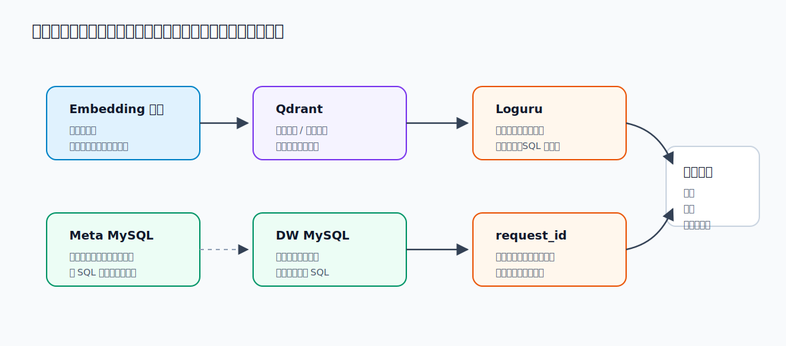

# 6 - 电商问数：MySQL、Embedding 接入与日志管理

<!-- TS-TRACK-BANNER -->
> **TypeScript 轨道说明**：中文讲解保留原教程；**代码块使用仓库内真实 TypeScript**（`examples/` / 精校案例 / `apps/shop-query-agent`），不再使用机翻 Python。
> 精校清单：[POLISHED-CASES](POLISHED-CASES.md)


## TypeScript 可运行示例（推荐）

本章优先对照仓库真实文件：`examples/08-embedding-rag/index.ts`

```typescript
// examples/08-embedding-rag/index.ts
/**
 * Maps to: 案例与源码-2-LangChain框架/09-embedding + 10-rag
 * Course chapters 18-19
 */
import { readFileSync } from "node:fs";
import { dirname, join } from "node:path";
import { fileURLToPath } from "node:url";
import { Document } from "@langchain/core/documents";
import { StringOutputParser } from "@langchain/core/output_parsers";
import { ChatPromptTemplate } from "@langchain/core/prompts";
import { RunnablePassthrough, RunnableSequence } from "@langchain/core/runnables";
import { MemoryVectorStore } from "@langchain/classic/vectorstores/memory";
import { RecursiveCharacterTextSplitter } from "@langchain/textsplitters";
import { createChatModel, createEmbeddings } from "../../src/shared/llm.js";
import { printRunHeader } from "../../src/shared/env.js";

const __dirname = dirname(fileURLToPath(import.meta.url));

function formatDocs(docs: Document[]) {
  return docs.map((d, i) => `[#${i + 1}] ${d.pageContent}`).join("\n\n");
}

async function main() {
  printRunHeader("08-embedding-rag | local docs RAG");

  const raw = readFileSync(join(__dirname, "../../data/company-faq.md"), "utf8");
  const splitter = new RecursiveCharacterTextSplitter({
    chunkSize: 200,
    chunkOverlap: 40,
  });
  const docs = await splitter.createDocuments([raw]);

  const vectorStore = await MemoryVectorStore.fromDocuments(
    docs,
    createEmbeddings(),
  );
  const retriever = vectorStore.asRetriever({ k: 3 });

  const prompt = ChatPromptTemplate.fromMessages([
    [
      "system",
      "你是企业知识库助手。仅依据提供的上下文回答；不知道就说不知道，并建议联系 HR。\n\n上下文:\n{context}",
    ],
    ["human", "{question}"],
  ]);

  const ragChain = RunnableSequence.from([
    {
      context: async (input: { question: string }) =>
        formatDocs(await retriever.invoke(input.question)),
      question: new RunnablePassthrough<{ question: string }>().pipe(
        (input) => input.question,
      ),
    },
    prompt,
    createChatModel(0),
    new StringOutputParser(),
  ]);

  const question = "差旅报销有什么规则？市内交通上限是多少？";
  console.log("[question]", question);
  const answer = await ragChain.invoke({ question });
  console.log("\n[answer]\n", answer);
}

main().catch((err) => {
  console.error(err);
  process.exit(1);
});
```

```bash
npx tsx examples/08-embedding-rag/index.ts
```


---

**本章课程目标：**

- 看懂 `Embedding` 客户端管理器的作用，以及它与后续向量检索之间的衔接关系。
- 理解 `MySQL` 在当前项目里同时承担元数据库和数据仓库模拟库两类角色。
- 了解项目如何通过统一日志配置支撑调试、排障和运行观察。

**学习建议：** 这一章是三块基础能力的接线图：Embedding 负责把文本变向量，MySQL 负责存和查结构化数据，日志负责让你知道系统跑到哪一步。读代码时别只看封装类本身，要追它们在哪里初始化、如何注入到业务层、出了错能不能通过日志定位到请求。

**对应代码分支：** `06-mysql-embedding-log`

---

上一章我们已经把 `Qdrant` 和 `Elasticsearch` 接进来了，但其实还有两个关键问题没闭环：

1. `Qdrant` 里要写的向量，到底从哪里来？
2. 检索、建库、执行 SQL 的过程中，结构化数据和运行日志怎么统一管理？

这一章讲的正是这两个问题。

把它们放回整体架构里，可以概括成下面这条链：

```text
文本
  -> Embedding 服务
  -> 向量
  -> Qdrant 检索

结构化元数据 / 数仓数据
  -> MySQL

运行过程
  -> Loguru + request_id + contextvars
```

也就是说：

- `Embedding` 负责“把文本变成向量”
- `MySQL` 负责“把结构化信息存好、查好”
- 日志系统负责“把每一步做了什么记清楚”

把这三类能力放在一起看，它们不是三条孤立支线，而是共同支撑后续的建库、检索、生成和排障。



只有这三部分都接起来，后面的元知识构建、混合召回、SQL 生成与执行，才会真正形成闭环。

---

## 1、Embedding 客户端管理

### 1.1 Embedding 简介

`Embedding` 就是：**把一句话、一段字段描述、一个指标名称，转换成一组可以参与向量计算的数字。**

例如：

- 用户问题里的关键词，需要先做向量化，才能去 `Qdrant` 检索相似字段和指标
- 元数据库中的表描述、字段描述、指标描述，也需要先做向量化，才能提前写入向量库

所以这一层并不是“附属功能”，而是整个检索链路里的基础能力。

在「电商问数」里，我们并不是直接把自然语言问题交给大模型就结束了。在字段召回、指标召回、元知识构建这些环节里，系统都需要先把文本转成向量，再交给 `Qdrant` 做相似度检索。也就是说，这里有一条很重要的链路：**文本 -> Embedding 服务 -> 向量 -> Qdrant 检索**。如果没有这一层，后面的向量召回链路就跑不起来。

### 1.2 TEI 简介

当前项目选择的不是“在业务代码里直接加载 Embedding 模型权重”，而是：

- **服务端组件**：`Text Embeddings Inference`，简称 `TEI`
- **嵌入模型**：`BAAI/bge-large-zh-v1.5`

`Text Embeddings Inference`，通常简称 `TEI`。它本质上就是一个专门用来部署 Embedding 模型、并通过 HTTP 接口对外提供向量推理能力的服务框架。

对应官方文档：https://huggingface.co/docs/text-embeddings-inference/index （英）

放到当前项目里，可以按下面这条链来理解：

```text
BAAI/bge-large-zh-v1.5
  -> TEI 服务
  -> EmbeddingClientManager
  -> 字段召回 / 指标召回 / 元知识构建
```

也就是说：

- `BAAI/bge-large-zh-v1.5` 是真正负责把文本转成向量的模型
- `TEI` 负责把这个模型跑起来，并暴露成一个可调用的服务
- `EmbeddingClientManager` 负责在项目里把这层服务接进来

如果从工程视角看，`TEI` 在这里解决的是两个实际问题：不需要在业务代码里自己加载模型权重，后端只要通过 HTTP 地址访问服务，就能拿到 Embedding 结果。

在当前项目中，`TEI` 还是以一个**独立服务**的方式运行的。更具体地说，它不是写在后端代码里的普通业务类，而是作为这套项目 Docker 基础服务环境中的一个容器服务启动起来，后端再通过配置里的 `host` 和 `port` 去调用它。

### 1.3 常见服务端组件说明

当前项目使用的服务端组件是 `Text Embeddings Inference（TEI）`。它很适合当前这套教程，因为定位非常明确：**专门服务 Embedding 模型推理**。

除了 `TEI`，市面上常见的服务端组件还可以大致分成几类：

- **通用模型服务平台**
  例如 `Xinference`、`Ollama`、`BentoML`、`Ray Serve`
- **偏大模型推理框架**
  例如 `vLLM`、`TGI`、`SGLang`、`LMDeploy`、`Triton Inference Server`
- **云厂商托管服务**
  例如 `OpenAI Embeddings API`、`Azure OpenAI`、`阿里云百炼`、`火山方舟`、`百度千帆`、`AWS Bedrock`

如果只从当前项目的需求出发，这里最重要的判断是：

- 如果希望**本地或自托管部署 Embedding 服务**，`TEI` 是很贴合的选择
- 如果希望**统一托管多类模型服务**，`Xinference` 这类平台会更常见
- 如果希望**直接调用云端 Embedding API**，则会走各家云厂商或模型服务商提供的托管接口

所以这一章用 `TEI`，不是因为它是唯一方案，而是因为它最贴合当前项目“**部署 Embedding 服务 -> 暴露 HTTP 接口 -> 后端统一接入**”这条链路。

### 1.5 TEI 的访问方式

官方文档：https://huggingface.co/docs/text-embeddings-inference/quick_tour （英）

`TEI` 的推理访问主要有 **3 种方式**：

- **直接调用原生 HTTP 接口**：例如用 `curl` 直接请求 `/embed`
- **使用 Hugging Face 的 Python 客户端**：也就是 `huggingface_hub` 里的 `InferenceClient`
- **使用 OpenAI 兼容方式访问**：也就是把 `TEI` 暴露出来的接口当成 OpenAI 风格的 `/v1/embeddings` 来调用

但在当前项目里，并没有直接采用这些原生调用方式，在 TypeScript 轨道里，我们选择更贴近 Node 技术栈的方案：使用 LangChain.js 的 `OpenAIEmbeddings`，把 TEI / 云端服务当作 OpenAI 兼容的 `/v1/embeddings` 来接入。

这样做有两个明显好处：和前面已经学过的 `LangChain / LangGraph` 体系保持一致；后续在服务层、Agent 节点里调用时，接口更统一。也就是说，当前项目不是不能直接调用 `TEI`，而是有意选择了一个更贴近整套教程技术栈的接入层。

### 1.6 封装 Embedding 客户端

项目对应文件路径（TS Demo）：`apps/shop-query-agent/lib/metadata.ts` 与 `examples/08-embedding-rag/index.ts`

TypeScript 轨道推荐写法（OpenAI 兼容 Embedding）：

```typescript
// Real TypeScript from repo pattern: OpenAIEmbeddings + TEI/OpenAI-compatible baseURL
import { OpenAIEmbeddings } from "@langchain/openai";

export type EmbeddingConfig = {
  host: string;
  port: number;
  model?: string;
};

export class EmbeddingClientManager {
  private client: OpenAIEmbeddings | null = null;
  constructor(private readonly config: EmbeddingConfig) {}

  private getUrl() {
    return `http://${this.config.host}:${this.config.port}/v1`;
  }

  init() {
    this.client = new OpenAIEmbeddings({
      apiKey: process.env.OPENAI_API_KEY || "tei-local",
      model: this.config.model || process.env.OPENAI_EMBEDDING_MODEL || "text-embedding-3-small",
      configuration: { baseURL: this.getUrl() },
    });
  }

  getClient() {
    if (!this.client) throw new Error("call init() first");
    return this.client;
  }
}

// 验证
// const mgr = new EmbeddingClientManager({ host: "127.0.0.1", port: 8080 });
// mgr.init();
// console.log((await mgr.getClient().embedQuery("销售额")).slice(0, 3));
```

对应可运行完整 RAG 示例：

```typescript
// Real TypeScript from repo: examples/08-embedding-rag/index.ts
/**
 * Maps to: 案例与源码-2-LangChain框架/09-embedding + 10-rag
 * Course chapters 18-19
 */
import { readFileSync } from "node:fs";
import { dirname, join } from "node:path";
import { fileURLToPath } from "node:url";
import { Document } from "@langchain/core/documents";
import { StringOutputParser } from "@langchain/core/output_parsers";
import { ChatPromptTemplate } from "@langchain/core/prompts";
import { RunnablePassthrough, RunnableSequence } from "@langchain/core/runnables";
import { MemoryVectorStore } from "@langchain/classic/vectorstores/memory";
import { RecursiveCharacterTextSplitter } from "@langchain/textsplitters";
import { createChatModel, createEmbeddings } from "../../src/shared/llm.js";
import { printRunHeader } from "../../src/shared/env.js";

const __dirname = dirname(fileURLToPath(import.meta.url));

function formatDocs(docs: Document[]) {
  return docs.map((d, i) => `[#${i + 1}] ${d.pageContent}`).join("\n\n");
}

async function main() {
  printRunHeader("08-embedding-rag | local docs RAG");

  const raw = readFileSync(join(__dirname, "../../data/company-faq.md"), "utf8");
  const splitter = new RecursiveCharacterTextSplitter({
    chunkSize: 200,
    chunkOverlap: 40,
  });
  const docs = await splitter.createDocuments([raw]);

  const vectorStore = await MemoryVectorStore.fromDocuments(
    docs,
    createEmbeddings(),
  );
  const retriever = vectorStore.asRetriever({ k: 3 });

  const prompt = ChatPromptTemplate.fromMessages([
    [
      "system",
      "你是企业知识库助手。仅依据提供的上下文回答；不知道就说不知道，并建议联系 HR。\n\n上下文:\n{context}",
    ],
    ["human", "{question}"],
  ]);

  const ragChain = RunnableSequence.from([
    {
      context: async (input: { question: string }) =>
        formatDocs(await retriever.invoke(input.question)),
      question: new RunnablePassthrough<{ question: string }>().pipe(
        (input) => input.question,
      ),
    },
    prompt,
    createChatModel(0),
    new StringOutputParser(),
  ]);

  const question = "差旅报销有什么规则？市内交通上限是多少？";
  console.log("[question]", question);
  const answer = await ragChain.invoke({ question });
  console.log("\n[answer]\n", answer);
}

main().catch((err) => {
  console.error(err);
  process.exit(1);
});```


项目对应文件路径：`shopkeeper-agent/app/clients/embedding_client_manager.py`

代码如下：

```typescript
// Real TypeScript from repo: examples/08-embedding-rag/index.ts
/**
 * Maps to: 案例与源码-2-LangChain框架/09-embedding + 10-rag
 * Course chapters 18-19
 */
import { readFileSync } from "node:fs";
import { dirname, join } from "node:path";
import { fileURLToPath } from "node:url";
import { Document } from "@langchain/core/documents";
import { StringOutputParser } from "@langchain/core/output_parsers";
import { ChatPromptTemplate } from "@langchain/core/prompts";
import { RunnablePassthrough, RunnableSequence } from "@langchain/core/runnables";
import { MemoryVectorStore } from "@langchain/classic/vectorstores/memory";
import { RecursiveCharacterTextSplitter } from "@langchain/textsplitters";
import { createChatModel, createEmbeddings } from "../../src/shared/llm.js";
import { printRunHeader } from "../../src/shared/env.js";

const __dirname = dirname(fileURLToPath(import.meta.url));

function formatDocs(docs: Document[]) {
  return docs.map((d, i) => `[#${i + 1}] ${d.pageContent}`).join("\n\n");
}

async function main() {
  printRunHeader("08-embedding-rag | local docs RAG");

  const raw = readFileSync(join(__dirname, "../../data/company-faq.md"), "utf8");
  const splitter = new RecursiveCharacterTextSplitter({
    chunkSize: 200,
    chunkOverlap: 40,
  });
  const docs = await splitter.createDocuments([raw]);

  const vectorStore = await MemoryVectorStore.fromDocuments(
    docs,
    createEmbeddings(),
  );
  const retriever = vectorStore.asRetriever({ k: 3 });

  const prompt = ChatPromptTemplate.fromMessages([
    [
      "system",
      "你是企业知识库助手。仅依据提供的上下文回答；不知道就说不知道，并建议联系 HR。\n\n上下文:\n{context}",
    ],
    ["human", "{question}"],
  ]);

  const ragChain = RunnableSequence.from([
    {
      context: async (input: { question: string }) =>
        formatDocs(await retriever.invoke(input.question)),
      question: new RunnablePassthrough<{ question: string }>().pipe(
        (input) => input.question,
      ),
    },
    prompt,
    createChatModel(0),
    new StringOutputParser(),
  ]);

  const question = "差旅报销有什么规则？市内交通上限是多少？";
  console.log("[question]", question);
  const answer = await ragChain.invoke({ question });
  console.log("\n[answer]\n", answer);
}

main().catch((err) => {
  console.error(err);
  process.exit(1);
});
```

执行文件验证，成功：

```bash
(shopkeeper-agent) didilili@DidililiMacBook-Pro shopkeeper-agent % npx tsx app.clients.embedding_client_manager

[-0.005919582676142454, 0.005813124123960733, 0.018300632014870644]

```

#### 1.6.1 这一层封装的职责

如果先不看细节，这个管理器只做了三件事：

1. 保存 Embedding 服务配置
2. 根据 `host + port` 拼出服务地址
3. 创建全局可复用的 Embedding 客户端

它没有承担：模型训练，模型下载，向量后处理。它只承担一件事：把“项目怎么访问 Embedding 服务”这件事统一收口。

#### 1.6.2 config 与 client 的职责

```typescript
// Real TypeScript from repo: apps/shop-query-agent/lib/metadata.ts
/**
 * Metadata knowledge base (simplified).
 * Real project: MySQL meta + Qdrant + ES.
 * Demo: in-memory field/metric catalog + keyword/value map.
 */

export type FieldMeta = {
  table: string;
  column: string;
  role: "metric" | "dimension" | "id" | "time" | "status";
  aliases: string[];
  description: string;
  sampleValues?: string[];
};

export type MetricMeta = {
  name: string;
  expression: string;
  aliases: string[];
  description: string;
};

export const fieldCatalog: FieldMeta[] = [
  {
    table: "fact_order",
    column: "amount",
    role: "metric",
    aliases: ["销售额", "成交额", "销售总额", "金额", "GMV"],
    description: "订单成交金额",
  },
  {
    table: "fact_order",
    column: "quantity",
    role: "metric",
    aliases: ["销量", "数量", "件数"],
    description: "订单商品数量",
  },
  {
    table: "fact_order",
    column: "order_date",
    role: "time",
    aliases: ["日期", "下单日期", "时间"],
    description: "订单日期 YYYY-MM-DD",
  },
  {
    table: "fact_order",
    column: "status",
    role: "status",
    aliases: ["订单状态", "状态"],
    description: "paid / refunded / pending",
    sampleValues: ["paid", "refunded", "pending"],
  },
  {
    table: "dim_region",
    column: "region_name",
    role: "dimension",
    aliases: ["地区", "大区", "区域"],
    description: "销售大区",
    sampleValues: ["华北", "华东", "华南", "西南"],
  },
  {
    table: "dim_product",
    column: "brand",
    role: "dimension",
    aliases: ["品牌"],
    description: "商品品牌",
    sampleValues: ["苹果", "华为", "小米"],
  },
  {
    table: "dim_product",
    column: "category",
    role: "dimension",
    aliases: ["品类", "类目"],
    description: "商品品类",
    sampleValues: ["手机", "耳机"],
  },
  {
    table: "dim_customer",
    column: "member_level",
    role: "dimension",
    aliases: ["会员", "会员等级", "等级"],
    description: "会员等级",
    sampleValues: ["普通", "黄金", "钻石"],
  },
  {
    table: "dim_customer",
    column: "city",
    role: "dimension",
    aliases: ["城市"],
    description: "客户城市",
    sampleValues: ["北京", "上海", "杭州", "深圳", "成都"],
  },
];

export const metricCatalog: MetricMeta[] = [
  {
    name: "销售总额",
    expression: "SUM(fact_order.amount)",
    aliases: ["销售额", "成交总额", "GMV", "总销售额"],
    description: "订单金额合计（默认仅 paid）",
  },
  {
    name: "订单量",
    expression: "COUNT(DISTINCT fact_order.order_id)",
    aliases: ["订单数", "单量"],
    description: "订单数",
  },
  {
    name: "销售件数",
    expression: "SUM(fact_order.quantity)",
    aliases: ["销量", "件数"],
    description: "销售件数合计",
  },
];

export type RecallHit = {
  kind: "field" | "metric" | "value";
  score: number;
  label: string;
  detail: string;
  table?: string;
  column?: string;
  value?: string;
};

function includesAny(text: string, words: string[]) {
  return words.some((w) => text.includes(w));
}

/** Multi-path recall: fields / metrics / values from natural language. */
export function recallMetadata(question: string): RecallHit[] {
  const q = question.trim();
  const hits: RecallHit[] = [];

  for (const m of metricCatalog) {
    const keys = [m.name, ...m.aliases];
    if (includesAny(q, keys)) {
      hits.push({
        kind: "metric",
        score: 3,
        label: m.name,
        detail: `${m.expression} | ${m.description}`,
      });
    }
  }

  for (const f of fieldCatalog) {
    const keys = [f.column, ...f.aliases];
    if (includesAny(q, keys)) {
      hits.push({
        kind: "field",
        score: 2,
        label: `${f.table}.${f.column}`,
        detail: `${f.role} | ${f.description}`,
        table: f.table,
        column: f.column,
      });
    }
    for (const v of f.sampleValues ?? []) {
      if (q.includes(v)) {
        hits.push({
          kind: "value",
          score: 4,
          label: `${f.table}.${f.column} = ${v}`,
          detail: `命中字段取值「${v}」`,
          table: f.table,
          column: f.column,
          value: v,
        });
      }
    }
  }

  // defaults if nothing matched
  if (!hits.some((h) => h.kind === "metric")) {
    hits.push({
      kind: "metric",
      score: 1,
      label: "销售总额",
      detail: "SUM(fact_order.amount) | 默认指标",
    });
  }

  hits.sort((a, b) => b.score - a.score);
  // de-dup by label
  const seen = new Set<string>();
  return hits.filter((h) => {
    if (seen.has(h.label)) return false;
    seen.add(h.label);
    return true;
  });
}

export function buildSchemaContext(hits: RecallHit[]): string {
  const fields = fieldCatalog
    .map(
      (f) =>
        `- ${f.table}.${f.column} (${f.role}) aliases=${f.aliases.join("/")}; ${f.description}`,
    )
    .join("\n");
  const metrics = metricCatalog
    .map((m) => `- ${m.name}: ${m.expression}; aliases=${m.aliases.join("/")}`)
    .join("\n");
  const hitText = hits
    .map((h) => `- [${h.kind}] ${h.label}: ${h.detail}`)
    .join("\n");

  return [
    "可用表：fact_order, dim_customer, dim_product, dim_region",
    "关联键：fact_order.customer_id=dim_customer.customer_id; fact_order.product_id=dim_product.product_id; fact_order.region_id=dim_region.region_id",
    "字段目录：",
    fields,
    "指标目录：",
    metrics,
    "本问题召回命中：",
    hitText,
    "SQL 规则：只写 SELECT；默认 status='paid'；表名列名必须来自目录；可用 GROUP BY；limit <= 50。",
  ].join("\n");
}
```

这里有两个核心属性：

- `self.config`：保存配置对象，里面有 `host`、`port`、`model`
- `self.client`：保存真正可调用的 Embedding 客户端实例

和前面几类客户端管理器一样，这里也没有在构造函数里立刻完成初始化，而是先把对象创建出来，后面在 `init()` 里再真正生成客户端。

#### 1.6.3 \_get_url() 的作用与 URL 组成

```typescript
// Real TypeScript from repo: examples/08-embedding-rag/index.ts
/**
 * Maps to: 案例与源码-2-LangChain框架/09-embedding + 10-rag
 * Course chapters 18-19
 */
import { readFileSync } from "node:fs";
import { dirname, join } from "node:path";
import { fileURLToPath } from "node:url";
import { Document } from "@langchain/core/documents";
import { StringOutputParser } from "@langchain/core/output_parsers";
import { ChatPromptTemplate } from "@langchain/core/prompts";
import { RunnablePassthrough, RunnableSequence } from "@langchain/core/runnables";
import { MemoryVectorStore } from "@langchain/classic/vectorstores/memory";
import { RecursiveCharacterTextSplitter } from "@langchain/textsplitters";
import { createChatModel, createEmbeddings } from "../../src/shared/llm.js";
import { printRunHeader } from "../../src/shared/env.js";

const __dirname = dirname(fileURLToPath(import.meta.url));

function formatDocs(docs: Document[]) {
  return docs.map((d, i) => `[#${i + 1}] ${d.pageContent}`).join("\n\n");
}

async function main() {
  printRunHeader("08-embedding-rag | local docs RAG");

  const raw = readFileSync(join(__dirname, "../../data/company-faq.md"), "utf8");
  const splitter = new RecursiveCharacterTextSplitter({
    chunkSize: 200,
    chunkOverlap: 40,
  });
  const docs = await splitter.createDocuments([raw]);

  const vectorStore = await MemoryVectorStore.fromDocuments(
    docs,
    createEmbeddings(),
  );
  const retriever = vectorStore.asRetriever({ k: 3 });

  const prompt = ChatPromptTemplate.fromMessages([
    [
      "system",
      "你是企业知识库助手。仅依据提供的上下文回答；不知道就说不知道，并建议联系 HR。\n\n上下文:\n{context}",
    ],
    ["human", "{question}"],
  ]);

  const ragChain = RunnableSequence.from([
    {
      context: async (input: { question: string }) =>
        formatDocs(await retriever.invoke(input.question)),
      question: new RunnablePassthrough<{ question: string }>().pipe(
        (input) => input.question,
      ),
    },
    prompt,
    createChatModel(0),
    new StringOutputParser(),
  ]);

  const question = "差旅报销有什么规则？市内交通上限是多少？";
  console.log("[question]", question);
  const answer = await ragChain.invoke({ question });
  console.log("\n[answer]\n", answer);
}

main().catch((err) => {
  console.error(err);
  process.exit(1);
});
```

这里做的事情并不复杂，但很关键：**把配置文件中的 `host` 和 `port` 统一拼成服务地址**。

这一层单独抽成方法有两个好处：服务地址的构造逻辑只维护一处；后面如果部署方式变化，修改会更集中。

在当前项目里，这个地址通常会指向 Docker 环境中已经启动好的 `TEI` 服务。

#### 1.6.4 init() 的初始化过程

```typescript
// Real TypeScript from repo: apps/shop-query-agent/lib/metadata.ts
/**
 * Metadata knowledge base (simplified).
 * Real project: MySQL meta + Qdrant + ES.
 * Demo: in-memory field/metric catalog + keyword/value map.
 */

export type FieldMeta = {
  table: string;
  column: string;
  role: "metric" | "dimension" | "id" | "time" | "status";
  aliases: string[];
  description: string;
  sampleValues?: string[];
};

export type MetricMeta = {
  name: string;
  expression: string;
  aliases: string[];
  description: string;
};

export const fieldCatalog: FieldMeta[] = [
  {
    table: "fact_order",
    column: "amount",
    role: "metric",
    aliases: ["销售额", "成交额", "销售总额", "金额", "GMV"],
    description: "订单成交金额",
  },
  {
    table: "fact_order",
    column: "quantity",
    role: "metric",
    aliases: ["销量", "数量", "件数"],
    description: "订单商品数量",
  },
  {
    table: "fact_order",
    column: "order_date",
    role: "time",
    aliases: ["日期", "下单日期", "时间"],
    description: "订单日期 YYYY-MM-DD",
  },
  {
    table: "fact_order",
    column: "status",
    role: "status",
    aliases: ["订单状态", "状态"],
    description: "paid / refunded / pending",
    sampleValues: ["paid", "refunded", "pending"],
  },
  {
    table: "dim_region",
    column: "region_name",
    role: "dimension",
    aliases: ["地区", "大区", "区域"],
    description: "销售大区",
    sampleValues: ["华北", "华东", "华南", "西南"],
  },
  {
    table: "dim_product",
    column: "brand",
    role: "dimension",
    aliases: ["品牌"],
    description: "商品品牌",
    sampleValues: ["苹果", "华为", "小米"],
  },
  {
    table: "dim_product",
    column: "category",
    role: "dimension",
    aliases: ["品类", "类目"],
    description: "商品品类",
    sampleValues: ["手机", "耳机"],
  },
  {
    table: "dim_customer",
    column: "member_level",
    role: "dimension",
    aliases: ["会员", "会员等级", "等级"],
    description: "会员等级",
    sampleValues: ["普通", "黄金", "钻石"],
  },
  {
    table: "dim_customer",
    column: "city",
    role: "dimension",
    aliases: ["城市"],
    description: "客户城市",
    sampleValues: ["北京", "上海", "杭州", "深圳", "成都"],
  },
];

export const metricCatalog: MetricMeta[] = [
  {
    name: "销售总额",
    expression: "SUM(fact_order.amount)",
    aliases: ["销售额", "成交总额", "GMV", "总销售额"],
    description: "订单金额合计（默认仅 paid）",
  },
  {
    name: "订单量",
    expression: "COUNT(DISTINCT fact_order.order_id)",
    aliases: ["订单数", "单量"],
    description: "订单数",
  },
  {
    name: "销售件数",
    expression: "SUM(fact_order.quantity)",
    aliases: ["销量", "件数"],
    description: "销售件数合计",
  },
];

export type RecallHit = {
  kind: "field" | "metric" | "value";
  score: number;
  label: string;
  detail: string;
  table?: string;
  column?: string;
  value?: string;
};

function includesAny(text: string, words: string[]) {
  return words.some((w) => text.includes(w));
}

/** Multi-path recall: fields / metrics / values from natural language. */
export function recallMetadata(question: string): RecallHit[] {
  const q = question.trim();
  const hits: RecallHit[] = [];

  for (const m of metricCatalog) {
    const keys = [m.name, ...m.aliases];
    if (includesAny(q, keys)) {
      hits.push({
        kind: "metric",
        score: 3,
        label: m.name,
        detail: `${m.expression} | ${m.description}`,
      });
    }
  }

  for (const f of fieldCatalog) {
    const keys = [f.column, ...f.aliases];
    if (includesAny(q, keys)) {
      hits.push({
        kind: "field",
        score: 2,
        label: `${f.table}.${f.column}`,
        detail: `${f.role} | ${f.description}`,
        table: f.table,
        column: f.column,
      });
    }
    for (const v of f.sampleValues ?? []) {
      if (q.includes(v)) {
        hits.push({
          kind: "value",
          score: 4,
          label: `${f.table}.${f.column} = ${v}`,
          detail: `命中字段取值「${v}」`,
          table: f.table,
          column: f.column,
          value: v,
        });
      }
    }
  }

  // defaults if nothing matched
  if (!hits.some((h) => h.kind === "metric")) {
    hits.push({
      kind: "metric",
      score: 1,
      label: "销售总额",
      detail: "SUM(fact_order.amount) | 默认指标",
    });
  }

  hits.sort((a, b) => b.score - a.score);
  // de-dup by label
  const seen = new Set<string>();
  return hits.filter((h) => {
    if (seen.has(h.label)) return false;
    seen.add(h.label);
    return true;
  });
}

export function buildSchemaContext(hits: RecallHit[]): string {
  const fields = fieldCatalog
    .map(
      (f) =>
        `- ${f.table}.${f.column} (${f.role}) aliases=${f.aliases.join("/")}; ${f.description}`,
    )
    .join("\n");
  const metrics = metricCatalog
    .map((m) => `- ${m.name}: ${m.expression}; aliases=${m.aliases.join("/")}`)
    .join("\n");
  const hitText = hits
    .map((h) => `- [${h.kind}] ${h.label}: ${h.detail}`)
    .join("\n");

  return [
    "可用表：fact_order, dim_customer, dim_product, dim_region",
    "关联键：fact_order.customer_id=dim_customer.customer_id; fact_order.product_id=dim_product.product_id; fact_order.region_id=dim_region.region_id",
    "字段目录：",
    fields,
    "指标目录：",
    metrics,
    "本问题召回命中：",
    hitText,
    "SQL 规则：只写 SELECT；默认 status='paid'；表名列名必须来自目录；可用 GROUP BY；limit <= 50。",
  ].join("\n");
}
```

这里最值得注意的是：`model=` 传进去的并不是 Hugging Face 上的模型名称，而是**本地已经部署好的 Embedding 服务地址**。

也就是说，这个客户端的调用方式可以理解成：

- 不直接去联网访问 Hugging Face
- 不自己加载模型权重
- 而是把请求发给本地已经启动好的 TEI 服务

这也是为什么这一层更像“服务接入”，而不是“模型训练”或“模型加载”。

#### 1.6.5 不单独提供 close() 方法的原因

前面的 `Qdrant`、`Elasticsearch`、`MySQL` 客户端，很多都需要显式初始化和关闭，是因为它们更接近：长连接、连接池、持久化数据库连接。

而当前这个 Embedding 客户端，本质上更接近**一个无状态的 HTTP 调用封装**。它不像数据库连接那样需要长期持有连接资源，所以这里没有专门去写一个 `close()` 方法。这也是为什么它的实现会明显更轻。

---

## 2、MySQL 客户端管理

### 2.1 为什么是两套 MySQL

很多读者第一次看项目配置时，最容易疑惑的点就是：为什么明明都叫 MySQL，却要写两组配置？

答案很简单，因为它们承担的是两种不同职责：

| 配置项    | 连接到哪里 | 主要职责                                               |
| --------- | ---------- | ------------------------------------------------------ |
| `db_meta` | 元数据库   | 保存表信息、字段信息、指标信息、字段与指标关系等元数据 |
| `db_dw`   | 数仓模拟库 | 提供真实业务查询要访问的数据，用来验证 SQL、执行 SQL   |

所以这里的关键理解不是“为什么麻烦”，而是：

> **一个负责“系统知道库里有什么”，一个负责“系统最终去查什么”。**

这也是为什么项目最终不是只创建一个 MySQL 客户端，而是创建两份：

- `meta_mysql_client_manager`
- `dw_mysql_client_manager`

### 2.2 SQLAlchemy 简介

官方文档：https://www.sqlalchemy.org/

在进入 MySQL 客户端实现之前，先单独理解一下 `SQLAlchemy` 会更顺。因为当前项目里的 MySQL 接入并不是直接手写底层连接，而是建立在 `SQLAlchemy` 之上。

抓住三个关键词：

- **ORM**：数据库表和 Python 类之间的翻译层。你在代码里操作类和对象，ORM 会把这些操作翻译成数据库能执行的 SQL。
- **Engine**：程序连接数据库的总入口，负责和数据库建立连接，并维护一组可复用的连接。
- **Session**：一次具体数据库操作的工作窗口，这一轮查询、写入和提交通常都通过它完成。

如果只记一句话，可以概括成：`Engine` 更像“连接基础设施”，`Session` 更像“这次数据库操作的工作上下文”

### 2.3 SQLAlchemy 快速入门案例

官方文档：https://docs.sqlalchemy.org/en/20/orm/quickstart.html

这份 quickstart 可以帮助我们先建立下面这条最基本的认知链：

```text
声明模型
  -> 创建 Engine
  -> 建表
  -> 创建 Session
  -> 写入对象
  -> 查询对象
```

官方示例为了学习方便，使用的是：同步写法，SQLite 内存数据库。而我们的项目最终使用的是：异步写法，MySQL。也就是说，**场景不同，但核心概念是一致的**。所以这一节最适合拿来帮助我们理解 `ORM / Engine / Session / 模型映射` 这些基本概念。

先看官方示例里的模型声明：

```typescript
// Real TypeScript from repo: examples/08-embedding-rag/index.ts
/**
 * Maps to: 案例与源码-2-LangChain框架/09-embedding + 10-rag
 * Course chapters 18-19
 */
import { readFileSync } from "node:fs";
import { dirname, join } from "node:path";
import { fileURLToPath } from "node:url";
import { Document } from "@langchain/core/documents";
import { StringOutputParser } from "@langchain/core/output_parsers";
import { ChatPromptTemplate } from "@langchain/core/prompts";
import { RunnablePassthrough, RunnableSequence } from "@langchain/core/runnables";
import { MemoryVectorStore } from "@langchain/classic/vectorstores/memory";
import { RecursiveCharacterTextSplitter } from "@langchain/textsplitters";
import { createChatModel, createEmbeddings } from "../../src/shared/llm.js";
import { printRunHeader } from "../../src/shared/env.js";

const __dirname = dirname(fileURLToPath(import.meta.url));

function formatDocs(docs: Document[]) {
  return docs.map((d, i) => `[#${i + 1}] ${d.pageContent}`).join("\n\n");
}

async function main() {
  printRunHeader("08-embedding-rag | local docs RAG");

  const raw = readFileSync(join(__dirname, "../../data/company-faq.md"), "utf8");
  const splitter = new RecursiveCharacterTextSplitter({
    chunkSize: 200,
    chunkOverlap: 40,
  });
  const docs = await splitter.createDocuments([raw]);

  const vectorStore = await MemoryVectorStore.fromDocuments(
    docs,
    createEmbeddings(),
  );
  const retriever = vectorStore.asRetriever({ k: 3 });

  const prompt = ChatPromptTemplate.fromMessages([
    [
      "system",
      "你是企业知识库助手。仅依据提供的上下文回答；不知道就说不知道，并建议联系 HR。\n\n上下文:\n{context}",
    ],
    ["human", "{question}"],
  ]);

  const ragChain = RunnableSequence.from([
    {
      context: async (input: { question: string }) =>
        formatDocs(await retriever.invoke(input.question)),
      question: new RunnablePassthrough<{ question: string }>().pipe(
        (input) => input.question,
      ),
    },
    prompt,
    createChatModel(0),
    new StringOutputParser(),
  ]);

  const question = "差旅报销有什么规则？市内交通上限是多少？";
  console.log("[question]", question);
  const answer = await ragChain.invoke({ question });
  console.log("\n[answer]\n", answer);
}

main().catch((err) => {
  console.error(err);
  process.exit(1);
});
```

理解它在表达什么：

- `Base`：是所有 ORM 模型共同继承的基类
- `User`、`Address`：是程序里的类，同时也分别对应数据库里的两张表
- `__tablename__`：指定这个类映射到数据库中的哪张表
- `mapped_column(...)`：定义字段类型、主键等信息
- `relationship(...)`：用来描述表和表之间的关联关系

接着，创建 `Engine`：

```typescript
// Real TypeScript from repo: apps/shop-query-agent/lib/metadata.ts
/**
 * Metadata knowledge base (simplified).
 * Real project: MySQL meta + Qdrant + ES.
 * Demo: in-memory field/metric catalog + keyword/value map.
 */

export type FieldMeta = {
  table: string;
  column: string;
  role: "metric" | "dimension" | "id" | "time" | "status";
  aliases: string[];
  description: string;
  sampleValues?: string[];
};

export type MetricMeta = {
  name: string;
  expression: string;
  aliases: string[];
  description: string;
};

export const fieldCatalog: FieldMeta[] = [
  {
    table: "fact_order",
    column: "amount",
    role: "metric",
    aliases: ["销售额", "成交额", "销售总额", "金额", "GMV"],
    description: "订单成交金额",
  },
  {
    table: "fact_order",
    column: "quantity",
    role: "metric",
    aliases: ["销量", "数量", "件数"],
    description: "订单商品数量",
  },
  {
    table: "fact_order",
    column: "order_date",
    role: "time",
    aliases: ["日期", "下单日期", "时间"],
    description: "订单日期 YYYY-MM-DD",
  },
  {
    table: "fact_order",
    column: "status",
    role: "status",
    aliases: ["订单状态", "状态"],
    description: "paid / refunded / pending",
    sampleValues: ["paid", "refunded", "pending"],
  },
  {
    table: "dim_region",
    column: "region_name",
    role: "dimension",
    aliases: ["地区", "大区", "区域"],
    description: "销售大区",
    sampleValues: ["华北", "华东", "华南", "西南"],
  },
  {
    table: "dim_product",
    column: "brand",
    role: "dimension",
    aliases: ["品牌"],
    description: "商品品牌",
    sampleValues: ["苹果", "华为", "小米"],
  },
  {
    table: "dim_product",
    column: "category",
    role: "dimension",
    aliases: ["品类", "类目"],
    description: "商品品类",
    sampleValues: ["手机", "耳机"],
  },
  {
    table: "dim_customer",
    column: "member_level",
    role: "dimension",
    aliases: ["会员", "会员等级", "等级"],
    description: "会员等级",
    sampleValues: ["普通", "黄金", "钻石"],
  },
  {
    table: "dim_customer",
    column: "city",
    role: "dimension",
    aliases: ["城市"],
    description: "客户城市",
    sampleValues: ["北京", "上海", "杭州", "深圳", "成都"],
  },
];

export const metricCatalog: MetricMeta[] = [
  {
    name: "销售总额",
    expression: "SUM(fact_order.amount)",
    aliases: ["销售额", "成交总额", "GMV", "总销售额"],
    description: "订单金额合计（默认仅 paid）",
  },
  {
    name: "订单量",
    expression: "COUNT(DISTINCT fact_order.order_id)",
    aliases: ["订单数", "单量"],
    description: "订单数",
  },
  {
    name: "销售件数",
    expression: "SUM(fact_order.quantity)",
    aliases: ["销量", "件数"],
    description: "销售件数合计",
  },
];

export type RecallHit = {
  kind: "field" | "metric" | "value";
  score: number;
  label: string;
  detail: string;
  table?: string;
  column?: string;
  value?: string;
};

function includesAny(text: string, words: string[]) {
  return words.some((w) => text.includes(w));
}

/** Multi-path recall: fields / metrics / values from natural language. */
export function recallMetadata(question: string): RecallHit[] {
  const q = question.trim();
  const hits: RecallHit[] = [];

  for (const m of metricCatalog) {
    const keys = [m.name, ...m.aliases];
    if (includesAny(q, keys)) {
      hits.push({
        kind: "metric",
        score: 3,
        label: m.name,
        detail: `${m.expression} | ${m.description}`,
      });
    }
  }

  for (const f of fieldCatalog) {
    const keys = [f.column, ...f.aliases];
    if (includesAny(q, keys)) {
      hits.push({
        kind: "field",
        score: 2,
        label: `${f.table}.${f.column}`,
        detail: `${f.role} | ${f.description}`,
        table: f.table,
        column: f.column,
      });
    }
    for (const v of f.sampleValues ?? []) {
      if (q.includes(v)) {
        hits.push({
          kind: "value",
          score: 4,
          label: `${f.table}.${f.column} = ${v}`,
          detail: `命中字段取值「${v}」`,
          table: f.table,
          column: f.column,
          value: v,
        });
      }
    }
  }

  // defaults if nothing matched
  if (!hits.some((h) => h.kind === "metric")) {
    hits.push({
      kind: "metric",
      score: 1,
      label: "销售总额",
      detail: "SUM(fact_order.amount) | 默认指标",
    });
  }

  hits.sort((a, b) => b.score - a.score);
  // de-dup by label
  const seen = new Set<string>();
  return hits.filter((h) => {
    if (seen.has(h.label)) return false;
    seen.add(h.label);
    return true;
  });
}

export function buildSchemaContext(hits: RecallHit[]): string {
  const fields = fieldCatalog
    .map(
      (f) =>
        `- ${f.table}.${f.column} (${f.role}) aliases=${f.aliases.join("/")}; ${f.description}`,
    )
    .join("\n");
  const metrics = metricCatalog
    .map((m) => `- ${m.name}: ${m.expression}; aliases=${m.aliases.join("/")}`)
    .join("\n");
  const hitText = hits
    .map((h) => `- [${h.kind}] ${h.label}: ${h.detail}`)
    .join("\n");

  return [
    "可用表：fact_order, dim_customer, dim_product, dim_region",
    "关联键：fact_order.customer_id=dim_customer.customer_id; fact_order.product_id=dim_product.product_id; fact_order.region_id=dim_region.region_id",
    "字段目录：",
    fields,
    "指标目录：",
    metrics,
    "本问题召回命中：",
    hitText,
    "SQL 规则：只写 SELECT；默认 status='paid'；表名列名必须来自目录；可用 GROUP BY；limit <= 50。",
  ].join("\n");
}
```

这里特别值得补一句：`Engine` 不是“某次查询”，它更像数据库连接层的核心对象，底层会帮我们维护连接池。

再往后，直接根据模型去建表：

```typescript
// Real TypeScript from repo: examples/08-embedding-rag/index.ts
/**
 * Maps to: 案例与源码-2-LangChain框架/09-embedding + 10-rag
 * Course chapters 18-19
 */
import { readFileSync } from "node:fs";
import { dirname, join } from "node:path";
import { fileURLToPath } from "node:url";
import { Document } from "@langchain/core/documents";
import { StringOutputParser } from "@langchain/core/output_parsers";
import { ChatPromptTemplate } from "@langchain/core/prompts";
import { RunnablePassthrough, RunnableSequence } from "@langchain/core/runnables";
import { MemoryVectorStore } from "@langchain/classic/vectorstores/memory";
import { RecursiveCharacterTextSplitter } from "@langchain/textsplitters";
import { createChatModel, createEmbeddings } from "../../src/shared/llm.js";
import { printRunHeader } from "../../src/shared/env.js";

const __dirname = dirname(fileURLToPath(import.meta.url));

function formatDocs(docs: Document[]) {
  return docs.map((d, i) => `[#${i + 1}] ${d.pageContent}`).join("\n\n");
}

async function main() {
  printRunHeader("08-embedding-rag | local docs RAG");

  const raw = readFileSync(join(__dirname, "../../data/company-faq.md"), "utf8");
  const splitter = new RecursiveCharacterTextSplitter({
    chunkSize: 200,
    chunkOverlap: 40,
  });
  const docs = await splitter.createDocuments([raw]);

  const vectorStore = await MemoryVectorStore.fromDocuments(
    docs,
    createEmbeddings(),
  );
  const retriever = vectorStore.asRetriever({ k: 3 });

  const prompt = ChatPromptTemplate.fromMessages([
    [
      "system",
      "你是企业知识库助手。仅依据提供的上下文回答；不知道就说不知道，并建议联系 HR。\n\n上下文:\n{context}",
    ],
    ["human", "{question}"],
  ]);

  const ragChain = RunnableSequence.from([
    {
      context: async (input: { question: string }) =>
        formatDocs(await retriever.invoke(input.question)),
      question: new RunnablePassthrough<{ question: string }>().pipe(
        (input) => input.question,
      ),
    },
    prompt,
    createChatModel(0),
    new StringOutputParser(),
  ]);

  const question = "差旅报销有什么规则？市内交通上限是多少？";
  console.log("[question]", question);
  const answer = await ragChain.invoke({ question });
  console.log("\n[answer]\n", answer);
}

main().catch((err) => {
  console.error(err);
  process.exit(1);
});
```

这行代码的意思是：**根据前面声明好的模型，自动生成对应的数据表结构**。不过这里也要顺手提醒一下：在我们的项目里，并没有走这条“由 ORM 自动建表”的路线。因为当前项目的数据库和表结构在前面的环境准备阶段就已经初始化好了，所以这里更多是帮助你理解 SQLAlchemy 的能力边界，而不是项目运行时真正依赖的建表方式。

然后是写数据，这样使用 `Session`：

```typescript
// Real TypeScript from repo: apps/shop-query-agent/lib/metadata.ts
/**
 * Metadata knowledge base (simplified).
 * Real project: MySQL meta + Qdrant + ES.
 * Demo: in-memory field/metric catalog + keyword/value map.
 */

export type FieldMeta = {
  table: string;
  column: string;
  role: "metric" | "dimension" | "id" | "time" | "status";
  aliases: string[];
  description: string;
  sampleValues?: string[];
};

export type MetricMeta = {
  name: string;
  expression: string;
  aliases: string[];
  description: string;
};

export const fieldCatalog: FieldMeta[] = [
  {
    table: "fact_order",
    column: "amount",
    role: "metric",
    aliases: ["销售额", "成交额", "销售总额", "金额", "GMV"],
    description: "订单成交金额",
  },
  {
    table: "fact_order",
    column: "quantity",
    role: "metric",
    aliases: ["销量", "数量", "件数"],
    description: "订单商品数量",
  },
  {
    table: "fact_order",
    column: "order_date",
    role: "time",
    aliases: ["日期", "下单日期", "时间"],
    description: "订单日期 YYYY-MM-DD",
  },
  {
    table: "fact_order",
    column: "status",
    role: "status",
    aliases: ["订单状态", "状态"],
    description: "paid / refunded / pending",
    sampleValues: ["paid", "refunded", "pending"],
  },
  {
    table: "dim_region",
    column: "region_name",
    role: "dimension",
    aliases: ["地区", "大区", "区域"],
    description: "销售大区",
    sampleValues: ["华北", "华东", "华南", "西南"],
  },
  {
    table: "dim_product",
    column: "brand",
    role: "dimension",
    aliases: ["品牌"],
    description: "商品品牌",
    sampleValues: ["苹果", "华为", "小米"],
  },
  {
    table: "dim_product",
    column: "category",
    role: "dimension",
    aliases: ["品类", "类目"],
    description: "商品品类",
    sampleValues: ["手机", "耳机"],
  },
  {
    table: "dim_customer",
    column: "member_level",
    role: "dimension",
    aliases: ["会员", "会员等级", "等级"],
    description: "会员等级",
    sampleValues: ["普通", "黄金", "钻石"],
  },
  {
    table: "dim_customer",
    column: "city",
    role: "dimension",
    aliases: ["城市"],
    description: "客户城市",
    sampleValues: ["北京", "上海", "杭州", "深圳", "成都"],
  },
];

export const metricCatalog: MetricMeta[] = [
  {
    name: "销售总额",
    expression: "SUM(fact_order.amount)",
    aliases: ["销售额", "成交总额", "GMV", "总销售额"],
    description: "订单金额合计（默认仅 paid）",
  },
  {
    name: "订单量",
    expression: "COUNT(DISTINCT fact_order.order_id)",
    aliases: ["订单数", "单量"],
    description: "订单数",
  },
  {
    name: "销售件数",
    expression: "SUM(fact_order.quantity)",
    aliases: ["销量", "件数"],
    description: "销售件数合计",
  },
];

export type RecallHit = {
  kind: "field" | "metric" | "value";
  score: number;
  label: string;
  detail: string;
  table?: string;
  column?: string;
  value?: string;
};

function includesAny(text: string, words: string[]) {
  return words.some((w) => text.includes(w));
}

/** Multi-path recall: fields / metrics / values from natural language. */
export function recallMetadata(question: string): RecallHit[] {
  const q = question.trim();
  const hits: RecallHit[] = [];

  for (const m of metricCatalog) {
    const keys = [m.name, ...m.aliases];
    if (includesAny(q, keys)) {
      hits.push({
        kind: "metric",
        score: 3,
        label: m.name,
        detail: `${m.expression} | ${m.description}`,
      });
    }
  }

  for (const f of fieldCatalog) {
    const keys = [f.column, ...f.aliases];
    if (includesAny(q, keys)) {
      hits.push({
        kind: "field",
        score: 2,
        label: `${f.table}.${f.column}`,
        detail: `${f.role} | ${f.description}`,
        table: f.table,
        column: f.column,
      });
    }
    for (const v of f.sampleValues ?? []) {
      if (q.includes(v)) {
        hits.push({
          kind: "value",
          score: 4,
          label: `${f.table}.${f.column} = ${v}`,
          detail: `命中字段取值「${v}」`,
          table: f.table,
          column: f.column,
          value: v,
        });
      }
    }
  }

  // defaults if nothing matched
  if (!hits.some((h) => h.kind === "metric")) {
    hits.push({
      kind: "metric",
      score: 1,
      label: "销售总额",
      detail: "SUM(fact_order.amount) | 默认指标",
    });
  }

  hits.sort((a, b) => b.score - a.score);
  // de-dup by label
  const seen = new Set<string>();
  return hits.filter((h) => {
    if (seen.has(h.label)) return false;
    seen.add(h.label);
    return true;
  });
}

export function buildSchemaContext(hits: RecallHit[]): string {
  const fields = fieldCatalog
    .map(
      (f) =>
        `- ${f.table}.${f.column} (${f.role}) aliases=${f.aliases.join("/")}; ${f.description}`,
    )
    .join("\n");
  const metrics = metricCatalog
    .map((m) => `- ${m.name}: ${m.expression}; aliases=${m.aliases.join("/")}`)
    .join("\n");
  const hitText = hits
    .map((h) => `- [${h.kind}] ${h.label}: ${h.detail}`)
    .join("\n");

  return [
    "可用表：fact_order, dim_customer, dim_product, dim_region",
    "关联键：fact_order.customer_id=dim_customer.customer_id; fact_order.product_id=dim_product.product_id; fact_order.region_id=dim_region.region_id",
    "字段目录：",
    fields,
    "指标目录：",
    metrics,
    "本问题召回命中：",
    hitText,
    "SQL 规则：只写 SELECT；默认 status='paid'；表名列名必须来自目录；可用 GROUP BY；limit <= 50。",
  ].join("\n");
}
```

这一段重点是在说明两件事：

- 往数据库写数据时，真正和数据库交互的是 `Session`
- ORM 的写法看起来像在操作 Python 对象，但底层最终还是会生成 SQL 并发给数据库

这里也正好能对应到 `add_all()`、`commit()` 这两个关键动作。

最后，做一次简单查询：

```typescript
// Real TypeScript from repo: examples/08-embedding-rag/index.ts
/**
 * Maps to: 案例与源码-2-LangChain框架/09-embedding + 10-rag
 * Course chapters 18-19
 */
import { readFileSync } from "node:fs";
import { dirname, join } from "node:path";
import { fileURLToPath } from "node:url";
import { Document } from "@langchain/core/documents";
import { StringOutputParser } from "@langchain/core/output_parsers";
import { ChatPromptTemplate } from "@langchain/core/prompts";
import { RunnablePassthrough, RunnableSequence } from "@langchain/core/runnables";
import { MemoryVectorStore } from "@langchain/classic/vectorstores/memory";
import { RecursiveCharacterTextSplitter } from "@langchain/textsplitters";
import { createChatModel, createEmbeddings } from "../../src/shared/llm.js";
import { printRunHeader } from "../../src/shared/env.js";

const __dirname = dirname(fileURLToPath(import.meta.url));

function formatDocs(docs: Document[]) {
  return docs.map((d, i) => `[#${i + 1}] ${d.pageContent}`).join("\n\n");
}

async function main() {
  printRunHeader("08-embedding-rag | local docs RAG");

  const raw = readFileSync(join(__dirname, "../../data/company-faq.md"), "utf8");
  const splitter = new RecursiveCharacterTextSplitter({
    chunkSize: 200,
    chunkOverlap: 40,
  });
  const docs = await splitter.createDocuments([raw]);

  const vectorStore = await MemoryVectorStore.fromDocuments(
    docs,
    createEmbeddings(),
  );
  const retriever = vectorStore.asRetriever({ k: 3 });

  const prompt = ChatPromptTemplate.fromMessages([
    [
      "system",
      "你是企业知识库助手。仅依据提供的上下文回答；不知道就说不知道，并建议联系 HR。\n\n上下文:\n{context}",
    ],
    ["human", "{question}"],
  ]);

  const ragChain = RunnableSequence.from([
    {
      context: async (input: { question: string }) =>
        formatDocs(await retriever.invoke(input.question)),
      question: new RunnablePassthrough<{ question: string }>().pipe(
        (input) => input.question,
      ),
    },
    prompt,
    createChatModel(0),
    new StringOutputParser(),
  ]);

  const question = "差旅报销有什么规则？市内交通上限是多少？";
  console.log("[question]", question);
  const answer = await ragChain.invoke({ question });
  console.log("\n[answer]\n", answer);
}

main().catch((err) => {
  console.error(err);
  process.exit(1);
});
```

这段代码表达的是：

- 先构造一条查询语句 `stmt`
- 再通过 `Session` 执行这条语句
- 最终把查出来的 ORM 对象遍历出来

这里你也能看到，官方 quickstart 更偏向展示 ORM 风格的查询写法。这里的 ORM 风格，可以理解成：**不自己手写 SQL 字符串，而是用 Python 里的类、属性和方法去表达“我要查什么”**。但真正落到当前项目时，并不会强制把所有查询都写成这种形式。因为对于复杂 SQL，尤其是数据仓库查询场景，直接写原生 SQL 往往更直观，也更方便控制细节。

所以，这份 quickstart 在当前教程里的价值，可以概括成一句话：它主要帮助我们先理解 SQLAlchemy 的基本组成和使用顺序，后面项目代码再根据异步 MySQL 的真实需求做取舍和落地

### 2.4 封装 MySQL 客户端

项目对应文件路径：`shopkeeper-agent/app/clients/mysql_client_manager.py`

这一部分的中心代码就是当前项目里的 MySQL 客户端封装。前面的 `SQLAlchemy` 基础、quickstart、Engine 与 Session，最终都是为了帮助我们把这段代码看懂。

这里还要先补一个课程里容易被忽略、但代码里已经真实用到的点：`asyncmy` 是当前项目使用的 MySQL 异步驱动。更具体地说，`SQLAlchemy` 负责提供数据库抽象层，而真正和 MySQL 异步通信的底层驱动，是 `asyncmy`。

#### 2.4.1 MySQL 客户端代码实现

```typescript
// Real TypeScript from repo: apps/shop-query-agent/lib/metadata.ts
/**
 * Metadata knowledge base (simplified).
 * Real project: MySQL meta + Qdrant + ES.
 * Demo: in-memory field/metric catalog + keyword/value map.
 */

export type FieldMeta = {
  table: string;
  column: string;
  role: "metric" | "dimension" | "id" | "time" | "status";
  aliases: string[];
  description: string;
  sampleValues?: string[];
};

export type MetricMeta = {
  name: string;
  expression: string;
  aliases: string[];
  description: string;
};

export const fieldCatalog: FieldMeta[] = [
  {
    table: "fact_order",
    column: "amount",
    role: "metric",
    aliases: ["销售额", "成交额", "销售总额", "金额", "GMV"],
    description: "订单成交金额",
  },
  {
    table: "fact_order",
    column: "quantity",
    role: "metric",
    aliases: ["销量", "数量", "件数"],
    description: "订单商品数量",
  },
  {
    table: "fact_order",
    column: "order_date",
    role: "time",
    aliases: ["日期", "下单日期", "时间"],
    description: "订单日期 YYYY-MM-DD",
  },
  {
    table: "fact_order",
    column: "status",
    role: "status",
    aliases: ["订单状态", "状态"],
    description: "paid / refunded / pending",
    sampleValues: ["paid", "refunded", "pending"],
  },
  {
    table: "dim_region",
    column: "region_name",
    role: "dimension",
    aliases: ["地区", "大区", "区域"],
    description: "销售大区",
    sampleValues: ["华北", "华东", "华南", "西南"],
  },
  {
    table: "dim_product",
    column: "brand",
    role: "dimension",
    aliases: ["品牌"],
    description: "商品品牌",
    sampleValues: ["苹果", "华为", "小米"],
  },
  {
    table: "dim_product",
    column: "category",
    role: "dimension",
    aliases: ["品类", "类目"],
    description: "商品品类",
    sampleValues: ["手机", "耳机"],
  },
  {
    table: "dim_customer",
    column: "member_level",
    role: "dimension",
    aliases: ["会员", "会员等级", "等级"],
    description: "会员等级",
    sampleValues: ["普通", "黄金", "钻石"],
  },
  {
    table: "dim_customer",
    column: "city",
    role: "dimension",
    aliases: ["城市"],
    description: "客户城市",
    sampleValues: ["北京", "上海", "杭州", "深圳", "成都"],
  },
];

export const metricCatalog: MetricMeta[] = [
  {
    name: "销售总额",
    expression: "SUM(fact_order.amount)",
    aliases: ["销售额", "成交总额", "GMV", "总销售额"],
    description: "订单金额合计（默认仅 paid）",
  },
  {
    name: "订单量",
    expression: "COUNT(DISTINCT fact_order.order_id)",
    aliases: ["订单数", "单量"],
    description: "订单数",
  },
  {
    name: "销售件数",
    expression: "SUM(fact_order.quantity)",
    aliases: ["销量", "件数"],
    description: "销售件数合计",
  },
];

export type RecallHit = {
  kind: "field" | "metric" | "value";
  score: number;
  label: string;
  detail: string;
  table?: string;
  column?: string;
  value?: string;
};

function includesAny(text: string, words: string[]) {
  return words.some((w) => text.includes(w));
}

/** Multi-path recall: fields / metrics / values from natural language. */
export function recallMetadata(question: string): RecallHit[] {
  const q = question.trim();
  const hits: RecallHit[] = [];

  for (const m of metricCatalog) {
    const keys = [m.name, ...m.aliases];
    if (includesAny(q, keys)) {
      hits.push({
        kind: "metric",
        score: 3,
        label: m.name,
        detail: `${m.expression} | ${m.description}`,
      });
    }
  }

  for (const f of fieldCatalog) {
    const keys = [f.column, ...f.aliases];
    if (includesAny(q, keys)) {
      hits.push({
        kind: "field",
        score: 2,
        label: `${f.table}.${f.column}`,
        detail: `${f.role} | ${f.description}`,
        table: f.table,
        column: f.column,
      });
    }
    for (const v of f.sampleValues ?? []) {
      if (q.includes(v)) {
        hits.push({
          kind: "value",
          score: 4,
          label: `${f.table}.${f.column} = ${v}`,
          detail: `命中字段取值「${v}」`,
          table: f.table,
          column: f.column,
          value: v,
        });
      }
    }
  }

  // defaults if nothing matched
  if (!hits.some((h) => h.kind === "metric")) {
    hits.push({
      kind: "metric",
      score: 1,
      label: "销售总额",
      detail: "SUM(fact_order.amount) | 默认指标",
    });
  }

  hits.sort((a, b) => b.score - a.score);
  // de-dup by label
  const seen = new Set<string>();
  return hits.filter((h) => {
    if (seen.has(h.label)) return false;
    seen.add(h.label);
    return true;
  });
}

export function buildSchemaContext(hits: RecallHit[]): string {
  const fields = fieldCatalog
    .map(
      (f) =>
        `- ${f.table}.${f.column} (${f.role}) aliases=${f.aliases.join("/")}; ${f.description}`,
    )
    .join("\n");
  const metrics = metricCatalog
    .map((m) => `- ${m.name}: ${m.expression}; aliases=${m.aliases.join("/")}`)
    .join("\n");
  const hitText = hits
    .map((h) => `- [${h.kind}] ${h.label}: ${h.detail}`)
    .join("\n");

  return [
    "可用表：fact_order, dim_customer, dim_product, dim_region",
    "关联键：fact_order.customer_id=dim_customer.customer_id; fact_order.product_id=dim_product.product_id; fact_order.region_id=dim_region.region_id",
    "字段目录：",
    fields,
    "指标目录：",
    metrics,
    "本问题召回命中：",
    hitText,
    "SQL 规则：只写 SELECT；默认 status='paid'；表名列名必须来自目录；可用 GROUP BY；limit <= 50。",
  ].join("\n");
}
```

执行文件验证，成功：

```bash
(shopkeeper-agent) didilili@DidililiMacBook-Pro shopkeeper-agent % npx tsx app.clients.mysql_client_manager
<class 'list'>
<class 'sqlalchemy.engine.row.RowMapping'>
ORD20250101001
```

这个管理器主要做了四件事：

1. 保存数据库配置
2. 创建 `Engine`
3. 创建 `Session` 工厂
4. 在程序退出时关闭连接池

它和前面的 `QdrantClientManager`、`ESClientManager` 的思路是一致的：都属于“统一初始化、统一关闭、统一对外提供基础能力”的基础设施层。

#### 2.4.2 为什么 Engine 适合全局复用

这里有一个非常关键的点：`Engine` 可以理解成全局单例，但 `Session` 不应该做成全局单例。

原因是这样的：

- `Engine` 底层维护数据库连接池
- 连接池这种东西，本来就应该全局复用
- 如果每次请求都重新创建一个 `Engine`，等于每次都新建一套连接池，成本很高，也没有必要

而 `Session` 不一样。`Session` 更像一次数据库交互对应的会话上下文，它通常应该是**按请求、按使用场景来创建**，而不是全局只保留一个。因为：

- 一个 `Session` 往往会绑定事务上下文
- 不同请求之间不应该共用同一个事务会话
- 什么时候需要访问数据库，什么时候再基于 `Engine` 创建 `Session`

如果用一句更直白的话概括：`Engine` 负责长期维护连接能力，`Session` 负责一次具体数据库操作。

#### 2.4.3 为什么真正对外暴露的是 session_factory

这一点也是很多初学者第一次看代码时不太容易立刻理解的地方。当前项目里没有“先在全局创建一个 `Session` 对象再到处传”，而是这样做：

```typescript
// Real TypeScript from repo: examples/08-embedding-rag/index.ts
/**
 * Maps to: 案例与源码-2-LangChain框架/09-embedding + 10-rag
 * Course chapters 18-19
 */
import { readFileSync } from "node:fs";
import { dirname, join } from "node:path";
import { fileURLToPath } from "node:url";
import { Document } from "@langchain/core/documents";
import { StringOutputParser } from "@langchain/core/output_parsers";
import { ChatPromptTemplate } from "@langchain/core/prompts";
import { RunnablePassthrough, RunnableSequence } from "@langchain/core/runnables";
import { MemoryVectorStore } from "@langchain/classic/vectorstores/memory";
import { RecursiveCharacterTextSplitter } from "@langchain/textsplitters";
import { createChatModel, createEmbeddings } from "../../src/shared/llm.js";
import { printRunHeader } from "../../src/shared/env.js";

const __dirname = dirname(fileURLToPath(import.meta.url));

function formatDocs(docs: Document[]) {
  return docs.map((d, i) => `[#${i + 1}] ${d.pageContent}`).join("\n\n");
}

async function main() {
  printRunHeader("08-embedding-rag | local docs RAG");

  const raw = readFileSync(join(__dirname, "../../data/company-faq.md"), "utf8");
  const splitter = new RecursiveCharacterTextSplitter({
    chunkSize: 200,
    chunkOverlap: 40,
  });
  const docs = await splitter.createDocuments([raw]);

  const vectorStore = await MemoryVectorStore.fromDocuments(
    docs,
    createEmbeddings(),
  );
  const retriever = vectorStore.asRetriever({ k: 3 });

  const prompt = ChatPromptTemplate.fromMessages([
    [
      "system",
      "你是企业知识库助手。仅依据提供的上下文回答；不知道就说不知道，并建议联系 HR。\n\n上下文:\n{context}",
    ],
    ["human", "{question}"],
  ]);

  const ragChain = RunnableSequence.from([
    {
      context: async (input: { question: string }) =>
        formatDocs(await retriever.invoke(input.question)),
      question: new RunnablePassthrough<{ question: string }>().pipe(
        (input) => input.question,
      ),
    },
    prompt,
    createChatModel(0),
    new StringOutputParser(),
  ]);

  const question = "差旅报销有什么规则？市内交通上限是多少？";
  console.log("[question]", question);
  const answer = await ragChain.invoke({ question });
  console.log("\n[answer]\n", answer);
}

main().catch((err) => {
  console.error(err);
  process.exit(1);
});
```

原因很简单：项目整体是异步风格，后面会在很多地方反复创建 Session，与其每次都手写一遍创建逻辑，不如先做一个统一的 **Session 工厂**。这样后面无论是 API 依赖注入、构建元知识脚本、Agent 执行链路都可以通过：

```typescript
// Real TypeScript from repo: apps/shop-query-agent/lib/metadata.ts
/**
 * Metadata knowledge base (simplified).
 * Real project: MySQL meta + Qdrant + ES.
 * Demo: in-memory field/metric catalog + keyword/value map.
 */

export type FieldMeta = {
  table: string;
  column: string;
  role: "metric" | "dimension" | "id" | "time" | "status";
  aliases: string[];
  description: string;
  sampleValues?: string[];
};

export type MetricMeta = {
  name: string;
  expression: string;
  aliases: string[];
  description: string;
};

export const fieldCatalog: FieldMeta[] = [
  {
    table: "fact_order",
    column: "amount",
    role: "metric",
    aliases: ["销售额", "成交额", "销售总额", "金额", "GMV"],
    description: "订单成交金额",
  },
  {
    table: "fact_order",
    column: "quantity",
    role: "metric",
    aliases: ["销量", "数量", "件数"],
    description: "订单商品数量",
  },
  {
    table: "fact_order",
    column: "order_date",
    role: "time",
    aliases: ["日期", "下单日期", "时间"],
    description: "订单日期 YYYY-MM-DD",
  },
  {
    table: "fact_order",
    column: "status",
    role: "status",
    aliases: ["订单状态", "状态"],
    description: "paid / refunded / pending",
    sampleValues: ["paid", "refunded", "pending"],
  },
  {
    table: "dim_region",
    column: "region_name",
    role: "dimension",
    aliases: ["地区", "大区", "区域"],
    description: "销售大区",
    sampleValues: ["华北", "华东", "华南", "西南"],
  },
  {
    table: "dim_product",
    column: "brand",
    role: "dimension",
    aliases: ["品牌"],
    description: "商品品牌",
    sampleValues: ["苹果", "华为", "小米"],
  },
  {
    table: "dim_product",
    column: "category",
    role: "dimension",
    aliases: ["品类", "类目"],
    description: "商品品类",
    sampleValues: ["手机", "耳机"],
  },
  {
    table: "dim_customer",
    column: "member_level",
    role: "dimension",
    aliases: ["会员", "会员等级", "等级"],
    description: "会员等级",
    sampleValues: ["普通", "黄金", "钻石"],
  },
  {
    table: "dim_customer",
    column: "city",
    role: "dimension",
    aliases: ["城市"],
    description: "客户城市",
    sampleValues: ["北京", "上海", "杭州", "深圳", "成都"],
  },
];

export const metricCatalog: MetricMeta[] = [
  {
    name: "销售总额",
    expression: "SUM(fact_order.amount)",
    aliases: ["销售额", "成交总额", "GMV", "总销售额"],
    description: "订单金额合计（默认仅 paid）",
  },
  {
    name: "订单量",
    expression: "COUNT(DISTINCT fact_order.order_id)",
    aliases: ["订单数", "单量"],
    description: "订单数",
  },
  {
    name: "销售件数",
    expression: "SUM(fact_order.quantity)",
    aliases: ["销量", "件数"],
    description: "销售件数合计",
  },
];

export type RecallHit = {
  kind: "field" | "metric" | "value";
  score: number;
  label: string;
  detail: string;
  table?: string;
  column?: string;
  value?: string;
};

function includesAny(text: string, words: string[]) {
  return words.some((w) => text.includes(w));
}

/** Multi-path recall: fields / metrics / values from natural language. */
export function recallMetadata(question: string): RecallHit[] {
  const q = question.trim();
  const hits: RecallHit[] = [];

  for (const m of metricCatalog) {
    const keys = [m.name, ...m.aliases];
    if (includesAny(q, keys)) {
      hits.push({
        kind: "metric",
        score: 3,
        label: m.name,
        detail: `${m.expression} | ${m.description}`,
      });
    }
  }

  for (const f of fieldCatalog) {
    const keys = [f.column, ...f.aliases];
    if (includesAny(q, keys)) {
      hits.push({
        kind: "field",
        score: 2,
        label: `${f.table}.${f.column}`,
        detail: `${f.role} | ${f.description}`,
        table: f.table,
        column: f.column,
      });
    }
    for (const v of f.sampleValues ?? []) {
      if (q.includes(v)) {
        hits.push({
          kind: "value",
          score: 4,
          label: `${f.table}.${f.column} = ${v}`,
          detail: `命中字段取值「${v}」`,
          table: f.table,
          column: f.column,
          value: v,
        });
      }
    }
  }

  // defaults if nothing matched
  if (!hits.some((h) => h.kind === "metric")) {
    hits.push({
      kind: "metric",
      score: 1,
      label: "销售总额",
      detail: "SUM(fact_order.amount) | 默认指标",
    });
  }

  hits.sort((a, b) => b.score - a.score);
  // de-dup by label
  const seen = new Set<string>();
  return hits.filter((h) => {
    if (seen.has(h.label)) return false;
    seen.add(h.label);
    return true;
  });
}

export function buildSchemaContext(hits: RecallHit[]): string {
  const fields = fieldCatalog
    .map(
      (f) =>
        `- ${f.table}.${f.column} (${f.role}) aliases=${f.aliases.join("/")}; ${f.description}`,
    )
    .join("\n");
  const metrics = metricCatalog
    .map((m) => `- ${m.name}: ${m.expression}; aliases=${m.aliases.join("/")}`)
    .join("\n");
  const hitText = hits
    .map((h) => `- [${h.kind}] ${h.label}: ${h.detail}`)
    .join("\n");

  return [
    "可用表：fact_order, dim_customer, dim_product, dim_region",
    "关联键：fact_order.customer_id=dim_customer.customer_id; fact_order.product_id=dim_product.product_id; fact_order.region_id=dim_region.region_id",
    "字段目录：",
    fields,
    "指标目录：",
    metrics,
    "本问题召回命中：",
    hitText,
    "SQL 规则：只写 SELECT；默认 status='paid'；表名列名必须来自目录；可用 GROUP BY；limit <= 50。",
  ].join("\n");
}
```

来得到一份新的异步会话对象。

所以这里的 `session_factory` 可以看作：**一个专门用来批量、统一、稳定地创建 `AsyncSession` 的工厂。**

#### 2.4.4 pool_size、pool_pre_ping、autoflush 参数配置说明

这一部分有两个层面的重点：**Engine 参数** 和 **Session 参数**。

先看 `Engine` 这层：

```typescript
// Real TypeScript from repo: examples/08-embedding-rag/index.ts
/**
 * Maps to: 案例与源码-2-LangChain框架/09-embedding + 10-rag
 * Course chapters 18-19
 */
import { readFileSync } from "node:fs";
import { dirname, join } from "node:path";
import { fileURLToPath } from "node:url";
import { Document } from "@langchain/core/documents";
import { StringOutputParser } from "@langchain/core/output_parsers";
import { ChatPromptTemplate } from "@langchain/core/prompts";
import { RunnablePassthrough, RunnableSequence } from "@langchain/core/runnables";
import { MemoryVectorStore } from "@langchain/classic/vectorstores/memory";
import { RecursiveCharacterTextSplitter } from "@langchain/textsplitters";
import { createChatModel, createEmbeddings } from "../../src/shared/llm.js";
import { printRunHeader } from "../../src/shared/env.js";

const __dirname = dirname(fileURLToPath(import.meta.url));

function formatDocs(docs: Document[]) {
  return docs.map((d, i) => `[#${i + 1}] ${d.pageContent}`).join("\n\n");
}

async function main() {
  printRunHeader("08-embedding-rag | local docs RAG");

  const raw = readFileSync(join(__dirname, "../../data/company-faq.md"), "utf8");
  const splitter = new RecursiveCharacterTextSplitter({
    chunkSize: 200,
    chunkOverlap: 40,
  });
  const docs = await splitter.createDocuments([raw]);

  const vectorStore = await MemoryVectorStore.fromDocuments(
    docs,
    createEmbeddings(),
  );
  const retriever = vectorStore.asRetriever({ k: 3 });

  const prompt = ChatPromptTemplate.fromMessages([
    [
      "system",
      "你是企业知识库助手。仅依据提供的上下文回答；不知道就说不知道，并建议联系 HR。\n\n上下文:\n{context}",
    ],
    ["human", "{question}"],
  ]);

  const ragChain = RunnableSequence.from([
    {
      context: async (input: { question: string }) =>
        formatDocs(await retriever.invoke(input.question)),
      question: new RunnablePassthrough<{ question: string }>().pipe(
        (input) => input.question,
      ),
    },
    prompt,
    createChatModel(0),
    new StringOutputParser(),
  ]);

  const question = "差旅报销有什么规则？市内交通上限是多少？";
  console.log("[question]", question);
  const answer = await ragChain.invoke({ question });
  console.log("\n[answer]\n", answer);
}

main().catch((err) => {
  console.error(err);
  process.exit(1);
});
```

##### 2.4.4.1 pool_size=10

表示连接池里默认维持多少个可复用连接。这个值不是越大越好，而是要结合你的并发量、数据库承载能力和部署环境去权衡。当前教程项目里先给一个教学友好的默认值即可。

##### 2.4.4.2 pool_pre_ping=True

表示在取出连接时，先做一次可用性检测。

为什么这个参数很重要？因为数据库服务端有时会主动断开长时间闲置的连接。如果我们从连接池里取到一个“看起来还在、实际上已经失效”的连接，后续查询就会报错。`pre_ping` 做的事情，就是在真正使用前先测一下这个连接是不是还活着。

再看 `Session` 这层：

```typescript
// Real TypeScript from repo: apps/shop-query-agent/lib/metadata.ts
/**
 * Metadata knowledge base (simplified).
 * Real project: MySQL meta + Qdrant + ES.
 * Demo: in-memory field/metric catalog + keyword/value map.
 */

export type FieldMeta = {
  table: string;
  column: string;
  role: "metric" | "dimension" | "id" | "time" | "status";
  aliases: string[];
  description: string;
  sampleValues?: string[];
};

export type MetricMeta = {
  name: string;
  expression: string;
  aliases: string[];
  description: string;
};

export const fieldCatalog: FieldMeta[] = [
  {
    table: "fact_order",
    column: "amount",
    role: "metric",
    aliases: ["销售额", "成交额", "销售总额", "金额", "GMV"],
    description: "订单成交金额",
  },
  {
    table: "fact_order",
    column: "quantity",
    role: "metric",
    aliases: ["销量", "数量", "件数"],
    description: "订单商品数量",
  },
  {
    table: "fact_order",
    column: "order_date",
    role: "time",
    aliases: ["日期", "下单日期", "时间"],
    description: "订单日期 YYYY-MM-DD",
  },
  {
    table: "fact_order",
    column: "status",
    role: "status",
    aliases: ["订单状态", "状态"],
    description: "paid / refunded / pending",
    sampleValues: ["paid", "refunded", "pending"],
  },
  {
    table: "dim_region",
    column: "region_name",
    role: "dimension",
    aliases: ["地区", "大区", "区域"],
    description: "销售大区",
    sampleValues: ["华北", "华东", "华南", "西南"],
  },
  {
    table: "dim_product",
    column: "brand",
    role: "dimension",
    aliases: ["品牌"],
    description: "商品品牌",
    sampleValues: ["苹果", "华为", "小米"],
  },
  {
    table: "dim_product",
    column: "category",
    role: "dimension",
    aliases: ["品类", "类目"],
    description: "商品品类",
    sampleValues: ["手机", "耳机"],
  },
  {
    table: "dim_customer",
    column: "member_level",
    role: "dimension",
    aliases: ["会员", "会员等级", "等级"],
    description: "会员等级",
    sampleValues: ["普通", "黄金", "钻石"],
  },
  {
    table: "dim_customer",
    column: "city",
    role: "dimension",
    aliases: ["城市"],
    description: "客户城市",
    sampleValues: ["北京", "上海", "杭州", "深圳", "成都"],
  },
];

export const metricCatalog: MetricMeta[] = [
  {
    name: "销售总额",
    expression: "SUM(fact_order.amount)",
    aliases: ["销售额", "成交总额", "GMV", "总销售额"],
    description: "订单金额合计（默认仅 paid）",
  },
  {
    name: "订单量",
    expression: "COUNT(DISTINCT fact_order.order_id)",
    aliases: ["订单数", "单量"],
    description: "订单数",
  },
  {
    name: "销售件数",
    expression: "SUM(fact_order.quantity)",
    aliases: ["销量", "件数"],
    description: "销售件数合计",
  },
];

export type RecallHit = {
  kind: "field" | "metric" | "value";
  score: number;
  label: string;
  detail: string;
  table?: string;
  column?: string;
  value?: string;
};

function includesAny(text: string, words: string[]) {
  return words.some((w) => text.includes(w));
}

/** Multi-path recall: fields / metrics / values from natural language. */
export function recallMetadata(question: string): RecallHit[] {
  const q = question.trim();
  const hits: RecallHit[] = [];

  for (const m of metricCatalog) {
    const keys = [m.name, ...m.aliases];
    if (includesAny(q, keys)) {
      hits.push({
        kind: "metric",
        score: 3,
        label: m.name,
        detail: `${m.expression} | ${m.description}`,
      });
    }
  }

  for (const f of fieldCatalog) {
    const keys = [f.column, ...f.aliases];
    if (includesAny(q, keys)) {
      hits.push({
        kind: "field",
        score: 2,
        label: `${f.table}.${f.column}`,
        detail: `${f.role} | ${f.description}`,
        table: f.table,
        column: f.column,
      });
    }
    for (const v of f.sampleValues ?? []) {
      if (q.includes(v)) {
        hits.push({
          kind: "value",
          score: 4,
          label: `${f.table}.${f.column} = ${v}`,
          detail: `命中字段取值「${v}」`,
          table: f.table,
          column: f.column,
          value: v,
        });
      }
    }
  }

  // defaults if nothing matched
  if (!hits.some((h) => h.kind === "metric")) {
    hits.push({
      kind: "metric",
      score: 1,
      label: "销售总额",
      detail: "SUM(fact_order.amount) | 默认指标",
    });
  }

  hits.sort((a, b) => b.score - a.score);
  // de-dup by label
  const seen = new Set<string>();
  return hits.filter((h) => {
    if (seen.has(h.label)) return false;
    seen.add(h.label);
    return true;
  });
}

export function buildSchemaContext(hits: RecallHit[]): string {
  const fields = fieldCatalog
    .map(
      (f) =>
        `- ${f.table}.${f.column} (${f.role}) aliases=${f.aliases.join("/")}; ${f.description}`,
    )
    .join("\n");
  const metrics = metricCatalog
    .map((m) => `- ${m.name}: ${m.expression}; aliases=${m.aliases.join("/")}`)
    .join("\n");
  const hitText = hits
    .map((h) => `- [${h.kind}] ${h.label}: ${h.detail}`)
    .join("\n");

  return [
    "可用表：fact_order, dim_customer, dim_product, dim_region",
    "关联键：fact_order.customer_id=dim_customer.customer_id; fact_order.product_id=dim_product.product_id; fact_order.region_id=dim_region.region_id",
    "字段目录：",
    fields,
    "指标目录：",
    metrics,
    "本问题召回命中：",
    hitText,
    "SQL 规则：只写 SELECT；默认 status='paid'；表名列名必须来自目录；可用 GROUP BY；limit <= 50。",
  ].join("\n");
}
```

##### 2.4.4.3 autoflush=True

先这样理解会比较顺：

- `add()` 并不等于立刻把数据最终提交到数据库
- 在真正提交事务前，很多变更还停留在当前 `Session` 中
- `flush()` 的作用是把这些待写入变更同步到数据库连接层，但事务还没最终提交

所以 `autoflush=True` 的意义是：在执行查询之前，框架会自动帮我们做一次 `flush`，避免出现“明明前面已经 add 了对象，但后面查询时还看不到”的困惑。

这里顺手再区分一下：

- `flush`：把当前 Session 中待写入的变更同步到数据库连接层
- `commit`：在 `flush` 的基础上真正提交事务

也就是说，`flush` 不等于最终提交。

##### 2.4.4.4 expire_on_commit=False

如果保持默认行为，事务提交后，对象状态会被标记为“过期”；你后面再次访问对象属性时，ORM 可能会尝试重新查数据库。但在异步项目里，这种隐式重新查询并不适合作为默认行为，所以这里显式设成 `False`，是为了让使用过程更稳定、更容易预测。

##### 2.4.4.5 autobegin=True

表示需要时自动开启事务。这样在大多数业务代码里，不需要每次都手动先写一段“开始事务”的样板代码。

所以把这几个参数合在一起看，它们其实分别在解决三类问题：

- `pool_pre_ping=True`：解决连接池里旧连接失效的问题
- `autoflush=True`：解决“写了对象但查询看不到”的一致性体验问题
- `expire_on_commit=False`：解决异步场景下对象属性访问的不确定性问题

### 2.5 为什么不用 ORM 查询语法

前面已经对照过 `SQLAlchemy` 官方 quickstart，也看了 ORM 风格的查询写法。但落实到当前项目时，并没有把所有查询都改写成 ORM 查询表达式。

原因很现实：

- 简单查询，用 ORM 当然没问题
- 复杂查询，尤其是偏数据仓库分析型的查询，用原生 SQL 往往更直接
- 当前项目的重点不是“全面展示 ORM 语法”，而是“把数据库能力稳定接进后端”

所以这里的策略其实很清楚：

- **连接管理、Session 管理** 用 `SQLAlchemy`
- **复杂查询语句** 仍然可以直接写原生 SQL

这也是为什么测试代码里直接用了：

```typescript
// Real TypeScript from repo: examples/08-embedding-rag/index.ts
/**
 * Maps to: 案例与源码-2-LangChain框架/09-embedding + 10-rag
 * Course chapters 18-19
 */
import { readFileSync } from "node:fs";
import { dirname, join } from "node:path";
import { fileURLToPath } from "node:url";
import { Document } from "@langchain/core/documents";
import { StringOutputParser } from "@langchain/core/output_parsers";
import { ChatPromptTemplate } from "@langchain/core/prompts";
import { RunnablePassthrough, RunnableSequence } from "@langchain/core/runnables";
import { MemoryVectorStore } from "@langchain/classic/vectorstores/memory";
import { RecursiveCharacterTextSplitter } from "@langchain/textsplitters";
import { createChatModel, createEmbeddings } from "../../src/shared/llm.js";
import { printRunHeader } from "../../src/shared/env.js";

const __dirname = dirname(fileURLToPath(import.meta.url));

function formatDocs(docs: Document[]) {
  return docs.map((d, i) => `[#${i + 1}] ${d.pageContent}`).join("\n\n");
}

async function main() {
  printRunHeader("08-embedding-rag | local docs RAG");

  const raw = readFileSync(join(__dirname, "../../data/company-faq.md"), "utf8");
  const splitter = new RecursiveCharacterTextSplitter({
    chunkSize: 200,
    chunkOverlap: 40,
  });
  const docs = await splitter.createDocuments([raw]);

  const vectorStore = await MemoryVectorStore.fromDocuments(
    docs,
    createEmbeddings(),
  );
  const retriever = vectorStore.asRetriever({ k: 3 });

  const prompt = ChatPromptTemplate.fromMessages([
    [
      "system",
      "你是企业知识库助手。仅依据提供的上下文回答；不知道就说不知道，并建议联系 HR。\n\n上下文:\n{context}",
    ],
    ["human", "{question}"],
  ]);

  const ragChain = RunnableSequence.from([
    {
      context: async (input: { question: string }) =>
        formatDocs(await retriever.invoke(input.question)),
      question: new RunnablePassthrough<{ question: string }>().pipe(
        (input) => input.question,
      ),
    },
    prompt,
    createChatModel(0),
    new StringOutputParser(),
  ]);

  const question = "差旅报销有什么规则？市内交通上限是多少？";
  console.log("[question]", question);
  const answer = await ragChain.invoke({ question });
  console.log("\n[answer]\n", answer);
}

main().catch((err) => {
  console.error(err);
  process.exit(1);
});
```

---

## 3、日志管理

### 3.1 为什么不用 print

这里先强调一个很现实的问题：如果只是本地临时测试，`print` 当然能用；但一旦进入正式项目，它很快就不够用了。

原因主要有两类：

- **输出信息不够规范**：如果只用 `print`，你通常还得自己拼接时间、模块名、函数名、行号、日志级别等信息。
- **输出目的地不够灵活**：项目上线后，日志往往不只是输出到控制台，还需要同时写入日志文件，方便排查和归档。

所以这里的重点不是“`print` 完全不能用”，而是：**项目需要一套更稳定、更可配置的日志方案**。

### 3.2 loguru 简介

官方文档：https://loguru.readthedocs.io/en/stable/#readme

当前项目选择的是 `loguru` 管理日志。先看它的一个最小示例，会更容易理解为什么这里选它：

例如：

```typescript
// Real TypeScript from repo: apps/shop-query-agent/lib/metadata.ts
/**
 * Metadata knowledge base (simplified).
 * Real project: MySQL meta + Qdrant + ES.
 * Demo: in-memory field/metric catalog + keyword/value map.
 */

export type FieldMeta = {
  table: string;
  column: string;
  role: "metric" | "dimension" | "id" | "time" | "status";
  aliases: string[];
  description: string;
  sampleValues?: string[];
};

export type MetricMeta = {
  name: string;
  expression: string;
  aliases: string[];
  description: string;
};

export const fieldCatalog: FieldMeta[] = [
  {
    table: "fact_order",
    column: "amount",
    role: "metric",
    aliases: ["销售额", "成交额", "销售总额", "金额", "GMV"],
    description: "订单成交金额",
  },
  {
    table: "fact_order",
    column: "quantity",
    role: "metric",
    aliases: ["销量", "数量", "件数"],
    description: "订单商品数量",
  },
  {
    table: "fact_order",
    column: "order_date",
    role: "time",
    aliases: ["日期", "下单日期", "时间"],
    description: "订单日期 YYYY-MM-DD",
  },
  {
    table: "fact_order",
    column: "status",
    role: "status",
    aliases: ["订单状态", "状态"],
    description: "paid / refunded / pending",
    sampleValues: ["paid", "refunded", "pending"],
  },
  {
    table: "dim_region",
    column: "region_name",
    role: "dimension",
    aliases: ["地区", "大区", "区域"],
    description: "销售大区",
    sampleValues: ["华北", "华东", "华南", "西南"],
  },
  {
    table: "dim_product",
    column: "brand",
    role: "dimension",
    aliases: ["品牌"],
    description: "商品品牌",
    sampleValues: ["苹果", "华为", "小米"],
  },
  {
    table: "dim_product",
    column: "category",
    role: "dimension",
    aliases: ["品类", "类目"],
    description: "商品品类",
    sampleValues: ["手机", "耳机"],
  },
  {
    table: "dim_customer",
    column: "member_level",
    role: "dimension",
    aliases: ["会员", "会员等级", "等级"],
    description: "会员等级",
    sampleValues: ["普通", "黄金", "钻石"],
  },
  {
    table: "dim_customer",
    column: "city",
    role: "dimension",
    aliases: ["城市"],
    description: "客户城市",
    sampleValues: ["北京", "上海", "杭州", "深圳", "成都"],
  },
];

export const metricCatalog: MetricMeta[] = [
  {
    name: "销售总额",
    expression: "SUM(fact_order.amount)",
    aliases: ["销售额", "成交总额", "GMV", "总销售额"],
    description: "订单金额合计（默认仅 paid）",
  },
  {
    name: "订单量",
    expression: "COUNT(DISTINCT fact_order.order_id)",
    aliases: ["订单数", "单量"],
    description: "订单数",
  },
  {
    name: "销售件数",
    expression: "SUM(fact_order.quantity)",
    aliases: ["销量", "件数"],
    description: "销售件数合计",
  },
];

export type RecallHit = {
  kind: "field" | "metric" | "value";
  score: number;
  label: string;
  detail: string;
  table?: string;
  column?: string;
  value?: string;
};

function includesAny(text: string, words: string[]) {
  return words.some((w) => text.includes(w));
}

/** Multi-path recall: fields / metrics / values from natural language. */
export function recallMetadata(question: string): RecallHit[] {
  const q = question.trim();
  const hits: RecallHit[] = [];

  for (const m of metricCatalog) {
    const keys = [m.name, ...m.aliases];
    if (includesAny(q, keys)) {
      hits.push({
        kind: "metric",
        score: 3,
        label: m.name,
        detail: `${m.expression} | ${m.description}`,
      });
    }
  }

  for (const f of fieldCatalog) {
    const keys = [f.column, ...f.aliases];
    if (includesAny(q, keys)) {
      hits.push({
        kind: "field",
        score: 2,
        label: `${f.table}.${f.column}`,
        detail: `${f.role} | ${f.description}`,
        table: f.table,
        column: f.column,
      });
    }
    for (const v of f.sampleValues ?? []) {
      if (q.includes(v)) {
        hits.push({
          kind: "value",
          score: 4,
          label: `${f.table}.${f.column} = ${v}`,
          detail: `命中字段取值「${v}」`,
          table: f.table,
          column: f.column,
          value: v,
        });
      }
    }
  }

  // defaults if nothing matched
  if (!hits.some((h) => h.kind === "metric")) {
    hits.push({
      kind: "metric",
      score: 1,
      label: "销售总额",
      detail: "SUM(fact_order.amount) | 默认指标",
    });
  }

  hits.sort((a, b) => b.score - a.score);
  // de-dup by label
  const seen = new Set<string>();
  return hits.filter((h) => {
    if (seen.has(h.label)) return false;
    seen.add(h.label);
    return true;
  });
}

export function buildSchemaContext(hits: RecallHit[]): string {
  const fields = fieldCatalog
    .map(
      (f) =>
        `- ${f.table}.${f.column} (${f.role}) aliases=${f.aliases.join("/")}; ${f.description}`,
    )
    .join("\n");
  const metrics = metricCatalog
    .map((m) => `- ${m.name}: ${m.expression}; aliases=${m.aliases.join("/")}`)
    .join("\n");
  const hitText = hits
    .map((h) => `- [${h.kind}] ${h.label}: ${h.detail}`)
    .join("\n");

  return [
    "可用表：fact_order, dim_customer, dim_product, dim_region",
    "关联键：fact_order.customer_id=dim_customer.customer_id; fact_order.product_id=dim_product.product_id; fact_order.region_id=dim_region.region_id",
    "字段目录：",
    fields,
    "指标目录：",
    metrics,
    "本问题召回命中：",
    hitText,
    "SQL 规则：只写 SELECT；默认 status='paid'；表名列名必须来自目录；可用 GROUP BY；limit <= 50。",
  ].join("\n");
}
```

直接运行后，就能看到带时间、级别、位置、颜色的日志输出。

不过这里还有一个关键点：**开箱即用不等于项目就可以直接照抄默认配置**。因为真正的项目通常还会有这些需求：

- 要不要输出到控制台
- 要不要写入日志文件
- 日志文件写到哪里
- 多大体积就切分新文件
- 保留多久
- 日志格式要不要加额外字段

所以当前项目并没有停留在“直接 `import logger` 然后打印”，而是继续往前做了一步：**把日志做成可配置的基础能力**。

### 3.3 配置文件中的日志描述

项目对应文件路径：`shopkeeper-agent/conf/app_config.yaml`

对应配置如下：

```yaml
logging:
  file:
    enable: true
    level: INFO
    path: logs
    rotation: "10 MB"
    retention: "7 days"
  console:
    enable: true
    level: INFO
```

这里的设计思路很值得先理解清楚：日志最终可以有两个“输出目的地”：`console`：输出到控制台；`file`：输出到日志文件。

而 `enable` 的作用，就是决定这个输出通道是否启用。

如果再拆细一点，这几个字段可以这样理解：

- `level`：设定这个输出通道的最低日志级别
- `path`：指定日志文件目录
- `rotation`：指定多大体积后切分新文件
- `retention`：指定日志保留多久

这里最容易第一次没概念的两个参数，是 `rotation` 和 `retention`。

- `rotation: "10 MB"`：表示日志文件写到大约 10MB 时，自动切分成新文件
- `retention: "7 days"`：表示只保留最近 7 天的日志

为什么要有这两个参数？因为如果一直往同一个文件里写，日志文件会越来越大，不方便查；如果日志永远不清理，磁盘空间最终会被慢慢吃满。所以这两个参数，其实是在解决**日志文件长期运行时的可维护性问题**。

### 3.4 封装日志配置

项目对应文件路径：`shopkeeper-agent/app/core/log.py`

代码如下：

```typescript
// Real TypeScript from repo: examples/08-embedding-rag/index.ts
/**
 * Maps to: 案例与源码-2-LangChain框架/09-embedding + 10-rag
 * Course chapters 18-19
 */
import { readFileSync } from "node:fs";
import { dirname, join } from "node:path";
import { fileURLToPath } from "node:url";
import { Document } from "@langchain/core/documents";
import { StringOutputParser } from "@langchain/core/output_parsers";
import { ChatPromptTemplate } from "@langchain/core/prompts";
import { RunnablePassthrough, RunnableSequence } from "@langchain/core/runnables";
import { MemoryVectorStore } from "@langchain/classic/vectorstores/memory";
import { RecursiveCharacterTextSplitter } from "@langchain/textsplitters";
import { createChatModel, createEmbeddings } from "../../src/shared/llm.js";
import { printRunHeader } from "../../src/shared/env.js";

const __dirname = dirname(fileURLToPath(import.meta.url));

function formatDocs(docs: Document[]) {
  return docs.map((d, i) => `[#${i + 1}] ${d.pageContent}`).join("\n\n");
}

async function main() {
  printRunHeader("08-embedding-rag | local docs RAG");

  const raw = readFileSync(join(__dirname, "../../data/company-faq.md"), "utf8");
  const splitter = new RecursiveCharacterTextSplitter({
    chunkSize: 200,
    chunkOverlap: 40,
  });
  const docs = await splitter.createDocuments([raw]);

  const vectorStore = await MemoryVectorStore.fromDocuments(
    docs,
    createEmbeddings(),
  );
  const retriever = vectorStore.asRetriever({ k: 3 });

  const prompt = ChatPromptTemplate.fromMessages([
    [
      "system",
      "你是企业知识库助手。仅依据提供的上下文回答；不知道就说不知道，并建议联系 HR。\n\n上下文:\n{context}",
    ],
    ["human", "{question}"],
  ]);

  const ragChain = RunnableSequence.from([
    {
      context: async (input: { question: string }) =>
        formatDocs(await retriever.invoke(input.question)),
      question: new RunnablePassthrough<{ question: string }>().pipe(
        (input) => input.question,
      ),
    },
    prompt,
    createChatModel(0),
    new StringOutputParser(),
  ]);

  const question = "差旅报销有什么规则？市内交通上限是多少？";
  console.log("[question]", question);
  const answer = await ragChain.invoke({ question });
  console.log("\n[answer]\n", answer);
}

main().catch((err) => {
  console.error(err);
  process.exit(1);
});
```

#### 3.4.1 这一层封装在做什么

如果先不看细节，这段日志封装代码主要是在统一四类能力：

1. 定义统一日志格式
2. 决定日志输出到控制台还是文件
3. 根据配置文件启用或关闭不同输出通道
4. 给每条日志自动补充 `request_id`

所以这里的重点不是“怎么打印一条日志”，而是：**怎么把日志能力做成整个后端项目可复用的基础设施**。

#### 3.4.2 logger.remove() 与 logger.add(...) 的作用

`loguru` 之所以“开箱即用”，是因为它自带了一套默认配置。所以，项目如果想使用自己的日志格式和输出策略，第一步通常就要先做：

```typescript
// Real TypeScript from repo: apps/shop-query-agent/lib/metadata.ts
/**
 * Metadata knowledge base (simplified).
 * Real project: MySQL meta + Qdrant + ES.
 * Demo: in-memory field/metric catalog + keyword/value map.
 */

export type FieldMeta = {
  table: string;
  column: string;
  role: "metric" | "dimension" | "id" | "time" | "status";
  aliases: string[];
  description: string;
  sampleValues?: string[];
};

export type MetricMeta = {
  name: string;
  expression: string;
  aliases: string[];
  description: string;
};

export const fieldCatalog: FieldMeta[] = [
  {
    table: "fact_order",
    column: "amount",
    role: "metric",
    aliases: ["销售额", "成交额", "销售总额", "金额", "GMV"],
    description: "订单成交金额",
  },
  {
    table: "fact_order",
    column: "quantity",
    role: "metric",
    aliases: ["销量", "数量", "件数"],
    description: "订单商品数量",
  },
  {
    table: "fact_order",
    column: "order_date",
    role: "time",
    aliases: ["日期", "下单日期", "时间"],
    description: "订单日期 YYYY-MM-DD",
  },
  {
    table: "fact_order",
    column: "status",
    role: "status",
    aliases: ["订单状态", "状态"],
    description: "paid / refunded / pending",
    sampleValues: ["paid", "refunded", "pending"],
  },
  {
    table: "dim_region",
    column: "region_name",
    role: "dimension",
    aliases: ["地区", "大区", "区域"],
    description: "销售大区",
    sampleValues: ["华北", "华东", "华南", "西南"],
  },
  {
    table: "dim_product",
    column: "brand",
    role: "dimension",
    aliases: ["品牌"],
    description: "商品品牌",
    sampleValues: ["苹果", "华为", "小米"],
  },
  {
    table: "dim_product",
    column: "category",
    role: "dimension",
    aliases: ["品类", "类目"],
    description: "商品品类",
    sampleValues: ["手机", "耳机"],
  },
  {
    table: "dim_customer",
    column: "member_level",
    role: "dimension",
    aliases: ["会员", "会员等级", "等级"],
    description: "会员等级",
    sampleValues: ["普通", "黄金", "钻石"],
  },
  {
    table: "dim_customer",
    column: "city",
    role: "dimension",
    aliases: ["城市"],
    description: "客户城市",
    sampleValues: ["北京", "上海", "杭州", "深圳", "成都"],
  },
];

export const metricCatalog: MetricMeta[] = [
  {
    name: "销售总额",
    expression: "SUM(fact_order.amount)",
    aliases: ["销售额", "成交总额", "GMV", "总销售额"],
    description: "订单金额合计（默认仅 paid）",
  },
  {
    name: "订单量",
    expression: "COUNT(DISTINCT fact_order.order_id)",
    aliases: ["订单数", "单量"],
    description: "订单数",
  },
  {
    name: "销售件数",
    expression: "SUM(fact_order.quantity)",
    aliases: ["销量", "件数"],
    description: "销售件数合计",
  },
];

export type RecallHit = {
  kind: "field" | "metric" | "value";
  score: number;
  label: string;
  detail: string;
  table?: string;
  column?: string;
  value?: string;
};

function includesAny(text: string, words: string[]) {
  return words.some((w) => text.includes(w));
}

/** Multi-path recall: fields / metrics / values from natural language. */
export function recallMetadata(question: string): RecallHit[] {
  const q = question.trim();
  const hits: RecallHit[] = [];

  for (const m of metricCatalog) {
    const keys = [m.name, ...m.aliases];
    if (includesAny(q, keys)) {
      hits.push({
        kind: "metric",
        score: 3,
        label: m.name,
        detail: `${m.expression} | ${m.description}`,
      });
    }
  }

  for (const f of fieldCatalog) {
    const keys = [f.column, ...f.aliases];
    if (includesAny(q, keys)) {
      hits.push({
        kind: "field",
        score: 2,
        label: `${f.table}.${f.column}`,
        detail: `${f.role} | ${f.description}`,
        table: f.table,
        column: f.column,
      });
    }
    for (const v of f.sampleValues ?? []) {
      if (q.includes(v)) {
        hits.push({
          kind: "value",
          score: 4,
          label: `${f.table}.${f.column} = ${v}`,
          detail: `命中字段取值「${v}」`,
          table: f.table,
          column: f.column,
          value: v,
        });
      }
    }
  }

  // defaults if nothing matched
  if (!hits.some((h) => h.kind === "metric")) {
    hits.push({
      kind: "metric",
      score: 1,
      label: "销售总额",
      detail: "SUM(fact_order.amount) | 默认指标",
    });
  }

  hits.sort((a, b) => b.score - a.score);
  // de-dup by label
  const seen = new Set<string>();
  return hits.filter((h) => {
    if (seen.has(h.label)) return false;
    seen.add(h.label);
    return true;
  });
}

export function buildSchemaContext(hits: RecallHit[]): string {
  const fields = fieldCatalog
    .map(
      (f) =>
        `- ${f.table}.${f.column} (${f.role}) aliases=${f.aliases.join("/")}; ${f.description}`,
    )
    .join("\n");
  const metrics = metricCatalog
    .map((m) => `- ${m.name}: ${m.expression}; aliases=${m.aliases.join("/")}`)
    .join("\n");
  const hitText = hits
    .map((h) => `- [${h.kind}] ${h.label}: ${h.detail}`)
    .join("\n");

  return [
    "可用表：fact_order, dim_customer, dim_product, dim_region",
    "关联键：fact_order.customer_id=dim_customer.customer_id; fact_order.product_id=dim_product.product_id; fact_order.region_id=dim_region.region_id",
    "字段目录：",
    fields,
    "指标目录：",
    metrics,
    "本问题召回命中：",
    hitText,
    "SQL 规则：只写 SELECT；默认 status='paid'；表名列名必须来自目录；可用 GROUP BY；limit <= 50。",
  ].join("\n");
}
```

它的作用就是：**先把默认日志配置移除掉**。

然后再通过：

```typescript
// Real TypeScript from repo: examples/08-embedding-rag/index.ts
/**
 * Maps to: 案例与源码-2-LangChain框架/09-embedding + 10-rag
 * Course chapters 18-19
 */
import { readFileSync } from "node:fs";
import { dirname, join } from "node:path";
import { fileURLToPath } from "node:url";
import { Document } from "@langchain/core/documents";
import { StringOutputParser } from "@langchain/core/output_parsers";
import { ChatPromptTemplate } from "@langchain/core/prompts";
import { RunnablePassthrough, RunnableSequence } from "@langchain/core/runnables";
import { MemoryVectorStore } from "@langchain/classic/vectorstores/memory";
import { RecursiveCharacterTextSplitter } from "@langchain/textsplitters";
import { createChatModel, createEmbeddings } from "../../src/shared/llm.js";
import { printRunHeader } from "../../src/shared/env.js";

const __dirname = dirname(fileURLToPath(import.meta.url));

function formatDocs(docs: Document[]) {
  return docs.map((d, i) => `[#${i + 1}] ${d.pageContent}`).join("\n\n");
}

async function main() {
  printRunHeader("08-embedding-rag | local docs RAG");

  const raw = readFileSync(join(__dirname, "../../data/company-faq.md"), "utf8");
  const splitter = new RecursiveCharacterTextSplitter({
    chunkSize: 200,
    chunkOverlap: 40,
  });
  const docs = await splitter.createDocuments([raw]);

  const vectorStore = await MemoryVectorStore.fromDocuments(
    docs,
    createEmbeddings(),
  );
  const retriever = vectorStore.asRetriever({ k: 3 });

  const prompt = ChatPromptTemplate.fromMessages([
    [
      "system",
      "你是企业知识库助手。仅依据提供的上下文回答；不知道就说不知道，并建议联系 HR。\n\n上下文:\n{context}",
    ],
    ["human", "{question}"],
  ]);

  const ragChain = RunnableSequence.from([
    {
      context: async (input: { question: string }) =>
        formatDocs(await retriever.invoke(input.question)),
      question: new RunnablePassthrough<{ question: string }>().pipe(
        (input) => input.question,
      ),
    },
    prompt,
    createChatModel(0),
    new StringOutputParser(),
  ]);

  const question = "差旅报销有什么规则？市内交通上限是多少？";
  console.log("[question]", question);
  const answer = await ragChain.invoke({ question });
  console.log("\n[answer]\n", answer);
}

main().catch((err) => {
  console.error(err);
  process.exit(1);
});
```

把我们自己的输出通道加回来。也就是说，这里的整体逻辑是：

```text
移除默认配置
  -> 判断是否启用 console
  -> 判断是否启用 file
  -> 分别添加自己的日志输出规则
```

这套日志能力的核心目标就是“可配置”。不是写死“永远打印到控制台”，也不是写死“永远输出到文件”，而是让用户通过配置文件决定到底要启用哪些输出通道。

#### 3.4.3 日志格式设计

这一段里，最值得认真看的其实是 `log_format`。

```typescript
// Real TypeScript from repo: apps/shop-query-agent/lib/metadata.ts
/**
 * Metadata knowledge base (simplified).
 * Real project: MySQL meta + Qdrant + ES.
 * Demo: in-memory field/metric catalog + keyword/value map.
 */

export type FieldMeta = {
  table: string;
  column: string;
  role: "metric" | "dimension" | "id" | "time" | "status";
  aliases: string[];
  description: string;
  sampleValues?: string[];
};

export type MetricMeta = {
  name: string;
  expression: string;
  aliases: string[];
  description: string;
};

export const fieldCatalog: FieldMeta[] = [
  {
    table: "fact_order",
    column: "amount",
    role: "metric",
    aliases: ["销售额", "成交额", "销售总额", "金额", "GMV"],
    description: "订单成交金额",
  },
  {
    table: "fact_order",
    column: "quantity",
    role: "metric",
    aliases: ["销量", "数量", "件数"],
    description: "订单商品数量",
  },
  {
    table: "fact_order",
    column: "order_date",
    role: "time",
    aliases: ["日期", "下单日期", "时间"],
    description: "订单日期 YYYY-MM-DD",
  },
  {
    table: "fact_order",
    column: "status",
    role: "status",
    aliases: ["订单状态", "状态"],
    description: "paid / refunded / pending",
    sampleValues: ["paid", "refunded", "pending"],
  },
  {
    table: "dim_region",
    column: "region_name",
    role: "dimension",
    aliases: ["地区", "大区", "区域"],
    description: "销售大区",
    sampleValues: ["华北", "华东", "华南", "西南"],
  },
  {
    table: "dim_product",
    column: "brand",
    role: "dimension",
    aliases: ["品牌"],
    description: "商品品牌",
    sampleValues: ["苹果", "华为", "小米"],
  },
  {
    table: "dim_product",
    column: "category",
    role: "dimension",
    aliases: ["品类", "类目"],
    description: "商品品类",
    sampleValues: ["手机", "耳机"],
  },
  {
    table: "dim_customer",
    column: "member_level",
    role: "dimension",
    aliases: ["会员", "会员等级", "等级"],
    description: "会员等级",
    sampleValues: ["普通", "黄金", "钻石"],
  },
  {
    table: "dim_customer",
    column: "city",
    role: "dimension",
    aliases: ["城市"],
    description: "客户城市",
    sampleValues: ["北京", "上海", "杭州", "深圳", "成都"],
  },
];

export const metricCatalog: MetricMeta[] = [
  {
    name: "销售总额",
    expression: "SUM(fact_order.amount)",
    aliases: ["销售额", "成交总额", "GMV", "总销售额"],
    description: "订单金额合计（默认仅 paid）",
  },
  {
    name: "订单量",
    expression: "COUNT(DISTINCT fact_order.order_id)",
    aliases: ["订单数", "单量"],
    description: "订单数",
  },
  {
    name: "销售件数",
    expression: "SUM(fact_order.quantity)",
    aliases: ["销量", "件数"],
    description: "销售件数合计",
  },
];

export type RecallHit = {
  kind: "field" | "metric" | "value";
  score: number;
  label: string;
  detail: string;
  table?: string;
  column?: string;
  value?: string;
};

function includesAny(text: string, words: string[]) {
  return words.some((w) => text.includes(w));
}

/** Multi-path recall: fields / metrics / values from natural language. */
export function recallMetadata(question: string): RecallHit[] {
  const q = question.trim();
  const hits: RecallHit[] = [];

  for (const m of metricCatalog) {
    const keys = [m.name, ...m.aliases];
    if (includesAny(q, keys)) {
      hits.push({
        kind: "metric",
        score: 3,
        label: m.name,
        detail: `${m.expression} | ${m.description}`,
      });
    }
  }

  for (const f of fieldCatalog) {
    const keys = [f.column, ...f.aliases];
    if (includesAny(q, keys)) {
      hits.push({
        kind: "field",
        score: 2,
        label: `${f.table}.${f.column}`,
        detail: `${f.role} | ${f.description}`,
        table: f.table,
        column: f.column,
      });
    }
    for (const v of f.sampleValues ?? []) {
      if (q.includes(v)) {
        hits.push({
          kind: "value",
          score: 4,
          label: `${f.table}.${f.column} = ${v}`,
          detail: `命中字段取值「${v}」`,
          table: f.table,
          column: f.column,
          value: v,
        });
      }
    }
  }

  // defaults if nothing matched
  if (!hits.some((h) => h.kind === "metric")) {
    hits.push({
      kind: "metric",
      score: 1,
      label: "销售总额",
      detail: "SUM(fact_order.amount) | 默认指标",
    });
  }

  hits.sort((a, b) => b.score - a.score);
  // de-dup by label
  const seen = new Set<string>();
  return hits.filter((h) => {
    if (seen.has(h.label)) return false;
    seen.add(h.label);
    return true;
  });
}

export function buildSchemaContext(hits: RecallHit[]): string {
  const fields = fieldCatalog
    .map(
      (f) =>
        `- ${f.table}.${f.column} (${f.role}) aliases=${f.aliases.join("/")}; ${f.description}`,
    )
    .join("\n");
  const metrics = metricCatalog
    .map((m) => `- ${m.name}: ${m.expression}; aliases=${m.aliases.join("/")}`)
    .join("\n");
  const hitText = hits
    .map((h) => `- [${h.kind}] ${h.label}: ${h.detail}`)
    .join("\n");

  return [
    "可用表：fact_order, dim_customer, dim_product, dim_region",
    "关联键：fact_order.customer_id=dim_customer.customer_id; fact_order.product_id=dim_product.product_id; fact_order.region_id=dim_region.region_id",
    "字段目录：",
    fields,
    "指标目录：",
    metrics,
    "本问题召回命中：",
    hitText,
    "SQL 规则：只写 SELECT；默认 status='paid'；表名列名必须来自目录；可用 GROUP BY；limit <= 50。",
  ].join("\n");
}
```

这里不是随便拼一个字符串，而是在定义：**每一条日志最后长什么样**。

其中几个字段最重要：

- `{time:YYYY-MM-DD HH:mm:ss.SSS}`：时间
- `{level: <8}`：日志级别，并按固定宽度对齐
- `{name}`：模块名
- `{function}`：函数名
- `{line}`：行号
- `{message}`：具体日志内容
- `{extra[request_id]}`：额外注入的请求标识

这里要解决的是一个非常实际的问题：如果没有统一格式，日志就只是“能看”；但有了这些字段，日志才会变成“能排查问题”。

#### 3.4.4 request_id 注入机制

项目对应文件路径：`shopkeeper-agent/app/core/context.py`

```typescript
// Real TypeScript from repo: examples/08-embedding-rag/index.ts
/**
 * Maps to: 案例与源码-2-LangChain框架/09-embedding + 10-rag
 * Course chapters 18-19
 */
import { readFileSync } from "node:fs";
import { dirname, join } from "node:path";
import { fileURLToPath } from "node:url";
import { Document } from "@langchain/core/documents";
import { StringOutputParser } from "@langchain/core/output_parsers";
import { ChatPromptTemplate } from "@langchain/core/prompts";
import { RunnablePassthrough, RunnableSequence } from "@langchain/core/runnables";
import { MemoryVectorStore } from "@langchain/classic/vectorstores/memory";
import { RecursiveCharacterTextSplitter } from "@langchain/textsplitters";
import { createChatModel, createEmbeddings } from "../../src/shared/llm.js";
import { printRunHeader } from "../../src/shared/env.js";

const __dirname = dirname(fileURLToPath(import.meta.url));

function formatDocs(docs: Document[]) {
  return docs.map((d, i) => `[#${i + 1}] ${d.pageContent}`).join("\n\n");
}

async function main() {
  printRunHeader("08-embedding-rag | local docs RAG");

  const raw = readFileSync(join(__dirname, "../../data/company-faq.md"), "utf8");
  const splitter = new RecursiveCharacterTextSplitter({
    chunkSize: 200,
    chunkOverlap: 40,
  });
  const docs = await splitter.createDocuments([raw]);

  const vectorStore = await MemoryVectorStore.fromDocuments(
    docs,
    createEmbeddings(),
  );
  const retriever = vectorStore.asRetriever({ k: 3 });

  const prompt = ChatPromptTemplate.fromMessages([
    [
      "system",
      "你是企业知识库助手。仅依据提供的上下文回答；不知道就说不知道，并建议联系 HR。\n\n上下文:\n{context}",
    ],
    ["human", "{question}"],
  ]);

  const ragChain = RunnableSequence.from([
    {
      context: async (input: { question: string }) =>
        formatDocs(await retriever.invoke(input.question)),
      question: new RunnablePassthrough<{ question: string }>().pipe(
        (input) => input.question,
      ),
    },
    prompt,
    createChatModel(0),
    new StringOutputParser(),
  ]);

  const question = "差旅报销有什么规则？市内交通上限是多少？";
  console.log("[question]", question);
  const answer = await ragChain.invoke({ question });
  console.log("\n[answer]\n", answer);
}

main().catch((err) => {
  console.error(err);
  process.exit(1);
});
```

在日志模块里，通过下面这段逻辑把它写进日志的 `extra` 字段：

```typescript
// Real TypeScript from repo: apps/shop-query-agent/lib/metadata.ts
/**
 * Metadata knowledge base (simplified).
 * Real project: MySQL meta + Qdrant + ES.
 * Demo: in-memory field/metric catalog + keyword/value map.
 */

export type FieldMeta = {
  table: string;
  column: string;
  role: "metric" | "dimension" | "id" | "time" | "status";
  aliases: string[];
  description: string;
  sampleValues?: string[];
};

export type MetricMeta = {
  name: string;
  expression: string;
  aliases: string[];
  description: string;
};

export const fieldCatalog: FieldMeta[] = [
  {
    table: "fact_order",
    column: "amount",
    role: "metric",
    aliases: ["销售额", "成交额", "销售总额", "金额", "GMV"],
    description: "订单成交金额",
  },
  {
    table: "fact_order",
    column: "quantity",
    role: "metric",
    aliases: ["销量", "数量", "件数"],
    description: "订单商品数量",
  },
  {
    table: "fact_order",
    column: "order_date",
    role: "time",
    aliases: ["日期", "下单日期", "时间"],
    description: "订单日期 YYYY-MM-DD",
  },
  {
    table: "fact_order",
    column: "status",
    role: "status",
    aliases: ["订单状态", "状态"],
    description: "paid / refunded / pending",
    sampleValues: ["paid", "refunded", "pending"],
  },
  {
    table: "dim_region",
    column: "region_name",
    role: "dimension",
    aliases: ["地区", "大区", "区域"],
    description: "销售大区",
    sampleValues: ["华北", "华东", "华南", "西南"],
  },
  {
    table: "dim_product",
    column: "brand",
    role: "dimension",
    aliases: ["品牌"],
    description: "商品品牌",
    sampleValues: ["苹果", "华为", "小米"],
  },
  {
    table: "dim_product",
    column: "category",
    role: "dimension",
    aliases: ["品类", "类目"],
    description: "商品品类",
    sampleValues: ["手机", "耳机"],
  },
  {
    table: "dim_customer",
    column: "member_level",
    role: "dimension",
    aliases: ["会员", "会员等级", "等级"],
    description: "会员等级",
    sampleValues: ["普通", "黄金", "钻石"],
  },
  {
    table: "dim_customer",
    column: "city",
    role: "dimension",
    aliases: ["城市"],
    description: "客户城市",
    sampleValues: ["北京", "上海", "杭州", "深圳", "成都"],
  },
];

export const metricCatalog: MetricMeta[] = [
  {
    name: "销售总额",
    expression: "SUM(fact_order.amount)",
    aliases: ["销售额", "成交总额", "GMV", "总销售额"],
    description: "订单金额合计（默认仅 paid）",
  },
  {
    name: "订单量",
    expression: "COUNT(DISTINCT fact_order.order_id)",
    aliases: ["订单数", "单量"],
    description: "订单数",
  },
  {
    name: "销售件数",
    expression: "SUM(fact_order.quantity)",
    aliases: ["销量", "件数"],
    description: "销售件数合计",
  },
];

export type RecallHit = {
  kind: "field" | "metric" | "value";
  score: number;
  label: string;
  detail: string;
  table?: string;
  column?: string;
  value?: string;
};

function includesAny(text: string, words: string[]) {
  return words.some((w) => text.includes(w));
}

/** Multi-path recall: fields / metrics / values from natural language. */
export function recallMetadata(question: string): RecallHit[] {
  const q = question.trim();
  const hits: RecallHit[] = [];

  for (const m of metricCatalog) {
    const keys = [m.name, ...m.aliases];
    if (includesAny(q, keys)) {
      hits.push({
        kind: "metric",
        score: 3,
        label: m.name,
        detail: `${m.expression} | ${m.description}`,
      });
    }
  }

  for (const f of fieldCatalog) {
    const keys = [f.column, ...f.aliases];
    if (includesAny(q, keys)) {
      hits.push({
        kind: "field",
        score: 2,
        label: `${f.table}.${f.column}`,
        detail: `${f.role} | ${f.description}`,
        table: f.table,
        column: f.column,
      });
    }
    for (const v of f.sampleValues ?? []) {
      if (q.includes(v)) {
        hits.push({
          kind: "value",
          score: 4,
          label: `${f.table}.${f.column} = ${v}`,
          detail: `命中字段取值「${v}」`,
          table: f.table,
          column: f.column,
          value: v,
        });
      }
    }
  }

  // defaults if nothing matched
  if (!hits.some((h) => h.kind === "metric")) {
    hits.push({
      kind: "metric",
      score: 1,
      label: "销售总额",
      detail: "SUM(fact_order.amount) | 默认指标",
    });
  }

  hits.sort((a, b) => b.score - a.score);
  // de-dup by label
  const seen = new Set<string>();
  return hits.filter((h) => {
    if (seen.has(h.label)) return false;
    seen.add(h.label);
    return true;
  });
}

export function buildSchemaContext(hits: RecallHit[]): string {
  const fields = fieldCatalog
    .map(
      (f) =>
        `- ${f.table}.${f.column} (${f.role}) aliases=${f.aliases.join("/")}; ${f.description}`,
    )
    .join("\n");
  const metrics = metricCatalog
    .map((m) => `- ${m.name}: ${m.expression}; aliases=${m.aliases.join("/")}`)
    .join("\n");
  const hitText = hits
    .map((h) => `- [${h.kind}] ${h.label}: ${h.detail}`)
    .join("\n");

  return [
    "可用表：fact_order, dim_customer, dim_product, dim_region",
    "关联键：fact_order.customer_id=dim_customer.customer_id; fact_order.product_id=dim_product.product_id; fact_order.region_id=dim_region.region_id",
    "字段目录：",
    fields,
    "指标目录：",
    metrics,
    "本问题召回命中：",
    hitText,
    "SQL 规则：只写 SELECT；默认 status='paid'；表名列名必须来自目录；可用 GROUP BY；limit <= 50。",
  ].join("\n");
}
```

这一层非常重要。在并发场景下，如果多个请求同时在跑，日志会交错在一起。如果没有一个统一标识，你很难把“同一个请求”的所有日志串起来。

所以 `request_id` 的作用可以概括成一句话：**用来把同一次请求相关的所有日志串成一条链路。**

这也是为什么当前项目的日志格式里专门加了：

```typescript
// Real TypeScript from repo: examples/08-embedding-rag/index.ts
/**
 * Maps to: 案例与源码-2-LangChain框架/09-embedding + 10-rag
 * Course chapters 18-19
 */
import { readFileSync } from "node:fs";
import { dirname, join } from "node:path";
import { fileURLToPath } from "node:url";
import { Document } from "@langchain/core/documents";
import { StringOutputParser } from "@langchain/core/output_parsers";
import { ChatPromptTemplate } from "@langchain/core/prompts";
import { RunnablePassthrough, RunnableSequence } from "@langchain/core/runnables";
import { MemoryVectorStore } from "@langchain/classic/vectorstores/memory";
import { RecursiveCharacterTextSplitter } from "@langchain/textsplitters";
import { createChatModel, createEmbeddings } from "../../src/shared/llm.js";
import { printRunHeader } from "../../src/shared/env.js";

const __dirname = dirname(fileURLToPath(import.meta.url));

function formatDocs(docs: Document[]) {
  return docs.map((d, i) => `[#${i + 1}] ${d.pageContent}`).join("\n\n");
}

async function main() {
  printRunHeader("08-embedding-rag | local docs RAG");

  const raw = readFileSync(join(__dirname, "../../data/company-faq.md"), "utf8");
  const splitter = new RecursiveCharacterTextSplitter({
    chunkSize: 200,
    chunkOverlap: 40,
  });
  const docs = await splitter.createDocuments([raw]);

  const vectorStore = await MemoryVectorStore.fromDocuments(
    docs,
    createEmbeddings(),
  );
  const retriever = vectorStore.asRetriever({ k: 3 });

  const prompt = ChatPromptTemplate.fromMessages([
    [
      "system",
      "你是企业知识库助手。仅依据提供的上下文回答；不知道就说不知道，并建议联系 HR。\n\n上下文:\n{context}",
    ],
    ["human", "{question}"],
  ]);

  const ragChain = RunnableSequence.from([
    {
      context: async (input: { question: string }) =>
        formatDocs(await retriever.invoke(input.question)),
      question: new RunnablePassthrough<{ question: string }>().pipe(
        (input) => input.question,
      ),
    },
    prompt,
    createChatModel(0),
    new StringOutputParser(),
  ]);

  const question = "差旅报销有什么规则？市内交通上限是多少？";
  console.log("[question]", question);
  const answer = await ragChain.invoke({ question });
  console.log("\n[answer]\n", answer);
}

main().catch((err) => {
  console.error(err);
  process.exit(1);
});
```

#### 3.4.5 文件日志输出策略

```typescript
// Real TypeScript from repo: apps/shop-query-agent/lib/metadata.ts
/**
 * Metadata knowledge base (simplified).
 * Real project: MySQL meta + Qdrant + ES.
 * Demo: in-memory field/metric catalog + keyword/value map.
 */

export type FieldMeta = {
  table: string;
  column: string;
  role: "metric" | "dimension" | "id" | "time" | "status";
  aliases: string[];
  description: string;
  sampleValues?: string[];
};

export type MetricMeta = {
  name: string;
  expression: string;
  aliases: string[];
  description: string;
};

export const fieldCatalog: FieldMeta[] = [
  {
    table: "fact_order",
    column: "amount",
    role: "metric",
    aliases: ["销售额", "成交额", "销售总额", "金额", "GMV"],
    description: "订单成交金额",
  },
  {
    table: "fact_order",
    column: "quantity",
    role: "metric",
    aliases: ["销量", "数量", "件数"],
    description: "订单商品数量",
  },
  {
    table: "fact_order",
    column: "order_date",
    role: "time",
    aliases: ["日期", "下单日期", "时间"],
    description: "订单日期 YYYY-MM-DD",
  },
  {
    table: "fact_order",
    column: "status",
    role: "status",
    aliases: ["订单状态", "状态"],
    description: "paid / refunded / pending",
    sampleValues: ["paid", "refunded", "pending"],
  },
  {
    table: "dim_region",
    column: "region_name",
    role: "dimension",
    aliases: ["地区", "大区", "区域"],
    description: "销售大区",
    sampleValues: ["华北", "华东", "华南", "西南"],
  },
  {
    table: "dim_product",
    column: "brand",
    role: "dimension",
    aliases: ["品牌"],
    description: "商品品牌",
    sampleValues: ["苹果", "华为", "小米"],
  },
  {
    table: "dim_product",
    column: "category",
    role: "dimension",
    aliases: ["品类", "类目"],
    description: "商品品类",
    sampleValues: ["手机", "耳机"],
  },
  {
    table: "dim_customer",
    column: "member_level",
    role: "dimension",
    aliases: ["会员", "会员等级", "等级"],
    description: "会员等级",
    sampleValues: ["普通", "黄金", "钻石"],
  },
  {
    table: "dim_customer",
    column: "city",
    role: "dimension",
    aliases: ["城市"],
    description: "客户城市",
    sampleValues: ["北京", "上海", "杭州", "深圳", "成都"],
  },
];

export const metricCatalog: MetricMeta[] = [
  {
    name: "销售总额",
    expression: "SUM(fact_order.amount)",
    aliases: ["销售额", "成交总额", "GMV", "总销售额"],
    description: "订单金额合计（默认仅 paid）",
  },
  {
    name: "订单量",
    expression: "COUNT(DISTINCT fact_order.order_id)",
    aliases: ["订单数", "单量"],
    description: "订单数",
  },
  {
    name: "销售件数",
    expression: "SUM(fact_order.quantity)",
    aliases: ["销量", "件数"],
    description: "销售件数合计",
  },
];

export type RecallHit = {
  kind: "field" | "metric" | "value";
  score: number;
  label: string;
  detail: string;
  table?: string;
  column?: string;
  value?: string;
};

function includesAny(text: string, words: string[]) {
  return words.some((w) => text.includes(w));
}

/** Multi-path recall: fields / metrics / values from natural language. */
export function recallMetadata(question: string): RecallHit[] {
  const q = question.trim();
  const hits: RecallHit[] = [];

  for (const m of metricCatalog) {
    const keys = [m.name, ...m.aliases];
    if (includesAny(q, keys)) {
      hits.push({
        kind: "metric",
        score: 3,
        label: m.name,
        detail: `${m.expression} | ${m.description}`,
      });
    }
  }

  for (const f of fieldCatalog) {
    const keys = [f.column, ...f.aliases];
    if (includesAny(q, keys)) {
      hits.push({
        kind: "field",
        score: 2,
        label: `${f.table}.${f.column}`,
        detail: `${f.role} | ${f.description}`,
        table: f.table,
        column: f.column,
      });
    }
    for (const v of f.sampleValues ?? []) {
      if (q.includes(v)) {
        hits.push({
          kind: "value",
          score: 4,
          label: `${f.table}.${f.column} = ${v}`,
          detail: `命中字段取值「${v}」`,
          table: f.table,
          column: f.column,
          value: v,
        });
      }
    }
  }

  // defaults if nothing matched
  if (!hits.some((h) => h.kind === "metric")) {
    hits.push({
      kind: "metric",
      score: 1,
      label: "销售总额",
      detail: "SUM(fact_order.amount) | 默认指标",
    });
  }

  hits.sort((a, b) => b.score - a.score);
  // de-dup by label
  const seen = new Set<string>();
  return hits.filter((h) => {
    if (seen.has(h.label)) return false;
    seen.add(h.label);
    return true;
  });
}

export function buildSchemaContext(hits: RecallHit[]): string {
  const fields = fieldCatalog
    .map(
      (f) =>
        `- ${f.table}.${f.column} (${f.role}) aliases=${f.aliases.join("/")}; ${f.description}`,
    )
    .join("\n");
  const metrics = metricCatalog
    .map((m) => `- ${m.name}: ${m.expression}; aliases=${m.aliases.join("/")}`)
    .join("\n");
  const hitText = hits
    .map((h) => `- [${h.kind}] ${h.label}: ${h.detail}`)
    .join("\n");

  return [
    "可用表：fact_order, dim_customer, dim_product, dim_region",
    "关联键：fact_order.customer_id=dim_customer.customer_id; fact_order.product_id=dim_product.product_id; fact_order.region_id=dim_region.region_id",
    "字段目录：",
    fields,
    "指标目录：",
    metrics,
    "本问题召回命中：",
    hitText,
    "SQL 规则：只写 SELECT；默认 status='paid'；表名列名必须来自目录；可用 GROUP BY；limit <= 50。",
  ].join("\n");
}
```

它表达的意思是：

- 先从配置文件里读取日志目录
- 如果目录不存在，就自动创建
- 再把日志写到这个目录下的 `app.log`
- 同时应用前面配置好的级别、格式、切分策略和保留策略

这块的设计意图其实很明确：**不是让日志系统只能工作，而是让它能长期稳定地工作。**

---

**本章小结：**

- **Embedding** 这一部分，核心是把**模型、推理服务、客户端封装、业务调用**这四层关系串起来。
- **MySQL** 这一部分，核心是把 **SQLAlchemy、Engine、Session、Session 工厂**之间的分工理顺。
- **日志** 这一部分，核心是看清**为什么正式项目需要统一日志配置，以及 `request_id` 为什么重要**。
- 到这里为止，`Qdrant / Elasticsearch / Embedding / MySQL / 日志` 这几块基础服务已经基本接齐，后面就可以继续进入元数据知识库的构建链路。

下一篇会正式进入**元数据知识库**部分，先从整体目标、脚本入口、配置结构和代码分层开始，把“元数据如何被组织、如何被构建、为什么这样设计”这条主线先搭起来。
